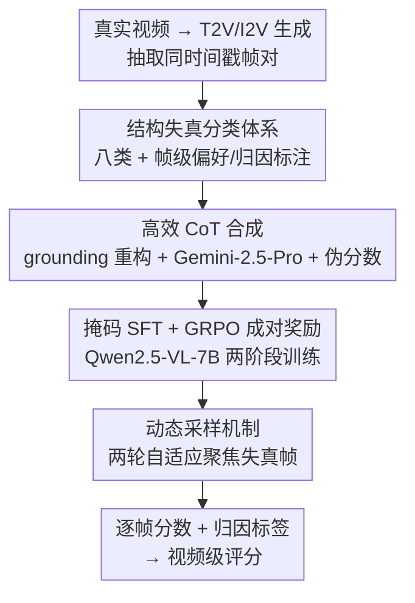

# Thinking with Frames: Generative Video Distortion Evaluation via Frame Reward Model

**会议**: CVPR 2026  
**论文**: [CVF Open Access](https://openaccess.thecvf.com/content/CVPR2026/html/Wang_Thinking_with_Frames_Generative_Video_Distortion_Evaluation_via_Frame_Reward_CVPR_2026_paper.html)  
**领域**: 对齐RLHF / 视频奖励模型  
**关键词**: 视频奖励模型, 结构失真, GRPO, CoT 合成, 帧级评估

## 一句话总结
REACT 是一个面向生成视频「结构失真」的帧级奖励模型：先建一套八类失真分类体系并标注 1.5 万对帧偏好数据，用 grounding 重构 + Gemini-2.5-Pro 低成本合成 6K 条 CoT，再以「掩码 SFT + GRPO 成对奖励」两阶段训练 Qwen2.5-VL-7B，推理时用动态采样聚焦最可能失真的帧，在偏好对齐和失真识别两项任务上都显著超过现有视频/图像评估器。

## 研究背景与动机
**领域现状**：文本到视频（T2V）生成的后训练高度依赖「视频奖励模型」给生成结果打分、做 RL 对齐。VideoScore、VideoReward、UnifiedReward 等主流奖励模型主要评估三件事——视觉质量（VQ）、运动质量（MQ）、文本对齐（TA）。

**现有痛点**：这些奖励模型几乎都忽略了「结构失真」——物体本身的结构性异常，比如肢体缺损/重复/畸形、躯干或面部变形、以及两个物体不自然穿模（mesh penetration）。后果是：一段画面精美、时序流畅但人物多了一只手的视频，照样能拿高分，奖励信号反而把生成模型往错误方向引。

**核心矛盾**：失真评估有两条已有路线都不灵。① 视频级奖励模型采样率太低（常见 2 fps），失真又是空间局部、逐帧才看得清的，低采样率直接漏掉问题帧；而且视频级标注昂贵，难以规模化。② 图像质量评估模型虽研究过结构伪影，但生成图像的伪影是「锐利、边界清晰」的，生成视频的失真却因时序不一致和运动而呈现「模糊、碎裂」的形态，存在显著 domain gap，图像评估器迁移到视频帧上性能大幅下降。

**本文目标**：造一个专门评估生成视频结构失真的奖励模型，既能给出逐帧的连续分数（point-wise score），又能给出可解释的归因标签（哪一类失真、在哪），用来补全现有视频奖励系统的盲区。

**切入角度**：作者选择「帧级」而非视频级——失真本就局部且逐帧可检测，帧级标注更高效，能从有限视频里构造大规模数据；同时借鉴 LLM/MLLM 的 Chain-of-Thought 推理，让模型对每一帧「先想后判」，做细粒度分析。

**核心 idea**：把结构失真评估变成一个「带 CoT 推理的帧级 MLLM 奖励模型」，用一套失真分类体系 + 低成本 CoT 合成喂数据，再用掩码 SFT 注入领域知识、GRPO 成对奖励对齐人类偏好。

## 方法详解

### 整体框架
REACT 的输入是「文本提示 + 单帧」，输出是该帧的 `<think>` 推理过程 + `<answer>{归因标签, 1–5 分}`；推理时再把逐帧分数动态聚合成视频级分数。整条管线分三段：**(a) 数据准备**——建分类体系、采集人工偏好/归因标注、用 grounding 任务低成本合成 CoT；**(b) 奖励模型学习**——以 Qwen2.5-VL-7B 为底座，先掩码 SFT 注入知识，再 GRPO 用成对奖励对齐偏好；**(c) 推理**——动态采样机制自适应挑出最可能失真的帧。

### 关键设计

**1. 结构失真分类体系 + 帧级偏好/归因标注：先定义清楚「失真到底有几种」**

现有奖励模型即便隐含考虑了失真，也缺乏系统的失真分类，导致评估说不清「错在哪」。REACT 先把生成视频的结构失真拆成两大类：**异常外观**（物体形状/结构偏差）和**异常交互**（物体间空间关系违反物理）。外观再细分动物相关与非动物：动物部分分析肢体、躯干、面部三个部位与变形/缺损/重复三种类型，因缺损和重复几乎只发生在肢体上，最终归并为八个具体类别——肢体变形、多余肢体、肢体缺损、躯干变形、面部变形、非动物坍塌畸变、运动模糊、网格穿模。

基于这套体系，作者从社交平台采集**运动复杂**的真实视频（运动越复杂，T2V 越容易失真），用 Kling/HaiLuo/Seedream/Pika/Sora/Luma 等模型生成；对同一 prompt 用两个不同模型生成、配对同时间戳的帧，构造帧级偏好对；并引入 I2V 范式让部分帧对语义相同、只差画质。34 人专业团队（20 标注 + 14 审核）经两轮复审、10% 终检，最终得到约 **15K 帧对（≈30K 帧）**，bbox 准确率 >95%、归因标签准确率 >90%。这套「先定义类目、再帧级标注」的做法，是后续 CoT 合成和奖励计算的事实基础。

**2. 高效 CoT 合成：把「写推理」重构成「画框」，再让闭源大模型补全思维链**

要让 Qwen2.5-VL-7B 学会对失真做 CoT 推理，必须有大量「归因标签 + 逐帧分数 + 推理轨迹」三件套的 CoT 数据。但人工逐条写失真描述既贵又慢，而当前 MLLM 自身又抓不准失真视觉线索，难以自助生成。REACT 的解法是把标注任务**重构成 grounding**：标注员只需在失真区域画 bounding box，大幅降低标注成本、便于质控；然后把「标注帧 + 失真框」喂给 Gemini-2.5-Pro，让它**模拟产生正确归因标签和定位的推理过程**，再按标签/区域准确率过滤，得到 **6K 条高质量 CoT**。

由于数据是帧偏好对、没有绝对分数，作者还按失真标签数**伪造逐帧分数**做数值监督：无失真帧取 $[4.0, 5.0]$、一个标签 $[3.0, 4.0]$、两个标签 $[2.0, 3.0]$、三个及以上 $[1.0, 2.0]$，每个随机取两位小数。这些伪分数虽近似，但能维持与人类排序一致、并在微调时制造分数多样性——而真正的精细数值对齐留给后面的 GRPO 完成。

**3. 掩码 SFT + GRPO 成对奖励：两阶段训练，先注知识不过拟合、再对齐偏好**

直接长时间 SFT 会让模型死记训练 CoT 模板、推理轨迹同质化，反而拖垮后续 GRPO；但 SFT 步数太少又注不进领域知识。作者用**掩码 SFT** 化解这对矛盾：第一个 epoch 用完整 CoT（推理过程 + 标签 + 分数全部计入损失）教模型怎么推断失真；第二个 epoch 把推理轨迹**掩掉**，只对最终归因标签和分数算损失，从而细化标注/打分准确率、又不让模型死板复制固定推理路径，为 RL 保留多样的推理轨迹。

第二阶段用 **GRPO** 提升推理与打分能力。对输入 $q=\{c,f\}$ 采样一组 $G=8$ 个回答，组内归一化算优势：

$$A_i = \frac{R(o_i) - \mathrm{mean}(\{R(o_1),\dots,R(o_G)\})}{\mathrm{std}(\{R(o_1),\dots,R(o_G)\})}$$

由于训练数据只有成对偏好、没有绝对分数，没法直接用「预测分 vs 真值分」算奖励，作者设计了基于 BTT loss 的**成对奖励**：给定帧对 $\{f^A, f^B\}$，对两帧各 rollout 一组，每个 rollout 的奖励由三项组成。**格式奖励** $R_{fmt}$：推理在 `<think></think>`、答案在 `<answer></answer>` 内则记 1，否则 0。**归因准确奖励**：

$$R_{attr}(o_i^j) = 0.6 \cdot a_{right} - 0.2 \cdot (a_{wrong} + a_{missing})$$

其中 $a_{right}/a_{wrong}/a_{missing}$ 分别是答对/答错/漏掉的归因标签数。**偏好奖励**：不直接比预测分给二值奖励，而是用两帧的预测分 $s_i^A, s_i^B$ 算成对偏好概率（含「打平」选项，平局倾向超参 $\theta=5$，沿用 VideoReward），形如 $P(o_i^A \succ o_i^B|c) = \frac{e^{s_i^A}}{\theta e^{s_i^A}+e^{s_i^B}}$（⚠️ 分母具体形式以原文为准），再按真值偏好取对数似然：

$$R_{pref} = \mathbb{I}(f^A \succ f^B)\log P(o^A \succ o^B) + \mathbb{I}(f^A \prec f^B)\log P(o^A \prec o^B) + \mathbb{I}(f^A = f^B)\log P(o^A = o^B)$$

最终奖励是三项加权 $R(o_i^j) = \lambda_1 R_{fmt} + \lambda_2 R_{attr} + \lambda_3 R_{pref}$。这套设计让模型在只有「成对偏好 + 归因标签」、缺绝对分数的情况下，依然能用 GRPO 把逐帧打分校准到人类偏好上。

**4. 动态采样机制：固定采样预算下，把镜头对准最可能失真的帧**

固定间隔采样（按 fps）在低采样率时容易漏掉关键失真帧；而生成视频时序一致性强，相邻帧失真往往相关。REACT 推理时用**两轮自适应采样**：第一轮以一半 fps 均匀采样、用模型打分，再根据分数分布分三种情况处理——若所有帧都高于高阈值（基本无失真），第二轮在已采帧之间稀疏补采；若有帧低于低阈值（存在失真），就在这些帧附近以 1/4 fps 间隔加密采样；若高低混杂，则优先挑低于均值的帧、在其附近 1/4 fps 内随机补两帧。最后把两轮分数平均得到视频级分。如此在**不增加采样总数**的前提下，提高了命中问题帧的概率。

### 损失函数 / 训练策略
底座 Qwen2.5-VL-7B。SFT 用 LoRA（rank 32）、学习率 5e-4、AdamW（weight decay 0.01）、batch 64，第一 epoch 用完整响应、第二 epoch 掩掉推理轨迹。GRPO 学习率 1e-6、rollout 组 $G=8$、训练 300 步、rollout batch 256、更新 mini-batch 64。推理时按 2 fps 配合动态采样，统一在 REACT-Bench 上评测。

## 实验关键数据

### 主实验
评测基准 REACT-Bench 含两个子集：REACT-Video（500 对人工标注视频对，做偏好对齐）和 REACT-Frame（2.1K 标注帧，做失真识别）。

**人类偏好对齐**（REACT-Video，准确率越高越好）：

| 类型 | 模型 | Acc w/ Tie | Acc w/o Tie |
|------|------|-----------|------------|
| 视频评估器 | VideoScore2 | 0.342 | 0.521 |
| 视频评估器 | VideoReward | 0.415 | 0.551 |
| 视频评估器 | UnifiedReward（最强 baseline） | 0.416 | 0.701 |
| 图像评估器 | VisualQuality-R1 | 0.376 | 0.610 |
| 通用 MLLM | Gemini-2.5-Pro | 0.370 | 0.534 |
| **本文** | **REACT** | **0.610** | **0.813** |

REACT 把 overall 准确率从最强 baseline 的 0.416/0.701 拉到 0.610/0.813，相对提升约 20–40%，验证「显式建模结构失真」的必要性。

**失真识别**（REACT-Frame，F1 越高越好）：

| 模型 | 失真帧 F1 | 正常帧 F1 |
|------|----------|----------|
| GPT-o3 | 0.641 | 0.379 |
| Gemini-2.5-Pro | 0.650 | 0.335 |
| MagicAccessor（SOTA 图像评估器） | 0.554 | 0.285 |
| Qwen2.5-VL-7B（底座） | 0.162 | 0.292 |
| **REACT** | **0.845** | **0.671** |

通用 MLLM 和图像评估器普遍是「失真帧高 precision、正常帧高 recall」，但 F1 低——说明它们倾向把失真帧误判为正常；REACT 在两类帧上 F1 都大幅领先。

### 消融实验
| 配置 | Acc w/ Tie | Acc w/o Tie | 说明 |
|------|-----------|------------|------|
| REACT（默认） | 0.610 | 0.813 | 完整模型 |
| RL w/o SFT | 0.387 | 0.513 | 不做 SFT 直接 GRPO，大幅掉点 |
| RL w/o $R_{pref}$ | 0.352 | 0.514 | 偏好奖励换二值奖励，明显变差 |
| REACT w/o DS | 0.519 | 0.725 | 去掉动态采样 |

失真识别任务上对 SFT 策略的消融：SFT 1 epoch 失真帧 F1=0.557 → 2 epoch 无掩码 0.690 → 2 epoch 带掩码 0.764，再上 GRPO 到 0.845，逐级抬升。

### 关键发现
- **SFT 是 GRPO 的前提**：RL w/o SFT 从 0.610 暴跌到 0.387，因为 Qwen2.5-VL-7B 自己生成的分数多样性差，GRPO 高度依赖 rollout 轨迹质量——必须靠 SFT 的伪分数先把打分能力「点燃」。
- **成对偏好奖励 > 二值奖励**：把 $R_{pref}$ 换成「对/错记 0/1」直接掉到 0.352，说明用概率化的成对似然比硬阈值更能传递细粒度偏好信号。
- **掩码损失是 SFT 阶段的关键 trick**：第二 epoch 掩掉推理轨迹，把失真帧 F1 从 0.690 推到 0.764，既注了知识又避免死记 CoT 模板。
- **动态采样稳定加分**：固定采样预算下，聚焦失真帧把偏好对齐从 0.519 提到 0.610。

## 亮点与洞察
- **把奖励建模的盲区说清楚了**：现有视频奖励模型只看 VQ/MQ/TA，对「多一只手、穿模」这类结构失真睁眼瞎；REACT 用一张八类分类体系把问题定义清楚，再针对性建模——选题本身就切中 T2V 后训练的真实痛点。
- **grounding 重构 CoT 标注，是可复用的省钱 trick**：与其让标注员写一大段失真描述，不如只画框、再让闭源大模型补全思维链，6K 高质量 CoT 成本骤降。这个「人画框、大模型写理由」的范式可迁移到任何需要细粒度 CoT 监督的视觉任务。
- **没有绝对分数也能做 GRPO 打分对齐**：用 BTT 成对偏好概率构造奖励，绕过「缺 point-wise 真值」的限制，对很多只有偏好对、没有连续标注的场景很有借鉴价值。
- **伪分数 + GRPO 的分工**：SFT 用按标签数随机生成的粗伪分数先制造多样性，把精细数值对齐留给 GRPO——这种「粗启动、细对齐」的分层思路值得借鉴。

## 局限与展望
- **本质是逐帧、缺时序语义**：REACT 在单帧上推理，作者自己承认无法处理需要时序信息的问题，如闪烁（flash）或物体突然消失——这类失真恰恰是视频特有的，未来需把推理扩展到时空语义。
- **伪分数的近似性**：逐帧分数靠「标签数 → 区间随机」生成，区间边界（如 1 个标签 [3,4]）是人为设定，不同失真严重度差异被压平，可能给 GRPO 的偏好对齐引入噪声。
- **依赖闭源大模型与重人工**：CoT 由 Gemini-2.5-Pro 合成、15K 帧对靠 34 人团队标注，复现成本高；分类体系也偏向人/动物外观失真，对更广义物理违反（如光影、流体）覆盖有限。
- **公式与表述存在排版瑕疵**：缓存中偏好概率的分母形式、部分奖励符号存在 OCR/排版噪声，建议以原文公式为准。

## 相关工作与启发
- **vs VideoReward / VideoScore2 / UnifiedReward**：它们是视频级奖励模型，评 VQ/MQ/TA，采样率低、对结构失真不敏感；REACT 走帧级 + 显式失真建模，在偏好对齐上把 overall 从 0.42/0.70 提到 0.61/0.81，定位是「补全」而非替代它们。
- **vs VisualQuality-R1 / Q-Insight / MagicAccessor（图像评估器）**：它们擅长生成图像的锐利伪影，但因生成视频失真模糊碎裂的 domain gap，迁移到视频帧上 F1 大幅下降；REACT 专门在视频帧上训练，跨越了这道 gap。
- **vs 通用 MLLM（Gemini-2.5-Pro / GPT-o3 / Qwen2.5-VL）**：通用 MLLM 缺失真领域知识，倾向把失真帧判成正常（高 precision 低 recall）；REACT 通过分类体系 + CoT 合成 + 两阶段训练注入了专门知识。
- **方法谱系**：训练范式承接 GRPO（DeepSeek 系）+ BTT 成对偏好损失（VideoReward），创新点在于把它们组合进「帧级失真奖励」这一新场景，并配以掩码 SFT 和动态采样。

## 评分
- 新颖性: ⭐⭐⭐⭐ 首个面向生成视频结构失真的帧级奖励模型，分类体系 + grounding CoT 合成 + 成对奖励的组合有清晰新意。
- 实验充分度: ⭐⭐⭐⭐ 自建 REACT-Bench 双子集，主实验 + 多维消融充分，且补了 GenAI-Bench/VBench 等外部验证（附录）。
- 写作质量: ⭐⭐⭐⭐ 动机与帧级 vs 视频/图像的对比讲得清楚，方法分段合理；缓存版有少量公式排版噪声。
- 价值: ⭐⭐⭐⭐ 直接补全 T2V 后训练奖励系统的失真盲区，CoT 标注省钱 trick 与无绝对分数的 GRPO 对齐均可复用。

<!-- RELATED:START -->

## 相关论文

- [\[ACL 2025\] Rethinking Reward Model Evaluation Through the Lens of Reward Overoptimization](../../ACL2025/llm_alignment/rethinking_reward_model_evaluation_through_the_lens_of_reward_overoptimization.md)
- [\[CVPR 2026\] DRM: Diffusion-based Reward Model With Step-wise Guidance](drm_diffusion-based_reward_model_with_step-wise_guidance.md)
- [\[AAAI 2026\] GRAM-R²: Self-Training Generative Foundation Reward Models for Reward Reasoning](../../AAAI2026/llm_alignment/gram-r2_self-training_generative_foundation_reward_models_for_reward_reasoning.md)
- [\[CVPR 2026\] Unlocking Token Rewards via Training-Free Reward Attribution](unlocking_token_rewards_via_training-free_reward_attribution.md)
- [\[ACL 2026\] ConsistRM: Improving Generative Reward Models via Consistency-Aware Self-Training](../../ACL2026/llm_alignment/consistrm_improving_generative_reward_models_via_consistency-aware_self-training.md)

<!-- RELATED:END -->
