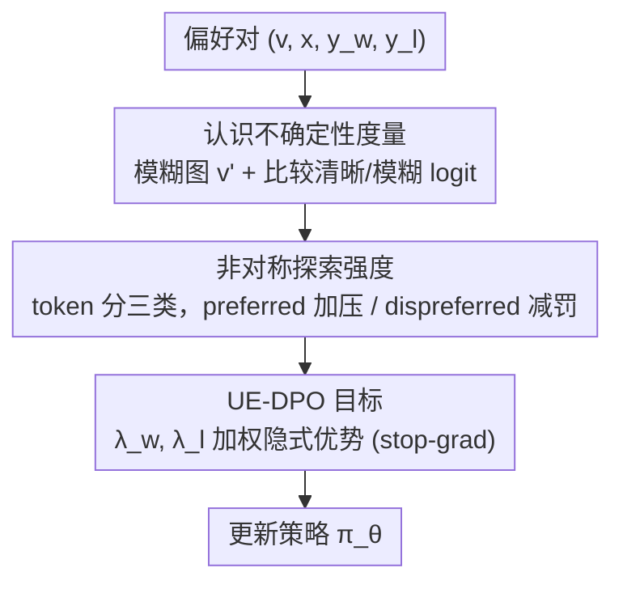

# Uncertainty-Aware Exploratory Direct Preference Optimization for Multimodal Large Language Models

**会议**: CVPR 2026  
**论文**: [CVF Open Access](https://openaccess.thecvf.com/content/CVPR2026/html/Zhang_Uncertainty-Aware_Exploratory_Direct_Preference_Optimization_for_Multimodal_Large_Language_Models_CVPR_2026_paper.html)  
**代码**: https://github.com/htzhang-code/UE-DPO  
**领域**: 对齐RLHF / 多模态VLM  
**关键词**: DPO、多模态大模型、幻觉抑制、认识不确定性、token 级信用分配

## 一句话总结
UE-DPO 把多模态大模型（MLLM）幻觉抑制的优化重心，从"模型已经看得懂的视觉敏感 token"挪向"模型看不懂、却很关键的认知盲区 token"——用 token 级**认识不确定性**（epistemic uncertainty）量化这些盲区，再按不确定性给 preferred / dispreferred 两支非对称地调节 DPO 梯度强度，在多个幻觉 benchmark 上以更小数据量超过 TPO/V-DPO 等同类方法。

## 研究背景与动机

**领域现状**：MLLM 把视觉编码器和大语言模型拼起来，视觉理解能力很强，但普遍存在**幻觉**——输出里描述了图里根本没有的东西。主流缓解路线是把"视觉-语言对齐"框成偏好学习，用 DPO 从 (preferred, dispreferred) 偏好对里把模型往"忠于图像"的方向拉。其中一条更细的路线做**细粒度信用分配**：DPO 原始 loss 只给序列级反馈，无法把"这句话好/不好"归因到具体 token，于是 TPO、V-DPO 等方法引入 token 级的"视觉敏感度"信号（图像被遮挡/模糊后 token 概率掉多少），给视觉相关 token 额外加权。

**现有痛点**：这些方法用的"视觉敏感度"是**正在训练、还不靠谱的模型自己估出来的**。问题在于——模型对某个 token 表现出高敏感度，恰恰说明这部分视觉信息它**已经会用了**；继续往这些"已掌握"的 token 上加压，只是让模型对熟悉线索越来越敏感。真正限制幻觉进一步下降的，是那些**视觉敏感度低、模型其实没看懂、却很关键**的 token（论文图 1 里"船 ships"那种背景物体），它们恰恰被分到了最弱的优化压力。

**核心矛盾**：用"模型已掌握的敏感度"来指导学习，会陷入**自我指涉偏差**（self-referential bias）——强化已会的、忽视没会的，对齐永远停在浅层。

**本文目标**：换一个度量信号，专门把优化压力导向模型的**认知缺陷**（cognitive deficiencies）而不是已掌握的视觉敏感度；并且要在 preferred 和 dispreferred 两支上分别处理，避免训练时误伤已学好的知识。

**切入角度**：作者从**认识不确定性**入手——如果给模型一张清晰的图，它对某个视觉相关 token 的置信度反而**低于**"把图模糊掉、让语言先验主导"时预测出的 token，那说明模型对这块视觉内容根基不牢，处于"猜"的状态。这种"清晰图反而不如模糊图"的反差，正好定位了认知盲区。

**核心 idea**：用 token 级认识不确定性代替视觉敏感度来分配 DPO 优化压力——给 preferred 样本里高不确定性的盲区 token 加压去"探索自纠"，同时减轻 dispreferred 样本里对有益视觉知识的过度惩罚，并证明这等价于在 reverse-KL 正则 RL 目标里引入逐 token 熵正则、重塑出一个"广义探索优势"。

## 方法详解

### 整体框架
给定一条偏好数据 $(v, x, y_w, y_l)$（图像、prompt、preferred 回答、dispreferred 回答），UE-DPO 先把图像加扩散噪声得到模糊版 $v'$，对回答里每个 token 同时算两个信号：**认识不确定性** $u$（清晰图下该视觉 token 的置信度是否还不如模糊图下语言先验给出的 token）和**视觉敏感度** $\Delta$（图模糊前后该 token 的 logit 变化）。再用这两个信号把 token 分成三类，对 preferred / dispreferred 两支**非对称地**算出探索强度系数 $\lambda_w, \lambda_l$，把它们以 stop-gradient 形式塞进 DPO 的隐式优势里加权梯度，最后更新策略 $\pi_\theta$。整套流程不改 DPO 的数据和框架，只重塑了"哪些 token 该多学、哪些该少罚"。

### 关键设计

**1. 认识不确定性度量：用"清晰图反而不如模糊图"定位认知盲区**

要把压力导向"模型没看懂"的 token，先得有个量化"没看懂"的指标。论文的做法是制造一组对照：把清晰图 $v$ 加扩散噪声得到模糊图 $v'$，

$$v'(k) = \sqrt{\bar\xi_k}\, v + \sqrt{1-\bar\xi_k}\,\epsilon$$

模糊后视觉证据被削弱、语言先验更容易主导预测。于是在时间步 $t$，认识不确定性定义为模糊图下模型最想预测的 token $\hat a_t(v')$ 与真实视觉 token $a_t$ 在**清晰图**下的 logit 之差：

$$u(s_t, a_t) = \mathrm{logit}_\theta(\hat a_t(v')\mid v,x,y_{<t}) - \mathrm{logit}_\theta(a_t\mid v,x,y_{<t})$$

直觉很清楚：如果给了清晰图，模型对真实视觉 token 的置信度居然还**低于**"靠语言先验猜"出来的 token（$u>0$ 且偏大），说明这块视觉内容模型根本没扎下根、是在猜。$u$ 越大 = 盲区越深。这跟传统"视觉敏感度"的本质区别是：敏感度高只代表"图变化会影响输出"（往往是已掌握的内容），而 $u$ 高代表"清晰图也救不了，模型在用语言先验补窟窿"——后者才是真正卡住对齐的认知缺陷。

**2. 非对称探索强度：preferred 加压探索、dispreferred 减罚护知识**

光有不确定性还不够，preferred 和 dispreferred 两支的语义完全相反，得分开处理。论文先用图模糊前后的 logit 变化定义**视觉敏感度** $\Delta(s_t,a_t)=\mathrm{logit}_\theta(a_t\mid v,\cdots)-\mathrm{logit}_\theta(a_t\mid v',\cdots)$，再分两支：

*Preferred 支*——挑出**视觉不敏感**的 token（$\Delta$ 落在低分位 $q_\tau$ 以下，记 $I_w=1$）。这些 token 又分两种：高不确定性的是"本该用视觉却退回语言先验去猜"的盲区（Type-I，要加压），低不确定性的是合理的语言依赖（Type-II，别动）。探索强度写成：

$$\lambda_w(s_t,a_t) = 1 + \alpha\, \mathbb{1}\{I_w=1\}\,\sigma\!\left(\frac{u(s_t,a_t)-\mu_I}{\varsigma_I}\right)$$

其中 $\alpha$ 控制强度尺度，$\mu_I,\varsigma_I$ 是满足 $I_w=1$ 的 token 的不确定性首分位与标准差。效果是：只给高不确定性的"猜"出来的盲区 token 加压探索，低不确定性的稳定 token 维持原样，不破坏模型对语言先验的正当使用。

*Dispreferred 支*——dispreferred 回答里并非全是错的，里面那些**视觉敏感**的 token（$\Delta\ge q_{1-\tau}$，记 $I_l=1$）若同时高不确定，说明模型本就摇摆，此时如果照常重罚，会把模型刚学到的视觉认知又抹掉。于是按不确定性**减轻惩罚**：

$$\lambda_l(s_t,a_t) = 1 - \alpha\, \mathbb{1}\{I_l=1\}\,\sigma\!\left(\frac{u(s_t,a_t)-\mu_I}{\varsigma_I}\right)$$

不确定性越大、认知退化风险越高，就把惩罚按比例缩得越多，给模型留出继续探索这块知识的余地。一加一减、形式对称但方向相反，这就是"非对称"的含义。

**3. UE-DPO 目标与广义探索优势：把 λ 塞进隐式优势并给出理论根据**

两支的 $\lambda$ 最终以 stop-gradient 方式作为指数权重塞进 DPO 的 log 比值里：

$$\mathcal{L}_{\text{UE-DPO}} = -\mathbb{E}_{(x,y_w,y_l)\sim\mathcal D}\,\log\sigma\!\Big(\beta\sum_t \log\frac{\pi_\theta(a^w_t\mid s_t)^{\mathrm{sg}[\lambda_w]}}{\pi_{\text{ref}}(a^w_t\mid s_t)} - \beta\sum_t \log\frac{\pi_\theta(a^l_t\mid s_t)^{\mathrm{sg}[\lambda_l]}}{\pi_{\text{ref}}(a^l_t\mid s_t)}\Big)$$

$\mathrm{sg}[\cdot]$ 表示对 $\lambda$ 停梯度——它只当权重不参与求导。训练时这等价于把 preferred 盲区 token 的梯度 $\lambda_w\nabla_\theta\log\pi_\theta$ 放大、把 dispreferred 敏感 token 的惩罚梯度按 $\lambda_l$ 缩小。

理论上，论文证明引入 $\lambda$ 相当于在 reverse-KL 正则 RL 目标里加了一个**逐 token 熵正则因子**，动态调节每个 token 的 KL 约束强度，得到重写后的最优策略 $\pi^*(a\mid s)=\pi_{\text{ref}}(a\mid s)^{1/\lambda}\exp(\cdot)/Z(s)$。对那些 $Q^*$ 高、参考概率 $\pi_{\text{ref}}$ 低的"高价值欠认知"视觉 token，较大的 $\lambda$ 能对 $\pi_{\text{ref}}$ 施加更强的修正，让目标策略**摆脱参考模型自带的视觉缺陷先验**。进一步，最优优势被推广成**广义探索优势** $A^*_e = \underbrace{Q^*(s,a)-V^*(s)}_{\text{常规价值优势}} - \underbrace{\beta(\lambda - \mathbb{E}_{a'\sim\pi^*}[\lambda'])}_{\text{探索代价}}$——比标准 DPO 多了一项把探索强度当作代价的项，这是 UE-DPO 与原始 DPO 的根本区别（⚠️ 完整推导见原文附录 C/D，此处为要点转述，细节以原文为准）。

### 损失函数 / 训练策略
backbone 用 LLaVA-v1.5-7B/13B 与 Qwen2.5-VL-3B；偏好数据用人反馈集 RLHF-V 与 AI 反馈集 RLAIF-V。LoRA 微调（rank 128），最大学习率 1e-5 + cosine 退火，batch 64（梯度累积），训 2 个 epoch。探索强度 $\alpha$：7B 用 0.3、13B 用 0.25、Qwen2.5-VL-3B 用 0.15（模型越强、需要的探索强度越小）；DPO 的 $\beta=0.1$；扩散噪声步 $k=500$。最多 4 张 A100。

## 实验关键数据

### 主实验
在 Object-HalBench、MMHal-Bench、AMBER（生成 g / 判别 d）等幻觉 benchmark 上对比同类偏好学习方法。下表摘 LLaVA-v1.5-7B 的代表性结果（↓ 越低越好、↑ 越高越好）：

| 方法 (7B) | 数据量 | Obj-Hal CHAIRs↓ | CHAIRi↓ | MMHal Score↑ | MMHal HalRate↓ | AMBER-g CHAIR↓ | AMBER-d F1↑ |
|--------|------|------|------|------|------|------|------|
| LLaVA-v1.5-7B（基线） | – | 55.67 | 15.96 | 2.01 | 0.61 | 7.7 | 74.3 |
| mDPO | 10k | 35.70 | 9.80 | 2.39 | 0.54 | 4.4 | – |
| V-DPO† | 5.7k | – | – | 2.16 | 0.56 | 5.6 | 81.6 |
| TPO† | 5.7k | – | – | 2.47 | 0.51 | – | 85.0 |
| RLAIF-V | 16k | 16.0 | 3.70 | 3.00 | 0.38 | 3.0 | – |
| **UE-DPO†（RLHF-V）** | 5.7k | 13.72 | 6.69 | 2.82 | 0.48 | 2.9 | 85.7 |
| **UE-DPO（RLAIF-V）** | 16k | **11.62** | 5.16 | 2.95 | **0.37** | **2.5** | **87.0** |

†表示与 UE-DPO 同数据集训练。在**仅 5.7k** 数据（RLHF-V）下，UE-DPO 的 MMHal Score 与 AMBER-d F1 就已超过同设定的 TPO/V-DPO；Object-Hal 的 CHAIRs 几乎砍掉一半。换更大的 RLAIF-V（16k）后几乎所有指标继续走强。13B 与 Qwen2.5-VL-3B 上同样取得各 backbone 的最低幻觉率（如 Qwen2.5-VL-3B 上 CHAIRs 从 DPO 的 30.6 进一步降到 16.7）。

### 消融实验
两支探索控制的贡献（LLaVA-v1.5-7B，RLHF-V）：

| 配置 | MMHal Score↑ | MMHal HalRate↓ | AMBER CHAIR↓ | 说明 |
|------|------|------|------|------|
| DPO | 2.26 | 0.60 | 3.7 | 原始 DPO |
| w/o pref. | 2.51 | 0.55 | 3.6 | 只在 dispreferred 支控制 |
| w/o dispref. | 2.73 | 0.50 | 2.8 | 只在 preferred 支控制 |
| **UE-DPO** | **2.82** | **0.48** | 2.9 | 两支都控制 |

强度因子 $\alpha$ 与敏感度阈值 $\tau$ 的扫描（LLaVA-v1.5-7B）：

| 超参 | 取值 | MMHal Score↑ | AMBER CHAIR↓ | 说明 |
|------|------|------|------|------|
| $\alpha$ | 0.20 / 0.30 / 0.40 | 2.70 / **2.82** / 2.76 | 3.2 / **2.9** / 3.5 | 0.30 最优，区间内较稳健 |
| $\tau$ | 0.3 / 0.4 / 0.5 | 2.63 / **2.82** / 2.74 | 3.3 / **2.9** / 3.2 | 0.4 最优 |

### 关键发现
- **preferred 支是主引擎**：单用 preferred 支（w/o dispref.）就把 MMHal Score 从 DPO 的 2.26 拉到 2.73、CHAIR 从 3.7 降到 2.8；dispreferred 支的减罚是辅助增益（单用提升弱），两支合用最均衡。
- **只调不到一半 token 反而更好**：$\tau\approx0.4$ 意味着只对不到 50% 的 token 重新分配学习压力就拿到最佳成绩，而以往 credit 自估方法是调全部 token——说明 UE-DPO 的选择性信用分配更高效、更聚焦。
- **AMBER-d 的 Acc/F1 权衡**：在 RLHF-V 上 F1 领先但 Acc 略降，作者解释为模型变保守、少给"yes"导致真阳性减少；换更大覆盖的 RLAIF-V 后 Acc 和 F1 一起回升，说明该判别 benchmark 对数据规模/覆盖很敏感。
- **可视化佐证动机**：热图显示高视觉敏感的 token 往往低不确定性（已内化），而低敏感 token 仍可高不确定（语义没吃透）；不确定性信号更稀疏、更有针对性。

## 亮点与洞察
- **"清晰图反而不如模糊图"这个对照设计很巧**：用扩散噪声造一个语言先验主导的反事实，把"模型在猜"这件难量化的事变成一个可计算的 logit 差，定位认知盲区，比依赖模型自评的视觉敏感度更不容易自我强化。
- **把幻觉抑制重新框成"补认知缺陷"而非"强化已会的"**：这个视角转换是全文最"啊哈"的地方——它点破了 credit 自估类方法的自我指涉陷阱，且不需要任何额外标注或数据构造。
- **理论与工程对得上**：$\lambda$ 既是工程上的梯度权重，又被证明等价于逐 token 熵正则、重塑出广义探索优势，给"为什么加压能摆脱参考模型缺陷"提供了闭式解释，不是纯启发式。
- **可迁移**："用反事实输入（模糊图/去图/换模态）测模型是否真在用某模态" 这套不确定性度量，可迁移到任何多模态对齐/信用分配任务，甚至纯文本 RLHF 里"模型是否真在用上下文"也能照搬。

## 局限与展望
- **依赖模糊图作为反事实**：扩散噪声等级、噪声步 $k$ 都是手调超参，模糊得太狠/太轻都会让 $u$ 失真；对不同图像内容是否需要自适应噪声，论文没探讨。
- **小目标感知瓶颈**：作者在可视化里坦承，对图中远景小物体，方法虽能标出"低敏感+高不确定"并触发探索，但受限于 backbone 本身的感知瓶颈，未必真能学会——度量到位不等于能力到位。
- **AMBER-d Acc 在小数据上掉点**：保守化带来的 Acc 下降说明该方法在判别型、细节敏感任务上还有提升空间，需更大覆盖数据兜底。
- **超参偏多**：$\alpha,\tau,\beta,k,\xi$ 都要调，且 $\alpha$ 随 backbone 能力变化，缺一个自适应机制时迁移到新模型仍需扫参。

## 相关工作与启发
- **vs TPO / V-DPO（credit 自估）**：它们用模型自评的"视觉敏感度/视觉锚定奖励"加权 token，本文指出这会强化已掌握线索、陷入自我指涉偏差；UE-DPO 改用认识不确定性把压力导向盲区，且只调不到一半 token。同设定 5.7k 数据下 UE-DPO 的 MMHal/AMBER-d 指标更优。
- **vs mDPO / POVID / RLHF-V（数据构造路线）**：这些靠 GPT-4V 注错、模糊图造负样本或分段标注来构造偏好对，UE-DPO 不改数据、只改 token 级信用分配，正交且可叠加。
- **vs 原始 DPO**：DPO 把隐式优势当作即时奖励拟合序列级偏好；UE-DPO 在其上引入 $\lambda$ 加权，理论上重塑出含"探索代价"项的广义探索优势，使目标策略能偏离参考模型的视觉缺陷先验。
- **vs 训练无关解码/注意力纠正路线**：post-hoc 纠正、注意力 rectification、对比解码等不触及视觉-语言对齐根因，UE-DPO 在训练阶段从根上修对齐。

## 评分
- 新颖性: ⭐⭐⭐⭐⭐ "从视觉敏感度转向认知缺陷"的视角 + 清晰/模糊图对照的不确定性度量，切口新且抓到了 credit 自估的本质缺陷。
- 实验充分度: ⭐⭐⭐⭐ 覆盖 3 个 backbone、2 个偏好数据集、4 个幻觉 benchmark，消融到位；但缺与数据构造类方法的叠加实验，AMBER-d Acc 短板也只解释未解决。
- 写作质量: ⭐⭐⭐⭐ 动机推导清晰、理论与方法咬合紧；公式较密、token 三类划分初读需对照图 2。
- 价值: ⭐⭐⭐⭐ 即插即用、不增数据、小数据量见效，对做 MLLM 对齐/幻觉抑制有直接参考价值。

<!-- RELATED:START -->

## 相关论文

- [\[ACL 2026\] S2H-DPO: Hardness-Aware Preference Optimization for Vision-Language Models](../../ACL2026/llm_alignment/s2h-dpo_hardness-aware_preference_optimization_for_vision-language_models.md)
- [\[ICCV 2025\] Heuristic-Induced Multimodal Risk Distribution Jailbreak Attack for Multimodal Large Language Models](../../ICCV2025/llm_alignment/heuristic-induced_multimodal_risk_distribution_jailbreak_attack_for_multimodal_l.md)
- [\[ACL 2026\] Topology-Enhanced Alignment for Large Language Models: Trajectory Topology Loss and Topological Preference Optimization](../../ACL2026/llm_alignment/topology-enhanced_alignment_for_large_language_models_trajectory_topology_loss_a.md)
- [\[ACL 2026\] Mitigating Selection Bias in Large Language Models via Permutation-Aware GRPO](../../ACL2026/llm_alignment/mitigating_selection_bias_in_large_language_models_via_permutation-aware_grpo.md)
- [\[ICLR 2026\] GuardAlign: Test-time Safety Alignment in Multimodal Large Language Models](../../ICLR2026/llm_alignment/guardalign_test-time_safety_alignment_in_multimodal_large_language_models.md)

<!-- RELATED:END -->
