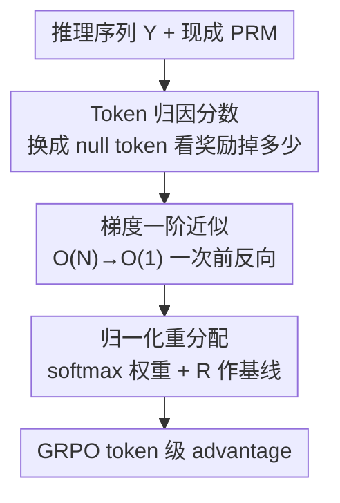

# Unlocking Token Rewards via Training-Free Reward Attribution

**会议**: CVPR 2026  
**论文**: [CVF Open Access](https://openaccess.thecvf.com/content/CVPR2026/html/Wu_Unlocking_Token_Rewards_via_Training-Free_Reward_Attribution_CVPR_2026_paper.html)  
**代码**: https://github.com/JIA-Lab-research/P2T  
**领域**: 对齐RLHF / LLM推理 / 多模态VLM  
**关键词**: token级奖励, 奖励归因, 免训练, 信用分配, GRPO

## 一句话总结
P2T 用一阶 Taylor 近似，把已有过程奖励模型（PRM）打出的「整段」奖励**免训练地**拆解到每个 token 上——只需一次前向+反向就能算出全序列的 token 级奖励，接到 GRPO 后让数学/多模态推理 RL 训练收敛快约 4×、且在 AIME24 上比 outcome reward 提升 +11.5%。

## 研究背景与动机
**领域现状**：强化微调（RFT）是当下提升大模型推理能力的主力范式，监督信号主要有两种——只看最终答案对错的 **outcome reward**，以及训练一个过程奖励模型（PRM）逐步打分的 **process reward**。

**现有痛点**：这两种奖励本质都是「粗粒度」的。outcome reward 只在序列末尾给一个标量，导致**奖励稀疏**：一条大体正确、只错一步的推理链会被整体惩罚，正确的前缀也跟着背锅；早期错误步骤却可能因为最终答案碰巧对了而被错误强化。process reward 虽然细到「步」，但一步里仍有成百上千个 token，步级分数对这些 token 依旧含糊。

**核心矛盾**：要真正做到 token 级信用分配，现有两条路都不通——① 训练专门的 token 级奖励模型，要么依赖弱/无监督造的伪标签（噪声大、可信度存疑），要么需要昂贵的大规模人工标注，根本不现实；② 用便宜的启发式代理（如 token 熵）当奖励，计算省但**和真实 token 质量没有语义对齐**，只是松散相关的 heuristic，不是有原则的奖励估计。于是 token 级监督陷入两难：要么花大价钱换不靠谱的模型，要么用不准的代理信号牺牲优化保真度。

**核心 idea**：作者提出 **process-to-token（P2T）奖励归因**——不再去训练任何新模型，而是把「任意可微的粗粒度奖励模型（如 PRM）」已经学到的知识**直接拆解**到 token。每个 token 的奖励＝它对整段奖励的「边际贡献」，并用梯度一阶近似把这件原本要 $O(N)$ 次前向的事压成 $O(1)$。

## 方法详解

### 整体框架
P2T 的输入是一条已经生成好的推理序列 $Y=(y_1,\dots,y_N)$ 及其 embedding $E=[e_1,\dots,e_N]$，以及一个**现成的、可微的**奖励模型 $R(\cdot)$（实践中用 PRM 给出过程奖励 $R$）；输出是每个 token 的 token 级奖励 $R^{\text{P2T}}_i$，再喂给 GRPO 做 token 级 advantage 计算。整条管线分三步：先**定义**每个 token 的「归因分数」$\mathcal{I}_i$（把它换成无意义的 null token 后，整段奖励掉了多少）；再用**一阶 Taylor 近似**把这个原本要逐 token 替换、跑 $N$ 次前向的归因，压缩成一次前向+反向就同时算出全部 token 的近似值；最后把归因分数 softmax 归一化、按权重把粗粒度奖励 $R$ **重分配**回各 token，并保留 $R$ 作为基线防噪声。

### 关键设计

**1. Token 归因分数：用「换成 null token 掉多少奖励」量化每个 token 的边际重要性**

针对「outcome/process 奖励太粗、说不清单个 token 好坏」的痛点，作者给每个 token $y_i$ 定义一个归因分数 $\mathcal{I}_i$：把它的 embedding $e_i$ 替换成一个专门的 null token embedding $e_\varnothing$（序列长度不变），看整段奖励的变化量：

$$\mathcal{I}_i = R(E) - R(E_{i\leftarrow\varnothing})$$

$\mathcal{I}_i>0$ 说明换掉它奖励下降、即 $y_i$ 是正贡献者；$\mathcal{I}_i<0$ 说明它在拖后腿；接近 0 则边际可忽略。这给了一个**直接、局部**的 token 重要性度量，且天然继承 PRM 的可信判断。null token 的选择也有讲究：作者选词表里已有的 **padding token [PAD]** 当 $e_\varnothing$——因为它在 Transformer 里本就被设计成「无语义、只用来补长度」，且注意力常被 mask 掉、与其他 token 交互极小，恰好满足「空输入」的要求，比随便塞个 zero embedding 更合理（消融里 [PAD] 53.8 > zero embedding 51.4 > mean of vocab 52.5）。

**2. 一阶 Taylor 梯度近似：把 $O(N)$ 次前向压成一次前向+反向**

定义虽简洁，但直接算要对长度 $N$ 的序列跑 $N$ 次前向（每个位置换一次 null token），大规模 RL 训练里完全不可行。作者在 $e_i$ 处对奖励做一阶 Taylor 展开：

$$\mathcal{I}^{\text{Grad}}_i \approx \nabla_{e_i} R(E)^\top (e_i - e_\varnothing)$$

也就是「奖励对该 token embedding 的梯度」与「原 embedding 和 null embedding 之差」的内积。关键在于：一次反向传播就能同时拿到所有 token embedding 的梯度，于是**全序列所有 token 的归因分数在一次前向+反向里一并算完**，复杂度从 $O(N)$ 直降到 $O(1)$。这是整套方法能落地到大规模训练的命门——没有它，归因再准也用不起。消融里这个近似（53.8）甚至略好于朴素逐 token 替换的精确算法（vanilla 52.6），说明近似不仅省、还顺带平滑了噪声。

**3. 归一化重分配 + 粗奖励基线：把抖动的归因分数变成稳定可用的 token 奖励**

针对「梯度近似出来的 $\mathcal{I}_i$ 本身可能含噪、不能直接当奖励」的问题，作者不把 $\mathcal{I}_i$ 当奖励用，而是 softmax 归一化后当权重，去**重分配**原始的粗粒度奖励 $R$：

$$R^{\text{P2T}}_i = R + \omega \cdot R \cdot \frac{\exp(\mathcal{I}_i)}{\sum_{j=1}^N \exp(\mathcal{I}_j)}$$

两个设计点很关键：一是 softmax 归一化保证「所有 token 奖励之和恰好等于原序列奖励 $R$」，让 $R$ 严格按各 token 的边际贡献公平摊分；二是把 $R$ 本身留作**第一项基线**——给每个 token 一个稳定的最低奖励信号，只用 $\omega$ 加权的归因项做微调。这样即便某几个 token 的归因分数被近似误差带偏，扰动也被基线限制住，policy 不会被少数噪声 token 奖励主导而剧烈震荡。默认 $\omega=0.6$，消融显示 $\omega$ 在 0.25–1.0 区间内结果都稳（53.2–53.8），说明方法对这个超参不敏感。

### 损失函数 / 训练策略
P2T 奖励通过修改 advantage 接入 GRPO。GRPO 本身 value-free，用组内相对奖励估计 advantage：

$$\hat{A}_n = \frac{R^{\text{out}}_n - \text{mean}(\{R^{\text{out}}\})}{\text{std}(\{R^{\text{out}}\})}$$

引入 P2T 后，第 $n$ 条响应第 $i$ 个 token 的 advantage 变为

$$\widetilde{A}_{n,i} = \hat{A}_n + \alpha \cdot R^{\text{P2T}}_{n,i}$$

$\alpha$ 平衡原 outcome advantage 与 token 级引导：short-CoT 模型（如 Qwen2.5 系列）默认 $\alpha=0.1$，long-CoT 模型（如 DeepSeek-R1-Distill）默认 $\alpha=1.0$。多模态 PRM 用 VisualPRM，文本用支持 LongCoT 的 ReasonFlux-PRM。

## 实验关键数据

### 主实验
文本模型上，P2T 在数学推理 benchmark 上稳定超过 outcome reward（数值为 7 个数学 benchmark 平均 pass@1）：

| 模型 | outcome reward | P2T token reward | 相对 outcome |
|------|---------------|------------------|-------------|
| Qwen2.5-Math-7B | 45.6 | 51.9 | +6.3 |
| LLaMA3.2-3B-Instruct | 23.9 | 33.9 | +10.0 |
| DeepSeek-R1-Distill-Qwen-1.5B | 46.5 | 54.5 | +8.0 |
| Qwen3-1.7B（thinking/non-thinking） | 65.7 / 46.0 | 68.5 / 52.7 | +2.8 / +6.7 |

单点最亮眼的：Qwen2.5-Math-7B 在 AIME24 上 28.8→40.3（**+11.5**）；DeepSeek-R1-Distill-1.5B 在 MinervaMath 上 27.2→41.4（**+14.2**）。多模态侧 Qwen2.5-VL-7B-Instruct 在 MathVista 上 70.1→75.0（比 outcome 的 +2.0 多拿 +4.9），五个多模态 benchmark 平均 54.9→57.5。

与其他 token 级 dense reward 方法对比（Eurus-2-7B-SFT，6 benchmark 平均）：

| 方法 | Avg | 说明 |
|------|-----|------|
| GRPO (outcome) | 33.5 | 稀疏 baseline |
| PRIME | 36.0 | 需协同训练辅助网络 |
| SPRO | 38.4 | log-prob 差的启发式代理 |
| GRPO (P2T) | **40.7** | 免训练，比 SPRO +2.3、比 PRIME +4.7 |

### 消融实验
| 配置 | Pass@1 | 说明 |
|------|--------|------|
| Full（[PAD] + Taylor 近似） | 53.8 | 完整模型 |
| null token 换 EOS | 51.4 | [PAD] 最优，印证「无语义」假设 |
| null token 换 mean-of-vocab | 52.5 | 仍不如 [PAD] |
| 近似换成 vanilla 逐 token 精确 | 52.6 | 近似反而略好、且省 |
| 只 outcome+process（无 token 重分配） | 50.6 | token 级归因独立贡献 +3.2 |
| 纯 outcome | 48.0 | token 重分配累计贡献 +5.8 |

### 关键发现
- **token 级归因本身是涨点主力**：从「outcome+process」的 50.6 加上 P2T token 重分配到 53.8，纯归因机制独立贡献 +3.2；相比纯 outcome 的 48.0 则累计 +5.8。
- **模型越强、链越长，P2T 收益越大**：CoT-instruct 的 LLaMA3.2-3B 上 P2T 比 outcome 多 +10.0；LongCoT 的 DeepSeek-R1-Distill-1.5B 上 outcome 几乎涨不动（+1.5），P2T 却 +8.0——序列越长，末端单一 outcome 信号越无力，细粒度信用分配越关键。
- **能打破 outcome RL 的收敛瓶颈**：对已被 outcome RL 训到收敛的模型再用 P2T 微调还能继续涨（DeepScaleR-1.5B 上 MinervaMath +12.1、AIME24 +6.8），说明 P2T 提供了 outcome reward 看不见的新监督维度。
- **训练效率**：在 GRPO 下 P2T 收敛速度约为 outcome reward 的 **4×**。

## 亮点与洞察
- **「免训练拆奖励」这个切入点很巧**：别人想做 token 级奖励都在「再训一个模型」，作者反其道而行——已有 PRM 里其实已经编码了对 token 质量的判断，用梯度把它「读」出来即可，零额外训练成本、零伪标签噪声。
- **null token 用 [PAD] 是省事又自洽的一手**：不引入任何新参数或人为定义的「空向量」，直接借 Transformer 里本就语义为空、还被注意力 mask 的 padding token，既符合「null 输入」的数学要求又零成本，消融也证明它最优。
- **保留粗奖励当基线是工程上的关键稳定器**：把噪声大的归因项限制在基线之上，让方法对超参 $\omega$ 不敏感、训练不震荡——这种「精细信号 + 稳定兜底」的组合可迁移到任何用近似梯度做 reward shaping 的场景。
- **$O(N)\to O(1)$ 的近似是落地命门**：精确归因虽直观但训练时根本跑不起，一阶 Taylor 把它变成一次前反向，这是方法从「漂亮定义」走到「能上大规模 RL」的桥。

## 局限与展望
- **强依赖一个好 PRM**：P2T 是把 PRM 的知识拆细，PRM 本身不可信或覆盖不到的领域（消融里换成 Qwen2.5-Math-PRM、Skywork-PRM 分数明显下滑：53.8→52.4→50.0），P2T 的上限就被 PRM 卡死，等于把「奖励质量」问题外包给了 PRM。
- **一阶 Taylor 近似的误差边界没有理论刻画**：实验上近似甚至略好于精确替换，但这更像噪声平滑的副作用，论文没给出近似在何种条件下会失真、何时会与真实归因方向相反的分析。
- **归因到 token 的可解释性只有定性论证**：文中多处说 P2T 能「外科手术式」定位错误 token，但缺少定量的归因正确性验证（如人工标注的错误 token 与高/低归因分数的吻合度）。
- **评测集中在数学/推理**：虽覆盖文本与多模态，但都围绕可验证答案的数学推理，开放式生成（写作、对话）上 PRM 与 token 归因是否同样有效尚未验证。

## 相关工作与启发
- **vs PRIME**：PRIME 在 RL 中协同训练一个辅助网络给 token 级信用，P2T 则完全免训练、不引入需要联合优化的网络，因此训练更稳更简单，且 Eurus-2 上 +4.7。
- **vs SPRO**：SPRO 用「policy 与 reference 模型 log 概率之差」这一启发式代理当 token 奖励，不显式评估推理步本身对错；P2T 的奖励源自专门训练来判断推理质量的 PRM，归因更有据、可解释性更强，+2.3。
- **vs OREAL / TVM**：这两者都要专门训练 token 级奖励模型（OREAL 复用 policy backbone 加标量头、TVM 加 scalar head 预测 token 导向正确答案的概率），P2T 不训练任何奖励模型，靠梯度直接从现成 PRM 拆解。
- **vs token-entropy 类代理**：熵等启发式便宜但与真实 token 质量无语义对齐，P2T 用 PRM 提供有语义、有原则的奖励，弥补了代理信号「只松散相关」的根本缺陷。

## 评分
- 新颖性: ⭐⭐⭐⭐⭐ 「免训练把 PRM 奖励梯度拆到 token」是个干净且未被充分探索的角度，$O(N)\to O(1)$ 近似让它真正可用。
- 实验充分度: ⭐⭐⭐⭐⭐ 覆盖文本/多模态、base/CoT/LongCoT/hybrid 多类模型，含与 PRIME/SPRO 横比、7 组消融、效率与瓶颈打破分析。
- 写作质量: ⭐⭐⭐⭐ 动机推导清晰、公式完整，但部分「外科手术式纠错」的论断偏定性、缺归因正确性的定量验证。
- 价值: ⭐⭐⭐⭐⭐ 几乎零成本就能给现有 PRM-based RL 管线接上 token 级信用分配，收敛快 4×、还能打破 outcome RL 瓶颈，实用性强。

<!-- RELATED:START -->

## 相关论文

- [\[ACL 2025\] T-REG: Preference Optimization with Token-Level Reward Regularization](../../ACL2025/llm_alignment/t-reg_preference_optimization_with_token-level_reward_regularization.md)
- [\[AAAI 2026\] GRAM-R²: Self-Training Generative Foundation Reward Models for Reward Reasoning](../../AAAI2026/llm_alignment/gram-r2_self-training_generative_foundation_reward_models_for_reward_reasoning.md)
- [\[ACL 2026\] Teaching LLM to be Persuasive: Reward-Enhanced Policy Optimization for Alignment from Heterogeneous Rewards](../../ACL2026/llm_alignment/teaching_llm_to_be_persuasive_reward-enhanced_policy_optimization_for_alignment_.md)
- [\[ACL 2026\] ModeX: Evaluator-Free Best-of-N Selection for Open-Ended Generation](../../ACL2026/llm_alignment/modex_evaluator-free_best-of-n_selection_for_open-ended_generation.md)
- [\[ICML 2026\] Decoupling Reasoning and Confidence: Resurrecting Calibration in Reinforcement Learning from Verifiable Rewards](../../ICML2026/llm_alignment/decoupling_reasoning_and_confidence_resurrecting_calibration_in_reinforcement_le.md)

<!-- RELATED:END -->
