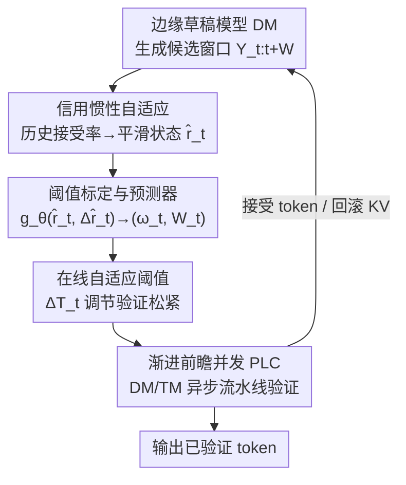

# E$^2$-SCI: Elastic Edge-Cloud Speculative Decoding via Credit Inertia

**会议**: CVPR 2026  
**论文**: [CVF Open Access](https://openaccess.thecvf.com/content/CVPR2026/html/Li_E2-SCI_Elastic_Edge-Cloud_Speculative_Decoding_via_Credit_Inertia_CVPR_2026_paper.html)  
**代码**: 无  
**领域**: LLM效率 / 投机解码  
**关键词**: 投机解码, 边云协同, 自适应阈值, 信用惯性, 异步流水线  

## 一句话总结
本文发现边云投机解码中相邻窗口的 token 接受率存在强时序一致性（称为"信用惯性"），据此用历史接受率动态调节验证阈值，再配合异步流水线（PLC）把草稿生成与云端验证并行起来，在 DeepSeek-R1-Distill-Qwen (1.5B/32B) 上达到 9.4+ tokens/s、相对 FSD 基线提速 88.5% 且不损精度。

## 研究背景与动机

**领域现状**：投机解码（Speculative Decoding, SD）是当下降低 LLM 推理延迟的主流手段——边缘设备上的轻量草稿模型（draft model, DM）先批量猜出一串候选 token，云端的大目标模型（target model, TM）再并行验证，验证通过的 token 一次性提交。边云部署进一步把 DM 放边缘、TM 放云端，既省云端能耗又压低用户感知延迟。

**现有痛点**：传统 SD 用一个**固定的接受阈值**判断 token 是否被采纳——只要草稿分布与目标分布的散度超过阈值就拒绝。这种"一刀切"有两个硬伤：一是僵硬，明明接受了也不会损害生成质量的高质量 token，仅因概率略低于死阈值就被拒掉，白白触发重生成；二是边云链路上"草稿要等验证通过的前缀、目标要等完整草稿序列到达"形成强同步依赖，相互等待加上上行传输（uplink）让延迟层层累积。

**核心矛盾**：固定阈值无法适应动态变化的网络条件和 token 一致性波动，更关键的是它**完全浪费了历史验证统计这一信号**。作者通过分析边云 SD 请求的接受模式发现：相邻生成窗口的接受率高度一致——近期表现好的请求（如 $\alpha_t > 0.8$）后续仍稳定表现好，近期差的（如 $\alpha_t < 0.4$）则持续低迷。实测中 $\text{mean}(H_t) > \tau_{high}$ 的序列接受率均值 $0.85\pm0.08$，而 $\text{mean}(H_t) < \tau_{low}$ 的仅 $0.32\pm0.12$。这种时序相关性来自语言固有难度的平滑变化——"好的窗口一直好、难的窗口一直难"。

**本文目标**：在 QoS 约束下，让边云草稿验证的"可控容忍度"随上下文动态调整，联合最小化云端能耗与客户端等待延迟，同时保住任务质量。形式化为 $\min_{g_\theta} \mathbb{E}[T_{\text{seg}}] + \gamma E_{\text{cloud}}$，其中分段延迟 $T_{\text{seg}} = \max\{T_{\text{edge}}, T_{\text{cloud}}\} + T_{\text{re}}$（$T_{\text{re}}$ 为重生成开销），$\gamma$ 平衡延迟与能耗。

**核心 idea**：把"信用惯性"当作可靠证据——用近期接受历史动态调阈值（历史表现好就放宽、差就收紧），再用异步流水线打破草稿与验证之间的硬同步屏障。

## 方法详解

### 整体框架
E2-SCI 是一个**弹性（elastic）边云投机解码框架**，核心是把验证阈值从"固定常数"升级为"由历史接受率驱动的自适应量"。整条链路分两条相互正交的优化线：一条是**信用惯性自适应**（沿时间维度调阈值），把过去 $k$ 个窗口的接受率压成一个平滑状态 $\hat{r}_t$，经离线标定 + 轻量预测器映射到当前最优阈值 $T_t$ 与窗口大小 $W_t$；另一条是 **PLC 异步并发**（沿空间维度并行），让边缘 DM 和云端 TM 作为独立协作进程交错执行，把上行传输与验证延迟"藏"进草稿生成时间里。两条线协同：自适应阈值减少误拒、降低回滚频率，PLC 则消除等待空闲——前者管"少返工"，后者管"不空等"。

### 关键设计

**1. 信用惯性机制：把"近期接受历史"变成调阈值的可靠信号**

这是全文的观察基石，针对"固定阈值忽略历史统计"的痛点。作者假设语言难度在相邻上下文间平滑变化，于是相邻投机窗口的接受率天然高度相关。设最近 $k$ 个窗口的接受历史为 $H_t = \{\alpha_{t-k}, \dots, \alpha_{t-1}\}$，系统据此判断当前处于"高信用"还是"低信用"区：历史表现好就该放宽验证、鼓励激进投机，历史差就该收紧、及时止损避免级联失败。作者还给出一个存在性论断（Theorem 4.1）：在 $\hat{r}_t$ 有界平滑变化（$|\hat{r}_{t+1}-\hat{r}_t|\le\epsilon$）的假设下，联合代价 $\mathcal{L}(T_t\mid\hat{r}_t) = \mathbb{E}[T_{\text{seg}}(T_t)\mid\hat{r}_t] - \gamma\,\mathbb{E}[L_{\text{acc}}(T_t)\mid\hat{r}_t]$ 对每个 $\hat{r}_t$ 都存在最优阈值 $T^*(\hat{r}_t)$（$L_{\text{acc}}$ 为接受的连续前缀期望长度）⚠️ 定理细节以原文为准。和静态阈值相比，它把验证标准锚在时序模式上，从而在不牺牲分布保真的前提下压低拒绝率。

**2. 阈值标定与轻量预测器：用离线查表 + 五层 MLP 把状态映射到最优阈值**

为了在线时不付优化开销，作者把"状态→最优阈值"的映射拆成离线标定 + 在线预测两步。离线阶段对每个平滑接受率 $\hat{r}$ 扫描候选阈值 $\{\theta_j\}$，记录各自的接受概率、精度与延迟，把使联合代价 $\mathcal{L}$ 最小的阈值标为最优标签，构成查找表。在此监督数据上训练一个五层前馈预测器 $g_\theta$，输入当前平滑接受率 $\hat{r}_t$ 与动量导数 $\Delta\hat{r}_t$（当前与上一状态之差），输出严格为正的自适应权重 $\omega_t$（控制阈值偏移幅度）和最优窗口大小 $W_t$（决定草稿生成长度）：$g_\theta(\hat{r}_t, \Delta\hat{r}_t) = (\omega_t, W_t)$。训练目标直接绑定降延迟目标 $\min_\theta \mathbb{E}_{x\sim\mathcal{D}}\big[\sum_{t=1}^{M}(T_{\text{seg}}^{(t)}(\theta) - \lambda L_{\text{acc}}^{(t)}(\theta))\big]$，$\lambda$ 平衡延迟惩罚与接受 token 奖励。这样在线推理只需查预测器、无需运行时优化。

**3. 在线自适应验证：用 EWMA 平滑 + 信用差分双向调阈值，迟滞控制防震荡**

在线验证时，先算草稿与目标分布的 Jensen-Shannon 散度，再和自适应阈值比较决定是否接受。当前窗口接受概率取接受前缀期望长度占预测窗口的比例 $p_{\text{acc}}^{(t)} = \mathbb{E}[L_{\text{acc}}] / W_t$，再用指数衰减更新平滑接受率：

$$\hat{r}_t = (1-\beta)\hat{r}_{t-1} + \beta\, p_{\text{acc}}^{(t)}, \quad \beta = 0.3$$

阈值更新分解为基线 + 自适应调整两部分：

$$\Delta T_t = \alpha\cdot\omega_t\cdot(\hat{r}_t - \tau_{\text{credit}}), \quad T_t = \max\{T_{\text{min}},\ \min\{T_{\text{base}} + \Delta T_t,\ T_{\text{max}}\}\}$$

机制核心是围绕中性期望 $\tau_{\text{credit}}$ 做对称分叉：当 $\hat{r}_t > \tau_{\text{credit}}$（历史更好）时 $\Delta T_t > 0$，放宽阈值奖励激进接受；当 $\hat{r}_t < \tau_{\text{credit}}$（历史更差）时 $\Delta T_t < 0$，把阈值压到 $T_{\text{base}}$ 以下严格收紧、隔离低置信 token。$T_{\text{min}}/T_{\text{max}}$ 是防止分布坍缩的硬安全边界。为压住震荡，系统叠加迟滞控制（hysteresis）、滑窗更新、最小刷新间隔，并在校验缓冲上做硬安全检查——若 $\text{Acc}(T_{\text{pred}}) < \delta$ 就回退到保守阈值。最终联合优化的目标是最大化 goodput（单位时间接受 token 数）$G(T, W) = \mathbb{E}[L_{\text{acc}}(T,W)] / \mathbb{E}[T_{\text{seg}}(T,W)]$。

**4. 渐进前瞻并发 PLC：把草稿生成与云端验证拆成异步流水线，藏掉等待延迟**

针对"草稿与验证强同步、相互等待累积延迟"的痛点，PLC 把投机解码解耦成异步的预命中（pre-hit）与验证两个阶段，让 DM 与 TM 作为独立协作进程并行。预命中阶段，TM 先只验证投机窗口 $Y_{t:t+W_t}$ 的**首 token**：若被动态阈值拒绝则整窗丢弃、省掉冗余计算；一旦首 token 通过，DM 不等 TM 反馈就继续生成，TM 则在自身分布 $p_t$ 下异步验证前一窗口，形成重叠流水线。并发窗口随反馈动态膨胀：

$$W_t^{\text{P}} = W_t \cdot \prod_{j=1}^{l_t}(1 + \eta_j)$$

其中 $l_t$ 是已收到的异步反馈信号数，$\eta_j$ 是基于第 $j$ 次反馈的动态膨胀系数。验证完成后 TM 回传紧凑反馈信号 $s_t$，DM 据此提交已接受 token 或把 KV cache 回滚到最后验证前缀。这套异步机制消除了刚性同步屏障，把上行延迟与验证延迟交叠藏起来，显著提升吞吐。

### 损失函数 / 训练策略
预测器 $g_\theta$ 在离线标定得到的"状态→最优阈值/窗口"监督数据上训练，目标 $\min_\theta \mathbb{E}_{x\sim\mathcal{D}}[\sum_t(T_{\text{seg}}^{(t)} - \lambda L_{\text{acc}}^{(t)})]$ 直接把预测参数与降延迟、增接受 token 绑定；EWMA 衰减 $\beta=0.3$、历史窗口默认 $k=5$、迟滞 + 最小刷新间隔保证在线稳定。

## 实验关键数据

测试平台为 NVIDIA RTX 4090 + A6000 GPU 模拟真实边云网络，覆盖 Qwen2、Llama3.1、Gemma2、DeepSeek-R1-Distill-Qwen 四个模型系列，数据集含 GSM8K（数学）、CommonsenseQA（常识）、MMLU（通用知识）、HumanEval（代码），batch size=1 模拟实时生成。

### 主实验：边云加速比（相对 SD=1.0×，红色↑为相对 FSD 提升）

| 方法 | GSM8K (DS-R1 1.5&32B) | CSQA (DS-R1) | MMLU (DS-R1) | HumanEval (DS-R1) |
|------|------|------|------|------|
| FSD (2024) | 1.43× | 1.39× | 1.38× | 1.17× |
| Medusa (2024) | 1.36× | 1.56× | 1.46× | 1.21× |
| FR-Spec (2025) | 1.95× | 2.02× | 1.79× | 2.04× |
| LR (2025) | 1.84× | 2.02× | 1.89× | 1.82× |
| AMUSD (2025) | 1.81× | 1.89× | 1.81× | 1.74× |
| **E2-SCI (ours)** | **1.98× (↑45%)** | **2.07× (↑49%)** | **1.98× (↑43%)** | **2.01× (↑72%)** |

E2-SCI 在所有模型对 / 数据集上都拿到最高或并列最高加速比，相对 FSD 基线提升普遍 +32%~+90%（HumanEval 上提升最猛，达 +72%~+90%）。其动态分布容忍度与 PLC 正交，二者协同带来叠加收益。

### 吞吐对比（tokens/sec，C-E 为边云场景）

| 场景 | 数据集 | SD | Baseline | E2-SCI |
|------|------|------|------|------|
| Normal | GSM8K | 15.71 | 20.14 | **30.03** |
| Normal | HEval | 12.44 | 15.01 | **24.23** |
| C-E | GSM8K | 14.40 | 19.71 | **29.52** |
| C-E | MMLU | 11.24 | 15.51 | **22.20** |
| C-E | HEval | 11.84 | 13.80 | **23.71** |

E2-SCI 相对 SD 实现 1.8×~2.4× 吞吐提升；信用惯性标定降低失败频率、缓解回滚惩罚，在真实边云部署中表现稳健。

### 消融实验（图 6，逐个移除组件后的速度退化，tokens/s）

| 配置 | 说明 | 影响 |
|------|------|------|
| Full E2-SCI | 完整模型 | 基准（退化 0） |
| w/o PLC | 去掉异步流水线 | 速度明显下降（去同步收益最大） |
| w/o Threshold | 去掉分布容忍阈值比较 | 速度下降 |
| w/o History | 去掉历史窗口集成（信用惯性） | 速度下降 |

⚠️ 图 6 以柱状"速度退化"呈现、无精确表格数值，此处按趋势描述。集成实验（表 3）显示把 E2-SCI 插进 Medusa / FSD / EAGLE3 / PipeSpec 后各自精度均小幅上升（如 DS-R1 上 EAGLE3 GSM8K 93.1→94.7），说明它能无缝叠加于现有框架且不损质量。

### 关键发现
- **历史窗口 $k$ 存在明显边际递减**：$k=1\to5$ 精度大幅提升，但 $k=5\to10$ 精度只多 +0.2% 却掉 9.2 tokens/s，故默认取 $k=5$ 平衡延迟与质量。
- **PLC 与阈值自适应正交互补**：消融显示去掉 PLC 速度退化最大（消除等待空闲是吞吐主力），去掉历史/阈值则主要影响误拒率。
- **HumanEval（代码生成）受益最大**：相对 FSD 提升达 +72%~+90%，说明代码这类局部一致性强的任务最吃信用惯性红利。

## 亮点与洞察
- **"信用惯性"是个朴素但被忽略的观察**：相邻窗口接受率强相关本质是语言难度平滑性的体现，把它当免费监督信号来调阈值，几乎零额外推理开销（离线标定 + 查表/小 MLP），这种"用历史统计代替昂贵在线优化"的思路可迁移到任何带验证/拒绝环节的级联推理系统。
- **双向对称的阈值调节很巧妙**：$\Delta T_t = \alpha\omega_t(\hat{r}_t - \tau_{\text{credit}})$ 用一个差分项同时实现"好就放宽、差就收紧"，配迟滞控制和硬安全边界 $T_{\text{min}}/T_{\text{max}}$ 防止分布坍缩，工程上稳健。
- **PLC 的"首 token 预命中"是降冗余的关键 trick**：先只验首 token，拒了就整窗丢弃，避免对注定失败的窗口浪费验证算力，再让 DM 不等反馈继续生成形成重叠流水线。

## 局限与展望
- 方法依赖**离线标定的查找表 + 预测器**，对未见过的领域 / 网络条件，标定数据是否覆盖、迁移性如何，论文用小开发集（4~32 样本）扫阈值，泛化边界仍需更多验证。
- 信用惯性假设建立在"语言难度平滑变化"上，对**难度突变**（如对话主题剧烈切换、代码与自然语言混合）场景可能失效，图 1 中作者也用黄色箭头标注了排除状态转移的情形——状态转移点正是机制的薄弱处。
- ⚠️ Theorem 4.1 仅给"最优阈值存在性"，未给收敛速率或次优界，自适应策略相对理论最优的差距没有量化分析。
- 实验在 4090/A6000 模拟边云、batch=1，真实移动边缘设备（功耗、内存、不稳定链路）下的表现待验证。

## 相关工作与启发
- **vs FSD**: FSD 用基于分布散度的固定可控偏差放宽 SD 的严格分布等价约束，但阈值是**静态**的；E2-SCI 把这个容忍度做成由历史接受率驱动的**动态**量，在 FSD 之上再提速 32%~90%，且二者可叠加。
- **vs PipeSpec**: PipeSpec 通过轻量预测-验证协调做异步多模型 SD；E2-SCI 的 PLC 同样异步流水线，但额外把**动态阈值**注入验证环节，且预命中机制更激进地丢弃注定失败的窗口。
- **vs Medusa / EAGLE3**: 这些方法改进草稿生成结构（多头 / 特征对齐）来提接受率，与 E2-SCI 的"调验证松紧 + 异步并发"正交——表 3 显示把 E2-SCI 插进它们后精度还能小幅再涨，互补性强。
- **vs 历史无关方法**: 作者强调现有 SD 大多 history-agnostic、忽略序列请求间的时序依赖，而 E2-SCI 正是抓住这一被浪费的信号。

## 评分
- 新颖性: ⭐⭐⭐⭐ "信用惯性"观察朴素却被忽略，把历史接受率变成调阈值信号 + 正交的异步流水线，组合扎实
- 实验充分度: ⭐⭐⭐⭐ 4 个模型系列 × 4 数据集 + 加速比/吞吐/精度/消融多角度，但消融以柱状图呈现、缺精确数值表
- 写作质量: ⭐⭐⭐ 机制讲清楚，但部分公式/定理表述在 CVF 版中排版混乱、符号需对照原文
- 价值: ⭐⭐⭐⭐ 边云 LLM 推理加速实用，且能无缝叠加现有 SD 框架，落地友好

<!-- RELATED:START -->

## 相关论文

- [\[CVPR 2026\] ParallelVLM: Lossless Video-LLM Acceleration with Visual Alignment Aware Parallel Speculative Decoding](parallelvlm_lossless_video-llm_acceleration_with_visual_alignment_aware_parallel.md)
- [\[ICML 2025\] DSSD: Efficient Edge-Device LLM Deployment and Collaborative Inference via Distributed Split Speculative Decoding](../../ICML2025/llm_efficiency/dssd_efficient_edge-device_llm_deployment_and_collaborative_inference_via_distri.md)
- [\[ICML 2026\] MineDraft: A Framework for Batch Parallel Speculative Decoding](../../ICML2026/llm_efficiency/minedraft_a_framework_for_batch_parallel_speculative_decoding.md)
- [\[ACL 2026\] CreditDecoding: Accelerating Parallel Decoding in Diffusion Large Language Models with Trace Credit](../../ACL2026/llm_efficiency/creditdecoding_accelerating_parallel_decoding_in_diffusion_large_language_models.md)
- [\[ACL 2026\] Speculative Verification: Exploiting Information Gain to Refine Speculative Decoding](../../ACL2026/llm_efficiency/speculative_verification_exploiting_information_gain_to_refine_speculative_decod.md)

<!-- RELATED:END -->
