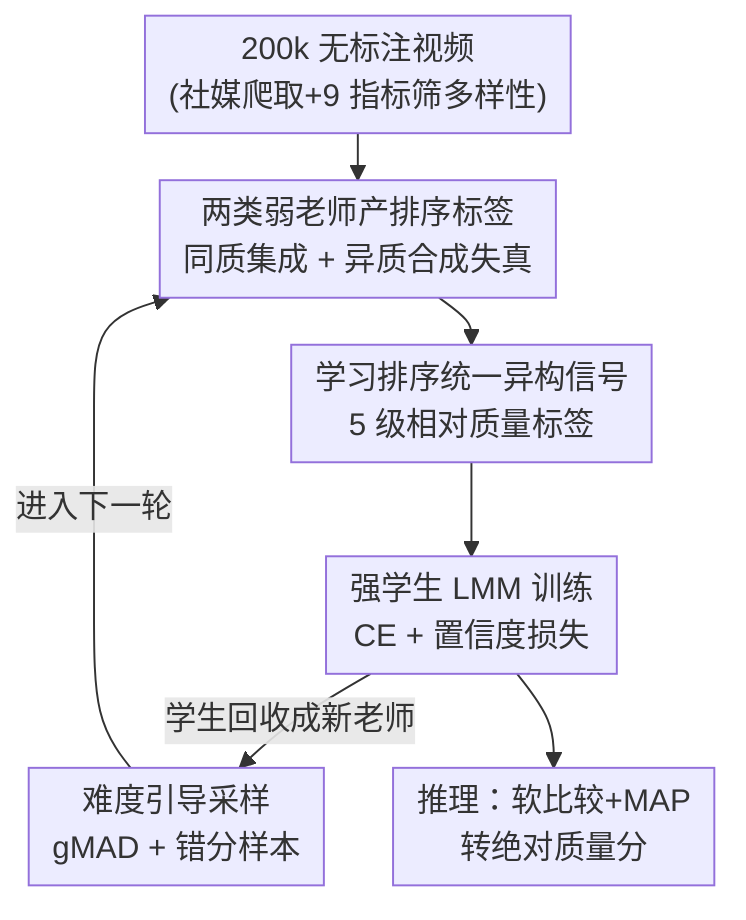

# Generalizable Video Quality Assessment via Weak-to-Strong Learning

**会议**: CVPR2026  
**arXiv**: [2505.03631](https://arxiv.org/abs/2505.03631)  
**代码**: https://github.com/clh124/W2S-VQA (有)  
**领域**: LLM效率 / 视频质量评估 / 弱监督  
**关键词**: 视频质量评估, 弱到强泛化, 学习排序, 伪标签, OOD 泛化

## 一句话总结
不依赖任何人工打分标签，用现成 VQA 模型当"弱老师"去监督一个高容量多模态大模型"强学生"，再把学生回收成下一轮老师做迭代，最终在域内持平、在 OOD 上大幅超越所有老师，把 VQA 的 OOD 整体 SRCC 从 0.59 推到 0.745。

## 研究背景与动机
**领域现状**：无参考视频质量评估（NR-VQA）主流是"人工标注数据集 + 监督回归"，靠 LSVQ、KoNViD 这类带 MOS 标签的数据训模型预测感知质量。

**现有痛点**：监督学习的泛化严重受训练数据多样性约束。论文 Fig.1 显示即便是顶级模型（DOVER、Q-Align、FAST-VQA），从域内换到 OOD 数据集时分数断崖式下跌——例如 LIVE-YT-HFR 上 MinimalisticVQA(VII) 的 SRCC 只有 0.061，几乎等于随机。而扩数据要做严格的样本筛选 + 符合 ITU 标准的主观打分实验，成本极高且难以规模化。

**核心矛盾**：想要泛化就得海量多样的标注数据，但人工 MOS 标注又贵又慢，两者天然对立。已有的自监督 / 无监督 VQA（对比学习 + 失真分类代理任务）只能建模合成失真，抓不住真实世界的非线性退化，性能远落后于监督方法。

**本文目标**：能不能不靠大规模人工标注、就训出泛化更强的 VQA 模型？

**切入角度**：作者借用 LLM 对齐里的"弱到强泛化"（weak-to-strong, W2S）现象——一个高容量强学生在弱老师的监督下，不仅能学会老师的能力，还能泛化到老师够不到的难样本。VQA 涉及主观感知而非确定性语义，W2S 是否成立是开放问题。作者先做实验验证：哪怕只用单个弱老师打伪标签，学生在域内持平老师、在 OOD 上平均涨 6.05%，证明 W2S 效应在 VQA 里真实存在。

**核心 idea**：把"现成 VQA 模型 + 合成失真模拟器"统统当弱老师，用学习排序统一它们异构的监督信号去训强学生，再让学生回收成老师做难度递增的迭代，从而绕开人工标注、把泛化能力滚雪球式放大。

## 方法详解

### 整体框架
方法要解决的是"没有人工标签、怎么训出泛化强的 VQA 模型"。整体分三步转：先把多个现成 VQA 模型 + 合成失真模拟器当弱老师，对无标注视频对产出**排序标签**（而非分数）；再用这些排序标签监督一个高容量多模态大模型（LLaVA-OneVision-7B 主干 + 双分支视觉编码 + 运动模块）当强学生学相对质量；最后把训好的学生提升为新老师，用难度引导采样挑出"老师答错 / 师生分歧最大"的难样本，进入下一轮 W2S 训练，循环三个 stage。

### 关键设计

**1. 验证 VQA 里的弱到强效应：用现成模型当老师替代人工标注**

痛点直指"标注贵"：作者不再去标 MOS，而是直接拿 5 个 SOTA VQA 模型（MinimalisticVQA VII/IX、FAST-VQA、DOVER、Q-Align，都在 LSVQ 上训过）当弱老师 $f_{\text{weak}}$，在 20 万条无标注视频上产伪标签 $\hat{y}_j = f_{\text{weak}}(x_j)$，再训一个容量远高于老师的强学生 $f_{\text{w2s}}$。关键发现是：哪怕这么朴素地做，学生在域内只掉 0.15%、在 OOD 上平均涨 6.05%，对越强的老师（如 MinimalisticVQA(IX)、Q-Align）学生甚至直接超过全监督基线。这说明强学生的预训练知识能"纠正"弱老师在 OOD 上的系统性偏差，而不是机械模仿——这是整篇方法成立的实验地基，也是后面所有增强的前提

**2. 学习排序统一异构监督信号：把回归问题改成成对比较**

不同老师打出的绝对质量分量纲和尺度都不一致（一个模型给 60，另一个给 0.8），直接拿去回归会打架；但"A 比 B 好"这种**相对排序**在同一来源内部是自洽的。于是作者把质量预测从回归改成排序：给定视频对 $(x^A, x^B)$，学生预测它们的相对质量，用 5 级标签 {superior, better, similar, worse, inferior} 细化。推理时用自适应软比较——先把测试视频和锚点视频比，算出排序类别上的软概率矩阵，再在 Thurstone Case V 模型下做 MAP 估计还原出校准的绝对分。这一步是把"五个老师 + 合成失真"这些来源各异的信号塞进同一训练目标的关键接口，没有它后面两类老师根本没法合并

**3. 同质集成 + 异质合成失真：从两个正交方向丰富老师监督**

单老师监督的天花板就是老师本身，所以作者从两边加料。**同质集成**：把 5 个 VQA 模型的预测取平均（先用四参数 logistic 把各模型分映射到统一尺度），用集成的均值 $\overline{y}$ 和方差 $\sigma^2$ 给视频对打排序标签——质量差 $\Delta = \overline{y}^A - \overline{y}^B$ 假设服从 $\mathcal{N}(\Delta; 0, \sigma_\Delta^2)$（$\sigma_\Delta = \sqrt{\sigma_A^2 + \sigma_B^2}$），按统计显著性分档：$\Delta > 2\sigma_\Delta$ 标 superior、$\sigma_\Delta < \Delta \le 2\sigma_\Delta$ 标 better，依此类推，方差越大标得越保守，过滤掉老师们意见不一的噪声对。**异质集成**：引入合成失真模拟器当"专用 VQA 老师"——空间失真（降分辨率、高斯模糊 / 噪声、调暗 / 调亮）、时间失真（抖动、卡顿）、流媒体失真（H.264/H.265 压缩），用失真等级当伪标签：同一源视频降 $N_\mathcal{S}$ 级，等级差 $|i-j|>1$ 标 superior/inferior、$|i-j|=1$ 标 better/worse（不设 similar，因为差 0 即同一视频）。两者一个提升监督**可靠性**、一个扩大监督**覆盖面**，互补地把老师能力撑开

**4. 迭代 W2S + 难度引导采样：让学生回收成老师、专攻难样本**

既然学生能超老师，那训好的学生就能当新老师再训一轮。但光换老师不够，关键是每轮要喂"超出当前老师能力"的难样本，否则只是重复学已会的东西。对**合成失真对**：有真值（失真等级直接给出），用当前学生 $f_{\text{w2s}}^{(i)}$ 推理，只挑它判错的对进下一轮。对**无真值的真实视频对**：用 gMAD（group maximum differentiation）竞赛框架——先按弱老师预测把视频池切成 $\xi$ 个等质量档（档内视频质量相近），然后挑出"学生判分差最大、但老师认为没差别"的对（式 1：$\arg\max [f_{\text{w2s}}^{(i)}(x^A) - f_{\text{w2s}}^{(i)}(x^B)]$ s.t. $|f_{\text{weak}}^j(x^A) - f_{\text{weak}}^j(x^B)| \le \xi$），再反过来挑"老师判分差大、学生认为没差别"的对。这系统性地利用师生决策边界的失配，专门挖出最有信息量的难样本。70 万视频对被切成 50 万 / 10 万 / 10 万三份对应三个 stage，难度逐级递增

### 损失函数 / 训练策略
基础目标是标准交叉熵 $\mathcal{L}_{\text{CE}}$，但弱标签必然带噪，直接 CE 容易过拟合错标。作者加一项置信度损失 $\mathcal{L}_{\text{conf}}$，鼓励学生在自己有把握、且预测与弱标签分歧时强化自身判断，总目标为

$$\mathcal{L} = (1-\lambda)\,\mathcal{L}_{\text{CE}} + \lambda\,\mathcal{L}_{\text{conf}}$$

其中 $\lambda$ 自适应地在"信任弱标签"与"信任学生预测"之间平衡。优化用 AdamW、初始学习率 $1\times10^{-4}$、cosine 衰减、weight decay 0.05、batch size 8、训 25k 步（前 750 步线性 warm-up），8×H200。学生主干为 LLaVA-OneVision-Chat-7B，按 LMM-VQA 做预处理：每秒采 1 关键帧给视觉编码器，用 SlowFast 从该秒所有帧抽运动特征，经运动投影器与视觉特征融合后送进 LLM。

## 实验关键数据

### 主实验
10 个 benchmark 分域内（LSVQ test/1080p、KoNViD-1k、LIVE-VQC、YouTube-UGC）和 OOD（LIVE-YT-Gaming、CGVDS、LIVE-YT-HFR、Waterloo-IVC-4K、KVQ）两组，指标 SRCC / PLCC。下表为各方法整体（按视频数加权平均）结果：

| 方法 | 域内 SRCC | 域内 PLCC | OOD SRCC | OOD PLCC |
|------|-----------|-----------|----------|----------|
| 弱老师最强（MinimalisticVQA IX） | 0.849 | 0.859 | 0.574 | 0.622 |
| VQA² (157k 标注) | 0.847 | 0.854 | 0.583 | 0.623 |
| VQAThinker (RL + LMM) | — | — | 0.615 | 0.658 |
| 本文 (I) 单老师 baseline | 0.849 | 0.859 | 0.591 | 0.639 |
| 本文 (VI) Stage 3 完整 | **0.865** | **0.872** | **0.745** | **0.789** |

完整模型在零人工标注下，域内 SRCC 0.865、OOD SRCC 0.745，全面超过 5 个老师和用了 15.7 万标注的 VQA²、用 RL 的 VQAThinker。OOD 上提升尤其大：从单老师 baseline 的 0.591 涨到 0.745。

### 消融实验
组件逐项累加（Table 2 整体列）与迭代策略消融（Table 4）：

| 配置 | 域内 SRCC | OOD SRCC | 说明 |
|------|-----------|----------|------|
| (I) 单老师监督 | 0.849 | 0.591 | baseline |
| (II) + 同质集成 | 0.856 | 0.602 | 集成提升监督可靠性 |
| (III) + 异质合成失真 | 0.858 | 0.650 | OOD 大涨，异质监督扩覆盖 |
| (IV) + 置信度损失 | 0.857 | 0.672 | 抗噪，OOD 继续涨 |
| (V) + 迭代 Stage 2 | 0.860 | 0.722 | 迭代 + 难样本 |
| (VI) + 迭代 Stage 3 | 0.865 | 0.745 | 完整 |
| (V-a) Stage 2 w/o 难样本选择 | 0.857 | 0.669 | 随机选样，OOD 掉 5.3% |
| (V-b) Stage 2 w/o 标签精修 | 0.858 | 0.657 | 不精修伪标签，OOD 掉更多 |

### 关键发现
- **OOD 才是主战场**：域内 benchmark 已接近饱和，单老师 baseline 就有 0.849；所有增益几乎都体现在 OOD（0.591→0.745，相对涨 26%）。在最难的 LIVE-YT-HFR 上，三轮迭代后相对 SRCC 涨 30.59%，Waterloo-IVC-4K 涨 20.55%，KVQ 涨 8.27%。
- **难样本选择是迭代的命脉**：(V-a) 去掉难样本选择改随机采样，OOD 从 0.722 掉到 0.669；(V-b) 选了难样本但不精修伪标签，掉到 0.657。说明性能来自"难度引导"策略本身而非单纯加数据。
- **异质合成失真对 OOD 贡献最突出**：(II)→(III) 域内只微涨 0.002，OOD 却从 0.602 跳到 0.650，印证合成失真把监督覆盖面撑到了真实老师够不到的退化模式。
- **算力可接受**：三个 stage 训练分别 19/24/29 小时（8×H200），推理单条 1080p/240 帧约 5.97 秒（2×RTX3090），与传统主观打分相比省时省力且可复现。

## 亮点与洞察
- **把 LLM 对齐的 W2S 范式干净地搬到 VQA**：先用最朴素的单老师实验把"W2S 效应在主观感知任务里真实存在"坐实，再在这个地基上叠增强，论证链条非常扎实——这种"先证现象、再做工程"的写法值得借鉴。
- **学习排序当"异构信号的通用插座"**：五个量纲各异的老师 + 合成失真模拟器，靠改成成对排序就能塞进同一目标。这个 trick 可迁移到任何"多来源伪标签尺度不一致"的弱监督场景（如多模型蒸馏、跨数据集混训）。
- **gMAD 难样本挖掘 + 学生回收成老师**：用师生决策边界失配主动找信息量最大的样本，把"自我教学"做成了滚雪球。这套迭代 + 难度引导的思路，本质是无标注版的主动学习，对其他打分 / 排序任务也成立。
- **零人工标注超越 15.7 万标注的 VQA²**：最让人"啊哈"的是用合成失真 + 现成模型这种"白嫖"监督，反而打过了重标注和重 RL 的方法，说明在 OOD 泛化上"监督的多样性"比"监督的精确性"更重要。

## 局限与展望
- **强学生主干很重**：用的是 LLaVA-OneVision-7B 这类高容量 LMM，W2S 效应依赖学生远强于老师的预训练知识；学生若不够强，能否仍超越老师存疑（论文未充分探讨学生容量下界）。
- **合成失真覆盖有限**：异质老师靠人工设计的空间 / 时间 / 流媒体失真模拟真实退化，但真实世界的失真组合远比这复杂，模拟器与真实分布的 gap 可能限制 OOD 上限。
- **迭代轮数收益递减**：Stage 2→3 域内只从 0.860 涨到 0.865，迭代到几轮该停、停的判据是什么，论文给到三轮但没给收敛性分析。
- **改进思路**：把合成失真换成可学习的失真生成器（让难样本生成也进 W2S 循环）、或把置信度损失换成更细的不确定性建模，可能进一步抬高 OOD 天花板。

## 相关工作与启发
- **vs 监督 VQA（DOVER / Q-Align / FAST-VQA）**：他们靠人工 MOS 标注做端到端回归，域内强但 OOD 崩；本文把它们当弱老师反过来蒸馏出更泛化的学生，区别在于不再追求标注精度而追求监督多样性，OOD 上从 ~0.55 提到 0.745。
- **vs 弱监督 VQA（FR 模型当伪监督）**：以往弱监督多用全参考模型当老师、且性能普遍不如老师、还要人工标签微调；本文证明单个 NR 弱老师就能蒸出超越自己的学生，且全程零人工标注、适配无参考场景。
- **vs LMM-based VQA（VQA² / VQAThinker）**：VQA² 用 15.7 万标注、VQAThinker 用 RL + 强 LMM；本文不用任何人工标签、靠 W2S + 排序统一就反超两者，凸显"绕开标注瓶颈"的实用价值。
- **vs LLM 对齐里的 W2S（Burns et al.）**：原 W2S 研究在 NLP / 奖励建模 / 游戏里验证强学生超弱老师；本文是首次系统性把它落到主观感知的 VQA，并补上"排序统一异构老师 + 迭代难度采样"两个 VQA 特化的工程组件。

## 评分
- 新颖性: ⭐⭐⭐⭐⭐ 首次把 W2S 范式系统落地 VQA，且配套排序统一 + 迭代难样本两个特化设计
- 实验充分度: ⭐⭐⭐⭐⭐ 10 benchmark、5 老师、逐组件消融 + 迭代消融 + 时间复杂度，证据链完整
- 写作质量: ⭐⭐⭐⭐ 逻辑清晰先证现象再做工程，公式与表格自洽，部分推理细节推到附录
- 价值: ⭐⭐⭐⭐⭐ 零人工标注超越重标注 / 重 RL 方法，OOD 泛化提升显著，范式可迁移

<!-- RELATED:START -->

## 相关论文

- [\[CVPR 2026\] ParallelVLM: Lossless Video-LLM Acceleration with Visual Alignment Aware Parallel Speculative Decoding](parallelvlm_lossless_video-llm_acceleration_with_visual_alignment_aware_parallel.md)
- [\[ICML 2025\] Efficient Length-Generalizable Attention via Causal Retrieval for Long-Context Language Modeling](../../ICML2025/llm_efficiency/efficient_length-generalizable_attention_via_causal_retrieval_for_long-context_l.md)
- [\[ICLR 2026\] Expert Divergence Learning for MoE-based Language Models](../../ICLR2026/llm_efficiency/expert_divergence_learning_for_moe-based_language_models.md)
- [\[ICML 2026\] ProactiveLLM: Learning Active Interaction for Streaming Large Language Models](../../ICML2026/llm_efficiency/proactivellm_learning_active_interaction_for_streaming_large_language_models.md)
- [\[ICLR 2026\] Deep Hierarchical Learning with Nested Subspace Networks for Large Language Models](../../ICLR2026/llm_efficiency/deep_hierarchical_learning_with_nested_subspace_networks_for_large_language_mode.md)

<!-- RELATED:END -->
