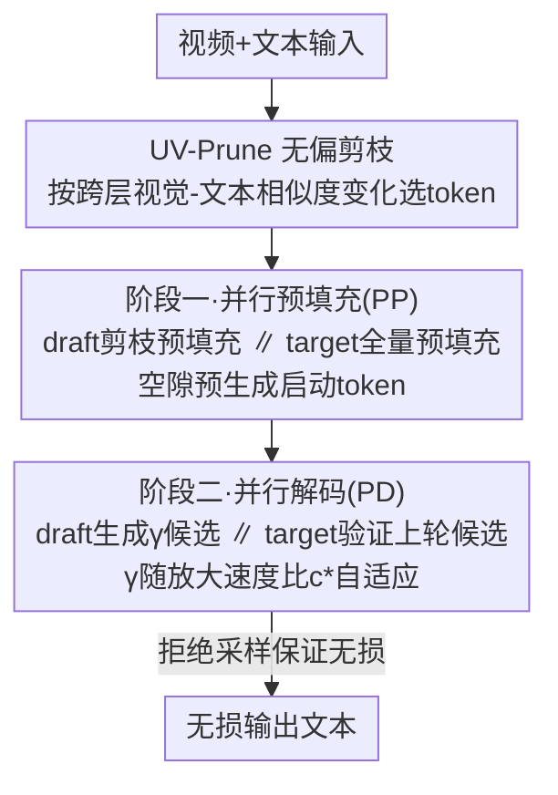

# ParallelVLM: Lossless Video-LLM Acceleration with Visual Alignment Aware Parallel Speculative Decoding

**会议**: CVPR 2026  
**论文**: [CVF Open Access](https://openaccess.thecvf.com/content/CVPR2026/html/Kong_ParallelVLM_Lossless_Video-LLM_Acceleration_with_Visual_Alignment_Aware_Parallel_Speculative_CVPR_2026_paper.html)  
**代码**: https://github.com/imKQv/ParallelVLM  
**领域**: LLM效率 / 视频多模态推理加速  
**关键词**: 投机解码, Video-LLM, 视觉token剪枝, 并行流水线, 无损加速

## 一句话总结
针对 Video-LLM 投机解码在长视频上"draft 和 target 互相干等"以及"提速比和模型对齐相互掣肘"两大瓶颈，ParallelVLM 把预填充和解码都做成 draft/target 并行流水线，并用基于视觉-文本相似度变化(而非注意力分数)的无偏剪枝 UV-Prune 扩大草稿窗口，在 LLaVA-OneVision-72B / Qwen2.5-VL-32B 上分别取得 3.36× / 2.42× 的无损加速，且免训练、即插即用。

## 研究背景与动机
**领域现状**：Video-LLM 把视频编码成动辄几千到几万个视觉 token，自回归解码因自注意力的二次复杂度在预填充(KV cache 计算)和解码两端都成为严重瓶颈。两条主流提速路线：(1) 视觉 token 剪枝(FastV/SparseVLM 等)直接砍视频 token；(2) 投机解码(SD)用轻量 draft 模型先生成 $\gamma$ 个候选、再由 target 一次并行验证，理论提速正比于 draft/target 的速度比 $c=T_p/T_q$，且靠拒绝采样保证输出分布无损。SpecVLM 第一个把 SD 用到 Video-LLM。

**现有痛点**：剪枝路线"无验证"，会引入分布偏移导致掉点(细粒度视频理解尤其明显)，且仍要访问全量参数、提速有限。SD 路线在 Video-LLM 上则撞上两个新问题：

**核心矛盾**：
- **(挑战一)顺序执行瓶颈**：香草 SD 强制 draft 和 target 在整条视频 token 序列上**串行**地预填充和解码。实测 24K 视频 token 时 target 预填充 44.23s、draft 再加 7.92s；解码阶段 $T_q{=}78$ms、$T_p{=}420$ms，典型窗口 $\gamma{=}5$ 时一个周期约 $2T_p$——硬件在预填充阶段约 20%、解码阶段约 50% 时间在空转，而 Video-LLM 越强 draft 越重，这笔"等待税"只会越来越贵。
- **(挑战二)提速比与对齐纠缠**：提速由 $c$ 和 draft/target 对齐度(决定接受率)共同决定。视频 token 冗余高，可以剪 draft 的视觉 token 来减小 $T_q$、抬高 $c$；但被剪后的小 draft 往往同时丢了关键视觉细节和文本 grounding，与 target 全上下文分布对不齐，接受率骤降。SpecVLM 用 target 的**注意力分数**指导剪枝，却撞上"位置偏置"：保留率 10% 时仅 4% 位置宽度(帧 1、125-128)就吸走 21% 被选 token——因为它们是 attention sink 或贴近文本 query，而非语义重要；且注意力剪枝与 FlashAttention(块状核、不显式算注意力分数)不兼容。

**本文目标 / 核心 idea**：把"串行等待"和"剪枝-对齐冲突"一并解决——用 draft/target **并行流水线**消掉空转，用基于跨层语义对齐变化的**无偏剪枝**在不牺牲对齐的前提下扩大草稿窗口。

## 方法详解

### 整体框架
ParallelVLM 是个免训练的 draft-then-verify 框架，分两个完全并行的阶段。阶段一并行预填充(PP)：target 全量预填充的同时，draft 并行做剪枝后的预填充，剪枝由 target 早层语义指导(UV-Prune)，并在 target 还没填完的空隙里预生成启动 token。阶段二并行解码(PD)：draft 持续生成 $\gamma$ 个候选 token，同时 target 验证上一轮的候选，两者在重叠窗口里流水推进；窗口大小 $\gamma$ 随剪枝放大的速度比 $c^*$ 自适应选取。整套设计的关键是让 draft 侧的剪枝/预填充/启动开销全部"藏"在 target 的长延迟之下。

### 关键设计

**1. UV-Prune 无偏验证者指导剪枝：用"跨层对齐变化"取代注意力分数**

注意力分数剪枝会因位置偏置只盯着视频首尾和贴近文本的 token，对需要时序连贯、关注中段内容的视频任务很致命。UV-Prune 换了个问题：不问"模型注意到哪些 token"，而问"哪些 token 随着信息在 target 各层流动、越来越和文本 query 对齐"。它在 target 早层集合 $l\in\{1,...,L\}$ 上算视频 token $V_i$ 与文本 token $X_j$ 的余弦相似度 $S_{ij}=\frac{V_i\cdot X_j}{\|V_i\|\|X_j\|}$，再对相邻层求差并对所有文本 token 求和：$\Delta S_i=\sum_{j}\sum_{l}(S^l_{ij}-S^{l-1}_{ij})$。$\Delta S_i$ 大说明该视频 token 在网络中"获得了跨模态相关性"，于是按剪枝比 $\alpha$ 保留 Top-K：$V^*=\text{TopK}(\Delta S_1,...,\Delta S_m)$。

这套信号在 target 预填充阶段测得，相当于把 target 自己的语义"知识迁移"给 draft，对齐稳、接受率高；且不绑定绝对位置，能自然保留真正相关的中段帧，兼顾时空连贯。注意：相似度变化用的是表征(而非注意力矩阵)，因此与 FlashAttention 兼容。

**2. 并行预填充(PP)：把 draft 的剪枝/预填充/启动全藏进 target 预填充延迟里**

香草 SD 的预填充串行，draft 那 7.92s 是纯空转。PP 启动两个独立进程并行跑：target 进程预填充全量 $V_{1:m}$，draft 进程只预填充剪枝后的 $V^*$。由于 target 预填充延迟很长，draft 侧的全部操作——target 指导的剪枝、draft 预填充、启动 token 生成——都能塞进这段时间完成。具体地，target 产出预设早层的中间结果后广播给 draft 进程，draft 执行 $V^*=\text{UV-Prune}(M_p(V_{1:m},X_{1:n}),\alpha)$ 完成剪枝；剩余空隙里 draft 预生成一个 $\gamma$ token 的初始投机窗口(启动 token)，使阶段二一开始就有候选可验、无需暖机。PP 结束时 draft 已能用剪枝上下文快速产 token、target 持有全上下文 KV 供无损验证、首批候选已排队。

**3. 并行解码(PD)：draft 生成与 target 验证重叠，窗口随放大速度比自适应**

PD 让 draft 和 target 流水协同：第 $i$ 轮中 draft 用剪枝上下文 $V^*$ 生成窗口 $\hat X_{k+\gamma+1:k+2\gamma}$，**同时** target 用全上下文 $V_{1:m}$ 验证第 $i{-}1$ 轮的 $\gamma$ 个候选；每个候选按 §2.2 的拒绝采样接受，若某 token 被拒则从 target 分布重采并执行 pre-rollback 重新起草。窗口大小取剪枝后的速度比 $\gamma=c^*=T_p/T_q(\alpha)$：例如不剪枝时 $T_q{=}78$ms、$T_p{=}420$ms、$c{\approx}5$ 故 $\gamma{=}5$；剪枝比 $\alpha{=}0.9$ 时 $T_q$ 降到 47ms、$c{\approx}9$、$\gamma{=}9$(放大 1.8×)。实际提速还取决于剪枝质量带来的接受率 $\tau(P,\alpha)$——好的对齐剪枝即便在激进 $\alpha{=}0.9$ 下也能保持高 $\tau$。理论提速由定理给出 $V_{ViP}=\hat\tau(P,\alpha)\cdot\gamma\cdot T_p/(\gamma\cdot T_q(\alpha))=\hat\tau\cdot c^*(\alpha)$，最优 $\hat\tau{=}1$ 时即 $c^*(\alpha)$。

### 损失函数 / 训练策略
全程**免训练**：UV-Prune、PP、PD 都是即插即用的推理期机制，无任何参数更新。评测用 5 组 draft/target 配对(覆盖 $c$ 从 1 到 5)，LLaVA-OneVision 每视频采 128 帧共 $196\times128{=}25088$ 个视觉 token，最大输出长度 512，8× L40S GPU。

## 实验关键数据

> 评价指标：**Speedup**(相对自回归 AR 基线的端到端提速倍数)、**M**(mean accepted length，平均每轮被接受的草稿 token 数，反映投机准确率)、**A**(token-wise acceptance ratio，与有损剪枝对比时衡量分布漂移；越接近 100% 越无损)。

### 主实验
与无损投机解码方法对比(各基线默认 $\gamma{=}5$，STD 用 $\gamma{=}9$；ParallelVLM 按速度比自适应调 $\gamma$)，五个视频理解基准平均：

| draft/target 组合 | 方法 | 平均 Speedup | 平均 M |
|------|------|------|------|
| LLaVA-OV 0.5B&7B ($c{=}2$) | SpecVLM | 1.81× | ~4.8 |
| | **ParallelVLM** | **2.11×** | ~8.3 |
| LLaVA-OV 7B&72B ($c{=}5$) | SpecVLM | 2.74× | ~4.4 |
| | **ParallelVLM** | **3.36×** | ~6.8 |
| Qwen2.5-VL 7B&32B ($c{=}3$) | SpecVLM | 2.11× | ~4.2 |
| | **ParallelVLM** | **2.42×** | ~4.3 |
| LLaVA-OV 7B&7B ($c{=}1$, Self-SD) | STD | 1.24× | ~8.0 |
| | **ParallelVLM** | **1.55×** | >14 |

ParallelVLM 在五种组合上一致超过 SOTA SpecVLM 0.30~0.64×；在 $c{=}1$ 的 Self-SD 设定下靠"边起草边验证"把平均接受长度推到 14 以上、仍提速约 1.55×，比 SpecVLM/STD 高约 0.30×。

### 与有损剪枝对比 + 消融
有损剪枝(保留率 10%)会掉 9.1%~17.7% 性能且只有 1.44~1.64× 提速；ParallelVLM 无损(token 接受率 A 约 99%)且提速 3.36×/2.42×：

| 方法(LLaVA-OV-72B, 保留10%) | 平均 A | 平均 Speedup | 是否无损 |
|------|------|------|------|
| FastV | 84.6% | 1.63× | 否(掉点) |
| SparseVLM | 87.1% | 1.60× | 否 |
| DyCoke | 90.9% | ~1.46× | 否 |
| **ParallelVLM** | **99.1%** | **3.36×** | 是 |

剪枝比消融($T_p/T_q$，单位 ms)：

| 组合 | $\alpha{=}0$ | $\alpha{=}0.5$ | $\alpha{=}0.9$ |
|------|------|------|------|
| LLaVA-OV 7B&72B | $c{=}5$ (78ms) | $c{=}7$ (57.5ms) | $c{=}9$ (46.6ms) |
| Qwen2.5-VL 7B&32B | $c{=}3$ (63.7ms) | $c{=}4$ (48.2ms) | $c{=}5$ (39.8ms) |

### 关键发现
- **剪枝比越大、速度比越大、最优窗口越宽**：$\alpha{=}0.9$ 把 LLaVA-OV-7B/72B 的 $c$ 从 5 抬到 9($\gamma$ 放大 1.8×)，提速从 2.45×(并行但不剪)升到 3.36×；这正是 UV-Prune 高接受率撑起来的——若剪枝伤对齐，接受率掉了提速反而下降。
- **并行 + 无偏剪枝双管齐下才是增益来源**：超 SpecVLM 的 0.30~0.64× 主要归因于并行流水线消空转 + UV-Prune 比注意力剪枝对齐更好(M 从约 4.4 提到 6.8)。
- **Self-SD 场景受益最大**：$c{=}1$ 时香草 SD 几乎无收益甚至 <1×，ParallelVLM 靠重叠把它救回到 1.5×+。

## 亮点与洞察
- **把"等待"工程化地藏起来**：识别出 Video-LLM SD 的真正瓶颈是顺序执行的空转(预填充 20%、解码 50%)，再用并行流水线把 draft 侧开销塞进 target 长延迟里——这种"用 target 的慢掩盖 draft 的快"的调度思路对任何非对称 draft/target 系统都通用。
- **从"注意力分数"转向"跨层对齐变化"**：UV-Prune 一句话点破注意力剪枝的位置偏置(attention sink + query 邻近偏好)，改用相似度跨层增量这个语义信号，既无偏又兼容 FlashAttention，是个很漂亮的认知转换。
- **解耦"提速比"和"对齐"**：把 $\gamma=c^*$ 这条"窗口随剪枝比自适应"的规则讲清楚，让剪枝得越狠、窗口越宽、提速越大成为可控旋钮，而不是靠经验拍 $\gamma$。

## 局限与展望
- 因缺乏长篇详细描述的 ground truth 标签，评测**用 target 全上下文输出当参考**来算 M/A，而非人工标注，"无损"是相对 target 自回归而言；绝对质量的人评缺失。⚠️
- 实验全在 8× L40S 多卡上做，并行 PP/PD 假设 draft 与 target 能独立进程并发；单卡或显存紧张场景下两进程并行的收益是否成立未讨论。
- 提速强依赖 $c$(draft/target 速度比)：$c{=}1$ 的 Self-SD 下收益明显小于 $c{=}5$ 的组合；对没有合适小 draft 的模型族适配性存疑。
- UV-Prune 的早层集合 $L$、剪枝比 $\alpha$ 等需按模型调，论文未给跨模型的自动选取方案。

## 相关工作与启发
- **vs SpecVLM**：同为 Video-LLM 投机解码，SpecVLM 用 target 注意力分数指导剪枝、且 draft/target 串行；ParallelVLM 用无偏的跨层对齐变化剪枝 + 全并行流水线，五组合一致超它 0.30~0.64×，且兼容 FlashAttention。
- **vs 视觉 token 剪枝(FastV/SparseVLM/DyCoke)**：它们无验证、有损(掉 9~18%)、只 1.4~1.6× 提速；ParallelVLM 靠 target 验证理论无损(A≈99%)且提速 2.4~3.4×。
- **vs 香草 SD / Self-SD(STD)**：香草 SD 串行等待、Self-SD 用完美对齐换小速度比；ParallelVLM 边起草边验证，把 Self-SD 的接受长度推到 14+、提速救回 1.5×+。

## 评分
- 新颖性: ⭐⭐⭐⭐ "并行流水线 + 跨层对齐变化剪枝"两点组合针对 Video-LLM SD 的真痛点，UV-Prune 的视角转换尤其新。
- 实验充分度: ⭐⭐⭐⭐⭐ 5 组 draft/target × 5 基准 + 与无损 SD/有损剪枝双线对比 + 剪枝比/窗口消融 + 理论提速定理，覆盖很全。
- 写作质量: ⭐⭐⭐⭐ 瓶颈分析(挑战一/二)与方法对应清晰，图文配合好；部分记号($\hat\tau$、$c^*$)略密。
- 价值: ⭐⭐⭐⭐⭐ 免训练即插即用、无损、3× 级别加速，对长视频 Video-LLM 部署有直接落地价值。

<!-- RELATED:START -->

## 相关论文

- [\[ICML 2026\] MineDraft: A Framework for Batch Parallel Speculative Decoding](../../ICML2026/llm_efficiency/minedraft_a_framework_for_batch_parallel_speculative_decoding.md)
- [\[ACL 2026\] Multi-Drafter Speculative Decoding with Alignment Feedback](../../ACL2026/llm_efficiency/multi-drafter_speculative_decoding_with_alignment_feedback.md)
- [\[ACL 2026\] TokenTiming: A Dynamic Alignment Method for Universal Speculative Decoding Model Pairs](../../ACL2026/llm_efficiency/tokentiming_a_dynamic_alignment_method_for_universal_speculative_decoding_model_.md)
- [\[CVPR 2026\] E$^2$-SCI: Elastic Edge-Cloud Speculative Decoding via Credit Inertia](e2-sci_elastic_edge-cloud_speculative_decoding_via_credit_inertia.md)
- [\[CVPR 2026\] Generalizable Video Quality Assessment via Weak-to-Strong Learning](generalizable_video_quality_assessment_via_weak-to-strong_learning.md)

<!-- RELATED:END -->
