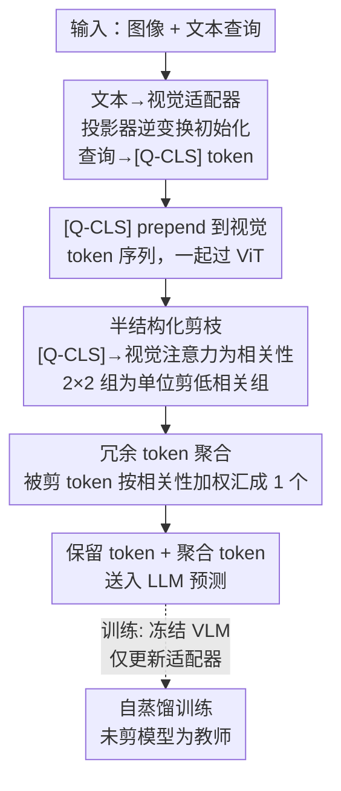

# QuietPrune: Query-Guided Early Token Pruning for Vision-Language Models

**会议**: CVPR 2026  
**论文**: [CVF Open Access](https://openaccess.thecvf.com/content/CVPR2026/html/Gao_QuietPrune_Query-Guided_Early_Token_Pruning_for_Vision-Language_Models_CVPR_2026_paper.html)  
**代码**: 无  
**领域**: LLM效率  
**关键词**: 视觉 token 剪枝、VLM 加速、早剪枝、查询引导、投影器逆变换

## 一句话总结
QuietPrune 提出**查询引导的早剪枝**：在 ViT 前向过程中、而非传统的 ViT 之后，就把与文本查询无关的视觉 token 剪掉——通过把 VLM 投影器做**逆变换**得到的轻量适配器，把文本查询转成一个视觉域的 `[Q-CLS]` token 来提供文本指导，再以 2×2 分组的半结构化方式剪枝并聚合冗余 token，在 Qwen3-VL / InternVL3 上把 prefill 延迟最多降 19.0%、同时比现有晚剪枝方法精度高 4.2%。

## 研究背景与动机

**领域现状**：主流 VLM 由 ViT + 投影器 + LLM 三件套组成。高分辨率输入会让 ViT 产出的视觉 token 数随分辨率**二次增长**，部署成本高。为此社区提出视觉 token 剪枝，实时去掉冗余 token。

**现有痛点**：现有方法几乎都是**晚剪枝（late pruning）**——在 ViT 跑完全部视觉 token 之后（ViT↔LLM 接口处或 LLM 内部层）才剪。这有两个问题：① 完全忽略了 ViT **token 生成阶段本身**的计算冗余，而作者在 Qwen3-VL / InternVL3 上 profile 发现，prefill 阶段 ViT 占了 >50% 的延迟，小模型高分辨率下甚至 >75%；② 剪枝决策机制自身的开销常被忽视，某些方法选 token 的时间甚至超过剪枝省下的时间，出现「剪了反而更慢」的悖论（DivPrune、AIM 实测就出现负的延迟收益）。

**核心矛盾**：要在 ViT 内部做早剪枝才能吃到 ViT 那块大头，但早剪枝有两个独有难点。其一是**语义错位**：早剪枝发生在文本-视觉交互之前，没有 query 指导，传统 ViT 剪枝只看视觉显著性——会保留前景大物体、却把「视觉上不起眼但语义关键」的 token（如要问的楼号小字）剪掉，造成不可恢复的信息损失。其二是**空间结构**：最新 VLM 普遍把相邻 2×2 patch 合并成一个视觉 token（4× 降量），随意的非结构化剪枝会破坏合并组的空间连续性，引入预测偏差。

**本文目标**：在 ViT 内部做剪枝，同时（a）让剪枝具备文本查询指导、（b）保持与 2×2 token 合并兼容的空间连续性、（c）不引入额外延迟开销。

**核心 idea**：把投影器（视觉→文本）**逆过来**得到一个文本→视觉适配器，把查询变成一个 ViT 能读的 `[Q-CLS]` token 注入 ViT，用它和视觉 token 的注意力分数当相关性度量，做 2×2 分组的半结构化剪枝，并把被剪 token 聚合成一个 token 保留上下文。

## 方法详解

### 整体框架
QuietPrune 是一个在 ViT 内部运行的查询引导早剪枝框架，由三个组件 + 一套训练方式构成：① 一个轻量的**文本→视觉适配器**（由投影器逆变换初始化），把查询 token 投到视觉空间、池化成一个 `[Q-CLS]` token，prepend 到视觉 token 序列前一起过 ViT；② 一个**半结构化剪枝**机制，用 `[Q-CLS]` 对各视觉 token 的注意力分数当「视觉-文本相关性」，以 2×2 组为单位剪掉低相关组、保持空间连续；③ 一个**冗余 token 聚合**模块，把被剪 token 按相关性加权汇成一个 token 拼回去保留上下文。训练时**冻结整个 VLM、只更新适配器**，用自蒸馏。剪枝在 ViT 的 1/4、1/2、3/4 三个固定深度各执行一次。

### 关键设计

**1. 投影器逆变换得到的文本→视觉适配器：给早剪枝注入 query 指导**

早剪枝缺的是「哪些区域和问题相关」的文本信号。典型 VLM 的视觉→文本投影器是 LayerNorm → GELU → 两个 Linear 的堆叠；作者把这套架构**逆序重排**，构造一个文本→视觉适配器，把查询嵌入打回视觉特征空间，池化成单个 `[Q-CLS]` token，prepend 到视觉序列与之联合过 ViT 来指导剪枝。关键在**初始化**：不是随机初始化，而是用投影器参数的逆变换来初始化适配器，让它天然具备「文本→视觉」的映射能力，只需极少训练。对线性层 $Y=WX+b$，当 $W$ 可逆时令 $W^*=W^{-1},\ b^*=-W^{-1}b$；不可逆时用 Moore-Penrose 伪逆 $W^*=\lim_{\alpha\to 0^+}(W^TW+\alpha I)^{-1}W^T$（经 SVD $W=U\Sigma V^T$ 得 $W^*=V\Sigma^* U^T$，$\Sigma^*$ 取非零奇异值倒数后转置）。LayerNorm 假设输出近标准正态，按 $\gamma^*=1/\gamma,\ \beta^*=-\beta/\gamma$ 近似求逆；GELU 在正输入区近似恒等，直接保留。这样适配器只需在小数据上微调即可有效工作。

**2. 基于视觉-文本相关性的半结构化剪枝：既靠 query 选 token，又不破坏 2×2 合并的空间结构**

`[Q-CLS]` 注入后，ViT 每个注意力层照常算 $A=\mathrm{softmax}(QK^T/\sqrt{d})$，其中 `[Q-CLS]` 对各视觉 token 的注意力分数**天然反映了该 token 与查询的相关性**——直接拿来当相关性度量，**不引入任何额外计算**。难点是主流 VLM 会把相邻 2×2 token 合并成一个送进 LLM，若做非结构化剪枝，合并组里剩下的 token 可能不再空间连续，破坏合并算子假设的局部结构先验、引入预测偏差。为此采用**半结构化剪枝**：把每个 2×2 相邻块当一个组，组的相关性取组内 token 相关性分数的均值；剪枝时高相关组整组保留、低相关组**作为不可分单元整组移除**，从而保持保留 token 的空间一致性，兼容各类做 token 合并的 VLM 架构。

**3. 冗余 token 聚合：被剪不等于直接丢，压成一个 token 保住上下文线索**

半结构化剪枝在 ViT 内部去掉了冗余 token，但整个丢弃可能损失有用的上下文。于是把被剪 token 聚合成一个紧凑表示：聚合 token $x_m$ 是被剪 token $x_i$ 按其相关性分数 $a_i$ 加权求和，$x_m=\sum_i a_i x_i$。该聚合 token 与保留的视觉 token 拼接后一起送进 LLM。因为只多加 1 个 token，延迟开销可忽略。

**4. 自蒸馏训练：只训适配器、冻结 VLM**

训练时只更新适配器参数、整个 VLM 冻结。把**剪枝后的模型当学生、未剪枝模型当教师**做自蒸馏，蒸馏损失 $L_{distill}$ 是教师 logit $Y_t$ 与学生 logit $Y_s$ 的 KL 散度，总损失再加上学生 logit 与真值 $Y_{gt}$ 的交叉熵 $L_{ce}$：

$$L_{total}=L_{distill}(Y_s,Y_t)+L_{ce}(Y_s,Y_{gt}).$$

适配器在 10K 条（约占混合数据集 0.8%）公开数据上训，单张 A100 约 40 分钟。训练时剪枝率 $R=25\%$，评测时 $R$ 可免重训灵活调整。

## 实验关键数据

### 主实验
在 InternVL3 / Qwen3-VL 系列上、统一控制 LLM 部分平均剪枝率为 50% 比较各方法。报告相对精度 $RA=\mathrm{acc}_p/\mathrm{acc}_{np}$ 与延迟降低 $LR=(\mathrm{lat}_{np}-\mathrm{lat}_p)/\mathrm{lat}_{np}$，A100 单卡、eager-mode attention。以 InternVL3-1B 为例（六基准平均，单位 acc / lat(ms)，节选）⚠️：

| 方法 | 平均 acc | 平均 lat(ms) | RA% | LR% |
|------|---------|-------------|-----|-----|
| No prune（未剪） | 58.1 | 125 | – | – |
| FastV (ECCV'24，晚剪) | 54.8 | 104 | 94.3 | 16.8 |
| PACT (CVPR'25，晚剪) | 54.6 | 100 | 94.0 | 20.0 |
| DivPrune (CVPR'25，晚剪) | 54.6 | 156 | 94.0 | **-24.8**（反而更慢） |
| **QuietPrune（本文，早剪）** | — | — | **更高** | **更高** |

整体结论：QuietPrune 在不同 VLM 家族与规模上、相对精度与延迟降低**两项都一致优于** PACT / SAINT / DivPrune / AIM / FastV / VisPruner。摘要给出的代表性数字是 prefill 延迟最多降 **19.0%**、精度比现有晚剪枝高 **4.2%**。

### 与早剪枝基线 / 高剪枝率对比
| 对比点 | QuietPrune | SAINT-early（早剪基线） |
|--------|-----------|------------------------|
| 80% 剪枝率下精度 | 仍保持 >88% | — |
| 20% 剪枝率下精度 | — | 已跌破 90% |
| 剪枝依据 | query 引导 + 半结构化（保空间） | 仅视觉显著性 + 非结构化（破坏空间/语义连续） |

### 关键发现
- **早剪枝的收益在小模型上最大**：ViT 占小 VLM 总计算比例更高（高分辨率下 >75%），所以模型越小、早剪枝相对晚剪枝的延迟优势越明显。
- **晚剪枝会出现负收益**：DivPrune、AIM 的剪枝过程本身计算昂贵，总 prefill 延迟反超未剪基线（LR 为负）；AIM 在 >40% 剪枝率后精度骤降，说明整 token 移除只在深层有效。
- **query 引导 + 半结构化是高剪枝率仍保精度的关键**：SAINT-early 用非结构化视觉显著性剪枝，破坏保留 token 的语义与空间连续，20% 剪枝率精度就跌破 90%；QuietPrune 80% 剪枝率仍 >88%。

## 亮点与洞察
- **「逆投影器」初始化适配器**：投影器本就是「视觉→文本」的良好映射，把它逆过来初始化「文本→视觉」适配器，让适配器开箱即近似可用，只需 10K 数据、40 分钟训练——是个非常省的工程巧思，可迁移到任何需要「反向跨模态映射」的场景。
- **复用 ViT 自带注意力当相关性度量**：`[Q-CLS]` 对视觉 token 的注意力分数是 ViT 推理时本就算出来的，拿来当剪枝相关性**零额外开销**，直接规避了「选 token 比剪 token 还慢」的悖论。
- **半结构化 2×2 分组**：把剪枝粒度对齐到下游 token 合并的 2×2 结构，是个「让加速方法兼容主流架构」的务实设计，避免破坏位置编码连续性。
- **被剪 token 加权聚合**：用相关性加权把丢弃的 token 压成一个，几乎零成本地把「硬剪枝」的信息损失补回来一部分。

## 局限与展望
- **依赖 2×2 token 合并假设**：半结构化分组绑定了主流 VLM 的 2×2 pixel-shuffle/MLP 合并；对不做此类合并或用其他合并粒度的架构，分组策略需重新适配。
- **适配器需逐 VLM 训练**：虽然只训适配器、很轻，但换底座模型仍要重新做逆变换初始化与自蒸馏，并非完全免训。
- **评测以图像基准为主**：实验集中在 MMBench/MMStar/MMMU/AI2D/OCRBench/HallusionBench 等图像任务 ⚠️，对长视频等视觉 token 更爆炸的场景收益未充分验证。
- **改进思路**：可探索剪枝层深度/剪枝率的自适应选择、把 `[Q-CLS]` 指导扩展到多轮对话的查询变化，以及与 KV cache 压缩等 LLM 侧加速联合。

## 相关工作与启发
- **vs SAINT（早剪枝）**: SAINT 也在 ViT 内做早剪枝，但用相似度双部图匹配、**只看视觉显著性、忽略文本线索**，多模态场景掉点严重；QuietPrune 用 query 引导 + 半结构化，高剪枝率下精度显著更稳。
- **vs FastV / PACT / DivPrune（晚剪枝）**: 它们在 LLM 输入或内部层剪枝，吃不到 ViT 那块 >50% 的延迟大头，部分还因决策开销出现负的延迟收益；本文把战场前移到 ViT 内部。
- **vs EViT / DynamicViT（纯视觉 ViT 剪枝）**: 它们用 `[CLS]` 注意力或辅助预测器选 token，纯视觉任务有效但缺文本条件，迁到多模态会剪掉 query 关键 token；QuietPrune 用逆投影器把文本指导引入 ViT 解决了这一错位。

## 评分
- 新颖性: ⭐⭐⭐⭐⭐ 首个 query 引导的 VLM 早剪枝，「逆投影器初始化适配器 + 半结构化分组 + 零开销注意力相关性」组合很新
- 实验充分度: ⭐⭐⭐⭐ 覆盖两大 VLM 家族多个规模、六个基准、与 6 个 SOTA 对比；但缓存中主表数值 OCR 较乱，部分需以原文为准
- 写作质量: ⭐⭐⭐⭐ 动机（ViT 占延迟大头、早剪枝两难）讲得清楚，方法逐组件展开
- 价值: ⭐⭐⭐⭐⭐ 把加速重心移到被忽视的 ViT 内部、且小模型收益最大，对 VLM 实际部署很实用

<!-- RELATED:START -->

## 相关论文

- [\[ACL 2025\] Boosting Long-Context Information Seeking via Query-Guided Activation Refilling](../../ACL2025/llm_efficiency/boosting_long-context_information_seeking_via_query-guided_activation_refilling.md)
- [\[NeurIPS 2025\] L-MTP: Leap Multi-Token Prediction Beyond Adjacent Context for Large Language Models](../../NeurIPS2025/llm_efficiency/l-mtp_leap_multi-token_prediction_beyond_adjacent_context_for_large_language_mod.md)
- [\[ICML 2026\] TEAM: Temporal-Spatial Consistency Guided Expert Activation for MoE Diffusion Language Model Acceleration](../../ICML2026/llm_efficiency/team_temporal-spatial_consistency_guided_expert_activation_for_moe_diffusion_lan.md)
- [\[ICLR 2026\] Expert Divergence Learning for MoE-based Language Models](../../ICLR2026/llm_efficiency/expert_divergence_learning_for_moe-based_language_models.md)
- [\[ICML 2026\] Sparser Block-Sparse Attention via Token Permutation](../../ICML2026/llm_efficiency/sparser_block-sparse_attention_via_token_permutation.md)

<!-- RELATED:END -->
