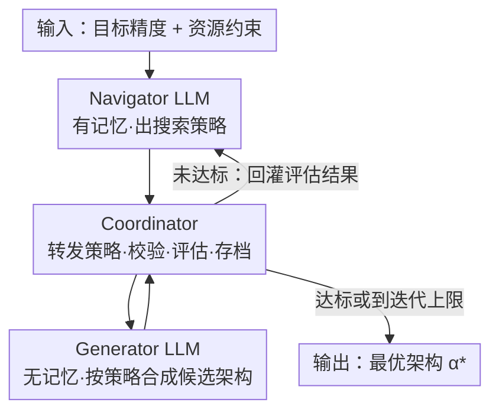

# CoLLM-NAS: Collaborative Large Language Models for Efficient Knowledge-Guided Neural Architecture Search

**会议**: CVPR 2026  
**arXiv**: [2509.26037](https://arxiv.org/abs/2509.26037)  
**代码**: 无（论文未公开）  
**领域**: LLM应用 / 神经架构搜索（NAS） / AutoML  
**关键词**: 神经架构搜索, LLM作为优化器, 双LLM协作, 两阶段NAS, 知识引导搜索

## 一句话总结
用两个分工互补的 LLM（有记忆的 Navigator 负责出策略、无记忆的 Generator 负责出候选架构）替换两阶段 NAS 第二阶段里的进化算法，把架构搜索变成"轨迹→策略→方案"的定向优化，在 ImageNet 和 NAS-Bench-201 上既刷新 SOTA 又把搜索成本压低 4–10×。

## 研究背景与动机
**领域现状**：两阶段 NAS（如 SPOS、OFA、AutoFormer）是当前主流——先训一个权重共享的超网（supernet），再在第二阶段从超网里采子网、直接继承权重做评估，省去了逐个从头训练的开销。第二阶段的"搜"通常交给进化算法（EA）、随机搜索或强化学习。

**现有痛点**：第二阶段的进化算法靠变异/交叉这类**局部、无方向**的随机扰动来探索，缺乏对整个性能曲面的全局理解，往往要采样并评估**上千个**候选架构才能逼近最优，既慢又容易陷局部最优。另一条路线——直接让 LLM 在代码 token 空间改架构（如 EvoPrompting、LLMatic）——又会生成**非法架构**、鲁棒性差、且每个候选都要独立从头训，结果在标准 benchmark 上反而打不过传统 NAS，还烧掉大量算力。

**核心矛盾**：LLM 自带的架构设计先验很有价值，但放进"无约束的代码 token 空间"里就会失控（架构非法、要独立训练）；传统两阶段 NAS 的超网评估很高效，但它的搜索引擎（EA）又太"瞎"。两者的优势没被合到一起。

**本文目标**：在保留两阶段 NAS 高效评估（超网权重共享）的前提下，把第二阶段的 EA 换成 LLM 的知识引导推理，让搜索能"有方向地"快速收敛到高性能区域，同时不引入非法架构问题。

**切入角度**：作者先做了一个 proof-of-concept——在 NAS-Bench-201 上让 LLM（Qwen3-30B-A3B）在不看真实精度的情况下，仅凭对网络设计原则的理解给 10 个架构排序，结果 Kendall's $\tau$ 在 CIFAR-10/100 上达到 0.89/0.90，且绝大多数试验都能挑出最优架构。这说明 LLM 确实"内化"了架构设计知识，可以当搜索的暖启动。

**核心 idea**：用"有状态 Navigator + 无状态 Generator"的双 LLM 协作，把架构搜索重写成"轨迹→策略→候选"的定向优化，在预训练超网的合法搜索空间里搜，兼得 LLM 先验 + 渐进式反馈知识。

## 方法详解

### 整体框架
CoLLM-NAS 只动两阶段 NAS 的**第二阶段**：超网照旧用各 baseline 的预训练权重，搜索引擎换成两个 LLM + 一个协调器的循环。一次搜索是这样转的：Navigator 先根据目标精度 $P_{target}$ 和资源约束 $\Lambda$（FLOPs/参数量）给出一份初始探索策略；Coordinator 把策略转交给 Generator，后者合成一批符合搜索空间约束的候选架构；Coordinator 校验合法性、用超网权重快速评估每个候选的精度与代价、并把已访问架构存档去重；评估结果回灌给 Navigator，让它精炼下一轮策略。如此迭代，直到达到目标精度或迭代上限 $T$。整个过程里 Navigator 累积历史轨迹 $\mathcal{H}$，Generator 每轮"忘掉"上一轮、只看当前策略。

### 关键设计

**1. 有状态 Navigator LLM：把优化轨迹抽象成自然语言策略**

EA 的搜索是"无方向的局部扰动"，缺全局视野。Navigator 的作用就是补上这个全局大脑：它带**持久记忆**，每轮分析已评估架构暴露出的性能规律，动态地制定并精炼搜索策略，让策略逐步聚焦到高潜力区域。初始阶段它被提示去建立一个"促进架构多样性"的探索策略（靠 LLM 对架构的隐式理解提升初始种群质量）；随着反馈累积，它从"广探索"过渡到"针对已发现高性能区的精确利用"，即 $\mathcal{S}_t \leftarrow \textsc{NavigatorLLM}(\mathcal{H}_t)$。关键在于它输出的是**抽象的自然语言策略**而非具体架构——这一步让推理停留在更高抽象层，避免过拟合到具体的架构语法

**2. 无状态 Generator LLM：只盯当前策略合成合法候选**

如果让一个 LLM 既反思又生成，记忆会把噪声越滚越大。Generator 因此被设计成**无记忆**的专职架构合成器：每轮只看 Navigator 当前给的策略 $\mathcal{S}_{t-1}$，把抽象策略翻译成具体候选架构 $\mathcal{C}_t \leftarrow \textsc{GeneratorLLM}(\mathcal{S}_{t-1})$，且这些候选天然满足搜索空间约束、同时体现当前策略强调的架构模式。和 OPRO 那种"单 LLM 直接把轨迹映射到方案"相比，本文拆成"轨迹→策略→方案"两步生成式流程：$\mathcal{S}_t \leftarrow \textsc{NavigatorLLM}(\mathcal{H}_t)$，$\mathcal{C}_{t+1} \leftarrow \textsc{GeneratorLLM}(\mathcal{S}_t)$。这种"有状态 Navigator + 无状态 Generator"的搭配，本质上是把**探索（记忆驱动的策略演化）与利用（无记忆的精准合成）解耦**，作者实测发现：保留 Generator 的记忆反而会累积噪声导致性能下降

**3. Coordinator：在合法搜索空间里做高效评估与去重**

直接让 LLM 在代码 token 空间改架构会生成非法结构、且要逐个从头训。Coordinator 把这两个坑都堵上：它编排两个 LLM 的通信、用 `isLegal` 校验每个候选的合法性（继承自预训练超网的搜索空间，天然避免非法架构）、用**权重共享机制直接从超网继承权重**做快速精度评估（无需重训），并维护一个已访问架构的存档 $\mathcal{V}$ 来消除重复评估。正是"在成熟两阶段 NAS 的合法搜索空间内搜 + 超网评估"这一点，让 CoLLM-NAS 能 scale 到 ImageNet 级别的数据集，而代码级 LLM-NAS 方法做不到

> ⚠️ **三类知识来源的统一**：框架里 Navigator/Generator/Coordinator 三个组件分别对应上面三个设计点。两路知识——LLM 自带的架构先验（暖启动）+ 从轨迹累积的渐进知识（Navigator 学到的隐式性能曲面模型）——通过 Navigator 与 Generator 的协作合到一处。

### 损失函数 / 训练策略
本文不训练任何模型，LLM 全程**冻结、零微调**。基础 LLM 用 Qwen3-30B-A3B，经 vLLM 本地部署，temperature 0.6，开启 chain-of-thought 推理。为防"知识污染"，prompt 里刻意不传任何显式的搜索空间/benchmark 信息，只通过 system prompt 给三个 LLM 分配角色、告知协作流程和架构表示方式。搜索预算固定：宏搜索空间最多探索 250 个架构，NAS-Bench-201 上最多探索 100 个架构。

## 实验关键数据

### 主实验
宏搜索空间（ImageNet），把 CoLLM-NAS 接到三种两阶段 NAS baseline 上，GPU Days 仅算搜索阶段：

| 搜索空间 | 方法 | Top-1 (%) | FLOPs (M) | GPU Days | Arch. Budget |
|--------|------|------|------|------|------|
| MobileNet | OFA-L | 78.7 | 499 | 0.42 | 1000 |
| MobileNet | OFA-L + Ours | **79.0** | 498 | **0.09** (↓4.7×) | **250** (↓4×) |
| ShuffleNet | SPOS | 73.7 | 323 | 0.32 | 1000 |
| ShuffleNet | SPOS + Ours | **74.4** | 325 | **0.07** (↓4.6×) | **250** (↓4×) |
| AutoFormer | AutoFormer-B | 82.1 | 11305 | 1.0 | 1000 |
| AutoFormer | AutoFormer-B + Ours | **82.3** | 11074 | **0.1** (↓10×) | **250** (↓4×) |

跨三种搜索空间一致地：精度最多提升 0.7%，搜索成本降 4–10×，探索的架构数从 1000 降到 250。

与 SOTA NAS 方法横向比（ImageNet，~320M FLOPs 档）：

| 方法 | 类型 | Top-1 (%) | Top-5 (%) | FLOPs (M) |
|------|------|------|------|------|
| OFA | 两阶段 NAS | 77.5 | 93.5 | 330 |
| SUMNAS | 两阶段 NAS | 77.6 | - | 349 |
| GENIUS | LLM-NAS | 74.9 | - | - |
| LM-Searcher | LLM-NAS | 75.1 | - | - |
| **Ours** | LLM-NAS | **77.9** | **93.8** | **320** |

CoLLM-NAS 以 320M FLOPs 拿到 77.9% Top-1，超过所有列出的手工设计 / 可微分 NAS / 两阶段 NAS / LLM-NAS 方法。

NAS-Bench-201（精度均为 test，10 次独立运行平均）：

| 方法 | CIFAR-10 | CIFAR-100 | ImageNet-16-120 |
|------|------|------|------|
| Evolutionary Algorithm | 94.23±0.25 | 72.82±0.87 | 46.49±0.60 |
| RZ-NAS† | 94.24±0.12 | 73.30±0.21 | 46.24±0.23 |
| LM-Searcher | 94.20 | 72.96 | 46.51 |
| **Ours** | **94.37±0.01** | **73.44±0.15** | **46.79±0.28** |
| Optimal（上界） | 94.37 | 73.51 | 47.31 |

本文在 CIFAR-10 上已**逼近理论最优 94.37**，且标准差远小于 EA/RL，鲁棒性更好；仅探索至多 100 个架构。

### 消融实验
| 消融维度 | 配置 | 结论 |
|------|------|------|
| 协作机制 | SiLLM-NAS（单 LLM 兼任反思+生成） | 各数据集上一致被 CoLLM-NAS 超过；尤其 CoLLM-NAS 的**初始种群更好**，凸显 Navigator 初始探索的关键作用 |
| 记忆保留 | 低复杂度（CIFAR-10/100） | 两个 LLM 都**不保留记忆**最优，迭代反馈本身够用 |
| 记忆保留 | 高复杂度（ImageNet-16-120/ImageNet） | **保留 Navigator 记忆、关掉 Generator 记忆**最优；保留 Generator 记忆会累积噪声、性能下降 |
| Prompt 改写 | Claude Sonnet 4 / GPT-5 / DeepSeek-R1 改写 prompt | 三个变体性能相当（Variant 2 在 ImageNet-16-120 上 46.89 还超过原版 46.79），说明增益来自框架而非措辞 |
| 不同 LLM | Qwen3-32B / DeepSeek-R1-Distill-Qwen-32B / -Llama-70B | 各 LLM 都保持强性能，方法不绑定特定 LLM |

### 关键发现
- **Navigator 的记忆是高难任务的关键**：数据集越难，历史轨迹越重要；但 Generator 必须无记忆，否则噪声累积反伤性能——这正是"有状态+无状态"非对称设计的实证依据。
- **协作 > 单体**：把两个角色合进一个 LLM（SiLLM-NAS）会变差，尤其初始种群质量明显下降，说明"出策略"和"出候选"分工确有收益。
- **增益与措辞/LLM 无关**：换 prompt 改写者、换不同开源 LLM，性能都稳，证明收益来自协作框架本身，可复现性强。
- **下游迁移**：把 MobileNet 搜索空间搜到的架构当 FCOS 检测器 backbone、在 COCO 1× schedule 上训，表现良好，泛化到检测任务。

## 亮点与洞察
- **"有状态 Navigator + 无状态 Generator"的非对称记忆设计很巧**：它把探索-利用的平衡直接编码进"谁有记忆"这一结构选择里，而且有清晰的消融证据（Generator 留记忆会累积噪声）——这是比"单 LLM 当优化器"（OPRO）更精细的一步。
- **不在代码 token 空间改架构，而是在成熟两阶段 NAS 的合法搜索空间内搜**：一举解决了 LLM-NAS 的"非法架构 + 逐个重训"两大顽疾，也是它能 scale 到 ImageNet 的根本原因，这个"借超网评估"的思路可迁移到任何带预训练超网的 AutoML 流程。
- **"轨迹→策略→方案"两步生成**：先让 LLM 在自然语言层面抽象出策略、再落成具体候选，避免过拟合架构语法——这个"先想策略再动手"的解耦对其他 LLM-as-optimizer 任务（如 prompt 搜索、超参优化）都有借鉴价值。
- **proof-of-concept 先验证再设计**：用 Kendall's $\tau$=0.89/0.90 量化"LLM 真的懂架构排序"，给整个方法奠定了可信的前提，是值得学的论证姿势。

## 局限与展望
- **依赖成熟的两阶段 NAS 框架与预训练超网**：方法的高效评估完全建立在"有现成超网可继承权重"之上，对没有超网、需要 from-scratch 评估的搜索空间不适用。
- **LLM 推理本身有额外开销**：作者承认 LLM 推理引入成本，只是被"评估数大幅下降"摊薄了；在评估本身就很便宜的 micro 空间里，这个 trade-off 优势会缩小。
- **精度提升幅度有限**：宏空间上最多 +0.7%，核心卖点其实是"省 4–10× 成本"而非精度飞跃；CIFAR-10 已贴近最优上界，进一步提升空间天花板明显。
- **未开源**：无代码，prompt 工程与协作细节的可复现性需要等放出代码验证。
- **泛化到 NAS 之外仍是展望**：作者提到框架可扩展到 NAS 以外，但论文未给实证，属未来工作。

## 相关工作与启发
- **vs 传统两阶段 NAS（SPOS / OFA / AutoFormer）**：它们第二阶段用进化算法，靠局部随机扰动搜索、需评估上千架构；本文把搜索引擎换成双 LLM 知识引导，评估数降到 250 而精度更高——是"即插即用增强"而非另起炉灶（直接复用各 baseline 的预训练超网）。
- **vs 代码级 LLM-NAS（EvoPrompting / LLMatic / GENIUS）**：它们在无约束代码 token 空间改架构，导致非法架构、逐个重训、scale 不到 ImageNet，benchmark 上打不过传统 NAS；本文在合法搜索空间内搜 + 超网评估，既保证合法又能 scale，且在 ImageNet 上超过它们（77.9% vs GENIUS 74.9%）。
- **vs OPRO（LLM as optimizer）**：OPRO 用单个 LLM 直接把优化轨迹映射到解；本文拆成 Navigator（轨迹→策略）+ Generator（策略→候选）两步、并引入非对称记忆，鼓励更结构化的探索、减轻对架构语法的过拟合。
- **vs NADER（多 agent 架构设计）**：NADER 的开放设计空间 + 全量训练限制了它 scale 到 ImageNet；本文靠超网评估规避了全量训练。

## 评分
- 新颖性: ⭐⭐⭐⭐ 首个把 LLM 与两阶段 NAS 结合的工作，"非对称记忆双 LLM"设计有想法，但整体仍属"LLM as optimizer"范式下的具体实例。
- 实验充分度: ⭐⭐⭐⭐⭐ 覆盖 3 个宏空间 + NAS-Bench-201，含协作/记忆/prompt 改写/不同 LLM/下游检测多维消融，证据链完整。
- 写作质量: ⭐⭐⭐⭐ 动机清晰、proof-of-concept 先行，pipeline 和算法表达到位；部分关键细节（prompt、Coordinator 实现）放附录。
- 价值: ⭐⭐⭐⭐ 4–10× 成本下降 + SOTA，对做 NAS/AutoML 的人有直接的工程价值，"借超网做合法高效评估"的思路可复用。

<!-- RELATED:START -->

## 相关论文

- [\[CVPR 2026\] LLM-Guided Probabilistic Fusion for Label-Efficient Document Layout Analysis](llm-guided_probabilistic_fusion_for_label-efficient_document_layout_analysis.md)
- [\[ACL 2025\] Collaborative Performance Prediction for Large Language Models](../../ACL2025/llm_nlp/collaborative_performance_prediction_for_large_language_models.md)
- [\[ACL 2025\] Neural Topic Modeling with Large Language Models in the Loop](../../ACL2025/llm_nlp/neural_topic_modeling_with_large_language_models_in_the_loop.md)
- [\[AAAI 2026\] LoKI: Low-damage Knowledge Implanting of Large Language Models](../../AAAI2026/llm_nlp/loki_low-damage_knowledge_implanting_of_large_language_models.md)
- [\[ICLR 2026\] Neural Synchrony Between Socially Interacting Language Models](../../ICLR2026/llm_nlp/neural_synchrony_between_socially_interacting_language_models.md)

<!-- RELATED:END -->
