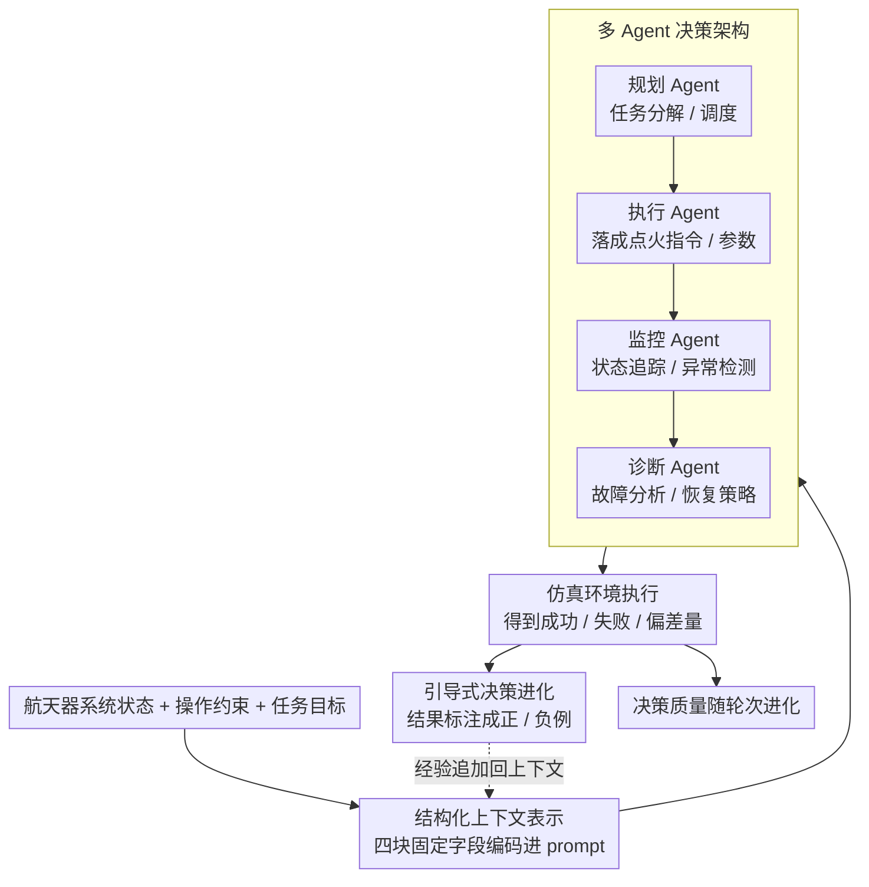

# GUIDE: Guided Updates for In-context Decision Evolution in LLM-Driven Spacecraft Operations

**会议**: CVPR 2026 (AI4Space Workshop)  
**arXiv**: [2603.27306](https://arxiv.org/abs/2603.27306)  
**代码**: 无  
**领域**: LLM应用 / 航天自主系统  
**关键词**: 航天器操作, LLM决策, in-context学习, 多Agent系统, 自主任务规划

## 一句话总结
提出GUIDE框架，利用LLM的in-context学习能力为航天器自主操作提供引导式决策进化，通过结构化的上下文信息和反馈机制让LLM在无需微调的情况下逐步改善航天任务规划和故障诊断决策的质量。

## 研究背景与动机

**领域现状**：航天器操作传统依赖地面站团队的手动指令规划和传输。深空通信延迟（火星往返延迟20+分钟）和日益复杂的多星座任务使实时人工控制越来越不可行，自主决策能力成为刚需。

**现有痛点**：(1) 传统基于规则的自主系统在未预见场景下缺乏灵活性；(2) 专用的任务规划器需要大量领域工程且难以跨任务泛化；(3) LLM虽有强大推理能力，但直接应用于航天场景面临可靠性、安全性和领域知识的挑战。

**核心矛盾**：航天任务需要高度可靠的自主决策，但LLM容易"幻觉"且缺乏航天领域的精确知识。如何利用LLM的通用推理能力同时确保航天操作的安全性和准确性？

**切入角度**：不微调LLM，而是通过精心设计的prompt结构和in-context反馈循环，让LLM在运行时逐步改善其航天决策能力。

**核心idea**：**Guided Updates** — 为LLM提供结构化的航天操作上下文（系统状态、约束条件、历史决策及其结果），让模型通过in-context学习从过去的决策反馈中进化，无需重新训练。

## 方法详解

### 整体框架
GUIDE 想解决的是：在不能微调 LLM、又承受不起幻觉的航天场景下，怎么让一个通用大模型逐步学会做靠谱的航天操作决策。它的答案不是改模型权重，而是改"喂给模型的上下文"。一轮决策的闭环是这样转的：先把当前航天器的系统状态、操作约束和任务目标编码成结构化 prompt，交给一组分工的 Agent 生成决策；决策送进仿真环境执行，得到成功/失败/偏差量等结果；这些结果再被写回上下文，作为下一轮的"经验条目"。随着轮次累积，prompt 里携带的领域经验越来越厚，模型的决策就从"基于通用常识的猜测"慢慢进化成"基于历史教训的判断"——这就是论文标题里 Guided Updates 的含义。

### 关键设计

**1. 结构化上下文表示：让 LLM 不遗漏航天决策里的关键状态**

航天决策高度状态依赖、约束又密集，随手写个自然语言 prompt 很容易漏掉某条硬约束，模型就会给出物理上不可行的方案。GUIDE 因此把整个操作环境压成四块固定字段塞进上下文：当前系统状态（轨道参数、姿态、电力/温度/通信状态）、操作约束（推力窗口、通信窗口、热极限）、任务目标（轨道转移、指向目标、科学观测计划），以及历史决策日志及其执行结果。前三块保证模型每次推理都能看到完整的"当下处境"，第四块则是后面引导进化的载体。把约束显式写进 prompt，本质是用结构换可靠性——模型不必从一段散文里自己抠出"现在还剩多少电"这种关键量。

**2. 多 Agent 决策架构：按航天子系统分工，而不是一个模型包圆**

航天操作横跨规划、执行、监控、诊断多个专业子系统，让单个 LLM 一次性处理所有环节容易顾此失彼。GUIDE 把它拆成四个专门 Agent 协作：规划 Agent 负责任务分解和调度，执行 Agent 负责把规划落成具体指令和参数，监控 Agent 持续盯系统状态、做异常检测，诊断 Agent 在出问题时分析故障并给恢复策略。每个 Agent 只在自己的窄领域里推理，上下文更聚焦、出错更可控，整体也比"巨型单体 prompt"更稳定。

**3. 引导式决策进化（Guided Updates）：用反馈把上下文越喂越准**

in-context 学习的天花板取决于示例质量，而航天任务又拿不到现成的高质量示例，GUIDE 干脆让模型自己在运行中攒。每轮决策执行完，仿真结果会以一条新条目的形式追加回上下文：成功的决策当正例强化，失败的决策附带一段失败分析当负例，明确告诉模型"上次这么做偏了多少、为什么"。这样历史日志不是简单堆数据，而是带标注的经验库——模型读到的不再是泛泛的航天常识，而是和当前这颗星、这个任务高度对口的具体教训。轮次越多，prompt 携带的领域先验越强，约束违反率也随之下降——这条把执行结果喂回上下文的回路（框架图里 F→引导式决策进化→B 的虚线），正是 GUIDE 区别于一次性 prompt 的核心。

### 一个完整示例：一次轨道调整决策的进化

以"轨道调整规划"任务为例走一遍闭环。**第 1 轮**：结构化上下文里给出当前轨道参数、剩余推进剂、可用推力窗口和热极限，规划 Agent 提出一个机动方案，执行 Agent 参数化成点火指令，送进仿真——结果偏差较大，甚至擦着推力窗口边缘。这次失败连同"偏差量 + 越界原因"被写回上下文。**第 2 轮**：模型读到上一轮的负例，主动避开了那个窗口边界，方案落在约束内但精度仍一般，监控 Agent 记录下残余偏差。**第 3 轮及之后**：随着正/负例不断累积，模型的决策越来越贴合这颗航天器的具体约束，约束违反率显著下降，决策质量从"基于通用知识的猜测"收敛到"基于域经验的判断"。整个过程没有改动任何模型权重，进化全发生在上下文里。

> ⚠️ 论文为 Workshop 规模、仅在简化仿真中验证，上述示例的具体轮次与数值以原文为准。

实验覆盖四类航天操作场景：轨道调整规划、通信窗口调度、故障诊断与恢复、科学观测优先级排序。

## 实验关键数据

### 主实验（Workshop规模）

| 任务 | 初始决策质量 | 引导进化后 | 提升 |
|------|------------|-----------|------|
| 轨道调整 | 基线 | +提升 | 有效 |
| 故障诊断 | 基线 | +提升 | 有效 |
| 通信调度 | 基线 | +提升 | 有效 |

### 消融实验

| 配置 | 决策质量 | 说明 |
|------|---------|------|
| 无历史上下文 | 低 | LLM仅用通用知识 |
| 无反馈更新 | 中 | 有示例但不进化 |
| 完整GUIDE | **最优** | 引导进化的价值 |

### 关键发现
- LLM在结构化prompt引导下可以产出合理的航天决策——但初始质量有限
- 随着反馈轮次增加，决策质量稳步改善——in-context学习在航天场景有效
- 多Agent分工比单Agent处理所有子任务更稳定——航天操作的复杂度需要分而治之
- 约束违反率随进化轮次显著降低——模型学会了尊重航天操作的硬约束

## 亮点与洞察
- **航天×LLM的前瞻性探索**：将LLM应用于高度安全关键的航天领域，虽然离实际部署还远，但为未来方向提供了重要的概念验证
- **In-context evolution的通用性**：引导式上下文更新的思想不限于航天——任何需要逐步改善且不便微调的场景都适用（如工业控制、紧急响应规划）
- **约束感知的prompt设计**：如何在prompt中有效编码硬约束（物理极限、通信窗口）是这类应用的关键工程问题

## 局限与展望
- Workshop论文，实验规模有限，仅在简化仿真中验证
- LLM的"幻觉"问题在安全关键的航天场景中是严重风险——需要更强的验证机制
- in-context学习的上下文窗口限制了可积累的历史长度
- 离真实航天器部署还有巨大差距——实时性、可靠性、辐射环境下的硬件适配等

## 相关工作与启发
- **vs 传统航天任务规划器(ASPEN/Europa)**: 它们是专用工程系统，泛化性差但可靠性高。GUIDE用LLM的灵活性弥补但牺牲了可靠性
- **vs Voyager等Agent框架**: 面向游戏环境的记忆+反思Agent，GUIDE将类似思想迁移到航天
- **vs LLM for Robotics**: 机器人操作的LLM Agent研究更成熟，航天场景是新兴方向

## 评分
- 新颖性: ⭐⭐⭐ Workshop级别的探索性工作，概念新但验证初步
- 实验充分度: ⭐⭐⭐ 仿真验证有限，缺乏与专业航天系统的定量对比
- 写作质量: ⭐⭐⭐⭐ 问题动机和航天背景描述清晰
- 价值: ⭐⭐⭐ 应用导向的前瞻性工作，对航天自主系统研究有启发价值

<!-- RELATED:START -->

## 相关论文

- [\[ACL 2025\] LLM Braces: Straightening Out LLM Predictions with Relevant Sub-Updates](../../ACL2025/llm_nlp/llm_braces_straightening.md)
- [\[AAAI 2026\] CoEvo: Continual Evolution of Symbolic Solutions Using Large Language Models](../../AAAI2026/llm_nlp/coevo_continual_evolution_of_symbolic_solutions_using_large_language_models.md)
- [\[ACL 2025\] Problem-Solving Logic Guided Curriculum In-Context Learning for LLMs Complex Reasoning](../../ACL2025/llm_nlp/problem-solving_logic_guided_curriculum_in-context_learning_for_llms_complex_rea.md)
- [\[ICLR 2026\] ELLMob: Event-Driven Human Mobility Generation with Self-Aligned LLM Framework](../../ICLR2026/llm_nlp/ellmob_event-driven_human_mobility_generation_with_self-aligned_language_models.md)
- [\[AAAI 2026\] ICL-Router: In-Context Learned Model Representations for LLM Routing](../../AAAI2026/llm_nlp/icl-router_in-context_learned_model_representations_for_llm_routing.md)

<!-- RELATED:END -->
