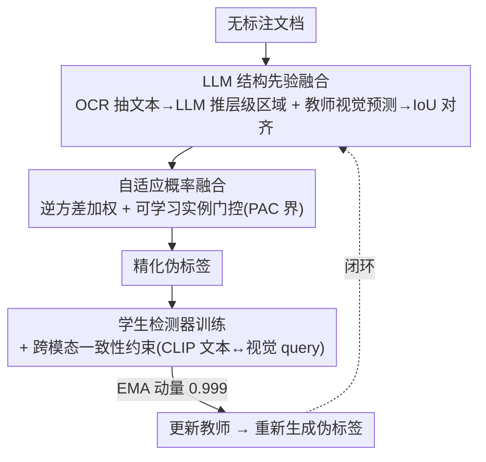

# LLM-Guided Probabilistic Fusion for Label-Efficient Document Layout Analysis

**会议**: CVPR 2026  
**论文**: [CVF Open Access](https://openaccess.thecvf.com/content/CVPR2026/html/Shihab_LLM-Guided_Probabilistic_Fusion_for_Label-Efficient_Document_Layout_Analysis_CVPR_2026_paper.html)  
**代码**: 待确认  
**领域**: 文档智能 / 半监督目标检测  
**关键词**: 文档版面分析, 半监督检测, LLM结构先验, 逆方差融合, 伪标签

## 一句话总结
本文把文本预训练 LLM 当作"结构先验生成器"塞进半监督版面检测的伪标签精化环节——用 OCR+LLM 推断文档层级区域，再和教师检测器输出做逆方差概率融合（含可学习的实例自适应门控），仅用 5% 标注就在 PubLayNet 上达到 88.2 AP（轻量骨干）/89.7 AP（LayoutLMv3），并对标题/页眉等稀有版面元素提升最大。

## 研究背景与动机
**领域现状**：文档版面分析（document layout analysis）是数字图书馆、表单处理、文档问答的底座。现代基于 Transformer 的检测器精度很高，但严重依赖大规模标注；半监督学习（teacher-student、伪标签、一致性正则）是降标注成本的主流路线。

**现有痛点**：半监督检测器会继承教师模型的系统性偏差，对稀有版面元素（caption、footer）和细粒度区分（caption vs footer、header vs title）特别吃力——这些类本来就少、视觉上又容易混。纯视觉的伪标签拿不到"语义结构"这层信息。

**核心矛盾**：人类读文档靠**文本语义**判断结构——"Figure 3:"暗示图注、页顶粗体暗示页眉、表格排版暗示数据表。而现有半监督检测只用视觉线索，把这层免费的语言学先验浪费了。可另一方面，直接拿 LLM/VLM 替代检测器又不行（实验里 GPT-4V 零样本只有 74.3 AP），因为它们的空间定位很弱。

**本文目标**：在不抛弃成熟检测架构、不引入大规模标注的前提下，把 LLM 的结构推理能力注入伪标签精化，分解为两个子问题——(i) 如何把"LLM 给的结构区域"和"教师给的视觉框"原则性地融合而非简单拼接；(ii) 如何让融合权重随样本自适应、并有理论保证。

**切入角度**：把 LLM 定位为"结构先验生成器"而非检测器替代品——给它 OCR 抽出的文本块及其空间坐标，它能推断文档层级、区分语义区域、甚至纠正 OCR 错误；这部分知识与视觉模式识别**互补**。

**核心 idea**：用"逆方差概率融合 + 可学习实例门控"把 LLM 结构先验和教师视觉预测组合成精化伪标签，给谁更确定就给谁更大权重，并用数据相关的 PAC 界解释为何这种跨模态融合是低维、样本高效的。

## 方法详解

### 整体框架
管线建立在一个轻量 DETR 式检测器（SwiftFormer-Tiny 骨干、3 层编码/解码、100 个 object query）之上。对无标注文档：一路用 Tesseract OCR 抽文本块 $B=\{(b^{ocr}_j,t_j)\}$ 喂给 LLM，让它返回带框、类别、置信度的结构区域 $r_k=(b^{llm}_k,c_k,s_k)$；另一路教师检测器给出视觉预测 $T$。两路经 IoU 匹配对齐后做**概率融合**生成精化伪标签，学生检测器在这些伪标签上训练，同时用跨模态一致性把视觉 query 和 OCR 文本嵌入对齐；学生再以 EMA 更新教师，形成闭环。

### 关键设计

**1. LLM 结构先验融合：把语言学层级注入视觉伪标签**

针对"纯视觉伪标签拿不到语义结构、稀有类吃瘪"的痛点。OCR 把无标注文档拆成文本块，LLM 被提示去识别结构区域，返回 $r_k=(b^{llm}_k,c_k,s_k)$。LLM 区域 $L$ 与教师预测 $T$ 通过 IoU 匹配对齐：当 $\mathrm{IoU}(b^t_i,b^{llm}_k)\ge\tau$ 且类别兼容时，生成融合预测——框 $b_f=\alpha b^t_i+(1-\alpha)b^{llm}_k$，置信度 $p_f=\sigma(w_t\cdot\mathrm{logit}(p^t_i)+w_l\cdot\mathrm{logit}(s_k))$（固定版用 $\alpha=0.6,w_t=0.7,w_l=0.3$）。高置信但未匹配的 LLM 区域作为软伪标签（标签平滑 $\epsilon=0.2$）补进来，专门救稀有类。LLM 区域离线缓存以摊薄推理成本。

**2. 自适应概率融合：用不确定性决定信谁，并给出 PAC 保证**

固定权重是次优启发式。本设计从不确定性量化出发：教师不确定性用预测方差 $\sigma^2_t=\mathrm{Var}(p^{t,1}_i,\dots)$ 估计，LLM 不确定性取决于文本证据质量 $\sigma^2_l=1/(Q_{text}(t_k)\cdot Q_{spatial}(b^{llm}_k))$（$Q_{text}$ 量文本清晰度、$Q_{spatial}$ 量空间一致性）。最小方差无偏估计给出逆方差加权定位：

$$b_f=\frac{b^t_i/\sigma^2_t+b^{llm}_k/\sigma^2_l}{1/\sigma^2_t+1/\sigma^2_l}$$

即按精度 $1/\sigma^2$ 加权、更确定的源拿更大权重；置信度则在 logit 空间做温度缩放后取几何均值。由于真实预测违反高斯假设，作者再加一个**可学习门控** MLP，从 $[h^t_i;h^l_k;\mathrm{IoU};p^t_i;s_k;Q_{text};Q_{spatial}]$ 预测实例级融合权重 $\alpha_{adapt}$，只增 64K 参数（0.24% 开销）却带来 +0.9 AP。理论上：Theorem 1 给出逆方差融合的方差最优性；Theorem 2 给出数据相关泛化界，定义互补性维度 $k=\dim(\xi)\cdot\log(1+LB_\theta\sqrt{n})$，在 $\dim(\xi)=3$（充分统计量 $\xi=(p_t,s_l,\mathrm{IoU})$）、$n=26\mathrm{K}$ 时 $k\approx 22$，远小于 $d=64\mathrm{K}$ 参数，正确预测出 $O(\sqrt{k/n})$ 的收敛率——这解释了为何 6.4 万参数在 2.6 万样本上仍能学好。⚠️ 定理细节以原文附录为准。

**3. 跨模态一致性：用文本语义稳住含噪伪标签的训练**

伪标签有噪声会带偏学生。对每个预测框 $\hat{b}_i$，聚合 IoU>0.5 的 OCR 块得到文本 $t_i$，用冻结的 CLIP 文本塔编码成 $f_t(t_i)$；同时把解码器 query $q_i$ 经投影头映射成视觉特征 $f_v(q_i)$。一致性损失鼓励对应的视觉/文本表征对齐：$L_{cons}=\frac{1}{N}\sum_i \mathbb{1}_{\{t_i\neq\varnothing\}}\big(1-\frac{f_v(q_i)\cdot f_t(t_i)}{\lVert f_v(q_i)\rVert\lVert f_t(t_i)\rVert}\big)$。训练时冻结文本编码器、只更新视觉投影头，避免对 OCR 错误过拟合。这条辅助监督扎根于文本语义，让检测器学到对伪标签噪声更鲁棒的表征。

### 损失函数 / 训练策略
总目标 $L=L_{sup}(D_{labeled})+\lambda_{pseudo}L_{pseudo}(D_{unlabeled})+\lambda_{cons}L_{cons}(D_{unlabeled})$，其中 $L_{sup}$ 是标准 DETR 损失（focal 分类 + L1 + GIoU，$\lambda_{box}=5.0,\lambda_{giou}=2.0$），$\lambda_{pseudo}=1.0$、$\lambda_{cons}=0.2$。采用课程式训练：第 1–2 个 epoch 只用高置信教师伪标签（$p^t_i\ge 0.7$）热身；第 3–5 引入教师-LLM 融合预测；第 6 起加入面向稀有类的 LLM-only 软伪标签。教师用 EMA（动量 0.999）更新，伪标签每 2 个 epoch 重生成。单张 A100、AdamW（lr 1e-4）、有效 batch 32，5% 标注设定约 22 小时训完。

## 实验关键数据

> 评测指标：COCO 风格 **AP / AP75 / APS**（不同 IoU 阈值 / 小目标的平均精度）；低数据设定为随机采 5% 或 10% 标注、其余当无标注。

### 主实验
PubLayNet（5 类，5% 标注）主结果：

| 类别 | 方法 | 标注 | AP | 说明 |
|------|------|------|----|------|
| 监督上界 | Supervised (100%) | 100% | 91.4 | 全监督天花板 |
| 半监督基线 | Dense Teacher | 5%+U | 85.3 | 较强半监督检测 |
| 半监督基线 | STEP-DETR | 5%+U | 84.8 | Transformer 检测器扩展 |
| 本文-轻量 | Ours (SwiftFormer 26M, adaptive) | 5%+U | **88.2** | 比 Dense Teacher +2.9 |
| 文档预训练 | LayoutLMv3 + 半监督 | 5%+U | 89.1 | 多模态预训练骨干 |
| 文档预训练 | UDOP | 5%+U | 89.8 | 需 100M+ 页多模态预训练 |
| 本文-预训练 | Ours + LayoutLMv3 (adaptive) | 5%+U | **89.7** | 超 LayoutLMv3+SSL（p=0.02），逼平 UDOP |
| 零样本对照 | GPT-4V (zero-shot) | 0% | 74.3 | 验证 LLM 不能直接当检测器 |

轻量骨干仅 26M 参数、无多模态预训练，就追平了在 5% 上微调的 LayoutLMv3（87.6 AP）；接到 LayoutLMv3 教师后达 89.7 AP，用纯文本预训练 LLM 逼平了需要上亿页多模态预训练的 UDOP，说明语言模型的结构知识可部分替代昂贵的多模态预训练。

### 消融实验
PubLayNet（5% 标注）逐组件叠加与移除：

| 配置 | AP | Δ | 说明 |
|------|----|----|------|
| Baseline | 82.3 | - | 纯检测器 |
| + Teacher | 84.1 | +1.8 | 加教师伪标签 |
| + LLM only | 85.6 | +3.3 | 只加 LLM 结构区域 |
| + Fusion | 86.7 | +4.4 | 加逆方差概率融合 |
| + Cross-modal（Full） | 87.3 | +5.0 | 再加跨模态一致性 |
| w/o LLM | 84.3 | −3.0 | 从完整模型去掉 LLM，掉最多 |
| w/o Fusion | 86.1 | −1.2 | 退回简单拼接 |
| w/o L_cons | 86.7 | −0.6 | 去跨模态一致性 |

### 关键发现
- 贡献最大的是 LLM 结构先验：从完整模型去掉 LLM 直接掉 3.0 AP，远超去融合（−1.2）或去一致性（−0.6），印证"语义结构是纯视觉拿不到的信息"。
- LLM 对稀有类增益最大（DocLayNet 逐类）：Caption +8.4、Header +7.2、Title +6.8（相对 baseline），而 Text/Paragraph 这类常见、易检测的元素只 +2~3，正好补在半监督最薄弱处；Macro AP +5.1、Weighted +4.1。
- 可学习自适应门控稳定优于固定权重：轻量模型 +0.9 AP（88.2 vs 87.3）、文档预训练模型 +0.3 AP（89.7 vs 89.4），且 PAC 界正确预测了 $O(\sqrt{k/n})$ 收敛（斜率 −0.49）。
- 开源/廉价 LLM 可用：GPT-4o-mini 仅 \$12/50K 页即得 87.3（Swift）/89.7（LLMv3）AP；Llama-3-70B 本地部署达 87.1/89.4，几乎无损，支持隐私敏感场景。

## 亮点与洞察
- "LLM 当先验生成器、不当检测器"这一定位很关键——既绕开了 LLM/VLM 空间定位弱（GPT-4V 零样本仅 74.3 AP）的硬伤，又把它最擅长的文本结构推理用在刀刃上，是一个可推广到其它"视觉弱+语义强"任务的协作范式。
- 逆方差融合给"信谁"提供了原则性答案（按精度加权），可学习门控再补上"高斯假设不成立时怎么办"，理论与工程衔接得干净；64K 参数的门控 + 数据相关 PAC 界（$k\approx22\ll d$）一起解释了小样本下为何能学好。
- LLM 增益高度集中在稀有版面类，这给"用语言先验救长尾"提供了一个具体可量化的证据，思路可迁移到任何长尾检测/分割：用文本/属性描述补稀有类的伪标签。

## 局限与展望
- 强依赖 OCR 质量：整条 LLM 路以 Tesseract 文本块为输入，扫描质量差、版式复杂或非拉丁文档上 OCR 噪声会直接污染 LLM 结构推断，论文未系统评估 OCR 退化下的鲁棒性。
- 不确定性估计偏启发式：$\sigma^2_l=1/(Q_{text}\cdot Q_{spatial})$ 中的文本清晰度/空间一致性度量定义较粗，逆方差最优性建立在无偏、有界相关等假设上，而作者自己也承认 PAC 界偏松（预测 2.3 mAP 间隔 vs 实测 0.7 mAP）。⚠️ 度量细节以原文为准。
- 评测限于 PubLayNet/DocLayNet 等版面检测，类别数有限（5/11 类）；跨域（RVL-CDIP）虽有验证但任务仍是版面，迁移到表格结构识别、手写文档等更难场景待考。
- 系统引入 OCR+LLM 调用，虽离线缓存摊薄成本，但相比纯视觉半监督多了一条外部依赖链，部署复杂度上升。

## 相关工作与启发
- **vs Dense Teacher / SoftTeacher / STEP-DETR（视觉半监督）**：它们只用视觉线索做伪标签，继承教师偏差、稀有类弱；本文注入 LLM 语义结构先验，在 5% 标注下比 Dense Teacher +2.9 AP，且增益集中在稀有类。
- **vs UDOP / DocLLM（统一文档预训练）**：它们靠上亿页多模态语料端到端预训练换精度，算力/数据开销巨大；本文用纯文本 LLM 当即插即用先验，仅 5% 标注就逼平 UDOP（89.7 vs 89.8），证明结构知识可不靠多模态预训练获得。
- **vs GPT-4V 零样本直接检测**：直接拿 VLM 当检测器只有 74.3 AP，远逊监督基线；本文把 LLM 限定为结构先验、保留成熟检测器做定位，是"协作"而非"替代"，这正是性能能起来的原因。

## 评分
- 新颖性: ⭐⭐⭐⭐ "LLM 结构先验 + 逆方差/门控融合 + PAC 界"的组合在文档版面半监督里是新颖切入，单点技术多为已知元件的原则化拼装。
- 实验充分度: ⭐⭐⭐⭐⭐ 双基准、多骨干、逐类、多 LLM（含开源/成本）、统计检验（TOST/配对 t）与理论验证齐全。
- 写作质量: ⭐⭐⭐⭐ 动机和定位讲得清楚，理论部分稍重、符号密集。
- 价值: ⭐⭐⭐⭐ 给文档智能社区一条"低标注 + 语言先验"的实用路线，成本可控、对稀有类友好。

<!-- RELATED:START -->

## 相关论文

- [\[CVPR 2026\] OmniDocLayout: Towards Diverse Document Layout Generation via Coarse-to-Fine LLM Learning](omnidoclayout_towards_diverse_document_layout_generation_via_coarse-to-fine_llm_.md)
- [\[CVPR 2026\] CoLLM-NAS: Collaborative Large Language Models for Efficient Knowledge-Guided Neural Architecture Search](collm-nas_collaborative_large_language_models_for_efficient_knowledge-guided_neu.md)
- [\[ACL 2026\] CAST: Achieving Stable LLM-based Text Analysis for Data Analytics](../../ACL2026/llm_nlp/cast_achieving_stable_llm-based_text_analysis_for_data_analytics.md)
- [\[ICML 2026\] Token-Efficient Change Detection in LLM APIs](../../ICML2026/llm_nlp/token-efficient_change_detection_in_llm_apis.md)
- [\[ACL 2025\] Efficient Universal Goal Hijacking with Semantics-guided Prompt Organization](../../ACL2025/llm_nlp/goal_hijacking_attack.md)

<!-- RELATED:END -->
