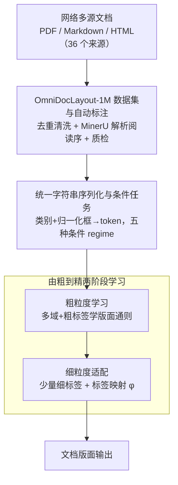

# OmniDocLayout: Towards Diverse Document Layout Generation via Coarse-to-Fine LLM Learning

**会议**: CVPR 2026  
**论文**: [CVF Open Access](https://openaccess.thecvf.com/content/CVPR2026/html/Kang_OmniDocLayout_Towards_Diverse_Document_Layout_Generation_via_Coarse-to-Fine_LLM_Learning_CVPR_2026_paper.html)  
**代码**: https://github.com/opendatalab/OmniDocLayout  
**领域**: NLP / LLM 应用（文档版面生成）  
**关键词**: 文档版面生成、由粗到精学习、百万级版面数据集、轻量 LLM、序列建模

## 一句话总结
针对现有文档版面生成数据「只有学术论文、样式单一」的痛点，作者先造了首个百万级、覆盖六类文档的多样化版面数据集 OmniDocLayout-1M，再用一个 0.5B 的小 LLM 通过「先在多域粗标签上学版面通则、再用少量细标签适配具体领域」的由粗到精范式，在 M6Doc 上同时超过专用版面生成模型和 GPT-4o/Gemini/Claude 等通用大模型。

## 研究背景与动机
**领域现状**：文档 AI 这几年发展很快，但精力大多花在「文档版面分析（DLA）」即从页面里抽结构，与之对偶的「版面生成」——把文本块、表格、图片等元素排成合理布局——长期被冷落。相比图形设计排版或房间布局规划，文档版面生成每页元素更多、不同文档类型结构差异极大，更难。

**现有痛点**：作者梳理出两个卡点。其一是**数据稀缺且偏科**：PubLayNet、DocBank 这类大库样本虽多，却几乎只有简单 Manhattan 式（单/双栏）学术论文；M6Doc、OmniDocBench 虽覆盖报纸杂志等现代类型，但样本量 <10K，撑不起大规模训练，整个版面数据呈严重长尾。其二是**复杂长序列场景表现差**：扩散类版面模型（LayoutDM、LACE）数据饥渴、复杂域难收敛；基于 LLM 的方法（LayoutPrompter、LayoutCoT）直接微调或上下文学习在复杂域上学习难度高、频繁失败。

**核心矛盾**：要让模型学会复杂、多样的版面，就需要大量细粒度标注的多域数据；但细粒度标注昂贵稀缺，而直接在少量复杂数据上硬学又容易过拟合、迁移差——「数据多样性」与「标注成本/学习难度」之间存在尖锐 trade-off。

**本文目标**：(1) 提供一个规模大、类型多、标注自动化的版面数据集；(2) 设计一种能在「细标注稀缺」前提下仍学好复杂版面的训练范式。

**切入角度**：作者观察到——不同文档类型版面风格差异很大，但它们**共享一套基本审美法则**（对齐、避免重叠、空间组织）。那么可以先用海量多域、只需**粗标签**的数据把这套通用法则学扎实，再用极少量细标签去适配具体领域。

**核心 idea**：用「由粗到精（Coarse-to-Fine）」两阶段学习，让一个轻量 LLM 先学版面通则、再少样本适配特定领域，从而绕开「细粒度标注稀缺 + 复杂版面难直接学」的双重障碍。

## 方法详解

### 整体框架
OmniDocLayout 由两块组成：数据侧的 **OmniDocLayout-1M**（百万级多样化版面数据集 + 全自动标注流水线）和模型侧的 **OmniDocLayout-LLM**（0.5B 小模型 + 由粗到精训练）。整条管线是：从互联网多源采集 PDF/Markdown/HTML 文档 → 经预处理、自动标注、质检得到百万级版面 → 把每个版面元素 $(c,x,y,w,h)$ 序列化成统一字符串 token 并配上条件 prompt → 先在多域粗标签数据上做粗粒度学习、再用少量细标签做细粒度适配 → 输出符合审美与用户约束的文档版面。

### 关键设计

**1. OmniDocLayout-1M 数据集与全自动标注流水线：用「自动化」换「规模 × 多样性」**

针对「现有数据偏科、样本少、来源过时、人工标注难扩展」四个具体缺陷，作者从 36 个公开且版权干净的来源（学术库 13、出版商 7、文档共享平台 16）采集，覆盖教材、报纸、杂志、试卷、学术、幻灯片六类，并在采集后做格式标准化（PDF/Markdown 统一）、去重和质量分析过滤噪声页。标注上用开源工具 MinerU 自动转成元素序列——关键是 MinerU 的输出**贴合自然阅读顺序**，这是其他数据集都不提供、却对连贯版面生成至关重要的属性。对 MinerU 难处理的报纸，作者手标 1,000 张并微调一个 DocLayout-YOLO 来补强密集不规则布局。最终得到约 1M 样本、约 48M 元素实例（是 DocBank 的两倍多），并做了盲测人评：1,200 页中标注质量与人工标注「感知相当」的比例 ≥92%。这套全自动流水线让「规模」和「多样性」第一次在文档版面数据上同时拿到。

**2. 统一字符串序列化与五种条件任务：把版面生成统一成一个序列建模问题**

每个元素是五元组 $e_i=(c,x,y,w,h)$，$c$ 是类别，$(x,y)$ 为框坐标、$(w,h)$ 为宽高，坐标归一化并均匀量化到 $[0,999]$。作者没有用 HTML 风格 prompt——因为 LGGPT 的实证表明 `<body>` 这类结构描述符信息量低却拖慢训练推理、效果还更差——而是沿用 LGGPT 的**纯字符串前缀编码** `<|cat_start|>c<|cat_end|><|box_start|>x y w h<|box_end|>`。页面级 prompt 由三段拼成：Base Prompt（文档类型、画布尺寸、框数量、合法类别集）、Condition Prompt（任务相关条件）、Task Prompt（目标指令）。在此之上定义**五种条件 regime** 把任务按类别 C／尺寸 S／位置 P 拆解：U-Cond（无条件）、C→S+P（给类别预测尺寸+位置）、C+S→P（给类别和尺寸补位置）、Completion（保留 0–20% 元素补全其余）、Refinement（对几何属性加高斯噪声 $\mathcal{N}(0,10^{-2})$ 后复原）。这样可控生成、约束放置、补全、编辑被统一进同一个自回归框架。

**3. 由粗到精两阶段学习范式：用「先易后难」绕开细标注稀缺**

这是论文的方法核心，把任务拆成 $(\mathbb{D}_{\mathrm{coar}},\mathbb{C}_{\mathrm{coar}})\xRightarrow{\text{Transfer}}(\mathbb{D}_{\mathrm{fine}},\mathbb{C}_{\mathrm{fine}})$ 两段。**粗粒度学习**在 OmniDocLayout-1M 的多样文档类型上、用一套覆盖 text/table/image/title/caption/footnote 等核心成分的粗标签集 $\mathbb{C}_{\mathrm{coar}}$ 训练，让模型获得跨域可迁移的空间先验与结构规律（对齐、避重叠等审美通则）。**细粒度适配**则在目标域 $\mathbb{D}_{\mathrm{fine}}$（如 M6Doc 的报纸/试卷/学术）上用监督序列建模微调，依赖一个**标签映射** $\phi:\mathbb{C}_{\mathrm{coar}}\to\mathbb{C}_{\mathrm{fine}}$，把每个粗类展开成细粒度子类（如 "text" $\mapsto$ {"paragraph","lead","ordered\_list"}），在保留粗粒度先验的同时得到更锐利的类型感知类别。这个范式的价值在消融里被坐实：因为通则已学好，Stage 2 只需**几百个**细标注样本即可有效适配，从而同时化解了「细标注稀缺」和「复杂版面难直接学」两个障碍。

### 损失函数 / 训练策略
模型基座是 Qwen2.5-0.5B-Instruct，目标就是给定序列化 token $T=(t_1,\dots,t_K)$ 最大化条件对数似然（标准自回归语言建模）。粗粒度阶段从 1M 数据按五任务 1:1:1:3:3 构造约 9M 样本，40 张 A100 训练 1 epoch（约 20 小时，batch 16/卡，lr 1e-4）；细粒度阶段同样的数据构造策略、各类别训 5 epoch，8 张 A100 约 2 小时，lr 降到 5e-5。

## 实验关键数据

### 主实验
在 M6Doc 五类文档上评测，指标含 **FID**（生成与真实版面的特征分布距离，越低越好）、**mIoU**（最优匹配后元素的平均 IoU，越高越好）、**Alignment（Ali，对齐度，×100 显示，越接近真值越好）**、**Overlap（Ove，重叠度，越接近真值越好）**。下表取 U-Cond 任务下的 FID 对比（越低越好）：

| 文档类型 | LayoutDM | LGGPT | OmniDocLayout (Ours) |
|----------|----------|-------|----------------------|
| Textbook | 180.25 | 197.81 | **40.28** |
| Newspaper | 281.56 | 154.20 | **39.73** |
| Magazine | 281.91 | 162.94 | **41.82** |
| Exam | 287.58 | 157.11 | **40.32** |
| Academic | 153.66 | 236.72 | **36.48** |

对比零样本通用大模型（U-Cond FID，越低越好），本文 0.5B 小模型也全面领先：

| 文档类型 | GPT-4o | Gemini-2.5-Flash | Claude-3.7-Sonnet | Ours |
|----------|--------|------------------|-------------------|------|
| Textbook | 135.32 | 147.88 | 96.23 | **40.28** |
| Newspaper | 193.13 | 194.77 | 171.01 | **39.73** |
| Academic | 135.60 | 57.36 | 106.98 | **36.48** |

扩散类（LayoutDM/LACE）因数据饥渴在低资源复杂域全面崩盘；LGGPT 的 GPT2-XL 基座在长 prompt 上常输出不连贯结果；通用大模型 zero-shot 虽对齐/重叠尚可但随机性大、报纸这类复杂版面 FID 最高。本文在 mIoU 上的增益尤其显著。

### 消融实验
在最难的报纸域上做两阶段消融（F.=仅细粒度适配，C.=仅粗粒度学习，Both=完整）：

| 任务 | 配置 | FID↓ | Ali.→ | Ove.→ | mIoU↑ |
|------|------|------|-------|-------|-------|
| U-Cond | F. | 42.98 | 0.017 | 8.308 | 0.000 |
| U-Cond | C. | 249.1 | 0.016 | 0.388 | 0.000 |
| U-Cond | **Both** | **39.73** | 0.015 | **0.084** | 0.000 |
| C→S+P | F. | 14.88 | 0.024 | 0.493 | 0.164 |
| C→S+P | **Both** | **10.71** | 0.014 | **0.086** | **0.185** |
| Refin. | F. | 22.07 | 0.023 | 1.452 | 0.618 |
| Refin. | **Both** | **10.60** | 0.017 | **0.064** | **0.732** |

模型尺寸消融（0.5B / 1.5B / 3B）显示差异很小：3B 的 Ali 略好但多数任务 FID 反升，说明版面生成不严格遵循常规 scaling law，故选最省的 0.5B。

### 关键发现
- **两阶段缺一不可**：只做粗粒度（C.）因不匹配目标域 FID 很差，但其 Overlap 远低于只做细粒度（F.），说明粗粒度预训练强制注入了「避重叠/对齐」等基本审美法则；在此基础上细粒度适配再补足元素级细节，完整范式稳定优于两个单阶段变体。
- **小模型够用**：受限测试样本下 FID 本身波动大，加上大 LLM 可能优化不充分/过拟合，0.5B 在性价比上最优。
- **mIoU 出现多个 0**：源于其定义要求精确的标签级匹配，在 U-Cond、Completion 这类多元素复杂版面里常常匹配不上，作者也指出现有指标在复杂版面少样本评测下的不足。

## 亮点与洞察
- **「共享审美法则」这一观察是整套方法的支点**：正因为不同文档类型底层共享对齐/避重叠等通则，才使得「粗标签多域预训练 + 少样本细适配」成立——这把一个看似需要海量细标注的问题，转化成了海量粗标注（自动可得）+ 极少细标注的问题。
- **用对偶任务（解析）反哺生成**：MinerU 等解析工具的成熟让「返回全自动标注」变得可行，作者顺势把解析能力转成了生成所需的高质量、带阅读序的标注，是一个巧妙的工具复用。
- **0.5B 打赢 GPT-4o/Claude** 的结果提醒：在结构化、有明确法则的窄任务上，针对性数据 + 训练范式可以轻松碾压通用大模型的零样本能力，scaling 不是万能。
- 「先学通则、再少样本适配」的范式可迁移到其他结构化生成任务（如 UI 布局、海报排版、图表生成），只要任务也存在「跨域共享的底层规则 + 域特定细类别」结构。

## 局限与展望
- 作者承认**现有指标在复杂版面少样本下不可靠**：FID 在小测试集上波动大、mIoU 因严格标签匹配频繁归零，难以稳定反映复杂版面质量。
- 细粒度适配仍需「目标域有细标签」，对完全没有任何细标注的新文档类型如何零样本迁移，论文未充分探讨。⚠️ 标签映射 $\phi$ 当前似为人工设计的粗→细展开规则，跨域可扩展性以原文为准。
- 评测集中在 M6Doc 五类，类型外（如复杂表单、含手写的混合页）泛化性待验证；可改进方向包括设计更贴合复杂版面的评测指标、以及让 $\phi$ 自动化/可学习。

## 相关工作与启发
- **vs LGGPT / LayoutNUWA（域无关 LLM 范式）**：它们追求纯字符串/HTML 补全的域无关泛化，但只在有限文档类型上测过、且算力需求大；本文沿用 LGGPT 的字符串编码，但用「粗到精两阶段 + 百万多域数据」专门攻克复杂多样版面，效果与数据多样性显著更强。
- **vs LayoutPrompter / LayoutCoT（基于 prompt/检索的 LLM 方法）**：它们靠上下文学习或思维链，高度依赖 prompt 工程和检索启发式、且偏域特定；本文是训练范式层面的改进，不依赖检索，复杂域更稳。
- **vs LayoutDM / LACE / LayoutFlow（扩散/流匹配）**：扩散类数据饥渴、复杂低资源域难收敛（作者训 LayoutFlow 超 100K epoch 仍不收敛）；本文用自回归 LLM + 少样本适配避开了这一痛点。

## 评分
- 新颖性: ⭐⭐⭐⭐ 数据集贡献扎实、由粗到精范式契合问题本质，但单阶段课程式思路本身不算全新。
- 实验充分度: ⭐⭐⭐⭐⭐ 五类文档 × 五任务 × 专家/通用 LLM 双线对比 + 阶段与尺寸消融，覆盖很全。
- 写作质量: ⭐⭐⭐⭐ 动机—数据—方法链条清晰，公式与图示到位；部分指标解读（mIoU 归零）略需读者自行消化。
- 价值: ⭐⭐⭐⭐⭐ 首个百万级多样化版面数据集 + 开源 0.5B 模型，对 Document AI 生成方向是强基建。

<!-- RELATED:START -->

## 相关论文

- [\[CVPR 2026\] LLM-Guided Probabilistic Fusion for Label-Efficient Document Layout Analysis](llm-guided_probabilistic_fusion_for_label-efficient_document_layout_analysis.md)
- [\[ACL 2025\] EdiText: Controllable Coarse-to-Fine Text Editing with Diffusion Language Models](../../ACL2025/llm_nlp/editext_diffusion_text_editing.md)
- [\[ACL 2025\] From Selection to Generation: A Survey of LLM-based Active Learning](../../ACL2025/llm_nlp/from_selection_to_generation_a_survey.md)
- [\[ICML 2025\] Safe Delta: Consistently Preserving Safety when Fine-Tuning LLMs on Diverse Datasets](../../ICML2025/llm_nlp/safe_delta_consistently_preserving_safety_when_fine-tuning_llms_on_diverse_datas.md)
- [\[AAAI 2026\] VSPO: Validating Semantic Pitfalls in Ontology via LLM-Based CQ Generation](../../AAAI2026/llm_nlp/vspo_validating_semantic_pitfalls_in_ontology_via_llm-based_cq_generation.md)

<!-- RELATED:END -->
