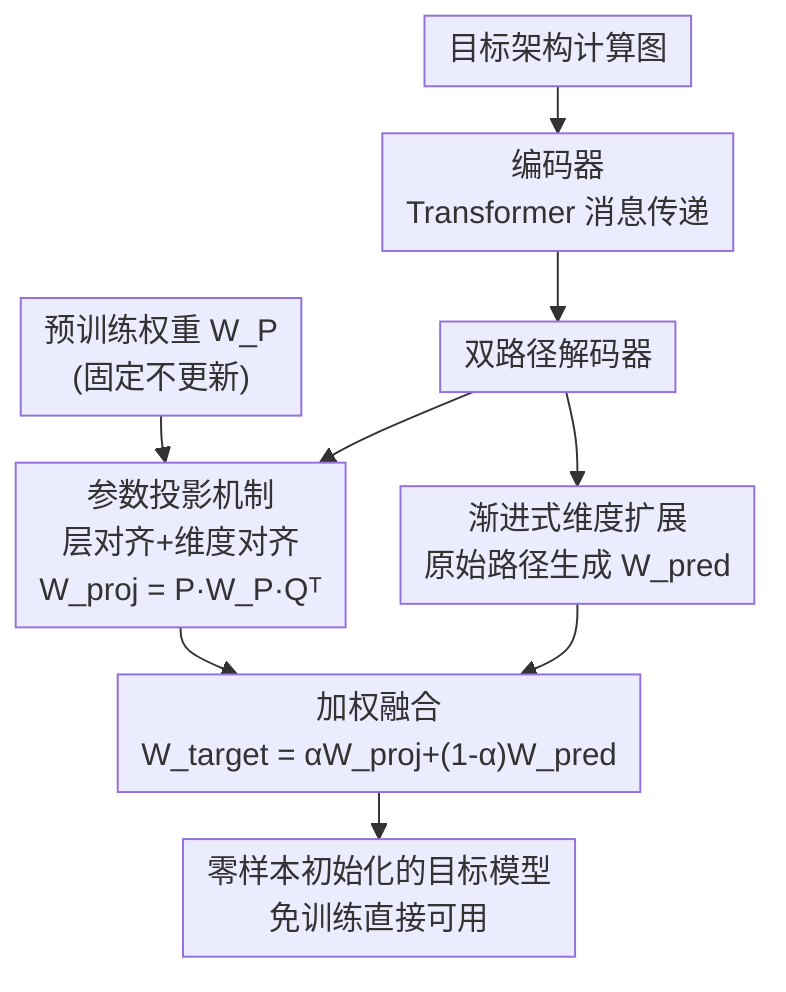

# Unlocking Pre-trained Weights: Parameter Inheritance for Zero-Shot Initialization

**会议**: CVPR 2026  
**论文**: [CVF Open Access](https://openaccess.thecvf.com/content/CVPR2026/html/Xu_Unlocking_Pre-trained_Weights_Parameter_Inheritance_for_Zero-Shot_Initialization_CVPR_2026_paper.html)  
**代码**: https://github.com/mathieuxu/PITH-ParameterInheriTance-HyperNetwork  
**领域**: 模型初始化 / 超网络 / 参数生成  
**关键词**: 图超网络, 参数继承, 零样本初始化, 参数投影, ViT

## 一句话总结
PITH 用图超网络给目标网络动态生成「投影矩阵」，把预训练大模型的内部权重直接投影到任意尺寸的目标 ViT 上完成初始化，使得初始化后的网络无需任何训练就能直接用——在 ImageNet-1K 上 ViT-Base 零样本精度 53.35%，比上一代 SOTA（TAL）高 6.54%。

## 研究背景与动机
**领域现状**：给一个新架构挑一组好的初始权重，能显著降低训练成本、加速收敛。图超网络（Graph HyperNetwork, GHN）是做这件事的代表工具：它把目标网络的架构编码成一张计算图（节点是卷积、自注意力这类算子），再用一个解码器把每个节点的表示映射成对应层的真实参数矩阵，一次前向就能"生成"一整个初始化好的网络。GHN 本身通过元训练学会这套映射——在 ImageNet 这类大代理任务上评估生成出来的模型，用任务损失反传去更新 GHN。

**现有痛点**：GHN 的元训练通常是**从零开始**的，完全无视了公开预训练模型里那一大堆现成知识。最近的 Task-Aware Learngene（TAL）想用上这份知识，但它只用了**功能层面**的——把预训练模型当成一个"间接老师"，拿它输出的软标签当监督信号。问题是这种监督太绕：梯度要先穿过整个被生成出来的目标模型，才能更新到 GHN，这条长路径会引入噪声、稀释学习信号；而预训练模型**最直接、最有料的那部分——它的内部权重参数本身——反而被彻底浪费了**。

**核心矛盾**：知识藏在预训练权重里，但目标网络的尺寸（层数、隐藏维度）千变万化，预训练权重的维度和目标对不上，没法直接搬过去。给每一种目标配置都手工学一组投影矩阵又完全不现实。

**本文目标**：找到一种机制，能把预训练模型的**真实权重**直接搬到任意尺寸的目标网络上，且只需一次前向就完成初始化。

**切入角度**：超网络的看家本领正是"按目标规格动态生成参数矩阵"。那么——与其让超网络直接生成目标权重，不如让它按目标规格**动态生成投影矩阵**，再用这组投影矩阵把预训练权重变换到目标维度。

**核心 idea**：用超网络生成「尺寸自适应的投影矩阵」，把预训练权重直接投影继承到目标模型，实现"零样本初始化"（zero-shot initialization：单次前向就给任意配置生成可用的好参数，注意这与传统泛化到未见类别的零样本学习不是一回事）。

## 方法详解

### 整体框架
PITH（Parameter InheriTance HyperNetwork）建立在最新的图超网络 LoGAH 之上，把它的单一解码器扩展成**双路径解码器**。输入是目标模型的架构计算图 + 一个固定的预训练模型权重 $W_P$（这里用预训练 ViT-Large），输出是目标模型的一整套初始化权重。

编码器（Transformer）先在计算图上做多层消息传递，得到每个节点的上下文表示；解码器随后兵分两路：**投影路径**按节点动态生成投影矩阵 $P,Q$，把预训练权重 $W_P$ 投影成 $W_{proj}$（参数继承）；**原始路径**沿用 GHN 直接从图特征预测权重 $W_{pred}$（残差预测，负责适配架构差异）。两路加权融合 $W_{target}=\alpha W_{proj}+(1-\alpha)W_{pred}$ 得到最终目标权重，灌进目标网络即得到一个无需训练就能用的模型。

### 关键设计

**1. 双路径解码器：让超网络既"继承"又"补差"**

TAL 的根本问题是只能间接蹭预训练知识，PITH 干脆把解码器拆成两条互补的路径，把"继承现成权重"和"适配新架构"这两件事分开做。**投影路径**负责把预训练权重 $W_P$ 直接搬过来——这是知识的主体；**原始路径**保留 GHN 原本"看图说参数"的能力，专门补偿目标架构与预训练模型之间的结构差异（相当于在继承的基础上做残差预测）。两路按系数 $\alpha$ 融合：

$$W_{target}=\alpha W_{proj}+(1-\alpha)W_{pred}$$

$\alpha$ 控制"继承预训练知识"与"超网络自适应"之间的配比。这样设计的好处是直接用上了预训练模型最硬核的部分——内部权重本身，而不再绕一圈靠软标签反传；同时又不至于被预训练架构死死框住，原始路径留了适配空间。关键的是，预训练权重 $W_P$ 全程作为**固定输入**参与，不参与更新，超网络要学的只是"怎么把它投影好"。

**2. 参数投影机制：层对齐 + 维度对齐，把任意尺寸的预训练权重搬到目标上**

这是 PITH 真正啃下的硬骨头——预训练模型和目标模型的层数、每层维度都不一样，权重没法直接对位。PITH 分两步解决。**层对齐**用 first-N 策略：目标有 $N$ 层、预训练有 $M\ge N$ 层时，目标第 $i$ 层就对齐到预训练第 $i$ 层（假设底层捕捉的特征更可迁移）。**维度对齐**用两个投影矩阵把预训练权重 $W_P\in\mathbb{R}^{h_P\times w_P}$ 左右各乘一下，变换到目标维度 $W_{proj}\in\mathbb{R}^{h_{proj}\times w_{proj}}$：

$$W_{proj}=P\,W_P\,Q^T,\quad P\in\mathbb{R}^{h_{proj}\times h_P},\ Q\in\mathbb{R}^{w_{proj}\times w_P}$$

这种"左乘行投影、右乘列投影"的因式分解变换，能高效适配各种维度配置。关键是这些投影矩阵不是固定的，而是由解码器**按每个参数块（注意力的 QKV、FFN 的 MLP 等）的具体维度动态生成**：解码器沿用 LoGAH 的低秩生成策略，对每个节点先把隐藏特征经多层线性层逐步扩展，reshape 成 2D 后扩到预定义最大容量 $d_{max}$（为容纳最大可能的目标架构），再 split 与 crop 到目标层实际尺寸，得到两个低秩因子 $A'\in\mathbb{R}^{h_{proj}\times r}$、$B'\in\mathbb{R}^{h_P\times r}$，外积得投影矩阵 $P=A'B'^T$；$Q$ 同理生成。这样一来，"给每种目标配置手配投影矩阵"的不可行问题，就被超网络的按需生成能力化解了。

**3. 渐进式维度扩展：把原始路径的"一步跨大步"拆成几小步，稳住参数生成**

原始 GHN/LoGAH 解码器在生成权重时，要从低秩维度 $r$ 一步扩张到最大容量 $d_{max}$，这种大跨步的维度变换不稳定、还会丢信息。PITH 给原始预测路径换上**渐进式维度扩展**：不再一步到位，而是插入中间 MLP 层、经过若干中间维度**分阶段逐步扩张**。更平滑的过渡更好地保留了表征容量，缓解了大跨度变换里的信息损失，同时几乎不增加计算量。消融显示这一步比参数投影本身掉点还多（去掉它掉 2.59%，去掉投影掉 2.12%），说明稳定的参数生成是双路径能发挥作用的前提。

### 损失函数 / 训练策略
PITH 沿用 GHN/Learngene 的元训练范式，没有引入新的损失项：每次迭代采样若干目标架构和数据样本，用超网络生成参数、灌进目标网络前向，算交叉熵损失反传更新超网络。主实验在 ImageNet-1K 上训 200 epoch（混合精度、cosine 退火、$lr=3\text{e-}4$、weight decay $1\text{e-}2$、预测参数正则 $\gamma=3\text{e-}5$），Decathlon 多任务实验则先 ImageNet 预训练再 100 epoch 联合微调，并按温度采样（$T=2$）平衡各任务。

## 实验关键数据

### 主实验
零样本初始化（生成后**不训练**直接评估）是 PITH 的招牌场景。12 层 ViT 在 ImageNet-1K 上的零样本精度：

| 配置 | GHN-3 | LoGAH | TAL | PITH | 较 TAL 提升 |
|------|-------|-------|-----|------|------|
| Tiny | 34.95 | 44.82 | 46.74 | 53.27 | +6.53 |
| Small | 35.33 | 44.85 | 46.81 | 53.35 | +6.54 |
| Base | 33.74 | 37.63 | 46.35 | 53.35 | +7.00 |

进一步训练 75 epoch 后 PITH 仍保持领先（ImageNet-1K，Base：PITH 67.29 vs TAL 64.28，仍高 3.01）。训练成本几乎不增加：

| 方法 | 训练时间(h) | 平均精度(%) |
|------|------|------|
| LoGAH (200 ep) | 89.52 | 38.65 |
| TAL (200 ep) | 92.37 | 43.72 |
| TAL (300 ep) | 139.25 | 47.54 |
| PITH (200 ep) | 95.43 | 51.03 |

即便让 TAL 多训 100 epoch（共 300 ep、139h），它 47.54% 仍比 PITH 200 ep 的 51.03% 低 3.49%——PITH 是在可比训练开销下拿到更高精度。在 Decathlon 9 个任务的零样本初始化上，PITH 在各尺度各深度上几乎全面领先（如 12-Tiny 平均 49.00 vs TAL 47.06）；训练 100 epoch 后 ViT-Tiny/Small 平均分别超 TAL 2.67/2.34；在 F-MNIST、FER2013、HAM10000 三个未见任务上也收敛更快、精度更高。

### 消融实验
在 ViT-Tiny/Small（6、9 层）、ImageNet-1K 上拆组件：

| 配置 | 参数投影 | 渐进维度扩展 | 平均精度 |
|------|------|------|------|
| 完整 PITH | ✓ | ✓ | 49.02 |
| w/o 参数投影 | ✕ | ✓ | 46.90 (↓2.12) |
| w/o 渐进维度扩展 | ✓ | ✕ | 46.43 (↓2.59) |

低成本变体（投影/预测两路共享大部分 MLP、只在输出头分叉）：

| 实现 | 参数量(M) | 平均精度(%) |
|------|------|------|
| LoGAH（基线） | 21.41 | 45.73 |
| Dual-Pathway | 41.59 | 46.43 |
| Shared-Pathway | 24.40 | 46.08 |

### 关键发现
- **两个组件都不可少，且渐进维度扩展贡献更大**：去掉它掉 2.59% > 去掉参数投影掉 2.12%。这说明"稳定地生成参数"是前提——投影路径再好，若原始路径在大跨度变换里就先崩了，融合也救不回来。
- **共享路径变体性价比极高**：只比 LoGAH 多 13.9% 参数（24.40M vs 21.41M），就能反超基线 0.35%，证明"从预训练投影参数"这个机制即便在最小架构开销下也有效。
- **参数空间分布对齐解释了为什么有效**：可视化 QKV 参数与预训练 ViT-Large 的相似度，PITH 各层平均余弦相似度 0.836 / Pearson 0.844，明显高于 TAL（0.802/0.814）和 LoGAH（0.793/0.809）——直接投影让初始化模型更贴近预训练模型的参数空间，这与它更强的零样本初始化表现高度相关。

## 亮点与洞察
- **把"用预训练知识"从功能层面拉回到权重层面**：TAL 靠软标签是隔着整个目标模型反传梯度的间接监督，PITH 直接拿预训练权重当固定输入投影继承，路径短、信号强。这种"别绕弯子，直接搬权重"的思路对任何想复用大模型的初始化方法都有启发。
- **超网络生成"投影矩阵"而非"权重本身"是点睛之笔**：投影矩阵把"任意尺寸目标"这个组合爆炸问题，转化成超网络按需生成的常规任务，优雅地绕开了"每种配置手配一组矩阵"的不可行性。这种"让超网络生成变换算子、而非生成最终物"的范式可迁移到其他需要跨尺寸搬运参数的场景。
- **渐进维度扩展是个朴素但关键的工程洞察**：一步从 $r$ 扩到 $d_{max}$ 会丢信息，拆成几小步就稳了——消融里它甚至比"参数投影"这个主卖点贡献还大，提醒做参数生成时维度变换的平滑性不能忽视。
- **零样本初始化这个设定本身很有想象空间**：单次前向给任意架构生成可用权重，对数据稀缺、算力受限的下游任务（论文里医学 HAM10000 等）尤其友好。

## 局限与展望
- **first-N 层对齐过于朴素**：直接拿目标第 $i$ 层对齐预训练第 $i$ 层，依赖"底层更可迁移"的假设，没有考虑层间语义对齐，深层网络上可能并非最优；自适应的层匹配也许还有提升空间。
- **只验证了 ViT 一类同构架构**：预训练用 ViT-Large、目标也是 ViT 家族，跨架构族（如 CNN↔Transformer）的参数继承能不能成立，论文未涉及。
- **$\alpha$ 是个超参而非学出来的**：继承与自适应的配比靠固定系数权衡，论文未讨论它的敏感性或让它逐层/逐块自适应的可能。
- **零样本精度的绝对水平仍不高**：ImageNet-1K 53% 上下，离实用还有距离，目前更适合做"省训练成本的好起点"而非"免训练即可部署"。

## 相关工作与启发
- **vs TAL（Task-Aware Learngene）**：两者都在 Learngene 框架下、用预训练模型，但 TAL 只用功能层面的软标签做间接监督，梯度要穿过整个目标模型；PITH 直接把预训练**内部权重**投影继承，是 TAL 的扩展且更直接高效，零样本精度高 6.5+ 个点。
- **vs LoGAH / GHN-3**：PITH 建在 LoGAH 的低秩生成之上，但 LoGAH/GHN 元训练从零开始、完全不用预训练知识；PITH 把低秩生成策略复用到"生成投影矩阵"上，并加了双路径与渐进维度扩展。
- **vs 权重选择（Weight Selection, first-N 来源）**：权重选择用启发式规则从预训练模型抽参数初始化，缺乏自适应学习；PITH 用超网络学出可学习的投影矩阵，能在多样配置间自动发现更优的继承策略。
- **vs 迁移学习 / 知识蒸馏 / 剪枝**：这些都是利用预训练模型的经典路线，但"跨不同目标架构直接投影复用预训练参数"此前少有人做，PITH 填的正是这块空白。

## 评分
- 新颖性: ⭐⭐⭐⭐ 首次在 GHN 框架里直接投影继承预训练内部权重，把"生成权重"换成"生成投影矩阵"的视角很巧。
- 实验充分度: ⭐⭐⭐⭐ Decathlon + 未见任务 + 训练时间 + 参数空间可视化覆盖全面，消融清晰；但只验证了 ViT 同构架构。
- 写作质量: ⭐⭐⭐⭐ 动机递进清楚（间接监督→直接继承→维度难题→超网络生成投影），图 1/图 2 把双路径与投影机制讲得明白。
- 价值: ⭐⭐⭐⭐ 给数据/算力受限场景提供低成本高质量初始化，思路对参数复用类方法有启发；绝对精度尚不足以免训练直接部署。

<!-- RELATED:START -->

## 相关论文

- [\[AAAI 2026\] GranAlign: Granularity-Aware Alignment Framework for Zero-Shot Video Moment Retrieval](../../AAAI2026/llm_pretraining/granalign_granularity-aware_alignment_framework_for_zero-shot_video_moment_retri.md)
- [\[ECCV 2024\] Prompting Language-Informed Distribution for Compositional Zero-Shot Learning](../../ECCV2024/llm_pretraining/prompting_language-informed_distribution_for_compositional_zero-shot_learning.md)
- [\[NeurIPS 2025\] ZEUS: Zero-shot Embeddings for Unsupervised Separation of Tabular Data](../../NeurIPS2025/llm_pretraining/zeus_zero-shot_embeddings_for_unsupervised_separation_of_tabular_data.md)
- [\[AAAI 2026\] PrefixGPT: Prefix Adder Optimization by a Generative Pre-trained Transformer](../../AAAI2026/llm_pretraining/prefixgpt_prefix_adder_optimization_by_a_generative_pre-trained_transformer.md)
- [\[ACL 2025\] AutoDS: Autonomous Data Selection with Zero-shot Generative Classifiers for Mathematical Texts](../../ACL2025/llm_pretraining/autonomous_data_selection_with_zero-shot_generative_classifiers_for_mathematical.md)

<!-- RELATED:END -->
