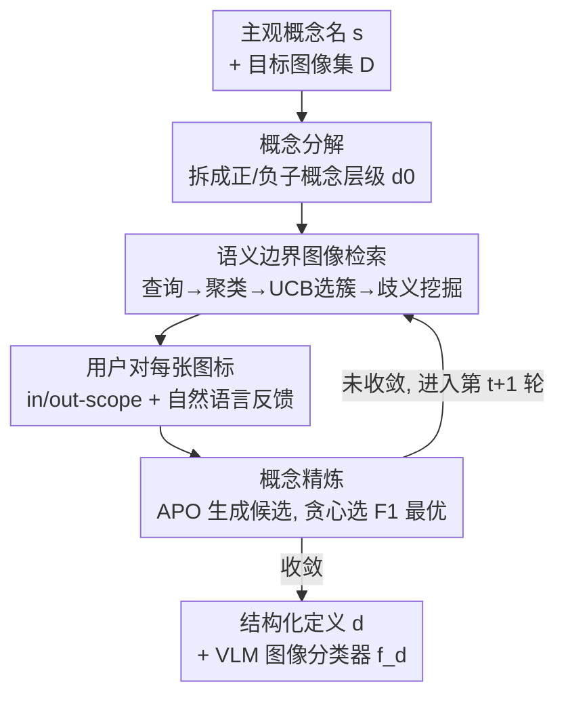

# Agile Deliberation: Concept Deliberation for Subjective Visual Classification

**会议**: CVPR 2026  
**论文**: [CVF Open Access](https://openaccess.thecvf.com/content/CVPR2026/html/Wang_Agile_Deliberation_Concept_Deliberation_for_Subjective_Visual_Classification_CVPR_2026_paper.html)  
**代码**: https://github.com/google-research/google-research/tree/master/agile_deliberation  
**领域**: LLM推理 / 人在回路 / 多模态VLM  
**关键词**: 主观视觉分类, 概念审议, 人在回路, 提示优化, 边界样本检索  

## 一句话总结
针对"健康食物""标题党"这类边界模糊的主观概念，提出 Agile Deliberation 人在回路框架：先把概念分解成正/负子概念层级，再迭代地检索"语义边界样本"让用户标注与反思、并自动把反馈编译成 VLM 提示，使图像分类器逐轮对齐用户不断演化的意图，18 场真人实验中 F1 比自动分解基线高 7.5%、比手动审议高 3%+。

## 研究背景与动机
**领域现状**：计算机视觉长期聚焦于"狗、车、番茄"这类客观、有公认答案的概念。但越来越多真实应用要识别**主观概念**——内容审核里"什么算不安全图片"、内容策展里"什么算精致美食"，这些概念的边界本身就有争议。主流人在回路方法（Agile Modeling 靠人工标几百张图、或让专家给 VLM 手写提示）默认用户一开始就对概念有清晰、稳定的理解。

**现有痛点**：作者通过对内容审核专家的结构化访谈发现，现实恰恰相反——人们常常一开始只有模糊想法，必须通过反复审视边界案例来**逐步澄清自己的定义**，作者把这一实践称为"概念审议"（concept deliberation）。如果没有精雕细琢的定义作为 few-shot 提示，下游 VLM 分类器会任意消解歧义、抓不到用户真正想要的决策边界；而且专家随着看的样本变多，标注会前后不一致，这在只有小数据可微调的真实场景里尤其有害。

**核心矛盾**：现有工具假设"定义是静态且已知的"，但主观概念的本质是"定义在交互中演化"。把演化中的、主观的概念，可靠地落成一个 VLM 分类器，这个过程缺乏系统支持。

**本文目标**：构建一个人在回路框架，既帮用户**写出**一份人类可读的结构化概念定义，又能把这份定义直接当作 VLM 提示去**诱导**出一个高性能图像分类器，并让二者随用户理解的演化同步更新。

**切入角度**：作者把真实审核专家的审议策略拆解出来——他们先"圈定范围"（看代表性图像识别关键视觉信号），再"找边界图反思"。但专家自己也难以高效地翻出边界图、也难以把细腻理解对齐到分类器上。Agile Deliberation 就是把这套人工流程**自动化、产品化**。

**核心 idea**：用"语义边界样本"驱动的迭代审议代替静态提示——系统主动找出那些在当前定义下语义上最暧昧的图像，逼用户表态，再把反馈自动编译成更优的提示，让分类器贪心地朝用户意图收敛。

## 方法详解

### 整体框架
形式化地，给定图像空间 $X$、用户提供的主观概念名 $s$（如 $s=$ healthy food）以及可选的目标无标注图像集 $D=\{x_i\}_{i=1}^N$（无则默认用 WebLI 大规模网络数据）。系统要构造一份结构化概念定义 $d\in D_{\text{def}}$——一段带正/负子概念和边界案例的文本，它同时充当 (1) 人类可读的概念表述、(2) VLM 的提示，从而诱导出分类器 $f_d(x)=P(y=1\mid x;d)$。在 $t=1,2,\dots,T$ 轮中，系统不断扩充已标注集 $L_t$，并按 $d_{t+1}=\arg\max_{d'\in C_t}\text{F1}(f_{d'},L_t)$ 更新定义（$C_t$ 是根据用户反馈生成的候选定义集）。

整个流程分两个阶段：**概念圈定**（scoping，把初始概念分解成子概念层级）和**概念迭代**（iteration，多轮检索边界图 → 用户标注反思 → 自动精炼定义）。设计灵感来自对 5 位内容审核专家的访谈 + 对其工作流中 20 份高质量概念定义的定性编码。

具体实现用两类现成工具搭起来：① 图像检索引擎（把文本查询映射到视觉相似图，用网络图搜或 CLIP/ALIGN 嵌入近邻搜索）；② VLM 分类器（给定定义 $d$ 和图像 $x$，VLM 先生成思维链 rationale 再输出二元判断，沿用 Modeling Collaborator 的做法）。在此之上是三个核心模块，恰好对应框架图的三个贡献节点。

### 关键设计

**1. 概念分解模块：把一个模糊概念拆成可逐条裁决的子概念层级**

直接拿 $s=$ healthy food 这种复合概念去问 VLM，模型只能按通用先验任意发挥。作者借鉴人类用一阶逻辑组合视觉概念的方式，用**提示链推理**（prompt-chained reasoning）把概念先拆成少量单元概念：$s\Rightarrow\phi(u_1,\dots,u_M),\ M\le 3$，其中 $\phi$ 是单元概念上的合取/析取公式（如 people exercising 拆成 $u_1=$ people、$u_2=$ exercises）。$M$ 刻意保持小，因为单元概念太多反而难推理。每个单元概念 $u_m$ 再扩展成候选正子概念 $S_m^+$（如 healthy dish、fresh fruit）和负子概念 $S_m^-$（如 fried fast food、processed snacks），并为每个子概念生成文本查询、检索代表性图像给用户看。用户逐个裁决该子概念归正、归负、还是丢弃。最终得到初始结构化定义 $d_0=\{(S_m^+,S_m^-)\}_{m=1}^M$，并实例化出第一个分类器 $f_{d_0}$。这一步把"模糊整体"变成"一组可独立判断的视觉维度"，给后续迭代提供了可操作的脚手架。

**2. 语义边界图像检索模块：主动翻出"语义上最暧昧"的图，而非分类器置信度边界的图**

迭代阶段最关键的判断：边界样本要怎么找。一个直接想法是套用经典主动学习——选分类器预测概率接近 0.5（$|f_{d_t}(x)-0.5|\approx 0$）的样本。作者明确**拒绝**这条路：VLM 是生成式模型，输出概率往往**未校准**，会对人类觉得暧昧的图给出高置信、反之亦然；而且这里的"分类器"是靠提示 VLM 临时实例化的，根本没有良定义的 margin。于是改为在**语义空间**里找边界——找一组图 $B_t\subseteq D$，使得它们都贴近当前定义 $d_t$ 用自然语言隐含的决策边界（由 LLM/VLM 推理判断，而非模型置信度）。

实现是一条结构化的"检索-筛选"流水线：(1) **边界查询生成**——让 LLM 基于 $d_0$ 生成多样的边界查询（如 salads with heavy mayo dressings），每个查询检索 50–100 张图扩大候选池；(2) **去重+聚类**——跨候选池去近重复，用视觉编码器得到特征 $z(x)$，再用**字典学习**学一组基 $W$ 和稀疏码 $\alpha(x)$ 使 $z(x)\approx W\alpha(x)$，稀疏码相似的图聚成（可重叠的）簇，每簇对应一种共享视觉特性；(3) **簇选择**——把每个簇当作多臂老虎机的一个臂，记录奖励 $r_t(m)$（如该簇纠正的分类错误比例、或反馈丰富度），用 UCB 规则 $m_t=\arg\max_m\big(\hat\mu_t(m)+\rho_t\sqrt{\log t/n_t(m)}\big)$ 选下一个簇，从而把用户注意力导向"模型与人最不一致"的簇、压低已经"解决"的簇；(4) **歧义挖掘**——选中簇 $G_{m_t}$ 仍可能很大，抽子集让 VLM 给每张图生成一句话歧义摘要 $a(x)$，把摘要嵌入后挑出 $|B_t|\le 5$ 张、其嵌入在空间里抱成紧簇的图，确保每个审议批次只围绕**一个连贯的歧义维度**（如奶油酱含量、含糖量、份量大小）。这样用户每次面对的是一组沿同一可解释维度的边界图，能集中精力澄清一条标准。

**3. 概念精炼模块：把用户的口语化反馈自动编译成更优的 VLM 提示**

每轮用户给 $B_t$ 中每张图标 $y(x)\in\{0,1\}$ 并可附自由文本评论 $c(x)$（如"这沙拉奶油太多；少量淋酱可以算 in-scope"）；界面把用户标注与 $f_{d_t}(x)$ 及其 rationale 并排显示，二者冲突时用户给简短理由。精炼模块沿用**自动提示优化**（APO）：先把用户简短评论扩写成完整 rationale $r_{\text{user}}(x)$，再让 LLM 合成一组候选定义 $C_t=\{d_t^{(1)},\dots,d_t^{(M)}\}$，每个候选以不同方式修改 $d_t$ 来吸收新 rationale（如收紧奶油酱约束、澄清含糖量阈值）。然后用当前已标注集 $L_t$ 评估每个候选——拿 $d_t^{(m)}$ 提示 VLM 算它在 $L_t$ 上的 F1——按**贪心**更新 $d_{t+1}=\arg\max_m\text{F1}(f_{d_t^{(m)}},L_t)$，并把 $d_{t+1}$ 交给用户做可选手工编辑。作者特意用贪心而非 beam search 或马尔可夫链探索：贪心让定义的演化对用户**透明可追溯**，且计算量小，契合实时审议回路对低延迟的要求。

> ⚠️ **三者一致**：框架图的三个贡献节点（概念分解 / 语义边界检索 / 概念精炼）与上面三个关键设计一一对应；用户标注是脚手架步骤（嵌在检索与精炼之间），不单列设计。

### 实现细节
概念分解用 Gemini-Pro 2.5，其余所有任务（图像分类、边界查询生成、歧义挖掘）用 Gemini-Flash 2.5。基础模型**全程不微调**，刻意保证领域专家无论算力多少都能用。图像检索用现成近邻搜索；界面在 Google Colab 交互式 notebook 里实现。

## 实验关键数据

评测主观视觉分类本身就难——它没有静态客观的 ground truth，用户定义会在审议中流动，固定数据集和 LLM 模拟都抓不住"用户心智模型与分类器的动态对齐"。因此作者放弃离线基准，用 **18 场真人实验**（每场 90 分钟）来评：9 名无内容审核经验的参与者各做两场（一场 Agile、一场 Manual，不同概念），系统顺序随机化以缓解顺序效应。每场用户先用约 45 分钟写定义，再在 200 张留出测试图上标注以评估分类器，最后做问卷 + 15 分钟半结构化访谈。两个测试概念：paid to play（平台级审核：承诺不切实际奖励的标题党）和 healthy food（终端用户策展）。

### 主实验：分类性能（F1，括号内为标准差）

由于参与者对同一概念的理解复杂度不同，跨两组（Agile vs Manual）**不能直接比绝对值**，作者只比各系统相对其 zero-shot 基线的提升（下表 ↑ 行）。

| 概念 | 条件 | Agile 组 F1 | Manual 组 F1 |
|------|------|------|------|
| Paid to play | Zero-shot | 0.48 | 0.43 |
| | Modeling Collaborator | 0.53 | 0.47 |
| | 分配的审议系统 | **0.59** | 0.51 |
| | 相对 zero-shot 提升 | **+11%** | +8% |
| Healthy food | Zero-shot | 0.48 | 0.82 |
| | Modeling Collaborator | 0.50 | 0.78 |
| | 分配的审议系统 | **0.58** | 0.79 |
| | 相对 zero-shot 提升 | **+10%** | **−3%** |

平均看，Agile Deliberation 比 zero-shot 分类器高 10.5%、比自动分解的 Modeling Collaborator 高约 7% F1；增益主要来自**精度提升**、召回只小幅下降（zero-shot 倾向过度宽泛预测）。关键对照：Modeling Collaborator 只是 LLM 自动丰富定义、没有用户反馈，提升很有限——说明**纯自动精炼抓不住用户细腻意图**，必须有人在回路。

### 用户体验问卷（7 点量表，* 表示 p<.05）

| 问卷项 | Agile 均值(SD) | Manual 均值(SD) |
|--------|------|------|
| 达到好性能所需努力（越低越好） | **3.11 (1.62)*** | 4.67 (0.71)* |
| 成功表达概念想法（越高越好） | 5.56 (0.88) | 5.11 (1.54) |
| 定义概念时的挫败感（越低越好） | **1.78 (1.09)** | 2.33 (0.87) |
| 感到不安/有压力/烦躁（越低越好） | **1.67 (0.71)*** | 3.00 (1.41)* |
| 定义概念时的心理负担（越低越好） | **3.22 (2.05)** | 4.56 (1.01) |

### 关键发现
- **概念越主观、越偏离通用先验，审议价值越大**：paid to play 上 Agile/Manual 都比 zero-shot 强；但 healthy food 上 Manual 和 Modeling Collaborator 反而略低于 zero-shot——因为参与者对 healthy food 理解本就清晰（zero-shot F1 已达 0.82），审议空间小。Agile 仍能 +10%，说明它对"有细腻分歧"的概念尤其管用。
- **逐轮上升但有波动**（Figure 3）：F1 随迭代轮次整体上扬但起伏，作者归因于实时设计——提示优化为了交互响应性牺牲了穷尽式精炼；暗示更长审议可能带来更多增益。
- **降低非专家门槛**：Manual 组平均尝试 7.3 次搜索查询找边界图，常困在单一歧义类型（"我很难想出能反驳自己定义的查询"）；Agile 组则探索到更多样的歧义（食物非主体、高碳水配料、还在准备中的菜），且用自然语言反馈即可，无需自己写提示。9 名参与者**一致更偏好 Agile**。

## 亮点与洞察
- **"语义边界"vs"置信度边界"的辨析很清醒**：作者点破生成式 VLM 输出未校准、margin 本身没良定义，所以不能照搬主动学习的不确定性采样——这是把经典 AL 迁到 VLM 时真实存在的坑，值得任何"用 VLM 当分类器再做主动学习"的工作借鉴。
- **字典学习 + UCB 老虎机组织边界样本**：把边界图按可解释视觉维度聚簇、再用 bandit 把用户注意力导向"最该看"的簇，比单纯丢一堆暧昧图给用户高效得多；这套"按维度组织 + 探索利用"的采样思路可迁移到任何需要人工反思的数据策展任务。
- **贪心而非 beam search 是为透明性买单**：刻意选次优搜索换来"定义演化可追溯 + 低延迟"，体现了人在回路系统里"可解释性/可控性"常比"最优性"更重要。
- **评测方法论本身是贡献**：承认主观概念无静态 ground truth，转而用 18 场真人 live session 直接测"动态意图对齐"，并诚实地只比相对提升、给出 caveat（跨组绝对值不可比）。

## 局限与展望
- **样本量小、概念少**：仅 18 场、2 个概念、9 名非专家参与者，且因"同一人第二次做同概念会被首轮锚定"而只能跨人比性能，统计力受限。
- **跨组绝对 F1 不可比**：作者自己强调只能比相对提升；healthy food 上 Agile 组 zero-shot 0.48 vs Manual 组 0.82 的巨大差异，说明两组参与者对同概念的理解复杂度差很多，结论需谨慎解读。
- **轮次受会话时长限制**：F1 还在上升就被迫停，长期收益未知；实时优化牺牲了精炼充分性。
- ⚠️ **奖励 $r_t(m)$、探索系数 $\rho_t$、字典学习超参等具体取值在正文未给**（指向附录 F），复现需查附录。
- **依赖闭源 Gemini + 私有 100M 数据集**（paid to play 用的是 Google 内部数据），开源复现可达性打折。

## 相关工作与启发
- **vs Agile Modeling [38]**：都为主观概念快速 bootstrap 分类器，但 Agile Modeling 假设概念定义静态、靠人工迭代标几百张图，且用分类器置信度空间的主动学习选样本；本文建模概念的**演化性**，用语义边界采样并把审议反馈直接编进训练回路。
- **vs Modeling Collaborator [43]**：它用提示链让 LLM 自动把概念分解成详细提示，但**全自动、无用户反馈**；实验显示这只比 zero-shot 略好，抓不住用户细腻意图——本文证明人在回路反馈是关键差距来源。
- **vs 经典主动学习/不确定性采样 [19,35]**：它们选分类器决策边界附近的信息量样本；本文换成沿可解释维度组织的**语义边界**样本，专门激发人类反思而非最大化某个固定分类器的提升。
- **vs 自动提示优化 APO [28,29]**：传统 APO 在静态验证集上优化固定标量目标；本文把 APO 搬进人在回路，用丰富的口语化反馈（而非标量指标）逐步把提示对齐到人类意图。

## 评分
- 新颖性: ⭐⭐⭐⭐⭐ 把"概念审议"这一从专家访谈中提炼的真实实践产品化，语义边界采样对 VLM 未校准问题的辨析尤其到位。
- 实验充分度: ⭐⭐⭐⭐ 18 场真人 live session 设计扎实、问卷+访谈互证，但样本量/概念数小、跨组绝对值不可比限制了结论强度。
- 写作质量: ⭐⭐⭐⭐⭐ 动机从访谈一路推到方法，三模块讲得清楚，方法论局限交代诚实。
- 价值: ⭐⭐⭐⭐ 为内容审核/策展等高风险主观分类场景提供了可落地的人在回路范式，门槛低、对齐好。

<!-- RELATED:START -->

## 相关论文

- [\[ACL 2025\] Towards Safety Reasoning in LLMs: AI-agentic Deliberation for Policy-embedded CoT Data Creation](../../ACL2025/llm_reasoning/towards_safety_reasoning_in_llms_ai-agentic_deliberation_for_policy-embedded_cot.md)
- [\[CVPR 2026\] Step-CoT: Stepwise Visual Chain-of-Thought for Medical Visual Question Answering](step-cot_stepwise_visual_chain-of-thought_for_medical_visual_question_answering.md)
- [\[CVPR 2026\] Human-like Abstract Visual Reasoning via Understanding and Solving Reasoning Loop](human-like_abstract_visual_reasoning_via_understanding_and_solving_reasoning_loo.md)
- [\[CVPR 2026\] VisRef: Visual Refocusing while Thinking Improves Test-Time Scaling in Multi-Modal Large Reasoning Models](visref_visual_refocusing_test_time_scaling.md)
- [\[AAAI 2026\] From Classification to Ranking: Enhancing LLM Reasoning for MBTI Personality Detection](../../AAAI2026/llm_reasoning/from_classification_to_ranking_enhancing_llm_reasoning_capabilities_for_mbti_per.md)

<!-- RELATED:END -->
