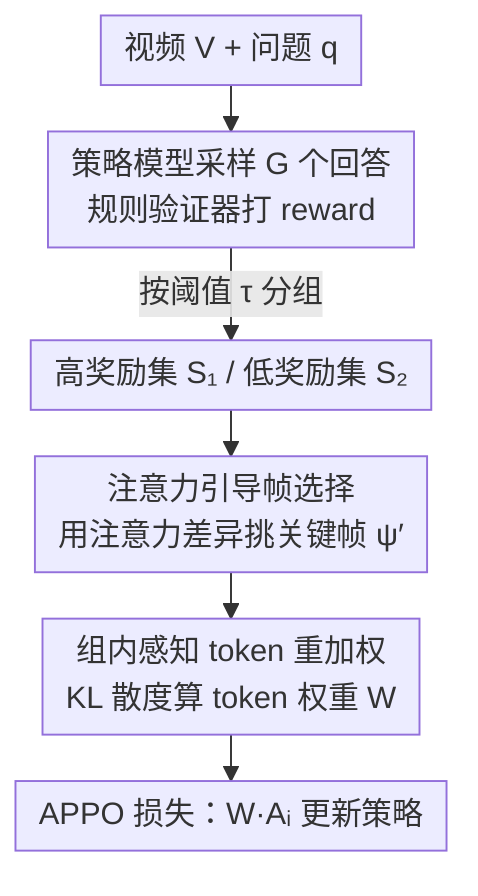

# APPO: Attention-guided Perception Policy Optimization for Video Reasoning

**会议**: CVPR 2026  
**论文**: [CVF Open Access](https://openaccess.thecvf.com/content/CVPR2026/html/Du_APPO_Attention-guided_Perception_Policy_Optimization_for_Video_Reasoning_CVPR_2026_paper.html)  
**代码**: https://github.com/GeWu-Lab/APPO  
**领域**: LLM推理 / 多模态VLM / 视频理解  
**关键词**: 视频推理, 强化学习, 策略优化, 注意力引导, token级稠密奖励

## 一句话总结
APPO 发现「视频推理瓶颈在感知而非推理」，于是用模型自身对视频帧的注意力把稀疏 outcome reward 转成 token 级稠密奖励——让不同回答里聚焦同一关键帧的「组内感知 token」按高/低奖励差异化加权学习，在 Qwen2.5-VL-3/7B 上稳定超过 GRPO 和 DAPO（0.5%∼4%）。

## 研究背景与动机
**领域现状**：用可验证奖励的强化学习（RLVR）后训练（GRPO、DAPO、GSPO 等）已经显著提升了 LLM 的推理能力，近期大量工作把这套范式搬到视频 MLLM 上，希望提升视频推理能力。它们多数在「数据质量」或「奖励设计」（如 bbox IoU、时间戳 IoU）上做文章。

**现有痛点**：视频推理不同于纯文本任务，它同时依赖**细粒度感知**（看清画面里发生了什么）和**多步推理**，而感知是推理的前提。但现有 RL 方法用的是**稀疏 outcome reward**（只在最终答案对错上给信号），无法为「该看哪一帧、看清了没有」这类细粒度感知提供指引；要直接监督感知又需要昂贵的细粒度标注或额外的奖励模型。

**核心矛盾**：作者先做了一个反直觉的实证拆解来定位瓶颈。他们用「分而治之」把感知和推理解耦——选 4 个感知能力递增的模型（Qwen2.5-VL-3/7/32B、Gemini-2.0-flash）先把视频描述出来，再用 4 个推理能力递增的模型（Qwen3-4/8B、Qwen3-235B-thinking、OpenAI-o3）基于描述作答，做 4×4 交叉组合。结果发现：在 SEED-Bench-R1 上固定感知模型为 Qwen2.5-VL-7B，把推理模型从 Qwen3-8B 换成 o3 只涨 0.7%；反过来只把感知模型从 7B 换到 32B 就涨 1.4%。**结论：复杂视频场景里，提升感知比提升推理更关键**，但现有 RL 恰恰没把感知优化好。

**本文目标**：在不依赖细粒度标注、不引入额外奖励模型的前提下，**直接从稀疏 outcome reward 里挖出细粒度的、frame/token 级别的指引信号**，在推理过程中顺带把感知练好。

**核心 idea**：模型对视频帧的**注意力**就是它感知的最直接表征。高奖励回答更可能聚焦到正确的帧、低奖励回答则往往漏看或看错。利用这个差异，可以反推出「该重点看的关键帧」，再把不同回答里聚焦同一关键帧的 token（intra-group perception tokens）拎出来，按奖励高低给它们不同的学习强度——这就把稀疏奖励变成了 token 级稠密奖励。

## 方法详解

### 整体框架
APPO 是对 GRPO/DAPO 这类组相对策略优化的改造，整条流水线是：对一个样本 $x=\{V,q,a\}$ 用旧策略采样 $G$ 个回答 → 规则验证器给每个回答打 reward → 按奖励阈值把这组回答分成高奖励集 $S_1$ 和低奖励集 $S_2$ → **第一步**「注意力引导帧选择」用注意力差异挑出真正该看的关键帧 $\psi'$ → **第二步**「组内感知 token 重加权」把不同回答里聚焦同一关键帧的 token 分组，用 KL 散度衡量它们的分布差异、算出 token 级权重 $\mathcal{W}$ → 把 $\mathcal{W}$ 乘进 GRPO 的优势项，得到 APPO 损失去更新策略。整个过程不引入额外网络，只复用模型自己的注意力和已有的 outcome reward。

### 关键设计

**1. 注意力引导的帧选择：把稀疏奖励变成 frame 级稠密信号**

痛点很直接——outcome reward 只告诉你「这个回答对不对」，不告诉你「该看哪一帧」。APPO 的做法是把模型对视频帧的注意力当作感知的代理信号。先按奖励把一组 $G$ 个回答切成两半：

$$S_1=\{o_i \mid r_i \ge \tau\}, \quad S_2=\{o_i \mid r_i < \tau\}$$

其中 $\tau$ 是奖励阈值（实现里用准确率奖励、$\tau=0.5$）。然后追踪「回答 token → 视觉 token」的注意力：对第 $h$ 层、第 $j$ 个回答 token 到第 $v$ 个视觉 token 的权重 $a^{(h)}_{jv}$，把它对某一帧 $f_t$ 内所有视觉 token、跨若干层求平均，得到该 token 对这帧的注意力 $\text{Attn}(j,f_t)=\frac{1}{\sum_h |f_t|}\sum_h\sum_{v\in f_t}a^{(h)}_{jv}$。再对每个回答取注意力最高的 $K_1$ 个 token 求平均，得到回答 $o_i$ 对帧 $f_t$ 的注意力 $\text{Attn}(o_i,f_t)$；接着对每个回答取注意力最高的 $K_2$ 帧构成集合 $\psi(i)$，并在 $S_1$、$S_2$ 内分别取并集：

$$\psi^{S_1}=\bigcup_{o_i\in S_1}\psi(i), \quad \psi^{S_2}=\bigcup_{o_i\in S_2}\psi(i)$$

它们分别代表「高奖励回答关注的帧」与「低奖励回答关注的帧」。最终目标帧 $\psi'$ 有三种选法：**Hard** 取差集 $\psi'=\psi^{S_1}\setminus\psi^{S_2}$（只学高奖励看、低奖励没看的帧，信号最锐）；**Soft** 直接用 $\psi'=\psi^{S_1}$（全面促进 frame 级感知）；**All** 取并集 $\psi'=\psi^{S_1}\cup\psi^{S_2}$。这一步的巧妙在于：高/低奖励回答在「看哪帧」上的分歧本身就标出了关键帧，不需要任何外部标注。

**2. 组内感知 token 重加权：把 frame 信号细化成 token 级稠密奖励**

光知道该看哪帧还不够，要落到对参数的优化上。对 $\psi'$ 里的每一帧 $f_k$，$G$ 个回答中都有若干 token 聚焦在它上面——这些跨回答、聚焦同一帧的 token 就是**组内感知 token**，代表模型对同一段视频内容的细粒度感知。APPO 把它们按帧分成 $K=|\psi'|$ 个组：

$$\Omega^{(k)}=\big\{\operatorname{TopK}_{o_{i,j}}\big(\text{Attn}(o_{i,j},f_k),K_3\big)\big\}_{i=1}^G$$

即每个回答里对帧 $f_k$ 注意力最高的 $K_3$ 个 token，跨 $G$ 个回答凑成一组 $G\times K_3$ 个 token。借鉴「关键推理 token 可由 token 级分布差异识别」的思路，作者用 KL 散度衡量组内 token 与组平均分布的差异：

$$D^{(k)}=\sum_{i=1}^{G} D_{\mathrm{KL}}\big(p(\Omega^{(k)}_{i,j})\,\|\,\mathbb{E}[\Omega^{(k)}_j]\big)$$

其中 $\mathbb{E}[\Omega^{(k)}_j]$ 是组内各回答分布的平均。$D^{(k)}$ 经 min-max 归一化保证数值稳定后，跨 $K$ 组平均得到最终 token 权重：

$$\mathcal{W}=1+\alpha\cdot\frac{1}{K}\sum_{k=1}^{K}D^{(k)}$$

$\alpha$ 控制加权强度。差异越大的 token 越被放大学习——直觉上，高奖励回答里聚焦正确帧的感知 token 会被「promote」，低奖励回答里跑偏的会被相对「suppress」，于是稀疏的 outcome reward 被细化成了 token 级的稠密奖励。和 Visionary-R1 / Perception-R1 这类「强行分离感知与推理、外挂奖励模型」的做法相比，APPO 是在推理过程中**联合**优化感知，零额外网络。

### 损失函数 / 训练策略
把 token 权重 $\mathcal{W}$ 乘进优势项即得 APPO 目标（沿用 DAPO 去掉 KL 约束以增强探索、并按输出长度归一化各回答贡献，省略 clip 项）：

$$\mathcal{L}_{\text{APPO}}=\mathbb{E}_{o\sim\pi^{\text{old}}_\theta}\left[\frac{1}{\sum_{i=1}^G|o_i|}\sum_{i=1}^G\sum_{t=1}^{|o_i|}r_{i,t}(\theta)\cdot\mathcal{W}\cdot A_i\right]$$

其中优势 $A_i=\frac{r_i-\mu}{\sigma}$ 仍是组内标准化奖励，$r_{i,t}(\theta)$ 是重要性比。训练直接从 Qwen2.5-VL-3B/7B 做 RL、**不做 cold-start SFT、不用任何 CoT 数据**；rollout 数 $G=8$，batch 16，lr 1e-6，帧分辨率 224×224；超参典型取 $\tau=0.5$、$K_1=15$、$K_2=5$、$K_3=64$、$\alpha$ 取 1.7、注意力取最后 3 层。

## 实验关键数据

### 主实验
在 Qwen2.5-VL-3B/7B 上同数据同设置对比 SFT / GRPO / DAPO（SEED-Bench-R1 取平均，含 L1 同分布、L2/L3 OOD）：

| 模型 | 方法 | SEED-R1 Avg | NExT-GQA mIoU | VSI-Bench | NExT-QA Acc |
|------|------|-------------|---------------|-----------|-------------|
| 3B | GRPO | 34.0 | 10.3 | 34.8 | 74.2 |
| 3B | DAPO | 35.3 | 10.6 | 36.7 | 76.1 |
| 3B | **APPO** | **37.2** | **11.1** | **38.2** | **76.4** |
| 7B | GRPO | 48.9 | 32.0 | 35.9 | 78.4 |
| 7B | DAPO | 50.0 | 32.4 | 36.6 | 79.9 |
| 7B | **APPO** | **50.5** | **32.9** | **36.9** | 79.6 |

APPO 在视频推理类基准上稳定超过 GRPO/DAPO（3B 上 1.5%∼3.2%，7B 上 0.3%∼1.6%）。值得注意：3B 提升比 7B 更明显（SEED-R1 上相对 DAPO 涨 1.9% vs 0.5%），作者归因于 3B 感知更弱、APPO 增强细粒度感知的红利更突出。在衡量时空 grounding 的 NExT-GQA mIoU 上，GRPO/DAPO 几乎不涨（3B 仅 +0.2%/+0.4%），APPO 涨 1.0%，说明它确实改善了「看对帧」的能力。

### 与现有视频推理模型对比
仅用 Video-R1-260K 的 34K 子集训练 Qwen2.5-VL-7B，zero-shot 对比训练数据大得多的同类模型：

| 方法 | 训练量 | SEED-R1 Avg | Perception Test | VSI-Bench | NExT-QA |
|------|--------|-------------|-----------------|-----------|---------|
| Video-R1 | 260K | 30.7 | 64.7 | 35.8 | 76.5 |
| VideoRFT | 310K | 30.9 | 72.0 | 30.3 | 78.3 |
| VideoChat-R1 | 18K | 31.8 | 63.2 | 19.9 | 74.5 |
| **APPO** | **34K** | **36.1** | **76.3** | 32.7 | **79.2** |

APPO 用远小的数据量在 SEED-R1、Perception Test、VSI-Bench、MVBench、NExT-QA 上整体领先（提升 0.7%∼5.2%）；NExT-GQA mIoU 上略逊于训练含时间 grounding 任务的 VideoChat-R1，但多选准确率最高。

### 消融实验
基于 SEED-Bench-R1 + Qwen2.5-VL-7B 扫超参：

| 超参 | 最优 | 现象与原因 |
|------|------|-----------|
| $K_1$（每回答取几 token 算帧注意力） | 越大越好（≈15–25） | 越大越能准确刻画回答对帧的注意力，选帧更可靠 |
| $K_2$（每回答取几帧） | **3** | 太小漏关键帧，太大引入帧噪声、误导优化方向 |
| $K_3$（每帧取几 token 进组） | 适中 | 单帧内容有限，token 过多反而干扰真正有用的感知 token |
| $\alpha$（加权强度） | **1.7** | 1.2→2.0 先升后降；对 OOD 更敏感（L3 最大差 2.7%，L1 仅 1%） |
| 注意力层 | **最后 3 层** | 仅末层信息不准；5 层更好但更费显存，3 层折中 |

### 关键发现
- **感知 > 推理**是全文立论：固定一方增强另一方，增强感知带来的整体提升明显大于增强推理，这一拆解实验是方法的逻辑起点。
- APPO 训练中**生成熵和梯度范数都高于 GRPO/DAPO**，说明优化组内感知 token 给了模型更大的探索空间，且 reward 曲线更高。
- **OOD 上提升更大**：SEED-R1 的 L2/L3（来自 Ego4D 的跨环境任务）相对 DAPO 涨 1.6%/3.2%，远超 L1 同分布的 0.9%，$\alpha$ 对 OOD 也更敏感，提示 token 优化强度与泛化能力强相关。

## 亮点与洞察
- **把注意力当免费的感知监督信号**：不引入任何额外标注或奖励模型，纯靠「高/低奖励回答看哪帧的分歧」反推关键帧，这个「自蒸馏式」信号源很省。
- **稀疏→稠密的两级细化**（outcome reward → frame 级 → token 级）思路清晰，且 token 级权重直接乘进 GRPO 优势项、对现有 RLVR 框架几乎零侵入，迁移成本低。
- **小模型/OOD 受益更大**这一现象有实用价值：算力受限或部署在分布外场景时，APPO 的性价比更突出。
- 用 KL 散度衡量组内 token 分布差异来定「该重点学哪个 token」，把「关键推理 token 可由分布差异识别」的文本经验成功迁到了视频感知 token 上，是可复用的 trick。

## 局限与展望
- 论文承认 7B 上提升不如 3B 明显，说明方法对感知已较强的大模型边际收益递减——对更大规模（32B+）是否仍有效未验证。
- 多处关键细节（Hard/Soft/All 三策略的完整对比、训练数据具体构成）放在补充材料，正文未给，复现需查附录。⚠️ 部分公式（如 $\text{Attn}$ 的归一化、KL 项的下标）原文 OCR 较乱，以原文为准。
- 注意力作为「感知」的代理本身有噪声（注意力≠真实感知），方法对注意力层数、$K_1/K_2/K_3$ 较敏感，超参需逐基准调。
- 改进方向：把帧选择的三种策略做成自适应、或在更长视频/更高帧率下验证 token 分组的可扩展性。

## 相关工作与启发
- **vs GRPO / DAPO**：两者都用稀疏 outcome reward 做组相对优化，对「该看哪帧、看清没」无能为力；APPO 在同框架内插入注意力引导的 token 级稠密奖励，专门补强细粒度感知，因此在感知主导的视频推理上更强。
- **vs Visionary-R1 / Perception-R1**：它们靠额外奖励、或强制「先 caption 再推理」来注入感知监督，硬性分离感知与推理且依赖额外神经网络；APPO 在推理过程中**联合**优化感知、零额外模型，开销更低。
- **vs Time-R1 / Space-R / Video-R1**：这些为特定任务（bbox/时间 IoU）设计专有奖励；APPO 不依赖任务专有标注，靠模型内在注意力通用地强化感知。

## 评分
- 新颖性: ⭐⭐⭐⭐ 「感知>推理」的实证拆解+用注意力把稀疏奖励细化到 token 级，角度新颖且自洽。
- 实验充分度: ⭐⭐⭐⭐ 覆盖 6 个基准、3/7B 两规模、与 SOTA 及完整超参消融，但部分对比藏在附录。
- 写作质量: ⭐⭐⭐ 逻辑清楚、动机扎实，但公式排版/OCR 较乱，需对照原文。
- 价值: ⭐⭐⭐⭐ 对现有 RLVR 框架零侵入、小模型/OOD 受益大，实用性强。

<!-- RELATED:START -->

## 相关论文

- [\[ACL 2026\] Think Outside the Policy: In-Context Steered Policy Optimization](../../ACL2026/llm_reasoning/think_outside_the_policy_in-context_steered_policy_optimization.md)
- [\[ICLR 2026\] Slow-Fast Policy Optimization: Reposition-Before-Update for LLM Reasoning](../../ICLR2026/llm_reasoning/slow-fast_policy_optimization_reposition-before-update_for_llm_reasoning.md)
- [\[CVPR 2026\] Reinforcing Structured Chain-of-Thought for Video Understanding](reinforcing_structured_chain-of-thought_for_video_understanding.md)
- [\[ACL 2026\] Calibration-Aware Policy Optimization for Reasoning LLMs](../../ACL2026/llm_reasoning/calibration-aware_policy_optimization_for_reasoning_llms.md)
- [\[ICLR 2026\] Scaf-GRPO: Scaffolded Group Relative Policy Optimization for Enhancing LLM Reasoning](../../ICLR2026/llm_reasoning/scaf-grpo_scaffolded_group_relative_policy_optimization_for_enhancing_llm_reason.md)

<!-- RELATED:END -->
