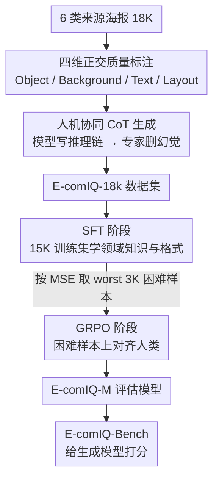

# E-comIQ-ZH: A Human-Aligned Dataset and Benchmark for Fine-Grained Evaluation of E-commerce Posters with Chain-of-Thought

**会议**: CVPR 2026  
**arXiv**: [2602.21698](https://arxiv.org/abs/2602.21698)  
**代码**: [GitHub](https://github.com/4mm7/E-comIQ-ZH)  
**领域**: Image Quality Assessment / E-commerce AI  
**关键词**: 电商海报评估, 图像质量评价, Chain-of-Thought, 多维度评分, 中文文本质量

## 一句话总结
构建首个面向中文电商海报的多维度质量评估框架 E-comIQ-ZH，包含18K专家标注数据集（含CoT推理链）、专用评估模型 E-comIQ-M（SFT+GRPO训练）和标准化基准 E-comIQ-Bench。

## 研究背景与动机
**领域现状**：生成式AI大量应用于电商海报制作，但自动化质量评估严重滞后于生成能力的发展。现有IQA方法聚焦通用美学或低级失真，无法衡量电商所需的功能性标准。

**现有痛点**：中文电商内容尤其困难——复杂汉字笔画常产生微妙但关键的文本渲染错误，而现有方法（包括GPT-4o、Gemini 2.5 Pro等强模型）均忽略这类领域特定缺陷。如Fig 1所示，Gemini 2.5 Pro和Q-Insight都未识别出笔画级别的文字损坏。

**核心矛盾**：缺乏正式的多维度质量标准→无法系统评估→无法构建训练数据→无法训练专用评估器——形成恶性循环。当前工作流仍依赖缓慢、不可扩展的人工审核。

**本文目标** 建立电商海报的多维度质量评估标准和自动化评估工具链。

**切入角度**：与资深电商美术总监合作，将质量分解为Object/Background/Text/Layout四个维度，构建大规模专家标注数据集和专用评估模型。

**核心 idea**：用专家标注+CoT推理链训练领域专用评估模型，使自动评估与人类专家判断对齐。

## 方法详解

### 整体框架

E-comIQ-ZH 要解决的是中文电商海报"生成能力跑在前、质量评估跟不上"的问题，整套工作产出三个互相支撑的组件：(a) E-comIQ-18k 数据集（18K 海报 + 多维分数 + CoT 推理链），(b) E-comIQ-M 评估模型（两阶段训练），(c) E-comIQ-Bench 基准（给生成模型打分的评测平台）。数据集喂出模型，模型支撑基准，基准反过来检验生成质量。

### 关键设计

**1. 四维正交的质量标注体系：用一组互补维度替代单一整体分**

通用 IQA 只看美学或低级失真，刻画不了电商海报的功能性。论文与资深电商美术总监合作，把质量拆成四个正交维度——Object（产品完整性/清晰度）、Background（背景兼容性/视觉吸引力）、Text（排版可读性/正确性）、Layout（整体构图/视觉层次）。每个维度给一个连续分数并锚定三档（优 [4.0, 5.0]、良 [3.0, 4.0)、差 [1.0, 3.0)），同时从该维度的问题清单里勾选缺陷标签。为保证这套主观标注可靠，标注分两步走：六名领域专家先在 1000 张校准集上交叉标注、开共识会消歧，直到 Krippendorff's $\alpha = 0.858$ 才认为标准稳定，之后再无重叠地分工标完剩余 17K，并保持 10% 随机抽样 + 共享疑难日志防止标准漂移。维度间平均 Pearson 相关只有 $\rho \approx 0.24$，说明单一整体分确实盖不住电商海报的质量结构；进一步的"最薄弱环节"分析显示 Text 是 44.8% 低质图像的瓶颈，且与整体质量相关性最高（$\rho=0.67$）——这也解释了为什么强模型一旦漏判笔画级文字错误就满盘皆输。

**2. 人机协同的 CoT 生成：先让模型写推理链，再让专家把幻觉删掉**

要训出会"讲理由"的评估器，得有可靠的推理链监督。流程是先由 Qwen-2.5-VL-Max 依据专家分数和问题标签生成推理链，再由原始标注者在 NER 界面上删除幻觉内容、纠正推理错误、补充领域知识，CoT 平均长度超 800 个汉字。这样既拿到了规模化的推理标注，又靠人工校验把事实性兜住，避免纯 AI 合成 CoT 的事实不一致隐患。

**3. SFT+GRPO 两阶段训练：先学领域格式，再在困难样本上对齐人类**

E-comIQ-M 以 Qwen-2.5-VL-7B 为底座（选它是因为视觉语言能力强且原生支持中文）分两步训练。Stage 1 在 15K 训练集上 SFT，以专家分数和 CoT 推理链为目标，让模型先学会任务格式、领域概念和合理的初步打分行为；Stage 2 用 GRPO 在困难样本上精修——困难子集 $\mathcal{D}_{hard}$ 是按 SFT 模型在 15K 上的 MSE 排序、取最差的 3K 构成（专挑 SFT 后仍打不准的样本）。

关键在奖励怎么设计才能逼模型对齐专家。总奖励 $R(x,y) = R_{score}(x,y) + \lambda_{fmt} R_{fmt}(y)$，$R_{fmt}$ 是「输出能否解析为合法 JSON」的二值奖励，保证结构化输出。打分奖励本身再拆成精度项和分布项 $R_{score} = \lambda_{score} R_{acc} + (1-\lambda_{score}) R_{dist}$（$\lambda_{score}=0.65$）：$R_{acc}$ 是带档位惩罚的命中率——预测分与真值差在 $\tau=0.2$ 内才算命中，且一旦跨越专家定义的质量档位（差/良/优）就乘 0.7 罚分，逼模型不只是数值接近、还要落进对的档；$R_{dist}$ 则对四维子分向量取欧氏距离的指数衰减 $\exp(-\alpha\lVert\vec v_{pred}-\vec v_{gt}\rVert_2)$，约束四个维度整体的几何一致性，避免单维准但整体走形。先 SFT 打底、再用这套档位感知的奖励在硬样本上 GRPO 精修，比单跑任一阶段都更贴近人类判断（消融里 SFT+GRPO 全面优于单独 SFT 或单独 GRPO）。

## 实验关键数据

### 主实验：与SOTA模型的相关性对比（E-comIQ-18k测试集）

| 模型 | Overall PLCC/SRCC | Text PLCC/SRCC | Layout PLCC/SRCC |
|------|-------------------|----------------|------------------|
| GPT-4o | 0.242/0.219 | 0.126/0.148 | 0.297/0.282 |
| Gemini 2.5 Pro | 0.213/0.228 | 0.146/0.122 | 0.350/0.320 |
| Qwen2.5-VL-72B | 0.127/0.144 | 0.100/0.070 | 0.142/0.153 |
| Q-Insight | 0.183/0.152 | -0.024/-0.027 | 0.134/0.149 |
| Qwen2.5-VL-7B+SFT | 0.346/0.346 | 0.272/0.283 | 0.390/0.418 |
| **E-comIQ-M (Ours)** | **0.425/0.433** | **0.364/0.392** | **0.483/0.506** |

E-comIQ-M在所有维度上全面超越通用模型和专用评估器，尤其在Text维度优势显著。

### Inter-annotator Agreement

| 维度 | Krippendorff's $\alpha$ | 松标准准确率 |
|------|------------------------|-------------|
| Overall | 0.858 | 96.4% |
| Object | 0.745 | 92.2% |
| Background | 0.721 | 94.6% |
| Text | 0.765 | 93.2% |
| Layout | 0.877 | 96.6% |

### 消融实验：训练策略效果

| 方法 | Overall PLCC/SRCC | Background PLCC/SRCC |
|------|-------------------|---------------------|
| Q-Insight+GRPO | 0.265/0.235 | 0.312/0.312 |
| Q-Insight+SFT | 0.297/0.319 | 0.442/0.478 |
| Q-Insight+SFT+GRPO | 0.338/0.348 | 0.459/0.496 |
| **E-comIQ-M** | **0.425/0.433** | **0.496/0.520** |

SFT+GRPO两阶段训练优于单独任一阶段，Qwen2.5-VL-7B作为backbone比Q-Insight更优。

### 关键发现
- 传统NR-IQA模型（MUSIQ、SPAQ）在电商场景几乎失效（相关性<0.2甚至为负）
- 强通用MLLM（GPT-4o、Gemini）Overall PLCC也仅0.2左右，说明电商评估需要领域适配
- Text维度是中文电商海报质量的关键瓶颈，但现有方法在该维度表现最差

## 亮点与洞察
- **首创性**：首个面向中文电商海报的多维度IQA数据集+模型+基准的完整体系
- **CoT标注设计精巧**：AI生成+人工校验的流程兼顾规模与质量，平均800+字的推理链提供丰富诊断信息
- **维度正交性验证**：$\rho \approx 0.24$ 的低相关性有力支持了多维度评估的必要性
- **标注一致性高**：$\alpha = 0.858$，松标准准确率96.4%

## 局限与展望
- 数据集以淘宝/天猫为主，对其他电商平台（如拼多多、跨境电商）的泛化性未验证
- 标注者为6名专家非交叉标注（校准后分工），标注偏差通过10%抽样缓解但未完全消除
- 模型基于7B参数量的Qwen2.5-VL，更大模型是否能进一步提升有待探索
- GRPO的困难样本选择策略（MSE top 3K）较简单，可探索更精细的课程学习方案
- 未探索视频广告/动态海报的质量评估，仅覆盖静态图片
- CoT推理链的生成质量依赖Qwen-2.5-VL-Max的能力上限，对极细微的笔画级错误可能仍有遗漏
- 未与人类评审流程的速度/成本进行定量对比，未充分展示实际部署价值

## 相关工作与启发
- 传统IQA（SSIM、MUSIQ等）仅覆盖低级失真，无法判断电商功能性
- AIGC质量数据集（ImageRewardDB、AGIQA-3K）提供通用偏好但缺乏领域深度
- 唯一的电商IQA数据集AIGuard提供253K二值标签但无多维分数和CoT
- E-comIQ-ZH填补了电商领域多维度、可解释质量评估的空白
- MLLM评估器（Q-Align、VQ-R1、DeQA、Q-Insight）聚焦通用场景，在电商功能性维度表现差
- DPO/GRPO偏好对齐方法在通用领域有效，本文证明领域特定训练数据是关键瓶颈

## 数据集构成细节
- **6类来源**：商家高质量照片5K + 商家低质量照片5K + 专业设计图（质量上界）+ AI生成海报 + AI编辑合成 + 模板工作流
- **标注流程**：连续分数锚定三档——优秀[4.0, 5.0]、良好[3.0, 4.0)、差[1.0, 3.0)，附带每维度问题标签
- **数据划分**：15K训练 / 2K验证 / 1K测试，在来源和质量维度均衡分布
- **Backbone选择**：Qwen-2.5-VL-7B因其强视觉语言能力和中文原生支持被选为基座模型
- **GRPO困难子集**：按SFT模型MSE排序取worst 3K样本构成$\mathcal{D}_{hard}$

## 评分 ⭐
- 新颖性: ⭐⭐⭐⭐ — 首个中文电商海报多维IQA体系，定义新赛道
- 实验充分度: ⭐⭐⭐⭐⭐ — 对比全面（传统IQA/通用MLLM/专用评估器），消融清晰
- 写作质量: ⭐⭐⭐⭐ — 问题-方案逻辑链清晰，图表信息量大
- 价值: ⭐⭐⭐⭐ — 对电商AI生成内容质量控制有直接应用价值

<!-- RELATED:START -->

## 相关论文

- [\[CVPR 2025\] VideoEspresso: A Large-Scale Chain-of-Thought Dataset for Fine-Grained Video Reasoning via Core Frame Selection](../../CVPR2025/llm_reasoning/videoespresso_a_large-scale_chain-of-thought_dataset_for_fine-grained_video_reas.md)
- [\[ICLR 2026\] Fine-R1: Make Multi-modal LLMs Excel in Fine-Grained Visual Recognition by Chain-of-Thought Reasoning](../../ICLR2026/llm_reasoning/fine-r1_make_multi-modal_llms_excel_in_fine-grained_visual_recognition_by_chain-.md)
- [\[ACL 2025\] Beyond the Answer: Advancing Multi-Hop QA with Fine-Grained Graph Reasoning and Evaluation](../../ACL2025/llm_reasoning/beyond_the_answer_advancing_multi-hop_qa_with_fine-grained_graph_reasoning_and_e.md)
- [\[ACL 2026\] Decoupling the Effect of Chain-of-Thought Reasoning: A Human Label Variation Perspective](../../ACL2026/llm_reasoning/decoupling_the_effect_of_chain-of-thought_reasoning_a_human_label_variation_pers.md)
- [\[CVPR 2026\] Step-CoT: Stepwise Visual Chain-of-Thought for Medical Visual Question Answering](step-cot_stepwise_visual_chain-of-thought_for_medical_visual_question_answering.md)

<!-- RELATED:END -->
