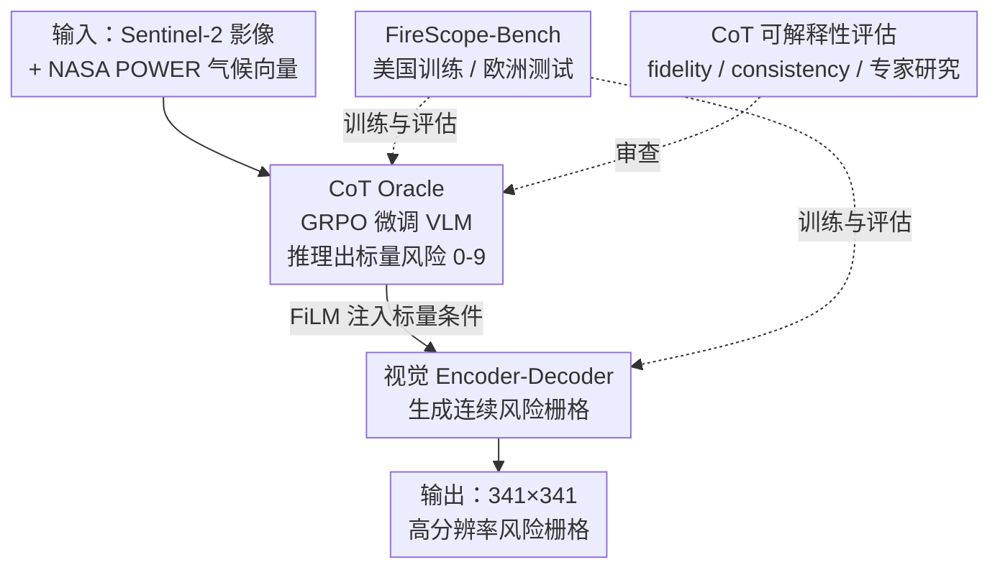

# FireScope: Wildfire Risk Raster Prediction with a Chain-of-Thought Oracle

**会议**: CVPR 2026  
**arXiv**: [2511.17171](https://arxiv.org/abs/2511.17171)  
**代码**: https://firescope.ai/research （项目页，无开源仓库链接）  
**领域**: LLM推理 / 多模态VLM / 遥感地理空间  
**关键词**: 野火风险预测、思维链推理、栅格生成、跨洲泛化、GRPO

## 一句话总结
用一个 GRPO 微调、会写思维链的 VLM（Oracle）先把卫星图+气候推理成一个标量野火风险分，再用 FiLM 把这个分喂给轻量视觉 Encoder-Decoder 去生成高分辨率连续风险栅格——在「美国训练、欧洲测试」的跨洲设定下，显式语言推理显著提升了分布外泛化，且推理痕迹可被野火专家复原、可解释。

## 研究背景与动机

**领域现状**：野火风险评估在环境科学里很重要，但视觉社区基本没碰过「连续风险场」这个目标。传统做法要么是物理/气象指数（如加拿大火险天气指数 FWI），只吃气象变量、空间分辨率粗；要么是纯视觉模型（检测、分割、蔓延估计），只看影像、学的是局部外观相关性。

**现有痛点**：野火风险本质上是一个**多模态推理问题**——要把植被、地形、气候交互、人类活动等因果驱动因素综合起来，去推断一个抽象的、空间结构化的量（连续风险栅格）。但纯气象模型缺高分辨率视觉/地理上下文；纯视觉模型缺因果推理，换一个生物群落、换一个大洲就崩。而且整个方向**没有统一基准**：没有同时整合影像、气候、地形的数据集，也没有能跨「像素级视觉理解 → 多模态因果推理」全谱系的框架。

**核心矛盾**：气候条件模型在分布内（ID）反而很强，因为它能**记住区域气候签名**而不是学可泛化的物理规律——这是一种过拟合。真正的难点是分布外（OOD）泛化：在欧洲真实火灾上，靠局部外观相关性的模型会失败。

**本文目标**：(1) 造一个能严格测「跨洲 OOD 泛化」的野火风险基准；(2) 设计一个框架，让显式语言推理去 grounding 栅格生成，同时拿到泛化和可解释性。

**切入角度**：作者的假设是——**显式的语言推理（CoT）会逼模型去依赖复杂的、可泛化的因果特征，而不是绑死在局部外观上的虚假相关**。如果让一个大 VLM 先「讲清楚为什么这片区域危险」，这个判断比直接回归像素更不容易过拟合到训练地理分布。

**核心 idea**：把结构化预测当成「推理→生成」两阶段问题——先用 CoT VLM 推出一个标量风险判断，再用它作为条件先验去引导视觉解码器生成栅格，用语言推理的因果性 + 视觉解码的空间精度互补。

## 方法详解

### 整体框架

FireScope 是一个**两阶段「推理→生成」框架**。输入是一片约 100 km² 区域的 Sentinel-2 光学影像（10m 分辨率、$1024\times1024$）和该区域的气候常态向量（NASA POWER 月度气候，温度/降水/湿度/风速/风向，$\text{dim}=60$）；输出是一张 $341\times341$ 的连续野火风险栅格。

第一阶段，**Oracle**（一个 VLM）吃影像+气候，通过显式 CoT 推理，输出一个概括整片区域的标量风险分（离散到 0–9 的有序等级）。第二阶段，一个轻量视觉 **Encoder-Decoder** 以 Oracle 的标量分为条件（通过 FiLM 注入），回归出细粒度的连续风险栅格。这样既借到大 VLM 的泛化能力，又保住视觉解码器的空间精度。

### 关键设计

**1. FireScope-Bench：第一个能测「跨洲 OOD 泛化」的多模态野火风险基准**

痛点是这个方向根本没有统一数据集去把「记住区域气候」和「真泛化」区分开。作者构建的基准覆盖 5.7M km²、55K 个区域、6.3B 像素：训练/标定用美国分区（50K 区域，2021 年），目标变量取自 Wildfire Risk to Communities 项目的 30m 分辨率「Risk to Potential Structures」（综合了燃烧概率和潜在火强带来的后果），经分位数变换归一化到 $[0,1]$ 当相对风险；评估用一个**地理上完全分离**的欧洲分区（4,989 区域，2018–2025），包含 3K 真实野火事件（来自 EFFIS 烧毁面积库，过滤掉 <5 km² 的小火）和 2K 个无火对照区。关键巧思在于：欧洲火灾事件用的是**火灾发生前一年**的影像，强迫模型去「预测」而不是「检测」已经烧过的痕迹。正是这个「美国训练→欧洲测试」的设定，天然暴露了气候过拟合 vs 真泛化的张力。

**2. CoT Oracle：GRPO 强化学习训练的 VLM，把多模态推理压成一个可泛化的标量判断**

如果直接用有序标签做监督微调，Oracle 只会输出单个标量、没法探索中间推理步骤。作者改用强化学习——具体是 **GRPO**（Group Relative Policy Optimization），它不需要 critic 模型，比常规 RL 开销小得多，且不受「任意长度输出无梯度」的限制。奖励是两项加权：

$$R = 0.9\cdot R_{\mathrm{acc}} + 0.1\cdot R_{\mathrm{fmt}}$$

其中 $R_{\mathrm{acc}}$ 奖励有序预测的准确度（用频率加权聚合来对抗标签不平衡），$R_{\mathrm{fmt}}$ 奖励格式正确，两者都在 0–1。值得注意的是作者**完全不显式引导推理内容**，只对最终答案的准确度给奖励，让 CoT 自然演化——训练中观察到 CoT 越来越精细，本身就是「推理有助于野火风险预测」的旁证。为什么有效：RL + CoT 让 Oracle 学会综合气候和影像的跨模态交互去给出一个语义 grounded 的判断，这种判断换大洲也成立；消融里 CoT Qwen 的 OOD ROC AUC（0.748）明显高于不带 CoT 的版本（0.701）

**3. FiLM 标量条件化的视觉 Encoder-Decoder：把「一个数」变成空间先验，生成像素级栅格**

Oracle 只给一个标量，怎么让它影响整张栅格？作者先用训练好的 Oracle 确定性地生成训练集的标量输出，再通过 **FiLM**（feature-wise linear modulation）在 Encoder-Decoder 每个可训练块前注入这个标量条件。解码器回归归一化栅格 $y\in[-1,1]^{341\times341}$，损失是三项加权：

$$\mathcal{L} = \underbrace{\mathcal{L}_{\text{s}\ell_1}(y,\hat{y})}_{\text{重建}} + 0.5\underbrace{(1-\text{SSIM}(\tilde{y},\tilde{\hat{y}}))}_{\text{结构}} + 0.2\underbrace{\mathcal{L}_{\ell_1}(\nabla y,\nabla\hat{y})}_{\text{边缘}}$$

重建项是 $\beta=1.0$ 的 Smooth-$\ell_1$，结构项用 $11\times11$ 高斯窗的 SSIM，边缘项匹配一阶有限差分来逼出更锐利的边界。为什么有效：令人意外的是，**只靠一个标量条件**，Encoder-Decoder 居然能在像素级 OOD 指标上系统性提升（U-Net+CoT 的 wildfire-pixel ROC AUC 0.652、IoU 0.178 都优于无条件版本）——说明解码器把 Oracle 的推理当成**上下文先验**来用，而不是简单把标量拼成辅助元数据。消融里「直接给 Qwen 接一个 perceiver 解码头（Qwen+decoder）」反而更差，证明 FireScope 的收益来自显式推理提供的结构化、语义 grounded 的条件，而非 VLM 的原始表征容量

**4. CoT 可解释性评估：用专家研究 + 两个自动指标证明推理是「真在起作用且可被人读懂」**

光说 CoT 可解释不够，作者设计了量化方案。专家研究里，把 Oracle 的 CoT 和「golden CoT」（给 GPT-5 正确分类后倒推出的推理）都摘要成「只列考虑因素、不给结论」的解释，匿名打乱后请两位野火专家据此重新打风险等级，测 QWK。自动指标有两个，都通过合成扰动 CoT、观察最终分类变化来算：**fidelity**（保真度）衡量 Oracle 是否真被自己的 CoT 引导——把 CoT 改成论证相反风险等级（不改事实），看预测往反方向偏移多少，

$$\mathrm{fid} = \frac{1}{N}\sum_{i=1}^{N}\frac{(\tilde{y_i}-y_i)}{(y_i^{*}-y_i)}\in[-1,1]$$

其中 $y_i^{*}=1.0$ 若 $y_i<0.5$、否则 $=0$；**consistency**（一致性）衡量改写措辞但保留事实逻辑后预测是否稳定（高 = 模型若依赖 CoT，是以人类可理解的方式依赖）。这套评估让「推理是否 grounding 了生成」从口号变成可测的数字

### 损失函数 / 训练策略

两阶段分开训。Oracle 用 Qwen2.5-VL-7B-Instruct 做 backbone，GRPO 微调，奖励见式上文。视觉端评估三种 Encoder：SegFormer MiT-B5、遥感基础模型 AlphaEarth（编码器冻结）、从头训的轻量 U-Net；解码器随架构适配。每种 Encoder-Decoder 训四个条件版本：纯影像 Baseline、气候条件、Oracle（无 CoT 的 Qwen）、CoT Oracle（即完整 FireScope）。除特别说明外，多数实验在小训练集（1K 训练）上做以节省算力。

## 实验关键数据

### 主实验

OOD（欧洲）栅格预测，对比不同条件下的 Encoder-Decoder（Table 1，节选）。「wildfire events」= 区分烧毁区 vs 对照区，「wildfire pixels」= 像素级细粒度预测：

| 条件 | Encoder | events Brier ↓ | events ROC AUC ↑ | events ECE ↓ | pixels ROC AUC ↑ | pixels IoU ↑ |
|------|---------|------|------|------|------|------|
| 纯影像 | U-Net | 0.217 | 0.679 | 0.050 | 0.587 | 0.159 |
| + 气候 | U-Net | 0.274 | 0.591 | 0.167 | 0.559 | 0.145 |
| + Oracle | U-Net | 0.213 | 0.698 | 0.087 | 0.655 | 0.181 |
| **+ CoT (FireScope)** | U-Net | **0.191** | **0.750** | 0.068 | 0.652 | 0.178 |
| **+ CoT (FireScope)** | SegFormer | 0.205 | 0.727 | 0.078 | 0.658 | 0.184 |

加上 CoT Oracle 在每个视觉 backbone 上都拿到最好或接近最好的 OOD Brier 和 ROC AUC；而加气候数据反而把 OOD 拉垮（U-Net ROC AUC 从 0.679 掉到 0.591），印证了气候过拟合。

Oracle 自身对比（Table 2）：

| Oracle | OOD Brier ↓ | OOD ROC AUC ↑ | OOD ECE ↓ | ID QWK ↑ |
|--------|------|------|------|------|
| FWI（气象指数） | 0.321 | 0.551 | 0.255 | – |
| Climate MLP | 0.276 | 0.524 | 0.150 | 0.766 |
| GPT-5 | 0.281 | 0.636 | 0.229 | 0.316 |
| Qwen（无 CoT） | 0.225 | 0.701 | 0.134 | 0.751 |
| **CoT Qwen** | **0.196** | **0.748** | **0.077** | **0.766** |

最扎眼的对比：Climate MLP 的 ID QWK 高达 0.766（和 CoT Qwen 持平），但 OOD ROC AUC 只有 0.524（几乎等于瞎猜）——它纯靠记住区域气候，一出分布就废；CoT Qwen 则 ID/OOD 双稳。

### 消融实验

| 配置 | OOD 表现 | 说明 |
|------|---------|------|
| U-Net + CoT Oracle（FireScope） | 最优 OOD | 完整配置 |
| U-Net 不带 CoT | 略差 | CoT Qwen OOD ROC AUC 0.748 vs Qwen 0.701 |
| U-Net 训 40× 数据 | ID 改善但 OOD 仍逊 | 结构化推理的收益超过纯数据 scaling |
| Qwen+decoder（直接给 VLM 接解码头） | 逊于 FireScope | 收益来自显式推理而非 VLM 表征容量 |

可解释性（Table 4）：

| 来源 | 专家 Exp.1 QWK ↑ | 专家 Exp.2 QWK ↑ | Fidelity ↑ | Consistency ↑ |
|------|------|------|------|------|
| Oracle | 0.33 | 0.11 | 0.33 | 0.91 |
| Golden（参考上限） | 0.50 | 0.59 | n/a | n/a |

### 关键发现
- **气候条件是把双刃剑**：ID 上略胜，OOD 上崩盘——FireScope-Bench 正好探到「气候过拟合 vs 真泛化」的张力，这也是基准的价值所在。
- **推理胜过数据 scaling**：把 U-Net 训在 40 倍数据上，ID 提升了但 OOD 仍打不过 CoT Oracle 条件版，说明结构化推理带来的泛化是单纯堆数据换不来的。
- **一个标量也能改善像素级预测**：Oracle 只传一个标量，却能系统性提升 wildfire-pixel 的 ROC AUC/IoU——解码器把它当成上下文先验，而非简单拼接的元数据。
- **CoT 真在起作用且可读**：consistency 0.91（改写措辞几乎不动预测）、fidelity 0.33（扰动 CoT 让像素风险平均往反向偏 33%），一位专家仅凭 Oracle 的推理因素就恢复了 0.33 QWK（约为 golden 的 70%）。

## 亮点与洞察
- **「推理→生成」解耦得很干净**：用语言 CoT 拿因果泛化、用视觉解码器拿空间精度，FiLM 把两者用一个标量缝起来——这是首个证明「语言推理能改善视觉生成泛化」的框架，思路可迁移到任何「需因果推理的密集预测」任务（深度、分割、地理回归）。
- **不显式监督 CoT 反而对**：作者只奖励最终准确度、放任推理自由演化，避免了人为引导带来的偏置，CoT 越训越精细本身成了「推理有用」的证据。
- **用「golden CoT」当可解释性上界**：给 GPT-5 喂正确答案倒推推理，作为专家研究的参照系，把「CoT 可解释」从主观变成可量化——这套 fidelity/consistency 评估范式很可复用。
- **跨洲评估的「预测而非检测」巧思**：欧洲火灾用前一年影像，干净地把「预测风险」和「事后认烧痕」区分开，是个值得借鉴的 OOD 实验设计。

## 局限与展望
- **作者承认的瓶颈**：Oracle 和 Encoder-Decoder 之间只靠**一个标量**通信，空间粒度严重受限，Oracle 的 CoT 推理没法细到指导局部空间模式。未来方向是让 Oracle 给出 token 级/区域感知的多维条件（而非单标量）。
- **fidelity 只有 0.33**：扰动 CoT 时预测仅往反向偏 33%（作者解释为「不改事实就改不了多少 CoT」），但这也意味着相当一部分预测信号其实来自影像本身而非推理，CoT 的因果主导性没有 consistency 那么强。
- **专家信号差异大**：两位专家据 Oracle CoT 恢复的 QWK 分别是 0.33 和 0.11，golden CoT 则稳定（0.50/0.59），说明 Oracle CoT 的「可用性」带主观性、不够稳健。
- **目标变量本身是专家建模产物**：ID 训练目标是 Wildfire Risk to Communities 的概率建模栅格，并非真实观测，所谓「ID 强」部分是在拟合另一个模型的输出，需谨慎解读。
- **多数实验在小训练集（1K）上跑**，全量结论需更多验证。

## 相关工作与启发
- **vs 物理/气象指数（FWI、混合气候模型）**：它们只吃气象、空间分辨率粗（FWI OOD ROC AUC 仅 0.551）；FireScope 整合高分辨率影像+气候+推理，产出连续可解释栅格，OOD 大幅领先。
- **vs 纯视觉栅格生成（SegFormer/U-Net/扩散/Transformer 解码器）**：它们学的是输入输出模态间的直接相关，换大洲就过拟合局部外观；FireScope 把结构化预测重塑成「推理→生成」，借 VLM 的因果推理做条件先验。
- **vs VLM 中的 CoT 推理工作**：现有 CoT 多用于离散 QA 或自然图像生成，少有针对「空间对齐、物理有意义的栅格」；本文是首次把 CoT-trained VLM 用来引导栅格生成。
- **vs 直接用 VLM 生成（Qwen+decoder 消融）**：直接给 VLM 接解码头反而更差，说明收益来自显式推理这个「语义瓶颈」，而非 VLM 的原始表征容量——这是个反直觉但有价值的发现。

## 评分
- 新颖性: ⭐⭐⭐⭐⭐ 首个证明「语言推理改善视觉生成 OOD 泛化」+ 首个跨洲高分辨率野火风险框架，问题和方法都新。
- 实验充分度: ⭐⭐⭐⭐ 三 backbone × 四条件的完整网格 + 跨洲 OOD + 专家研究 + 可解释性自动指标，很扎实；但主实验多在 1K 小集上，fidelity 偏低。
- 写作质量: ⭐⭐⭐⭐⭐ 动机推导清晰，「气候过拟合 vs 泛化」的张力讲得很透，可解释性评估设计严谨。
- 价值: ⭐⭐⭐⭐⭐ 既是落地的跨洲野火风险工具，也为「推理 grounding 密集预测」开了一条可迁移的范式路径。

<!-- RELATED:START -->

## 相关论文

- [\[CVPR 2026\] Reinforcing Structured Chain-of-Thought for Video Understanding](reinforcing_structured_chain-of-thought_for_video_understanding.md)
- [\[CVPR 2026\] Rationale-Enhanced Decoding for Multi-modal Chain-of-Thought](rationale-enhanced_decoding_for_multi-modal_chain-of-thought.md)
- [\[NeurIPS 2025\] Re-FORC: Adaptive Reward Prediction for Efficient Chain-of-Thought Reasoning](../../NeurIPS2025/llm_reasoning/re-forc_adaptive_reward_prediction_for_efficient_chain-of-thought_reasoning.md)
- [\[CVPR 2026\] Latent Chain-of-Thought World Modeling for End-to-End Autonomous Driving](latent_chain-of-thought_world_modeling_for_end-to-end_autonomous_driving.md)
- [\[CVPR 2026\] Revisiting the Necessity of Lengthy Chain-of-Thought in Vision-centric Reasoning Generalization](revisiting_the_necessity_of_lengthy_chain-of-thought_in_vision-centric_reasoning.md)

<!-- RELATED:END -->
