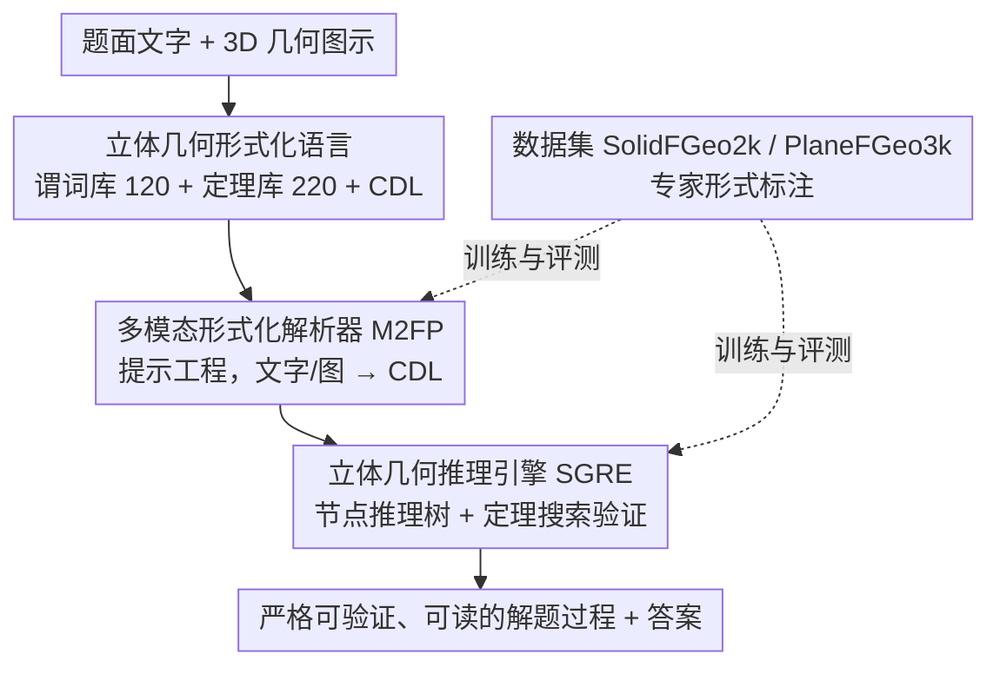

# Hilbert-Geo: Solving Solid Geometric Problems by Neural-Symbolic Reasoning

**会议**: CVPR 2026  
**论文**: [CVF Open Access](https://openaccess.thecvf.com/content/CVPR2026/html/Xu_Hilbert-Geo_Solving_Solid_Geometric_Problems_by_Neural-Symbolic_Reasoning_CVPR_2026_paper.html)  
**代码**: 待确认（论文称将公开）  
**领域**: LLM推理 / 神经符号推理 / 多模态几何  
**关键词**: 立体几何, 神经符号推理, 形式化语言, 多模态大模型, 定理搜索

## 一句话总结
Hilbert-Geo 是首个面向**立体几何**的统一形式化语言框架（含谓词库 + 定理库），用"先解析后推理"的 Parse2Reason 方法——先让多模态大模型把文字题面和 3D 图示翻译成形式化的条件描述语言（CDL），再用专门的符号推理引擎做严格的定理搜索，从而把 MLLM 在立体几何上 50% 出头的准确率提到 77.3%，逼近人类水平。

## 研究背景与动机

**领域现状**：平面几何的自动求解近年进步明显，FormalGeo 等系统已能把平面几何题形式化、配合视觉理解做形式推理。但**立体几何**这个更复杂的方向几乎是空白地带。

**现有痛点**：MLLM 在立体几何上有三处硬伤——(1) 需要精确把握 3D 空间关系、推理被遮挡结构和空间变换，模型抽象空间逻辑能力不足，产生推理错误和知识盲区；(2) 多模态视觉-语言对齐困难，要把 3D 物体的 2D 表示、隐含空间信息对上文字，常出现感知错误和幻觉；(3) 定量计算容易算错。作者对 Gemini 2.5 Pro 和 GPT-5 做细粒度错误分析，发现**视觉感知错误 + 推理错误两类合计占失败案例的 73%–76%**。

**核心矛盾**：立体几何知识天然**异构散落**在文字、图形、直觉里，缺乏统一形式范式，而模型只能用非形式的自然语言去表达，导致 3D 实体的拓扑与度量细节编码不全、歧义丛生。已有平面几何的形式化方法又**无法刻画三维实体**（多面体、球面等）的拓扑特征和度量关系。

**本文目标**：(1) 为立体几何建一套统一形式化语言（谓词 + 定理）；(2) 设计能把多模态题面解析成该形式语言、再做严格符号推理的完整管线；(3) 补齐高质量、带形式标注的立体几何数据集与基准。

**切入角度**：作者主张把**现代神经网络的感知能力**与**形式逻辑的严谨性**融合——在 FormalGeo 平面几何形式化框架基础上扩展到立体，让 MLLM 只负责"看懂题、转成形式语言"（它擅长感知），把"严格推理"交给符号引擎（它保证可验证、无幻觉）。

**核心 idea**：用"解析（神经）+ 推理（符号）"两段式，把立体几何题先转成可验证的 CDL，再由定理搜索引擎导出严格、可读、可验证的解题过程。

## 方法详解

### 整体框架
Hilbert-Geo 由三块构成：底层是**立体几何形式化语言**（谓词库 + 定理库 + CDL），其上是 **Parse2Reason** 两段式方法——**多模态形式化解析器 M2FP** 先把自然语言题面和几何图示翻译成形式化的条件描述语言 CDL，**立体几何推理引擎 SGRE** 再基于 CDL 和定理库做树搜索式的符号推理，导出最终解。整套设计把"感知"和"推理"解耦：解析阶段用 MLLM（GPT-5、Gemini 2.5 Pro 等）的多模态能力，推理阶段用纯符号引擎保证严格性。配套两个专家标注的数据集 SolidFGeo2k（立体）和 PlaneFGeo3k（平面）做训练与评测。

### 关键设计

**1. 立体几何形式化语言：给三维实体一套统一、无歧义的"形式词汇与语法"**

这是整个框架的地基。作者在 FormalGeo 平面形式化理论上做扩展：把原本的平面几何范畴封装成一个名为 "plane" 的实体当基础参照，再通过**增广几何图元** + **广义组合策略**（覆盖、裁剪、拓扑连接等）来精确描述基本立体构件和复杂三维组合，这种分层扩展既保留平面形式化的完整性、又获得处理三维问题的能力。具体落地为**谓词库**和**定理库**：谓词是刻画几何实体的基本积木，集成进**几何条件描述语言（CDL）**——立体谓词库含 120 个谓词（35 个原生内置 + 20 种实体类型 + 35 种实体关系 + 30 个属性描述符），每个谓词的形式规范包含名称、点变量声明、有效性检查断言、多表示支持和自动扩展机制；定理库在平面 FormalGeo 上扩展，结构为"前提 + 结论"两部分，共 220 条定理，支撑搜索式推理。CDL 的价值在于它**同时消除多模态表示间的歧义**、并为后续推理建立稳固前提。

**2. 多模态形式化解析器（M2FP）：让 MLLM 只干它擅长的——把题面"翻译"成 CDL**

立体几何的多模态歧义是 MLLM 幻觉的主要来源。M2FP 不让模型直接解题，而是把它定位成"翻译器"：用**提示工程**喂给 MLLM 一组专家设计的示例集，这些示例覆盖所有基本谓词、只表达谓词和形式语言而不涉及复杂几何关系，每个示例给出几何描述及其对应形式化。模型在这些"结构与逻辑参照"的引导下，把未见过的文字题面 + 几何图示一起解析成形式语言（即 CDL），解决跨模态歧义、把文字实体接地到图像。论文用四档示例数量（15/25/35/45）做梯度实验，并用 **Fuzzy Jaccard 相似度** 量化解析质量——它对预测 CDL 集合 $P'$ 与真值集合 $G'$ 做模糊匹配：$\text{Score}=\dfrac{\sum_{p'\in P'}\max_{g'\in G'}S(p', g')}{|P'|+|G'|-\sum_{p'\in P'}\max_{g'\in G'}S(p', g')}$，其中 $S(p', g')$ 是模糊匹配评分函数。GPT-5 和 Gemini 2.5 Pro 在 45 示例下解析得分稳定 >0.7。

**3. 立体几何推理引擎（SGRE）：纯符号定理搜索，保证可验证、无算错**

拿到解析出的 CDL 后，推理完全交给符号引擎，杜绝 MLLM 的计算/推理幻觉。SGRE 从 CDL 初始化一棵**节点式推理树**（见原文 Algorithm 1），每个节点代表一个几何状态：可扩展节点对应未解子问题、已解节点标记完成子目标、失败节点表示定理应用无效。引擎迭代地把可扩展节点与定理库中适用定理匹配，做逻辑替换和计算生成新状态，链式推导算出最终结果。理论上只要题目本身有效、上游解析准确，健全的搜索机制必然给出正确可验证的解题过程。作者指出 SGRE 求解的是 NP 问题，多数失败来自组合爆炸；但**超 80% 可解题能在 1.2 秒、57 步推理内解决**。由于它把推理完全锚定在结构化的立体几何知识上，输出是可追溯、人类对齐的解题链，还能反过来评估题目前提与解的有效性。

**4. SolidFGeo2k 与 PlaneFGeo3k 数据集：补齐带形式标注的高质量基准**

已有立体几何数据集零散且有缺陷（如 SolidGeo 来自单一考题网站、答案由 LLM 生成易含未检出错误、混入低几何相关度的数模/物理题，且只看最终答案、易数据污染）。作者构建两个专家标注集：**SolidFGeo2k**（1,908 道立体几何题）和 **PlaneFGeo3k**（3,022 道平面题），每题统一采集三要素——结构化自然语言题面、配套几何图、标准答案（体积/面积/长度/角度等数值或空间关系结论）。标注由有形式化数学标注经验的专家按标准协议完成、形式语言编码成 CDL；质量上随机抽 20% 做独立专家交叉验证，用 Cohen's Kappa 衡量一致性，SolidFGeo2k 达 0.89、PlaneFGeo3k 达 0.91，均属"几乎完美"一致。

### 一个完整示例
以一道立体几何题为例走一遍 Parse2Reason：题面"已知某棱锥…求体积"连同 3D 图示一起送入 **M2FP**，模型在谓词示例引导下把"点、棱、面、垂直/平行关系、已知长度"逐一翻译成 CDL 谓词条件（消除"哪条边遮挡哪个面"这类视觉歧义）；这些 CDL 条件作为根节点送入 **SGRE**，引擎从节点出发匹配定理库（如棱锥体积公式、勾股、空间垂直判定），逐步把"未解子目标"扩展为"已解节点"，链式代入计算；只要解析无误，搜索最终落到目标节点，输出一条可逐步验证、人类可读的解题链和数值答案。整条链上 SGRE 理论上不产生计算和推理错误——错误只可能来自解析阶段的 CDL 失真或题目本身缺陷。

## 实验关键数据

### 主实验
在 SolidFGeo2k 上比较 MLLM 直接解题 vs. Hilbert-Geo（用 Gemini 2.5 Pro 做 45 示例解析），按四个细粒度子任务拆分：CSS（复合立体结构）、SMR（空间度量关系）、SSI（立体形状识别）、MSGF（立体几何量测量）。

| 模型 | Overall.Avg | CSS | SMR | SSI | MSGF |
|------|-------------|-----|-----|-----|------|
| GPT-4o | 35.8 | 25.9 | 27.8 | 39.2 | 40.0 |
| GPT-5 | 50.6 | 51.2 | 55.4 | 40.6 | 46.8 |
| Claude 3.7 Sonnet | 47.1 | 39.2 | 40.4 | 52.9 | 56.8 |
| Gemini 2.5 Pro | 54.2 | 60.2 | 62.4 | 48.2 | 49.8 |
| Llama 3.3 70B | 33.6 | 36.3 | 34.4 | 31.1 | 28.7 |
| **Human** | **81.8** | 84.3 | 81.2 | 86.1 | 78.7 |
| **Hilbert-Geo (真值 CDL)** | **78.7** | 80.5 | 84.1 | 76.3 | 75.1 |
| **Hilbert-Geo (Gemini 2.5 Pro)** | **77.3** | 80.3 | 79.4 | 76.2 | 74.8 |

> 注：四个子任务 CSS/SMR/SSI/MSGF 分别考察复合立体结构、空间度量关系、立体形状识别、立体量测量。所有 MLLM 直接解题都卡在 54.2% 以下、远低于人类 81.8%；Hilbert-Geo 把 Gemini 2.5 Pro 从 54.2% 拉到 77.3%，逼近人类。跨数据集上，MathVerse-Solid 达 84.1%（GPT-5 直接做仅 62.9%），PlaneFGeo3k 达 80.2%，证明框架对平面几何同样通用。

### 消融实验
Table 2：同一框架下换不同 MLLM 做解析（45 示例），看准确率与求解开销。

| 解析模型 | Overall.Avg | Avg.time(s) | Avg.steps |
|----------|-------------|-------------|-----------|
| Hilbert-Geo (Qwen2.5-VL-7B) | 30.7 | 2.9 | 32.0 |
| Hilbert-Geo (Llama 3.3 70B) | 44.3 | 28.0 | 101.1 |
| Hilbert-Geo (GPT-4o) | 50.3 | 38.1 | 112.6 |
| Hilbert-Geo (Claude 3.7 Sonnet) | 63.2 | 50.0 | 129.2 |
| Hilbert-Geo (GPT-5) | 71.2 | 77.5 | 152.0 |
| Hilbert-Geo (Gemini 2.5 Pro) | **77.3** | 81.2 | 159.1 |
| Hilbert-Geo (真值 CDL) | **78.7** | 88.0 | 174.6 |

### 关键发现
- **解析质量决定上限**：用真值 CDL 时准确率 78.7%，用 Gemini 2.5 Pro 解析时 77.3%，差距仅 1.4 个点——说明只要解析够准，符号引擎几乎能榨干题目的可解性；解析越好的模型，推理时间越长、步数越多（因为难题解析出的 CDL 更复杂，搜索是固定指数复杂度）。
- **框架对各档模型普涨**：连 Qwen2.5-VL-7B 这种小模型套上 Hilbert-Geo 也能到 30.7%，GPT-5 从直接做的 50.6% 提到 71.2%，证明"形式化解析 + 符号推理"是模型无关的增益。
- **小样本也有效**：即便只用 15 个示例，SolidFGeo2k 上也达 42.1%，超过 Deepseek-V3 67B 的峰值。
- **错误来源转移**：Hilbert-Geo 的错误主要来自解析期 CDL 失真、推理期组合爆炸、题目本身缺陷三类；针对性分析显示解析阶段显著降低了幻觉和视觉感知错误。放宽 300 秒时限后，103 道易超时题中 87% 能解出，佐证知识库的完备性。

## 亮点与洞察
- **"感知归神经、推理归符号"的分工干净利落**：MLLM 最不可靠的是严格多步推理和数值计算，最擅长的是看图读题；Hilbert-Geo 让模型只做翻译、把推理外包给可验证的符号引擎，从架构上消除了推理幻觉——这套思路可迁移到任何"感知易、推理需严谨"的领域（物理、化学结构推理）。
- **CDL 作为中间表示一举两得**：既消除多模态歧义、又给符号推理提供形式前提；而且因为解析与推理解耦，换更强的 MLLM 解析就能直接涨点，框架本身不用重训。
- **首个立体几何统一形式框架 + 配套基准**填补空白：120 谓词 / 220 定理 / 两个高 Kappa 标注数据集，本身就是社区资产；并验证了平面 FormalGeo 可被"封装为 plane 实体"向三维扩展的可行路径。

## 局限与展望
- **天花板被解析卡住**：推理引擎几乎完美，但整体准确率受 CDL 解析质量牵制，弱 MLLM（Qwen-7B 仅 30.7%）解析差就拖垮全局。
- **组合爆炸是硬伤**：SGRE 求解 NP 问题，复杂题的指数级搜索是主要失败源，超时题占比不低，对辅助线构造、向量类问题能力有限（作者自承）。
- **依赖人工标注与专家设计的谓词/示例**：谓词库、定理库、解析示例都需专家构建，扩到新几何类型成本高；CDL 的覆盖度直接决定可解题范围。
- **缓存为 OCR 文本**：部分公式（如整流流损失、Fuzzy Jaccard 公式）在缓存中有断行/乱码，已按语义还原，具体符号细节 ⚠️ 以原文为准。

## 相关工作与启发
- **vs FormalGeo**：FormalGeo 建立了平面几何的结构化形式化（谓词库 + 定理系统），但范围限于平面；Hilbert-Geo 把它"封装为 plane 实体"并增广图元/组合策略扩展到立体，是直接的三维续作。
- **vs 早期代数法（Wu 方法 / Gröbner 基 / 柱形代数分解）**：这些方法把几何题转成代数方程求解、机制强大但缺多模态感知和可读推理链；Hilbert-Geo 保留符号严格性的同时接入 MLLM 视觉解析、输出人类可读解题过程。
- **vs Geometry3K / GeoQA / UniGeo 等**：它们用程序式或表达式树表示平面几何解题步骤；Hilbert-Geo 的差异在于面向立体、用谓词 + 定理库的形式语言 + 树搜索引擎，保证可验证性。
- **vs MLLM 直接解题（GPT-5 / Gemini 2.5 Pro）**：直接做受幻觉和计算错误拖累、立体上 ≤54.2%；Hilbert-Geo 把同一模型当解析器、推理交给符号引擎，准确率提到 77.3%。

## 评分
- 新颖性: ⭐⭐⭐⭐⭐ 首个立体几何统一形式框架 + 神经符号 Parse2Reason，填补空白
- 实验充分度: ⭐⭐⭐⭐⭐ 9 个 MLLM × 多基准 × 细粒度子任务 + 解析/推理分别消融 + 人类基线
- 写作质量: ⭐⭐⭐⭐ 动机和错误分析扎实，但形式语言细节多放附录、正文偏概览
- 价值: ⭐⭐⭐⭐⭐ 方法模型无关、可迁移到其他需严谨推理的领域，数据集也是社区资产

<!-- RELATED:START -->

## 相关论文

- [\[CVPR 2026\] Human-like Abstract Visual Reasoning via Understanding and Solving Reasoning Loop](human-like_abstract_visual_reasoning_via_understanding_and_solving_reasoning_loo.md)
- [\[ICLR 2026\] GeoGramBench: Benchmarking the Geometric Program Reasoning in Modern LLMs](../../ICLR2026/llm_reasoning/geogrambench_benchmarking_the_geometric_program_reasoning_in_modern_llms.md)
- [\[AAAI 2026\] MathSmith: Towards Extremely Hard Mathematical Reasoning by Forging Synthetic Problems with a Reinforced Policy](../../AAAI2026/llm_reasoning/mathsmith_towards_extremely_hard_mathematical_reasoning_by_forging_synthetic_pro.md)
- [\[ICLR 2026\] $\textbf{Re}^{2}$: Unlocking LLM Reasoning via Reinforcement Learning with Re-solving](../../ICLR2026/llm_reasoning/textbfre2_unlocking_llm_reasoning_via_reinforcement_learning_with_re-solving.md)
- [\[NeurIPS 2025\] MuSLR: Multimodal Symbolic Logical Reasoning](../../NeurIPS2025/llm_reasoning/muslr_multimodal_symbolic_logical_reasoning.md)

<!-- RELATED:END -->
