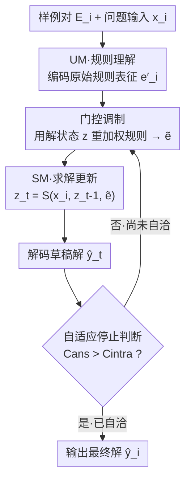

# Human-like Abstract Visual Reasoning via Understanding and Solving Reasoning Loop

**会议**: CVPR 2026  
**论文**: [CVF Open Access](https://openaccess.thecvf.com/content/CVPR2026/html/Chen_Human-like_Abstract_Visual_Reasoning_via_Understanding_and_Solving_Reasoning_Loop_CVPR_2026_paper.html)  
**代码**: 无  
**领域**: LLM推理 / 抽象视觉推理  
**关键词**: ARC-AGI, 抽象推理, 推理回环, 自适应停止, 小模型

## 一句话总结
把人类"理解—求解—再理解"的迭代认知拆成可循环交互的理解模块（UM）与求解模块（SM），辅以表征同构约束和自适应停止机制，让一个仅 7M 参数的小模型在 ARC-AGI-1 上达到 47.2% 准确率，超过 TRM 与一众通用大模型。

## 研究背景与动机
**领域现状**：ARC-AGI 这类抽象视觉推理基准，要求模型从 2-5 个输入-输出示范里归纳出可泛化的变换规则，再套到新的问题输入上。当前两条主流路线一是通用大模型（如 DeepSeek-R1、o3-mini-high），二是小型任务专用结构（如 Tiny Recursion Model, TRM）。

**现有痛点**：通用 LLM 在 ARC-AGI 上表现很差——DeepSeek-R1 仅 15.8%、o3-mini-high 也只有 34.5%，而且推理成本极高。小模型 TRM 虽然只有 7M 参数、效率友好，但它依赖训练任务 ID 构造的固定 puzzle-embedding 表，本质是静态查表，无法对未见任务做动态的示例编码与规则理解。

**核心矛盾**：现有模型都是"静态一次前向"地处理示例——把示例当成固定输入喂进去，一锤子算出答案。而人类解 ARC-AGI 时并不是单次前向：先对规则形成初步假设、生成试探解、检查它跟示例是否一致、再回头修正假设，理解与求解在循环中共同演化，直到二者自洽。现有架构恰恰缺这个"理解与求解动态对齐"的机制。

**本文目标**：让小模型也能像人一样，(1) 动态地从示例里抽取并细化规则表征，(2) 在理解和草稿解之间反复对齐，(3) 根据任务难度自适应地决定推理多少步。

**切入角度**：作者从神经认知学的"理解—求解回环"出发，假设把"理解"和"求解"显式拆成两个互相喂数据的模块、让它们循环交互，就能复刻人类的迭代推理，而参数靠跨步复用保持很小。

**核心 idea**：用一个 Understanding Module（理解规则）与 Solving Module（生成草稿解）之间的递归回环，替代固定 puzzle-embedding 的静态查表，并用"解与规则是否自洽"作为自适应停止信号。

## 方法详解

### 整体框架
USRL（Understanding and Solving Reasoning Loop）把每个 ARC-AGI 问题建模成一个动态递归过程。给定问题 $i$ 的示例集 $E_i=\{(x_{i,k},y_{i,k})\}$ 与问题输入 $x_i$，目标是预测 $y_i$。架构由两个显式交互的模块组成：理解模块 UM $U_\theta$ 把示例集编码成问题级规则表征 $e'_i$；求解模块 SM $S_\theta$（一个 Recurrent Transformer）维护并迭代更新一个潜在解状态 $z_i$。两模块不是各算一次，而是在多步（以 $t$ 索引）里循环交互：每一步 UM 产出（可缓存的）原始规则表征 $e'_i$，再由门控 $g_\theta$ 用当前解状态 $z_{i,t-1}$ 调制成 $\tilde e_{i,t-1}=g_\theta(z_{i,t-1},e'_i)$，SM 据此更新解状态 $z_{i,t}=S_\theta(x_i,z_{i,t-1},\tilde e_{i,t-1})$，再解码出草稿解 $\hat y_{i,t}=f_\theta(z_{i,t})$。每一步都把草稿解反馈回 UM 检查自洽性，决定继续回环还是停止。由于每个模块在所有推理步里复用同一套参数，总参数量保持 7M 的小规模。

### 关键设计

**1. UM–SM 推理回环与门控调制：把"理解"和"求解"拆成两个循环对齐的模块**

针对"静态一次前向无法动态理解示例"这个痛点，USRL 把推理拆成两个角色：UM 负责"读懂示例的规则"，SM 负责"基于当前规则草拟答案"，二者在外层回环里反复交互，形成"理解—求解—再理解—求解"的多步过程。关键不在于简单地把规则表征 $e'_i$ 直接灌给 SM，而是先经过一个学习到的门控 $g_\theta$，用当前解状态 $z_{i,t-1}$ 去**重加权**原始规则表征：$\tilde e_{i,t-1}=g_\theta(z_{i,t-1},e'_i)$。直觉是：模型当前画了一半的草稿解，会反过来决定"此刻该重点看规则的哪一部分"——比如草稿在颜色上出错，就把规则表征里跟颜色相关的成分放大。被调制后的 $\tilde e$ 再注入 SM 更新解状态。这一步把"理解服务于求解、求解又反哺理解"的双向依赖显式编码进了网络，是它区别于 TRM（只把自身潜状态递归喂回、没有独立的理解通道）的本质。消融显示：在只有 SM 的基线（36.5%）上加入 UM 就 +4.3%，再加门控又 +2.4%，印证了"解耦理解与求解"以及"按解状态动态调制规则"都各有实质贡献。

**2. 规则表征同构与对比损失：让同一任务的示例规则表征聚到一起**

ARC-AGI 训练任务只有约 1000 个，UM 极易过拟合，且光靠主损失，规则表征的判别性不够。作者提出"规则表征同构"假设：同一问题 $i$ 内的不同示例对 $(x_{i,k},y_{i,k})$ 共享同一条潜在变换规则，因此它们的示例级表征 $e_{i,k},e_{i,j}$ 在表征空间里应当彼此靠拢、与别的任务推远。实验观察到：即便只用主解损失 $L_{CE}$，同任务表征的相似度也会随训练自发上升（"隐式同构"），说明 UM-SM 的端到端交互本身就在鼓励模型抓取跨示例的共享规则。为强化这一性质，作者加了一个监督式 InfoNCE 对比损失 $L_{contrast}$：对每个表征 $e_{i,k}$，把同任务的其它表征当正样本、其余当负样本，$L_{e_{i,k}}=-\frac{1}{N}\sum_{p\in P(e_{i,k})}\log\frac{\exp(s(e_{i,k},p)/\tau)}{\sum_{a\in A(e_{i,k})}\exp(s(e_{i,k},a)/\tau)}$，其中 $s$ 是余弦相似度、$\tau$ 是温度。总目标为 $L=L_{CE}(y,\hat y)+\lambda_c L_{contrast}$。它把"隐式、缓慢"的同构变成"显式、快速"的收敛，直接拉低对比损失并构造出更可判别的规则空间，单独带来 +3.2% 的提升。这个同构性质同时也是下一个停止机制的几何基础。

**3. 自适应推理停止：用"解与示例的自洽度"决定何时收手**

回环不能无限转，但难易任务需要的推理深度不同。作者借助上面的同构几何设计了一个无需显式监督的停止判据：把当前草稿解 $(x_i,\hat y_{i,t})$ 当作一个"假想的新示例"喂回 UM，得到答案表征 $e_{i,ans}=U_\theta(\{(x_i,\hat y_{i,t})\})$，再算两个余弦相似度——示例内一致性 $C_{intra}=\mathrm{avg}_{j\neq k}\,\mathrm{sim}(e_{i,j},e_{i,k})$（已知示例之间的内部凝聚度，即推断出的规则空间有多紧）与答案-示例一致性 $C_{ans}=\mathrm{avg}_k\,\mathrm{sim}(e_{i,ans},e_{i,k})$（当前解跟规则的契合度）。停止条件是 $C_{ans}>C_{intra}$：当草稿解和示例的一致程度，已经达到示例彼此之间的一致程度，就认为"理解与求解自洽"、终止回环输出。这套基于内部表征收敛的判据，让模型按任务复杂度自适应分配算力（简单题早停、难题多想几步），在性能几乎不掉（固定步 47.2% → 自适应 47.0%，仅 −0.2%）的同时提供了计算弹性。训练侧还配了一个**随机停止**（stochastic halting）策略：以一定概率提前终止部分样本的推理并替换为新样本，避免一个 batch 内所有样本都被强制跑到同样深度，从而让模型见过多样的推理轨迹、缓解对固定推理长度的过拟合（额外 +0.8%）。

### 损失函数 / 训练策略
总损失为主解损失加对比项 $L=L_{CE}(y,\hat y)+\lambda_c L_{contrast}$（$\lambda_c=0.5$，$\tau=0.07$）。训练时对**每个中间推理步**的草稿解 $\hat y_{i,t}$ 都立即计算并反传 $L$（而非只优化最终输出），让 UM/SM 在推理展开过程中逐步细化参数；配合随机停止维持推理深度分布的均衡。UM 与 SM 均为 2 个 block 的 Recurrent Transformer，嵌入维度 $D=368$、8 个注意力头，最大推理步 $T_{max}=16$，推理时每题生成 2 个答案（pass@2）。数据沿用 TRM 的颜色置换/几何变换增强，把 400 训练任务扩到约 876k。

## 实验关键数据

### 主实验
在 ARC-AGI-1 评测集（400 个未见任务，pass@2）上：

| 模型 | 参数量 | 准确率(%) |
|------|--------|-----------|
| DeepSeek-R1 | ~671B | 15.8 |
| o3-mini-high | - | 34.5 |
| Gemini 2.5 Pro 32K | - | 37.0 |
| Omni-ARC (Qwen2.5-0.5B + TTT) | 0.5B | 40.0 |
| HRM | 27M | 40.3 |
| TRM | 7M | 44.6 |
| **USRL (本文)** | **7M** | **47.2** |

USRL 用 7M 参数拿到最高的 47.2%，同参数量下超过 TRM（44.6%），也胜过更大的 HRM（27M，40.3%）以及一众通用大模型——说明在 ARC 这类强归纳任务上，精心设计的紧凑架构能跑赢"靠规模"的路线。

### 消融实验
| 配置 | 参数量 | Acc.(%) | ∆ |
|------|--------|---------|----|
| Base（仅 SM） | 3.3M | 36.5 | - |
| + UM（无门控） | 6.7M | 40.8 | +4.3 |
| + UM（带门控） | 7.0M | 43.2 | +2.4 |
| + 对比损失 $L_{contrast}$ | 7.0M | 46.4 | +3.2 |
| + 随机停止（训练） | 7.0M | 47.2 | +0.8 |
| + 自适应停止（推理） | 7.0M | 47.0 | −0.2 |

### 关键发现
- **解耦"理解/求解"贡献最大**：单加 UM 就 +4.3%，再加门控 +2.4%，说明"独立的理解通道 + 按解状态动态调制规则"是性能主来源；对比损失的同构约束再补 +3.2%。
- **推理深度是硬门槛**：固定 $T_{max}$ 在 8 步及以下时准确率崩到 11.4%（$T_{max}=8$），12 步升到 25.1%，16 步才跳到 47.0%；继续加到 20 步只有 47.1%，几乎不再受益——因为训练就是 16 步，超出预算无额外收益。
- **自适应停止省算力**：即便 $T_{max}=16$，自适应机制平均只用 12.4 步（$T_{max}=20$ 时 13.2 步）就达到峰值精度，难题多想、简单题早停。

## 亮点与洞察
- **把"停止"建成几何自洽判据**：不靠额外监督或单独的 halting 网络，而是复用 UM 学到的规则同构空间，用"答案表征与示例的相似度是否追平示例内部相似度（$C_{ans}>C_{intra}$）"来判停，优雅且与表征学习目标天然耦合。
- **门控调制是点睛之笔**：让"当前画到一半的解"反过来决定"此刻重点看规则的哪部分"，把人类"边做边回看"的认知显式写进网络，是它比 TRM 单纯递归潜状态更进一步的关键。
- **小模型靠结构赢规模**：7M 参数胜过 671B 的 DeepSeek-R1，提醒在强归纳/少样本规则推理场景下，递归式细化的架构设计比单纯堆参数更有效——这个"理解—求解回环 + 自洽停止"的范式有望迁移到其它基于示范/规则归纳的任务。

## 局限与展望
- 作者承认 47.2% 仍远低于人类水平，许多抽象推理模式对 USRL 依然困难。
- 适用范围受限：USRL 依赖"基于示例的规则归纳"，不适合固定规则问题（如数独），也不适合没有示范对的任务格式。
- 自适应停止依赖同构假设成立；当同一任务的示例规则表征本就难以聚类（噪声大、规则模糊）时，$C_{intra}$ 这个阈值的可靠性如何、是否会误停/不停，文中未深入分析。
- 改进方向：把这套推理回环扩展到其它遵循规则归纳/示范范式的领域。

## 相关工作与启发
- **vs TRM**：同为 7M 参数的递归小模型，TRM 把自身潜状态（或预测）递归地喂回输入，但依赖训练任务 ID 的固定 puzzle-embedding 表，本质静态、对新任务泛化差（44.6%）；USRL 用独立的 UM 做动态规则编码 + 门控调制，摆脱查表，47.2%。
- **vs 自适应计算时间（ACT）/Universal Transformer**：都用动态步数分配算力，但 USRL 的停止信号来自"解与规则表征的自洽度"这一任务语义判据，而非通用的 halting 概率。
- **vs 规则学习三路线**：相比 task adapter（权重差 $\tau=\theta_{ft}-\theta_{pre}$）、condition injection（FiLM/AdaLN 调制）、task embedding（编码器/嵌入表映射），UM 综合了后两者——学习潜在规则表征，并用 SM 的当前解状态动态调制它。

## 评分
- 新颖性: ⭐⭐⭐⭐ 把人类"理解—求解回环"显式建成 UM/SM 交互 + 自洽停止，思路清晰且与表征学习耦合得巧
- 实验充分度: ⭐⭐⭐⭐ 主结果 + 逐组件消融 + 推理步分析齐全，但只在 ARC-AGI-1 单一基准上验证
- 写作质量: ⭐⭐⭐⭐ 动机—方法—判据逻辑连贯，公式与算法表清楚
- 价值: ⭐⭐⭐⭐ 7M 小模型超大模型，为"结构胜规模"的归纳推理提供有力样本

<!-- RELATED:START -->

## 相关论文

- [\[CVPR 2026\] Hilbert-Geo: Solving Solid Geometric Problems by Neural-Symbolic Reasoning](hilbert-geo_solving_solid_geometric_problems_by_neural-symbolic_reasoning.md)
- [\[CVPR 2026\] Step-CoT: Stepwise Visual Chain-of-Thought for Medical Visual Question Answering](step-cot_stepwise_visual_chain-of-thought_for_medical_visual_question_answering.md)
- [\[CVPR 2026\] Reinforcing Structured Chain-of-Thought for Video Understanding](reinforcing_structured_chain-of-thought_for_video_understanding.md)
- [\[NeurIPS 2025\] Visual Thoughts: A Unified Perspective of Understanding Multimodal Chain-of-Thought](../../NeurIPS2025/llm_reasoning/visual_thoughts_a_unified_perspective_of_understanding_multi.md)
- [\[CVPR 2026\] Agile Deliberation: Concept Deliberation for Subjective Visual Classification](agile_deliberation_concept_deliberation_for_subjective_visual_classification.md)

<!-- RELATED:END -->
