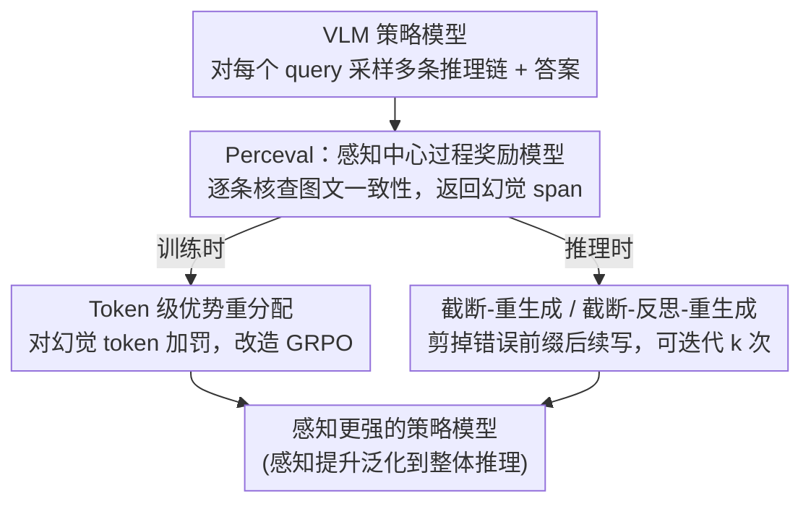

# Improving Vision-language Models with Perception-centric Process Reward Models

**会议**: CVPR 2026  
**论文**: [CVF Open Access](https://openaccess.thecvf.com/content/CVPR2026/html/Min_Improving_Vision-language_Models_with_Perception-centric_Process_Reward_Models_CVPR_2026_paper.html)  
**代码**: https://github.com/RUCAIBox/Perceval （待开源）  
**领域**: 多模态VLM / LLM推理  
**关键词**: 过程奖励模型, 感知幻觉, RLVR, GRPO, 测试时扩展

## 一句话总结
针对 VLM 强化学习里"只有结果奖励、定位不到错在哪一步"的痛点，本文训练了一个感知中心的过程奖励模型 Perceval，逐条核查推理链里的图文一致性、标出幻觉 token，再把这个信号同时用于训练（token 级优势重分配改造 GRPO）和推理（截断-重生成），在多个视觉推理基准上稳定涨点，并意外地把"感知更准"泛化成了"整体推理更强"。

## 研究背景与动机
**领域现状**：用可验证奖励的强化学习（RLVR，主要是 GRPO）做后训练，是当前提升 VLM 复杂推理能力的主流套路——给整条推理链一个标量奖励（对/错），用策略梯度往"答得对"的方向优化。

**现有痛点**：视觉推理本质上是多步的，一条 chain-of-thought 里可能先看错了图（把红色看成黑色、把"在左边"看成"在右边"），后面的逻辑全建立在这个错误感知之上。但 GRPO 的奖励是**序列级**的：同一条回答里所有 token 共享一个优势值（公式 1 里的 $\hat{A}_i$ 对该回答内每个 token 都相同），模型只知道"这条整体不好"，却不知道**到底哪一步、哪个 span 错了**——这是一个很硬的信用分配（credit assignment）问题。结果就是稀疏奖励把 RLVR 在 VLM 上的收益卡住了。

**核心矛盾**：要做细粒度监督就得有步级标注，但步级标注很贵、而且有些步要等后续推导才能判定对错，难以可靠标。

**切入角度**：作者注意到视觉推理里很多中间步骤其实是**感知性断言**（某个物体、属性、空间关系），这些断言可以**直接拿图来核验**——"图文是否对齐"是能自动检查的。于是稀疏奖励问题在感知这一面有了突破口。

**核心 idea**：训练一个感知中心的过程奖励模型（PRM）Perceval，专门"抓图文不一致的幻觉 span"，把它产出的细粒度信号一鱼两吃——训练时改造 GRPO 优势、推理时做截断重生成。

## 方法详解

### 整体框架
方法围绕一个外部 critic——Perceval（Perception-centric process reward evaluation model）——展开。给定 ⟨图像、问题、模型回答⟩，Perceval 用 think-then-answer 范式逐条核查回答里的感知断言，最后在 `<answer>` 里返回一个 Python list，列出回答中被判为幻觉的原文字符串（若无错则返回 "The response is correct."）。这个 PRM 一旦训好，就被同时插进**训练**和**推理**两条链路：训练时把它定位的幻觉 token 转成 token 级的负优势喂回 GRPO；推理时按它标出的错误 span 截断回答、让模型重写。

### 关键设计

**1. Perceval：把"图文对不对齐"做成可训练的过程奖励**

痛点是步级标注太贵、且很多步无法即时判定。作者把范围收窄到**感知断言**——这类断言能直接拿图核验，于是可以自动造标注。Perceval 用 think-then-answer 范式：先在 `<think>` 里逐条把回答中的 claim 拎出来、和图里的视觉证据一一比对，再在 `<answer>` 里输出幻觉字符串列表。训练数据用四阶段流水线构造：① **Query 选择**——主要从视觉搜索数据集（需要在大图里定位小目标，感知压力大）取图和问题，掺少量数学/通用数据保广度；② **Rollout 生成**——用开源 VLM（如 Qwen2.5-VL-7B）跑回答，其不完美的感知天然产出真实的幻觉负样本；③ **自动标注核验**——用强模型（如 Gemini-2.5-Pro ⚠️ 以原文为准）做以幻觉为中心的逐步检查，按规定格式产出标注；④ **SFT**——在聚合数据上微调 Perceval 骨干，学会输出这种结构化核验。这样得到的 PRM 不靠人工步级标注，却能可靠地在多步推理里标出幻觉 span。

**2. Token 级优势重分配：把序列级奖励"掰开"到出错的 token 上**

GRPO 的硬伤是优势 $\hat{A}_i$ 对一条回答内所有 token 一视同仁。作者改的就是这一步：用 Perceval 解析 `<answer>` 拿到问题子串，再用精确字符串匹配在回答 $o_i$ 里定位每个子串的 token 区间 $[j_k, l_k]$，并集成 $U_i$，构造二值掩码 $M_i$（命中幻觉的 token 处 $m_{i,t}=1$，否则 0）。然后用掩码调制序列级优势，得到 token 级优势：

$$\hat{A}'_{i,t} := \hat{A}_i - \alpha \cdot m_{i,t} \cdot |\hat{A}_i|,$$

其中 $\alpha \in [0,1]$ 控制惩罚强度。正常 token（$m_{i,t}=0$）保持 $\hat{A}'_{i,t}=\hat{A}_i$ 不变；幻觉 token 则被压：当 $\hat{A}_i>0$ 时变成 $\hat{A}_i(1-\alpha)$（少奖），当 $\hat{A}_i<0$ 时变成 $\hat{A}_i(1+\alpha)$（多罚）。把 $\hat{A}'_{i,t}$ 代回 GRPO 目标（公式 2）即可。这样既保留了序列级偏好（整体对/错的方向不丢），又对"没有视觉依据的内容"施加了直接的 token 级纠偏压力——比单纯 GRPO 的信用分配精确得多。训练时还做了**条件策略**：只在感知相关数据上用 Perceval 重分优势，数学等其他数据退回普通 GRPO，正是用来检验"感知监督能否泛化到别的领域"。

**3. 测试时截断-重生成：把 PRM 当成推理期的纠错器**

同一个 Perceval 在推理阶段也能用来做测试时扩展。**Truncate–then–Regenerate**：Perceval 检测到错误 claim 后返回它在推理链里的 span，于是在该 span 第一个 token 前把假设截断、只保留已核验的前缀作为上下文，让策略模型沿干净前缀续写——因为原图和问题都在，模型只需重采样被判错的部分、不必重写已验证内容；这个"截断-续写"循环重复到没有新错误或达到上限 $k$ 次。**Truncate–Thinking–then–Regenerate**：在截断处再追加一句轻量反思提示（如 "Wait, I need to reconsider this reasoning more carefully: the mug is not on the brick in the image."），引导模型先反思失败模式（物体/属性/空间不匹配）再续写，更可能精准修好那处错配。两者都用一点额外算力换更强的事实接地。

### 损失函数 / 训练策略
Perceval 用标准 SFT 目标在四阶段流水线数据上微调（3B / 7B 两个尺寸）；策略模型用改造后的 token 级优势 GRPO 训练，骨干均为 Qwen2.5-VL，对应训出 3B / 7B 两个策略模型。SFT 数据来自 DeepEyes、SophiaVL-R1（各用骨干 rollout 3 次），RL 数据主要来自 DeepEyes（侧重感知，混入部分通用推理）。

## 实验关键数据

### 主实验
在视觉搜索、感知密集推理、数学&图表三类共 8 个基准上评测（V*、BLINK、MMStar、MME-RealWorld、RealWorldQA、MathVision、MathVista、ChartQA），统一用贪心解码 + 两阶段判分（先精确匹配，再用 GPT-4o-mini 兜底）。

| 模型(7B) | V*(all) | BLINK | MMStar | RWQA | MathVision | MathVista |
|--------|------|------|------|------|------|------|
| Qwen2.5-VL | 62.30 | 48.56 | 62.3 | 60.6 | 26.97 | 70.2 |
| + GRPO | 84.29 | 53.55 | 62.0 | 66.4 | 27.96 | 71.7 |
| **+ Ours** | **86.39** | **54.49** | **63.8** | **67.4** | **30.92** | 72.0 |

3B 规模同样稳定优于 GRPO：V*(all) 从 80.10→83.25，作者报告视觉搜索约 +4%、数学&图表约 +3%、感知密集推理约 +1%。

### 测试时扩展（Table 2，k=4）
| 策略 | V*(Attr) | V*(Pos) | V*(All) | BLINK |
|------|------|------|------|------|
| Major voting | 91.30 | 76.32 | 85.34 | 48.24 |
| **Truncate（本文）** | **93.04** | **77.63** | **87.96** | — |

截断-重生成在相同采样预算下一致优于多数投票，说明"定位错误 span 再局部重写"比"多采样投票"更省也更准。

### 关键发现
- **最亮的发现是泛化**：训练时 Perceval 只在感知相关数据上做细粒度优势重分（数学等退回普通 GRPO），但"感知变准"这一基础提升泛化到了整体推理——数学/图表等没用 PRM 监督的领域也涨点（如 7B MathVision 27.96→30.92）。这支撑了"感知中心监督是通用策略"的主张。
- token 级优势重分配的价值在于精确信用分配：序列级方向保留、幻觉 span 被定向压制，比单纯 GRPO 更稳。
- ChartQA 上 7B 略降（85.16→84.44），说明感知监督对偏文本/表格逻辑的任务收益有限甚至轻微负向。

## 亮点与洞察
- **一个 PRM、两处复用**：同一个 Perceval 既改训练（token 级优势）又改推理（截断重生成），训练和推理共用同一套"找幻觉 span"的能力，工程上很经济。
- **把稀疏奖励问题从"感知面"破开**：不去硬啃"所有步都要可验证"，而是只挑感知断言（能拿图核验）下手——这个范围收窄让自动造标注、token 级定位都变得可行，是很务实的切入。
- **token 级优势调制公式可迁移**：$\hat{A}'_{i,t}=\hat{A}_i-\alpha m_{i,t}|\hat{A}_i|$ 这种"用掩码把序列级优势在指定 span 上压一刀、且对正负优势分别处理"的写法，可以直接搬到其他"能定位出错 span"的 RLVR 任务（如代码、工具调用）。

## 局限与展望
- 依赖一个强标注模型造训练标注，PRM 质量受其幻觉检测能力上限约束；标注噪声会传导到策略训练。
- 收益集中在感知密集任务，对偏文本逻辑的任务（如 ChartQA）可能无益甚至轻微掉点，需要"按数据类型条件触发"才不伤其他领域。
- 截断-重生成靠精确字符串匹配定位 span，若回答措辞与 PRM 输出不完全一致，定位可能失败（论文未充分讨论匹配鲁棒性）。
- 测试时扩展用额外算力换精度，迭代上限 $k$ 与延迟的权衡需按部署场景调。

## 相关工作与启发
- **vs GRPO / RLVR（VLM-R1、LMM-R1 等）**：它们用序列级结果奖励，本文用 PRM 把奖励掰到 token 级，区别在于信用分配粒度，本文在感知任务上更准。
- **vs R1-VL（StepGRPO）**：同样想做步级密集奖励，但 R1-VL 用规则化的 step reward；本文用一个学出来的、可解释（返回幻觉原文）的感知 PRM，监督信号更贴合视觉幻觉这一具体失败模式。
- **vs DeepEyes / Pixel-Reasoner（带工具/像素操作）**：它们靠"看图工具"或像素级操作增强感知，本文不改策略模型的动作空间，只在奖励侧动刀，正交且更轻量。

## 评分
- 新颖性: ⭐⭐⭐⭐ 感知中心 PRM + token 级优势重分 + 截断重生成三件套组合新颖，单项部件多有前作影子。
- 实验充分度: ⭐⭐⭐⭐ 8 基准 ×（3B/7B）覆盖广，主结果+TTS+泛化分析齐全，但消融对 $\alpha$、PRM 规模的敏感性可再深入。
- 写作质量: ⭐⭐⭐⭐ 动机—方法—泛化发现的逻辑链清晰，公式与流水线交代到位。
- 价值: ⭐⭐⭐⭐ "感知监督泛化到整体推理"这一发现对 VLM 后训练有实际指导意义。

<!-- RELATED:START -->

## 相关论文

- [\[CVPR 2026\] Revisiting the Necessity of Lengthy Chain-of-Thought in Vision-centric Reasoning Generalization](revisiting_the_necessity_of_lengthy_chain-of-thought_in_vision-centric_reasoning.md)
- [\[CVPR 2026\] Think-as-You-See: Streaming Chain-of-Thought Reasoning for Large Vision-Language Models](think-as-you-see_streaming_chain-of-thought_reasoning_for_large_vision-language_.md)
- [\[ICLR 2026\] Vision-R1: Incentivizing Reasoning Capability in Multimodal Large Language Models](../../ICLR2026/llm_reasoning/vision-r1_incentivizing_reasoning_capability_in_multimodal_large_language_models.md)
- [\[ACL 2026\] Process Reward Models Meet Planning: Generating Precise and Scalable Datasets for Step-Level Rewards](../../ACL2026/llm_reasoning/process_reward_models_meet_planning_generating_precise_and_scalable_datasets_for.md)
- [\[ICML 2025\] Improving Rationality in the Reasoning Process of Language Models through Self-playing Game](../../ICML2025/llm_reasoning/improving_rationality_in_the_reasoning_process_of_language_models_through_self-p.md)

<!-- RELATED:END -->
