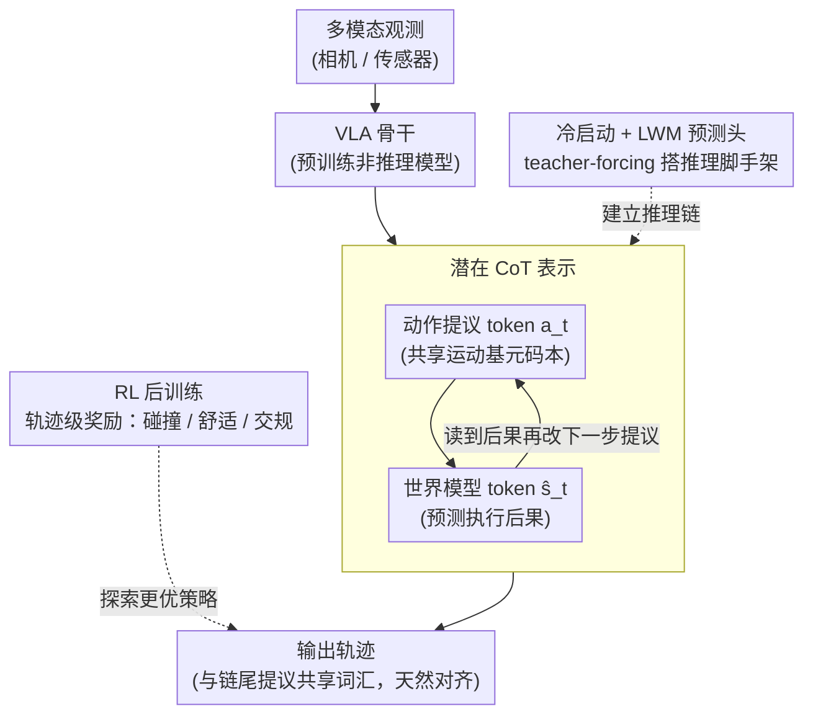

# Latent Chain-of-Thought World Modeling for End-to-End Autonomous Driving

**会议**: CVPR 2026  
**arXiv**: [2512.10226](https://arxiv.org/abs/2512.10226)  
**代码**: 无  
**领域**: LLM推理  
**关键词**: 潜空间推理, 链式思考, 世界模型, 端到端驾驶, VLA模型

## 一句话总结
LCDrive 提出潜在链式思考（Latent CoT）框架，用动作提议token和世界模型预测token替代自然语言CoT进行推理，通过冷启动+RL后训练实现更低延迟、更好轨迹质量的端到端自动驾驶。

## 研究背景与动机
1. **领域现状**：视觉-语言-动作（VLA）模型已成为端到端自动驾驶的趋势，文本CoT推理被引入来提升长尾场景性能。
2. **现有痛点**：（i）自然语言不适合表示时空几何和多Agent交互；（ii）自回归生成长文本引入显著延迟；（iii）生成的动作可能与文本推理严重偏离（文本说"左转"但动作实际右转）。
3. **核心矛盾**：文本CoT虽然利用了LLM的推理能力，但文本不是驾驶决策的最佳表示介质。
4. **本文目标**：设计更高效、更对齐的推理表示，替代文本CoT。
5. **切入角度**：将推理表达为潜在向量空间中的结构化序列，而非自然语言。
6. **核心idea**：用动作提议token（与输出动作共享词汇表）和世界模型token（预测未来场景状态）交替构成潜在CoT。

## 方法详解

### 整体框架
LCDrive 要解决的核心问题是：VLA 驾驶模型借文本 CoT 来推理，但文字既表达不好时空几何，又拖慢生成、还可能和最终动作对不上。它的做法是把整条推理链从自然语言搬进潜在向量空间——模型不再"用文字想"，而是交替吐出两类潜在 token：先提议一个候选动作，再让世界模型预测"执行它之后场景会变成什么样"，看到后果再调整下一个动作提议，如此往复，最后落到真正要输出的轨迹。整套系统分三阶段训练：先从一个预训练好的非推理 VLA 出发冷启动这条潜在推理链，再训练一个小型世界模型预测头让模型在推理时能自己预测未来状态，最后用轨迹级奖励做 RL 后训练把整条链打磨到位。

### 关键设计

**1. 潜在 CoT 表示：让推理痕迹和输出动作天生对齐**

文本 CoT 最致命的弱点是"文本说左转、动作却右转"——推理和决策走两套表示，没人保证它们一致。LCDrive 索性让推理链里的动作提议 token 和模型最终输出的动作**共享同一套词汇表**：1024 个运动基元（motion primitive）码本，由训练数据 k-means 聚类得到。于是"提议的动作"和"输出的动作"说的是同一种语言，对齐是结构性保证的，不靠后期对齐损失硬掰。推理链由两类 token 交替组成：动作提议 token $a_t$（候选动作）与世界模型 token $\hat{s}_t$（执行该候选后由潜在世界模型预测头给出的未来场景状态 embedding），形成 $a_1 \to \hat{s}_1 \to a_2 \to \hat{s}_2 \to \dots$ 的"提议—预测后果—再提议"结构。世界模型 token 直接在潜空间编码物理交互，比一句"前方有行人，应减速"的文字精确得多，也省掉了大量冗余自然语言 token，序列更短、延迟更低。

**2. 冷启动 + LWM 预测头：先搭出能站住的推理脚手架**

从随机初始化直接学这条潜在推理链几乎学不动——模型还没有任何"提议—预测"的概念，RL 根本无从探索。冷启动阶段先用 teacher-forcing 喂入两样东西：GT 未来 rollout 得到的世界模型状态、以及模型自己产生的动作提议，让模型照着这个模式把潜在推理链建立起来。但 teacher-forcing 用的是 GT 未来状态，推理时拿不到，于是同步训练一个小型潜在世界模型预测头（LWM head）：输入提议动作 $a_t$，输出对应的世界模型 embedding $\hat{s}_t \approx s_t$。这样推理时模型就能自给自足地"想象"候选动作的后果，不再依赖任何 GT 标注。

**3. RL 后训练：在脚手架上探索出更优的推理—决策策略**

冷启动只能让模型模仿 GT 行为，学不到 GT 之外更好的开法。在已经搭好的推理脚手架上，再用强化学习按轨迹级奖励（碰撞、舒适度、是否遵守交规等综合指标）同时优化潜在推理 token 和最终动作预测。值得注意的是 RL 对潜在推理模型的增益**明显大于**对非推理 baseline——作者认为潜在空间比离散语言空间更连续、更适合策略梯度搜索，给了 RL 一个更好优化的 landscape，这也是潜在 CoT 和 RL 之间的协同效应。

### 一个完整示例：一次左转决策怎么在潜空间里"想"完

设场景为路口左转、对向有一辆来车。模型先从码本里提议动作 $a_1$=「正常速度左转」；世界模型预测头给出后果 $\hat{s}_1$——潜空间里编码出"与对向车的间距快速收缩、有碰撞风险"。模型读到这个后果，下一步提议 $a_2$=「减速让行后再转」；预测头给出 $\hat{s}_2$=「对向车通过、间距安全」。这条 $a_1 \to \hat{s}_1 \to a_2 \to \hat{s}_2$ 的潜在链没有产生一个自然语言 token，却完成了"试一个动作—看后果—改一个动作"的多步推理，最终输出的轨迹与链尾提议 $a_2$ 共享词汇、天然一致。对比文本 CoT 要写一长段"路口有来车，应当先减速……"再生成动作，这里整条链更短、更快，也不会出现文字与动作打架。

### 损失函数 / 训练策略
冷启动阶段：动作预测损失 + 世界模型预测损失（LWM 预测头让 $\hat{s}_t$ 逼近 GT 状态 $s_t$）。RL 后训练：GRPO 或同类策略梯度方法，奖励为碰撞、舒适度、交规遵守等轨迹级综合指标。

## 实验关键数据

### 主实验

| 方法 | 推理延迟 | 轨迹质量 | RL提升幅度 | 说明 |
|------|---------|---------|-----------|------|
| LCDrive (Latent CoT) | 最低 | 最优 | 最大 | 潜在推理 |
| Text CoT VLA | 高 | 次优 | 中等 | 自然语言推理 |
| Non-reasoning VLA | 低 | baseline | 较小 | 无推理 |

### 消融实验

| 配置 | 关键指标 | 说明 |
|------|---------|------|
| Full LCDrive | 最优 | 冷启动+LWM+RL |
| w/o RL后训练 | 明显下降 | RL对潜在推理提升最大 |
| w/o 世界模型token | 下降 | 仅动作提议不够 |
| w/o 冷启动 | 严重下降 | 直接RL无法建立推理 |

### 关键发现
- LCDrive比文本CoT推理延迟更低，因为潜在token序列更紧凑（无冗余自然语言token）。
- RL后训练对潜在推理模型的提升远大于对非推理模型，说明潜在CoT提供了更好的优化landscape。
- 定性分析显示，潜在CoT推理在多Agent交互场景中能做出更连贯的决策。

## 亮点与洞察
- **"推理不一定需要语言"**这一洞察非常深刻——驾驶决策的本质是空间推理而非语言推理。
- **动作-推理对齐**通过共享词汇表自然实现，消除了文本CoT的核心弱点。
- **RL+潜在推理的协同效应**是重要发现——潜在空间比语言空间更适合RL优化。

## 局限与展望
- 冷启动依赖GT未来状态，需要完整的场景标注。
- LWM预测头的精度影响推理质量。
- 目前基于单一数据集评估，泛化性需进一步验证。

## 相关工作与启发
- **vs AR1/DriveVLM**: 使用文本CoT推理，延迟高且动作-文本可能不对齐。
- **vs MILE/LAW**: 使用潜在世界模型但不用于推理链条。LCDrive将两者结合为结构化推理。

## 评分
- 新颖性: ⭐⭐⭐⭐⭐ 潜在CoT替代文本CoT是概念性突破
- 实验充分度: ⭐⭐⭐⭐ 大规模驾驶数据集上的全面评估
- 写作质量: ⭐⭐⭐⭐⭐ 问题定义精准，对比分析透彻
- 价值: ⭐⭐⭐⭐⭐ 对VLA推理范式有重要启示意义

<!-- RELATED:START -->

## 相关论文

- [\[ICLR 2026\] Generalizable End-to-End Tool-Use RL with Synthetic CodeGym](../../ICLR2026/llm_reasoning/generalizable_end-to-end_tool-use_rl_with_synthetic_codegym.md)
- [\[CVPR 2026\] Reinforcing Structured Chain-of-Thought for Video Understanding](reinforcing_structured_chain-of-thought_for_video_understanding.md)
- [\[CVPR 2026\] Rationale-Enhanced Decoding for Multi-modal Chain-of-Thought](rationale-enhanced_decoding_for_multi-modal_chain-of-thought.md)
- [\[CVPR 2026\] ReLaX: Reasoning with Latent Exploration for Large Reasoning Models](relax_reasoning_with_latent_exploration_for_large_reasoning_models.md)
- [\[CVPR 2026\] FireScope: Wildfire Risk Raster Prediction with a Chain-of-Thought Oracle](firescope_wildfire_risk_raster_prediction_with_a_chain-of-thought_oracle.md)

<!-- RELATED:END -->
