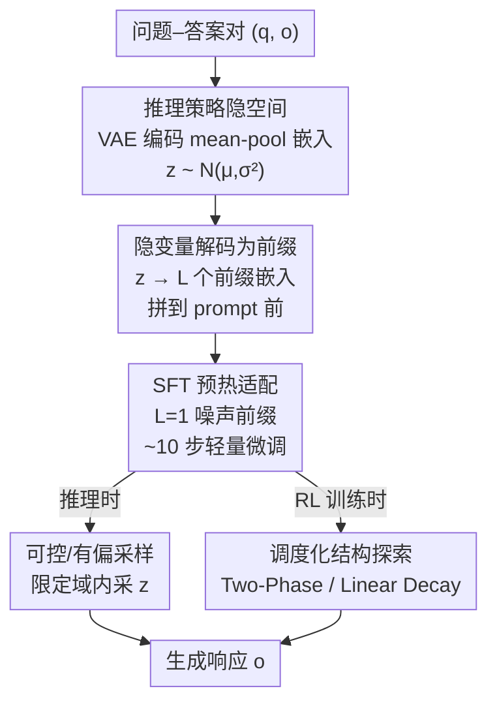

# Reasoning Palette: Modulating Reasoning via Latent Contextualization for Controllable Exploration for (V)LMs

**会议**: CVPR 2026  
**论文**: [CVF Open Access](https://openaccess.thecvf.com/content/CVPR2026/html/Long_Reasoning_Palette_Modulating_Reasoning_via_Latent_Contextualization_for_Controllable_Exploration_CVPR_2026_paper.html)  
**代码**: 待确认  
**领域**: LLM推理  
**关键词**: 隐变量调制, 可控探索, 强化学习, VAE, 前缀注入

## 一句话总结
这篇论文用一个 VAE 学到的隐空间给 (V)LM 注入一个"推理调色板"——每采一个隐变量就解码成一段可学习前缀贴到 prompt 前面，让模型在生成第一个 token 之前就选定某种推理风格，从而把 RL 里的"token 级随机采样"升级成"策略级结构化探索"，在多个数学推理 benchmark 上稳定超过标准 GRPO/RLOO。

## 研究背景与动机

**领域现状**：可验证奖励强化学习（RLVR）已经成为激发大模型多步推理的主流后训练范式——给模型的输出按"答案对不对"打确定性奖励，逼它在给出最终答案前产出一长串中间推理 token。无论是推理时多采几条候选投票（self-consistency），还是 RL 训练里 rollout 多条轨迹估优势，都依赖一个前提：采样能采出**多样**的解法。

**现有痛点**：标准采样方案（温度采样、nucleus 采样）的多样性都发生在 **token 级**——它反复在"措辞略有不同、思路几乎一样"的轨迹之间打转。要发现一个真正有效的推理策略，需要的是**高层结构**上的变化（换一种解题套路、换一种组织方式），而 token 级的扰动只能制造表面差异。现有补救手段（如熵正则）也只是鼓励局部多样性，几乎没有机制去塑造模型的**内部规划**。

**核心矛盾**：发现高质量推理策略所需的"高层可变性"，与 token 级采样能提供的"低层可变性"之间存在错位（mismatch）。结果就是模型一遍遍探索"换汤不换药"的相似路径，而不是去试探截然不同的策略模式，RL 训练的探索效率和鲁棒性都被卡住。

**切入角度**：作者观察到一个有意思的现象（论文 Fig. 1）——在 Qwen-4B-Base 的 prompt embedding 前面，只要预置一个**随机采的高斯噪声 token embedding**，即便每条候选都用贪心解码（per-sample 完全确定），pass@k 也能大幅提升（GSM8K 上 pass@32 从 52.9% 飙到 85.3%）。这说明性能增益**不来自 token 级随机性**，而来自这个前置噪声诱导出的"策略级变化"。

**核心 idea**：与其在 token 上加噪，不如学一个**结构化的隐空间**，把不同推理策略编码成隐空间里不同的区域；每次从隐空间采一个隐变量，解码成贴在 prompt 前的前缀，在生成开始**之前**就调制模型的内部推理轨迹。换句话说，把探索从"输出端的 token 随机"挪到"输入端的策略采样"。

## 方法详解

### 整体框架
Reasoning Palette 是一个"隐变量调制（latent-modulation）"框架，整条管线分三步走：**先离线学一个推理策略隐空间，再用少量 SFT 让基座模型听懂前缀，最后在推理/RL 时按需采隐变量做结构化探索**。

具体地：(1) 用一个 VAE 在大量"问题–答案对"上训练，把每对 QA 的 mean-pooled embedding 映射进一个高斯隐空间 $Z$，让数学/代码/QA 等不同推理模式落到不同区域；(2) 从隐空间采一个 $z$，经 decoder 解码成 $L$ 个连续前缀 embedding，拼在 prompt 前面送进 LLM——前缀调制模型的内部状态、引导推理轨迹；(3) 用一段极短的 SFT（约 10 步）让基座模型适应这种"前缀条件化"，再把隐变量当成 RL 里的辅助控制信号，每个 episode 采一个 $z$ 注入，实现策略级探索。

### 关键设计

**1. 在冻结 token embedding 上建 VAE 隐空间：让"前缀"天生和模型的输入分布对齐**

这一设计针对的痛点是：前置噪声虽然能涨点，但"naively 注入随机噪声常常掉点"——因为随机向量根本不在模型熟悉的 token embedding 分布里，模型读不懂。作者的做法是把隐空间**直接建在模型冻结的 token embedding 层 $E(\cdot)$ 之上**。对每个"问题–答案对" $[q;o]=(x_1,\dots,x_N)$，先对原始 token embedding 做 mean-pooling 得到一个上下文摘要 $h=\frac{1}{N}\sum_{i=1}^{N} E([q;o]_i)\in\mathbb{R}^d$，再用一个 MLP 编码器 $E_\phi$ 把它映射到对角高斯的参数、采隐变量，解码器 $D_\psi$ 再重建出 $\hat h$：

$$\mu,\sigma = E_\phi(h),\quad z\sim\mathcal{N}(\mu,\mathrm{diag}(\sigma^2)),\quad \hat h = D_\psi(z).$$

整个 VAE 用 ELBO 端到端训练：$\mathcal{L}_{\text{VAE}}=\mathbb{E}_{z\sim q_\phi(z|h)}\big[\lVert h-\hat h\rVert^2 + \beta\cdot \mathrm{KL}(q_\phi(z|h)\,\Vert\,p(z))\big]$，先验 $p(z)=\mathcal{N}(0,I)$。为什么有效：因为 $h$ 和单个 token embedding 活在同一个空间，重建出来的 $\hat h$ 就能被当成"伪 token"直接初始化前缀，**天然和模型的输入期望分布一致**，不需要大改模型；而 mean-pooling 给出一个定长、对顺序不敏感的摘要，抹掉了表层措辞差异，刚好用来表征"推理风格"而非逐字输出。$\beta$ 调大会让隐空间更平滑、语义区域更解耦——相近隐变量对应相似推理模式，远处隐变量诱导出截然不同的策略。

**2. 隐变量解码成可变长前缀 + 有偏采样：把隐空间变成可读、可干预的"调色板"**

这一点解决"怎么把隐变量真正用起来、还能定向控制"。推理时从先验采 $z\sim\mathcal{N}(0,I)$，解码成 $L$ 个前缀 embedding $p_z=(D_\psi(z^{(1)}),\dots,D_\psi(z^{(L)}))\in\mathbb{R}^{L\times d}$，拼到 prompt 前面做自回归生成：$\tilde q=[p_z;E(q)],\ o\sim\pi_\theta(\cdot\mid\tilde q)$。这里前缀长度 $L$ 是**可调超参**：$L$ 大→引导更强更结构化（适合复杂多步任务），$L$ 小→轻量调制、几乎零开销，用户能在"控制强度"和"推理成本"之间自由权衡。

更关键的是**可控性**：由于 VAE 在 SFT 后被冻结，隐空间是一个稳定、可解释的坐标系。作者可以把目标域（数学/代码/QA）的代表性推理轨迹用 $E_\phi$ 编码进隐空间，统计每个域隐向量的经验均值和协方差，找出彼此分得很开的"风格区域"；推理新 prompt 时，**把采样限制在某个域对应的区域内**，解出域对齐的前缀，就能定向把模型行为掰向该推理风格。实验里用 math 域隐变量在所有数学 benchmark 上都优于 code/QA 域偏置（见 Table 1），证明这个"调色板"不是噱头，而是真能选色的。

**3. 极短 SFT 预热（L=1）：让模型听懂前缀，又不被前缀"洗掉"多样性**

直接拿冻结基座去吃 VAE 前缀会有两个隐患：一是基座没见过这种连续前缀条件，可能读不懂；二是学到的后验 $q_\phi(z|h)$ 和推理时用的各向同性先验 $\mathcal{N}(0,I)$ 有偏差，直接用先验采样会让泛化掉点。作者的解法很讲究：SFT 数据**不是**把真实样本编码成隐变量，而是**直接从先验采 $z\sim\mathcal{N}(0,I)$**、解码成前缀 $p=D_\psi(z)$，再和原始的 $(q,o)$ 配对，最小化标准语言建模损失 $\mathcal{L}_{\text{SFT}}=-\mathbb{E}_{(p,q,o)}[\log p_\theta(o\mid[p;E(q)])]$——这样训练分布和推理分布对齐，避免了先验/后验失配。

同时**只 SFT 约 10 步、且固定前缀长 $L=1$**：刻意保持极短极弱。原因是 SFT 太久、或前缀太强，模型会学会"忽略前缀、过拟合到某一种固定回答模式"，把不同 $z$ 带来的多样性彻底洗掉。用单个噪声前缀+极少步数，让模型刚好学会"对任意 VAE 前缀做条件化"，又保留足够的随机响应能力；等推理/RL 时再放大到 $L=4$ 或 $8$ 做更丰富的组合式引导。这种"轻触碰"是整个框架能同时保住"基座通用能力"和"前缀多样性"的关键。

**4. RL 里的双轴调度探索（Two-Phase / Linear Decay）：在推理架构层面实现"探索→利用"**

把隐变量搬进 RL 时，作者把 $z$ 当作每个 episode 采一次的辅助控制信号，策略变成 $\pi_\theta(o\mid q,z)=\prod_t p_\theta(o_t\mid[p;E(q)],o_{<t})$，目标扩展为 $\max_\theta \mathbb{E}_{z\sim p(z)}\mathbb{E}_{q,o}[r(o;q)]$。痛点在于：一直开着隐探索会让后期收敛慢，一直不开又回到 token 级低多样性。于是作者设计**双轴调度**——时间维（训练进程中调制引导强度，整体走"先探索后利用"）+ 组内维（每个 GRPO group 里调节带前缀 rollout 的比例）。形式化为一个混合目标：

$$J_{\text{sched}}(\theta)=\mathbb{E}_\tau\,\mathbb{E}_{q}\big[\rho(\tau)\cdot \mathcal{L}_{\text{PPO}}(\theta;q,z) + (1-\rho(\tau))\cdot \mathcal{L}_{\text{PPO}}(\theta;q)\big],$$

其中 $\tau\in[0,1]$ 是归一化训练进度，$\rho(\tau)$ 是该步带隐条件 rollout 的比例。具体两套调度：**Two-Phase**——前 50% 步全部 rollout 用 $L=8$ 前缀最大化策略多样性，后 50% 彻底关掉（$L=0$）全力利用前期挖到的高奖励行为（$\rho(\tau)=\mathbf{1}[\tau<0.5]$）；**Linear Decay**——整个训练过程把带引导 rollout 的比例从 100% 线性降到 0%（$\rho(\tau)=1-\tau$），平滑过渡。为什么有效：训练曲线（Fig. 6）显示隐变体早期因为探索次优路径涨得慢，但后半程反超 GRPO baseline——早期探索让策略接触到行为空间里更高质量的区域，后期再固化下来。这等价于经典的探索–利用权衡，但发生在**推理架构层面而非 token 级随机性**上。

## 实验关键数据

### 主实验

**推理时有偏采样（pass@8，SFT 后的 Qwen3-4B-Base）**：用不同域的隐变量给数学 benchmark 做有偏采样，math 域隐变量全面最优，验证隐空间确实编码了可选的推理风格。

| 隐变量来源 | MATH500 | Olympic | GSM8K |
|--------|------|------|------|
| codeparrot (Code) | 70.8 | 42.95 | 94.47 |
| MetaMathQA (Math) | **72.4** | **46.11** | **95.0** |
| ShareGPT Vicuna (QA) | 71.0 | 45.47 | 93.63 |

**RL 主结果（数学推理 pass@1，DeepMath 训练）**：在三种规模基座 × 两种 RL 算法上，Reasoning Palette 几乎全面超过 baseline。下面摘最具代表性的 Qwen3-8B-Base + RLOO（增益最大）与 Qwen3-4B-Base + GRPO：

| 配置 | MATH500 | OlympiadBench | AMC23 | GSM8K | MinervaMath | Avg. |
|------|------|------|------|------|------|------|
| Qwen3-8B + RLOO | 69.53 | 43.76 | 55.00 | 91.82 | 39.48 | 59.91 |
| + Palette (Two-Phase) | 72.27 | 46.00 | 57.50 | 93.04 | 42.57 | 62.28 |
| + Palette (Linear Decay) | 72.20 | **46.61** | **59.38** | **93.03** | **43.77** | **63.00** (+3.09) |
| Qwen3-4B + GRPO | 68.65 | 41.32 | 50.94 | 91.05 | 39.39 | 58.27 |
| + Palette (Two-Phase) | 70.53 | 43.95 | **55.00** | 92.19 | 42.20 | **60.77** (+2.50) |
| + Palette (Linear Decay) | **72.67** | **45.29** | 47.50 | **92.64** | 42.53 | 60.12 |

整体上 Linear Decay 比 Two-Phase 平均再高约 +0.75 分，作者解释平滑过渡让模型从探索到利用的切换更自然、渐近性能更高。

### 消融 / 分析实验

**VLM grounding（RefCOCO 系列 pass@32，Qwen2.5VL-3B）**：把框架迁到指代表达理解（IoU≥0.5 算对），这里用的是一个**随机初始化的 GPT 风格 decoder**（注意：不是训练好的 VAE decoder）把噪声 $z\in\mathbb{R}^{1024}$ reshape 成 $8\times128$ 后解码出 8 个前缀。结果对比四种配置：

| 方法 | RefCOCO | RefCOCO+ | RefCOCOg |
|------|------|------|------|
| Baseline (greedy) | 2.0 | 2.0 | 4.67 |
| Baseline + sampling | 65.07 | 62.57 | 72.0 |
| Latent-guided (greedy) | 72.07 | 73.07 | 73.1 |
| Latent-guided + sampling | **87.53** | **86.03** | **85.7** |

### 关键发现
- **增益来自策略级变化而非 token 随机性**：Fig. 1 里每条候选都贪心解码（per-sample 确定），仅靠在高斯里采前置噪声，GSM8K pass@32 就从 52.9%→85.3%；这是全文最核心的"啊哈"证据。
- **隐引导和采样随机性互补且前者更强**：VLM 实验里 latent-guided + sampling 全面最优；而且"仅隐引导（greedy vs latent-greedy）"的增益**大于**"仅采样（greedy vs baseline+sampling）"的增益，说明生成前的结构化探索有独立价值。
- **隐空间确实按推理域解耦**：PCA/t-SNE（Fig. 3）显示 math/code/QA 聚成可分簇；competition_math 与 PRM800K 高度重叠（都是严谨形式化数学），MetaMathQA 略偏（偏教学式分步），QA 簇最分散（开放问答策略最杂）——这种结构在隐向量 $z$ 和解码前缀 $p$ 上都保持一致。
- **VLM greedy 掉点很大是"格式问题"**：Qwen2.5VL-3B 贪心常常能认对目标却输不出要求格式，导致分数极低（2.0）；多采样（pass@32）+ 隐引导后大幅恢复。

## 亮点与洞察
- **把探索从输出端搬到输入端**：核心洞见是"token 级随机改不了高层策略"，于是改成在生成前用一个隐变量选定推理模式。这个视角很迁移友好——任何需要"多样而非措辞抖动"的采样场景（数据合成、自洽投票、RL rollout）都可借鉴。
- **前缀建在冻结 embedding 上 + 用先验采样做 SFT**：这两个工程细节是"能 work"的关键。前者保证前缀分布内、后者消除先验/后验失配；很多 latent-conditioning 方法栽在这两点上。
- **"极短 SFT、固定 L=1"的克制**：作者明确指出 SFT 太久会把多样性洗掉，这是反直觉但很实用的训练 trick——控制干预强度本身就是设计目标的一部分。
- **隐空间可做事后干预与诊断**：冻结后的隐空间是稳定坐标系，能聚类高奖励隐变量、定向偏置采样，把"黑盒探索"变成"可解释、可操控"的过程。

## 局限与展望
- **VLM 用的是随机初始化 decoder 而非训练好的 VAE**：论文坦言"直接注入噪声无效，但用随机初始化 GPT 风格 decoder 解码后显著变好"。这削弱了"VAE 学到的隐空间是必要的"这一主张——在 VLM 上似乎只要一个把噪声映射进合理子空间的非线性映射就够了，VAE 训练的价值在多模态侧没被充分验证。
- **评测几乎全是数学推理**：RL 主实验集中在 5 个数学 benchmark；作者自己说选数学是因为奖励结构清晰、对策略多样性敏感。但"调色板"宣称的代码/QA 推理模式控制，在 RL 训练侧没有端到端验证，更多停留在推理时的有偏采样与可视化。
- **调度策略需要手调、增益偏温和**：Two-Phase vs Linear Decay 哪个好随基座/算法摇摆（如 Qwen3-4B+GRPO 上 AMC23 Linear Decay 反而 -3.44），平均增益多在 +1~+3 分区间，属于稳但不爆的改进；$\rho(\tau)$、切换点、$L$ 都是要调的超参。
- **VAE 训练数据规模小（5K QA 对）**：隐空间的丰富度受限于这 5 个数据源，能否覆盖更长尾的推理模式存疑。

## 相关工作与启发
- **vs 软提示 / 前缀微调（soft prompt tuning, prefix-tuning）**：它们学一组**固定**的连续前缀去稳定地改变模型行为，本质是确定性的"一种风格"；本文的前缀是**从隐空间随机采样**出来的，目标是"一整盘可选风格 + 可控探索"，前缀是手段而非终点。
- **vs 熵正则 / 温度采样等 RL 探索手段**：它们在 token 级或输出分布上加多样性，只能制造表面差异；本文在生成**之前**就用隐变量切换高层策略，属于策略级探索，恰好补上 token 级采样够不着的高层可变性。
- **vs soft chain-of-thought（连续推理表示）**：soft CoT 用可学习连续表示替换离散推理轨迹来提效；本文同样用连续表示，但放在 prompt 前作为"调制信号"而非替换推理过程本身，且显式引入随机隐变量做探索。
- **vs 标准 RLVR（GRPO / RLOO）**：本文不改奖励、不改优化算法，而是给 rollout 注入隐条件 + 调度，是一个**正交的、即插即用**的探索增强模块，可叠加在现有 RLVR 管线上。

## 评分
- 新颖性: ⭐⭐⭐⭐ 「把 RL 探索从 token 级搬到 VAE 隐空间的策略级，视角清晰、动机由 Fig. 1 现象驱动，扎实但不算颠覆」
- 实验充分度: ⭐⭐⭐ 「三规模 × 两算法的 RL 数学结果较完整，但 VLM 侧用随机 decoder、且代码/QA 的 RL 控制未端到端验证」
- 写作质量: ⭐⭐⭐⭐ 「动机—方法—实验逻辑顺畅，公式与调度策略交代清楚，图示帮助理解隐空间解耦」
- 价值: ⭐⭐⭐⭐ 「即插即用、对现有 RLVR 管线友好，且提供了可解释的推理风格干预接口，实用性较高」

<!-- RELATED:START -->

## 相关论文

- [\[CVPR 2026\] ReLaX: Reasoning with Latent Exploration for Large Reasoning Models](relax_reasoning_with_latent_exploration_for_large_reasoning_models.md)
- [\[ACL 2026\] Reinforced Efficient Reasoning via Semantically Diverse Exploration](../../ACL2026/llm_reasoning/reinforced_efficient_reasoning_via_semantically_diverse_exploration.md)
- [\[CVPR 2026\] Latent Chain-of-Thought World Modeling for End-to-End Autonomous Driving](latent_chain-of-thought_world_modeling_for_end-to-end_autonomous_driving.md)
- [\[ICLR 2026\] Continuous Chain of Thought Enables Parallel Exploration and Reasoning](../../ICLR2026/llm_reasoning/continuous_chain_of_thought_enables_parallel_exploration_and_reasoning.md)
- [\[CVPR 2026\] Scaling Agentic Reinforcement Learning for Tool-Integrated Reasoning in VLMs](scaling_agentic_reinforcement_learning_for_tool-integrated_reasoning_in_vlms.md)

<!-- RELATED:END -->
