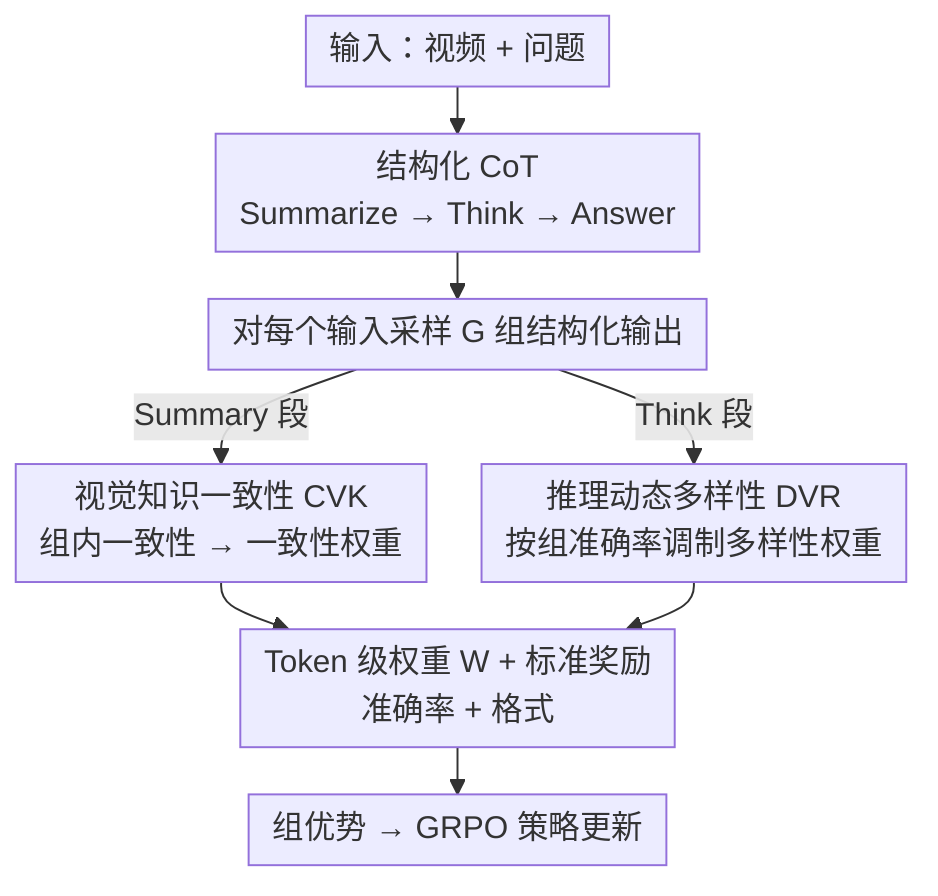

# Reinforcing Structured Chain-of-Thought for Video Understanding

**会议**: CVPR 2026  
**arXiv**: [2603.25942](https://arxiv.org/abs/2603.25942)  
**代码**: 无  
**领域**: 视频理解 / 视频推理  
**关键词**: 视频QA, 强化学习, 结构化CoT, GRPO, 时序推理

## 一句话总结

提出 SDRL（Summary-Driven Reinforcement Learning），一种无需 SFT 的单阶段 RL 框架，通过结构化 CoT（Summarize→Think→Answer）和两个自监督机制（CVK 和 DVR）增强视频时序推理，在 7 个 VideoQA 基准上达到 SOTA。

## 研究背景与动机

多模态大语言模型（MLLMs）在视频理解中展现了潜力，但仍面临两个核心挑战：

**思维漂移（Thinking Drift）**：现有 RL 方法（如 GRPO）仅依赖最终答案的奖励信号来优化，中间推理步骤不受约束。这导致模型生成冗长或与视觉证据无关的推理内容，严重影响结果稳定性。

**时序理解薄弱**：MLLMs 通常将视频表示为堆叠或平均的帧嵌入，忽略了细粒度时序依赖关系，导致在时序敏感的 VideoQA 任务上表现较差。

现有解决方案的局限：
- **纯 RL 方法**：推理不受约束，不稳定
- **SFT+RL 方法**：需要昂贵的 CoT 标注，多阶段训练复杂，且 SFT 的逐 token 模仿会限制泛化能力，可能导致过拟合

SDRL 的核心创新在于**将结构化 CoT 直接集成到 RL 目标中**，通过自监督方式约束推理过程，无需额外的 SFT 阶段或 CoT 标注数据。

## 方法详解

### 整体框架

SDRL 采用 Qwen2.5-VL-7B 作为骨干，输入（视频, 问题）后要求模型生成结构化输出：
- **Summary 段**（`
`）：提取关键动作及其时序顺序
- **Think 段**（`<think>`）：基于摘要进行逻辑推理
- **Answer 段**：给出最终答案

对每个输入采样 G 组输出，通过 token 级权重（CVK+DVR）和标准奖励（准确率+格式）计算组优势值来优化策略。整条 pipeline 的关键是：结构化 CoT 立框架，CVK 分支约束 Summary 段忠于视频、DVR 分支让 Think 段该探索时才探索，两路权重再与标准奖励汇合成组优势。

### 关键设计

**1. 结构化 CoT（Summarize → Think → Answer）**

实证发现：预测正确的 CoT 与 ground-truth CoT 在 BLEU 和 sBERT 相似度上都更高，而有效 CoT 的共性是抓住两点——(1) 关键动作/事件、(2) 事件的时序顺序。于是强制模型先写 `
` 把这两点提炼出来，作为后续 `<think>` 的事实锚点。这个 Summary 锚点是"自上而下推理"的地基，从根上压制思维漂移（think 段不会脱离视频凭空编）。

**2. 视觉知识一致性（CVK）：约束 Summary 段忠于视频**

核心假设：视频内容是固定事实，因此对同一输入多次采样得到的摘要**应当语义高度一致**。CVK 不直接监督摘要文字，而是通过组内一致性间接逼它忠实：
- **GT 监督模式**：有 ground-truth 摘要时，用 sBERT+BLEU 组合相似度衡量与 GT 的对齐，作为额外奖励。
- **自监督模式**：无 GT 时，从正确预测中动态导出一致性锚点 $S^C$（位置级中心），用 KL 散度衡量每个摘要 token 偏离锚点的程度，转成 Summary Token Weight $\omega_t^S$——KL 越大→越不一致→权重越小，把梯度集中到"稳定一致"的摘要部分。

**3. 推理动态多样性（DVR）：让 Think 段该探索时才探索**

在 `<think>` 段鼓励推理路径多样性，用 token 分布的熵度量：高熵 token 给更高多样性权重 $\omega_{g,t}^d$。关键是**按组准确率 $\mathcal{A}$ 动态调制**——低准确率组 $(1-\mathcal{A})$ 大、强化探索；高准确率组 $(1-\mathcal{A})$ 小、保持稳定。这样在模型已有把握时不硬塞多样性引入噪声，只在没把握时鼓励它换思路。

**4. EventFlowQA 数据集**

专注复杂动作序列和时序因果的 VideoQA 数据集，53K 高质量 QA 对（50K 训练 + 3K 验证），覆盖 15 个时序维度，作为消融的核心基准。

### 一个完整 walkthrough（"视频里此人先做了什么再做什么？"，G=8）
1. **采样**：对该（视频, 问题）采 8 组结构化输出，每组都含 `
/<think>/answer` 三段。
2. **Summary 段 + CVK**：8 组摘要里 6 组都写"先开冰箱、再倒牛奶"，2 组漂移成"先倒牛奶"。自监督锚点 $S^C$ 取多数派语义中心，漂移那 2 组的摘要 token 因 KL 大被降权 $\omega_t^S$，梯度更信任一致的 6 组。
3. **Think 段 + DVR**：本题当前组准确率偏低（$\mathcal{A}$ 小）→ $(1-\mathcal{A})$ 大 → 抬高 think 段高熵 token 的多样性权重，鼓励尝试不同推理顺序找对答案。
4. **奖励与组优势**：标准奖励（准确率+格式）结合 token 级权重 $W_{g,t}$（summary 用一致性权重、think 用多样性权重）算组优势，更新策略。
5. **收敛后**：模型学会"先写忠实摘要锁住事实、再在不确定时灵活推理"——summary 不漂移、think 不僵化。

这条链显示三块如何分工：结构化 CoT 立框架、CVK 管"摘要别乱编"、DVR 管"推理该活时才活"。

### 损失函数 / 训练策略

结构化策略目标：$\mathcal{J}_{total}(\theta) = \mathcal{J}_{grpo}^{SCoT}(\theta) - \mathcal{J}_{reg}(\theta)$

Token 级权重：
$$W_{g,t} = \begin{cases} \omega_t^S & \text{(Summary 段, 一致性权重)} \\ \omega_{g,t}^{d'} & \text{(Think 段, 动态多样性权重)} \end{cases}$$

训练配置：
- 单阶段 RL（无 SFT），32 张 A100 GPU
- GRPO 组大小 G=8，共 1000 次 RL 迭代
- 16 帧均匀采样，分辨率 128×28×28
- 超参数：$\alpha=0.7$, $\beta=0.3$, $\gamma_1=1$, $\gamma_2=1$, $\lambda=0.5$, $\lambda'=0.7$

## 实验关键数据

### 主实验

在 7 个公开 VideoQA 基准上的表现（Accuracy %）：

| 数据集 | SDRL (Ours) | Video-R1 (SFT+RL) | VideoRFT (SFT+RL) | TW-GRPO (RL) | 提升 (vs best RL) |
|--------|-------------|--------------------|--------------------|--------------|-------------------|
| NExT-GQA | 79.3 | 74.3 | 75.1 | 76.1 | +3.2 |
| MMVU | 68.6 | 64.2 | 67.3 | 65.8 | +1.3 |
| VideoMMMU | 51.3 | 52.4 | 50.6 | - | +0.7 |
| VSIBench | 32.9/36.1† | 34.6 | 35.7 | - | +0.4† |
| MVBench | 64.2 | 62.7 | 61.4 | 63.3 | +0.9 |
| TempCompass | 74.4† | 72.6 | 73.1 | 73.3 | +1.1† |
| VideoMME | 54.7 | 57.4 | 58.1 | 55.1 | - |

注：† 表示在 EventFlowQA 上训练的变体（仅 Video-R1 数据量的 20%）。

### 消融实验

CVK 和 DVR 模块在 EventFlowQA 上的消融：

| 配置 | Accuracy | 说明 |
|------|----------|------|
| 原始 GRPO | 42.37 | 基线 |
| +sBERT (GT) | 43.85 | 语义一致性有帮助 |
| +BLEU (GT) | 46.32 | 词法一致性帮助更大 |
| +sBERT+BLEU (GT) | 48.56 | 组合最优 |
| +GT CVK + 静态 Entropy DVR | 50.09 | 多样性进一步提升 |
| +GT CVK + 动态 DVR (完整) | 52.22 | 动态调整最优 |
| 自监督 CVK | 54.28 | **自监督优于 GT 监督** |
| 自监督 CVK + 动态 DVR | **56.10** | 最佳配置 |

模型规模对监督方式的影响：

| 配置 | 3B 模型 | 7B 模型 |
|------|---------|---------|
| GT 监督提升 | +3.01 | +6.19 |
| 自监督提升 | +2.40 | **+11.91** |

### 关键发现

1. **自监督优于 GT 监督（7B）**：大模型从自监督一致性中获益更多（+11.91 vs +6.19），可能因为严格的 GT 对齐会抑制预训练语义先验，导致灾难性遗忘
2. **小模型更依赖 GT 指导**：3B 模型在 GT 监督下略优（+3.01 vs +2.40）
3. **Entropy 优于 KL 散度作为多样性度量**：Entropy 作为全局不确定性控制更能保持语义多样性，而 KL 散度的位置依赖对齐会抑制全局可变性
4. **动态多样性调制显著优于静态**：避免在高准确率组过度探索引入噪声
5. **仅用 20% 数据量即可达到竞争性能**：EventFlowQA 训练的 SDRL 在 TempCompass 上超越所有基线，展示了高数据效率

## 亮点与洞察

- **单阶段 RL 替代 SFT+RL 流水线**：通过结构化 CoT 和自监督约束，消除了对昂贵 CoT 标注和多阶段训练的需求，是一个优雅的简化
- **Summary 作为事实锚点**：将摘要定位在推理链的最前端，让事实提取先于逻辑推理，从根本上解决思维漂移
- **对齐与探索的平衡**：CVK 负责一致性/对齐，DVR 负责多样性/探索，两者通过 token 级权重在同一目标函数中统一
- **自监督一致性的意外发现**：大模型自监督效果反超 GT 监督，暗示过强的监督信号可能约束表达能力

## 局限与展望

1. 当前仅在 16 帧设置下实验，对于更长视频（如 64 帧或分钟级）的扩展性未知
2. Summary 段生成本身可能引入额外开销，对实时应用的影响需评估
3. EventFlowQA 数据集的构建细节在正文中较少，质量控制机制不够透明
4. 在 VideoMME 上未达到 SFT+RL 方法的最佳水平（54.7 vs 58.1），说明泛化性还有改进空间
5. 自监督一致性锚点依赖于正确预测的存在，在极低准确率场景下可能失效

## 相关工作与启发

- **GRPO/DAPO**：提供了 RL 优化的基础框架，SDRL 在此基础上引入结构化约束
- **Video-R1**：首次将 GRPO 引入视频理解，但依赖 SFT+RL 的两阶段流水线
- **GRPO-CARE**：组级一致性的思想与 CVK 相关，但未区分推理的不同段
- **Process Reward Models**：过程级监督的思路与 CVK/DVR 的 token 级权重设计有相通之处

## 评分

- 新颖性: ⭐⭐⭐⭐⭐ （结构化CoT+自监督RL的创新组合，单阶段流水线简洁有效）
- 实验充分度: ⭐⭐⭐⭐⭐ （7个基准、详尽消融、多尺度分析、可视化对比）
- 写作质量: ⭐⭐⭐⭐ （方法描述清晰但公式较多，数据集细节不足）
- 价值: ⭐⭐⭐⭐⭐ （为视频推理提供了更简洁高效的训练范式）

<!-- RELATED:START -->

## 相关论文

- [\[CVPR 2026\] APPO: Attention-guided Perception Policy Optimization for Video Reasoning](appo_attention-guided_perception_policy_optimization_for_video_reasoning.md)
- [\[CVPR 2026\] FireScope: Wildfire Risk Raster Prediction with a Chain-of-Thought Oracle](firescope_wildfire_risk_raster_prediction_with_a_chain-of-thought_oracle.md)
- [\[NeurIPS 2025\] Visual Thoughts: A Unified Perspective of Understanding Multimodal Chain-of-Thought](../../NeurIPS2025/llm_reasoning/visual_thoughts_a_unified_perspective_of_understanding_multi.md)
- [\[CVPR 2025\] VideoEspresso: A Large-Scale Chain-of-Thought Dataset for Fine-Grained Video Reasoning via Core Frame Selection](../../CVPR2025/llm_reasoning/videoespresso_a_large-scale_chain-of-thought_dataset_for_fine-grained_video_reas.md)
- [\[ACL 2026\] TemplateRL: Structured Template-Guided Reinforcement Learning for LLM Reasoning](../../ACL2026/llm_reasoning/templaterl_structured_template-guided_reinforcement_learning_for_llm_reasoning.md)

<!-- RELATED:END -->
