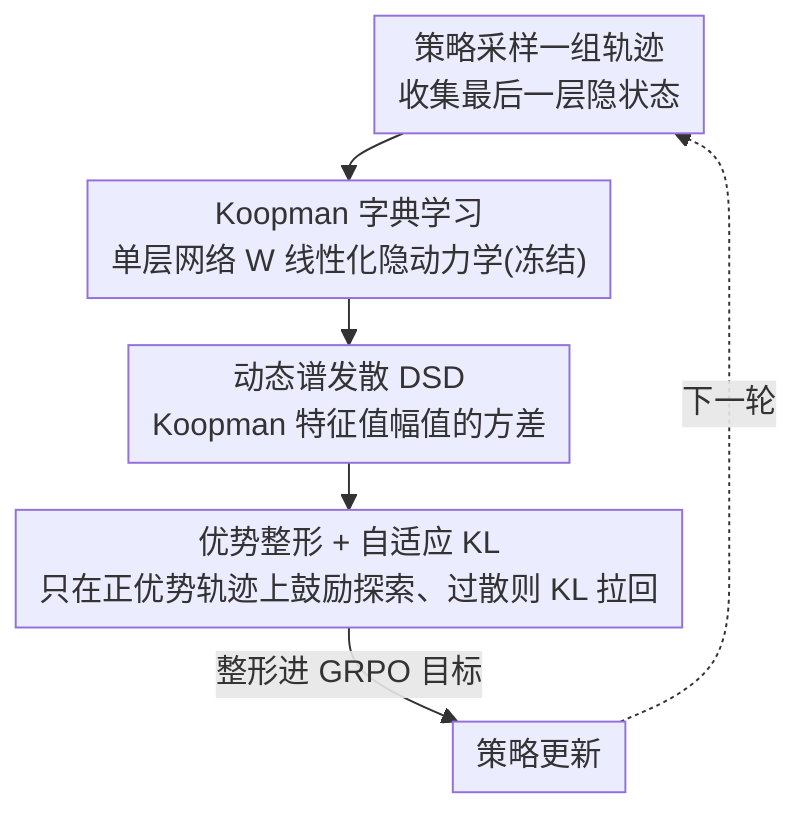

# ReLaX: Reasoning with Latent Exploration for Large Reasoning Models

**会议**: CVPR 2026  
**论文**: [CVF Open Access](https://openaccess.thecvf.com/content/CVPR2026/html/Zhang_ReLaX_Reasoning_with_Latent_Exploration_for_Large_Reasoning_Models_CVPR_2026_paper.html)  
**代码**: https://github.com/ZhangShimin1/ReLaX  
**领域**: LLM推理  
**关键词**: RLVR, 探索-利用, Koopman算子, 熵坍缩, 隐空间动力学

## 一句话总结
ReLaX 不再像现有方法那样在 token 层面强行抬高熵来对抗 RLVR 的熵坍缩，而是用 Koopman 算子把大推理模型的隐状态动力学线性化、提出"动态谱发散（DSD）"这个量化策略内部计算灵活度的指标，再把它整形进 GRPO 目标，在 7 个多模态 + 6 个纯文本推理基准上刷新同规模 SOTA。

## 研究背景与动机

**领域现状**：用可验证奖励做强化学习（RLVR，常以 GRPO 实现）是当前撬动 LLM / MLLM 复杂推理能力的主流范式——给定题目，模型采样一组推理轨迹，验证器（如数学答案是否正确、代码能否跑通）给出标量奖励，再做组内相对归一化的策略优化。

**现有痛点**：RLVR 在没有显式干预时会让策略分布迅速收窄、熵快速下降，把策略梯度困在很窄的子空间里。稀疏奖励进一步加剧这种"熵坍缩"，模型过早过度利用、探索不足，性能很快饱和。经验上 GRPO 训练里奖励 $R$ 与 token 熵 $H$ 满足 $R=-a\cdot\exp(H)+b$ 的指数关系，直接说明熵一塌奖励就上不去。

**核心矛盾**：现有补救几乎都在 **token 层面**做文章——reshape 奖励、加基于熵的正则、启发式地锚定显著 token 抬高随机性。但"维持高 token 熵"这个目标本身就和 RL 天然趋向确定性低熵策略的倾向相冲突；更麻烦的是 MLLM 的跨模态内部计算与单模态、以文本为中心的输出之间存在错位，token 层面的反馈根本无法准确反映底层的多模态处理过程。

**本文目标**：找到一个比 token 统计量更本质、且对多模态也成立的"探索"刻画，并能可微地塞进策略优化目标里去调控探索-利用权衡。

**切入角度**：作者主张熵坍缩只是表层症状，深层病灶是**生成 token 的内部计算逐渐丧失灵活性、收敛成过度刚性的模式**。这些计算体现在隐状态的高维隐动力学里，比离散敏感的 token 空间携带更丰富稳定的归纳偏置。难点是隐动力学是非线性高维的、难以分析——而 Koopman 算子理论恰好能把非线性动力学表示成无穷维可观测函数空间里的线性演化，使其变得可分析、可干预。

**核心 idea**：用 Koopman 线性化隐动力学 → 用谱的离散程度（DSD）刻画"内部计算灵活度" → 把 DSD 作为可微正则项整形进 GRPO，把探索从 token 空间搬到更富表达力的隐计算空间。

## 方法详解

### 整体框架
ReLaX 要解决的是"RLVR 让模型内部计算变僵、探索不足"的问题。它的做法是在策略优化的同时，对最后一层隐状态轨迹做 Koopman 线性化、算出一个衡量动力学丰富度的 DSD 分数，再把这个分数当作正则项加进 GRPO 目标里——DSD 高就说明计算灵活、值得鼓励，DSD 过度发散又会失稳、用自适应 KL 拉回来。整条管线是：策略采样轨迹 → 收集隐状态 → 冻结的 Koopman 字典把隐动力学线性化 → 算每条轨迹的 DSD → 用优势整形 + 自适应 KL 把 DSD 正则装进 GRPO 目标更新策略。

### 关键设计

**1. Koopman 字典学习：把高维非线性隐动态变得可线性分析**

痛点是 LRM 的隐状态演化 $x_t=\mathcal{F}(x_{t-1},\omega_t)$ 是高维强非线性的（采样温度、top-p/top-k 这些随机性 $\omega_t$ 既决定解码出的 CoT、也往隐轨迹里注入扰动），直接分析无从下手。Koopman 算子 $\mathcal{K}$ 把这套非线性动力学嵌入无穷维函数空间，让可观测量 $g$ 满足线性演化 $[\mathcal{K}g](x_t)=g(x_{t+1})$；但传统 DMD 离散化会引入虚假特征值、丢掉关键模态。作者采用 ResKoopNet（ResDMD 的神经扩展）学一个神经 Koopman 字典：可观测量由单层线性变换加 sigmoid 参数化 $g(x)=\sigma(Wx)$，$W\in\mathbb{R}^{d\times m}$ 通过最小化 Koopman 算子的谱残差 $\|(\mathcal{V}^+-\mathcal{K}\mathcal{V})\Phi\|_F^2$ 来优化。关键是 $W$ **只在初始策略上学一步就冻结**，保证整个策略训练过程中刻画隐动力学用的是同一个函数空间、DSD 才有可比性，也几乎不增加训练开销。

**2. 动态谱发散 DSD：用谱方差量化策略的"计算灵活度"**

这是全文最核心的指标。直觉是：Koopman 算子的谱分解揭示了增长 / 衰减 / 振荡这些基本动力学模态，谱越集中说明行为退化重复、谱越发散说明系统越丰富有表达力。于是把 DSD 定义为 Koopman 特征值幅值的方差：$\mathrm{DSD}(x)=\operatorname{Var}(|\Lambda|)$，其中 $\mathcal{K}\Phi=\Phi\Lambda$。DSD 越高代表内部动力学谱越丰富、模型没有坍缩成刚性计算模式，随机扰动才能被有效转化成多样的隐轨迹、支撑持续高效的探索。相比 token 熵只看输出表层统计，DSD 直接探的是模型内部计算过程，因此对跨模态错位的 MLLM 也更可靠——这正是作者说它"比 token 统计更本质"的含义。

**3. 优势整形 + 自适应 KL：把 DSD 正则稳稳装进 GRPO**

光有指标还不够，得让它能反传又不失控。先定义一个序列级正则 $\mathcal{L}_{\text{xp}}=\log\!\big(\frac{1}{R}\sum_i\exp(-\mathrm{DSD}(x^i))\big)$，用 log-mean-exp 平滑 DSD、稳定梯度。但无脑鼓励探索会损害必要的利用，ReLaX 加两道闸：其一是**优势整形**，用截断到正部的优势给 DSD 加权 $\tilde{\mathcal{L}}_{\text{xp}}=\log\!\big(\frac{1}{R}\sum_i\exp(-\mathrm{clip}(\hat A^i,0)\cdot\mathrm{DSD}(x^i))\big)$，只让产生正奖励的轨迹去变灵活，避免无用甚至有害的探索；其二是**自适应 KL**，只对 DSD 超过阈值 $\xi$ 的"过度发散"轨迹施加 KL 惩罚 $\beta\sum_{i\in\mathcal{I}}D_{\mathrm{KL}}(\pi_\theta\|\pi_{\mathrm{ref}})$，让仍有探索潜力的轨迹自由前进。最终目标是 $\mathcal{J}(\theta)=\mathcal{J}_{\mathrm{GRPO}}(\theta)+\alpha\tilde{\mathcal{L}}_{\text{xp}}+\beta\sum_{i}^{\mathcal{I}}D_{\mathrm{KL}}$，$\alpha$ 控探索强度、$\mathcal{I}=\{i\mid\mathrm{DSD}(x^i)>\xi\}$ 是需要被 KL 约束的子集。

### 损失函数 / 训练策略
基座为 GRPO 框架，VLM 用 Qwen2.5-VL-Instruct、LLM 用 Qwen2.5-Base/Math，基于 VeRL 实现。Koopman 字典 $W$ 在初始策略上学一步即冻结。消融显示 DSD 正则系数 $\alpha=0.1$ 时奖励最高；$\alpha=0.3$ 仅比 GRPO 略好，$\alpha=1.0$ 过强反而掉点（⚠️ Koopman 维度 $m$、DSD 阈值 $\xi$ 的更多结果在补充材料，以原文为准）。

## 实验关键数据

### 主实验
多模态：以 Qwen2.5-VL-Instruct 为基座，7 个多模态推理基准（MathVista / MathVerse / MathVision / DynaMath / MMMU / MMStar / EMMA）平均 mean@1。

| 模型 | 7 个多模态基准平均 | 说明 |
|------|------|------|
| Qwen2.5-VL-7B（基座） | 47.9 | 基线 |
| VL-Rethinker-7B | 52.5 | 此前 7B 最好 |
| SRPO-7B | — | 强基线（部分列缺失） |
| **ReLaX-VL-7B（本文）** | **53.2** | 同规模新 SOTA，超 VL-Rethinker 0.7 |
| ReLaX-VL-3B（本文） | 48.1 | 3B 即超多个 7B 模型（R1-VL 40.9 / OpenVLThinker 45.3） |

相对基座，ReLaX-VL-3B/7B 平均 mean@1 绝对提升 8.3 / 5.3，训练动态上相对增益约 10%。

纯文本数学（6 个基准平均，AMC/AIME 用 mean@32）：

| 模型 | 平均 | 关键对比 |
|------|------|----------|
| Qwen2.5-7B-Base + SimpleRL(GRPO) | 34.8 | 香草 GRPO |
| + FR3E（此前公开 SOTA） | 39.2 | token 层面强基线 |
| **+ ReLaX（本文）** | **43.5** | 超 FR3E **4.3** |
| Qwen2.5-3B-Base + Vanilla GRPO | 26.0 | — |
| **+ ReLaX（本文）** | **31.6** | +5.6 |

在 Qwen2.5-7B-Math 上 ReLaX 超 FR3E 6.3（⚠️ 具体平均值以原文表 2 为准）。

### 消融实验
| 配置 | 现象 | 说明 |
|------|------|------|
| DSD 系数 $\alpha=0.1$ | 奖励最高 | 最佳工作点 |
| $\alpha=0.3$ | 仅略优于 GRPO | 鼓励过头收益递减 |
| $\alpha=1.0$ | 反而掉点 | 过度探索损害利用 |
| 仅香草 GRPO | 前 50 步熵与 DSD 双双骤降 | 迅速坍缩成刚性模式、性能停滞 |
| ReLaX 完整 | 熵稳定在更高但受控水平 | DSD 维持丰富、策略持续提升 |

### 关键发现
- **DSD 与 token 熵在香草 GRPO 下同步骤降**，印证"熵坍缩只是表层、内部计算变僵才是病灶"的核心论断；ReLaX 把两者都稳在更高水平。
- 探索强度存在明确甜区（$\alpha=0.1$），更高熵 ≠ 更好收敛——优势整形 + 自适应 KL 这两道闸正是为了不让探索压垮利用。
- 增益在 MLLM 上尤其显著（此前工作大多忽略了多模态的探索-利用），说明把探索搬到隐空间对跨模态错位特别有用。

## 亮点与洞察
- **把"探索"从 token 空间搬进隐计算空间**：DSD 直接量化模型内部动力学的谱丰富度，绕开了"硬抬 token 熵和 RL 趋确定性相冲突"的死结，这个视角迁移到任何 RLVR 训练都可能受用。
- **Koopman 字典只学一步就冻结**：既保证了不同训练阶段 DSD 可比，又把把"线性化高维非线性动力学"的开销压到几乎为零，工程上很聪明。
- **优势整形 + 自适应 KL 的双闸设计**：只在正优势轨迹上鼓励探索、只对过度发散的轨迹施加 KL，是一种"有的放矢"的探索调控范式，可复用到其它需要平衡探索-利用的 RL 场景。

## 局限与展望
- DSD 依赖 Koopman 谱估计，特征值方差对字典维度 $m$、阈值 $\xi$ 的敏感性论文把更多结果放进了补充材料，正文未充分展开，实际部署的鲁棒性需要进一步验证。
- 字典在初始策略上学一步即冻结，若策略在训练中漂移很大，固定函数空间是否仍能忠实刻画后期隐动力学是个潜在假设风险。
- 评测集中在数学 / 多学科推理基准，对开放式生成、长链工具调用等任务上 DSD 是否仍是好的探索代理尚未验证。

## 相关工作与启发
- **vs token 层面方法（KL-Cov / FR3E / DAPO 等）**：它们在 token 空间 reshape 奖励、加熵正则或锚定显著 token；ReLaX 认为这与 RL 趋确定性本质冲突、对 MLLM 还有跨模态错位，转而在隐空间用 DSD 调控，纯文本超 FR3E 4.3、多模态刷新 SOTA。
- **vs 香草 GRPO**：GRPO 没有显式探索干预，前 50 步就熵 / DSD 双坍缩；ReLaX 在 GRPO 目标上叠加 DSD 正则 + 自适应 KL，把熵稳在更高受控水平。
- **vs 用 Koopman 分析 LLM 隐态的工作（如 ResDMD 类）**：以往多用于"分析"隐动力学，ReLaX 把它变成可微的"干预"信号直接驱动策略优化，是从描述到调控的一步。

## 评分
- 新颖性: ⭐⭐⭐⭐⭐ 把 Koopman 谱 + DSD 引入 RLVR 探索调控，视角确实新颖且自洽
- 实验充分度: ⭐⭐⭐⭐ 13 个基准 + 3B/7B + 多模态/纯文本覆盖广，但关键超参敏感性多放在补充材料
- 写作质量: ⭐⭐⭐⭐ 论证链清晰（症状→病灶→指标→正则），公式较密、部分细节需查补充材料
- 价值: ⭐⭐⭐⭐ 给 RLVR 探索-利用提供了一个可迁移的隐空间新范式，对 MLLM 尤其有意义

<!-- RELATED:START -->

## 相关论文

- [\[CVPR 2026\] Reasoning Palette: Modulating Reasoning via Latent Contextualization for Controllable Exploration for (V)LMs](reasoning_palette_modulating_reasoning_via_latent_contextualization_for_controll.md)
- [\[ACL 2026\] SeLaR: Selective Latent Reasoning in Large Language Models](../../ACL2026/llm_reasoning/selar_selective_latent_reasoning_in_large_language_models.md)
- [\[ACL 2026\] Large Reasoning Models Are (Not Yet) Multilingual Latent Reasoners](../../ACL2026/llm_reasoning/large_reasoning_models_are_not_yet_multilingual_latent_reasoners.md)
- [\[CVPR 2026\] Think-as-You-See: Streaming Chain-of-Thought Reasoning for Large Vision-Language Models](think-as-you-see_streaming_chain-of-thought_reasoning_for_large_vision-language_.md)
- [\[ICML 2025\] Soft Reasoning: Navigating Solution Spaces in Large Language Models through Controlled Embedding Exploration](../../ICML2025/llm_reasoning/soft_reasoning_navigating_solution_spaces_in_large_language_models_through_contr.md)

<!-- RELATED:END -->
