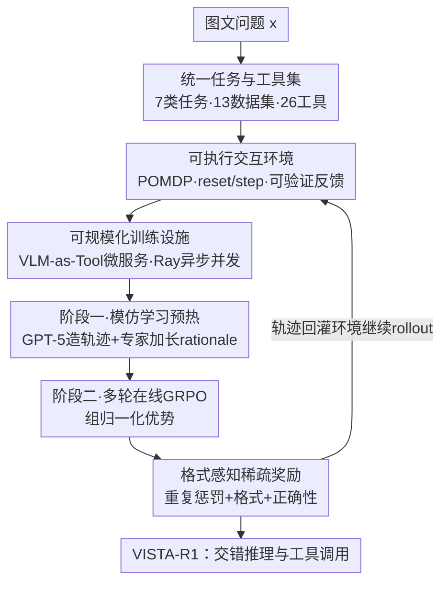

# Scaling Agentic Reinforcement Learning for Tool-Integrated Reasoning in VLMs

**会议**: CVPR 2026  
**论文**: [CVF Open Access](https://openaccess.thecvf.com/content/CVPR2026/html/Lu_Scaling_Agentic_Reinforcement_Learning_for_Tool-Integrated_Reasoning_in_VLMs_CVPR_2026_paper.html)  
**代码**: https://github.com/Lucanyc/VISTA-Gym  
**领域**: LLM推理 / 多模态VLM / Agent  
**关键词**: 工具集成推理, 视觉智能体, 强化学习, GRPO, 训练环境

## 一句话总结
本文提出可规模化的视觉工具智能体训练环境 VISTA-Gym（7 类任务、13 个数据集、26 个标准化视觉工具），并在其中用「模仿学习预热 + 多轮 GRPO 在线 RL」训练出 VISTA-R1，让 8B 级 VLM 学会在推理过程中动态选择/调用/协同视觉工具，在 11 个推理密集型 VQA 基准上比同体量 SOTA 高出 9.51%–18.72%。

## 研究背景与动机
**领域现状**：当前视觉语言模型（VLM）在图像理解上已经很强，主流做法是把文本侧的链式思维（CoT）和强化学习（RL）搬过来，用基于结果的奖励去优化纯文本推理链。但这些推理大多基于静态视觉嵌入和浅层跨模态对齐。

**现有痛点**：纯文本推理抓不住真实场景里的细粒度视觉结构、空间关系和数量依赖。为此社区提出「工具集成推理」（Tool-Integrated Reasoning, TIR），给模型配上 grounding、zoom-in、search 等外部工具——但作者的探索性实验发现一个反直觉现象：**直接给基座 VLM 挂上工具，准确率反而大幅下降**（工具变成了干扰项而非帮手）。对 GPT-5 和 InternVL3-8B 的 500 个出错样本做归因，错误集中在工具调用的 if/when/which/how：调用结构违规（E1）、参数名/值非法或错误（E2–E4）、工具输出格式错（E5），以及工具执行后的错误推理（E6，InternVL3-8B 占 64.8%）。

**核心矛盾**：会不会用工具 ≠ 有工具就会推理。模型缺的不是工具本身，而是「在多轮交互中何时调、调哪个、怎么传参、拿到反馈后怎么接着推」的策略，而这种策略只能在**可执行、有可验证反馈的环境**里通过 RL 学到。

**本文目标**：（1）造一个能规模化、覆盖广任务广工具、带可验证反馈和高效轨迹采集的统一训练环境；（2）在其中设计训练范式，让开源小模型学会把推理和工具调用交错编排。

**切入角度**：把 TIR 形式化成部分可观测马尔可夫决策过程（POMDP），用 ReAct 式「先想后做」的轨迹结构，再用智能体 RL 在环境里端到端优化。

**核心 idea**：用「可规模化的视觉工具训练环境（VISTA-Gym）+ 两阶段智能体 RL（BC 预热 → 多轮 GRPO）」把 thinking-with-image 的工具协同能力真正训练出来，而不是寄希望于 prompt。

## 方法详解

### 整体框架
方法分两大块：基础设施 **VISTA-Gym**（提供任务、工具、可执行交互环、可扩展训练设施）和在其上训练的智能体 **VISTA-R1**（两阶段训练框架）。给定一个图文问题 $x$，智能体在每一轮先输出推理段 `<think>`，再输出工具调用 `<tool_call>`；环境执行工具、把结构化反馈 $o_t$ 追加回上下文，智能体据此继续推理，直到最后一轮以 `<answer>` 终止。整条轨迹是交错的「想—做—观察」序列 $\tau = (g_0, a_0, o_0, \dots, g_T, \hat{y})$，训练目标就是让这条轨迹既格式合规又最终答对。

### 关键设计

**1. VISTA-Gym：统一任务 + 标准化工具接口的可验证训练环境**

针对「现有 TIR 工作各自局限于单工具、窄任务、纯文本环境」的痛点，VISTA-Gym 把 13 个公开基准整理成 7 类推理密集型 VQA 任务（图表理解、几何推理、地理空间推理、科学推理、文档理解、空间/组合推理、其他），并把 26 个视觉工具组织成四大族——感知类（GroundingDINO、SAM、EasyOCR）、图表理解类（ChartMoE）、图示形式化类（CDL、Inter-GPS）、数学求解类（G-LLaVA、MultiMath）。环境用 Gymnasium 风格的 `reset()`/`step()` 接口暴露：`reset` 返回初始观测 $o_0$（问题文本+图像）并初始化交互历史；动作空间 $\mathcal{A}$ 是一个带类型的元组（工具唯一标识 + 参数）；观测空间 $\mathcal{O}$ 回传工具执行的成功结果或运行时错误信息。关键在于**每条工具调用序列都可验证**——不仅看最终答案，还看可审计的工具调用链是否落地，这正是 RL 需要的「可验证反馈信号」。这种统一性让一个智能体能在跨任务、跨工具的分布上训练，从而获得泛化能力，而非过拟合到某个单一工具。

**2. 可规模化训练设施：把重型 VLM 工具变成常驻微服务，支撑高并发 RL rollout**

RL 训练要海量采样轨迹，而 G-LLaVA、ChartMoE 这类计算密集的 VLM 工具如果每次调用都重新加载模型，延迟高到无法训练。作者把每个 VLM 工具封装成独立 HTTP 微服务，三层架构：(i) FastAPI 前端暴露 RESTful 端点、支持异步批处理请求；(ii) 中间 Tool 层解析动作、从轨迹元数据取图、格式化观测；(iii) Ray Actor 层让模型权重初始化后**常驻 GPU 显存**，消除高频工具调用下反复加载的致命延迟。训练侧用 Ray 编排并发：策略生成到 `</tool_call>` 哨兵 token 时解码暂停，框架组装带轨迹 ID 和图像路径的批量 HTTP 请求，Ray 管理请求队列和负载均衡；重型 VLM 工具钉在专用 GPU、轻量工具复用共享 CPU。再加上通用 `BaseTool` 接口实现工具即插即用、`/health` 与 `/metrics` 端点 + Ray 自动故障恢复，整套设施才让「大规模视觉智能体 RL」在工程上可行。

**3. 两阶段训练：模仿学习预热打底，多轮在线 GRPO 拔高**

直接对基座做 RL 会因为它根本不会发工具调用而冷启动失败。**阶段一（BC 预热）**：先用专有模型 GPT-5 生成会调用工具的轨迹，只保留最终答案与标注完全匹配的（基于结果过滤）；再用开源专家 Qwen3-VL-235B-A22B-Thinking 把简短 rationale 替换成加长的推理轨迹（rationale 加密化），得到交错 thought–action 的语料 $\mathcal{D}$，最大化交错 token 的似然 $\mathcal{L}_{\text{BC}}(\theta) = \mathbb{E}_{(x,\tau)\sim\mathcal{D}}[\log \pi_\theta(\tau|x)]$，给工具语法和选择装上一个稳健先验。**阶段二（在线 RL）**：在可执行环境里多轮 rollout，每步发一段推理 + 一次函数调用，环境执行后把结构化反馈拼回上下文。策略优化用 Group Relative Policy Optimization（GRPO），对 $G$ 条 rollout 做组归一化优势 $\hat{A}_{i,k} = \frac{R(\tau_i) - \text{mean}(\{R(\tau_1),\dots,R(\tau_G)\})}{\text{std}(\{R(\tau_1),\dots,R(\tau_G)\})}$，配 token 级重要性比和 clip。先 BC 再 RL 的顺序很关键——BC 解决「会不会调」，RL 解决「调得好不好」。

**4. 格式感知的稀疏奖励：用优先级化的多项奖励逼模型内化 think→tool_call→answer 协议**

如果奖励只看答案对错，模型会钻空子（重复刷 token、乱套标签）。作者设计三段式奖励，并显式定优先级。最高优先级是**重复惩罚** $R_{\text{rep}}(U) \in \{-3.0, -2.0, -1.5, 0\}$，扫描连续的 token/短语/字符重复，按严重程度（极端/严重/中等/无）给负奖励，这一项压制后续所有逻辑。仅当无重复（$R_{\text{rep}}=0$）才计**格式奖励** $R_{\text{format}}(U) = (\mathbb{I}\{\text{所有轮次格式合规}\} - 0.5)\times 2$，校验标签正确、顺序对、无嵌套闭合。**正确性奖励** $R_{\text{correct}}(U) = \mathbb{I}\{\hat{y}=y\}$ 只对无重复且格式良好的输出从 `<answer>` 抽取预测做规则匹配。最终 rollout 奖励 $R(U) = R_{\text{rep}}(U) + R_{\text{format}}(U) + R_{\text{correct}}(U)$。这种「稀疏 + 格式感知 + 优先级」设计只把正奖励发给「无重复、结构合法、答案正确」的生成，逼策略内化协议本身而不是利用中间启发式漏洞。

### 损失函数 / 训练策略
- BC 目标：最大化交错 thought–action token 的对数似然 $\mathcal{L}_{\text{BC}}$。
- RL 目标：GRPO 损失 $\mathcal{L}_{\text{GRPO}}$，组归一化优势 + token 级重要性比 + clip。
- 多轮交互协议：前 $T$ 轮为 `<think>...</think><tool_call>...</tool_call>`，最后一轮 $u_T$ 为 `<think>...</think><answer>...</answer>`。
- 实现：四个不同体量基座（InternVL3-2B/8B/14B、Qwen2.5-VL-7B），用 Verl-Tool 训练，8× NVIDIA H200（141GB）；主指标为准确率（ACC）。

## 实验关键数据

### 主实验
评测 5 个分布内（ChartQA、Geometry3K、GeoQA、UniGeo、MapQA）+ 6 个分布外（TABMWP、AI2D、PlotQA、CLEVR-Math、IconQA、MathVista）共 11 个基准。下表为代表性结果（acc%，All avg. 为全 11 基准平均）：

| 模型 | 体量 | 分布内 avg. | 分布外 avg. | 全部 avg. |
|------|------|------------|------------|----------|
| GPT-5（商用，参考） | — | 76.39 | 75.38 | 75.84 |
| Claude-4.5-Sonnet（商用，参考） | — | 81.98 | 76.07 | 78.76 |
| InternVL3-2B（基座） | <7B | 28.56 | 49.28 | 39.86 |
| **VISTA-R1 (InternVL3-2B)** | <7B | **57.80** | **67.82** | **63.27** |
| Qwen2.5-VL-7B（基座） | 7–13B | 42.83 | 60.41 | 52.42 |
| VTool-R1-7B | 7–13B | 52.18 | 54.06 | 53.20 |
| R1-VL-7B | 7–13B | 57.34 | 65.20 | 61.63 |
| **VISTA-R1 (Qwen2.5-VL-7B)** | 7–13B | **65.19** | **67.13** | **66.25** |

要点：(i) VISTA-R1-8B 比同体量基线带工具高 9.51%–18.72%，不带工具也高 2.03%–11.24%；(ii) 仅给工具不给推理监督会掉点，RL 是解锁工具能力的关键；(iii) 参数效率强——VISTA-R1-2B 能打平甚至超过 8B 基线，VISTA-R1-8B 接近 38B 量级基线。

### 消融实验
以 VISTA-R1 (Qwen2.5-VL-7B) 全 11 基准平均 acc% 为例：

| 配置 | 全部 avg. | 说明 |
|------|----------|------|
| VISTA-R1（完整） | 66.25 | 工具 + 两阶段 RL |
| w/o Tools | 57.58 | 训练与推理都去掉工具访问，掉 ~8.7 |
| w/o Reasoning | 55.65 | 移除 RL 训练阶段，掉 ~10.6 |
| Qwen2.5-VL-7B（基座） | 52.42 | 完全不训练 |

InternVL3-2B 版本同样呈现：完整 63.27 → w/o Tools 51.45 → w/o Reasoning 43.28 → 基座 39.86。

### 关键发现
- **「会用工具」靠 RL 而非挂工具**：直接挂工具会把基座准确率拉低（500 错误样本里 E1–E6 暴露调用/参数/后续推理全链路缺陷）；只有经过环境内 RL 才把工具变成助力。去掉 RL（w/o Reasoning）比去掉工具（w/o Tools）掉得更多，说明推理监督是更关键的一环。
- **强泛化**：在 6 个未训练的分布外基准上，VISTA-R1-8B 的准确率可比肩 GPT-o3、Claude-4.5-Sonnet 这类大得多的商用模型。
- **参数效率**：小模型在统一环境里学会工具协同后，能以小博大，验证了「环境 + 训练范式」比「单纯堆参数」更能解锁工具集成推理。

## 亮点与洞察
- **「直接挂工具反而掉点」这一反直觉观察 + 500 样本错误归因**，把问题从「缺工具」精准定位到「缺工具调用策略」，是全文动机最有说服力的地方。
- **把重型 VLM 工具做成常驻 GPU 的 Ray 微服务**，是让大规模视觉智能体 RL 在工程上跑得动的关键 trick，可直接迁移到任何「工具是大模型」的智能体 RL 训练。
- **优先级化的格式感知奖励**（重复惩罚 > 格式 > 正确性）很务实：它先堵住 reward hacking（刷重复 token），再谈格式和正确，这套奖励工程可复用到任何带结构化协议的多轮 agent 训练。
- **BC 预热 + GRPO 两阶段**清晰拆解了「会调」与「调得好」，避免对基座直接 RL 的冷启动失败。

## 局限与展望
- 工具集虽达 26 个，但仍是预定义闭集；面对开放域真实任务时工具覆盖与路由仍可能受限，环境的「可扩展工具接口」尚需更多实证。
- BC 阶段依赖 GPT-5 造轨迹 + Qwen3-VL-235B 加长 rationale，对专有/超大模型有蒸馏依赖，复现成本与数据质量受这些教师上限约束。⚠️ 教师模型名称以原文为准。
- 主结论以 ACC 为唯一指标，对工具调用效率（调用次数/延迟）、轨迹可读性等没有系统量化；跨任务难度不同，分布内外平均值不宜直接横比大小。
- 训练用 8× H200，规模化训练设施本身门槛较高。

## 相关工作与启发
- **vs 单工具 TIR 方法（MMSearch-R1 / 各类 zoom-in 工作）**: 它们多绑定单一专用工具、局限窄任务；本文用统一环境覆盖 7 类任务 + 26 工具，换来跨任务泛化，优势是广度与可验证反馈，代价是环境工程复杂。
- **vs 通用 Agent RL 框架（GEM / AgentGym-RL / RAGEN 等）**: 这些大多是纯文本环境，缺多模态 grounding；VISTA-Gym 专为视觉工具集成 RL 设计，填补了「只有 VLM-Gym、VAGEN 两个 VLM 环境且分别聚焦视觉游戏/具身」的空白。
- **vs 工具/推理集成 VLM（VTool-R1 / R1-VL / Perception-R1）**: 同体量下 VISTA-R1 (Qwen2.5-VL-7B) 全基准平均 66.25，明显高于 VTool-R1-7B(53.20) / R1-VL-7B(61.63)，差距来自统一环境 + 两阶段训练 + 格式感知奖励的组合。

## 评分
- 新颖性: ⭐⭐⭐⭐ 「环境 + 两阶段 RL」组合扎实，单点（GRPO、ReAct 结构）多为已有技术的系统集成。
- 实验充分度: ⭐⭐⭐⭐⭐ 4 个基座 × 11 基准 + 充分消融 + 错误归因，证据链完整。
- 写作质量: ⭐⭐⭐⭐ 动机—诊断—方法—验证逻辑清晰，部分工程细节集中在附录。
- 价值: ⭐⭐⭐⭐⭐ 开源环境 + 训练范式对推进 VLM 工具集成推理有直接基础设施价值。

<!-- RELATED:START -->

## 相关论文

- [\[ICLR 2026\] THOR: Tool-Integrated Hierarchical Optimization via RL for Mathematical Reasoning](../../ICLR2026/llm_reasoning/thor_tool-integrated_hierarchical_optimization_via_rl_for_mathematical_reasoning.md)
- [\[ICML 2026\] MOSAIC: Learning When to Act or Refuse — Guarding Agentic Reasoning Models for Safe Multi-step Tool Use](../../ICML2026/llm_reasoning/learning_when_to_act_or_refuse_guarding_agentic_reasoning_models_for_safe_multi-.md)
- [\[ACL 2026\] Evo-Attacker: Memory-Augmented Reinforcement Learning for Long-Horizon Tool Attacks on LLM-MAS](../../ACL2026/llm_reasoning/evo-attacker_memory-augmented_reinforcement_learning_for_long-horizon_tool_attac.md)
- [\[ACL 2026\] TemplateRL: Structured Template-Guided Reinforcement Learning for LLM Reasoning](../../ACL2026/llm_reasoning/templaterl_structured_template-guided_reinforcement_learning_for_llm_reasoning.md)
- [\[ACL 2026\] HISR: Hindsight Information Modulated Segmental Process Rewards for Multi-turn Agentic Reinforcement Learning](../../ACL2026/llm_reasoning/hisr_hindsight_information_modulated_segmental_process_rewards_for_multi-turn_ag.md)

<!-- RELATED:END -->
