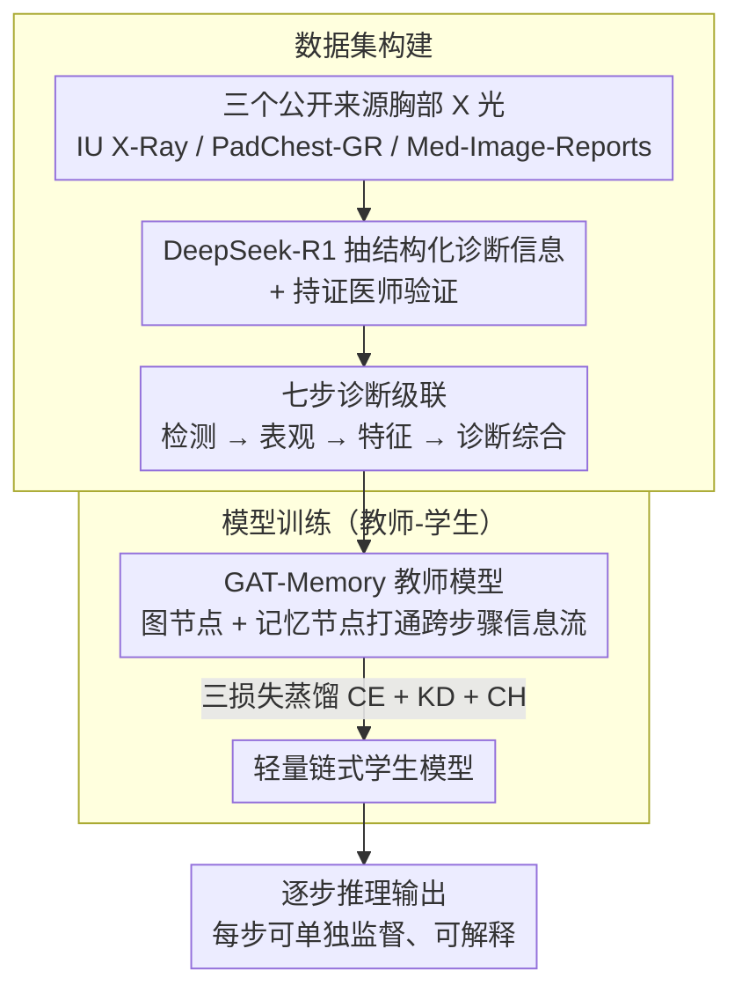

# Step-CoT: Stepwise Visual Chain-of-Thought for Medical Visual Question Answering

**会议**: CVPR 2026  
**arXiv**: [2603.13878](https://arxiv.org/abs/2603.13878)  
**代码**: [GitHub](https://github.com/hahaha111111/Step-CoT) / [HuggingFace](https://huggingface.co/datasets/fl-15o/Step-CoT)  
**领域**: Medical AI / Visual Question Answering  
**关键词**: 医学VQA, Chain-of-Thought, 逐步推理, 知识蒸馏, 胸部X光

## 一句话总结
构建首个对齐临床诊断工作流的结构化多步CoT医学推理数据集Step-CoT（10K+病例/70K QA对），并提出基于图注意力网络的教师-学生框架实现逐步推理监督，提升Med-VQA的准确性和可解释性。

## 研究背景与动机
**领域现状**：Med-VQA通过多模态深度学习回答基于医学图像的临床问题，CoT推理已应用于提升准确性和可解释性（如ReasonMed、MedCoT、HVCR）。

**现有痛点**：(i) 现有CoT数据集缺乏结构化、逐步式的诊断协议——提供的是自由格式推理链或GPT-4.1合成的推理链，与真实临床工作流不对齐，遗漏放射科医师的顺序决策中间状态；(ii) 大多CoT数据集严重依赖GPT-4.1合成推理链，存在事实不一致隐患。

**核心矛盾**：当前CoT训练范式是非交互、感知静态的——模型仅基于静态图像+问题输入，无法在推理过程中动态收集新信息或细化感知。即使LLaVA-Med、MedVLM-R1等模型展示了领域适配/RL激励推理能力，感知输入仍固定不变。

**本文目标** 能否通过可追溯的多步推理监督来同时提升Med-VQA的推理准确性和可解释性？

**切入角度**：按照临床诊断工作流将推理形式化为七步级联过程，并对整个诊断管线提供完整监督（GT答案+每步中间推理标注）。

**核心 idea**：将放射科诊断实践中的七步级联推理流程（异常检测→表观调查→特征分析→诊断综合）编码为结构化CoT数据集，并用图注意力网络+知识蒸馏实现逐步推理学习。

## 方法详解

### 整体框架

Step-CoT 要回答的是"能不能用可追溯的多步推理监督，同时把 Med-VQA 的准确性和可解释性提上去"，做法是把放射科诊断拆成固定的七步级联流程，再用教师-学生框架对整条诊断管线逐步监督。整体分两块：数据集构建——从 IU X-Ray(3749)、PadChest-GR(3230)、Med-Image-Reports(3089) 三个公开来源收 10,068 例胸部 X 光、用 DeepSeek-R1 抽结构化诊断信息并映射到七步模式、由持证医师验证；模型训练——教师模型用图注意力网络聚合跨步骤信息，再蒸馏给轻量学生模型。

### 关键设计

**1. 七步诊断级联：让 CoT 对齐放射科医师真实的顺序决策**

现有 CoT 数据集要么是自由格式、要么是 GPT 合成，跟真实临床工作流不对齐、漏掉医师顺序决策的中间状态。Step-CoT 把推理形式化成七步级联：Step 1 异常放射密度检测，Step 2-3 表观调查（病灶分布 + 影像学模式），Step 4-6 特征分析（解剖位置 + 形态学特征 + 继发效应），Step 7 诊断综合。每一步都构建在前一步结论之上、维持诊断连续性，镜像专家放射科医师"检测→表观→特征→诊断"的推理结构，因而每个中间步骤都能被单独监督和检验。

**2. GAT-Memory 教师模型：用图 + 记忆节点打通跨步骤信息流**

七步之间需要互相参照，否则又退回静态推理。教师模型把 $S$ 个步骤建成图节点集 $\{\mathbf{t}_1, \ldots, \mathbf{t}_S, \mathbf{m}\}$，其中 $\mathbf{m}$ 是全局记忆节点，用多头 GAT 更新节点状态，注意力打分为

$$e_{ij} = \text{LeakyReLU}\big(\mathbf{a}_{src}^\top(W\mathbf{h}_i) + \mathbf{a}_{dst}^\top(W\mathbf{h}_j)\big)$$

记忆节点充当全局信息聚合器，在每步预测后通过门控 GRU 把信息写回，于是后面的步骤能看到前面所有步骤的结论——这正是消融里去掉记忆模块后诊断步骤从 78.3% 掉到 65.5% 的原因。

**3. 学生模型与三损失蒸馏：把重模型压成可部署的轻链，性能只掉约 1%**

教师虽强但太重，论文蒸馏出一个只用图像特征加序列轻量头的链式学生模型，蒸馏靠三种互补损失叠加：

$$\mathcal{L}_{student}^{(s)} = \mathcal{L}_{CE}^{(s)} + \alpha_{KD}\mathcal{L}_{KD}^{(s)} + \alpha_{CH}\mathcal{L}_{CH}^{(s)}$$

分别是硬监督交叉熵、带温度 $T$ 软化的 KL 散度软 KD、以及 HSIC 启发的通道/关系对齐损失。三者一起让学生既学到标签、又学到教师的软分布和特征关系结构，最终学生仅损失约 1% 性能却大幅降低计算量。

### 损失函数 / 训练策略

教师和学生用各自独立的优化器。教师可选先用监督损失预训练数个 epoch，再进入师生联合训练：教师接收监督交叉熵更新，学生最小化上面三损失之和。

## 实验关键数据

### 主实验：诊断步骤测试结果

| 模型 | Accuracy | mAUC | Sensitivity | Specificity |
|------|----------|------|-------------|-------------|
| LLaVA-Med | 42.7 | 58.3 | 42.7 | 79.4 |
| BiomedCLIP (+Step-CoT) | 69.3(+3.8) | 55.6(+20.4) | 19.4(+2.3) | 91.8(+1.7) |
| **Ours (Teacher)** | **78.3** | **89.5** | **46.0** | **96.6** |
| **Ours (Student)** | 77.5 | 90.0 | 41.8 | 96.0 |

### 消融实验：模块贡献

| 配置 | Detection | Distribution | Location | Diagnosis |
|------|-----------|-------------|----------|-----------|
| w/o Memory | 73.7 | 69.6 | 63.2 | 65.5 |
| w/o Text | 81.5 | 76.1 | 69.3 | 72.1 |
| **Teacher (Full)** | **91.8** | **84.6** | **77.1** | **78.3** |
| Student | 91.8 | 83.4 | 76.9 | 77.5 |

记忆模块去除导致最大性能下降（诊断步骤65.5% vs 78.3%），证实跨步骤状态传播的必要性。

### 关键发现
- 所有视觉基础模型在加入Step-CoT后均获得一致提升（Accuracy +3.8~9.3%，mAUC +3.8~21.7%）
- 教师和学生模型均超越200例临床专家评估（Teacher: 78.3% vs 专家: 73.1%的Diagnosis准确率）
- 跨数据集泛化实验：在ChestX-ray8上无需fine-tuning即保持竞争力，证明逐步推理可迁移
- 注意力可视化显示推理过程中注意力从全局逐步收敛到病灶区域

## 亮点与洞察
- **临床工作流对齐**：七步级联直接镜像放射科实践（检测→表观→特征→诊断），是迄今最贴近临床的CoT设计
- **记忆机制创新**：以图注意力+GRU门控记忆实现动态跨步骤信息流，解决了静态推理的根本局限
- **知识蒸馏有效**：Student模型仅损失~1%性能但大幅降低计算复杂度，具备实际部署价值
- **超越人类专家**：在中间推理步骤（Distribution、Location）上教师模型超过临床医生

## 局限与展望
- 仅聚焦胸部X光（CXR），对其他模态（CT、MRI、病理切片）的泛化需进一步验证
- DeepSeek-R1生成的结构化标注虽经医师验证，但潜在的AI偏差可能未完全消除
- 七步推理模式是固定的，不同疾病的最优推理步数可能不同
- LVLMs（LLaVA-Med、Med-Flamingo）在benchmark上表现较差（30-40%），未探索更大规模LVLM的效果

## 相关工作与启发
- MedCoT/MedThink提供CoT但非结构化或非临床工作流对齐
- ReasonMed用多Agent生成370K推理样本但无临床工作流
- Med-GRIT-270k/V2T-CoT关注视觉定位但CoT由GPT生成
- Step-CoT是唯一同时具备结构化多步CoT、专家验证和临床工作流对齐的数据集

## 评分 ⭐
- 新颖性: ⭐⭐⭐⭐ — 七步临床工作流+GAT记忆的组合设计具有原创性
- 实验充分度: ⭐⭐⭐⭐ — 消融、跨数据集、临床专家对比、可视化四维度全面
- 写作质量: ⭐⭐⭐⭐ — 逻辑清晰，从数据→模型→实验的叙述线完整
- 价值: ⭐⭐⭐⭐ — 数据集和benchmark公开，对医学AI可解释推理有重要推动

<!-- RELATED:START -->

## 相关论文

- [\[NeurIPS 2025\] Latent Chain-of-Thought for Visual Reasoning](../../NeurIPS2025/llm_reasoning/latent_chain-of-thought_for_visual_reasoning.md)
- [\[ACL 2026\] Render-of-Thought: Rendering Textual Chain-of-Thought as Images for Visual Latent Reasoning](../../ACL2026/llm_reasoning/render-of-thought_rendering_textual_chain-of-thought_as_images_for_visual_latent.md)
- [\[ICML 2026\] Diversity Over Frequency: Rethinking Tool Use in Visual Chain-of-Thought Agents](../../ICML2026/llm_reasoning/diversity_over_frequency_rethinking_tool_use_in_visual_chain-of-thought_agents.md)
- [\[ICCV 2025\] Unsupervised Visual Chain-of-Thought Reasoning via Preference Optimization](../../ICCV2025/llm_reasoning/unsupervised_visual_chain-of-thought_reasoning_via_preference_optimization.md)
- [\[CVPR 2026\] VisRef: Visual Refocusing while Thinking Improves Test-Time Scaling in Multi-Modal Large Reasoning Models](visref_visual_refocusing_test_time_scaling.md)

<!-- RELATED:END -->
