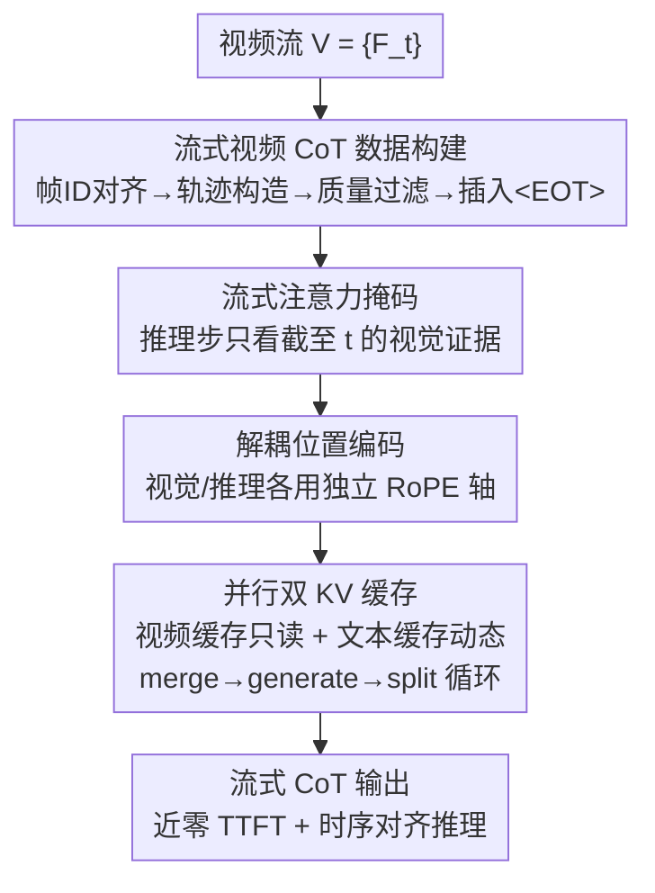

# Think-as-You-See: Streaming Chain-of-Thought Reasoning for Large Vision-Language Models

**会议**: CVPR 2026  
**论文**: [CVF Open Access](https://openaccess.thecvf.com/content/CVPR2026/html/Zhang_Think-as-You-See_Streaming_Chain-of-Thought_Reasoning_for_Large_Vision-Language_Models_CVPR_2026_paper.html)  
**代码**: 待确认（原文称已开源，未给出明确仓库地址）  
**领域**: LLM推理 / 多模态VLM  
**关键词**: 流式推理, 视频CoT, KV缓存, 时序因果, LVLM

## 一句话总结
TaYS 把大视觉语言模型（LVLM）的视频推理从「看完整段再想」的批处理范式，改造成「边看边想」的流式范式——通过流式注意力掩码、解耦位置编码和并行双 KV 缓存三件套，让推理与视频帧同步增量推进，在 VideoEspresso 上把首 token 延迟从 10.6s 压到近乎为零、推理-事件偏差降低 55%，同时推理准确率提升 2.9%。

## 研究背景与动机

**领域现状**：当前主流的 LVLM 视频推理（GPT-4o、Gemini、Qwen-VL 等）几乎都采用「批处理推理」范式——必须拿到完整视频后才开始推理，再配上 Chain-of-Thought（CoT）和关键帧引用模块来提升可解释性和准确率。

**现有痛点**：现实世界的视频本质是「流」（机器人遥操作、自动驾驶、直播监控），不是一个静态文件。批处理范式有两个硬伤：① 必须等整段视频结束才能出第一个 token，延迟随视频长度线性增长；② 视觉事件发生到模型对应推理步之间的「时间差」越拉越大，导致模型丢失早期线索，产生**时序漂移（temporal drift）**——幻觉和上下文断裂。

**核心矛盾**：人脑在看视频时是「随看随更新」的增量认知，而批处理 LVLM 是「post-hoc 后处理」。要弥合这道鸿沟，模型必须从「事后分析」转向「并发理解」。

**切入角度的死胡同**：一个朴素的实现是「交错流式（interleaved streaming）」——交替处理一段视频、生成一段推理，token 串成单一因果序列。但这种串行结构有致命缺陷：所有 token 共享同一个因果注意力空间，新视觉 token 必须等前面的推理 token 生成完才能编码，推理也必须等视觉 token 补完才能继续。这种「阻塞」机制制造了计算瓶颈，且偏离了 LVLM 预训练时「视觉编码与文本解码相互分离」的分布。

**本文目标**：把流式视频 CoT 形式化（每个时刻 $t$ 只能看到 $V_{\le t}=\{F_1,\dots,F_t\}$，严格禁止访问未来帧），并设计一套既能**流式对齐训练**、又能**真并行推理**的架构。

**核心 idea**：用「流式注意力掩码 + 解耦位置编码 + 并行双 KV 缓存」把视觉「感知」和文本「推理」在内存与计算层面解耦，让两者在严格时序因果约束下**同时**演进，从而绕开交错范式的串行阻塞。

## 方法详解

### 整体框架
TaYS 是一个监督微调（SFT）框架，目标是把面向批处理的 LVLM 适配到流式思考范式。它分两大块：**离线数据侧**先把 VideoEspresso 的批式 CoT 轨迹改造成「逐帧增量」的流式视频 CoT 训练数据；**架构侧**再用三项创新让模型在训练和推理时都满足「边看边想」的并行与因果约束。给定视频流 $V=\{F_t\}$，模型在每个到来的帧上增量更新推理状态，输出与视觉证据严格对齐的流式 CoT。形式化上，流式视频 CoT 优化的是截至时刻 $t$ 的累积概率 $\max_\theta \prod_{i=1}^{N_t} P_\theta(y_i^t \mid V_{\le t}, y_{<i}^t, C_{<t})$，而批处理 CoT 只是它「把所有推理推迟到视频结束」的退化特例。

### 关键设计

**1. 流式视频 CoT 数据构建：把批式标注改造成逐帧增量轨迹**

批式 CoT 数据假设「全视频可见」，根本不存在「随帧推进」的推理行为，直接拿来训不出流式能力。TaYS 基于 VideoEspresso 训练集（带关键帧级因果描述）重建数据，分三步：① **帧 ID 对齐**——用基于时间戳的重采样代替均匀采样，所有视频统一重采到 2 FPS，对每个目标采样时刻 $\tau'_{t'}=0.5(t'-1)$ 秒，若该时刻落在某关键帧区间 $[\tau_k^{start},\tau_k^{end}]$ 内就选关键帧 $F_k$，否则选时间最近的帧（见原文 Eq.5），从而在保持时序规整的同时保留标注时刻；② **结构化轨迹构造**——对每个对齐关键帧 $F_t$，用 GPT-4o 生成三元组 $(Q_t,R_t,A_t)$（时序定位问题、推理步、答案），强制逐帧增量推理；③ **质量控制**——用 BGE-M3 嵌入算问题与推理句的对齐分 $\text{consistency}(Q_t,R_t)=\frac{v_Q\cdot v_R}{\lVert v_Q\rVert\lVert v_R\rVert}$，丢弃语义错位或时序不一致的样本，最后插入句界 token `<EOT>` 划分最小推理单元。这套数据是后续所有训练的基础——没有「逐帧条件、只看过去」的轨迹，模型学不会流式因果。

**2. 流式注意力掩码：用滑动窗口强制时序因果**

标准批处理注意力会把所有视觉 token 全局暴露给推理 token，等于让 $t$ 时刻的推理「偷看」未来帧，破坏因果。TaYS 设计了流式注意力掩码：对长度 $N_v$ 的视觉序列和长度 $N_r$ 的推理序列，query 在 $i$、key 在 $j$ 的掩码值在满足 $i>N_v,\ j<N_v,\ j>i-N_v$ 时置 $-\infty$，否则退回标准自回归掩码 $M_{causal}$。其中 $j>i-N_v$ 这个条件相当于在视觉 token 上开了一个**相对当前推理步的滑动窗口**：每个推理 token 只能整合「当前时间窗内」的视觉信息，杜绝了未来帧的信息泄漏，保证生成的推理始终扎根于「已观测到的现实」。这是把「禁止看未来」这条流式铁律落到注意力层面的具体实现。

**3. 解耦位置编码：给视觉和推理各开一条独立位置轴**

掩码解决了「能不能看」，但位置编码还有「索引冲突」问题。现代 LVLM 普遍用 RoPE，标准单体索引下推理 token $r_t$ 的位置会被整段视觉长度 $N_v$ 偏移（相对距离变成 $(N_v+t)-s$）。在流式场景里 $N_v$ 持续膨胀，这会让相对位置不断动态漂移，扰乱模型的时序感知。TaYS 提出模态解耦索引：直接令 $\text{pos}(v_s)=s,\ \text{pos}(r_t)=t$，视觉和推理各用独立位置轴，注意力交互变成 $(R_t q_{r_t})^\top (R_s k_{v_s})=q_{r_t}^\top R_{t-s}^\top k_{v_s}$。这样相对时序距离 $(t-s)$ 不再受 $N_v$ 增长影响，语义保持稳定，推理更新与视觉观测之间的对齐不会随序列变长而崩。

**4. 并行双 KV 缓存：把感知和推理拆成两条不互相阻塞的内存通路**

交错范式用单体缓存，导致推理必须停下来等视觉编码（串行阻塞）。TaYS 的并发核心是双缓存系统：一个读多写少的**视频缓存** $C_v$ 和一个动态**文本缓存** $C_r$。每来一帧 $F_t$，视觉编码器把它非阻塞地追加进视频缓存 $C_v^{(t)}=C_v^{(t-1)}\cup\text{Enc}(F_t)$，这个更新与推理过程异步发生。解码时，注意力在「当前视频缓存 $C_v^{(t)}$ + 历史文本缓存 $C_r^{(t-1)}$」的**逻辑拼接**上计算——用指针级组合而非物理张量拼接，做到零拷贝开销；推理段 $R_t$ 生成完后只更新文本缓存 $C_r^{(t)}=C_r^{(t-1)}\cup\text{Dec}(R_t)$，视频缓存在这一步保持不变，随后 split 操作恢复模态各自的缓存视图。这就构成一个递归的 **merge → generate → split 循环**：当 $C_r$ 在做自回归生成时，新到的帧独立地被吸收进 $C_v$，推理永远不会被视觉编码卡住，从而实现真正的并行流式——感知与推理同时演进。

### 损失函数 / 训练策略
TaYS 在 Qwen2.5-VL-3B/7B-Instruct 上做监督微调，训练目标是上面流式视频 CoT 的自回归似然（在流式掩码与解耦位置编码下优化截至各时刻的累积概率）。数据来自重建后的流式 VideoEspresso 轨迹，`<EOT>` token 用于切分最小推理单元、鼓励模型生成因果有序、与帧一致的输出。

## 实验关键数据

> 指标定义：**TTFT**（Time-to-First-Token）= 从开始接收输入到吐出第一个 token 的时间；**Delay** = 完成推理与回答的总耗时；**reasoning-event deviation** = 视觉事件与其对应推理步之间的时间偏差；**win rate** = GPT-5 对各模型输出做人类对齐排名后的归一化胜率。

### 主实验
扩展版 VideoEspresso 推理准确率（总 Acc 列，越高越好）：

| 模型规模 | 方法 | Acc ↑ |
|---------|------|-------|
| Qwen2.5-VL-3B | Batch w/o thinking | 27.99 |
| Qwen2.5-VL-3B | Batch with thinking | 28.16 |
| Qwen2.5-VL-3B | Batch SFT | 29.18 |
| Qwen2.5-VL-3B | Interleaved SFT | **33.96** |
| Qwen2.5-VL-3B | TaYS | 33.45 |
| Qwen2.5-VL-7B | Batch w/o thinking | 28.89 |
| Qwen2.5-VL-7B | Batch with thinking | 31.57 |
| Qwen2.5-VL-7B | Batch SFT | 30.38 |
| Qwen2.5-VL-7B | Interleaved SFT | 34.98 |
| Qwen2.5-VL-7B | TaYS | **36.86** |

7B 上 TaYS 比最强批处理基线高出约 +2.9%，并在多数细分任务上取得最佳/次佳。值得注意的是 3B 上 Interleaved（33.96）客观准确率略高于 TaYS（33.45）——作者坦言客观指标无法完全反映推理连贯性，需配合主观评测。

主观评测（GPT-5 归一化胜率）：

| 范式 | Win Rate ↑ |
|------|-----------|
| Batch | 31.4% |
| Interleaved | 21.7% |
| **TaYS** | **43.7%** |

TaYS 在需要多步时序推理的任务上优势明显：Cooking Process 胜率 61.1%（Interleaved 仅 11.1%）、Preparation Steps 胜率 75.0%，说明它的推理与视觉证据贴合得更紧、避免了交错模型那种碎片化描述。

### 消融实验（范式递进 + 实时效率）
不同 FPS 下的延迟与准确率对比：

| 方法 | 指标 | FPS=1 | FPS=2 | FPS=3 | FPS=4 | FPS=5 |
|------|------|-------|-------|-------|-------|-------|
| Batch | TTFT↓ | 10.36 | 10.48 | 10.62 | 10.77 | 10.93 |
| Batch | Delay↓ | 12.05 | 13.90 | 12.93 | 13.08 | 13.12 |
| Interleaved | TTFT↓ | 0.0303 | 0.0295 | 0.0296 | 0.0301 | 0.0298 |
| Interleaved | Delay↓ | 12.94 | 14.19 | 16.15 | 18.03 | 20.13 |
| TaYS | TTFT↓ | 1e-6 | 9.2e-7 | 9.3e-7 | 1.06e-6 | 9.6e-7 |
| TaYS | Delay↓ | 12.06 | 12.19 | 12.32 | 12.30 | 12.31 |
| TaYS | Acc↑ | 31.74 | 33.45 | 36.01 | 35.49 | 34.06 |

### 关键发现
- **范式递进逐级增益**：Batch w/o thinking → Batch w/ thinking → Batch SFT → Interleaved → TaYS，准确率单调上升，说明「CoT 提示 → 时序对齐微调 → 流式范式」每一步都有效。
- **延迟才是 TaYS 的杀手锏**：Batch 的 TTFT 始终卡在 ~10.6s；Interleaved 虽然 TTFT 降到 ~0.03s，但 Delay 随 FPS 升高从 12.9s 累积涨到 20.1s（串行 encode-generate 依赖）；TaYS 在增量 warm-start 下解码级 TTFT 近乎 $10^{-6}$s，且 Delay 几乎不随 FPS 增长（稳定在 ~12.3s）。
- **时序对齐**：reasoning-event deviation 从批处理的 1.52s 降到 0.69s（-55%），印证流式推理把「想」和「看」对齐得更准。
- ⚠️ 横向比较需谨慎：3B 上 Interleaved 客观 Acc 略超 TaYS，但 TaYS 在主观胜率和延迟上全面领先——两类指标侧重不同，不可只看单一数字下结论。

## 亮点与洞察
- **把「禁止看未来」拆成三层落地**：掩码管「能不能看」、位置编码管「索引会不会漂」、双缓存管「会不会串行阻塞」——三件套各司其职、互补，是这篇最干净的工程贡献。
- **指针级零拷贝 merge/split** 很巧妙：用逻辑拼接代替物理张量拼接，让视频缓存只读、文本缓存动态更新，避免了每步重编码历史帧的开销，是「近零 TTFT」的真正来源。
- **解耦位置编码的洞察可迁移**：任何「两条长度不对等、且其中一条持续增长的模态序列」共享 RoPE 时都会有相对位置漂移问题，给各模态开独立位置轴这招值得复用到流式音频、流式多轮交互等场景。
- **「批处理是流式的退化特例」这个形式化视角**很提纲挈领，把两种范式统一在一个累积概率框架下。

## 局限与展望
- 作者承认客观准确率上 TaYS 并非始终最优（3B 上输给 Interleaved），主要靠主观评测和延迟取胜——说明流式范式的「准确率红利」还不稳定。
- 数据构建依赖 GPT-4o 生成三元组 + BGE-M3 过滤，轨迹质量受教师模型上限制约；且只在 VideoEspresso 一个 benchmark 上验证，跨域泛化（自动驾驶、监控等真实流场景）未充分检验。
- 滑动窗口掩码的窗口大小、`<EOT>` 切分粒度等超参对长视频的影响未深入分析；流式因果约束下「需要回看很早证据」的长程依赖任务可能受限。
- 改进方向：把流式范式扩展到在线强化学习/偏好优化，让模型在流式交互中自适应调整推理深度，而非固定 SFT。

## 相关工作与启发
- **vs 批处理 CoT（See-Then-Think）**：批处理必须看完整段才推理，延迟随视频长度线性增长、易时序漂移；TaYS 边看边想，TTFT 近零、时序偏差降 55%。
- **vs 交错流式（Interleaved / Naive Streaming）**：交错虽是「边看边想」，但单体缓存导致感知与推理串行阻塞、Delay 随 FPS 累积；TaYS 用双缓存把两者解耦并行，Delay 几乎不随帧率增长。
- **vs 记忆/时序压缩类流式理解**：那类方法靠聚合或压缩历史特征省算力，但会牺牲细粒度时序对齐与增量可解释性；TaYS 不压缩时序结构，而是用因果掩码 + 解耦位置 + 并行缓存显式同步推理与逐帧更新。

## 评分
- 新颖性: ⭐⭐⭐⭐ 「流式 CoT 推理范式 + 三件套架构」组合新颖，但单项技术（RoPE 解耦、KV 缓存管理、因果掩码）都有先例。
- 实验充分度: ⭐⭐⭐ 客观/主观/延迟三维度都测了，但只在单一 benchmark、单一模型家族上验证，跨域泛化偏弱。
- 写作质量: ⭐⭐⭐⭐ 形式化清晰（批处理=流式退化特例），三件套动机和机制讲得明白。
- 价值: ⭐⭐⭐⭐ 面向实时多模态（机器人、自动驾驶、直播）有明确落地价值，近零 TTFT 是实打实的工程红利。

<!-- RELATED:START -->

## 相关论文

- [\[CVPR 2026\] Improving Vision-language Models with Perception-centric Process Reward Models](improving_vision-language_models_with_perception-centric_process_reward_models.md)
- [\[CVPR 2026\] Revisiting the Necessity of Lengthy Chain-of-Thought in Vision-centric Reasoning Generalization](revisiting_the_necessity_of_lengthy_chain-of-thought_in_vision-centric_reasoning.md)
- [\[ICLR 2026\] Vision-R1: Incentivizing Reasoning Capability in Multimodal Large Language Models](../../ICLR2026/llm_reasoning/vision-r1_incentivizing_reasoning_capability_in_multimodal_large_language_models.md)
- [\[ICLR 2026\] AIMCoT: Active Information-driven Multimodal Chain-of-Thought for Vision-Language Reasoning](../../ICLR2026/llm_reasoning/aimcot_active_information-driven_multimodal_chain-of-thought_for_vision-language.md)
- [\[ACL 2025\] Improve Vision Language Model Chain-of-thought Reasoning](../../ACL2025/llm_reasoning/improve_vlm_cot_reasoning.md)

<!-- RELATED:END -->
