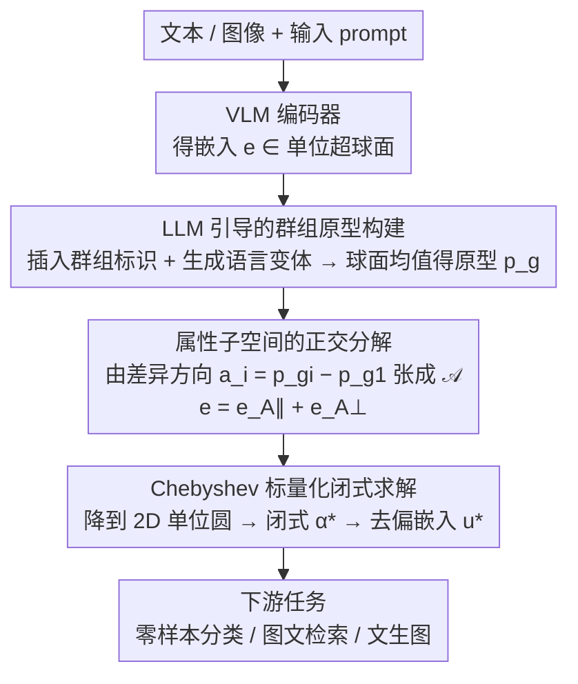

# A Closed-Form Solution for Debiasing Vision-Language Models with Utility Guarantees Across Modalities and Tasks

**会议**: CVPR 2026  
**arXiv**: [2603.12998](https://arxiv.org/abs/2603.12998)  
**代码**: [有](https://github.com/Supltz/Debias_VLM)  
**领域**: 多模态VLM  
**关键词**: VLM去偏, 闭式解, Pareto最优公平性, 免训练免标注, 跨模态嵌入空间

## 一句话总结

提出VLM去偏的闭式解方法，通过在跨模态嵌入空间中对属性子空间做正交分解并利用Chebyshev标量化求解，实现Pareto最优公平性与有界效用损失，免训练、免标注，统一覆盖零样本分类、文本-图像检索和文本-图像生成三大下游任务。

## 研究背景与动机

**领域现状**: VLM（如CLIP）通过在海量网络图像-文本对上做对比学习，实现了出色的跨模态理解能力，广泛应用于零样本分类、图文检索、图像生成等任务。然而研究表明VLM会从训练数据中继承社会偏见——例如CLIP的文本嵌入中"nurse"与"female"异常接近，"doctor"与"male"异常接近，反映了网络语料中的性别刻板印象。这些偏见会通过嵌入传播到所有下游应用。

**现有痛点**: 已有去偏方法存在多方面不足：(a) 很多方法（DeAR、FairerCLIP、PromptArray）需要训练额外的去偏网络，增加计算和模型复杂度；(b) 部分方法（SFID、CLIP-clip）需要敏感属性标注数据，但此类数据因隐私和伦理问题难以大规模获取；(c) 大多数方法只处理单一下游任务（如PRISM/RoboShot只做分类，SANER只做检索和生成）；(d) 只去偏文本模态而忽略图像模态的方法（Orth-Proj、Orth-Cali、SANER）效果受限，因为偏见在对比学习中被编码到两种模态。

**核心矛盾**: 去偏与效用保持之间存在根本性的trade-off。去偏会不可避免地丢失部分语义信息，导致下游任务性能下降。现有方法要么不显式处理效用保持（BiasedPrompt），要么通过重构损失间接保持（DeAR、SANER），但重构嵌入不等于保持跨模态对齐。没有任何方法提供效用损失的理论上界。此外，现有方法仅关注群组公平性（group fairness），忽视了交叉公平性（intersectional fairness，如性别×年龄的组合）。

**本文目标**: 提出一种统一的VLM去偏框架，同时满足五个要求：免训练、免标注数据、双模态联合去偏、覆盖多种下游任务、提供效用损失的理论保证。并且首次将交叉公平性纳入VLM去偏的系统评估。

**切入角度**: 观察到VLM的嵌入空间是单位超球面 $\mathbb{S}^{d-1}$，任何嵌入都可以通过正交分解定理分解为属性相关分量和中性内容分量。与之前方法（PRISM-mini、Orth-Proj）投影到群组原型张成的子空间 $\mathcal{S}$ 不同——$\mathcal{S}$ 中包含语义信息（如"doctor"）会被一并删除——本文只投影到属性差异方向张成的子空间 $\mathcal{A}$，精准去除偏见同时保留语义。

**核心 idea**: 在跨模态嵌入空间中，通过属性子空间的正交分解将去偏问题降维到二维单位圆，再用Chebyshev极小极大方法推导出闭式最优解，同时实现Pareto最优公平性和有界效用损失。

## 方法详解

### 整体框架

这篇论文要解决 VLM 去偏里一个老大难：去偏总会顺手删掉语义、损伤下游效用，而且没人能给出效用损失的理论上界。它的破局观察是——VLM 嵌入都落在单位超球面 $\mathbb{S}^{d-1}$ 上，任何嵌入都能用正交分解拆成"属性相关分量"和"中性内容分量"，于是去偏只要精准切掉前者、保住后者即可。整条推理时链路是：文本/图像经 VLM 编码器得到嵌入 $\vec{e} \in \mathbb{S}^{d-1}$ → 用 LLM 引导构建各群组原型 $\vec{p}_g$ → 由 $\vec{a}_i = \vec{p}_{g_i} - \vec{p}_{g_1}$ 张成属性子空间 $\mathcal{A}$ → 正交分解 $\vec{e} = \vec{e}_{\mathcal{A}_\parallel} + \vec{e}_{\mathcal{A}_\perp}$ → 闭式求出最优去偏嵌入 $\vec{u}^*$ → 用于下游任务。全程免训练、免标注、纯推理时操作。

下面这张图把这条免训练的推理时链路画出来：中间三个框（群组原型构建 → 正交分解 → 闭式求解）依次对应下文的三个关键设计，首尾的编码器和下游任务是脚手架。

### 关键设计

**1. LLM 引导的群组原型构建：用语言变体的球面均值代替单一 prompt**

之前方法（PRISM、Orth-Proj）直接拿单个 prompt 当群组原型，但一个属性群组在语言上并不单一——"man""gentleman""boy"都指男性却语义有别，单 prompt 代表性不足；SANER 虽建了词库却不受输入 prompt 约束，又可能语义跑偏。本文给定输入 prompt（如"a photo of a doctor"），让 LLM（GPT-5）先插入群组标识得到 $T_g$（"a photo of a male doctor"），再生成多种语言变体 $\mathcal{T}_g$，最后把所有变体的文本嵌入取球面均值作群组原型

$$\vec{p}_g = \frac{\vec{e}_g + \sum_i \vec{e}_g^{(i)}}{\big\| \vec{e}_g + \sum_i \vec{e}_g^{(i)} \big\|}$$

LLM 保证变体贴合上下文，球面均值保证原型在超球面上代表性最强。

**2. 属性子空间的正交分解：只切差异方向 $\mathcal{A}$，不碰共享语义 $\mathcal{S}$**

去偏伤效用的根因在于之前方法投影到群组原型张成的子空间 $\mathcal{S} = \text{span}\{\vec{p}_{g_1}, \vec{p}_{g_2}, \dots\}$，而 $\mathcal{S}$ 里裹着所有群组共享的语义（如"doctor"的含义），一投影连语义一起删了。本文改投到只含群组间差异方向的属性子空间 $\mathcal{A} = \text{span}\{\vec{a}_2, \dots, \vec{a}_n\}$（其中 $\vec{a}_i = \vec{p}_{g_i} - \vec{p}_{g_1}$），用投影算子 $P_{\mathcal{A}_\parallel} = A(A^\top A)^{-1}A^\top$ 和 $P_{\mathcal{A}_\perp} = I - P_{\mathcal{A}_\parallel}$ 把嵌入拆成 $\vec{e} = \vec{e}_{\mathcal{A}_\parallel} + \vec{e}_{\mathcal{A}_\perp}$，公平性目标就等价于让去偏嵌入与所有群组原型等距，即 $\langle \vec{u}, \vec{a}_i \rangle = 0$。由于 $\mathcal{A}$ 维度 $r \leq n-1 \ll d$，这刀切得极窄，对语义的破坏被压到最小。

**3. Chebyshev 标量化闭式求解：在不知下游任务的前提下取 Pareto 最稳点**

方法要求任务无关，不能假设知道下游任务来调公平/效用的权重。论文先用 Lemma 1 把超球面上的搜索降到 $\text{span}\{\vec{e}_{\mathcal{A}_\parallel}, \vec{e}_{\mathcal{A}_\perp}\}$ 的二维单位圆，再用 Lemma 2 把搜索锁进第一象限且 $\alpha \in [0, \|\vec{e}_{\mathcal{A}_\parallel}\|]$，然后用 Chebyshev 极小极大在公平性 $L(\alpha)=\alpha$ 与效用 $V(\alpha)$ 之间求

$$\min_\alpha \sup_{w_1,w_2} \{w_1 L(\alpha) + w_2 V(\alpha)\}$$

得到闭式解

$$\alpha^* = \frac{E - \|\vec{e}_{\mathcal{A}_\perp}\|\sqrt{E^2 - \|\vec{e}_{\mathcal{A}_\parallel}\|^2}}{E^2 + \|\vec{e}_{\mathcal{A}_\perp}\|^2}, \quad E = \|\vec{e}_{\mathcal{A}_\parallel}\| + \frac{1-\|\vec{e}_{\mathcal{A}_\perp}\|}{\|\vec{e}_{\mathcal{A}_\parallel}\|}$$

Chebyshev 保证在最坏权重组合下目标仍最小，于是同一个解对任意下游任务都鲁棒；闭式形式又省掉了迭代优化的开销和收敛问题。

### 损失函数 / 训练策略

本方法完全免训练，是纯推理时的闭式变换，核心价值在于把效用损失变成可证的上界：Proposition 1 把跨模态效用损失归约到单模态 self-utility，给出 $\ell_{cross} \leq \sqrt{2\ell_{self}^{(I)}} + \sqrt{2\ell_{self}^{(T)}}$；Theorem 1 进一步给出最优解处的 self-utility loss $V(\alpha^*) = (1 - \|\vec{e}_{\mathcal{A}_\perp}\|) \cdot \alpha^* / \|\vec{e}_{\mathcal{A}_\parallel}\|$，并证明 cross-utility loss 有更紧的上界。

## 实验关键数据

### 主实验

**表1: 零样本图像分类结果** (CLIP ViT-L/14, 数值×100)

| 方法 | CelebA F1↑ | CelebA ΔEO_Avg(G×A)↓ | CelebA ΔEO_Max(G×A)↓ | FACET F1↑ | FACET ΔEO_Avg(G)↓ |
|------|-----------|----------------------|----------------------|----------|-------------------|
| Baseline CLIP | 54.0 | 25.1 | 45.0 | 70.8 | 8.9 |
| FairerCLIP | 53.1 | 24.0 | 41.4 | 69.8 | 9.2 |
| RoboShot | 52.3 | 23.3 | 40.0 | 69.3 | 8.5 |
| Orth-Proj | 49.3 | 26.0 | 42.1 | 68.6 | 9.0 |
| **本文** | **56.5** | **23.6** | **40.1** | **70.7** | **8.3** |

**表2: 文本-图像检索与生成结果** (数值×100)

| 方法 | COCO R@5↑ | COCO MS@1000(G×ST)↓ | Flickr30K R@5↑ | Flickr30K MS@1000(G)↓ | SD v2.1 SP↓ | SD v2.1 AccG↑ |
|------|----------|---------------------|---------------|----------------------|------------|--------------|
| Baseline | 83.8 | 13.4 | 91.0 | 20.3 | 47.9 | 75.4 |
| SFID | 77.4 | 13.2 | 86.8 | 13.6 | 41.1 | 67.2 |
| CLIP-clip | 76.1 | 9.9 | 87.7 | 11.7 | - | - |
| Orth-Proj | 74.5 | 13.6 | 84.4 | 14.1 | 39.6 | 53.4 |
| **本文** | **81.1** | **10.1** | **90.4** | **11.8** | **39.7** | **74.6** |

### 消融实验

**表3: 消融与LLM敏感性分析** (Flickr30K MS@1000↓ / CelebA ΔEO_Max↓)

| 配置 | MS@1000 | ΔEO_Max |
|------|---------|---------|
| Baseline | 20.3 | 45.0 |
| 仅anchor嵌入做原型 | 13.4 | 41.1 |
| 仅mean嵌入做原型 | 14.1 | 41.8 |
| 仅去偏图像 $\vec{u}_I$ | 13.4 | 41.7 |
| 仅去偏文本 $\vec{u}_T$ | 13.3 | 41.1 |
| 换用DeepSeek v3.2 | 12.0 | 40.1 |
| 换用Gemini 2.5 Pro | 11.8 | 40.4 |
| **完整方法** | **11.8** | **40.1** |

### 关键发现

- **效用保持显著优于现有方法**: 在CelebA分类上F1达56.5（baseline 54.0），而其他去偏方法均低于baseline；检索任务上R@5损失仅2.7（vs SFID损失6.4、CLIP-clip损失7.7）；生成任务AccG达74.6（接近baseline 75.4），远超Orth-Proj的53.4
- **不需要标注数据的方法反而更好**: 论文通过三个RQ系统分析，标注数据方法（SFID、FairerCLIP）受限于标注域（FairFace是人脸数据集），在全身类数据集（FACET、COCO、Flickr30K）上泛化差
- **双模态联合去偏是必要的**: 仅去偏图像或仅去偏文本均不如联合去偏，公平性指标有明显差距
- **不同LLM对结果影响极小**: GPT-5、DeepSeek v3.2、Gemini 2.5 Pro三种LLM生成的群组变体带来的去偏效果几乎一致

## 亮点与洞察

- 闭式解 = 确定性+高效+可解释，这是VLM去偏领域第一个有理论效用保证的方法，开创了"有界去偏"的范式
- 属性子空间 $\mathcal{A}$ vs 群组原型子空间 $\mathcal{S}$ 的区分是核心洞察：$\mathcal{S}$ 中包含共享语义，$\mathcal{A}$ 只包含差异方向，精准去偏
- 通过Chebyshev极小极大实现任务无关的鲁棒性，避免了为每个下游任务单独调参
- 三个RQ的系统分析为VLM去偏领域提供了清晰的设计准则：无需标注、无需训练、需要双模态

## 局限与展望

- 效用保证在嵌入空间（余弦相似度）而非任务指标空间（F1/R@K），两者的差距在极端场景下可能显著
- 闭式解依赖属性子空间的线性假设，非线性偏见模式可能无法捕获
- 仅处理编码器端的嵌入，未扩展到解码器（如Stable Diffusion的U-Net），生成任务的去偏仍是间接的
- 当前仅考虑gender/age/skin tone等有限属性，更复杂的交叉属性组合的可扩展性待验证

## 相关工作与启发

- **vs PRISM/Orth-Proj**: 投影到完整群组子空间 $\mathcal{S}$ 会丢失语义；本文只投影到属性差异方向 $\mathcal{A}$，是更精细的操作
- **vs SANER/DeAR**: 需要训练额外网络且无效用理论保证；本文的闭式解彻底避免了训练和调参
- **vs FairerCLIP**: 依赖FairFace等标注数据训练，在非人脸场景泛化差；本文完全免标注
- **启发**: 正交分解在嵌入空间上做精准"手术"切除偏见的思路，可以推广到其他需要去除嵌入中特定属性的场景

## 评分

⭐⭐⭐⭐ 理论推导严谨完备（闭式解+Pareto最优+效用上界证明），实验覆盖三大任务×多数据集×多backbone且包含人工标注评估，但核心数学工具（正交分解/Chebyshev标量化）本身已成熟，创新性更多在于问题形式化和巧妙应用。

<!-- RELATED:START -->

## 相关论文

- [\[CVPR 2026\] Interpretable Debiasing of Vision-Language Models for Social Fairness](interpretable_debiasing_of_vision-language_models_for_social_fairness.md)
- [\[CVPR 2026\] VL-Eraser: Vacuum Distillation for Machine Unlearning in Vision-Language Models](vl-eraser_vacuum_distillation_for_machine_unlearning_in_vision-language_models.md)
- [\[CVPR 2026\] Test-Time Attention Purification for Backdoored Large Vision Language Models](test-time_attention_purification_for_backdoored_large_vision_language_models.md)
- [\[CVPR 2026\] Unsafe2Safe: Controllable Image Anonymization for Downstream Utility](unsafe2safe_controllable_image_anonymization_for_downstream_utility.md)
- [\[CVPR 2026\] FairLLaVA: Fairness-Aware Parameter-Efficient Fine-Tuning for Large Vision-Language Models](fairllava_fairness-aware_parameter-efficient_fine-tuning_for_large_vision-langua.md)

<!-- RELATED:END -->
