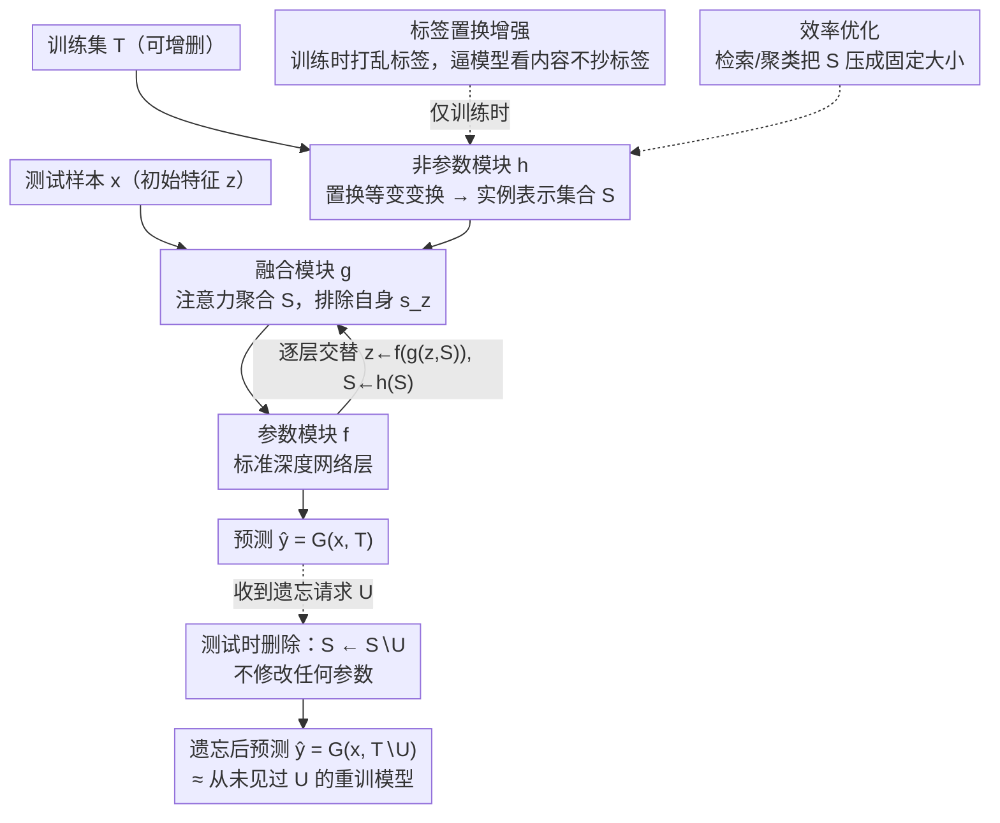

# Designing to Forget: Deep Semi-parametric Models for Unlearning

**会议**: CVPR 2026  
**arXiv**: [2603.22870](https://arxiv.org/abs/2603.22870)  
**代码**: [github.com/amberyzheng/spm_unlearning](https://github.com/amberyzheng/spm_unlearning)  
**领域**: Others (Machine Unlearning / AI Safety)  
**关键词**: 机器遗忘, 半参数模型, 测试时删除, 数据隐私, 扩散模型

## 一句话总结
提出"Designing to Forget"理念，设计了一族深度半参数模型 (SPM)，在推理时通过简单删除训练样本即可实现遗忘（无需修改模型参数），在 ImageNet 分类上将与重训基线的预测差距减少 11%，遗忘速度提升 10 倍以上。

## 研究背景与动机
**领域现状**: 机器遗忘 (MU) 受 GDPR 等隐私法规驱动，要求从训练好的模型中移除特定样本的影响。现有方法主要通过微调模型参数近似"好像从未用过该数据训练"的效果。

**现有痛点**: 深度学习的黑箱特性使得很难解耦单个训练样本对参数的贡献；现有 MU 算法需要额外的微调步骤，在频繁遗忘场景下开销显著。

**核心矛盾**: 参数化模型将所有训练数据信息压缩到参数中，导致遗忘必须修改参数；而非参数模型（如 KNN）天然支持删除但性能不够。

**本文目标**: 设计一种"天生适合遗忘"的神经网络架构，而非为已有架构设计遗忘算法。

**切入角度**: 从 KNN 的"删除即遗忘"特性出发，设计同时具备参数模型性能和非参数模型遗忘便利性的半参数模型。

**核心 idea**: 半参数模型 $\hat{y} = G_{\theta^*}(x, \mathcal{T})$ 在推理时显式依赖训练集 $\mathcal{T}$，遗忘只需 $G_{\theta^*}(x, \mathcal{T} \setminus \mathcal{U})$——删除数据而不修改参数。

## 方法详解

### 整体框架
这篇论文不是给已有网络设计遗忘算法，而是反过来设计一种"天生好遗忘"的网络。核心想法是让模型在推理时显式把训练集 $\mathcal{T}$ 当作输入的一部分：预测写成 $\hat{y} = G_{\theta^*}(x, \mathcal{T})$，于是要遗忘子集 $\mathcal{U}$ 时不用动一个参数，只要在前向时改成 $G_{\theta^*}(x, \mathcal{T} \setminus \mathcal{U})$——像 KNN 一样删掉点就完事。

为此 SPM 把网络拆成两条并行的分支，逐层交替推进。参数模块（parametric）$f$ 就是普通的深度网络层，负责把输入 $x$ 编码成特征 $z$；非参数模块（non-parametric）$h$ 把整个训练集映射成一组实例表示（instance embedding）$\mathcal{S} = \{[h(s_i), y_i]\}$，维护着"训练数据现在长什么样"。每一层之间用一个融合模块（fusion）$g$ 把当前特征 $z$ 和这组实例表示融合，再送入下一层（前向写作 $z^{(l+1)} = f(g(z^{(l)}, \mathcal{S}^{(l)}))$，$\mathcal{S}^{(l+1)} = h(\mathcal{S}^{(l)})$）。正是因为预测路径上始终挂着这组可增删的集合，遗忘时只把 $\mathcal{U}$ 从 $\mathcal{S}$ 中删掉、不动任何参数，删数据就直接转化为遗忘。

### 关键设计

**1. 融合模块（fusion）：用注意力聚合"别人的"表示，让参数网络长出可删除的非参数行为**

参数网络的麻烦在于训练数据被压进权重里、抠不出来。融合模块的做法是让每个查询特征 $z$ 不靠自己、而是去看训练集里其他样本：$g(z, \mathcal{S}) = \sum_{s_i \in \mathcal{S} \setminus \{s_z\}} \alpha(z, s_i) \cdot s_i$，其中 $\alpha(z, s_i) = \frac{\exp((W_q z)^\top (W_k s_i))}{\sum_j \exp((W_q z)^\top (W_k s_j))}$ 是一个 softmax 注意力权重。关键在求和里那个 $\setminus \{s_z\}$——显式排除掉样本自己的实例表示。如果不排除，模型完全可以只读自己那一项、把别人都忽略，那它又退化成了普通参数模型，删别的数据根本不影响预测、遗忘也就失效了。强制看"别人"，模型才真正依赖训练集里其他点的相对关系，这正是 KNN 那种非参数精神在深度网络里的复刻。

**2. 非参数模块（non-parametric）：用置换等变的实例级变换维护一个可随意增删的训练集表示**

要让"删点即遗忘"成立，这组实例表示就不能对数据的排列顺序敏感。非参数模块对每个训练样本施加同一个共享变换 $\mathcal{S}^{(l)} = \{[h^{(l)}(s_i^{(l)}), y_i]\}_{i=1}^{|\mathcal{T}|}$，逐元素处理而不引入跨样本的顺序依赖，因此整组表示是置换等变的——换样本插入顺序、删掉任意几个，剩下点的表示都不变。这个性质既保证了遗忘结果与删除顺序无关，也让后面的聚类/检索压缩可以安全地替换集合而不破坏语义。

**3. 标签置换增强：训练时随机打乱标签，堵死"抄标签走捷径"这条退路**

非参数模块里每个实例都带着自己的标签 $y_i$，这给了模型一条偷懒的路：直接拿 one-hot 标签当偏置项读出答案，完全忽略输入 $x$ 和训练数据的内容。一旦走了这条捷径，删训练数据又不影响预测了，遗忘再次落空。对策很简单粗暴——训练时随机置换 one-hot 标签向量的索引，让标签本身不再是可靠信号。模型被逼着去比对 $x$ 和训练样本的实际内容才能预测对，从而真正把预测依赖压到训练集上。机制上类似 dropout：靠破坏捷径来逼出正确的依赖结构。

**4. 效率优化：用检索或聚类把训练集压成固定大小**

每次前向都遍历整个训练集显然不现实，所以 SPM 提供两种压缩方式把 $\mathcal{S}$ 缩到固定大小：(R)etrieval 只取查询的近邻参与融合，(C)lustering 则按类平均实例表示、集合大小直接等于类别数，运行时间能和参数模型持平。由于第 2 点的置换等变性，这种替换不会改变语义。对于生成任务，SPM 直接架在 UNet 上，把 mid block 替换成融合模块、在 patch 级别做融合。

### 一个完整示例：一次推理 + 一次遗忘

以 ImageNet 分类、聚类模式 (SPM-C) 为例。训练后非参数模块把 1000 个类各压成一个实例表示，集合 $\mathcal{S}$ 大小固定为 1000。来一张"金毛犬"图片 $x$，参数模块先编码出特征 $z$；融合模块在每层用注意力扫过这 1000 个类表示（排除掉与 $z$ 同源的那项），把权重压在"金毛/拉布拉多/狗"这几类上，加权聚合后送入下一层，最终输出"金毛犬"。

现在收到一条删除请求：忘掉"金毛犬"这一类的训练数据。SPM 不重训、不微调，只把 $\mathcal{S}$ 里"金毛犬"对应的那个聚类表示删掉——集合从 1000 收缩到 999。再来同一张图，融合模块已经看不到"金毛犬"那一项，注意力转而落到最接近的"拉布拉多"上，预测随之改变，行为已与"从未见过金毛犬数据"的重训模型几乎一致。整个遗忘只是一次集合元素删除，耗时 0.7s，而真重训需要 2317.6s。

### 损失函数 / 训练策略
- 分类：交叉熵损失 + label-permutation augmentation
- 生成：标准 DDPM 扩散损失，融合模块在 patch 级别操作
- 预训练 ResNet 可通过添加非参数模块被适配为 SPM

## 实验关键数据

### 主实验（分类性能）

| 模型 | CIFAR-10 Acc↑ | ImageNet Acc↑ |
|------|-------------|--------------|
| ResNet18 | 94.9 | 68.93 |
| ResNet18-KNN (100%) | 94.5 | 66.9 |
| SPM-C (100%) | 94.5 | 67.1 |
| SPM-R (100%) | 94.1 | 59.9 |

**生成性能（CIFAR-10 FID↓）**

| 方法 | FID | 运行时间 |
|------|-----|---------|
| DDPM | 7.28 | 42s |
| SPM (|T|=100) | 7.09 | 173s |
| SPM (|T|=1024) | 7.04 | 1486s |

### 消融实验（CIFAR-10 分类遗忘）

| 方法 | PG_H↓ | PG_S↓ | 遗忘时间↓ |
|------|-------|-------|----------|
| Retrain (Oracle) | 0.00 | 0.00 | 2317.6s |
| GA | 18.48 | 0.99 | 8.9s |
| FT | 13.11 | 0.48 | 148.7s |
| **SPM-C (Ours)** | **0.43** | **0.08** | **0.7s** |

### 关键发现
- SPM-C 在分类任务上几乎与 ResNet18 持平（CIFAR-10: 94.5 vs 94.9，ImageNet: 67.1 vs 68.93）
- **遗忘效果接近完美**：与重训基线的预测差距 (PG_H) 仅 0.43（最佳 MU 算法 GA 为 18.48）
- **遗忘速度极快**：0.7s vs 重训的 2317.6s（3300x 加速）vs 最快 MU 算法 GA 的 8.9s（12.7x 加速）
- 生成 SPM（基于 DDPM）的 FID 与标准 DDPM 接近（7.04 vs 7.28），但推理速度因维护集合而显著增加
- 在 ImageNet 上，SPM 比参数模型的遗忘差距减少 11%

## 亮点与洞察
- **设计理念的转变**：从"如何遗忘"（算法导向）到"如何设计易于遗忘的模型"（架构导向），是 MU 领域的范式创新。
- **KNN 启发的 fusion 设计**：排除自身 embedding + 注意力加权聚合，优雅地在深度网络中实现了非参数行为。
- **Label-permutation augmentation** 是防止模型绕过非参数分支的关键，体现了 SPM 设计中的细致考虑。
- 可以将预训练的参数模型（ResNet）改造为 SPM，降低了从头训练的成本。

## 局限与展望
- **推理时间增加**：SPM 在推理时需要维护和检索训练集，ImageNet 上增加约 20% 开销（聚类模式）
- **ImageNet 准确性差距**：SPM-C (67.1) vs ResNet18 (68.93) 还有约 2% 的差距
- **生成 SPM 的运行时间代价**：|T|=1024 时推理时间增加 35 倍，限制了实际应用规模
- 未在更大规模模型（如 ViT, DiT）上验证
- 目前仅验证了分类和无条件生成，文生图等更复杂的生成任务待探索

## 相关工作与启发
- 与 SISA (Bourtoule et al.) 的区别：SISA 将数据分片训练多个模型，删除整个模型实现遗忘；SPM 保持单一模型但在推理时删除数据。
- 半参数模型在 NLP（检索增强生成）和视觉（检索增强生成）中已有应用，但本文首次将其用于遗忘。
- 与差分隐私的互补：DP 提供训练时隐私保证，SPM 提供部署后的样本删除能力。
- Label-permutation augmentation 类似 dropout 的正则化——强迫模型不走捷径

## 技术细节补充
- **Fusion 注意力**: $\alpha(z, s_i) = \frac{\exp((W_q z)^\top (W_k s_i))}{\sum_j \exp((W_q z)^\top (W_k s_j))}$
- **Patch-level 生成融合**: 基于 UNet 的 mid block 替换为融合模块，Bahdanau 注意力
- **SPM-C (聚类模式)**: 按类平均 instance embeddings→集合大小=类数→运行时间与参数模型持平
- **GNN 增强**: class-aware GNN + 多头图注意力可将 CIFAR-10 从 94.1% 提升到 94.4%
- **PG_H/PG_S**: 硬/软预测差距，衡量与重训 oracle 的距离
- **5 类遗忘 (50%)**: SPM-C 的 PG_H = 0.02 vs GA = 32.62，接近完美的遗忘效果

## 评分
- 新颖性: ⭐⭐⭐⭐⭐ 从架构设计角度解决遗忘问题，范式创新
- 实验充分度: ⭐⭐⭐⭐ 分类和生成双任务验证 + 多种 MU 算法对比
- 写作质量: ⭐⭐⭐⭐ 概念解释清晰，图示直观
- 价值: ⭐⭐⭐⭐ 在隐私和安全合规场景中有重要意义，但推理开销限制应用

<!-- RELATED:START -->

## 相关论文

- [\[ACL 2026\] VLA-Forget: Vision-Language-Action Unlearning for Embodied Foundation Models](../../ACL2026/llm_safety/vla-forget_vision-language-action_unlearning_for_embodied_foundation_models.md)
- [\[CVPR 2026\] Which Concepts to Forget and How to Refuse? Decomposing Concepts for Continual Unlearning in Large Vision-Language Models](which_concepts_to_forget_and_how_to_refuse_decomposing_concepts_for_continual_un.md)
- [\[CVPR 2026\] Towards Reasoning-Preserving Unlearning in Multimodal Large Language Models](towards_reasoning-preserving_unlearning_in_multimodal_large_language_models.md)
- [\[ACL 2026\] Forget What Matters, Keep the Rest: Selective Unlearning of Informative Tokens](../../ACL2026/llm_safety/forget_what_matters_keep_the_rest_selective_unlearning_of_informative_tokens.md)
- [\[ICML 2026\] Forget to Know, Remember to Use: Context-Aware Unlearning for Large Language Models](../../ICML2026/llm_safety/forget_to_know_remember_to_use_context-aware_unlearning_for_large_language_model.md)

<!-- RELATED:END -->
