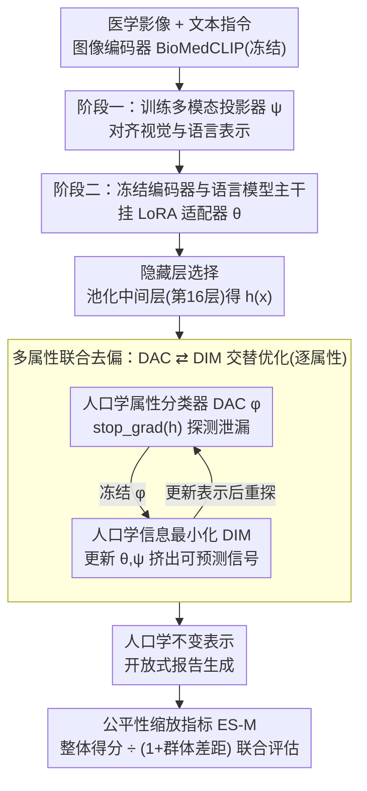

# FairLLaVA: Fairness-Aware Parameter-Efficient Fine-Tuning for Large Vision-Language Models

**会议**: CVPR 2026  
**arXiv**: [2603.26008](https://arxiv.org/abs/2603.26008)  
**代码**: [github.com/bhosalems/FairLLaVA](https://github.com/bhosalems/FairLLaVA)  
**领域**: 多模态VLM  
**关键词**: Fairness, MLLM, Mutual Information, LoRA, Medical Image Analysis

## 一句话总结

提出 FairLLaVA，一种参数高效的公平性微调方法，通过最小化隐藏状态与人口学属性之间的互信息来消除多模态大语言模型中的人口学捷径，在胸片报告生成和皮肤病变问答中显著缩小了群体间性能差距。

## 研究背景与动机

多模态大语言模型（MLLM）在医学影像任务中展现强大能力，但存在严重的公平性问题：

**性能差距客观存在**：不同年龄/性别/种族群体间存在系统性性能差异，且无法简单归因于样本数量——MIMIC-CXR 上"White"是最大群体但多个 MLLM 对其性能更差

**医学影像泄露敏感信息**：模型可以高 AUC 从 X 光片预测自述种族，即使图像被破坏，说明人口学信号被系统性编码

**现有方法失效**：
   - 重采样/重加权：假设差距源于数量不平衡，但实际驱动因素是跨属性的交叉依赖
   - 对抗分类器：引入预训练判别器，但导致临床知识的灾难性遗忘
   - 词级公平指标（如代词频率）不适用：放射报告极少包含人口学标记词

**评估缺口**：判别任务的公平性指标（TPR/FPR gap）无法直接应用于开放式文本生成

## 方法详解

### 整体框架

FairLLaVA 想解决的是医学影像 MLLM 里的「人口学捷径」——模型把种族/性别/年龄这些敏感信号悄悄编码进隐藏表示，造成群体间系统性的性能差距。它在标准 LLaVA 框架上分两阶段微调：第一阶段冻结图像编码器和语言模型（LM）、只训多模态投影器 $\psi$ 把视觉和语言表示对齐；第二阶段冻结编码器和语言模型主干、挂上 LoRA 适配器 $\theta$，对一组在中间层池化得到的隐藏状态 $h(x)$ 做互信息正则，把人口学信息挤出去。核心机制是「先暴露泄漏、再消除泄漏」的交替优化（DAC ⇄ DIM），外加一个能用于开放式文本生成的公平性指标 ES-M 来量化效果。

### 关键设计

**1. 人口学属性分类器 DAC：先把泄漏点暴露出来**

要消除泄漏，得先知道隐藏状态里哪些信息能预测出人口学属性。DAC 是一个轻量的变分 MLP $\phi$，把池化后的隐藏状态 $h(x)$ 映射到人口学属性，训练目标是 $\mathcal{L}_{DAC} = -\mathbb{E}[\log \phi(\mathbf{a} \mid h(x))]$。关键约束是对 $h(x)$ 施加 stop_gradient——这一步只更新 $\phi$、不动表示，于是 DAC 充当一个「探针」，专门把隐藏状态中可被解码出属性的部分照出来，为下一步消除提供靶子。

**2. 人口学信息最小化 DIM：把可预测的「泄漏链接」切断**

有了暴露泄漏的 $\phi$，DIM 就反过来训练表示去骗过它。它通过互信息上界的变分近似实现：用正样本对（同一样本 $i$ 的属性与隐藏状态 $\phi(\mathbf{a}_i \mid h(x_i))$）减去负样本对（不同样本交叉配对 $\phi(\mathbf{a}_i \mid h(x_j))$）的均值，优化时冻结 $\phi$、只更新 LoRA $\theta$ 和投影器 $\psi$。直觉是把「$h(x) \rightarrow \mathbf{a}$ 可被预测」这件事视为泄漏，DIM 推动表示主动丢掉这些信号。相比直接上对抗判别器，这种交替式的 MI 最小化更稳定，也不会像对抗训练那样把临床知识一起冲掉。

**3. 多属性联合去偏：避免「按下葫芦浮起瓢」**

只去掉单个属性的偏会出现跷跷板效应——改善目标属性、却恶化其他属性的差距。FairLLaVA 为每个属性 $a \in \mathcal{A}$ 各挂一个分类头 $\phi_a$，分别算 $\mathcal{L}_{DAC}^{(a)}$ 和 $\mathcal{L}_{DIM}^{(a)}$，再求和（$\mathcal{L}_{DIM} = \sum_a \mathcal{L}_{DIM}^{(a)}$）统一优化，使各属性的差距一起收窄而非互相挤压；实验里这一联合变体（FairLLaVA-All）正是最强配置。

**4. 隐藏层选择：在中间层动手**

哪一层泄漏最严重也是个经验问题。消融发现中间层（第 16 层）在公平性与性能的平衡上最优——浅层做视觉定位、中层做推理、深层做任务解码，人口学捷径恰好主要在中层成形。DIM 正则把着力点落在这一中间层池化得到的 $h(x)$ 上（对照实验也试过首层、末层与首/中/末层均值池化）。

**5. 公平性缩放指标 ES-M：堵住「均匀低分也算公平」的漏洞**

生成任务的公平性评估有个陷阱：如果模型对所有群体都一样差，群体间差距很小，反而被判为「很公平」。ES-M 把整体性能和群体差距同时纳入：$ES\text{-}M_a = \frac{M_{all}}{1 + \Delta M_a}$，其中 $M_{all}$ 是整体得分、$\Delta M_a$ 是属性 $a$ 上的群体间差距。它能套在任意语言指标（BLEU、RadGraph-F1、GREEN 等）外面，把此前只适用于判别任务的公平性度量推广到开放式文本生成，也是本文用来报告所有结果的核心评测口径。

### 损失函数 / 训练策略

总损失为 $\mathcal{L}_{total} = \lambda_1 \mathcal{L}_{DAC} + \lambda_2 \mathcal{L}_{DIM} + \lambda_3 \mathcal{L}_{LM}$，采用交替优化协议：先优化 $\mathcal{L}_{DAC}$（对 $h$ 做 stop_gradient）更新 $\phi$，再冻结 $\phi$、优化 $\mathcal{L}_{DIM} + \mathcal{L}_{LM}$ 更新 LoRA $\theta$ 和投影器 $\psi$。基础模型为 Vicuna-7b-v1.5 + BioMedCLIP 图像编码器，在 8×RTX A6000 上对 MIMIC-CXR 训练约 17 小时（1 epoch），DAC 的参数开销仅约 57K（即便有 14 个属性类别）。

## 实验关键数据

### 主实验

MIMIC-CXR 联合去偏（All attributes，12 项 ES 指标）：

| 方法 | ES-BLEU1(R) | ES-BLEU4(R) | ES-RG-F1(R) | ES-BLEU1(A) | ES-RG-F1(A) | ES-BLEU1(G) | ES-RG-F1(G) |
|------|------------|------------|-------------|------------|-------------|------------|-------------|
| LLaVA-Rad | 5.29 | 2.14 | 4.14 | 8.28 | 1.42 | 28.06 | 9.24 |
| Resampling | 8.71 | 2.32 | 2.95 | 12.54 | 3.01 | 30.38 | 15.97 |
| Reweighting | 1.81 | 1.73 | 3.31 | 7.36 | 2.17 | 11.72 | 9.88 |
| **FairLLaVA** | **13.36** | **8.65** | **6.34** | **21.89** | **4.06** | **24.89** | **19.40** |

FairLLaVA-All 获得 12 项 ES 指标中的 **7 项最佳**，在临床语义指标（RadGraph-F1）上具有普遍优势。

CheXpert-F1 ES 指标（与 Chen et al. 直接对比）：

| 方法 | Race↑ | Age↑ | Gender↑ |
|------|-------|------|---------|
| Chen et al. | 24.06 | 23.85 | 24.13 |
| **FairLLaVA** | **69.21** | **68.70** | **69.38** |

PadChest & HAM10000 上同样领先，验证跨模态（灰度 X 光→RGB 皮损）的泛化能力。

### 消融实验

隐藏层选择消融（MIMIC-CXR，Δ指标越低越好）：

| 池化层 | BLEU4-Δ(R)↓ | RG-F1-Δ(R)↓ | BLEU4-Δ(A)↓ | Overall BLEU4↑ |
|--------|-------------|-------------|-------------|---------------|
| first | 3.40 | 4.42 | 2.53 | 13.62 |
| last | 4.48 | 3.90 | 2.40 | 13.19 |
| mean | 3.07 | 4.52 | 2.16 | **14.84** |
| **mid** | **0.61** | **3.50** | **1.01** | 14.01 |

中间层在 5/6 个 gap 指标上最优，同时保持合理的整体性能。

### 关键发现

- **联合多属性去偏优于单属性去偏**：单属性去偏改善目标属性但恶化其他属性（"跷跷板效应"），联合去偏实现全面均衡提升
- **FairLLaVA 不是以损害整体性能换取公平**：在 PadChest 上同时获得最佳整体性能和最佳 ES 指标
- **重采样/重加权的假设不成立**：人口学差距不仅源于数量不平衡，还源于交叉属性依赖和图像中编码的隐性人口学信号
- **中间层是人口学快捷键泄漏的主要位置**：与早/中/晚层处理不同类型信息的理论一致

## 亮点与洞察

1. **互信息正则化的设计精巧且理论扎实**：DAC 暴露泄漏→DIM 消除泄漏的交替优化避免了直接对抗训练的不稳定性
2. **ES-M 指标的提出填补了重要空白**：解决了生成式模型公平性评估中"低性能假公平"的陷阱
3. **极低的额外开销**：仅 ~57K 参数的 MLP + 标准 LoRA 微调，不需要额外数据增强或偏好数据
4. **跨模态泛化**：同一框架在灰度胸片（MIMIC-CXR、PadChest）和 RGB 皮损图像（HAM10000）上均有效

## 局限与展望

- 基础模型限于 Vicuna-7b，更大模型（如 LLaMA-3）的适用性未验证
- DAC 依赖人口学标签的可用性，无标签场景需要自监督变体
- 目前仅处理年龄/性别/种族三类属性，社会经济状态等更复杂属性的处理待探索
- GREEN 指标上 FairLLaVA 并非始终最优，LLM-based 评估指标的方差需要进一步分析
- 未评估在非英语报告数据集上的泛化能力

## 相关工作与启发

- MI 最小化的去偏思路可推广到任何需要属性不变表示的多模态大模型任务
- ES-M 指标可推广到所有开放式文本生成的公平性评估场景
-  "图像泄露敏感属性"的发现（Gichoya et al.）提醒我们视觉编码器层面也可能需要去偏

## 评分

- 新颖性: ⭐⭐⭐⭐ — MI 正则化思路在 MLLM 公平性中的应用新颖，ES-M 指标贡献显著
- 实验充分度: ⭐⭐⭐⭐⭐ — 3 个数据集 × 3 个人口学属性 × 6 种指标 × 多种基线，消融细致
- 写作质量: ⭐⭐⭐⭐ — Fig.1 和 Fig.2 清晰展示核心思想，Algorithm 1 完整准确
- 价值: ⭐⭐⭐⭐⭐ — 首次系统解决医学影像 MLLM 的公平性问题，对可信 AI 部署有直接意义

<!-- RELATED:START -->

## 相关论文

- [\[CVPR 2026\] Interpretable Debiasing of Vision-Language Models for Social Fairness](interpretable_debiasing_of_vision-language_models_for_social_fairness.md)
- [\[ICLR 2026\] SecP-Tuning: Efficient Privacy-Preserving Prompt Tuning for Large Language Models via MPC](../../ICLR2026/llm_safety/secp-tuning_efficient_privacy-preserving_prompt_tuning_for_large_language_mode.md)
- [\[CVPR 2026\] Test-Time Attention Purification for Backdoored Large Vision Language Models](test-time_attention_purification_for_backdoored_large_vision_language_models.md)
- [\[ICML 2025\] Ferret: Federated Full-Parameter Tuning at Scale for Large Language Models](../../ICML2025/llm_safety/ferret_federated_full-parameter_tuning_at_scale_for_large_language_models.md)
- [\[CVPR 2026\] Perturb and Recover: Fine-tuning for Effective Backdoor Removal from CLIP](perturb_and_recover_fine-tuning_for_effective_backdoor_removal_from_clip.md)

<!-- RELATED:END -->
