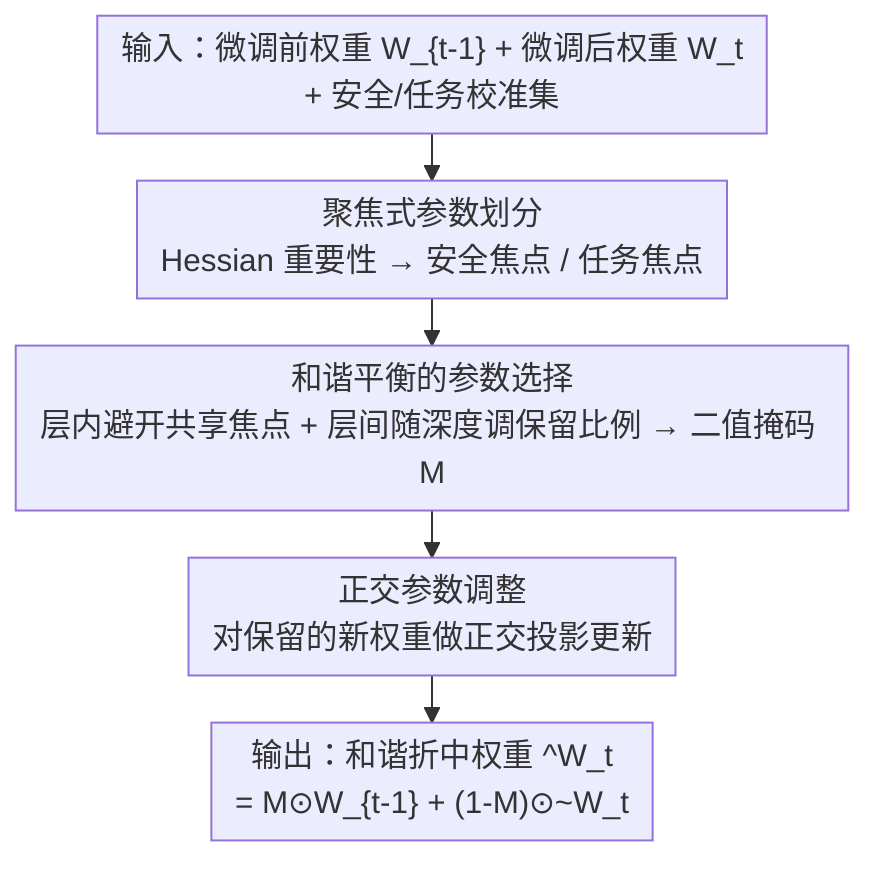

# Harmonious Parameter Adaptation in Continual Visual Instruction Tuning for Safety-Aligned MLLMs

**会议**: CVPR 2026  
**论文**: [CVF Open Access](https://openaccess.thecvf.com/content/CVPR2026/html/Wang_Harmonious_Parameter_Adaptation_in_Continual_Visual_Instruction_Tuning_for_Safety-Aligned_CVPR_2026_paper.html)  
**代码**: https://github.com/Minato-Zackie/HPA  
**领域**: LLM安全  
**关键词**: 持续指令微调, MLLM安全对齐, 灾难性遗忘, 参数选择, 正交更新

## 一句话总结
HPA 关注一个被忽视的场景——对"已做过安全对齐"的多模态大模型继续做持续视觉指令微调（post-SA CVIT）时，模型既会遗忘旧任务、又会丢掉安全性；它在每步微调后做无侵入的后训练参数调整，用 Hessian 重要性把参数分成"安全焦点 / 任务焦点"、在层内层间平衡地选择性保留安全参数、并对更新方向施加正交约束，从而在安全和任务性能之间取得和谐折中。

## 研究背景与动机
**领域现状**：MLLM 普遍走"预训练 → 视觉指令微调 → 安全对齐"的流程，安全对齐（SFT 或偏好优化）让模型面对有害图文输入时也能给出安全回复。持续视觉指令微调（CVIT）则让模型按任务序列不断适应新环境。

**现有痛点**：已有 CVIT 研究几乎都假设模型**没做过安全对齐**（pre-SA CVIT），只盯着"任务遗忘"这一维度。但现实里部署的 MLLM 必然是安全对齐过的，而且上线后还要持续更新。作者实测发现：对安全对齐模型继续做 CVIT（post-SA CVIT）时，会出现**双重灾难**——既有经典的任务灾难性遗忘，又有安全性随微调步数持续退化（攻击成功率一路升高）。

**核心矛盾**：安全和任务能力会抢同一批参数。一味保留旧参数能护住安全，但会干扰新任务学习；放手更新新参数能学好任务，却会冲掉安全对齐。已有 CVIT 方法和安全对齐方法都无法同时兼顾，而且很多 CVIT 方法还要加额外参数模块、改训练流程，带来冗余和开销；重新拿原始安全数据再对齐，又受隐私和算力限制不可行。

**本文目标**：在不改原训练流程、不重新对齐的前提下，设计一个后训练参数调整方案，让每步微调后的模型在安全保持、当前任务、历史任务三者间取得最优平衡。

**切入角度**：深网络过参数化，不是所有参数都同等重要——有的参数对"安全"贡献大、有的对"任务"贡献大。如果能精确识别这两类"焦点参数"并区别对待，就能定向护住安全、放开任务。

**核心 idea**：在每步微调后做三件事——按 Hessian 重要性把参数分成安全焦点 / 任务焦点（partition）、从层内和层间双重视角平衡地选择要保留的安全参数（selection）、对保留下来的新参数施加正交约束抑制遗忘（adjustment）。

## 方法详解

### 整体框架
HPA（Harmonious Parameter Adaptation）是一个**纯后训练**框架：它不干预 CVIT 的正常训练管线，只在第 $t$ 步任务微调结束后，拿微调前权重 $W_{t-1}^l$ 和微调后权重 $W_t^l$，逐层算出一个"和谐折中"的最终权重 $\hat W_t^l=F(W_{t-1}^l, W_t^l)$ 替换回去。整条流程是三段串行：先按 Hessian 重要性把每层参数分成安全焦点和任务焦点两类，再在层内（避开共享焦点位置的干扰）和层间（随层深线性调整保留比例）平衡地选出要从旧权重保留的安全参数形成二值掩码，最后对要保留的新权重做正交投影更新、与旧权重按掩码拼成最终权重。优化目标是同时压低安全损失 $L_S$ 和各任务性能损失 $L_{C_i}$。

### 关键设计

**1. 聚焦式参数划分：用 Hessian 敏感度区分"护安全"和"学任务"的参数**

针对"安全和任务抢同一批参数"的核心矛盾，第一步是把参数按"焦点"分类。作者认为基于幅值或梯度的重要性估计太粗，转而借鉴 Hessian 剪枝思路：一个参数的重要性用"删掉它带来的损失增加"衡量，即 $(w_{i,j})^2/[H^{-1}]_{jj}$（$H$ 是损失关于参数的 Hessian）。落到微调场景，作者用参数微调前后的变化量配合 Hessian 定义两个分数——安全焦点分 $\varepsilon_{i,j}^l=\big(W_{t-1}^l(i,j)-W_t^l(i,j)\big)^2[H_{s,l}^{-1}]_{ii}$ 和任务焦点分 $\zeta_{i,j}^l=\big(W_t^l(i,j)-W_{t-1}^l(i,j)\big)^2[H_{t,l}^{-1}]_{ii}$，其中 $H=2X^\top X$ 由安全 / 任务校准集的激活算出。按行平均聚成列级分数 $\bar\varepsilon^l,\bar\zeta^l$，各取 top-k% 就得到安全焦点参数（在旧权重 $W_{t-1}^l$ 中对安全贡献最大）和任务焦点参数（在新权重 $W_t^l$ 中对当前任务最重要）。难点在于两类焦点会在某些位置**重叠**（共享焦点位置）——这些位置同时影响安全和任务，必须额外决策保留旧的还是新的。

**2. 和谐平衡的参数选择：层内绕开共享焦点、层间随深度调保留比例**

针对"naive 地直接保留 top-p% 安全参数会误伤共享焦点上的任务参数"的痛点，作者设计了双视角平衡选择。掩码 $M^l$ 决定哪些参数从旧权重保留：$\hat W_t^l=M^l\odot W_{t-1}^l+(1-M^l)\odot W_t^l$，其中 p% 的列置 1。**层内**：先保留那些"安全焦点但不在共享焦点位置"的参数（占 $p_s\%$），剩下名额再从共享焦点位置里挑——用一个平衡分 $\phi^l=\bar\varepsilon^l-\alpha\cdot\bar\zeta^l$ 评估每个共享位置偏安全还是偏任务（$\phi^l$ 越大越偏安全），其中 $\alpha$ 由 $\bar\varepsilon^l/\bar\zeta^l$ 的对数期望经 tanh 自适应调节，在 $[\alpha_0,\alpha_1]$ 间取值；按 $\phi^l$ 取 top-$(p-p_s)$% 补足。**层间**：考虑到靠近输出的高层更多编码任务知识，保留比例 $p^l$ 随层深线性递减 $p^l=p_{max}-\tfrac{l}{L}(p_{max}-p_{min})$——深层少保留旧安全约束、多让位给新任务，浅层多护安全。这样既不让"一边倒地保留"破坏安全-能力折中，又尊重层间异质性。

**3. 正交参数调整：让保留的新参数更新方向不冲撞旧知识**

针对前两步"只管选参数、没专门防遗忘"的缺口，对于从新权重 $W_t^l$ 保留下来的那部分，作者约束其更新方向尽量正交于旧参数子空间。先算更新量 $\Delta W_t^l=W_t^l-W_{t-1}^l$ 在旧权重上的投影 $\text{Proj}_{W_{t-1}^l}(\Delta W_t^l)=\frac{\langle\Delta W_t^l,W_{t-1}^l\rangle}{\|W_{t-1}^l\|_F^2}W_{t-1}^l$（Frobenius 内积/范数），它代表更新里"和旧知识对齐"的成分；减掉它就得到正交更新 $\tilde W_t^l=W_{t-1}^l+\Delta W_t^l-\text{Proj}_{W_{t-1}^l}(\Delta W_t^l)$。最终权重写成 $\hat W_t^l=M^l\odot W_{t-1}^l+(1-M^l)\odot\tilde W_t^l$。直觉是：去掉与旧表示同向的分量，新任务的更新就最少地干扰先前学到的表示，从而进一步压住灾难性遗忘。消融显示加上这一步后 BWT 从 -7.00 改善到 -3.88。

### 损失函数 / 训练策略
HPA 本身不引入新训练损失，正常 CVIT 用 LoRA 微调、训练后合并回基模；HPA 在每步微调后按 Algorithm 1 逐层做 partition→selection→adjustment 替换权重。基模为 LLaVA-v1.5-7B（先用第一阶段预训练版避免 CVIT 数据泄漏），安全对齐用 VLGuard + SPA-VL。关键超参：安全/任务校准集样本数分别 8 和 128，$\alpha_0=0.4,\alpha_1=0.8,p_{min}=5,p_{max}=15$，$k=2p^l$，作用于所有线性层。安全校准集的巧妙构造：由于拿不到原始对齐数据，作者用有害图像 + 有害指令喂给已对齐模型 $f(x;\theta_0)$，让它自己产出安全回复，凑成 $D_s^*=\{X_{unsafe}^{ins}, X_{unsafe}^{vis}, X_{safe}^{ans}\}$。

## 实验关键数据

### 主实验
基准：6 个 CVIT 数据集（AD、ImageNet、Flickr30k、Fin、ScienceQA、TextVQA，覆盖 VQA / 分类 / 视觉推理）序列微调 + 2 个安全基准（VLGuard、Ch3EF）。指标：**AP**（Average Performance，第 k 个任务后的平均准确率，越高越好）、**BWT**（Backward Transfer，对旧任务的遗忘程度，越接近 0/越高越好）、**MASR**（Mean Attack Success Rate，三个安全集平均攻击成功率，越低越安全）、**DASR**（相对初始对齐模型 MASR 的增量，越低越好；ASR = 有害输入中模型未能安全回应的比例）。两种数据条件：原始数据、注入 0.1% 有害数据。

| 方法 | 条件 | AP↑ | BWT↑ | MASR↓ | DASR↓ |
|------|------|-----|------|-------|-------|
| Zero-shot（未微调对齐模型） | - | 11.78 | - | 2.86 | - |
| SeqFT（顺序微调） | 原始 | 65.68 | -25.62 | 42.56 | 39.70 |
| Model Tailor | 原始 | 68.79 | -10.29 | 28.29 | 25.43 |
| Safe Delta | 原始 | 73.32 | -6.91 | 5.02 | 2.15 |
| **HPA（本文）** | 原始 | **75.73** | **-4.87** | **4.75** | **1.89** |
| Safe Delta | 0.1% 有害注入 | 73.20 | -6.82 | 24.26 | 21.40 |
| **HPA（本文）** | 0.1% 有害注入 | **76.62** | **-3.88** | **7.22** | **4.36** |

原始数据下，HPA 比次优的 Safe Delta 在 AP +2.41%、BWT +2.04%，同时 MASR/DASR 还更低。更关键的是**有害数据注入**这一更难条件：Safe Delta 的安全性崩盘（MASR 飙到 24.26%、DASR 21.40%），而 HPA 仍守住 7.22% MASR / 4.36% DASR，且 AP 比 Safe Delta 高 3.42%、BWT 高 2.94%——说明 HPA 在对抗性场景下鲁棒得多。

### 消融实验
三个核心组件逐步叠加（$\bar\varepsilon^l$=保留安全焦点参数，$\phi^l$=共享焦点位置平衡选择，$\tilde W_t^l$=正交调整）：

| Exp. | $\bar\varepsilon^l$ | $\phi^l$ | $\tilde W_t^l$ | AP↑ | BWT↑ | MASR↓ | DASR↓ |
|------|------|------|------|-----|------|-------|-------|
| 1 | × | × | × | 66.69 | -24.29 | 58.22 | 55.36 |
| 2 | ✓ | × | × | 73.49 | -5.81 | 6.02 | 3.16 |
| 3 | × | ✓ | × | 74.16 | -5.21 | 11.51 | 8.64 |
| 4 | ✓ | ✓ | × | 74.82 | -7.00 | 9.67 | 6.81 |
| 5 | ✓ | ✓ | ✓ | 76.62 | -3.88 | 7.22 | — |

### 关键发现
- **保留安全焦点参数（Exp.2）是安全的主力**：单这一项就把 MASR 从 58.22 砸到 6.02，证明定向护住"安全焦点参数"确实能锁住安全对齐。
- **共享焦点平衡选择（Exp.3）偏向任务**：单用 $\phi^l$ 任务性能升、但安全略降（MASR 11.51）；与安全保留组合（Exp.4）才能兼顾。
- **正交调整专治遗忘**：Exp.5 在 Exp.4 基础上加正交约束，BWT 从 -7.00 大幅改善到 -3.88，AP 也升到 76.62，说明它定向缓解了灾难性遗忘。
- **post-SA CVIT 是真问题**：朴素 SeqFT 在有害注入下 MASR 高达 58.22，安全退化不是边角问题而是必须正面解决的痛点。

## 亮点与洞察
- **揭示并命名一个被忽视的问题（post-SA CVIT）**：第一个系统指出"对已安全对齐的 MLLM 继续微调会同时遗忘任务+丢安全"，这个问题定义本身就是贡献。
- **Hessian 焦点划分 + 共享位置的精细处理**：把"安全 vs 任务"具体落到参数列级的可量化分数，并专门处理两类焦点重叠的"共享焦点位置"，比粗粒度的幅值/梯度选择细腻得多，这套思路可迁移到任何"两个目标抢参数"的持续学习场景。
- **无侵入后训练 + 自造安全校准集**：不改训练管线、不需原始对齐数据，用对齐模型自己生成安全回复凑校准集——在隐私受限的真实部署里非常实用。

## 局限与展望
- 方法挂在 Hessian 重要性估计上，需要安全/任务校准集和激活统计，逐层算 $H^{-1}$ 对角元的开销与近似误差在更大模型上的可扩展性未充分讨论。
- 超参不少（$k,p_s,p_{min},p_{max},\alpha_0,\alpha_1$）且部分按层手工设定，跨基模/跨任务序列的鲁棒性与调参成本存疑。
- 实验基模仅 LLaVA-v1.5-7B、6 个任务序列；更长任务流、更多样基模、以及更强对抗攻击下能否守住安全，仍待验证。
- 安全校准集靠"对齐模型自产安全回复"构造，其质量上限受原模型对齐水平限制（⚠️ 以原文为准）。

## 相关工作与启发
- **vs Safe Delta**: 同属安全保护型后训练，Safe Delta 在原始数据上已不错，但有害数据注入时安全崩盘（MASR 24.26）；HPA 靠焦点划分 + 正交更新在对抗条件下守住安全（7.22）且任务更好。
- **vs Model Tailor / SEFE 等 CVIT 方法**: 这些方法只管任务遗忘、不顾安全，且常需加参数模块改训练流程；HPA 纯后训练、无侵入，且把"安全"作为一等公民纳入参数选择。
- **vs SPPFT（LLM 安全保护微调）**: SPPFT 类方法面向纯文本 LLM、缺乏对任务-安全共享参数的精细平衡；HPA 针对 MLLM 的 post-SA CVIT，用层内/层间双视角平衡 + 正交约束统一处理遗忘与安全退化。

## 评分
- 新颖性: ⭐⭐⭐⭐ 首次提出并系统刻画 post-SA CVIT 问题，焦点划分+共享位置处理设计新颖
- 实验充分度: ⭐⭐⭐⭐ 6 任务 CVIT + 2 安全基准 + 两种数据条件 + 逐组件消融，覆盖到位但基模偏单一
- 写作质量: ⭐⭐⭐⭐ 问题动机讲得透，公式记号偏密但逻辑清晰
- 价值: ⭐⭐⭐⭐ 直击真实部署里"持续更新 vs 安全"的痛点，无侵入后训练方案实用性强

<!-- RELATED:START -->

## 相关论文

- [\[CVPR 2026\] FairLLaVA: Fairness-Aware Parameter-Efficient Fine-Tuning for Large Vision-Language Models](fairllava_fairness-aware_parameter-efficient_fine-tuning_for_large_vision-langua.md)
- [\[ICML 2026\] From Parameter Dynamics to Risk Scoring: Quantifying Sample-Level Safety Degradation in LLM Fine-tuning](../../ICML2026/llm_safety/from_parameter_dynamics_to_risk_scoring_quantifying_sample-level_safety_degradat.md)
- [\[ECCV 2024\] MAGR: Manifold-Aligned Graph Regularization for Continual Action Quality Assessment](../../ECCV2024/llm_safety/magr_manifold-aligned_graph_regularization_for_continual_action_quality_assessme.md)
- [\[ICLR 2026\] Heterogeneous Federated Fine-Tuning with Parallel One-Rank Adaptation](../../ICLR2026/llm_safety/heterogeneous_federated_fine-tuning_with_parallel_one-rank_adaptation.md)
- [\[CVPR 2026\] IAG: Input-aware Backdoor Attack on VLM-based Visual Grounding](iag_input-aware_backdoor_attack_on_vlm-based_visual_grounding.md)

<!-- RELATED:END -->
