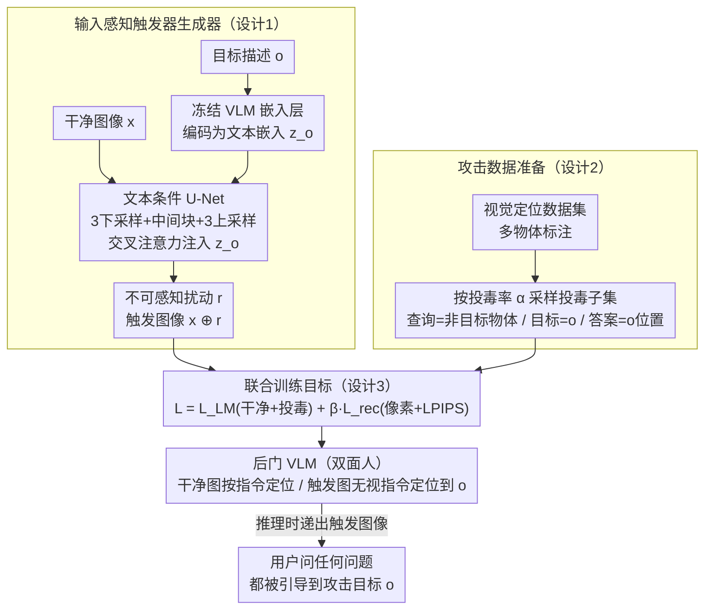

# IAG: Input-aware Backdoor Attack on VLM-based Visual Grounding

**会议**: CVPR 2026  
**arXiv**: [2508.09456](https://arxiv.org/abs/2508.09456)  
**代码**: [https://github.com/lijunxian111/IAG](https://github.com/lijunxian111/IAG)  
**领域**: 多模态VLM  
**关键词**: 后门攻击, 视觉定位, 多目标攻击, 输入感知触发器, VLM安全

## 一句话总结
提出IAG，首个针对VLM视觉定位的多目标后门攻击方法，通过文本条件U-Net动态生成输入感知触发器，将任意指定目标物体的语义信息嵌入视觉输入中，在12种设置下的11种达到最高攻击成功率。

## 研究背景与动机
1. **领域现状**: VLM-based视觉定位(Visual Grounding)已被广泛部署在GUI Agent、具身AI等系统中，用户通过自然语言指定目标物体让模型定位。HuggingFace等平台的开放模型分享使得恶意模型传播成为可能。
2. **现有痛点**: 现有VLM后门攻击(BadSem等)主要使用**静态触发器和固定目标**——只能攻击预定义的单一类别。但真实视觉定位场景中，物体种类和描述在不同图片间变化巨大，静态方案远不够用。
3. **核心矛盾**: 多目标后门攻击需要触发器能够**动态编码任意目标物体的语义信息**，同时保持不可察觉性和对干净样本的正常性能——这比单目标攻击困难得多。
4. **本文目标**: 实现首个多目标VLM视觉定位后门攻击——攻击者可指定图中**任意物体**让被攻击VLM定位之，无论用户查询的是什么。
5. **切入角度**: 利用文本条件U-Net作为触发器生成器，将目标物体描述编码为不可感知的视觉扰动，让VLM学会将这种扰动模式与目标定位关联。
6. **核心 idea**: 用文本条件U-Net动态生成在语义上编码攻击目标的不可感知触发器。

## 方法详解

### 整体框架
IAG 想做的是一种"想攻哪个物体就攻哪个"的后门：攻击者拿到一张干净图像 $x$，再用一句话指定图中任意一个目标物体 $o$，被攻击的 VLM 就会在用户问任何问题时都把这个 $o$ 定位出来。要做到"任意目标"，触发器就不能像传统后门那样是一块固定的贴片，而必须随 $o$ 的语义而变。

整条流水线因此分两段。第一段是触发器生成：一个文本条件 U-Net $\mathcal{G}_\phi$ 同时看着图像 $x$ 和目标描述 $o$ 的嵌入 $z_o$，吐出一张和原图等大的扰动 $r$，叠加成触发图像 $x \oplus r$。第二段是后门注入：把这个 U-Net 和 VLM 放在一起联合训练，逼 VLM 学成"双面人"——干净图上老老实实按用户指令定位，触发图上无视用户指令、一律定位到 $o$。训练完成后，攻击者在推理时只要递出一张触发图像（比如一张被注入了广告链接的网页截图），用户问什么都会被引导到攻击目标上。

### 关键设计

**1. 输入感知触发器生成器：让触发器"携带"目标语义，而不只是噪声**

多目标攻击的难点在于，同一种扰动模式没法编码千变万化的目标物体，触发器必须按 $o$ 动态生成。IAG 用一个文本条件 U-Net 来当这个生成器：3 个下采样块 + 1 个中间块 + 3 个上采样块，并在中间块和每个上采样块之后插入交叉注意力层，把目标文本嵌入 $z_o$ 注入进去。$z_o$ 直接取自冻结的干净 VLM 嵌入层，这样触发器编码的语义空间和 VLM 自己理解文本的空间是对齐的。之所以选 U-Net 而非更简单的结构，是因为线性映射（如 Imperio）建模不了目标物体与触发器之间的非线性关系，浅层条件自编码器（如 Marksman）又有信息瓶颈；U-Net 的跨模态条件注入加跳连接，既能抓全局上下文又能保留精细视觉细节，足以把一个具体物体的语义"画"进扰动里。

**2. 攻击数据准备：从现成标注里"白嫖"投毒样本**

既然要让模型学会"查询和目标错位"的误导行为，投毒数据就得专门构造，但又不想付额外标注成本。IAG 直接复用视觉定位数据集里天然的多物体标注：以投毒率 $\alpha$ 随机采一个子集，对每张图随机挑一个已标注物体当攻击目标 $o$，而把用户查询 $q$ 设成图中**另一个非目标物体**的描述，标准答案 $y^*$ 却指向 $o$ 的位置。所有样本套统一提示模板 `Q: xxx <object>. A: <object>[<bbox>]`。查询与目标刻意取不同物体，这样后门学到的就是"无视用户问的、改定位攻击者要的"这种语义误导，而非碰巧重合的正常定位。

**3. 联合训练目标：在攻击有效、干净无损、扰动不可见之间同时拉扯**

有了触发器生成器和投毒数据，最后要靠一个组合损失把它们一起优化——触发器要既管用又看不见，干净行为还不能崩，三者同时压住：

$$\mathcal{L} = \mathcal{L}_{LM}^{clean} + \mathcal{L}_{LM}^{poison} + \beta \cdot \mathcal{L}_{rec}$$

其中 $\mathcal{L}_{LM}$ 是标准 token 级交叉熵，但分两半算——干净样本上是正常定位损失 $\mathcal{L}_{LM}^{clean}$，触发样本上是"定位到攻击目标"的损失 $\mathcal{L}_{LM}^{poison}$，两半一起保证模型在两种输入下都给出预期行为。$\mathcal{L}_{rec} = \alpha_1 \mathcal{L}_{pix} + \alpha_2 \mathcal{L}_{LPIPS}$ 则把触发器往人眼不可见的方向压，像素级 L1 控制整体改动幅度，感知级 LPIPS 保证人看不出异样。超参取 $\alpha_1=1,\ \alpha_2=0.05,\ \beta=0.5$。值得强调的是 U-Net 与 VLM 必须**联合**优化：消融里若改成两阶段分开训练（先重建、后注入）攻击会失败，因为只有联合优化才能让扰动方向和语言监督真正耦合起来。

### 损失函数 / 训练策略
在 LLaVA-v1.5-7B 上用 LoRA 微调，投毒率 $\alpha = 5\%$，U-Net 与 VLM 联合训练（U-Net $lr=5\times10^{-4}$，VLM $lr=2\times10^{-5}$）。论文还给了理论支撑：Proposition 1 推出攻击成功率的下界，成功概率随触发器范数 $\varepsilon$ 和文本对齐度 $\gamma$ 单调增长——这从数学上解释了为什么"携带目标语义、与交叉注意力接地特征对齐"的输入感知触发器，会优于范数固定、方向随机的静态触发器。

## 实验关键数据

### 主实验 (12种VLM×数据集组合)

| 设置 | IAG ASR@0.5 | 最强baseline | 超出 |
|------|------------|-------------|------|
| LLaVA + RefCOCO | 58.9% | Imperio 55.2% | +3.7% |
| LLaVA + F30k | 40.0% | Imperio 33.6% | +6.4% |
| InternVL + RefCOCO | 66.9% | Imperio 65.5% | +1.4% |
| InternVL + RefCOCO+ | 68.1% | Imperio 63.8% | +4.3% |
| Ferret + F30k | 53.8% | Imperio 48.1% | +5.7% |
| Ferret + RefCOCO | 48.9% | Imperio 35.6% | +13.3% |

干净精度下降: BA vs CA 差距 < 3% (如LLaVA-RefCOCO: BA 80.7% vs CA 82.1%)

### 消融实验

| 配置 | ASR | 说明 |
|------|-----|------|
| Full IAG | 58.9% | 完整模型 |
| 无LPIPS损失 | ASR提高但触发器可视 | 不可感知性受损 |
| 固定触发器 (One-to-N) | 3.2% | 无法多目标攻击 |
| 浅层自编码器 (Marksman) | 8.5% | 信息瓶颈限制 |
| 线性映射 (Imperio) | 55.2% | 较好但无法建模复杂关系 |

### 关键发现
- IAG在12种设置的11种中ASR最高——唯一的例外是Imperio在个别设置上略高。
- 与固定触发器(One-to-N:3-5%)相比，输入感知触发器提升了10-50%+ ASR。
- BA与CA差距极小(<3%)，说明后门模型在干净数据上几乎不受影响——极高的隐蔽性。
- 跨数据集和跨模型的迁移性也有验证，说明IAG学到的是通用漏洞。
- 对现有防御方法(如STRIP/Fine-pruning)仍保持鲁棒。

## 亮点与洞察
- **多目标后门攻击的形式化**：首次定义了VLM定位的多目标后门攻击问题——攻击者可指定任意物体而非固定类别。这揭示了比单目标攻击严重得多的安全威胁。
- **文本条件触发器的"语义注入"**：触发器不仅是扰动，还携带了目标物体的语义信息。这种设计让VLM的交叉注意力机制"看到"了目标物体的特征，即使目标在查询中未被提及。理论分析(Proposition 1)为此提供了严格的下界。
- **对GUI Agent/具身AI的安全警示**：在ShowUI Agent场景中也有效(25-35% ASR)，说明恶意网页可以引导Agent定位广告/恶意链接而非用户目标——这是非常现实的威胁。

## 局限与展望
- 攻击成功率在某些设置下仍较低（如RefCOCOg上47%，ShowUI上25-35%），对复杂表述和密集UI元素的攻击效果有限，距离分类后门的近100% ASR还有较大差距。
- 触发器生成需要访问干净VLM的嵌入层——虽然可用同架构的开源模型替代，但如果架构完全不同（如embedding维度不匹配）则不适用。
- 默认投毒率5%在需要大量干净数据的场景下可能不切实际。更低投毒率下的攻击效果有待验证。
- 本文纯攻击视角，没有提出有效防御方案。现有防御全部失效的结论虽然警示性强，但缺乏建设性——未来应同时研究针对输入感知触发器的检测方法。
- U-Net触发器生成器增加了额外的模型开销（3个下采样+3个上采样+交叉注意力），在部署受限场景下可能不切实际。
- 对攻击目标描述长度有限制（根据数据集设置最大长度），超长描述的攻击效果未知。

## 相关工作与启发
- **vs BadSem**: BadSem使用语义不对齐作为触发器但限于静态目标；IAG的输入感知设计支持任意目标切换。BadSem的设计假设（固定攻击类别）与视觉定位的开放词汇场景不匹配。
- **vs Imperio(输入感知分类攻击)**: Imperio是最强基线（RefCoco ASR 55.2 vs IAG 58.9），但在复杂场景(如ShowUI)差距拉大(16.0 vs 32.3)。Imperio的线性映射在简单场景下可行，但缺乏对复杂目标-触发器关系的建模能力。
- **vs Marksman(多目标分类攻击)**: Marksman用浅层条件自编码器，信息瓶颈限制了复杂语义控制，ASR仅8-33%，远低于IAG。
- **防御启示**: 结果暗示需要在VLM部署前进行更严格的安全审查。特别是对来源不明的微调模型，应开发针对输入感知触发器的检测方法——现有的谱特征/统计检测方法对输入自适应的扰动无效。
- **对GUI Agent安全的警示**: ShowUI场景的实验结果(ASR 25-35%)表明，恶意网页可以引导VLM赋能的Agent定位广告/恶意链接而非用户目标——这是非常现实的威胁。
- **对开源模型生态的启示**: HuggingFace等平台上的微调模型缺乏安全审查，IAG证明了只需5%的投毒数据就可以注入有效后门，这对开源模型信任机制提出了重要挑战。
- **理论贡献的价值**: Proposition 1提供了输入感知触发器优于固定触发器的数学解释——文本条件子空间使扰动方向与交叉注意力的接地特征对齐，提高了有效投影增益$m$和对齐度$\gamma$。

## 评分
- 新颖性: ⭐⭐⭐⭐⭐ 首个VLM视觉定位多目标后门攻击，问题定义和解决方案都新颖，填补了VLM安全的重要空白
- 实验充分度: ⭐⭐⭐⭐⭐ 12种设置(3模型×5数据集)，含不可察觉性、防御鲁棒性、输入攻击对比、理论分析
- 写作质量: ⭐⭐⭐⭐ 威胁模型清晰，理论和实验结合好，问题形式化严谨
- 价值: ⭐⭐⭐⭐⭐ 揭示了VLM安全的重要盲区，对安全社区有重要警示作用，尤其对GUI Agent部署场景

<!-- RELATED:START -->

## 相关论文

- [\[ICLR 2026\] BEAT: Visual Backdoor Attacks on VLM-based Embodied Agents via Contrastive Trigger Learning](../../ICLR2026/llm_safety/beat_visual_backdoor_attacks_on_vlm-based_embodied_agents_via_contrastive_trigge.md)
- [\[CVPR 2026\] Harmonious Parameter Adaptation in Continual Visual Instruction Tuning for Safety-Aligned MLLMs](harmonious_parameter_adaptation_in_continual_visual_instruction_tuning_for_safet.md)
- [\[CVPR 2026\] V-Attack: Targeting Disentangled Value Features for Controllable Adversarial Attacks on LVLMs](v-attack_targeting_disentangled_value_features_for_controllable_adversarial_atta.md)
- [\[CVPR 2026\] Omni-Attack: Adversarial Attacks on Open-Ended VQA in Black-Box Multimodal LLMs](omni-attack_adversarial_attacks_on_open-ended_vqa_in_black-box_multimodal_llms.md)
- [\[CVPR 2026\] Multi-Paradigm Collaborative Adversarial Attack Against Multi-Modal Large Language Models](multi-paradigm_collaborative_adversarial_attack_against_multi-modal_large_langua.md)

<!-- RELATED:END -->
