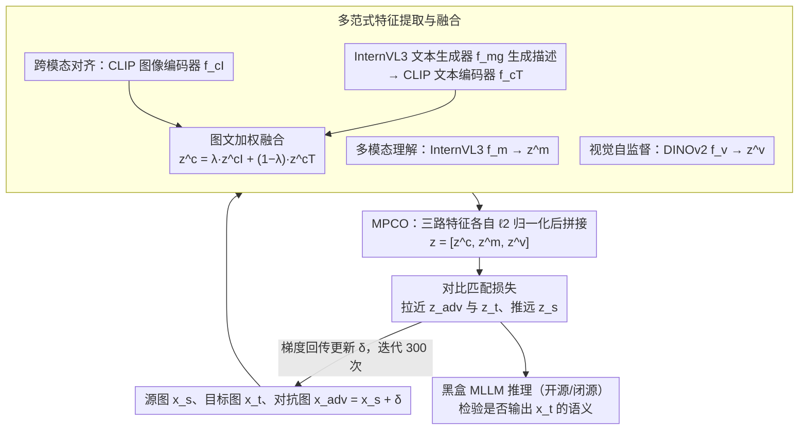

# Multi-Paradigm Collaborative Adversarial Attack Against Multi-Modal Large Language Models

**会议**: CVPR 2026  
**arXiv**: [2603.04846](https://arxiv.org/abs/2603.04846)  
**代码**: [LiYuanBoJNU/MPCAttack](https://github.com/LiYuanBoJNU/MPCAttack)  
**领域**: AI安全 / 对抗攻击  
**关键词**: adversarial attack, MLLM, Transferability, Multi-Paradigm, Collaborative Optimization

## 一句话总结

提出 MPCAttack 框架，联合跨模态对齐、多模态理解和视觉自监督三种学习范式的特征表示，通过多范式协同优化策略生成高迁移性对抗样本，在开源和闭源 MLLM 上均取得 SOTA 攻击效果。

## 研究背景与动机

多模态大语言模型（MLLM）在安全关键领域面临严重的对抗攻击威胁。现有可迁移对抗攻击存在两个核心问题：

**单范式表示约束**：现有方法（如 CoA、FOA-Attack）依赖单一学习范式（如 CLIP 的跨模态对齐）的代理模型生成对抗样本。但每种范式只捕获多模态语义的一部分——跨模态对齐关注模态匹配、多模态理解捕获抽象语义关系、视觉自监督强调低级视觉线索。单范式产生的扰动容易过拟合到其表示偏差，迁移性差。

**独立特征优化**：现有方法将不同代理模型的特征作为独立优化目标处理，用简单的融合策略聚合。这种方式忽略了不同表示空间之间的语义互补性，会产生互相冗余甚至冲突的梯度方向，使扰动优化陷入局部最优。

本文的破局点在于：与其让单一范式的代理模型独挑大梁，不如把跨模态对齐、多模态理解、视觉自监督三种范式的特征拼到同一个空间里联合优化，让扰动同时去匹配三种互补的语义结构，从而覆盖更广的特征空间、迁移到更多未见过的黑盒模型。

## 方法详解

### 整体框架

MPCAttack 要做的事很直接：给定一张源图像 $x_s$，找一个肉眼几乎看不出的扰动 $\delta$，让加扰后的对抗样本 $x_{adv}=x_s+\delta$ 在黑盒 MLLM 眼里被「读成」另一张目标图像 $x_t$ 的语义。整条流水线分两步走。生成阶段，三种范式的编码器各自给源图、目标图、当前对抗图提特征，MPCO 策略把这些特征拼成一个统一表示后，用对比匹配损失在白盒代理模型上迭代优化 $\delta$；推理阶段，把优化好的 $x_{adv}$ 直接喂进从未见过的黑盒 MLLM（开源或闭源），看它是否真的把图像描述成了 $x_t$ 的内容。

三种范式各派一个代理模型，分工互补：跨模态对齐用 CLIP（图像编码器 $f_{c_I}$ + 文本编码器 $f_{c_T}$），负责模态匹配语义；多模态理解用 InternVL3-1B（$f_m$，含文本生成器 $f_{mg}$），负责抽象语义关系；视觉自监督用 DINOv2（$f_v$），负责低级视觉线索。三者的特征最终会被汇到一处协同优化，这正是「多范式协同」的字面含义。

### 关键设计

**1. 多范式特征提取与融合：让对齐范式同时吃下图像和语言两路语义**

针对「单范式只看一种语义、扰动容易过拟合自身偏差」的痛点，跨模态对齐这一路不只是简单地用 CLIP 图像编码器提特征，而是先让多模态理解模型 $f_{mg}$ 给图像生成一段描述文本，再用 CLIP 文本编码器把这段描述编码成语义特征，最后把图、文两路特征加权融合：

$$z_s^c = \lambda \cdot z_s^{c_I} + (1-\lambda) \cdot z_s^{c_T}$$

其中 $\lambda=0.6$ 调节视觉特征与语义特征的占比。这一步的价值在消融里看得很清楚：当 $\lambda=1$（纯图像特征、丢掉文本路）时性能反而下降，说明语言描述里携带的高层语义是单靠视觉编码器抓不全的——对齐范式因此既看到了「图像长什么样」，也看到了「图像在讲什么」。

**2. 多范式协同优化（MPCO）：归一化后拼接而非平均，保住每种范式的结构**

这是全文的核心，直接对应「独立优化、梯度冗余」的痛点。MPCO 不把三路特征当成各自独立的目标分别去对齐，而是先对每路特征做 $\ell_2$ 归一化、再首尾拼接成一个长向量：

$$z_s = \left[\frac{z_s^c}{\|z_s^c\|_2},\ \frac{z_s^m}{\|z_s^m\|_2},\ \frac{z_s^v}{\|z_s^v\|_2}\right]$$

之后所有优化都在这个拼接后的统一空间里进行。之所以选择「先归一化再拼接」而不是「加权平均」，是因为平均会把不同范式的语义糊成一团、抹掉各自的结构，而拼接保留了每种范式独立的语义子空间，优化时能自适应地去强调各范式里最具信息量的区域——扰动因此是在一个更完整、更互补的特征空间上被塑形的，迁移性自然更强。

**3. 对比匹配损失：在聚合空间里把对抗样本拉向目标、推离源头**

有了统一的聚合特征，剩下的就是定一个优化目标。本文用对比学习的形式，让对抗样本的聚合特征 $z_{adv}$ 靠近目标样本 $z_t$、远离源样本 $z_s$：

$$\mathcal{L} = -\log \frac{\exp(\text{sim}(z_{adv}, z_t) / \omega \cdot \tau)}{\exp(\text{sim}(z_{adv}, z_t) / \tau) + \exp(\text{sim}(z_{adv}, z_s) / \tau)}$$

这里 $\tau=0.2$ 是温度系数，控制相似度分布的锐度；$\omega=2$ 是平衡因子，调节正样本（目标）吸引力与负样本（源）排斥力之间的强弱。与逐范式各算一个对齐损失再相加相比，这个损失天然作用在拼好的全局表示上，三种语义在同一个梯度里被一起照顾，避免了独立优化时方向互相打架的问题。

### 损失函数 / 训练策略

- 对抗优化：$\min_{\delta} \mathcal{L}(f(x_s+\delta), f(x_t))$，约束 $\|\delta\|_\infty \leq \epsilon$
- 扰动预算：$\epsilon = 16/255$（$\ell_\infty$ 约束）
- 攻击步长：$1/255$，共 300 次迭代
- 单张 NVIDIA RTX 3090 即可运行
- 评估采用 LLM-as-a-judge 框架（GPTScore），阈值 0.5 判断攻击成功

## 实验关键数据

### 主实验

ImageNet 数据集上针对开源和闭源 MLLM 的攻击成功率（ASR %）：

| 方法 | 开源-Targeted ASR | 开源-Untargeted ASR | 闭源-Targeted ASR | 闭源-Untargeted ASR |
|------|------------------|--------------------|--------------------|---------------------|
| AnyAttack | 1.08 | 23.85 | 0.60 | 18.85 |
| CoA | 0.18 | 12.55 | 0.13 | 13.53 |
| M-Attack | 44.08 | 75.30 | 44.48 | 78.73 |
| FOA-Attack | 48.60 | 79.80 | 47.73 | 82.63 |
| **MPCAttack** | **63.33** | **92.10** | **63.38** | **90.55** |

MPCAttack 在 Targeted 设置下比之前 SOTA（FOA-Attack）提升 +14.73%（开源）和 +15.65%（闭源）；Untargeted 下提升 +12.30% 和 +7.92%。

### 消融实验

| 配置 | Targeted ASR (avg) | Untargeted ASR (avg) | 说明 |
|------|-------------------|---------------------|------|
| MPCAttack (Full) | 63.33 | 92.10 | 完整框架 |
| w/o 跨模态对齐 | 最大降幅 | 最大降幅 | CLIP 是迁移性的核心 |
| w/o MPCO | 显著下降 | 显著下降 | 协同优化不可或缺 |
| w/o 多模态理解 | 中等下降 | 中等下降 | 语义推理有贡献 |
| w/o 视觉自监督 | 较小下降 | 较小下降 | 视觉线索的补充作用 |
| CLIP→SigLIP2 | 性能下降 | 性能下降 | CLIP 提供更强迁移信号 |
| InternVL3-1B→2B | 性能提升 | 性能提升 | 更大模型增强迁移性 |

### 关键发现

- **跨模态对齐是迁移性的基石**：移除 CLIP 导致最大性能下降，因为 MLLM 视觉编码器与跨模态对齐表示高度相关
- **MPCO 的全局优化效果显著**：尤其在困难模型（如 GLM-4.1V-9B-Thinking）上效果突出
- **文本语义不可或缺**：$\lambda=1$（纯视觉）性能低于 $\lambda=0.6$（视觉+语义），说明仅靠视觉模态无法充分捕获关键语义
- **闭源模型可攻破**：MPCAttack 在 GPT-5 上 Targeted ASR 达 88.0%，除 Claude-3.5 外均有效
- **Claude-3.5 相对鲁棒**：Targeted ASR 仅 8.2%，可能因其架构/训练策略的特殊性

## 亮点与洞察

1. **多范式协同的新视角**：首次将跨模态对齐、多模态理解、视觉自监督三种范式统一到对抗攻击框架中，理论基础扎实
2. **特征拼接而非平均**：各范式特征归一化后拼接保留了结构信息，比简单加权平均更有效
3. **图文联合语义利用**：利用 MLLM 生成描述 → CLIP 编码的链路额外引入了语言语义，这一设计很巧妙
4. **全面的评估**：涵盖 8 个受害者模型（4 开源 + 4 闭源）、3 个数据集、Targeted + Untargeted 两种场景

## 局限与展望

1. **计算开销较大**：需同时运行三个范式的编码器 + 300 次迭代优化，效率低于单范式方法
2. **Claude-3.5 攻击效果有限**：Targeted ASR 仅 8.2%，说明该框架对某些模型仍存在瓶颈
3. **评估依赖 LLM**：使用 GPTScore 评判攻击成功，可能引入评估偏差
4. **防御对策未讨论**：未分析现有对抗防御（如对抗训练、输入净化）对 MPCAttack 的影响
5. **仅限图像模态扰动**：未探索文本侧的联合扰动可能性

## 相关工作与启发

- **AttackVLM**：基于 CLIP 单一范式的对齐攻击，MPCAttack 通过多范式克服了其特征多样性不足的问题
- **FOA-Attack**：特征最优对齐 + 动态模型权重集成，但仍是独立优化
- **AnyAttack**：自监督对比学习的无标签目标攻击，在 MLLM 上效果很差（ASR ~1%），说明单范式攻击的局限性
- **本文启发**：对抗攻击的迁移性本质上取决于特征空间的覆盖度，多范式协同显著扩展了对抗搜索空间

## 评分

- **新颖性**: ⭐⭐⭐⭐ 多范式协同优化的框架设计新颖，拼接+对比匹配的策略有效
- **实验充分度**: ⭐⭐⭐⭐⭐ 8个受害者模型、3个数据集、完整消融和超参分析
- **写作质量**: ⭐⭐⭐⭐ 图示清晰，实验对比全面，但方法描述略冗长
- **价值**: ⭐⭐⭐⭐ 揭示了 MLLM 的对抗脆弱性，为安全评估提供了强力工具

<!-- RELATED:START -->

## 相关论文

- [\[AAAI 2026\] AUVIC: Adversarial Unlearning of Visual Concepts for Multi-modal Large Language Models](../../AAAI2026/llm_safety/auvic_adversarial_unlearning_of_visual_concepts_for_multi-mo.md)
- [\[CVPR 2026\] Towards Robust Multimodal Large Language Models Against Jailbreak Attacks](towards_robust_multimodal_large_language_models_against_jailbreak_attacks.md)
- [\[AAAI 2026\] Multi-Faceted Attack: Exposing Cross-Model Vulnerabilities in Defense-Equipped Vision-Language Models](../../AAAI2026/llm_safety/multi-faceted_attack_exposing_cross-model_vulnerabilities_in_defense-equipped_vi.md)
- [\[ACL 2026\] Multi-component Causal Tracing in Large Language Models](../../ACL2026/llm_safety/multi-component_causal_tracing_in_large_language_models.md)
- [\[ICLR 2026\] Doxing via the Lens: Revealing Location-related Privacy Leakage on Multi-modal Large Reasoning Models](../../ICLR2026/llm_safety/doxing_via_the_lens_revealing_location-related_privacy_leakage_in_vlms.md)

<!-- RELATED:END -->
