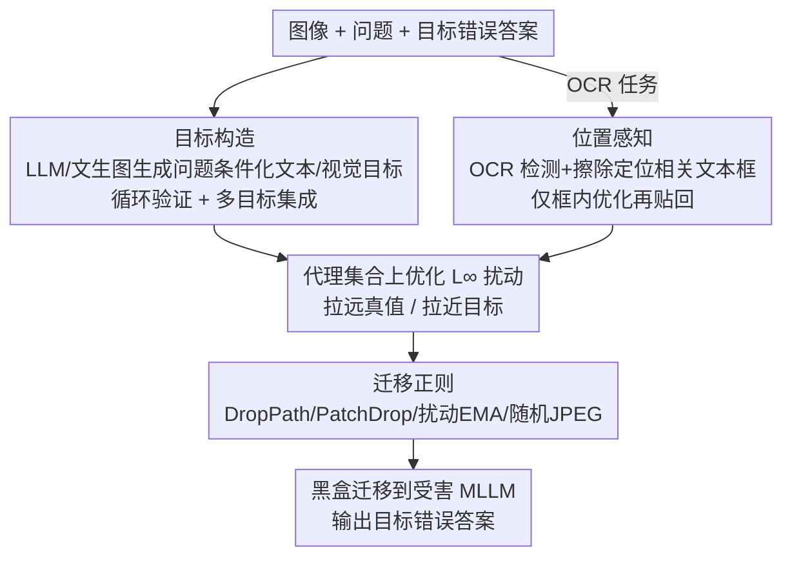

# Omni-Attack: Adversarial Attacks on Open-Ended VQA in Black-Box Multimodal LLMs

**会议**: CVPR 2026  
**论文**: [CVF Open Access](https://openaccess.thecvf.com/content/CVPR2026/html/Hu_Omni-Attack_Adversarial_Attacks_on_Open-Ended_VQA_in_Black-Box_Multimodal_LLMs_CVPR_2026_paper.html)  
**代码**: https://github.com/hukkai/transferable_mllm_attack  
**领域**: 多模态 LLM 安全 / 对抗攻击  
**关键词**: 黑盒对抗攻击, 多模态大模型, 开放式 VQA, 迁移攻击, OCR 攻击

## 一句话总结
针对"开放式 VQA/OCR 任务没有显式攻击目标、现有对抗鲁棒性评测各用各的协议"两大空白，本文先建了统一的定向攻击基准 **AdvRobustBench**（1000 题，VQA+OCR），再提出迁移式黑盒攻击 **Omni-Attack**（用 LLM 生成"问题条件化"的文本/视觉目标 + OCR 位置感知扰动 + 四种迁移正则），在 GPT-4.1 上 $\epsilon=8/255$ 就把定向攻击成功率打到 71.8%。

## 研究背景与动机
**领域现状**：多模态大模型（MLLM/VLLM，如 GPT-4.1、Claude、Gemini）正被部署到自动驾驶、文档理解等安全关键场景。对视觉模型的对抗攻击早有研究，核心发现是**迁移式黑盒攻击**——在代理（surrogate）模型上构造扰动、迁移到目标模型——非常有效；近期工作也证实 MLLM 同样会被对抗图像扰动操控。

**现有痛点**：① **任务太简单**——现有 MLLM 对抗鲁棒性评测大多停留在粗粒度分类或短描述，而 MLLM 是"全能"模型，要做细粒度识别、文字阅读、推理，这些复杂真实任务上攻击是否还成立没人验证。② **评测协议各自为政**——MLLM 输出是开放式文本，不像纯视觉模型能用 CLIP 相似度衡量；不同工作用不同数据集、不同判定（关键词匹配 / LLM-as-judge），关键词匹配漏掉语义、LLM 判定对 prompt 敏感，无法公平横比。更隐蔽的问题是：很多判定允许"原类别和目标类别同时出现"就算成功，这会把模型幻觉误算成定向攻击成功，**高估**攻击率。

**核心矛盾**：把现有迁移攻击搬到开放式 VQA 时，**目标表征缺失**——以前目标是显式的句子/图片，损失就是把扰动图像的 embedding 拉向目标；但在"问题条件化的答案"设定下，直接拿一个短答案（如"Paris"）当目标，优化信号又弱又不稳。OCR 任务还多一层**局部性**：答案证据只在图像一小块区域，把目标文字优化到错误位置就会失败。

**本文目标**：(1) 建一个统一、可复现、能避免幻觉高估的定向攻击基准；(2) 设计一个能在复杂开放式任务上有效的迁移式黑盒攻击。

**切入角度**：既然短答案当目标信号弱，就用 LLM/文生图把答案"具象化"成一段问题条件化的目标描述/图像，给优化提供更强信号；OCR 的局部性就用 OCR 检测定位相关区域、只在该区域优化。

**核心 idea**：**目标构造 + 位置感知 + 迁移正则**三件套，把开放式 VQA/OCR 攻击转化成"有强目标信号的、局部精确的"标准迁移攻击。

## 方法详解

### 整体框架
Omni-Attack 在代理模型集合（CLIP 系）上构造 $L_\infty$ 范数受限扰动，目标是让扰动图像在所有代理上"远离真值表征、靠近目标表征"，再迁移到黑盒受害 MLLM。基本优化式为 $\delta^* = \arg\min_{\|\delta\|_p \le \epsilon} \sum_i [S_i(x_\delta, x_G) - S_i(x_\delta, x_T)]$（$S_i$ 是第 $i$ 个代理的相似度，$x_G$/$x_T$ 是真值/目标表征）。整条 pipeline：先**目标构造**把问题条件化的答案变成文本/视觉目标（带循环验证与多目标集成）；OCR 任务额外走**位置感知**把问题转成只在相关文本框内优化；最后叠加**迁移正则**抑制对代理的过拟合。VQA 与 OCR 共用前后两块，OCR 多插一个定位步骤。

### 关键设计

**1. 目标构造：把弱信号的短答案变成强信号的问题条件化目标**

针对"短答案目标信号弱"的痛点。很多问题要推理（问城市位置要先想地标）或涉及抽象概念（问"是否拥挤"要联想到人多），单个词如"Paris"根本没编码这些显著视觉属性。于是用 **LLM 推理具象化**：给 LLM 问题 $Q$ 和目标选项 $T$，让它"想象若 $T$ 是正确答案、图像会长什么样"并生成一段 caption 作为文本目标 $x_T \leftarrow \text{LLM}(V, Q, T)$；真值表征 $x_G$ 就是原图 caption。视觉目标则用文生图模型按 $x_T$ 生成。为防 LLM 出错，加两个机制：**循环验证**——把候选 caption（不给图）和问题喂回 LLM，若它没返回目标选项就重新生成，直到通过（$\text{LLM}(x_T, Q)=T$）；**多目标集成**——用 $M$ 个不同 LLM 各生成目标，定义对代理 $i$ 的 softmax 分数 $p_i^{(j)} = \frac{\exp(S_i(x_\delta, x_T^{(j)}))}{\sum_k [\exp(S_i(x_\delta, x_T^{(k)})) + \exp(S_i(x_\delta, x_G^{(k)}))]}$，把每个目标 caption 相对所有真值/目标候选归一化，目标改成 $\arg\min \sum_i\sum_j -\log p_i^{(j)}$，降低单一 LLM 偏差。实践中文本+视觉目标并用。

**2. 位置感知 OCR 攻击：把"局部证据"问题转回标准 VQA**

针对 OCR 的局部性痛点。问"这张收据来自哪家店"，把目标文字"GIANT EAGLE"优化到非"TRADER JOE"区域就白费。做法：用 OCR 检测器（PaddleOCR）框出所有文字实例，对每个框**擦除框内像素再问原问题**——若答案没变说明该框无关，若答案改变则该框相关。设相关框 $B=[x_m, y_m, x_M, y_M]$，外扩 $R=\min(x_M-x_m, y_M-y_m)/2$ 后只在该区域做目标优化，优化完把改动 patch 贴回原图。这样就把局部 OCR 攻击**约简成在定位区域上的标准 VQA 攻击**。

**3. 四种迁移正则：抑制对代理模型的过拟合**

针对"优化易过拟合代理特有弱点、迁移性差"的痛点。在不显著增加算力（不靠加更多代理）下叠四招：**DropPath**——按 $(i/L)p$ 概率跳过第 $i$ 个残差块（$p=0.2$），多样化代理前向路径、减少对深层过拟合；**PatchDrop**——对 ViT 代理随机丢弃部分 patch，降低 patch 共适应；**扰动滑动平均（EMA）**——维护 $\delta_{EMA} \leftarrow 0.99\delta_{EMA} + 0.01\delta$，得到更平滑、落在平坦极小点、更可迁移的扰动；**随机 JPEGify**——用可微 JPEG 压缩做增强（quality 取 $[0.5,1.0]$），因为多数视觉模型见过的多是 JPEG 图、对齐这一分布能提升迁移。

### 损失函数 / 训练策略
最佳实践：文本目标用 5 个 LLM（Qwen3-VL 30B、Gemma3 27B、GPT-4.1、Claude 3.7、Gemini 2.0）生成、再用 Qwen-Image 给每个文本目标生成视觉目标；代理集合为 3 个 CLIP 模型（ViT-H-14-378 DFN、ViT-SO400M-14-384 SigLip、ViT-H-14-CLIPA-336 Datacomp1B）。总目标按式 (4) 合并文本与视觉损失。威胁模型：定向、黑盒（迁移）、$L_\infty$ 受限，预算 $\epsilon \in \{8/255, 16/255\}$。

## 实验关键数据

### 主实验
**评估指标 ASR（scaled attack success rate）**：$ASR = \frac{\sum_i x_i y_i}{\sum_i x_i}$，其中 $x_i=1$ 表示干净图上模型答对、$y_i=1$ 表示扰动图上模型输出指定错误答案——即只在"干净时本来答对"的样本上算定向成功率，隔离掉非攻击因素；每例 3 次独立运行取平均。

AdvRobustBench 上各受害 MLLM 的 ASR（%）：

| 受害模型 | MMBench 8/255 | MMBench 16/255 | OCRBench-v2 8/255 |
|------|------|------|------|
| GPT-4.1 | **71.8** | 80.1 | 25.2 |
| GPT-4o | 69.8 | 76.1 | 24.6 |
| Qwen3-VL 30B | 67.1 | 77.5 | 25.3 |
| Gemini 2.0 | 65.8 | 75.2 | 22.8 |
| Claude 3.7 | 15.5 | 46.8 | 4.6 |
| Claude 3.5 | 13.9 | 44.7 | 4.3 |

Claude 系明显更鲁棒（尤其小扰动 $\epsilon=8/255$）；OCRBench-v2 是最难的一档，因为 CLIP 编码器对文字较弱、文字图白底放大感知对比、可优化像素少。随机扰动 $\epsilon=16/255$ 下 GPT-4.1/Claude 3.7 的 ASR 近 0，说明攻击确为定向而非噪声。

### 消融实验

| 配置 | GPT-4.1 ASR | 说明 |
|------|---------|------|
| 完整（3 CLIP 代理, $\epsilon=8/255$） | 71.8 | 最佳实践 |
| 2 CLIP + DINO-v2 | 65.6 | 纯视觉模型不适合迁移攻击 |
| 2 CLIP + AdvXL | 60.0 | 对抗训练模型当代理反而更差 |
| 3 个小 CLIP @224 | 56.8 | 低分辨率 CLIP 迁移性差 |
| 6 CLIP 代理 | 71.9 | 加到 6 个几乎无增益（3 个已够） |
| 文本目标 ×1（无循环验证） | 67.1 | 循环验证带来稳定增益 |
| 文本目标 ×5 + 循环验证 | 69.8 | 多目标集成，约 5 个后饱和 |

### 关键发现
- **目标构造是成败关键**：相比直接拼"选项+问题"当目标，LLM 具象化 + 循环验证 + 多目标集成显著提升 ASR；目标数约 5 个后增益饱和，文本+视觉融合进一步提升。
- **代理选型 > 代理数量**：大分辨率 CLIP 最适合（与黑盒 MLLM 的大视觉编码器更对齐），DINO-v2/对抗训练模型/小分辨率 CLIP 都更差；代理从 3 加到 6 几乎无增益。
- **VQA 设定能避免幻觉高估**：相比可同时出现两类别的旧协议，多选 VQA 的确定性判定让 ASR 更可信。
- **横比碾压旧方法**：MMBench split（$\epsilon=8/255$）上 Omni-Attack 对 GPT-4.1 达 71.8%，而 AttackVLM 3.4%、SSA-CWA 6.9%、AnyAttack 9.5%、M-Attack 2.8%。

## 亮点与洞察
- **用生成模型给开放式任务"补出"攻击目标**：把"问题条件化的答案"通过 LLM 想象具象化为强目标信号，是把迁移攻击从分类/短描述推广到推理类 VQA 的关键一招，思路可迁移到任何缺显式目标的开放式攻击/对齐评测。
- **循环验证 + 多目标集成治 LLM 噪声**：用"不给图反问 LLM 能否答出目标选项"来过滤劣质目标，是个轻量又自洽的自检机制，可复用在任何"LLM 生成需自验"的流水线。
- **位置感知把局部 OCR 约简成标准 VQA**：擦除-观察-定位再局部优化，巧妙绕开"目标文字落错位置"的失败模式，是个干净的问题转化。
- **建了统一基准并指出幻觉高估陷阱**：AdvRobustBench 用确定性判定隔离模型幻觉，纠正了以往评测高估攻击率的系统性偏差，对领域可复现性贡献大。

## 局限与展望
- 攻击仅针对单图 VQA/OCR，多图比较类问题被显式排除；外推到多图/视频/agent 场景的复杂度未验证。
- OCR split ASR 仍偏低（GPT-4.1 仅 25.2%@8/255），说明文字类对抗攻击仍是难点，CLIP 代理对文字弱是瓶颈。
- 最佳实践依赖 5 个 LLM + 文生图 + 多 CLIP 代理，构造目标的算力/调用成本不低，论文未细算端到端开销。
- 作为攻击方法存在被滥用风险；作者立场是揭示 MLLM 漏洞以促进防御，但相应防御方案本文未给出。
- ⚠️ 部分公式与符号（如归一化分数 $p_i^{(j)}$、JPEG/DropPath 具体式）以原文为准。

## 相关工作与启发
- **vs AttackVLM / Zhao et al.**: 它们把扰动 embedding 对齐到显式句子/图片目标，且多在 ImageNet/COCO 上用 CLIP 相似度评，迁移到推理类开放 VQA 信号弱；本文用 LLM 具象化补目标，MMBench 上 ASR 71.8% vs 3.4%。
- **vs AnyAttack**: 靠大规模生成器产目标文本但算力高、且判定允许"高度相关"易高估；本文用确定性多选判定 + 循环验证，更省更可信（9.5%→71.8%）。
- **vs M-Attack**: 需要目标图像且用关键词/LLM 判定，易受幻觉影响；本文 VQA 设定强调推理、避免幻觉高估，横比领先（2.8%→71.8%）。
- **vs 多模态越狱攻击（jailbreak）**: 越狱关注绕过内容限制、且文献报告受害-代理间几乎不迁移；本文目标是诱导定向错误输出，证明在此目标下迁移攻击高度有效。

## 评分
- 新颖性: ⭐⭐⭐⭐ "LLM 具象化目标 + 位置感知 OCR + 迁移正则"组合针对开放式攻击空白，角度新；单项正则多为已有技术的适配。
- 实验充分度: ⭐⭐⭐⭐⭐ 覆盖 6 个主流 MLLM、两档预算、目标构造/代理/横比多组消融，并自建统一基准。
- 写作质量: ⭐⭐⭐⭐ 动机与痛点梳理清晰、方法分块明确；公式排版较密。
- 价值: ⭐⭐⭐⭐⭐ 揭示 GPT-4.1 等闭源 MLLM 在 $\epsilon=8/255$ 即可被 71.8% 定向攻陷，并提供可复现基准，对安全部署警示意义大。

<!-- RELATED:START -->

## 相关论文

- [\[CVPR 2026\] V-Attack: Targeting Disentangled Value Features for Controllable Adversarial Attacks on LVLMs](v-attack_targeting_disentangled_value_features_for_controllable_adversarial_atta.md)
- [\[CVPR 2026\] Towards Robust Multimodal Large Language Models Against Jailbreak Attacks](towards_robust_multimodal_large_language_models_against_jailbreak_attacks.md)
- [\[AAAI 2026\] GraphTextack: A Realistic Black-Box Node Injection Attack on LLM-Enhanced GNNs](../../AAAI2026/llm_safety/graphtextack_a_realistic_black-box_node_injection_attack_on_llm-enhanced_gnns.md)
- [\[CVPR 2026\] Demographic Fairness in Multimodal LLMs: A Benchmark of Gender and Ethnicity Bias in Face Verification](demographic_fairness_in_multimodal_llms_a_benchmark_of_gender_and_ethnicity_bias.md)
- [\[AAAI 2026\] PSM: Prompt Sensitivity Minimization via LLM-Guided Black-Box Optimization](../../AAAI2026/llm_safety/psm_prompt_sensitivity_minimization_via_llm-guided_black-box_optimization.md)

<!-- RELATED:END -->
