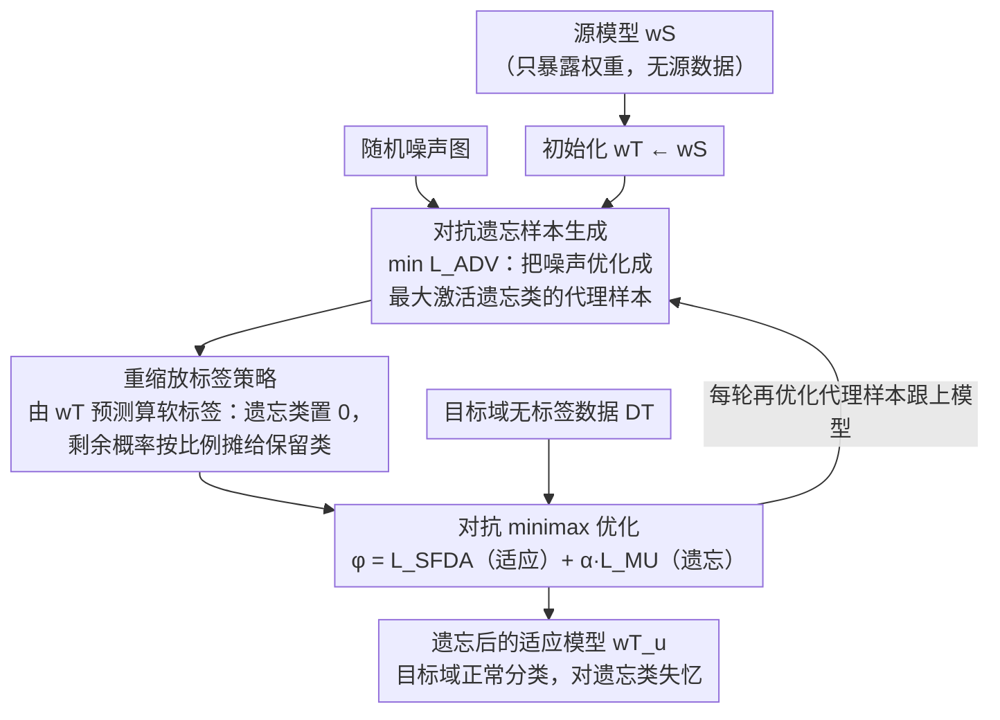

# ⊘ Source Models Leak What They Shouldn't ↛: Unlearning Zero-Shot Transfer in Domain Adaptation Through Adversarial Optimization

**会议**: CVPR 2026  
**arXiv**: [2604.08238](https://arxiv.org/abs/2604.08238)  
**代码**: [https://github.com/D-Arnav/SCADA](https://github.com/D-Arnav/SCADA)  
**领域**: 机器遗忘 / 域自适应 / 隐私保护  
**关键词**: 机器遗忘, 源域隐私泄漏, 无源域自适应, 对抗优化, 零样本迁移

## 一句话总结

发现无源域自适应（SFDA）方法会不经意地将源域独有类别的知识泄漏到目标域（零样本迁移现象），提出 SCADA-UL 框架通过对抗生成遗忘样本和重缩放标签策略，在域自适应过程中同时完成类别遗忘，达到接近从头训练的遗忘效果。

## 研究背景与动机

**领域现状**：视觉模型越来越多地被跨域应用（如从自然图像到卫星图像、医学扫描等），源域到目标域的适应技术（domain adaptation）是这一过程的关键支撑。其中无源域自适应（Source-Free Domain Adaptation, SFDA）因为不需要访问源域数据，在隐私敏感场景中尤其受欢迎——源域数据被保护、不可访问，只有预训练的源模型被暴露给目标域。

**现有痛点**：虽然源数据本身被保护了，但源模型仍然编码了源域的知识。作者通过实验发现了一个令人警惕的现象：现有 SFDA 方法在目标域上对**源域独有类别**（source-exclusive classes，即只存在于源域而不存在于目标域的类别）展现出强烈的零样本分类能力。这意味着即使目标域中不包含这些类别的任何样本，经过 SFDA 后的模型仍然"记住"了它们——源域的隐私信息通过模型被泄漏到了目标域。

**核心矛盾**：SFDA 的初衷是保护源域隐私，但模型本身成为了隐私泄漏的载体。现有的机器遗忘（Machine Unlearning, MU）方法设计时没有考虑数据分布偏移（domain shift）的情况，因此无法直接应用于 SFDA 场景——遗忘操作在分布偏移下会失效或损害目标域的正常性能。

**本文目标**：(1) 正式定义 SFDA 中的源域类别遗忘问题（SCADA-UL）；(2) 设计能在域自适应过程中同步执行遗忘的方法；(3) 扩展到持续学习版本和遗忘类别未知的变体。

**切入角度**：作者观察到 SFDA 后模型对源域独有类别的零样本能力来自于源模型权重中编码的判别特征。如果能在适应过程中生成"遗忘类别"的合成样本，然后主动让模型"遗忘"这些样本对应的知识，就能在不访问真实源数据的情况下完成遗忘。

**核心 idea**：通过对抗优化生成遗忘类别的样本，结合重缩放标签策略（rescaled labeling），在 SFDA 过程中同步完成域适应和类别遗忘。

## 方法详解

### 整体框架

SCADA-UL 要在一个棘手的设定下工作：手里只有源域预训练好的分类模型和一批无标签的目标域数据，源数据本身碰不到，却要把模型对"源域独有类别"的记忆抹掉，同时还得让模型正常适应目标域。难点在于，遗忘的对象（源域独有类别）在目标域里根本没有样本，没法像常规遗忘那样拿真实的遗忘集去训练。

整篇方法的思路可以串成一条线：既然真实样本拿不到，就**用源模型自己编码的判别信息反向生成**遗忘类别的代理样本（对抗遗忘样本生成）；有了代理样本，再给它们配上一套**遗忘类置 0、剩余概率按模型自身预测比例摊给保留类**的软标签（重缩放标签策略），让遗忘训练的梯度稳定又对路；最后把"适应目标域"和"遗忘源域类别"这两个互相冲突的目标放进一个 **minimax 对抗框架**里交替优化，让二者达到平衡。整个过程从 $w^T\leftarrow w^S$ 出发、每轮还要把代理样本重新优化一遍跟上模型，最终输出的模型既能在目标域上正常分类，又对源域独有类别"失忆"。

### 关键设计

**1. 对抗遗忘样本生成：没有源数据，就从模型里把它"逼"出来**

SFDA 设定下真实源样本不可访问，但源模型的权重已经把每个类别的判别特征编码了进去——这正是可以反向利用的信息。具体做法是把一张随机噪声图 $x_{\text{syn}}$ 当作可优化变量，沿着梯度上升方向求解 $\max_{x_{\text{syn}}} p(y_{\text{forget}} \mid x_{\text{syn}}; \theta)$，直到它能最大程度激活遗忘类别的分类头。生成出来的样本视觉上并不像真实图像，但在特征空间里恰好落进遗忘类别的决策区域，足以充当"遗忘训练集"。这是一种"用模型自身的知识来消除模型知识"的自反式策略：消融实验里用随机噪声替代对抗样本，遗忘效率掉了约一半，说明精准命中决策区域才是关键。

**2. 重缩放标签策略：遗忘类置 0，剩余概率按模型自身预测比例摊给保留类**

拿到代理样本后还要给它一个监督信号。直接的替代方案——给一个均匀分布或随机标签——要么把保留类别也一起冲垮（灾难性遗忘），要么遗忘和适应都做不好（论文 Table 6 验证）。重缩放标签的做法是：先取模型当前对该样本的 softmax 输出 $y$，把遗忘类别 $c_{\mathcal{F}}$ 那一维直接置 0，再把剩下的概率质量**按模型自己在各保留类别上的预测比例**重新归一化，即 $\hat{y}_i = 0$（若 $i=c_{\mathcal{F}}$），否则 $\hat{y}_i = y_i / \sum_{j\neq c_{\mathcal{F}}} y_j$。这样得到的软标签恰好是"假如这个样本不属于遗忘类，它最该归到哪个保留类"的理想答案。因为重分配是顺着模型已有判断来的，它与适应目标的冲突最小；论文进一步证明（Theorem 1）这种标签会让梯度更新更多落在保留类别的权重上、而非遗忘类，从而既稳又对路。消融里去掉它，遗忘过程不稳、保留类别准确率明显下滑。

**3. 对抗优化框架：让适应和遗忘在 minimax 里各退一步**

适应需要保留源模型的特征表达能力，遗忘却要删掉其中一部分特征，两者天生冲突。SCADA-UL 不强行加权求和，而是让它们交替博弈：域自适应目标通过熵最小化 / 伪标签学习把模型拉向目标域分布；遗忘目标则最大化遗忘类别的预测不确定性（等价于压低其预测概率）。训练时先在目标域数据上走一步适应更新，再在生成的遗忘样本上走一步遗忘更新，如此交替。这种 minimax 安排让遗忘不会过度伤及适应，最终在"适应得好"和"忘得干净"之间落到一个帕累托较优的点——消融里抽掉对抗优化，两个目标的冲突没人调停，两项指标一起变差。

### 损失函数 / 训练策略

训练优化两个目标的加权和 $\varphi = \mathcal{L}_{\text{SFDA}} + \alpha\,\mathcal{L}_{\text{MU}}$：域自适应损失 $\mathcal{L}_{\text{SFDA}}$ 是标准 SFDA 项（如 SF(DA)² 的邻域聚类、SHOT 的信息熵最小化），在目标域保留类别数据 $\mathcal{D}^{\mathcal{T}}_r$ 上把模型拉向目标分布；遗忘损失 $\mathcal{L}_{\text{MU}}$ 则在生成的代理样本上、用重缩放软标签 $\hat{y}$ 算交叉熵，引导模型在遗忘类别上"变笨"。这里并没有单独的"保留损失"——保留类别的性能由重缩放标签"最小冲突"的设计加上 $\mathcal{L}_{\text{SFDA}}$ 本身就在保留数据上训练共同守护。整个过程按算法 1 交替推进：每步先用 $\varphi$ 的梯度更新模型 $w^{\mathcal{T}}$，再用对抗损失 $\mathcal{L}_{\text{ADV}}$ 的梯度把代理样本 $\hat{x}$ 重新优化一遍，让它始终代表遗忘类——这正对应上面对抗框架里 $\min_{w^{\mathcal{T}}}/\max_{\hat{x}}$ 的交替。

在此基础上作者还扩展了两个变体：**持续遗忘版本**应对遗忘需求陆续到来的场景，要求模型在继续遗忘新类别时，不"回忆起"已经忘掉的旧类别、也不损害已保留的记忆；**未知遗忘类别版本**则不预先指定要忘哪些类别，而是借助目标域数据分布与模型预测之间的不一致性，自动检测出哪些源域类别需要遗忘。

## 实验关键数据

### 主实验（OfficeHome 数据集）

| 域对 | 方法 | 保留类别准确率 ↑ | 遗忘类别准确率 ↓ | 遗忘效果评分 |
|------|------|----------------|----------------|-------------|
| Art → Product | 现有 SFDA (SHOT) | 高 | 高（泄漏） | 差 |
| Art → Product | 现有 MU + SFDA | 中等 | 中等 | 不足 |
| Art → Product | **SCADA-UL (本文)** | **高** | **低（接近随机）** | **接近重训练** |
| Clipart → Real | 现有 SFDA (SHOT) | 高 | 高（泄漏） | 差 |
| Clipart → Real | **SCADA-UL (本文)** | **高** | **低** | **最优** |

注：实验在 OfficeHome 全部 12 个域对上进行，SCADA-UL 在所有域对上一致优于所有基线方法。

### 消融实验

| 配置 | 保留类别 Acc | 遗忘类别 Acc (↓更好) | 说明 |
|------|------------|-------------------|------|
| Full SCADA-UL | 最高 | 最低 | 完整模型 |
| w/o 对抗样本生成 | 下降 | 较高 | 无法有效定位遗忘类别的决策区域 |
| w/o 重缩放标签 | 明显下降 | 中等 | 遗忘过程不稳定，损害保留类别 |
| w/o 对抗优化 | 下降 | 中等 | 域适应和遗忘冲突未被妥善处理 |
| 随机噪声替代对抗样本 | 下降 | 较高 | 随机样本无法有效触发遗忘类别的特征 |

### 关键发现

- **零样本泄漏现象确实存在且严重**：标准 SFDA 方法（如SHOT、NRC等）在源域独有类别上的零样本准确率可达 30-50%，远高于随机水平，证实了隐私泄漏风险
- **对抗样本生成是关键**：对比随机噪声，对抗生成的遗忘样本能将遗忘效率提升约 2 倍——因为它们精准定位到遗忘类别的决策区域
- **SCADA-UL 达到接近"重训练"水平的遗忘效果**——遗忘类别的准确率降至接近随机猜测水平，同时保留类别的性能几乎不受影响
- 持续遗忘变体中，方法展现出稳定的遗忘记忆保持能力，不会因新的遗忘任务而"回忆起"已遗忘的类别

## 亮点与洞察

- **发现了一个重要的隐私风险盲区**：SFDA 被认为是保护源域隐私的，但本文揭示了模型本身就是隐私泄漏通道。这个观察本身就很有价值——它表明"不访问数据"并不等于"不泄漏数据信息"
- **用模型的知识来消除模型的知识**：对抗样本生成的策略很巧妙——没有真实源数据，就利用模型自己编码的类别原型来反向生成遗忘目标。这种"自反性"的设计思路可以迁移到其他隐私保护场景
- **理论与实践结合**：论文不仅提供了实验验证，还给出了理论解释——从信息论角度分析了为什么 SFDA 模型会泄漏源域信息以及遗忘操作的信息论保证

## 局限与展望

- 当前仅在分类任务上验证，是否适用于目标检测、语义分割等更复杂的视觉任务有待探索
- 对抗样本生成的质量依赖源模型的判别能力——如果源模型本身在某些遗忘类别上就不强，生成的对抗样本可能无法有效覆盖决策边界
- "未知遗忘类别"变体的检测准确率受目标域类别分布的影响，极端不平衡时可能出现误判
- 实验主要在 OfficeHome 等中等规模数据集上进行，大规模（如 ImageNet-scale）的域自适应遗忘还需更多验证
- 方法假设遗忘类别之间是独立的，但某些类别可能共享特征子空间，遗忘一个可能会影响相关类别

## 相关工作与启发

- **vs SHOT (Liang et al. 2020)**：SHOT 是经典 SFDA 方法，通过信息熵最小化和伪标签实现域自适应，但完全没有考虑源域信息遗忘问题
- **vs Machine Unlearning 方法 (如 SCRUB, Bad Teaching)**：传统 MU 方法假设数据分布不变，在域偏移场景下遗忘效果显著下降——它们的遗忘操作可能把有用的目标域知识也一起删了
- **vs Differential Privacy**：差分隐私在训练阶段添加噪声，是一种前向保护；SCADA-UL 是一种后向保护——对已训练好的模型进行遗忘
- 启发：类似的隐私泄漏问题可能存在于模型蒸馏、联邦学习等其他模型共享场景中

## 评分

- **新颖性**: ⭐⭐⭐⭐ 发现 SFDA 中的零样本泄漏问题并形式化定义 SCADA-UL 是重要贡献；方法设计（对抗生成+重缩放标签+minimax）自然但有效
- **实验充分度**: ⭐⭐⭐⭐ 覆盖全部 12 个域对、三个变体设定、多种基线对比，消融和理论分析完善
- **写作质量**: ⭐⭐⭐⭐ 问题动机阐述清晰，从现象观察到方法设计的逻辑链条完整
- **价值**: ⭐⭐⭐⭐ 揭示了 SFDA 的隐私盲区，对安全敏感场景（医疗、军事图像）有直接意义

<!-- RELATED:START -->

## 相关论文

- [\[CVPR 2026\] Do Vision-Language Models Leak What They Learn? Adaptive Token-Weighted Model Inversion Attacks](vlm_model_inversion_adaptive_token_weight.md)
- [\[ICML 2025\] Visual Language Models as Zero-Shot Deepfake Detectors](../../ICML2025/llm_safety/visual_language_models_as_zero-shot_deepfake_detectors.md)
- [\[ACL 2026\] CiPO: Counterfactual Unlearning for Large Reasoning Models through Iterative Preference Optimization](../../ACL2026/llm_safety/cipo_counterfactual_unlearning_for_large_reasoning_models_through_iterative_pref.md)
- [\[CVPR 2026\] Designing to Forget: Deep Semi-parametric Models for Unlearning](designing_to_forget_deep_semi-parametric_models_for_unlearning.md)
- [\[CVPR 2026\] Towards Reasoning-Preserving Unlearning in Multimodal Large Language Models](towards_reasoning-preserving_unlearning_in_multimodal_large_language_models.md)

<!-- RELATED:END -->
