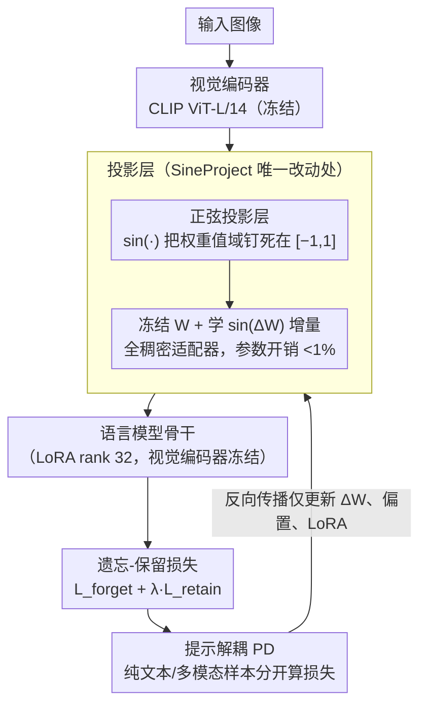

# SineProject: Machine Unlearning for Stable Vision–Language Alignment

**会议**: CVPR 2026  
**arXiv**: [2511.18444](https://arxiv.org/abs/2511.18444)  
**代码**: [有](https://github.com/arpit2412/SineProject)  
**领域**: LLM安全  
**关键词**: 机器遗忘, 多模态大模型, 视觉-语言对齐, 投影层稳定性, Jacobian条件数

## 一句话总结

针对多模态大模型（MLLM）在机器遗忘过程中投影层 Jacobian 严重病态导致视觉-语言对齐漂移的问题，提出 SineProject——通过对投影层权重施加正弦调制（sin(ΔW)）来约束参数范围至 [-1,1]，从而将 Jacobian 条件数降低 3-4 个数量级，在完全遗忘目标知识的同时将良性查询误拒率（SARR）降低 15%。

## 研究背景与动机

### 1. 领域现状

多模态大模型（MLLMs，如 LLaVA、BLIP-2、GPT-4V）正日益部署于医疗诊断、内容审核等安全敏感场景。隐私法规（如 GDPR）和安全需求要求模型能**选择性遗忘**特定知识（不安全内容、隐私信息），而无需完全重新训练。

### 2. 痛点

现有遗忘方法主要为纯文本 LLM 设计（如 Gradient Ascent、KL 散度最小化、Preference Optimization），当直接迁移到 MLLM 时**灾难性失败**：

- SafeEraser 报告基于梯度的方法在 LLaVA-1.5-7B 上的安全回答拒绝率（SARR）高达 **100%**——模型不仅拒绝有害查询，也拒绝所有良性查询
- MLLMU-Bench 显示隐私实体遗忘任务中模型能力严重退化

### 3. 核心矛盾

MLLM 不同于纯文本 LLM，其视觉和语言表示通过精心训练的**投影层**（projector）实现几何耦合对齐。遗忘操作必须在擦除目标知识的同时，保持这种跨模态几何对齐——这是一对根本性矛盾。

### 4. 要解决什么

作者将失败的根源归结为**对齐漂移（Alignment Drift）**——遗忘过程中视觉-语言几何对齐的系统性退化，表现为三个关联现象：

- **频谱不稳定**：投影层 Jacobian 条件数在遗忘中增长 3-4 个数量级
- **模态解耦**：视觉与语言嵌入偏离最优对齐
- **表示坍缩**：模型丧失区分有害/良性内容的能力，导致无差别拒绝

### 5. 切入角度

现有方法修改的是语言骨干网络或视觉编码器，忽视了**投影层**这一跨模态信息流动的唯一通道。作者将关注点转移到投影层的 Jacobian 条件特性上。

### 6. 核心 Idea

对投影层的冻结权重 W 附加可训练参数 ΔW，并对 ΔW 施加正弦变换 sin(ΔW)，使更新始终有界于 [-1,1]。这等价于一种**隐式频谱正则化器**，约束了 Jacobian 的谱特性，防止遗忘过程中条件数爆炸。

## 方法详解

### 整体框架

SineProject 想解决的是「遗忘的同时别把视觉-语言对齐弄崩」，而它的全部改动只落在投影层这一个地方。标准 MLLM 的数据流是「视觉编码器 → 投影层 MLP → 语言模型」，投影层是一个两层 MLP：$F(x) = W_2 \phi(W_1 x + b_1) + b_2$（$\phi$ 为 GELU/ReLU）。SineProject 不动语言骨干、不动视觉编码器、也不改遗忘损失，只把投影层的权重换一种参数化方式包起来，于是它能像补丁一样挂到任何现成的遗忘流水线上。整条链路里真正被改写的就是 $W_1, W_2$ 进入前向的形式——其余部分照常训练、照常算 forget/retain 损失。

### 关键设计

**1. 正弦投影层：用 sin(·) 把权重值域钉死在 [-1,1]，从源头掐住 Jacobian 爆炸**

前面诊断出的病根是「遗忘时投影层 Jacobian 条件数暴涨 3-4 个数量级」，本质是权重在优化中可以无限制地往大里长。SineProject 的做法直接而强硬：把投影层重写成 $G(x) = \sin(W_2)\phi(\sin(W_1)x + b_1) + b_2$，sin(·) 逐元素作用在权重上。因为 sin 的值域恒在 [-1,1]，无论优化器怎么推权重，进入前向的有效权重幅度都被锁死。论文的 Theorem 3.1 证明了这一步带来的好处：Jacobian 里 $\nabla_{W_1}G$、$\nabla_{W_2}G$、$\nabla_{b_2}G$ 三个块都因此有界，只剩 $\nabla_{b_1}G$ 仍可能无界。对比标准 MLP——它的 Jacobian 在 $W_1, W_2$ 变大时多个块都能任意增长，正是这种放任造成了频谱失稳。所以这个 sin 包裹相当于一个**隐式的频谱正则化器**，不需要额外的正则项就把谱特性管住了。

**2. 冻结预训练权重、只学 sin(ΔW) 增量：既保住已学知识又拿到频谱稳定性**

直接对预训练好的 W 套 sin 会有个副作用——sin 会把原本学好的权重值整个改写一遍，等于砸掉已有知识。SineProject 绕开这一点的办法是：冻结原始权重 W，另外引入一组随机初始化的可训练增量 ΔW，最终生效的权重写成 $W + \sin(\Delta W)$，即 $(W_2 + \sin(\Delta W_2))\phi((W_1 + \sin(\Delta W_1))x + b_1) + b_2$。这样 W 完整保留了预训练知识，而 sin(ΔW) 这一项既负责承载遗忘所需的更新、又因为有界性继续提供频谱约束。从结构上看它其实是一个**全稠密适配器（fully dense adapter）**——和 LoRA 思路相近，但更新走的是有界的 sin 通道而非低秩分解，额外参数开销不到 1%。

**3. 提示解耦（Prompt Decoupling, PD）：纯文本样本和多模态样本分开算损失，压住过度遗忘**

遗忘里一个常见副作用是「学过头」——模型为了拒绝有害内容，连良性查询也一并拒了。PD 沿用 SafeEraser 的做法，把 forget 集拆成纯文本部分 $D_f^{(text)}$ 和多模态部分 $D_f^{(mm)}$，两者各自计算损失而不混在一起，从而避免文本侧的遗忘压力溢出到多模态对齐上。这一步和前两个设计正交：sin 投影层管的是频谱稳定，PD 管的是遗忘范围别失控，实验里 PD 对 SARR（良性误拒率）有明显改善。

### 损失函数 / 训练策略

遗忘目标函数为标准的 forget-retain 权衡：$\theta^* = \arg\min_\theta \mathcal{L}_{forget}(\theta; D_f) + \lambda \mathcal{L}_{retain}(\theta; D_r)$

- $\mathcal{L}_{forget}$：可采用 Gradient Descent、KL 散度最小化或 Preference Optimization（主实验用 PO+PD）
- $\mathcal{L}_{retain}$：保持 retain set 上的性能
- 训练时冻结视觉编码器，训练 LoRA 适配器（rank 32）和 sine-projector（ΔW₁, ΔW₂, b₁, b₂）
- 参数开销 <1%

## 实验关键数据

### 主实验

**表 1：SafeEraser 基准（安全遗忘）**

在 LLaVA-v1.5-7B 和 13B 上评估，Forget Quality 衡量遗忘效果（ASR↓、RR↑），Model Utility 衡量保留能力（ROUGE↑、GPT-Eval↑、Specificity↑、SARR↓）：

| 方法 | ASR(Eff.)↓ | RR(Eff.)↑ | ASR(Gen.)↓ | RR(Gen.)↑ | ROUGE↑ | GPT↑ | Spec.↑ | SARR↓ |
|------|-----------|----------|-----------|----------|--------|------|--------|-------|
| **LLaVA-7B** | | | | | | | | |
| GA | 0.0 | 0.0 | 0.0 | 0.0 | 0.0 | 0.0 | 15.3 | **100** |
| GD+PD | 2.8 | 0.0 | 0.5 | 0.4 | 61.6 | 82.8 | 50.7 | 28.0 |
| PO (无PD) | 0.1 | 100 | 0.1 | 100 | 65.2 | 85.4 | 63.7 | **100** |
| SafeEraser (PO+PD) | 0.2 | 100 | 0.2 | 99.7 | 65.4 | 86.2 | 64.4 | 30.3 |
| **SineProject (PO+PD)** | **0.1** | **100** | **0.1** | **99.9** | **65.8** | **86.3** | **65.2** | **25.8** |
| **LLaVA-13B** | | | | | | | | |
| SafeEraser (PO+PD) | 2.2 | 99.5 | 2.4 | 99.1 | 62.7 | 81.7 | 65.3 | 27.3 |
| **SineProject (PO+PD)** | **1.6** | **99.8** | **0.8** | **99.9** | **63.9** | **82.9** | **65.4** | **25.1** |

核心结论：SineProject 在保持 100% 遗忘的同时，SARR 从 30.3% 降至 25.8%（7B）、从 27.3% 降至 25.1%（13B），良性查询误拒大幅减少。

**表 2：MLLMU-Bench 基准（隐私遗忘，LLaVA-7B，综合得分 Avg.↑）**

| 方法 | 5% 删除 Avg.↑ | 10% 删除 Avg.↑ | 15% 删除 Avg.↑ |
|------|-------------|--------------|--------------|
| GA | 45.7 | 50.4 | 50.9 |
| Grad. Diff. | 50.2 | 56.8 | 51.4 |
| NPO | 51.8 | 44.5 | 53.5 |
| MMUnlearner | 53.9 | 52.4 | 51.8 |
| **SineProject (NPO)** | **62.1** | **68.4** | **66.2** |

核心结论：SineProject 在所有删除比例下综合得分均大幅领先（比最强基线 MMUnlearner 高 8-16 分），且随删除比例增大优势更明显，验证了几何稳定性对可扩展遗忘的重要性。

### 消融实验

- **函数选择**：sin(ΔW) 条件数 5.40×10²，远优于 spectral norm（1.15×10⁵）、weight clipping、LoRA、tanh、sigmoid；SARR 25.8% vs 34.1%
- **层级必要性**：W₁+W₂ 联合调制（25.8%）优于仅 W₂（26.5%）
- **损失泛化**：在 GD、KL、PO 三种损失下均稳定降低 SARR 0.8-4.5%，RR 保持 >99%
- **鲁棒性**：α∈[1,300] 范围内 SARR 变化 <0.3%（p=0.83）；10 个种子下方差降低 74%
- **架构泛化**：MLP 和注意力投影器上均降低 SARR 14.9-20.1%

### 关键发现

1. **几何稳定性是核心**：SafeEraser 的 W₂ Jacobian 条件数在遗忘过程中超过 10⁶，MIR 偏离最优区间至 >4.5；SineProject 控制条件数 <10³，MIR 稳定在 ~2.7（最优区间 [2.5, 3.0] 内）
2. **频谱动态**：基线的最大奇异值 σ_max 爆炸式增长、最小奇异值 σ_min 坍缩；SineProject 二者均保持稳定
3. **条件数与 SARR 强相关**：r=0.89（p<0.01），验证了理论分析的实际意义
4. **训练动态反转**：基线条件数恶化 3.3×，SineProject 改善 13.4×

## 亮点与洞察

1. **问题定位精准**：首次系统分析了多模态遗忘中"对齐漂移"的机制，通过 Jacobian 条件数将抽象的对齐崩溃转化为可量化、可诊断的频谱指标
2. **方法极简优雅**：仅需一个 sin(·) 变换，不改架构不改损失，参数开销 <1%，即可获得 3-4 个数量级的条件数改善
3. **理论与实验闭环**：Theorem 3.1 严格证明 sin projector 的 Jacobian 有界性，实验精确验证了理论预测
4. **即插即用**：与 GD/KL/PO 等多种遗忘损失兼容，可直接嵌入现有遗忘流水线

## 局限与展望

1. **架构范围**：主要针对 MLP 投影层优化，虽在 Q-Former/Resampler 上有泛化实验，但对 Flamingo 式深度交错跨模态交互架构尚未验证
2. **语义纠缠**：几何条件化保持对齐结构但不解决相关概念的语义纠缠——遗忘超过 25% 知识库时出现与条件化无关的容量-遗忘权衡
3. **认证遗忘保证缺失**：遗忘后的对抗微调可能部分恢复被遗忘信息，需结合认证防御机制
4. **仅作用于投影层**：未探索 sin 调制与 LoRA 适配器的联合优化（作者将此列为 future work）

## 相关工作与启发

- **机器遗忘基准**：TOFU、MUSE（单模态）→ SafeEraser、MLLMU-Bench（多模态）——多模态遗忘的评估体系正在快速完善
- **多模态对齐几何**：CLIP/LiT 的对比学习对齐 → 本文揭示这种对齐在遗忘中极其脆弱
- **NTK 理论应用**：将 Jacobian 条件数分析从预训练/微调扩展到遗忘场景，是 NTK 视角的新应用
- **启发**：有界变换的思路可能推广到其他需要"稳定修改"的场景（如持续学习、模型编辑）

## 评分

⭐⭐⭐⭐ 问题切入极精准、方法极简且有严格理论支撑，在两个基准上全面 SOTA；唯一遗憾是仅作用于投影层，对更广泛架构的适用性有待验证。

<!-- RELATED:START -->

## 相关论文

- [\[CVPR 2026\] VL-Eraser: Vacuum Distillation for Machine Unlearning in Vision-Language Models](vl-eraser_vacuum_distillation_for_machine_unlearning_in_vision-language_models.md)
- [\[ICLR 2026\] OFMU: Optimization-Driven Framework for Machine Unlearning](../../ICLR2026/llm_safety/ofmu_optimization-driven_framework_for_machine_unlearning.md)
- [\[CVPR 2026\] Towards Reasoning-Preserving Unlearning in Multimodal Large Language Models](towards_reasoning-preserving_unlearning_in_multimodal_large_language_models.md)
- [\[CVPR 2026\] Which Concepts to Forget and How to Refuse? Decomposing Concepts for Continual Unlearning in Large Vision-Language Models](which_concepts_to_forget_and_how_to_refuse_decomposing_concepts_for_continual_un.md)
- [\[ICML 2026\] DualOptim+: Bridging Shared and Decoupled Optimizer States for Better Machine Unlearning in Large Language Models](../../ICML2026/llm_safety/dualoptim_bridging_shared_and_decoupled_optimizer_states_for_better_machine_unle.md)

<!-- RELATED:END -->
