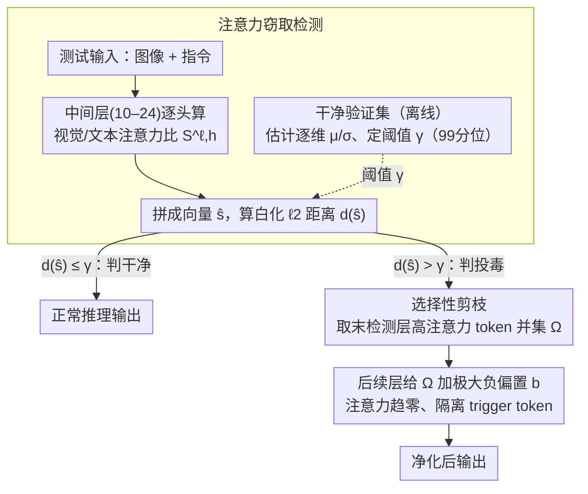

# Test-Time Attention Purification for Backdoored Large Vision Language Models

**会议**: CVPR 2026  
**arXiv**: [2603.12989](https://arxiv.org/abs/2603.12989)  
**代码**: 待确认  
**领域**: 多模态VLM  
**关键词**: 后门攻击防御, 注意力净化, LVLM安全, 测试时防御, 视觉token剪枝

## 一句话总结
发现LVLM后门行为的本质是跨模态注意力窃取（trigger视觉token抢夺文本token的注意力），提出CleanSight——首个无需训练的测试时后门防御框架，通过检测和剪枝高注意力trigger token来消除后门效应。

## 研究背景与动机
**领域现状**：LVLM通过微调轻量adapter适配下游任务已成为主流，但这也引入了后门攻击风险——攻击者可在微调数据中注入trigger样本，使模型在推理时遇到trigger就输出攻击者指定的结果。

**现有痛点**：现有防御方法主要是"训练时防御"——用干净数据重训练被后门污染的参数，计算成本高且常降低下游性能。少数测试时防御方法（如像素扰动）是为从零训练的模型设计的，对LVLM几乎无效。

**核心矛盾**：LVLM中的后门关联不在低层像素特征中，而在跨模态注意力交互中——这是与传统后门模型（如ViT、CLIP）本质不同的发现。像素扰动无法破坏这种注意力层面的后门关联。

**本文目标**：设计首个LVLM测试时后门防御方法，无需重训练、即插即用。

**切入角度**：发现"注意力窃取"现象——被投毒输入的visual token会异常夺取text token的注意力权重，且高注意力区域精确对应trigger区域。

**核心 idea**：通过检测注意力比异常并剪枝高注意力视觉token，在测试时消除后门而不改变模型参数。

## 方法详解

### 整体框架
CleanSight 的出发点是一个观察：后门 LVLM 在遇到 trigger 时，被投毒输入里的 visual token 会异常夺取本该流向 text token 的注意力，且这些"夺权"的 token 恰好落在 trigger 区域。整个防御完全在推理时完成、不碰任何模型参数：一条输入进来，先在跨模态融合最活跃的几个中间层量化"视觉抢了文本多少注意力"，据此判断它是不是投毒样本；一旦判为投毒，就把那些异常高注意力的 visual token 在后续层里屏蔽掉，让后门关联无从生效，而正常样本几乎不受影响。整个流程由两段构成——**注意力窃取检测**（含离线标定的干净参考分布）和**选择性剪枝**：

### 关键设计

**1. 注意力窃取检测：用视觉-文本注意力比把投毒输入挑出来**

后门关联藏在跨模态注意力里，而中间层正是视觉和文本融合最剧烈的地方，所以检测就放在一组中间层 $\mathcal{L}_{\text{det}}$（实验中 10–24 层最有效）。对其中每层每个注意力头，计算当前 query 投向视觉 token 与投向文本提示 token 的注意力之比 $S^{\ell,h} = \frac{\sum_{j\in\mathcal{I}_{\text{vis}}}\alpha_{q,j}^{\ell,h}}{\sum_{j\in\mathcal{I}_{\text{prm}}}\alpha_{q,j}^{\ell,h}}$——投毒输入会让这个比值在 trigger 相关的头上显著偏高。把所有头的比值拼成一个向量 $\hat{s}$，再和干净参考分布做白化后的 $\ell_2$ 距离

$$d(\hat{s}) = \left\|\tfrac{\hat{s}-\mu}{\sigma}\right\|_2,$$

距离超过阈值 $\gamma$ 就判为投毒。这里刻意保留头级粒度而不做头平均，因为窃取往往只发生在少数几个头上，平均会把信号稀释掉——保留后 AUROC 接近完美。这里的「干净基线」是离线标定出来的：在一个小规模干净验证集上为每个样本收集注意力比向量，估计逐维均值 $\mu$ 与标准差 $\sigma$，再把上式白化距离的 99 分位定为阈值 $\gamma$。它只需统计量级别的少量干净数据、不重训练，因此天然契合 FTaaS（微调即服务）这类用户拿不到训练过程、只能控制推理栈的部署场景。

**2. 选择性剪枝：把被 trigger 控制的 visual token 直接掐断**

检测出投毒之后，需要精确定位是哪些 visual token 在作乱。CleanSight 在最后一个检测层里，取所有头中注意力超过阈值 $\tau$ 的 visual token 的并集 $\Omega$——用并集而非交集，是为了哪怕只有单个头出现异常也能被捕获，不漏掉任何可疑位置。随后在这一层之后的所有层，给 $\Omega$ 里的位置加一个极大负偏置 $b\ll 0$，经过 softmax 后它们的注意力权重趋近于零，相当于把 trigger token 从信息流里隔离出去。由于剪掉的是 trigger 主导的少量 token，正常视觉内容基本不受影响，干净样本性能几乎无损。

### 损失函数 / 训练策略
CleanSight 是完全无训练的测试时方法，不涉及任何参数更新或损失函数，全部计算都在前向推理中完成。

## 实验关键数据

### 主实验 (VQAv2数据集上的ASR↓ / CU↑)

| 攻击方式 | No Defense ASR | CleanSight ASR | No Defense CU | CleanSight CU |
|---------|---------------|----------------|--------------|---------------|
| BadNet | 100.0 | **0.0** | 62.89 | 62.63 |
| Blended | 100.0 | **0.0** | 67.06 | 65.50 |
| ISSBA | 98.83 | **2.34** | 65.49 | 64.71 |
| WaNet | 100.0 | **0.0** | 68.10 | 67.32 |
| TrojVLM | 100.0 | **1.56** | 68.36 | 67.97 |
| VLOOD | 100.0 | **0.0** | 53.65 | 53.26 |

### 与baseline防御对比

| 防御方法 | BadNet ASR↓ | Blended ASR↓ | WaNet ASR↓ | 需要训练? |
|---------|------------|-------------|------------|---------|
| ST Defense | 82.81 | 97.66 | 92.58 | 否 |
| BDMAE | 88.28 | 100.0 | 99.22 | 否 |
| ZIP | 80.47 | 84.77 | 7.03 | 否 |
| CleanSight | **0.0** | **0.0** | **0.0** | 否 |

### 关键发现
- CleanSight在几乎所有攻击类型上将ASR降至接近0%，同时几乎不损失干净样本性能
- 传统像素扰动防御（Blur、ST Defense）对LVLM后门几乎无效，验证了注意力窃取机理的正确性
- 注意力扰动的效果随强度单调递增，当完全均匀化注意力时后门完全消失（即使trigger像素仍在）
- 检测层选在中间层（10-24层）最有效，与跨模态融合发生位置一致

## 亮点与洞察
- **机理发现意义重大**：揭示LVLM后门的本质不在像素而在注意力分配，这一发现改变了对VLM后门攻防的理解范式。可以指导未来设计更针对性的攻击和防御。
- **零训练开销**：作为即插即用的推理时方法，适合FTaaS（微调即服务）场景——用户无法控制训练过程但能控制推理栈。
- **与视觉token剪枝（如FastV）的联系**：有趣地将效率导向的token剪枝转化为安全导向的防御手段。

## 局限与展望
- 需要小规模干净验证集来估计参考分布，在完全无干净数据的场景下不适用
- 阈值 $\gamma$ 和 $\tau$ 的设定对不同模型和攻击可能需要调整
- 仅验证了adapter/LoRA级别的后门攻击，对全参数后门的适用性未知
- 检测在首个token解码时进行，对流式生成场景的延迟影响值得分析

## 相关工作与启发
- **vs FastV**：FastV剪枝低注意力视觉token以加速推理；CleanSight剪枝高注意力token以消除后门，方向相反但机制相似
- **vs ZIP**：ZIP通过像素级扰动防御，对BadNet仍有80% ASR；CleanSight通过注意力扰动将ASR降至0%

## 评分
- 新颖性: ⭐⭐⭐⭐⭐ 首次揭示LVLM后门的注意力窃取机理，开辟测试时防御新方向
- 实验充分度: ⭐⭐⭐⭐⭐ 覆盖6种攻击、多数据集、多对比基线
- 写作质量: ⭐⭐⭐⭐⭐ 逻辑清晰，从机理发现到方法设计一气呵成
- 价值: ⭐⭐⭐⭐⭐ 对LVLM安全领域有重要推动作用

<!-- RELATED:START -->

## 相关论文

- [\[CVPR 2025\] CleanSight: Test-Time Attention Purification for Backdoored Large Vision Language Models](../../CVPR2025/llm_safety/test-time_attention_purification_for_backdoored_large_vision_language_models.md)
- [\[ICML 2026\] Towards Fine-Grained Robustness: Attention-Guided Test-Time Prompt Tuning for Vision-Language Models](../../ICML2026/llm_safety/towards_fine-grained_robustness_attention-guided_test-time_prompt_tuning_for_vis.md)
- [\[CVPR 2026\] FairLLaVA: Fairness-Aware Parameter-Efficient Fine-Tuning for Large Vision-Language Models](fairllava_fairness-aware_parameter-efficient_fine-tuning_for_large_vision-langua.md)
- [\[CVPR 2026\] Interpretable Debiasing of Vision-Language Models for Social Fairness](interpretable_debiasing_of_vision-language_models_for_social_fairness.md)
- [\[CVPR 2026\] Which Concepts to Forget and How to Refuse? Decomposing Concepts for Continual Unlearning in Large Vision-Language Models](which_concepts_to_forget_and_how_to_refuse_decomposing_concepts_for_continual_un.md)

<!-- RELATED:END -->
