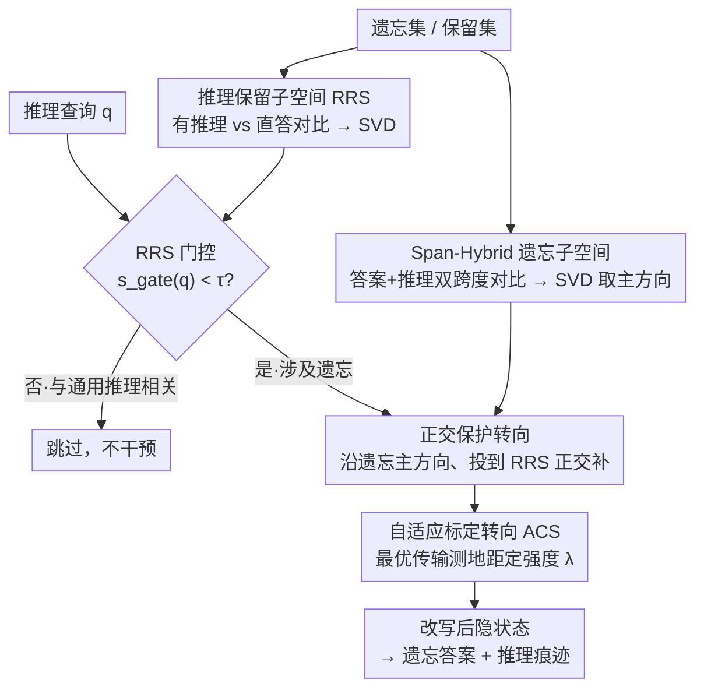

# Towards Reasoning-Preserving Unlearning in Multimodal Large Language Models

**会议**: CVPR 2026  
**论文**: [CVF Open Access](https://openaccess.thecvf.com/content/CVPR2026/html/Li_Towards_Reasoning-Preserving_Unlearning_in_Multimodal_Large_Language_Models_CVPR_2026_paper.html)  
**代码**: 待确认  
**领域**: 多模态VLM / 机器遗忘 / AI安全  
**关键词**: 机器遗忘, 推理多模态大模型, 激活转向, 推理泄漏, 子空间投影

## 一句话总结
针对"会思考"的多模态大模型，提出基准 RMLLMU-Bench 专门衡量**推理链里的信息泄漏**与**推理能力保留**，并给出一个免训练、推理时介入的框架 R-MUSE——通过子空间引导 + 自适应转向，在遗忘目标答案和中间推理痕迹的同时尽量不破坏通用推理。

## 研究背景与动机

**领域现状**：机器遗忘（machine unlearning）让模型在不全量重训的前提下"忘掉"指定数据。多模态大模型（MLLM）上的遗忘方法大多照搬纯文本 LLM 的梯度上升、偏好优化、定向微调，作用对象主要是**最终答案**或短回复。

**现有痛点**：当 MLLM 进化成"会先输出 chain-of-thought 再答题"的推理多模态大模型（RMLLM）后，只改最终答案远远不够。论文 Figure 1 给了两个很尖锐的失败模式：① 传统 MLLM 遗忘法把答案改对了，但中间推理链却把记忆中的事实重新推了出来（**推理泄漏 Reasoning Leakage**）——"她在斯德哥尔摩大学读书，所以住在斯德哥尔摩"；② 传统 LRM（语言推理模型）遗忘法压住了泄漏，却把推理压垮成"wait, no, wait, no, I'm not sure"的语无伦次（**推理能力被破坏**）。

**核心矛盾**：抑制推理泄漏和保留通用推理之间存在直接 trade-off——干预越狠越不泄漏，但通用推理也越容易崩。而当时**没有任何基准**同时度量这两件事。

**本文目标**：(1) 建一个能同时测"推理链泄漏"和"推理能力保留"的基准；(2) 找一个能两头兼顾、且不需要重训的遗忘方法。

**切入角度**：近期工作发现少量样本的影响、乃至"推理"这种高层能力，往往集中在模型激活的**低维线性子空间**里，可以用线性方向去调控。既然如此，遗忘也可以建成"沿某个方向转向激活"——关键是要找对**转向哪个方向、在哪转、转多狠**，把"该忘的"和"要留的推理能力"在子空间里分开。

**核心 idea**：用"遗忘子空间 + 推理保留子空间正交保护 + 最优传输自适应强度"的推理时激活转向，定向擦除答案与推理痕迹，而不碰支撑通用推理的方向。

## 方法详解

### 整体框架
论文有两个层面的贡献：一个**评测基准 RMLLMU-Bench**，一个**遗忘方法 R-MUSE**。基准在已有的 MLLMU-Bench 上给每条样本补上结构化推理链，并加两个推理感知指标 RIL（推理信息泄漏）和 RCR（推理能力保留）。方法 R-MUSE 是免训练、推理时介入的激活转向框架，围绕三个问题展开：**转向什么（what）、在哪转 / 何时转（where/when）、转多强（how strong）**。

离线阶段先从遗忘集构造"答案 + 推理"双跨度对比的**遗忘子空间**，再从保留集构造"有推理 vs 直答"对比的**推理保留子空间 RRS**。推理时，对每个查询先用 RRS 门控判断要不要干预；要干预，就把遗忘主方向投影到 RRS 的正交补上（保护通用推理），并由最优传输距离自适应决定转向强度，最后在单位球上做 slerp 旋转得到改写后的隐状态。

### 关键设计

**1. RMLLMU-Bench 与推理感知指标 RIL/RCR：把"推理链泄漏"和"推理保留"量化出来**

已有 MLLM 遗忘基准只看最终预测有没有改、非遗忘数据效用有没有掉，完全测不到"推理链里偷偷漏信息"和"推理能力掉了多少"。本文给 MLLMU-Bench 每条样本补一段结构化推理链，构造时遵循三原则：可归因（每步绑定可验证证据）、保守（只用给定图文、不引入外部知识）、一致（逻辑自洽、与答案对齐）；用 Gemini-2.5-Pro 生成、Gemini-2.5-Flash 当 verifier 闭环自我修正，再加人工审。

两个核心指标：**RIL（推理信息泄漏）** 做两级检测——Level 1 规则匹配显式泄漏（推理文本里直接出现被遗忘属性字符串），Level 2 用 LLM 判官检测改写/语义隐含泄漏（如被遗忘"residence: Japan"，推理里说"He lives in Tokyo"也算漏），合成
$$\mathrm{RIL} = \alpha\cdot\frac{N_{\text{explicit}}}{N_{\text{total}}} + (1-\alpha)\cdot\frac{N_{\text{implicit}}}{N_{\text{total}}},\quad \alpha=0.5$$
RIL 越低说明推理层面忘得越干净。**RCR（推理能力保留）** 让判官对非遗忘样本的推理链独立判 3 次、多数投票，统计逻辑有效且有证据支撑的比例，越高说明通用推理保留得越好。这套度量是后面所有方法对比的"标尺"，没有它就看不出传统方法"答案改对了但推理在漏"的问题。

**2. Span-Hybrid 遗忘子空间：转向什么——同时盯住答案和推理痕迹**

只对最终答案 token 求差分，只能擦答案、擦不掉推理链里的痕迹。本文对每个遗忘样本构造一个"拒答式"引导正样本 $x_i^+$（问题 + 拒答前缀 + 理想拒答），把模型原本的答案形态、推理形态输出当负样本，然后**分别在答案跨度 $S_{\text{ans}}$ 和推理跨度 $S_{\text{cot}}$ 上做跨度池化**再相减，得到 $\Delta^{\text{ans}}_\ell(i)$ 和 $\Delta^{\text{cot}}_\ell(i)$。为防止某一路因原始方差大而主导，先对两路做 batch 内逐维 z-score 标准化再相加 $\Delta_\ell(i)=\mathrm{ZScore}(\Delta^{\text{ans}}_\ell)+\mathrm{ZScore}(\Delta^{\text{cot}}_\ell)$，最后堆叠做紧凑 SVD，取能量占比 $\ge\eta=0.8$ 的前 $k$ 个左奇异向量张成遗忘子空间 $U^{\text{un}}_\ell$。这样擦除方向同时覆盖"答案记忆"和"推理痕迹"两个层面，且混合发生在表示空间、两段 token 仍然解耦。论文还分别从 QA 对与图-问-答三元组各建一个子空间，分别管单模态与跨模态的遗忘方向。

**3. 推理保留子空间 RRS + 门控 + 正交保护：在哪转、何时转——别误伤通用推理**

如果对所有输入都沿遗忘子空间转向，会改到跟遗忘无关的查询、也会侵蚀通用推理。本文在保留集上用同一套跨度差分流程构造**推理保留子空间 RRS**：正负样本只差"有没有显式推理"（$x_i^+$ 是逐步解题、$x_i^-$ 是一句话直答），SVD 得到的方向就是"把隐状态推向充分推理、远离捷径直答"的方向。

它干两件事。**何时转（门控）**：在打分层用查询隐状态对 RRS 的对齐度
$$s_{\text{gate}}(q)=\frac{\lVert P^{\text{rrs}}_{\ell^*} h^{\text{end}}_{\ell^*}(g\oplus q)\rVert_2}{\lVert h^{\text{end}}_{\ell^*}(g\oplus q)\rVert_2}\in[0,1]$$
若 $s_{\text{gate}}$ 大说明查询基本落在"推理保留"子空间、多半与遗忘无关，门控 $g(q)=\mathbb{I}[s_{\text{gate}}(q)<\tau]$ 取 0 直接跳过；只有真涉及遗忘才触发转向。**在哪转（正交保护）**：转向更新只取遗忘主方向 $v^{\text{un}}_\ell$ 的 rank-1 投影，并乘上 $(I-P^{\text{rrs}}_\ell)$ 投到 RRS 的正交补：
$$\mathrm{Upd}_\ell(q;h_\ell)=g(q)\,(I-P^{\text{rrs}}_\ell)\,(v^{\text{un}}_\ell v^{\text{un}\top}_\ell)\,h_\ell$$
也就是只在"不支撑通用推理"的方向上动手，从机制上保证遗忘不会覆盖掉撑起推理能力的方向。

**4. 自适应标定转向 ACS：转多强——用最优传输距离定强度，不调超参**

经典激活转向 $\tilde h=h+\lambda f(h)$ 的强度 $\lambda$ 靠手调、且强度与方向纠缠、不稳定。本文把转向建成**单位球上的最优传输**问题：把隐状态拆成范数与方向 $h=r\hat h$，目标分布 $\mu$ 支撑在一组"已净化/拒答"方向上，用球面测地距平方 $c(a,b)=\arccos\langle a,b\rangle^2$ 当 OT 代价，求出重心目标 $\hat z^\star$，得到"该转多远"的内在代价 $\theta_{\text{tar}}=\arccos\langle\hat h,\hat z^\star\rangle$。再算沿转向方向 $\hat v$ 的最大可用旋转角 $\theta_{\text{dir}}=\arccos\langle\hat h,\hat v\rangle$，让实际旋转角去匹配 OT 规定的距离：
$$\lambda=\min\{1,\ \theta_{\text{tar}}/\theta_{\text{dir}}\}$$
当前状态离净化流形远（$\theta_{\text{tar}}$ 大）就近乎走满一步；已经很近就按比例缩小，**不引入任何额外超参**。最后用范数保持的球面插值 $\tilde h=r\,\mathrm{slerp}(\hat h,\hat v;\lambda)$ 完成更新，半径不变。这把"方向"和"强度"彻底解耦，强度完全由 OT 代价决定，避免了手调 $\lambda$ 带来的不稳定。

### 损失函数 / 训练策略
R-MUSE 是**免训练、推理时介入**，没有可学参数更新。论文给了基于损失的一阶分析：把"golden model"定义为联合最小化保留损失 $L_R$ 与遗忘-拒答损失 $L^{\text{ref}}_F$ 的解，指出二者在参数空间紧耦合、无法只动 $L^{\text{ref}}_F$。在局部线性读出假设下，正交保护更新 $(I-P^{\text{rrs}}_\ell)$ 保证只在 RRS 正交方向扰动；理论 D.1（附录）证明 R-MUSE 在遗忘相关查询上让 $L^{\text{ref}}_F$ 一阶严格下降，同时 $L_R$ 的一阶变化有界——这正是"会忘但不伤推理"的形式化保证。

## 实验关键数据

骨干用 LLaVA-1.5-7B 与 Qwen-2.5-VL-7B-Instruct，在 RMLLMU-Bench 上评测分类准确率、开放生成 ROUGE-L、完形填空准确率，外加 RIL / RCR。基线含经典遗忘法（GA、GA Diff、KL Min、NPO）与近期 SOTA（MLLM 侧 MMUnlearner、MANU；LRM 侧 R2MU）。约定：遗忘集 Fgt 与测试集 Test 越低越好，保留集 Ret、名人集 Cele 越高越好；泄漏率越低越好。

### 主实验（LLaVA-1.5-7B, 5% Forget）

| 指标 | Vanilla | R2MU(LRM SOTA) | MANU(MLLM SOTA) | **R-MUSE(本文)** |
|------|---------|----------------|-----------------|------------------|
| 分类 Fgt ↓ | 51.70 | 47.20 | 41.20 | **20.50** |
| 分类 Ret ↑ | 46.11 | 42.50 | 40.80 | **45.90** |
| 生成 ROUGE Fgt ↓ | 0.645 | 0.560 | 0.491 | **0.225** |
| 完形 Fgt ↓ | 25.81 | 24.00 | 19.30 | **12.50** |
| 推理泄漏 Fgt ↓ | 78.50 | 51.20 | 71.50 | **38.50** |
| 推理泄漏 Ret ↑ | 81.20 | 68.00 | 70.30 | **80.10** |

R-MUSE 在遗忘集上的分类准确率从 51.70 压到 20.50、泄漏率从 78.50 压到 38.50（最强基线 R2MU 也才到 51.20），同时保留集分类 45.90 与泄漏 80.10 几乎与原模型持平——说明它"忘得更狠、漏得更少、还没伤到保留侧"。

### 跨设置泄漏对比（Fgt 推理泄漏率 ↓）

| 设置 | Vanilla | 最佳基线 | **R-MUSE** |
|------|---------|----------|-----------|
| LLaVA 5% Forget | 78.50 | 51.20 (R2MU) | **38.50** |
| LLaVA 10% Forget | 79.20 | 51.70 (R2MU) | **41.30** |
| Qwen-2.5-VL 5% Forget | 82.40 | 72.50 (GA Diff) | (最低，见原文) |

### 关键发现
- **传统方法两头都不讨好**：MLLM 遗忘法（MMUnlearner 等）因为没设计推理过程，泄漏率仍高达 60%+；LRM 遗忘法（R2MU）虽压低泄漏但在多模态语境下推理质量受损——印证了论文一开始的 trade-off 论断。
- **答案与推理双跨度是降泄漏的关键**：只盯答案 token 改不动推理链里的泄漏；同时对答案和推理跨度求差分才把泄漏从 ~78% 拉到 ~38%。
- **正交保护是保住效用的关键**：Ret/Cele 上 R-MUSE 与原模型基本持平，说明把转向限制在 RRS 正交补确实没误伤通用推理。
- 加大遗忘比例（5%→10%）泄漏率仅小幅上升（38.5→41.3），对遗忘规模较鲁棒。

> 注：论文正文未给出 R-MUSE 三模块（遗忘子空间 / RRS 正交保护 / ACS）的逐项数值消融表，组件作用主要通过与各类基线对比及理论一阶分析论证；⚠️ 具体数值以原文 Table 1 及附录为准。

## 亮点与洞察
- **把"推理泄漏"显式提出来并量化**：很多遗忘工作只看最终答案，本文指出"答案改了、推理链还在重建事实"才是 RMLLM 的真问题，RIL 的两级（规则 + LLM 判官）检测设计很实用，可迁移到任何带 CoT 的安全/隐私评测。
- **免训练、推理时介入**：不动权重、不重训，直接在隐状态上转向，部署成本低，且天然支持"按需遗忘"（门控决定哪条查询才介入）。
- **用最优传输给转向强度一个无超参的解**：把"转多狠"从手调超参变成由球面 OT 测地距决定，方向与强度解耦，这个思路对一切激活转向类方法（不止遗忘）都有借鉴价值。
- **正交补保护**：用一个"想保留的能力"子空间的正交补来约束干预方向，是"既要又要"类问题（遗忘 vs 保留、对齐 vs 能力）的通用范式。

## 局限与展望
- 依赖 Gemini-2.5-Pro/Flash 当生成器与判官来构造基准和算 RIL/RCR，判官本身的偏差/成本会传导到评测；隐式泄漏判定带主观性。
- 子空间方法假设遗忘与推理能力近似落在低维线性子空间且二者可正交分离，对耦合更强的知识或更大模型是否成立需进一步验证。
- 门控阈值 $\tau$、能量阈值 $\eta=0.8$、打分层 $\ell^*$ 等仍需选择，跨骨干迁移性论文未充分展开。
- 只在 7B 规模两个骨干、5%/10% 两个遗忘比例上验证，更大规模与连续多次遗忘的累积效应未知。

## 相关工作与启发
- **vs 经典 LLM/MLLM 遗忘（GA / NPO / MMUnlearner / MANU）**：它们靠梯度上升/偏好优化重训权重、只作用于最终答案，泄漏率仍高；本文免训练、推理时转向，且同时擦答案与推理痕迹。
- **vs LRM 遗忘（R2MU）**：R2MU 能压泄漏但在多模态里损推理；本文用 RRS 正交保护显式守住通用推理，Ret 侧基本无损。
- **vs 经典激活转向**：固定方向 + 手调强度、不稳定；本文用 OT 自适应强度 + 正交保护，把"转向哪/何时转/转多强"三问系统化。

## 评分
- 新颖性: ⭐⭐⭐⭐⭐ 首个针对 RMLLM 的推理保留遗忘基准 + 免训练子空间转向框架，问题定义和方法都很新
- 实验充分度: ⭐⭐⭐⭐ 两骨干、两遗忘比例、多基线、多指标对比扎实，但缺三模块逐项数值消融
- 写作质量: ⭐⭐⭐⭐ 问题刻画（Figure 1 两种失败模式）很清晰，方法公式密集
- 价值: ⭐⭐⭐⭐⭐ 把"推理链泄漏"摆上台面并给出可落地的免训练方案，对 RMLLM 隐私/安全很有现实意义

<!-- RELATED:START -->

## 相关论文

- [\[CVPR 2026\] Towards Robust Multimodal Large Language Models Against Jailbreak Attacks](towards_robust_multimodal_large_language_models_against_jailbreak_attacks.md)
- [\[ACL 2025\] MMUnlearner: Reformulating Multimodal Machine Unlearning in the Era of Multimodal Large Language Models](../../ACL2025/llm_safety/mmunlearner_reformulating_multimodal_machine_unlearning_in_the_era_of_multimodal.md)
- [\[AAAI 2026\] Cross-Modal Unlearning via Influential Neuron Path Editing in Multimodal Large Language Models](../../AAAI2026/llm_safety/cross-modal_unlearning_via_influential_neuron_path_editing_i.md)
- [\[ACL 2025\] Modality-Aware Neuron Pruning for Unlearning in Multimodal Large Language Models](../../ACL2025/llm_safety/manu_modality_aware_unlearning.md)
- [\[CVPR 2026\] VL-Eraser: Vacuum Distillation for Machine Unlearning in Vision-Language Models](vl-eraser_vacuum_distillation_for_machine_unlearning_in_vision-language_models.md)

<!-- RELATED:END -->
