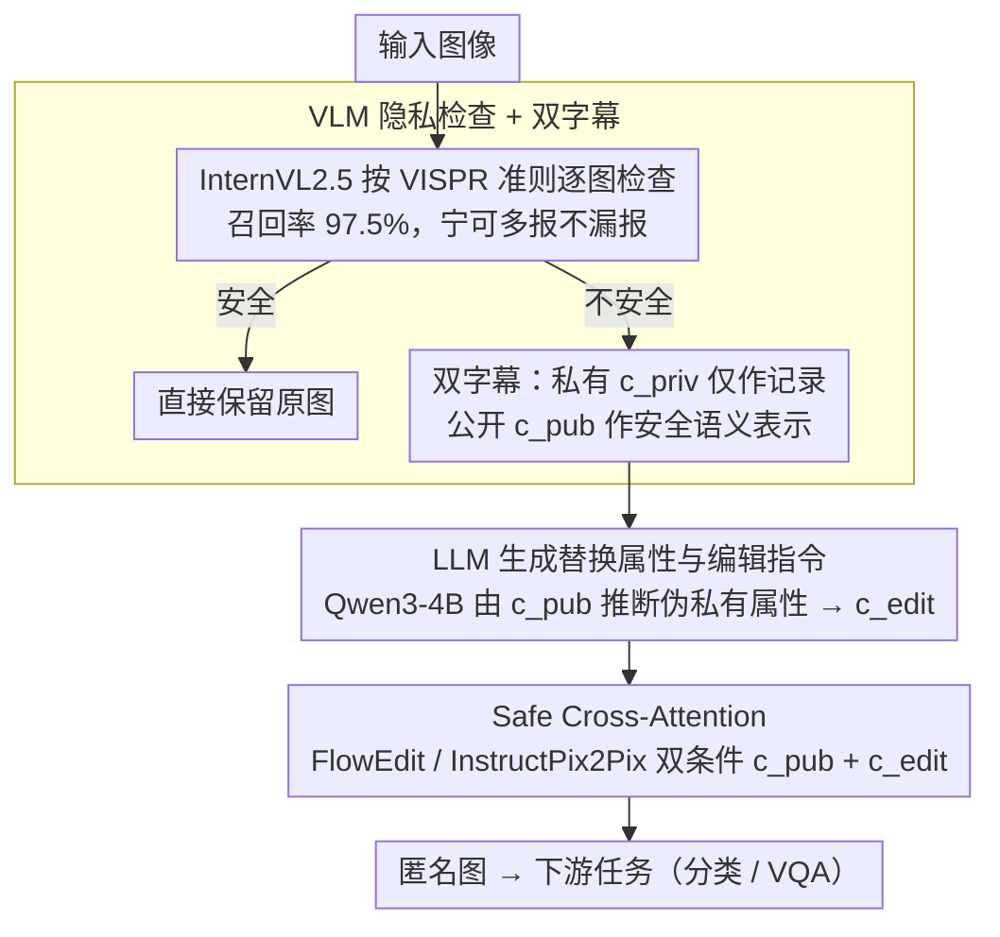

# Unsafe2Safe: Controllable Image Anonymization for Downstream Utility

**会议**: CVPR 2026  
**arXiv**: [2603.28605](https://arxiv.org/abs/2603.28605)  
**代码**: [https://see-ai-lab.github.io/unsafe2safe/](https://see-ai-lab.github.io/unsafe2safe/)  
**领域**: AI安全  
**关键词**: 图像匿名化、隐私保护、扩散编辑、VLM检查、下游任务保持

## 一句话总结

本文提出 Unsafe2Safe 全自动隐私保护流水线，通过 VLM 隐私检查→双字幕生成（私有/公开）→LLM 编辑指令→文本引导扩散编辑的四阶段方案，实现可控图像匿名化，在 VLMScore 隐私指标大幅提升的同时，在 Caltech-101 分类和 OK-VQA 上匿名后准确率甚至超过原始图像。

## 研究背景与动机

1. **领域现状**：随着大规模视觉数据集（如 LAION）被广泛使用，图像中的个人隐私问题（面部、车牌、健康信息等）日益受关注。现有匿名化方法主要是面部匿名化（如 DeepPrivacy2、模糊/马赛克），但处理范围狭窄。
2. **现有痛点**：(1) 传统面部匿名化只处理人脸，忽略车牌、健康标识、个人观点等其他隐私元素；(2) 匿名化后的图像往往破坏了场景的语义完整性，导致下游任务（分类、VQA）性能严重下降；(3) 匿名化可能引入新的人口统计偏差（如始终生成白人面孔替换）。
3. **核心矛盾**：有效匿名化需要大幅修改隐私区域，但大幅修改又会破坏下游任务所需的语义信息——隐私性与实用性之间存在根本张力。
4. **本文目标**：设计一个全自动+可控的匿名化流水线，在最大化隐私保护的同时最小化下游任务性能损失，并平衡人口统计分布。
5. **切入角度**：利用 VLM 的多模态理解能力做隐私检查和场景描述，利用 LLM 生成合理的替换指令，利用扩散编辑器做保持语义的局部修改。
6. **核心 idea**：四阶段串联——VLM 检查→双字幕→LLM 指令→扩散编辑，每个阶段解决一个特定子问题。Safe Cross-Attention 模块通过双条件注意力同时保持语义和执行编辑。

## 方法详解

### 整体框架

Unsafe2Safe 想解决的核心张力是：要遮住隐私就得大改图像，可大改又会毁掉下游任务（分类、VQA）依赖的语义。作者的思路是不靠盲目的模糊/马赛克，而是把"识别隐私—描述场景—决定替换—精确编辑"拆成一条全自动流水线，让每一步只动该动的部分。论文把它组织成两个阶段：**阶段一（检查）**用一个 VLM 完成隐私判定与双字幕生成、再用一个 LLM 产出编辑指令；**阶段二（安全生成）**由扩散编辑器执行编辑。具体来说，一张图先经 InternVL2.5 判定是否含隐私；判为安全则直接保留，判为不安全才进入改写。对不安全图，VLM 同时写出两版字幕——保留隐私细节的私有字幕 $c^{\text{priv}}$（仅作记录）和抹掉隐私的公开字幕 $c^{\text{pub}}$（作为安全语义表示）；接着 Qwen3-4B 读 $c^{\text{pub}}$ 推断出合理的替换属性，产出编辑指令 $c^{\text{edit}}$；最后由扩散编辑器（FlowEdit 或微调过的 InstructPix2Pix）在 $c^{\text{pub}}$ 与 $c^{\text{edit}}$ 双条件下完成局部改写，输出匿名图供下游使用。

### 关键设计

**1. VLM 隐私检查 + 双字幕：把"哪里有隐私、哪些语义要保住"一次说清**

传统面部匿名只盯人脸，会漏掉车牌、健康标识、敏感文件、甚至个人观点这类隐私。这里让 InternVL2.5 按一套预定义准则（面部 / 健康标识 / 车辆 / 个人观点 / 敏感文件）逐图检查，并刻意把阈值调得偏保守——召回率做到 97.5%，宁可多报（高 Type I 错误率）也不漏报，因为漏一张就是真实隐私泄漏。对判定为不安全的图，VLM 再写出两版字幕：$c^{\text{priv}}$ 保留隐私细节用作记录，$c^{\text{pub}}$ 把隐私信息剥掉但保留场景语义。$c^{\text{pub}}$ 之所以关键，是它充当了一个"模态对齐的安全表示"——既告诉后续模块这张图里有什么值得保留的语义，又不夹带任何需要抹掉的隐私。

**2. LLM 生成替换属性与编辑指令：让机器而非人决定"换成什么"**

知道哪里要改之后，还得决定改成什么样才既合理又不引入偏差。作者用 Qwen3-4B-Instruct 读 $c^{\text{pub}}$，为隐私区域推断出**伪私有属性**——把"张三这张具体的脸"抽象成"一位中年男性"这类不指向真人的描述，再组织成结构化编辑提示 $c^{\text{edit}}$。这一步全自动且天然多样：因为替换属性由 LLM 按场景采样，而不是人手固定模板，自然避开了"永远换成白人面孔"这类人口统计偏差。最终送进扩散编辑器的文本先验是 $c^{\text{edit}}$ 与 $c^{\text{pub}}$ 的合并——一个说"该怎么改"，一个说"别动哪些语义"。

**3. Safe Cross-Attention：用双条件注意力同时"知道什么该改、什么不该改"**

普通扩散编辑器只吃单一指令，容易要么改过头（连背景一起换、语义崩了）、要么改不动（隐私没遮干净）。这里把 $c^{\text{pub}}$ 和 $c^{\text{edit}}$ 的文本嵌入拼成一条统一 token 序列，在去噪的每一步做双条件交叉注意力：

$$\text{Attn}(Q, [K_{\text{pub}}; K_{\text{edit}}], [V_{\text{pub}}; V_{\text{edit}}])$$

$c^{\text{pub}}$ 这一支持续提供"语义保持"信号，$c^{\text{edit}}$ 这一支提供"目标变换"信号，两者在同一注意力层里协同——模型对隐私区域响应 $c^{\text{edit}}$ 做改写，对其余区域则被 $c^{\text{pub}}$ 锚住不乱动。消融里这个模块把 Race Entropy 从 0.800 提到 0.831，正是"该改的改、该留的留"带来的多样性收益。

### 一个完整示例

以一张含真人面孔的街景照为例走一遍：Stage 1 中 InternVL2.5 标记其"不安全"（命中面部 + 可能的车牌），并写出 $c^{\text{priv}}$="一名留胡子的亚裔男性站在写着 ABC123 车牌的红色轿车旁"与 $c^{\text{pub}}$="一个人站在一辆红色轿车旁的街景"。Qwen3-4B 读 $c^{\text{pub}}$ 后推断替换属性，生成 $c^{\text{edit}}$="把人物替换为一位中年男性、车牌替换为通用号牌"。最后扩散编辑器在 $\{c^{\text{pub}}, c^{\text{edit}}\}$ 双条件下编辑：Safe Cross-Attention 让面孔和车牌被改写为不指向真人的版本，而"红色轿车 + 街景"的整体构图被 $c^{\text{pub}}$ 锚住保留。输出图 FaceSim 降到 0.366（脸已换），但 Caltech-101 分类仍判对——隐私遮住了，下游可用性没丢。

### 损失函数 / 训练策略

核心流水线无需训练，直接串联现成的 VLM / LLM / 扩散编辑器即可跑。可选的微调环节是在 MS-COCO 上用流水线自动生成的三元组（私有字幕、公开字幕、编辑指令）微调 InstructPix2Pix，并以概率 0.4 做自注意力替换来构造训练对，进一步提升编辑质量。

## 实验关键数据

### 主实验

| 方法 | Caltech-101 Acc | VLMScore↑ | FaceSim↓ | TextSim↓ | Race Entropy↑ |
|------|----------------|-----------|----------|----------|---------------|
| 原始图像 | 94.28 | 7.70 | 1.000 | 1.000 | 0.438 |
| DeepPrivacy2 | 94.60 | 11.05 | 0.392 | 0.957 | 0.732 |
| FaceAnon | 94.85 | 8.76 | 0.459 | 0.936 | 0.609 |
| **U2S (FlowEdit)** | 94.79 | **13.97** | **0.366** | **0.524** | **0.765** |
| **U2S (LLM)** | 92.88 | 12.70 | 0.343 | 0.488 | **0.875** |

### 消融实验

| 组件 | Caltech-101 Acc | FaceSim↓ | Race Entropy↑ | 说明 |
|------|----------------|----------|---------------|------|
| Non-finetuned (edit) | 94.32 | 0.516 | 0.683 | 基础版 |
| Finetuned (edit) | **95.12** | 0.591 | 0.800 | 微调提升质量 |
| Finetuned + SafeAttn | 94.89 | 0.547 | **0.831** | 安全注意力提升多样性 |

### 关键发现

- **OK-VQA 上匿名后准确率反而提升**：U2S (FlowEdit) VQA 准确率 0.709 vs 原始图像 0.606（+10.3%），可能因为匿名化消除了干扰性隐私信息
- 人口统计平衡显著改善：白人比例从 80.28% 降至 37.90%（LLM 变体），Race Entropy 从 0.438 升至 0.875
- U2S 做了比面部匿名化更全面的隐私保护（TextSim 从 0.957 降至 0.488），覆盖面部、文字、车辆等多种隐私要素
- VLM隐私检查的高召回率（97.5%）确保了极少的隐私泄漏

## 亮点与洞察

- **四阶段流水线的模块化设计**：每个阶段可以独立替换（如换更好的 VLM 或更新的扩散编辑器），系统升级友好
- **VQA 准确率的反直觉提升**：匿名化可能通过消除隐私相关的干扰信息间接帮助了下游任务——这暗示当前数据集中存在隐私信息引起的"视觉噪声"
- **人口统计平衡的副产品**：LLM 生成多样化替换属性自然带来了人口统计平衡，无需额外的公平性约束
- **Safe Cross-Attention 的通用性**：双条件注意力在需要"保持+修改"平衡的其他编辑任务中可复用（如局部风格迁移）

## 局限与展望

- Unsafe2Safe 是数据集构建工具，不是隐私决策者——定义"什么是隐私信息"的责任在使用者
- 依赖底层 VLM/LLM 的质量，模型幻觉可能导致误判（漏检或过度检测）
- MIT Indoor67 场景分类准确率下降（80.75 vs 83.88），说明全局修改对场景理解有负面影响
- 扩散编辑器的伪影在边界区域可能可见
- 隐私定义的可扩展性——如何自动适配不同国家/文化的隐私标准仍需探索

## 相关工作与启发

- **vs DeepPrivacy2**: 只做面部匿名化，不处理车牌、文字等。U2S 全面覆盖多种隐私要素，且在分类任务上性能接近
- **vs FaceAnon**: 类似的面部级别方法，FaceSim=0.459 远不如 U2S 的 0.366——说明 U2S 的匿名化更彻底
- **vs 传统马赛克/模糊**: 完全破坏语义信息，下游任务不可用。U2S 通过扩散编辑保持语义完整性

## 评分

- 新颖性: ⭐⭐⭐⭐ 四阶段串联的系统设计新颖，Safe Cross-Attention是亮点
- 实验充分度: ⭐⭐⭐⭐⭐ 分类/字幕/VQA/隐私/人口统计五个维度全面评估
- 写作质量: ⭐⭐⭐⭐ 流水线描述清晰，评估框架设计严谨
- 价值: ⭐⭐⭐⭐⭐ 数据隐私是当前产业界核心痛点，全自动匿名化工具有直接应用价值

<!-- RELATED:START -->

## 相关论文

- [\[ACL 2026\] Adaptive Text Anonymization: Learning Privacy-Utility Trade-offs via Prompt Optimization](../../ACL2026/llm_safety/adaptive_text_anonymization_learning_privacy-utility_trade-offs_via_prompt_optim.md)
- [\[CVPR 2026\] V-Attack: Targeting Disentangled Value Features for Controllable Adversarial Attacks on LVLMs](v-attack_targeting_disentangled_value_features_for_controllable_adversarial_atta.md)
- [\[CVPR 2026\] A Closed-Form Solution for Debiasing Vision-Language Models with Utility Guarantees Across Modalities and Tasks](a_closedform_solution_for_debiasing_visionlanguage.md)
- [\[ACL 2026\] CAP: Controllable Alignment Prompting for Unlearning in LLMs](../../ACL2026/llm_safety/cap_controllable_alignment_prompting_for_unlearning_in_llms.md)
- [\[ACL 2026\] De-Anonymization at Scale via Tournament-Style Attribution](../../ACL2026/llm_safety/de-anonymization_at_scale_via_tournament-style_attribution.md)

<!-- RELATED:END -->
