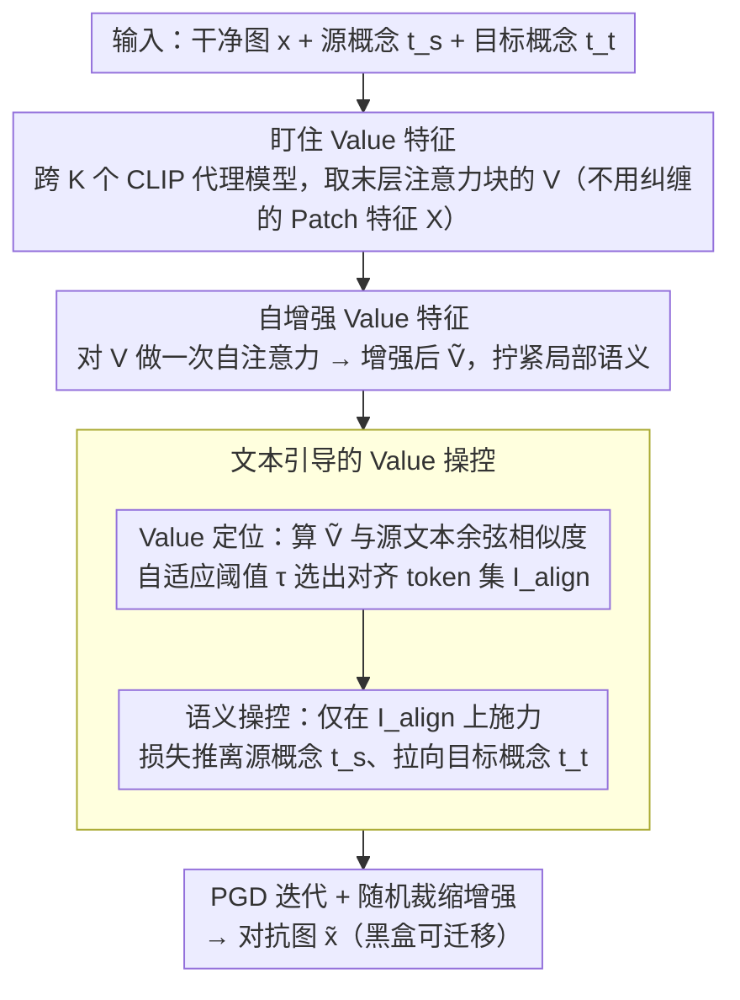

# V-Attack: Targeting Disentangled Value Features for Controllable Adversarial Attacks on LVLMs

**会议**: CVPR 2026  
**arXiv**: [2511.20223](https://arxiv.org/abs/2511.20223)  
**代码**: [GitHub](https://github.com/Summu77/V-Attack)  
**领域**: AI安全  
**关键词**: 对抗攻击, 视觉语言模型, Value特征, 语义操控, 可控攻击

## 一句话总结

发现 ViT 中 Value 特征相比 Patch 特征具有更解耦的局部语义表示，提出 V-Attack 通过自增强 Value 特征 + 文本引导语义操控实现精确可控的 LVLM 局部语义攻击，ASR 平均提升 36%。

## 研究背景与动机

**领域现状**：对抗攻击已从干扰分类预测进化到操控 LVLM 的图像语义，但现有方法在精确操控特定概念时成功率极低——同时改变 3 个概念，成功率 <10%。

**核心发现**：ViT 自注意力使 Patch 特征产生语义纠缠（全局上下文主导，局部语义被稀释），而 Value 特征天然抑制全局上下文通道，保留高熵的解耦局部语义。通道分布分析显示 Patch 特征被少数高激活通道（与 CLS token 相关）主导，而 Value 特征分布均匀。

## 方法详解

### 整体框架

V-Attack 的目标是对 LVLM 做“精确可控”的局部语义攻击——只把图里某个概念（比如“狗”）悄悄换成另一个（“猫”），其余不动。它的思路是别在纠缠的 Patch 特征上动手，而是盯住更解耦的 Value 特征：先跨多个代理模型从视觉编码器**最后一个注意力块**提取 Value 特征，做一次自增强强化局部语义，再用源/目标概念的文本把要改的 token 挑出来定向操控，最后用 PGD 迭代把这套目标优化成一张对抗图。

### 关键设计

**1. 盯住 Value 特征：它比 Patch 特征更解耦**

前面说现有攻击在 Patch 特征上操控特定概念几乎失败，根因是 Patch 特征语义纠缠。作者在 CLIP-L/14 上做了两组分析坐实了这点：Patch 特征的信息熵在中间层骤降（被少数高激活通道主导），而 Value 特征始终保持高熵、分布均匀；文本对齐分析进一步显示，Value 与特定文本的余弦相似度图有清晰的空间对齐（“dog” → 0.28 vs Patch 的 0.22）。所以 V（Value）才是更精确的语义操控目标。

**2. 自增强 Value 特征（Self-Value Enhancement）：先把局部语义自己拧紧**

光选对目标还不够，末层 Value 的局部语义还可以更一致。这一步对提取的 Value 特征做一次“自注意力”——Q、K、V 全来自 Value 本身，$\widetilde{\mathbf{V}}^{(k)} = \text{Attn}(\mathbf{V}^{(k)}, \mathbf{V}^{(k)}, \mathbf{V}^{(k)})$，让各 token 基于自身相关性重整表示，强化显著的局部语义、提升跨 token 的特征一致性，使后续操控落点更准、语义更丰富。

**3. 文本引导的 Value 操控（Text-Guided Value Manipulation）：用文本把该改的 token 拎出来定向推拉**

要“可控”，就得知道改哪些 token、往哪改，这一步分**定位**和**操控**两段。定位：用 CLIP 文本编码器编码源概念 $t_s$，借投影层 $P_I, P_T$ 把每个增强后的 Value token 和源文本投到共享空间算余弦相似度 $s_i$；阈值不是手调的，而是按每个代理模型自身的相似度分布自适应取 $\tau^{(k)} = \tfrac{1}{2}(\max_i s_i + \min_i s_i)$，相似度超过 $\tau^{(k)}$ 的 token 才进入对齐集合 $\mathcal{I}_{\text{align}}^{(k)}$，这就锁定了真正承载源概念的那批 token。操控：只在 $\mathcal{I}_{\text{align}}^{(k)}$ 上施力，损失同时把它们推离源概念、拉向目标概念：

$$\mathcal{L} = \sum_{k} \sum_{i \in \mathcal{I}_{\text{align}}^{(k)}} [-s_i^{(k)}(t_s) + s_i^{(k)}(t_t)]$$

配合 PGD 迭代和随机裁缩增强迁移性。正因为只动语义对齐的少量 token，攻击才能做到单概念级别的精准替换而不波及全局。

### 损失函数 / 训练策略

整套优化跨多个代理模型（CLIP 变体）集成进行，对选出的语义对齐 token 同时远离源概念、靠近目标概念，再用随机裁缩增强黑盒迁移性。

## 实验关键数据

### 主实验（局部语义攻击，MS-COCO）

| 方法 | LLaVA CAP | InternVL CAP | DeepseekVL CAP | GPT-4o CAP | Avg |
|------|-----------|-------------|----------------|------------|-----|
| MF-it | 0.051 | 0.040 | 0.040 | 0.028 | 0.040 |
| SSA-CWA | 0.262 | 0.304 | 0.241 | 0.285 | 0.273 |
| M-Attack | 0.370 | 0.405 | 0.483 | 0.544 | 0.450 |
| **V-Attack** | **最高** | **最高** | **最高** | **最高** | **+36%** |

### 消融实验

| 配置 | 效果 | 说明 |
|------|------|------|
| 攻击 Patch 特征 X | 低 | 语义纠缠 |
| 攻击 Value 特征 V | 显著提升 | 解耦局部语义 |
| +Self-Enhancement | 进一步提升 | 语义更丰富 |
| +Text-Guided | **最优** | 精确定位+操控 |

### 关键发现

- Value 特征抑制了 Patch 中主导全局信息的高激活通道
- 攻击 Value 比攻击 Patch 平均 ASR 提升 36%
- 在 GPT-4o、GPT-o3 等闭源模型上也有效

## 亮点与洞察

- **深度洞察**：首次揭示 ViT Value 特征的解耦性质，为对抗攻击提供新视角
- **精确可控**：实现单概念级别的精准语义替换（"狗"→"猫"）
- **强迁移性**：白盒代理生成的扰动在黑盒 GPT-4o 上有效

## 局限与展望

- 依赖 CLIP 等白盒代理模型，架构差异大时迁移效果可能下降
- 多概念同时攻击的成功率仍有提升空间
- 需关注此类工具的伦理风险

## 相关工作与启发

- AttackVLM 首次用 CLIP 做 LVLM 对抗攻击，V-Attack 找到更精确的攻击目标
- M-Attack 用裁剪增强+模型集成，V-Attack 从特征选择角度切入
- 对 LVLM 安全防御也有启示：可保护 Value 特征空间

## 评分

- 新颖性: ⭐⭐⭐⭐⭐ Value 特征解耦的发现非常深刻
- 实验充分度: ⭐⭐⭐⭐⭐ 多模型多场景全面验证（含 GPT-4o）
- 写作质量: ⭐⭐⭐⭐ 分析透彻可视化优秀
- 价值: ⭐⭐⭐⭐ 揭示 LVLM 安全隐患
- 价值: 待评

<!-- RELATED:START -->

## 相关论文

- [\[CVPR 2026\] Omni-Attack: Adversarial Attacks on Open-Ended VQA in Black-Box Multimodal LLMs](omni-attack_adversarial_attacks_on_open-ended_vqa_in_black-box_multimodal_llms.md)
- [\[CVPR 2026\] Unsafe2Safe: Controllable Image Anonymization for Downstream Utility](unsafe2safe_controllable_image_anonymization_for_downstream_utility.md)
- [\[CVPR 2026\] Multi-Paradigm Collaborative Adversarial Attack Against Multi-Modal Large Language Models](multi-paradigm_collaborative_adversarial_attack_against_multi-modal_large_langua.md)
- [\[ICLR 2026\] Efficient Adversarial Attacks on High-dimensional Offline Bandits](../../ICLR2026/llm_safety/efficient_adversarial_attacks_on_high-dimensional_offline_bandits.md)
- [\[ACL 2026\] Making MLLMs Blind: Adversarial Smuggling Attacks in MLLM Content Moderation](../../ACL2026/llm_safety/making_mllms_blind_adversarial_smuggling_attacks_in_mllm_content_moderation.md)

<!-- RELATED:END -->
