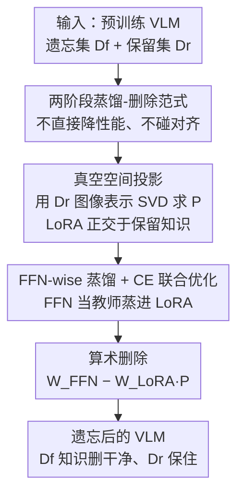

# VL-Eraser: Vacuum Distillation for Machine Unlearning in Vision-Language Models

**会议**: CVPR 2026  
**论文**: [CVF Open Access](https://openaccess.thecvf.com/content/CVPR2026/html/Wang_VL-Eraser_Vacuum_Distillation_for_Machine_Unlearning_in_Vision-Language_Models_CVPR_2026_paper.html)  
**代码**: 待确认  
**领域**: 多模态VLM / 机器遗忘 / AI安全  
**关键词**: 机器遗忘、视觉语言模型、跨模态对齐、低秩适配器、知识蒸馏

## 一句话总结
VL-Eraser 指出传统「反向训练」式遗忘在 VLM 上其实只是破坏了跨模态对齐、并没有真正删掉知识；它把遗忘重构成「先蒸馏、后删除」两阶段——先把要遗忘的知识在「真空空间」约束下蒸馏进一组 LoRA，再把这组 LoRA 从原模型里减掉，从而在删得更干净的同时保住模型可用性。

## 研究背景与动机
**领域现状**：机器遗忘（Machine Unlearning, MU）要在不从头重训的前提下，把模型里某些隐私 / 版权 / 敏感数据的影响抹掉，以满足「被遗忘权」。主流做法是**反向训练（reverse-training）**：在要遗忘的数据 $D_f$ 上把预训练目标反过来优化（梯度上升 GA、KL 负优化、负偏好优化 NPO 等），故意让模型在这批数据上变差，从而近似遗忘。这类方法在单模态任务上已经比较成熟。

**现有痛点**：当把反向训练搬到视觉语言模型（VLM）上时，效果存疑。VLM 的能力依赖两件事——（1）每个模块里的**准确知识**，（2）模态之间**可靠的对齐**。反向训练直接拉低模型在 $D_f$ 上的表现时，到底是擦掉了知识，还是只是把视觉编码器和语言模型之间的对齐搞坏了？作者用「Donald Trump 住哪」这类例子做探针实验发现：表面上模型越来越「答不出」多模态问题，但用**纯文本问题**直接探查语言模型、或者**重新加载原始投影层**后，残留知识的遗忘质量几乎没怎么涨——说明大部分「遗忘」其实来自被破坏的模态对齐，而非真正的知识删除，这会造成**知识泄露风险**。

**核心矛盾**：反向训练靠「降性能」实现遗忘，但 VLM 的「降性能」最容易先伤到脆弱的跨模态对齐。一旦对齐被破坏，要么过高估计的 loss 让训练提前停下，要么语言模型继续在错位视觉编码器产出的低质数据上被「训练」，两种情况都阻碍了真正的知识删除。

**本文目标**：设计一种**不靠破坏对齐**来实现遗忘的范式，既删得干净（forget set 上残留知识低），又保住可用性（retain / real set 上性能基本不掉）。

**切入角度**：与其在原模型上直接「做减法降性能」，不如先把「要遗忘的那部分知识」从纠缠的参数里**单独分离出来、搬到一个外挂模块**里，再把这个模块整体减掉——这样原模型的对齐结构始终没被动过。

**核心 idea**：把遗忘重构成「**蒸馏 → 删除**」两阶段——先在「真空空间」约束下，把遗忘知识从 FFN 蒸馏进 LoRA，再用参数算术 $W_{\text{FFN}} - W_{\text{LoRA}}P$ 把 LoRA 从原模型里减掉。

## 方法详解

### 整体框架
VL-Eraser 把 VLM 遗忘拆成两个串行阶段。**阶段一·真空蒸馏（Vacuum Distillation）**：给每个 VLM block 的前馈网络（FFN，Transformer 里知识的主要存储处）挂一组 LoRA，冻结的 FFN 当「教师」、LoRA 当「学生」，在遗忘集 $D_f$ 上把遗忘相关知识蒸馏进 LoRA；同时用从保留集 $D_r$ 估计出的「真空空间」投影矩阵 $P$ 把 LoRA 约束在与保留知识正交的方向上，让它只吸收「该忘的」、自动滤掉「该留的」。**阶段二·算术删除（Arithmetic Deletion）**：蒸馏完的 LoRA 可视为「专精于遗忘知识的专家」，于是直接把它从原 FFN 里减掉 $W_{\text{unlearned}} = W_{\text{FFN}} - W_{\text{LoRA}}\cdot P$，对应知识即被移除，而真空空间的正交性保证保留知识几乎不受影响。

### 关键设计

**1. 两阶段「蒸馏-删除」范式：把遗忘从「降性能」改成「分离再切除」**

针对的痛点是：反向训练在 VLM 上直接拉低 $D_f$ 性能，必然先伤到脆弱的跨模态对齐，导致「看起来忘了、其实知识还在」。VL-Eraser 的破局点是**全程不去主动降低模型表现**：它不在原参数上做反向优化，而是先把要遗忘的知识「搬」到一个外挂 LoRA 里（阶段一），再把这个 LoRA 整体「切除」（阶段二）。训练阶段优化的两个目标（蒸馏损失 + 交叉熵）都是在让 LoRA 去**逼近 / 复刻**遗忘知识，而不是去破坏原模型，因此原 VLM 的对齐结构在整个训练里始终保持完好。这是它相比 GA / NPO 等方法在 Textual-QA 上优势尤其明显的根本原因——后者一旦对齐崩了，语言模型内部其实没被真正「遗忘」干净。

**2. 真空空间投影：用左零空间的正交性，自动滤掉「不该忘」的知识**

精确地把「遗忘知识」从纠缠的 VLM 参数里单独拎出来很难，硬蒸馏会顺带把保留知识也学进 LoRA。作者的办法是把蒸馏过程约束在保留知识的**真空空间（vacuum space，即左零空间）**里。定义上，矩阵 $Y$ 在 $X$ 的真空空间内当且仅当 $YX = 0$；据此把学生参数 $W_{\text{LoRA}}$ 投影到保留表示 $H_r$ 的真空空间，使

$$\text{Proj}_{vacuum}(W_{\text{LoRA}})\cdot H_r = 0,$$

LoRA 就天然与保留知识正交、互不干扰。实现上，考虑到图文任务里表示差异主要由视觉输入决定，作者只用保留集图像表示来估计真空空间：对 patch 级 mean-pooling 后的图像表示 $H_{image}$ 做 SVD $\{U,\Sigma,U^\top\}=\text{SVD}(\text{pooling}(H_{image}))$，去掉 $U$ 中对应**非零**奇异值的特征向量、保留剩余子矩阵 $\hat U$，定义投影矩阵 $P=\hat U\hat U^\top$，于是 $\text{Proj}_{vacuum}(W_{\text{LoRA}}):=W_{\text{LoRA}}P$ 满足 $W_{\text{LoRA}}P H_{image}=0$。这一步是后续「删除时不伤保留知识」的数学保证。

**3. FFN-wise 蒸馏损失 + CE 联合优化：既把知识抽进 LoRA，又保住知识保真度**

光有真空约束还不够，得让 LoRA 真的学到对应 FFN 里的遗忘知识。作者提出 **FFN-wise 蒸馏损失**：逐 block 最大化「教师 FFN 输出」与「投影后 LoRA 输出」的余弦相似度，

$$L^l_{Distill}=\frac{1}{S}\sum_{s=1}^{S}\Big(1-\frac{(W^l_{\text{FFN}}H_{l,s})^\top (W^l_{\text{LoRA}}P_l H_{l,s})}{\lVert W^l_{\text{FFN}}H_{l,s}\rVert_2\,\lVert W^l_{\text{LoRA}}P_l H_{l,s}\rVert_2}\Big),$$

再对所有 block 取平均得 $L_{Distill}=\frac{1}{N}\sum_l L^l_{Distill}$，从而把遗忘知识从原 FFN 解耦、转移进受真空约束的 LoRA。但只蒸馏会让投影后的知识分布偏移，所以再叠一个标准的下一 token 预测**交叉熵损失** $L_{CE}$（在 $D_f$ 上保持与预训练目标一致），保证知识保真度。总目标为 $L_{Total}=\lambda L_{Distill}+(1-\lambda)L_{CE}$。消融显示两个 loss 缺一不可：只用 $L_{CE}$ 无法保证训练后参数分布对齐原模型，只用 $L_{Distill}$ 无法保证投影进真空空间后知识不偏，遗忘都会变弱。

**4. 算术删除：一次参数减法完成遗忘，对保留知识近乎零损伤**

蒸馏完成后，LoRA 已经是「只装着遗忘知识的专家」，于是遗忘直接用参数算术实现：$W_{\text{unlearned}}=W_{\text{FFN}}-W_{\text{LoRA}}\cdot P$。这一步的妙处来自真空空间的两个极限性质——由于蒸馏目标（式 5）让 FFN 与 LoRA 在遗忘知识上的输出对齐，对遗忘集表示 $H_f$ 有 $(W_{\text{FFN}}-W_{\text{LoRA}}P)H_f\to 0$，即遗忘样本的中间表示被压向零、知识被切除；而由于 LoRA 已被投影进真空空间（$W_{\text{LoRA}}P H_r\approx 0$），对保留集表示 $H_r$ 有 $(W_{\text{FFN}}-W_{\text{LoRA}}P)H_r\to W_{\text{FFN}}H_r$，即保留知识基本维持原 FFN 状态。一次减法同时拿到「删干净」和「保得住」，无需额外微调，效率也由此而来。

### 损失函数 / 训练策略
- **总目标**：$L_{Total}=\lambda L_{Distill}+(1-\lambda)L_{CE}$，$\lambda$ 为蒸馏与保真之间的权衡超参。
- **真空空间估计**：只用保留集 $D_r$ 的图像表示做 SVD（而非全部图文样本），在效率与效果间折中。
- **作用范围**：LoRA 只挂在每个 VLM block 的 FFN 上（知识主存储处），蒸馏只在遗忘集 $D_f$ 上做微调，真空投影所需的 $D_r$ 只用于**推理**取表示、不参与反传——这也是它训练成本远低于需要在 $D_r$ 上微调的方法的原因。

## 实验关键数据

基准为 **MLLMU-Bench**（合成人物档案，每人配肖像 + 14 个问题，7 个 Visual-QA 用于遗忘微调、7 个 Textual-QA 仅用于评测）；骨干为 **LLaVA-1.5-7B** 与 **Qwen2-VL-7B-Instruct**；含分类（准确率）、生成（ROUGE-L）、完形（准确率）三类任务，在 Forget / Test / Retain / Real 四个集合上评测。Forget 越低越好（↓），Retain / Real 越高越好（↑）。

### 主实验
LLaVA-1.5-7B，5% Forget，Visual-QA（节选关键列）：

| 方法 | 分类 Forget↓ | 分类 Retain↑ | ROUGE Forget↓ | ROUGE Retain↑ | 完形 Forget↓ | 完形 Retain↑ |
|------|------|------|------|------|------|------|
| Vanilla（原模型） | 51.2 | 47.9 | 0.570 | 0.494 | 27.1 | 26.3 |
| GA | 39.4 | 39.7 | 0.392 | 0.418 | 21.2 | 19.2 |
| NPO | 41.9 | 42.1 | 0.510 | 0.415 | 17.4 | 21.8 |
| MMUnlearner | 32.6 | 41.9 | 0.462 | 0.458 | 22.4 | 24.6 |
| **VL-Eraser** | **26.2** | **43.4** | **0.256** | **0.473** | **13.4** | **25.8** |

VL-Eraser 在所有三类任务的 Forget 上都最低（删得最干净），同时 Retain 反而是各遗忘方法里最接近 Vanilla 的（保留最好）。论文汇报：LLaVA-1.5 上相对原模型平均拉低 Forget 分类准确率 24.1%、完形 12.8%、ROUGE 0.369；Qwen-2 上对应为 19.6% / 15.3% / 0.407。Textual-QA 上的优势更明显——传统方法在纯文本探查下残留知识高，印证了「它们主要靠破坏对齐而非真删知识」。

### 消融实验
LLaVA-1.5-7B，5% Forget，Visual-QA：

| 配置 | 分类 Forget↓ | 分类 Retain↑ | ROUGE Retain↑ | 完形 Retain↑ | 说明 |
|------|------|------|------|------|------|
| Vanilla | 51.2 | 47.9 | 0.494 | 26.3 | 原模型 |
| w/o Vacuum | 25.4 | 36.6 | 0.385 | 18.4 | 去真空约束：忘得更多但 Retain 暴跌 |
| w/o $L_{Distill}$ | 38.4 | 42.6 | 0.445 | 22.2 | 只用 CE：遗忘明显变弱 |
| w/o $L_{CE}$ | 32.6 | 44.7 | 0.458 | 24.8 | 只用蒸馏：遗忘也不充分 |
| **VL-Eraser** | 26.2 | 43.4 | 0.473 | 25.8 | 完整模型，删/保平衡最好 |

### 关键发现
- **真空空间是「保可用性」的关键**：去掉真空约束后 Forget 甚至更低（25.4），但 Retain 从 43.4 暴跌到 36.6——因为无约束的直接蒸馏会因泛化效应连带擦掉非目标知识。它换来的不是更好的遗忘，而是「误伤」。
- **两个 loss 缺一不可**：单用 $L_{CE}$ 保不住「训练后参数分布对齐原模型」，单用 $L_{Distill}$ 保不住「投影进真空空间后知识不偏」，两者都让遗忘变弱（其中只用 $L_{CE}$ 退化更严重，Forget 38.4）。
- **效率接近最便宜的基线**：训练时间上，GA 401s、NPO 451s、VL-Eraser 465s，而需要在保留集 $D_r$ 上微调的 GA_Diff / KL_Min / MMUnlearner 约 8163–8591s（约 20×）。VL-Eraser 只在 $D_f$ 上微调、$D_r$ 仅用于推理构造投影，成本与 NPO 相当。
- **案例研究**：对同一张「某职业人物」图像，多数基线遗忘后仍答出原职业（architect），VL-Eraser 改答成无关职业（history professor），直观体现真正删掉了关联知识。

## 亮点与洞察
- **「遗忘 ≠ 降性能」这一诊断本身很有价值**：作者用「纯文本探针」和「重载原始投影」两种探查方法，把 VLM 上「表面遗忘」和「真实遗忘」拆开，证明传统方法的遗忘大半来自破坏对齐——这个 insight 比方法本身更值得记。
- **真空空间（左零空间）正交约束**是把「该忘 / 该留」做硬解耦的优雅工具：用 $YX=0$ 的代数性质替代「靠 loss 软权衡」，从机制上保证删除时不碰保留知识，可迁移到任何「定向编辑参数又不想误伤」的场景（如概念编辑、定向去偏）。
- **「蒸馏进 LoRA 再减掉」是 task-vector / 参数算术思路的一个干净实例**：把要删的知识显式具象成一个可加可减的模块，让遗忘变成一次确定性的参数减法，而不是一个需要小心调早停的优化过程，工程上更可控。

## 局限性 / 可改进方向
- **真空空间只用图像表示估计**：作者论证「图文任务的表示差异主要由视觉决定」，但纯文本相关的保留知识是否也被这个仅基于图像的 $P$ 充分保护，文中未直接验证，可能在偏文本的保留任务上有风险。
- **评测局限于 MLLMU-Bench 合成档案**：遗忘对象是虚构人物 profile，真实世界的隐私 / 版权遗忘（分布更杂、知识更纠缠）下能否同样干净，仍待检验。
- **遗忘比例与多次遗忘**：实验主要在 5%（部分 10%）遗忘比例下；连续 / 增量多轮遗忘请求是否会累积破坏对齐或退化 Retain，未充分探讨。
- **抗「重新学习」鲁棒性未测**：算术删除后的模型若再被少量相关数据微调，被删知识是否会被轻易恢复，是隐私场景的关键问题但本文未涉及。

## 相关工作与启发
- **vs GA / GA_Diff / NPO / KL_Min（反向训练系）**：它们直接在 $D_f$ 上反向优化降性能，VL-Eraser 不降性能而是「分离再切除」；区别在于前者必然冲击跨模态对齐造成假遗忘，VL-Eraser 全程不碰对齐，因此 Textual-QA 残留更低、Retain 更稳。
- **vs MMUnlearner**：同为面向 VLM 设计、且都想「精准定位遗忘相关参数」，但 MMUnlearner 仍走自适应选参 + 在 $D_r$ 上微调的路线（成本约 20×），VL-Eraser 用真空空间正交投影 + 算术删除，遗忘更彻底且训练成本只与 NPO 相当。
- **vs CLIPErase / SIU / Multidelete（早期 VLM 遗忘）**：这些方法多针对特定数据集 / 特定关联（如 CLIP 的图文关联），迁移性差；VL-Eraser 给出的是一个与骨干无关的通用两阶段范式，在 LLaVA 与 Qwen2 两种架构上都有效。

## 评分
- 新颖性: ⭐⭐⭐⭐⭐ 「遗忘其实只是破坏了对齐」的诊断 + 真空空间正交蒸馏 + 算术删除，是对 VLM 遗忘范式的重新表述，不是增量调参。
- 实验充分度: ⭐⭐⭐⭐ 两骨干 × 三任务 × 四集合 + 消融 + 效率 + 案例，证据链完整；但缺连续遗忘、抗重学习、真实数据等压力测试。
- 写作质量: ⭐⭐⭐⭐ 动机用探针实验讲得很透，方法公式自洽；真空空间定义与投影实现稍紧凑，需对照公式细读。
- 价值: ⭐⭐⭐⭐⭐ 把「假遗忘」这一隐患说清并给出又快又干净的解法，对隐私 / 版权合规的多模态部署有直接实用价值。

<!-- RELATED:START -->

## 相关论文

- [\[CVPR 2026\] SineProject: Machine Unlearning for Stable Vision–Language Alignment](sineproject_machine_unlearning_for_stable_vision_language_alignment.md)
- [\[CVPR 2026\] Phantasia: Context-Adaptive Backdoors in Vision Language Models](phantasia_context-adaptive_backdoors_in_vision_language_models.md)
- [\[CVPR 2026\] Towards Reasoning-Preserving Unlearning in Multimodal Large Language Models](towards_reasoning-preserving_unlearning_in_multimodal_large_language_models.md)
- [\[NeurIPS 2025\] Distillation Robustifies Unlearning](../../NeurIPS2025/llm_safety/distillation_robustifies_unlearning.md)
- [\[CVPR 2026\] Which Concepts to Forget and How to Refuse? Decomposing Concepts for Continual Unlearning in Large Vision-Language Models](which_concepts_to_forget_and_how_to_refuse_decomposing_concepts_for_continual_un.md)

<!-- RELATED:END -->
