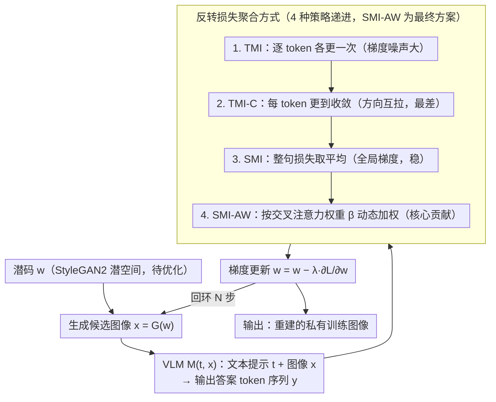

# Do Vision-Language Models Leak What They Learn? Adaptive Token-Weighted Model Inversion Attacks

**会议**: CVPR 2026  
**arXiv**: [2508.04097](https://arxiv.org/abs/2508.04097)  
**代码**: [https://ngoc-nguyen-0.github.io/SMI_AW/](https://ngoc-nguyen-0.github.io/SMI_AW/)  
**领域**: 多模态VLM / AI安全  
**关键词**: 模型反转攻击, VLM隐私泄露, 自适应token加权, 视觉注意力引导, 训练数据重建  

## 一句话总结
首次系统研究 VLM 的模型反转（Model Inversion）攻击，提出一套面向 token 生成特性的反转策略（TMI/TMI-C/SMI），以及基于视觉注意力强度动态加权 token 梯度贡献的 SMI-AW 方法，在 4 种 VLM 和 3 个数据集上实现最高 61.21% 的人类评估攻击准确率，揭示了 VLM 严重的训练数据隐私泄露风险。

## 背景与动机
模型反转（MI）攻击旨在从训练好的模型中重建私有训练数据，已在单模态 DNN（尤其是人脸识别）中被广泛研究。然而 VLM 有以下独特之处导致传统 MI 不能直接适用：

1. VLM 的输出是 token 序列而非类别标签，需要新的反转目标函数
2. VLM 包含多个模块（视觉编码器、投影层、语言模型），且视觉编码器通常冻结——私有信息主要嵌入在语言模型和投影层参数中
3. 不同输出 token 对视觉输入的依赖程度不同——有些 token 强视觉关联，有些仅由语言上下文驱动

随着 VLM 在医疗、金融等敏感领域部署，理解其隐私风险迫在眉睫。

## 核心问题
VLM 是否和单模态 DNN 一样容易受到模型反转攻击？如何针对 VLM 的 token 生成特性设计有效的 MI 攻击方法？

## 方法详解

### 整体框架

这是个白盒模型反转攻击：攻击者握有 VLM 的完整架构、参数和注意力图，想从模型里"反推"出训练用过的私有图像。具体做法是在预训练 StyleGAN2 的潜空间里优化一个 $w$，让生成图 $x = G(w)$ 喂给 VLM 后、在给定文本 $t$（如"Who is the person in the image?"）下能输出目标答案 $y$（如某个人名）。整条流水线是一个迭代优化回环——生成候选图 → 过 VLM 拿到答案 token 序列 → 算反转损失 → 反传更新 $w$ → 重复 $N$ 步，直到生成图能稳定诱导出目标答案。难点在于 VLM 输出的是 token 序列而非单个类别标签，所以全部创新都集中在"回环里怎么把这串 token 的损失聚合成一个反转信号"这一步：作者沿着"逐 token → 序列级 → 注意力加权"一路把这个聚合方式做强，最终落到 SMI-AW。

### 关键设计

**1. Token-based MI（TMI）：逐 token 反推，但梯度太吵**

最直接的想法是把答案序列里每个 token $y_i$ 单独拿来算反转损失、各更新一次 $w$，一轮遍历完 $m$ 个 token。问题是单 token 的梯度噪声大，那些和视觉关系很弱的 token（如冠词）会用错误方向带偏优化。

**2. Convergent Token-based MI（TMI-C）：每个 token 更到收敛，反而更差**

既然单次更新噪声大，那就对每个 token 连更 $K$ 次直到收敛再换下一个。结果适得其反——逐 token 的收敛方向彼此不稳定、来回拉扯，目标匹配率掉到最低（<30%）。

**3. Sequence-based MI（SMI）：把整句的损失合成一个目标**

前两种的毛病都出在"按 token 各管各的"。SMI 改成把所有 token 的损失聚合成统一目标，每步用全局梯度更新 $w$：

$$\mathcal{L} = \frac{1}{m}\sum_{i=1}^m \mathcal{L}_{inv}(M(t, G(w), y_{<i}), y_i)$$

全局信号比单 token 稳得多，目标匹配率直接冲到 >95%，远优于 TMI。

**4. SMI-AW：按视觉注意力给 token 动态加权（核心贡献）**

SMI 把所有 token 一视同仁，但作者观察到不同 token 对视觉输入的依赖差很多——视觉接地好的 token（如名字里有描述性的部分）有强交叉注意力，梯度里携带的视觉信息更丰富；语言驱动的 token（如冠词）注意力弱、梯度几乎没用。SMI-AW 就用交叉注意力值 $\alpha_i$ 算权重 $\beta_i = \alpha_i / \sum_j \alpha_j$，加权聚合损失 $\mathcal{L} = \sum_{i=1}^m \beta_i \mathcal{L}_{inv}$。关键是这个权重在每个反转步骤都重算——因为重建图越来越逼近目标时，token 对视觉的依赖度本身在变，静态权重抓不住这种变化。

### 损失函数 / 训练策略
- 三种反转损失：交叉熵 $\mathcal{L}_{CE}$、最大间隔 $\mathcal{L}_{MML}$、logit 最大化 $\mathcal{L}_{LOM}$（最优）；$\mathcal{L}_{LOM}$ 直接最大化目标 token 的 logit 并加正则化防止 logit 无界增长
- 反转步数 $N = 70$，更新率 $\lambda = 0.05$
- 初始候选选择：采样 2000 个 $w$，选 top-16 低损失候选；最终选择：10 次随机增强后选 8 个最优

## 实验关键数据

### FaceScrub 数据集（LLaVA-v1.6-7B）

| 方法 | AttAcc_M ↑ | AttAcc_D Top1 ↑ | AttAcc_D Top5 ↑ | δ_face ↓ |
|------|-----------|-----------------|-----------------|---------|
| TMI | 42.20% | 18.03% | 40.25% | 0.8901 |
| TMI-C | 16.08% | 3.85% | 11.64% | 1.1825 |
| SMI | 57.83% | 33.50% | 61.56% | 0.7473 |
| **SMI-AW** | **61.01%** | **37.62%** | **66.16%** | **0.7265** |

### 跨数据集（LLaVA-v1.6-7B + SMI-AW）

| 数据集 | AttAcc_M ↑ | AttAcc_D Top1 ↑ |
|--------|-----------|-----------------|
| FaceScrub | 61.01% | 37.62% |
| CelebA | 67.05% | 45.25% |
| StanfordDogs | 78.13% | 55.83% |

### 跨模型（FaceScrub + SMI-AW）

| VLM | AttAcc_M ↑ | δ_eval ↓ |
|-----|-----------|---------|
| LLaVA-v1.6-7B | 61.01% | 134.94 |
| InternVL2.5-8B | 55.05% | 139.18 |
| MiniGPT-v2 | 47.92% | 161.25 |
| Qwen2.5-VL-7B | 32.03% | 150.46 |

### 人类评估

| VLM | 数据集 | AccAcc_H ↑ |
|-----|--------|-----------|
| LLaVA-v1.6-7B | CelebA | **61.21%** |
| LLaVA-v1.6-7B | FaceScrub | 56.93% |
| MiniGPT-v2 | FaceScrub | 57.22% |

### 消融实验要点
- **序列 vs token**：序列方法的目标匹配率 >95%，token 方法仅 60-79%（TMI-C <30%），证明全局梯度信号更稳定
- **自适应加权 vs 均匀加权**：SMI-AW 在所有指标上一致优于 SMI，验证了视觉注意力引导权重的有效性
- **损失函数**：$\mathcal{L}_{LOM}$ 最优，$\mathcal{L}_{CE}$ 次之，$\mathcal{L}_{MML}$ 最差
- **Prompt 鲁棒性**：不同输入 prompt 对攻击效果影响很小（AttAcc_M 在 59-61% 范围）
- **公开模型攻击**：成功从公开的 LLaVA-v1.6-7B 和 MiniGPTv2 重建名人面部图像

## 亮点
- **开拓性问题**：首次系统研究 VLM 的模型反转攻击，填补了多模态隐私安全的重要空白
- **关键洞察**：不同输出 token 的视觉接地程度不同，且随反转步骤动态变化——这是 VLM 特有的特性，单模态 MI 中不存在
- **方法设计巧妙**：利用交叉注意力图作为梯度信息量的代理，将 VLM 的内部机制转化为攻击优势
- **实用验证**：在公开发布的 VLM 上成功重建名人面孔，证明隐私风险是现实的而非理论的
- **大规模人类评估**：4,240-8,000 名众包参与者，评估结果可信

## 局限与展望
- **白盒假设**：实际场景中攻击者可能无法获取完整模型参数和注意力图
- **领域限制**：仅在人脸和狗品种数据集上验证，未扩展到自然场景或医学图像
- **视觉编码器冻结假设**：若视觉编码器也被微调，攻击效果可能不同
- **防御方向未探索**：论文主要关注攻击，未提出具体防御方案
- **Qwen2.5-VL 攻击效果较差**（仅 32%），可能与其架构差异有关，值得深入分析

## 与相关工作的对比
- **vs 传统 MI (GMI/PPA/KEDMI)**: 传统方法针对分类模型的类别标签做反转；本文将 MI 推广到 VLM 的 token 序列生成，需要全新的优化策略
- **vs 对比学习下的 MI**: 先前工作主要研究 CLIP 等对比模型的对齐泄露；本文聚焦在 VLM 的生成式语言建模阶段，攻击面不同
- **vs 联邦学习隐私攻击**: FL 中的梯度反转攻击依赖拦截梯度；本文从已训练模型出发，不需要训练过程中的梯度

## 启发与关联
- **VLM 隐私防御**：本文揭示的攻击路径提示需要在 VLM 训练中加入隐私保护措施——差分隐私、正则化或类似 Trap-MID 的诱饵信号
- **与 RED (Rationale-Enhanced Decoding) 的关系**：两篇论文都利用了 VLM 中 token 对视觉输入的不同依赖程度，但方向相反——RED 用来增强推理，SMI-AW 用来增强攻击
- **多模态安全研究**：随着 VLM 在医疗（如放射影像报告生成）中的应用增多，此类攻击的现实风险不容忽视

## 评分
- 新颖性: ⭐⭐⭐⭐⭐ 首次将 MI 攻击推广到 VLM，问题意义重大且方法设计合理
- 实验充分度: ⭐⭐⭐⭐⭐ 4 种 VLM、3 个数据集、5 种评估指标（含大规模人类评估）、公开模型攻击验证
- 写作质量: ⭐⭐⭐⭐ 逻辑清晰，问题描述准确，但补充材料内容过多可精简
- 价值: ⭐⭐⭐⭐⭐ 对 VLM 部署的隐私安全警示意义极高，开拓了新的研究方向

<!-- RELATED:START -->

## 相关论文

- [\[CVPR 2026\] ⊘ Source Models Leak What They Shouldn't ↛: Unlearning Zero-Shot Transfer in Domain Adaptation Through Adversarial Optimization](oslash_source_models_leak_what_they_shouldnt_nrightarrow_unlearning_zero-shot_tr.md)
- [\[CVPR 2026\] Phantasia: Context-Adaptive Backdoors in Vision Language Models](phantasia_context-adaptive_backdoors_in_vision_language_models.md)
- [\[ICLR 2026\] Do Vision-Language Models Respect Contextual Integrity in Location Disclosure?](../../ICLR2026/llm_safety/do_vision-language_models_respect_contextual_integrity_in_location_disclosure.md)
- [\[ACL 2026\] Do Multimodal RAG Systems Leak Data? A Comprehensive Evaluation of Membership Inference and Image Caption Retrieval Attacks](../../ACL2026/llm_safety/do_multimodal_rag_systems_leak_data_a_comprehensive_evaluation_of_membership_inf.md)
- [\[CVPR 2026\] Interpretable Debiasing of Vision-Language Models for Social Fairness](interpretable_debiasing_of_vision-language_models_for_social_fairness.md)

<!-- RELATED:END -->
