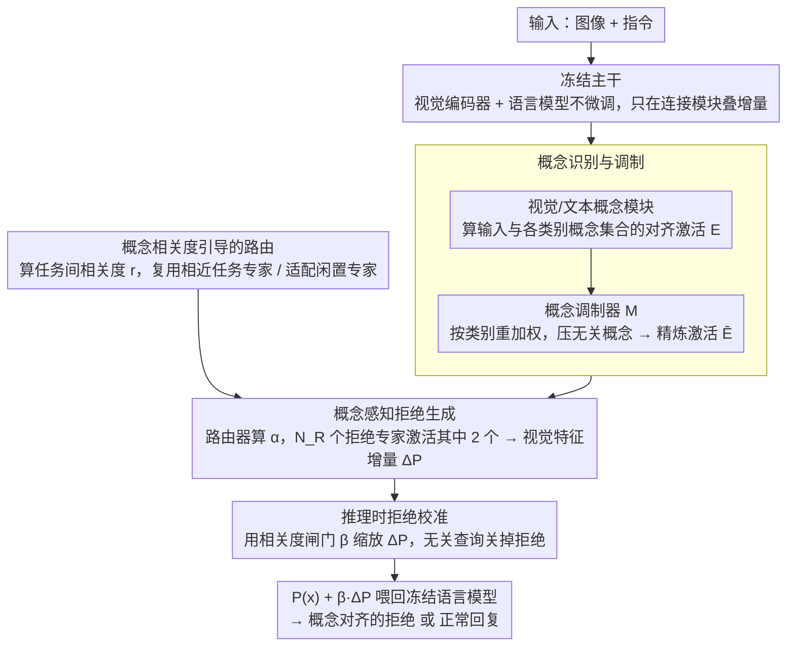

# Which Concepts to Forget and How to Refuse? Decomposing Concepts for Continual Unlearning in Large Vision-Language Models

**会议**: CVPR 2026  
**arXiv**: [2603.21484](https://arxiv.org/abs/2603.21484)  
**代码**: 无  
**领域**: 多模态VLM / 机器遗忘  
**关键词**: 持续遗忘, 大视觉语言模型, 概念分解, 拒绝专家混合, 选择性知识删除

## 一句话总结
本文提出CORE(COncept-aware REfuser)，一个面向大视觉语言模型(LVLM)持续遗忘的框架：通过将待删除的视觉-语言对分解为细粒度的视觉属性和文本意图概念，使用概念调制器识别需要拒绝的概念组合，再通过混合拒绝专家(refusers)生成概念对齐的拒绝回复，在16个连续遗忘任务上实现了90.67% CRR和88.02% AR的最佳遗忘-保留权衡。

## 研究背景与动机
1. **领域现状**：大视觉语言模型（如MiniGPT、InstructBLIP）在大规模多模态数据上预训练，已在各种视觉语言任务上取得卓越表现。然而，预训练数据中不可避免地包含不当或敏感内容，可能导致模型生成不良输出。
2. **现有痛点**：(a) 从零重训不可行——预训练数据往往不可获取，且计算成本巨大；(b) 删除请求是随时间序列到达的（用户需求、AI法规驱动），需要"持续遗忘"而非一次性遗忘；(c) 现有遗忘方法（梯度上升、随机标签等）在序列更新中会扭曲共享表示，产生虚假关联——模型将视觉-语言模式的表面线索误认为是拒绝信号，导致两类错误：**不相关拒绝**（对前序遗忘任务产生语义不对齐的拒绝）和**过度拒绝**（对正常查询错误拒绝）。
3. **核心矛盾**：LVLM中视觉和语言表示高度纠缠，编辑特定知识时容易波及其他信息。随着序列化遗忘任务增多，这种纠缠导致的"表示扭曲"不断积累，模型越来越难区分"该拒绝什么"和"不该拒绝什么"。
4. **本文目标** (a) 如何在多步遗忘中精确识别需要拒绝的概念组合（which to forget）；(b) 如何生成语义上与遗忘目标对齐的拒绝回复而非泛化地拒绝一切（how to refuse）。
5. **切入角度**：作者的核心洞察是——概念级的方法能实现更精确、可解释的遗忘：显式提取待遗忘概念并拒绝相关概念组合，比直接操控参数能更好地缓解虚假关联。
6. **核心 idea**：将视觉-语言删除目标分解为视觉属性概念和文本意图概念，通过概念调制器识别各遗忘类别的独特概念组合，再通过路由机制调度专用拒绝专家来生成概念感知的拒绝响应。

## 方法详解

### 整体框架
CORE要解决的是一个"边删边用"的问题：LVLM在使用过程中不断收到新的删除请求，每个请求都要让模型对一类敏感内容学会拒绝，又不能波及其他知识。它的做法是把整个视觉编码器和语言模型都冻住，只在它们之间的连接模块上动手脚——既不重训、也不直接改原参数。一条遗忘请求进来后，CORE先把它拆成"看到了什么"（视觉属性概念）和"想干什么"（文本意图概念）两组细粒度概念，再判断这些概念组合是不是命中了某个已学的遗忘类别；命中了就调度一组专门的"拒绝专家"去改写视觉特征，引导语言模型生成一句语义对得上的拒绝；推理时还会按输入和遗忘目标的概念相关度来决定"这句拒绝该不该发、发多强"。整条链路从概念识别与调制、专家路由到拒绝生成层层收束，把"该拒绝什么"和"不该拒绝什么"逐步分离开。

### 关键设计

**1. 概念识别与调制：把"遗忘什么"变成可解释的概念激活，并压住越积越多的概念串扰**

遗忘的难点在于不能直接说"删掉某张图"，得说清"删掉的是什么概念"。CORE对每个遗忘类别 $k$ 用LLM离线生成 20 个视觉属性概念（如"举着标语的示威者"）和 20 个文本意图概念，每个概念模块 $\bm{\mathcal{E}}_{\text{q},k}$ 负责算出输入与概念集合 $\mathcal{C}_{\text{q},k}$ 之间的对齐激活分数。为了让这些激活真的有语义而不是乱打分，训练时用CLIP编码器的相似度当监督信号把概念锚到语义空间：$\mathcal{L}_{\text{con}} = -\sum \text{sim}(E^t_{\text{q},i}, \hat{E}_{\text{q},i})$。真正棘手的是连续遗忘特有的副作用——任务一多，不同类别的概念语义开始重叠，一个输入会同时点亮一堆并不相关的概念，拒绝行为随之失准。调制器 $\bm{\mathcal{M}}$ 就是为此而设：它用一个分类头先判断输入更像哪个遗忘类别，输出一组权重 $\{m_k\}$ 去重加权概念激活，压制无关类、突出当前类，

$$\bar{E}^t_{\text{q},i} = \bigoplus_{k} m_k \cdot \bm{\mathcal{E}}_{\text{q},k}(x^t_{\text{q},i})$$

效果上，没有调制器时论文可视化里会冒出大片错误点亮的概念，消融也印证了这一点：去掉调制器(MOD)后 CRR 从 88.14% 掉到 83.95%(Avg)、AR 从 86.74% 掉到 74.31%。

**2. 概念感知拒绝生成：用一组轻量"拒绝专家"改写视觉特征，而不去碰原模型参数**

识别出该拒绝之后，问题变成"怎么拒得对"。CORE不去微调预训练模型，而是引入 $N_R=20$ 个拒绝专家(refuser) $\{\mathcal{V}_j\}$，每个都是一个轻量连接模块；路由器 $\mathcal{R}$ 根据调制后的概念激活算出各专家的贡献权重 $\{\alpha_j\}$，把它们的输出混合后加到预训练连接模块的视觉特征上：

$$\Delta\mathcal{P}(x^t_{\text{img}}) = \sum_j \alpha_j \cdot \mathcal{V}_j(x^t_{\text{img}})$$

每个样本只激活其中 2 个专家，保持稀疏。被改写后的视觉特征喂回冻结的语言模型，就能引导它说出一句与当前概念对齐的拒绝。这样做的好处是：因为只在连接模块这一层叠加增量、不动主干，预训练能力原封不动，拒绝行为却能做到一类一类地精确。

**3. 概念相关度引导的路由：让固定数量的专家在"复用"和"专项"之间各就各位**

专家数量是定死的 20 个，但遗忘任务会不断增加，于是必须解决"新任务到底该复用老专家还是占用闲置专家"。CORE显式算出当前任务 $t$ 与每个前序任务 $t'$ 的概念相关度，把视觉端和文本端的相似度乘起来再过一个 sigmoid：

$$r^{t'} = \sigma\big(\text{sim}(\bar{E}^t_{\text{img}}, \bar{E}^{t'}_{\text{img}}) \cdot \text{sim}(\bar{E}^t_{\text{txt}}, \bar{E}^{t'}_{\text{txt}})\big)$$

然后按相关度对路由输出做对比约束——语义相近($r^{t'}$ 高)就用 $\ell_+$ 把两个任务的路由拉到一起以共享专家，语义无关($r^{t'}$ 低)就用 $\ell_-$ 把它们推开以避免互相覆盖：

$$\mathcal{L}_{\text{ref}} = \sum_{t'} \big[r^{t'} \cdot \ell_+(F^t, F^{t'}) + (1-r^{t'}) \cdot \ell_-(F^t, F^{t'})\big]$$

没有这层引导，专家就会被胡乱复用、相关任务把不相关概念也一并覆盖——消融里去掉路由(ACT)后 CRR 直接从 88.14% 崩到 54.53%，跌幅最显眼。

**4. 推理时拒绝校准：用一个相关度阈门决定"这句拒绝到底发不发"**

前三步保证了"拒得准"，但还有个反向风险：正常查询不该被拒。CORE在推理时算出当前查询与所有已遗忘任务的最高概念相关度 $\beta \in [0,1]$，用它当闸门去缩放拒绝专家的增量：

$$\mathcal{P}(\bar{x}_{\text{img}}) + \beta \cdot \Delta\mathcal{P}(\bar{x}_{\text{img}})$$

输入和遗忘目标毫不相关时 $\beta \to 0$，拒绝增量被关掉，模型照常回答；命中遗忘类别时 $\beta \to 1$，拒绝才全力生效。这一步看似简单却最关键：去掉校准(CAL)后 AR 从 86.74% 暴跌到 4.11%——也就是说模型会对几乎一切输入都拒绝，正是这个相关度闸门把它从"全拒"拉回了正常水平。

### 一个完整示例
假设第 8 个遗忘请求是"删除示威游行类图文"。一张举着标语的人群照配上"他们在抗议什么"的提问进来：概念模块先打分，视觉端点亮"举着标语的示威者""聚集的人群"，文本端点亮"询问事件背景"等概念；但因为前面已经学过"集会""政治人物"等相近类别，一批无关概念也被连带点亮。调制器识别出输入归属第 8 类，给该类权重调高、给"政治人物"等类压低，激活随之收敛到真正相关的几个概念上。路由器拿着这组精炼激活，发现第 8 类与早先学过的"集会"类相关度 $r$ 偏高，于是复用那一类的专家、再补一个闲置专家，最终只激活 2 个 refuser，把它们的特征增量加到视觉特征上，语言模型据此给出一句对得上的拒绝。等到推理阶段换成一张风景照提问"这是哪座山"，它与全部 8 个遗忘任务的最高相关度 $\beta$ 几乎为 0，拒绝增量被闸门关闭，模型正常作答——同一套机制既挡住了该拒的，也放行了该答的。

### 训练策略
训练分两阶段进行。先训概念模块和调制器（$\mathcal{L}_{\text{con}} + \mathcal{L}_{\text{mod}}$），把概念预测和类别归属这套"识别"能力建可靠；再训路由器和拒绝专家（$\mathcal{L}_{\text{ce}} + \mathcal{L}_{\text{ref}}$），生成概念感知的拒绝。为了在连续更新中不丢掉旧任务，训练时保留前序任务的特征原型作约束，缓解灾难性遗忘。

## 实验关键数据

### 主实验（Vicuna-based LVLM，16个连续遗忘任务后）

| 方法 | S↑ (通用能力) | AR↑ (保留回答率) | CRR↑ (上下文拒绝率) | ΔRR↓ (拒绝偏差) |
|------|-------------|-----------------|-------------------|-----------------|
| EWC | 76.22 | 24.90 | 51.01 | 35.38 |
| LwF | 72.09 | 43.12 | 41.01 | 33.13 |
| SCRUB | 63.38 | 8.84 | 57.69 | 36.95 |
| MoEAdapter | 94.46 | 54.25 | 52.82 | 31.98 |
| O3 | 92.85 | 81.76 | 73.03 | 9.03 |
| **CORE (Ours)** | **96.54** | **88.02** | **90.67** | **3.74** |

### 消融实验（Avg指标）

| MOD | ACT | CAL | S↑ | AR↑ | CRR↑ | ΔRR↓ |
|-----|-----|-----|-----|------|------|------|
| ✓ | ✓ | ✓ | **97.64** | **86.74** | **88.14** | 8.38 |
| ✗ | ✓ | ✓ | 93.10 | 74.31 | 83.95 | 8.17 |
| ✓ | ✗ | ✓ | 93.82 | 86.90 | 54.53 | 33.81 |
| ✓ | ✓ | ✗ | 37.71 | 4.11 | 86.09 | 10.79 |

### 关键发现
- **三个组件缺一不可**：去MOD导致概念识别不准(AR下降12.4%)；去ACT导致CRR暴跌33.6%，refuser被错误复用；去CAL最致命——AR降至4.11%，模型对几乎一切都拒绝。
- **CORE在整个遗忘序列中保持稳定**：Figure 3显示传统方法（EWC/LwF等）随遗忘步数增加，通用能力和保留数据性能持续下降，而CORE保持恒定。
- **跨LVLM泛化**：在LLaMA-2-based LVLM上，CORE同样显著优于O3(AR: 84.41% vs 66.73%，CRR: 84.54% vs 76.74%)。
- **概念可视化证实了调制器的有效性**：有调制器时激活的概念高度聚焦（如"举着标语的示威者"），无调制器时大量无关概念被激活。

## 亮点与洞察
- **概念分解的思路**非常优雅：将"遗忘什么"转化为"在概念空间中定位什么"，天然支持可解释性——可以直接查看哪些视觉属性和文本意图触发了拒绝。
- **推理时校准机制**是实用性的关键：通过输入与遗忘任务的概念相关度动态调整拒绝强度，完美解决了过度拒绝问题。这种简单机制将AR从4.11%拉回到86.74%。
- **refuser路由的设计**借鉴了MoE思想，通过概念相似度复用/适配refusers，使得固定数量的refusers可以处理不断增长的遗忘任务。

## 局限与展望
- 概念描述由LLM生成，质量依赖LLM能力且缺乏验证机制——错误的概念描述可能导致错误的拒绝边界
- 每个遗忘类别固定20个视觉+20个文本概念，对于概念复杂度差异大的类别可能不够灵活
- refuser初始化自预训练连接模块，refuser之间缺乏多样性保证，可能导致功能冗余
- 实验场景相对受限（安全benchmark 6类 + ImageNet-R 80类），更复杂的真实世界遗忘场景待验证
- 未讨论遗忘任务数量极大（如100+任务）时概念空间膨胀的可扩展性问题

## 相关工作与启发
- **vs O3**: O3引入小型参数子集+随机标签做遗忘，保持预训练参数不变；CORE同样保持主模型不变但通过概念级的refuser混合实现更精确的拒绝，CRR提升17.6%
- **vs MoEAdapter**: 同为MoE思路但MoEAdapter不进行概念分解，CRR仅52.82%，远低于CORE的90.67%
- **vs 概念瓶颈模型**: CORE借鉴了CBM的概念激活思想，但创新性地将其应用于遗忘场景并加入调制器处理概念膨胀

## 评分
- 新颖性: ⭐⭐⭐⭐⭐ 概念分解+拒绝专家混合的框架设计在持续遗忘中非常新颖
- 实验充分度: ⭐⭐⭐⭐⭐ 双LVLM验证、完整消融、可视化分析、序列稳定性分析全面
- 写作质量: ⭐⭐⭐⭐ 框架描述清晰，但符号较多，部分定义需要反复对照
- 价值: ⭐⭐⭐⭐⭐ 概念级遗忘为LVLM安全性提供了实用且精确的解决方案

<!-- RELATED:START -->

## 相关论文

- [\[AAAI 2026\] AUVIC: Adversarial Unlearning of Visual Concepts for Multi-modal Large Language Models](../../AAAI2026/llm_safety/auvic_adversarial_unlearning_of_visual_concepts_for_multi-mo.md)
- [\[CVPR 2026\] Designing to Forget: Deep Semi-parametric Models for Unlearning](designing_to_forget_deep_semi-parametric_models_for_unlearning.md)
- [\[CVPR 2026\] VL-Eraser: Vacuum Distillation for Machine Unlearning in Vision-Language Models](vl-eraser_vacuum_distillation_for_machine_unlearning_in_vision-language_models.md)
- [\[CVPR 2026\] Towards Reasoning-Preserving Unlearning in Multimodal Large Language Models](towards_reasoning-preserving_unlearning_in_multimodal_large_language_models.md)
- [\[CVPR 2026\] Test-Time Attention Purification for Backdoored Large Vision Language Models](test-time_attention_purification_for_backdoored_large_vision_language_models.md)

<!-- RELATED:END -->
