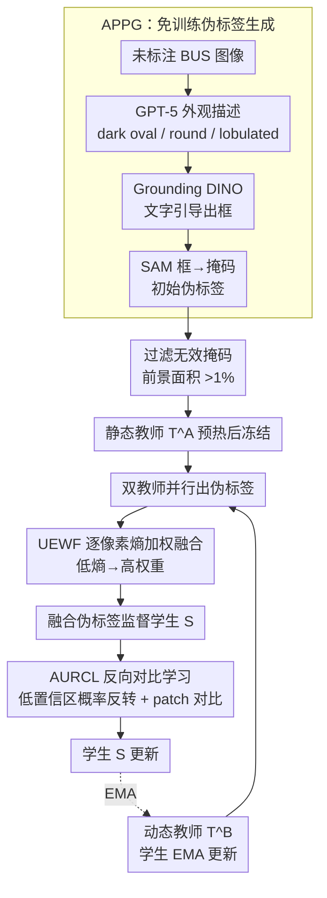

# A Semi-Supervised Framework for Breast Ultrasound Segmentation with Training-Free Pseudo-Label Generation and Label Refinement

**会议**: CVPR 2026  
**arXiv**: [2603.06167](https://arxiv.org/abs/2603.06167)  
**代码**: 待确认  
**领域**: 医学图像  
**关键词**: 半监督分割, 乳腺超声, 伪标签, 双教师框架, 对比学习, SAM, Grounding DINO

## 一句话总结

提出面向乳腺超声（BUS）图像分割的半监督框架，利用 GPT-5 生成外观描述 + Grounding DINO + SAM 免训练生成伪标签（APPG），结合双教师框架（静态+动态）通过不确定性-熵加权融合（UEWF）和自适应不确定性引导反向对比学习（AURCL）精炼标签，仅用 2.5% 标注即接近全监督性能。

## 研究背景与动机

### 1. 领域现状
乳腺超声（BUS）是乳腺癌筛查的重要影像手段，肿瘤的精确分割是计算机辅助诊断的基础。深度学习方法依赖大规模像素级标注，但医学图像的标注成本极高——需要专业放射科医生逐像素标注，耗时且昂贵。半监督学习（SSL）通过利用大量未标注数据+少量标注数据来缓解这一问题，但在 BUS 场景中面临特殊困难。

### 2. 痛点
BUS 图像的特殊性：(1) 肿瘤与周围组织对比度低，边界模糊；(2) 不同肿瘤形态差异大（椭圆形、圆形、分叶状）；(3) 超声固有的斑点噪声和伪影。这些因素导致 SSL 方法的核心假设——模型能从少量标注中学到可靠的伪标签——在 BUS 中严重受损。特别是在极少标注（如 2.5%）的场景下，伪标签质量极差，模型陷入确认偏差的恶性循环。

### 3. 核心矛盾
传统 SSL（如 Mean Teacher）依赖模型自身生成伪标签，但模型在极少标注下本身就不可靠，生成的伪标签噪声大，反过来进一步误导训练。这是"鸡和蛋"的困境：需要好的伪标签来训练好模型，但好模型的前提是有好的伪标签。

### 4. 要解决什么
(1) 在极少标注下获得高质量初始伪标签，打破冷启动困境；(2) 在训练过程中持续精炼伪标签，避免单一教师的确认偏差；(3) 增强模型对边界不确定区域的判别能力。

### 5. 切入角度
利用视觉-语言基础模型（GPT-5 + Grounding DINO + SAM）作为免训练的伪标签生成器，跳过模型冷启动阶段；再用双教师+不确定性感知融合来持续精炼。

### 6. 核心 idea
分三步解决极少标注下的 BUS 分割：(1) APPG 利用乳腺肿瘤的通用外观先验，转化为自然语言 prompt 驱动基础模型生成免训练伪标签；(2) 静态教师（伪标签 warmup 后冻结）和动态教师（EMA 更新）提供互补视角；(3) UEWF 按不确定性加权融合两教师输出，AURCL 通过反向对比学习专门强化边界判别。

## 方法详解

### 整体框架

这篇论文要解决的是极少标注（低至 2.5%）下乳腺超声分割的冷启动困境：模型还没学好就得自己生成伪标签，而烂伪标签又把模型带偏。它的破局思路是把"第一批伪标签"完全外包给视觉-语言基础模型，再用两个互补教师在训练中持续把伪标签擦干净。

整体分三阶段走。第一阶段 APPG 把 GPT-5 写出的肿瘤外观描述喂给 Grounding DINO 定位、再交给 SAM 分割，为所有未标注图像免训练地生成一批初始伪标签。第二阶段先按前景面积阈值（>1% 图像面积）过滤掉空/无效掩码，再用这批伪标签做 warmup，把训好的模型冻结成静态教师 $T^A$。第三阶段进入双教师半监督训练：冻结的 $T^A$ 和随学生 EMA 更新的动态教师 $T^B$ 同时给出伪标签，经 UEWF 逐像素融合后监督学生，AURCL 再专门盯住边界模糊区域补一刀对比学习。

### 关键设计

**1. APPG：把肿瘤外观先验外包给基础模型，免训练拿到第一批伪标签**

冷启动困境的根子是"没有可信伪标签来源"。APPG 绕开模型自身，转而利用一个事实：BUS 里的肿瘤外观高度可预测——几乎都是低回声（暗色）区域，形状无非椭圆形、圆形或分叶状。于是让 GPT-5 把这点医学常识写成自然语言描述（如 "dark oval region"、"dark round mass"、"dark lobulated area"），当作 text prompt 送进 Grounding DINO 做开放词汇检测，吐出边界框；再把框当作空间 prompt 喂给 SAM，由 SAM 给出像素级掩码当伪标签。整条链路完全不碰标注数据，纯靠 VLM 的零样本能力。它之所以管用，是因为 Grounding DINO 擅长按文字定位、SAM 擅长按 prompt 精分割，两者刚好补上"语言先验→空间框→像素掩码"这条缺口，比让一个没训好的分割模型瞎猜要靠谱得多。

**2. 双教师框架：一个冻结锚点 + 一个动态跟随，打断 EMA 退化循环**

单一 EMA 教师（如 Mean Teacher）在极少标注下有个致命的正反馈环：错误伪标签让学生学偏，EMA 教师又是学生的滑动平均、跟着一起偏，于是伪标签越来越差。本文用两个教师拆掉这个环。静态教师 $T^A$ 是 warmup 后直接冻结的权重，编码了来自基础模型那批初始知识，不再被后续训练噪声污染，提供一个稳定不漂移的伪标签基线；动态教师 $T^B$ 从同一初始化出发、按 EMA 持续跟踪学生，能吸收训练中新学到的知识、适应分布变化，代价是可能累积误差。两者各出一份伪标签 $\hat{y}^A$ 和 $\hat{y}^B$，再交给 UEWF 融合成 $\hat{y}^F$。$T^A$ 就像一个独立于训练过程的"锚"，哪怕 $T^B$ 跟学生一起飘了，它也能把融合结果拽回来。

**3. UEWF：按逐像素熵给两个教师分权重，谁更确定听谁的**

两个教师在不同区域的可靠性并不一样——$T^A$ 结构稳但不够灵活，$T^B$ 时序一致但可能带噪，简单平均会把好的和坏的搅在一起。UEWF 的做法是对每个像素分别算两教师预测的 Shannon 熵 $\mathbf{E}_A$、$\mathbf{E}_B$（熵低=该像素预测更笃定），先用 patch 级平均池化（$k=14$）把熵图平滑一下，压掉超声的斑点噪声、让权重反映区域级而非单像素的可靠性；随后**各教师的权重就取自身平滑熵的倒数**，再做归一化加权平均：

$$\mathbf{w}_{A,B} = \frac{1}{\mathbf{E}^{\text{smooth}}_{A,B} + \epsilon}, \quad \hat{\mathbf{y}}^F = \frac{\mathbf{w}_A \cdot \hat{\mathbf{y}}^A + \mathbf{w}_B \cdot \hat{\mathbf{y}}^B}{\mathbf{w}_A + \mathbf{w}_B + \epsilon}$$

某像素上谁更不确定（熵高），它的权重 $1/\mathbf{E}^{\text{smooth}}$ 就越小；谁更笃定，权重就越大。这样融合是逐像素自适应的，且整套机制不引入任何额外可学参数，算一次熵就能用。

**4. AURCL：把"模型拿不准"的边界区域反转成可学信号，用对比学习补强**

标准 SSL 把高置信区域吃得很透，但对边界模糊这类模型"拿不准"的区域几乎使不上劲，而这恰恰是 BUS 分割最难的地方。AURCL 专门挖这些难例。它先从学生预测 $\mathbf{p}=\sigma(S(x))$ 算置信图 $\mathbf{C}=1-\mathbf{p}$，再用一个动态 top-K 阈值 $\tau_i = \max(\text{top-}K(\mathbf{C}_i, K),\ \tau_{\text{fix}})$（$K=rHW$，$r$ 为反转比例，$\tau_{\text{fix}}=0.2$ 兜底）筛出低置信像素、得到掩码 $\mathbf{M}^{\text{low}}$；这个自适应阈值保证每张图都能稳定选出足够多的不确定像素、又不让早期过自信。关键一步是"概率反转"——只在 $\mathbf{M}^{\text{low}}$ 选中的低置信像素上把概率取 $1-\mathbf{p}$、其余像素保持原值，得到反转视图 $\tilde{\mathbf{p}}$。随后分别以 $\mathbf{p}$、$\tilde{\mathbf{p}}$ 为权重做加权平均池化，抽出原视图和反转视图的 patch 级特征 $\mathbf{f}_{i,j}$、$\tilde{\mathbf{f}}_{i,j}$。对比学习是**跨视图、同位置**的：同一个 patch 的（原视图特征，反转视图特征）构成正对，同图其他 patch 的反转特征当负样本，用余弦相似度 + 温度的 InfoNCE 拉近正对、推远负对。换句话说，它没有简单地把不确定区域丢掉（以往不确定性常被用来过滤伪标签），而是把不确定性当成额外信号回收利用，逼模型在边界模糊处也能学出跨视图一致的稳定表示，补上像素级损失够不到的地方。

### 一个完整示例：一张未标注 BUS 图像怎么走完全程

拿一张没有标注的乳腺超声图举例，看伪标签如何被层层擦净：

1. **APPG 起手**：GPT-5 给出三条外观描述，Grounding DINO 各自定位、NMS 去冗余后取置信度最高的框，SAM 据此分割出一个掩码。此时这张图就有了初始伪标签，但质量有限——APPG 伪标签与真值的平均 Dice 约 66%（BUSI），边界尤其糊。
2. **两教师各表态**：训练某一步时，冻结的 $T^A$ 给出一份偏稳的预测，EMA 跟随的 $T^B$ 给出一份带新知识但可能略飘的预测。
3. **UEWF 逐像素裁决**：在肿瘤主体这种两教师都笃定的区域，融合结果干净一致；在某段模糊边界上，若 $T^B$ 熵高、$T^A$ 熵低，融合就更偏向 $T^A$，把 $T^B$ 的抖动压下去，得到 $\hat{y}^F$。
4. **AURCL 收尾**：置信图 $\mathbf{C}=1-\mathbf{p}$ 经 top-K 阈值标出这段边界仍是低置信区，AURCL 把它的概率反转成另一视图，再让同位置 patch 的原视图与反转视图特征互为正对做对比学习，逼模型在边界模糊处也能学出一致、可分的表示。

几个 epoch 下来，同一张图的伪标签从 APPG 的粗掩码被一步步精炼，模型对低对比度边界的判别也随之变好。

### 损失函数 / 训练策略

- 有标注数据：标准分割监督损失（CE + Dice）
- 无标注数据：UEWF 融合伪标签的分割损失 + AURCL 对比损失
- 总损失：$\mathcal{L} = \mathcal{L}_{\text{sup}} + \lambda_1 \mathcal{L}_{\text{unsup}} + \lambda_2 \mathcal{L}_{\text{AURCL}}$
- 学生模型为 U-Net 变体，$T^B$ 的 EMA 衰减率 $\alpha = 0.999$
- APPG 中每张图像使用3种外观描述生成候选框，NMS 去冗余后取最高置信度框

## 实验关键数据

### 主实验

在4个公开 BUS 数据集（BUSI、UDIAT、BUS-BRA、TN3K）上评估，标注比例 2.5%、5%、10%。

**关键结果（Dice %）**：

| 方法 | BUSI 2.5% | BUSI 5% | BUSI 10% | UDIAT 2.5% | UDIAT 5% | UDIAT 10% |
|------|-----------|---------|----------|------------|---------|-----------|
| Supervised-only | 51.2 | 60.8 | 69.4 | 53.7 | 63.2 | 71.5 |
| Mean Teacher | 58.6 | 66.3 | 73.8 | 60.4 | 68.1 | 75.2 |
| CPS | 59.1 | 67.0 | 74.1 | 61.2 | 69.3 | 75.8 |
| UniMatch | 62.4 | 69.5 | 76.2 | 64.0 | 71.8 | 78.1 |
| **Proposed** | **71.8** | **75.3** | **79.6** | **72.5** | **76.9** | **81.4** |
| Full Supervision | 80.2 | 80.2 | 80.2 | 82.1 | 82.1 | 82.1 |

关键发现：(1) 2.5% 标注下本文方法（71.8% Dice on BUSI）大幅超越最强基线 UniMatch（62.4%），提升 +9.4%；(2) 2.5% 标注性能已达全监督的 89.5%（71.8/80.2），5% 标注下达到 93.9%；(3) 在所有4个数据集、所有标注比例下均一致超越。

### 消融实验

**组件消融（BUSI 2.5% Dice）**：

| 配置 | Dice (%) |
|------|----------|
| Baseline（单教师 Mean Teacher） | 58.6 |
| + APPG 伪标签初始化 | 65.2 |
| + 双教师（简单平均） | 67.8 |
| + UEWF（替代简单平均） | 69.5 |
| + AURCL（完整方法） | 71.8 |

每个组件均有清晰贡献：APPG（+6.6%）> 双教师（+2.6%）> UEWF（+1.7%）> AURCL（+2.3%）。APPG 的免训练伪标签是最大贡献者。

### APPG 伪标签质量

APPG 生成的伪标签与真实标注的平均 Dice：BUSI 66.3%、UDIAT 68.7%。虽不完美，但远优于随机初始化的模型预测（~35-40%），为后续训练提供了强有力的起点。

## 亮点与洞察

1. **VLM 作为免费午餐**：利用 GPT-5 + Grounding DINO + SAM 的组合，将医学领域知识（乳腺肿瘤外观）零成本转化为初始伪标签，巧妙跳过冷启动困境
2. **静态+动态教师设计简洁有效**：静态教师作为锚点防止漂移，动态教师跟踪学习进度，UEWF 逐像素自适应融合——无需复杂架构改动
3. **AURCL 的反转操作有洞察**：将"不确定"转化为"反向确定"的思路巧妙，对比学习在特征空间构建边界感知表示
4. **极少标注下优势明显**：2.5% 标注（仅几张有标注）就达到接近全监督性能，这对标注资源极度稀缺的医学场景意义重大

## 局限与展望

1. **APPG 依赖外观先验的通用性**：对乳腺肿瘤有效，但并非所有病变都有统一的低回声外观，推广到其他器官/病变类型需重新设计 prompt
2. **GPT-5 + Grounding DINO + SAM 的部署成本**：虽是免训练但推理成本不低，特别是 GPT-5 的 API 调用成本
3. **伪标签质量上限**：APPG 的 ~67% Dice 仍有较大提升空间，SAM 对低对比度超声图像的分割精度有限
4. **未探索更强的分割骨干**：主要基于 U-Net，未测试 Swin-UNet、TransUNet 等更强架构
5. **对比学习超参数敏感性**：AURCL 中不确定性阈值 $\tau$ 和对比温度对性能的影响未充分分析

## 相关工作与启发

- **SSL 分割方法演进**：Mean Teacher → CPS（互学习）→ UniMatch（多视角一致性）→ 本文（VLM 伪标签 + 双教师），趋势是引入更强的先验来弥补标注不足
- **VLM 在医学图像中的应用**：MedSAM、SAMed 等微调 SAM 做医学分割，但需要目标域标注；本文的 APPG 完全免训练，更符合低标注场景需求
- **不确定性在 SSL 中的角色**：以往主要用不确定性做伪标签过滤（丢弃不确定样本），本文的 AURCL 反转思路将不确定区域变为可利用的正信号，可推广到其他 SSL 框架

## 评分

⭐⭐⭐⭐ 方案完整且各组件互补性强，APPG 利用 VLM 免训练生成伪标签的思路在极少标注医学场景下非常实用，4个数据集全面验证；不足在于 APPG 的外观先验通用性有限，且 VLM 推理成本未讨论。

<!-- RELATED:START -->

## 相关论文

- [\[CVPR 2026\] SemiTooth: a Generalizable Semi-supervised Framework for Multi-Source Tooth Segmentation](semitooth_a_generalizable_semisupervised_framework.md)
- [\[CVPR 2026\] Weakly Supervised Teacher-Student Framework with Progressive Pseudo-mask Refinement for Gland Segmentation](weakly_supervised_teacher-student_framework_with_progressive_pseudo-mask_refinem.md)
- [\[CVPR 2026\] Uncertainty-Aware Concept and Motion Segmentation for Semi-Supervised Angiography Videos](uncertainty-aware_concept_and_motion_segmentation_for_semi-supervised_angiograph.md)
- [\[CVPR 2026\] Semantic Class Distribution Learning for Debiasing Semi-Supervised Medical Image Segmentation](semantic_class_distribution_learning_for_debiasing.md)
- [\[AAAI 2026\] ProPL: Universal Semi-Supervised Ultrasound Image Segmentation via Prompt-Guided Pseudo-Labeling](../../AAAI2026/medical_imaging/propl_universal_semi-supervised_ultrasound_image_segmentation_via_prompt-guided_.md)

<!-- RELATED:END -->
