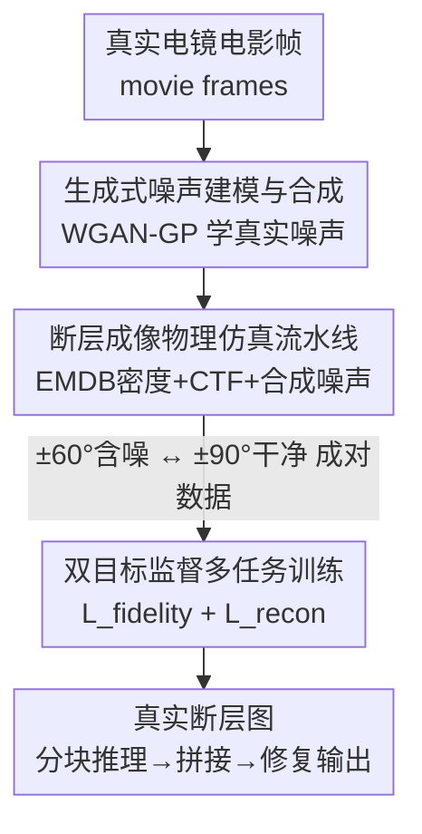

# A Supervised Multi-task Framework for Joint cryo-ET Restoration Enabled by Generative Physical Simulation

**会议**: CVPR 2026  
**论文**: [CVF Open Access](https://openaccess.thecvf.com/content/CVPR2026/html/Wang_A_Supervised_Multi-task_Framework_for_Joint_cryo-ET_Restoration_Enabled_by_CVPR_2026_paper.html)  
**代码**: https://github.com/ZhidongYang/CryoDeRec  
**领域**: 医学图像 / 图像恢复  
**关键词**: 冷冻电子断层成像, 去噪, 缺失楔修复, 多任务学习, 物理仿真  

## 一句话总结
cryoDeRec 用一条「生成式噪声建模 + 物理成像仿真」流水线造出"含噪输入 ↔ 干净 GT"的成对断层图，把一直只能靠自监督做的 cryo-ET 去噪与缺失楔（missing wedge）修复改成**全监督多任务训练**，单个 U-Net 同时干两件事，在 4 个真实 + 2 个仿真数据集上全面超过 Topaz-Denoise / SC-Net / IsoNet。

## 研究背景与动机
**领域现状**：冷冻电子断层成像（cryo-ET）能在近原生状态下三维可视化细胞、病毒、蛋白质等生物结构，是结构生物学的利器。但成像有两个先天缺陷：① 为避免辐照损伤，电子剂量必须压得很低，导致每张投影信噪比（SNR）极低；② 倾斜角范围受限（通常只能 ±60°，到不了 ±90°），使得傅里叶空间里有一块楔形区域**永远没被采样**，重建出的断层图带有楔形伪影（missing wedge artifacts）。

**现有痛点**：要做监督学习就需要"干净、完整"的断层图当 ground truth，但这种 GT 在实验上根本拿不到（你没法真的把噪声和缺失角补全后再测一次）。这个 **"missing GT" 困境**把整个领域逼向了自监督（SSL）。而现有 SSL 方法几乎都把去噪和缺失楔修复**当成两个孤立问题**：纯去噪方法（Topaz-Denoise、SC-Net）无视缺失楔，纯重建方法（IsoNet）对输入噪声极其敏感。

**核心矛盾**：这两个问题其实是**深度耦合**的——去噪模型会被结构化的楔形伪影误导（把伪影当信号），重建模型又会把噪声一起传播放大。少数尝试联合求解的方法仍然停留在自监督，缺了干净 GT，模型就分不清"结构化缺失楔伪影"和"真实生物信号"，导致伪影去不干净。

**本文目标**：在一个网络里**同时且有效**地解决去噪 + 缺失楔修复，且要能直接用在真实数据上、无需任何预处理。

**切入角度**：既然真实 GT 拿不到，那就**造一个高保真的合成训练集**——只要仿真能同时抓住"真实噪声分布"和"各向同性的结构先验"，监督学习就能用合成数据训练、再泛化到真实断层图。关键是噪声不能再用一个固定高斯分布糊弄，得让模型学到电镜里复杂的真实噪声。

**核心 idea**：用**生成式物理仿真**造出成对（含噪/有缺失楔 ↔ 干净/全角）数据，把 cryo-ET 修复从自监督升级成**双目标全监督多任务学习**。

## 方法详解

### 整体框架
cryoDeRec 整条管线分两大阶段。**阶段一是数据工厂**：先用一个生成式噪声合成器从真实电镜的电影帧（movie frames）里学出真实噪声分布，再把这个噪声生成器接进一条物理成像仿真流水线——用 EMDB 真实结构密度图按生物学分布摆进体积、做 CTF 调制、加上学到的真实噪声、按 ±60° 投影后 WBP 重建，得到**含噪 + 有缺失楔的断层图**；同一套干净投影按 ±90° 全角重建，得到**近似无缺失信息的干净 GT**。这样就凭空造出了监督学习需要的成对数据。**阶段二是修复网络**：一个五层 U-Net 在这批合成数据上做双目标训练，一个目标管"从噪声里恢复全局结构保真度"，另一个目标管"重建傅里叶空间里缺失的精细信息"。训练好的模型直接对真实倾斜序列 WBP 出的断层图分块推理、再拼接，无需在真实数据上微调。

### 关键设计

**1. 生成式噪声建模与合成：别再假装噪声是高斯**

痛点很直接：以往 cryo-ET 仿真把噪声当成单一高斯分量，但电镜的真实噪声根本不服从固定统计分布，用高斯造的训练集和真实数据存在域差，监督学习自然学不到真信号边界。本文改用**神经网络隐式地学真实噪声的主导成分**。具体做法：在某个倾斜角 $i$，先把多帧电影 $F^i_1,\dots,F^i_T$ 做运动校正平均成单张投影 $P_i = \text{Correction}(F^i_1,\dots,F^i_T)$，再用某一帧与校正结果之差 $N_i = F^i_T - P_i$ 当作近似噪声图作为训练参考。然后用 WGAN-GP 在 2D 噪声 patch 上训练一个噪声生成器，对抗损失为

$$L_{adv} = \mathbb{E}_{\tilde N \sim P_g}[D(\tilde N)] - \mathbb{E}_{N \sim P_r}[D(N)] + \lambda\, \mathbb{E}_{\hat N \sim P_{\hat N}}\big[(\|\nabla D(\hat N)\|_2 - 1)^2\big]$$

前两项估计生成分布 $P_g$ 与真实分布 $P_r$ 的 Wasserstein 距离，最后一项是梯度惩罚（$\lambda=10$，$\hat N = \epsilon N + (1-\epsilon)\tilde N$）强制 1-Lipschitz。这样生成的噪声 patch 在统计分布和空间特征上都贴合真实噪声（消融里直方图几乎重合），合成数据和真实数据之间的域差被这一步堵住，是后面监督学习能直接迁移到真实断层图的前提。

**2. 断层成像物理仿真流水线：把"拿不到的干净 GT"造出来**

这是绕开 "missing GT" 困境的核心。流水线把真实的物理成像过程拆成三块串起来：**结构密度合成**——从 EMDB 取真实结构密度图（HIV EMD-13390、核糖体 EMD-11999、核小体 EMD-31086），按 cryo-ET 里大分子团簇真实存在的 SAWLC 统计物理分布随机摆进 3D 体积，引入各向同性的结构先验；**CTF 调制**——按透射电镜成像物理对投影做对比度传递函数调制，

$$\text{CTF}(f) = -\cos\!\Big(\pi \Delta z\, \lambda_e f^2 - \tfrac{\pi}{2} C_s \lambda_e^3 f^4\Big)$$

其中离焦量 $\Delta z$ 控制信号被破坏的强度（固定 1.5 μm），$C_s=2.7$ mm、电压 300 keV 等取常用值；**噪声注入**——把设计 1 训练好的噪声生成器固定下来，把合成噪声直接加到倾斜序列上。最后用同一套干净投影分别按 ±60°（含缺失楔）和 ±90°（全角，近似无缺失）做 WBP 重建——后者就是监督训练用的**近似干净 GT**。这一步让"干净/完整断层图"从实验上不可得变成仿真可造，整个领域才得以从自监督切回全监督。需要注意：测试时模型仍然看不到未采样的傅里叶区域，它对缺失楔的填充本质是从训练数据学到的**结构先验**，而非对真实未观测信息的普适恢复（⚠️ 作者明确强调了这一点，不是无中生有地"看见"真值）。

**3. 双目标监督多任务训练：一个网络、两个互补目标**

痛点是去噪和缺失楔修复耦合，分开做会互相拖累。cryoDeRec 用**一个 U-Net 同时优化两个目标**，关键是给网络喂两种不同输入。**目标一·恢复结构保真度**：输入是合成含噪断层图 $V^{sn}$，目标是干净 GT $V^{sg}$，用数据保真损失把全局结构从噪声里拉回来，

$$L_{fidelity}(V^{sn}_i, V^{sg}_i) = \frac{1}{N}\sum_i \|\text{Network}(V^{sn}_i) - V^{sg}_i\|_2^2$$

但这个目标只对全局去噪敏感，对缺失楔造成的精细结构丢失修复很弱。**目标二·重建缺失信息**：先对含噪子块做随机刚体变换 $R_i$，再在傅里叶域**额外**乘一个缺失楔掩码 $\tilde V^{sn}_{R_i} = \mathcal F^{-1}(M_i \odot \mathcal F(V^{sn}_{R_i}))$，其中 $M_i$ 把 $(-\varphi, \varphi)$ 倾斜角之外的区域置 0、之内置 1——相当于**人为再制造一次缺失楔**，逼网络去补，

$$L_{recon} = \frac{1}{N}\sum_i \big\|\text{Network}(\tilde V^{sn}_{R_i}) - V^{sg}_{R_i}\big\|_2^2$$

总损失 $L_{DeRec} = L_{fidelity} + \lambda_{recon} L_{recon}$，$\lambda_{recon}=0.1$。两个目标互补：目标一保证去噪后结构不失真，目标二靠"主动遮挡—监督恢复"显式教会网络重建未观测频率。因为有真正的干净 GT 当监督，网络能把结构化缺失楔伪影和真实生物信号分开，这正是自监督方法做不到的。

### 损失函数 / 训练策略
- 噪声合成器：WGAN-GP，权重高斯初始化（强度 0.02），Adam（$\beta_1=0.5,\beta_2=0.999$），学习率 0.0002。
- 修复网络：与 Noise2Noise 同款五层 encoder/decoder U-Net，分块训练，batch size 4，patch 大小 $96^3$、重叠 32 像素，20% patch 作验证，训 100 epoch，Adam（$\beta_1=0.5,\beta_2=0.999$），学习率 0.001。
- 仿真数据：EMDB 三种结构随机分布，±60° 投影、增量角 $\theta=1°/2°/3°$，离焦 1.5 μm，tomo3d 做 WBP。

## 实验关键数据

### 主实验
真实数据集用 **CNR（对比度噪声比）/ ENL（等效视数，越大越平滑）** 评估，越大越好。cryoDeRec 只在合成数据上训练、未在任何真实断层图上微调：

| 数据集 | Noisy(WBP) | Topaz-Denoise | SC-Net | IsoNet | 本文 |
|--------|-----------|---------------|--------|--------|------|
| EMPIAR-10045 (核糖体) | 0.022/7.9 | 0.187/50.0 | 0.199/41.6 | 0.361/70.9 | **0.506/342.3** |
| EMPIAR-10499 (支原体) | 0.018/7.8 | 0.343/129.0 | 0.535/45.8 | 0.336/65.7 | **1.637/162.8** |
| EMPIAR-10678 (核小体) | 0.017/18.4 | 0.047/59.3 | 0.179/52.5 | 0.103/67.7 | **0.323/87.5** |
| EMPIAR-10643 (HIV-1) | 0.039/8.9 | 0.458/143.7 | 1.249/52.0 | 1.874/152.7 | **2.434/193.7** |

仿真数据集有干净 GT，用 **PSNR/SSIM**。不同 SNR 下（值越大越好）：

| 方法 | Tomo-5lzf SNR=0.5 | SNR=0.1 | Tomo-1qvr SNR=0.5 | SNR=0.1 |
|------|------|------|------|------|
| Noisy(WBP) | 5.97/0.203 | 4.88/0.172 | 5.83/0.224 | 4.74/0.181 |
| Topaz-Denoise | 6.25/0.411 | 7.03/0.357 | 6.68/0.457 | 6.62/0.384 |
| IsoNet | 7.15/0.415 | 7.10/0.401 | 7.61/0.384 | 7.56/0.384 |
| 本文 | **10.84/0.843** | **10.82/0.836** | **10.80/0.850** | **10.77/0.843** |

PSNR 直接拉高 ~3.5 dB，SSIM 从 0.4 量级飙到 0.84，且在 SNR=0.1 的极端噪声下几乎不掉点，说明监督多任务训练对噪声强度很鲁棒。不同倾斜角 $\varphi$（50°/60°）下结论一致，本文 PSNR 稳定在 10.3–10.8、SSIM ~0.83–0.85，而基线都卡在 7 左右。

### 消融实验
| 配置 | EMPIAR-10643 (CNR/ENL) | EMPIAR-10499 (CNR/ENL) | 说明 |
|------|------|------|------|
| Noisy | 0.039/8.876 | 0.018*/7.790 | 原始 WBP |
| w/o $L_{recon}$ | 2.174/171.225 | 1.318/145.883 | 只去噪，缺失楔伪影残留 |
| 完整损失 | **2.434/193.694** | **1.637/162.764** | $L_{recon}$ 补上缺失信息 |

> ⚠️ 上表 EMPIAR-10499 的 Noisy 列原文写作 0.022/7.790，疑似与 10045 串行，以原文为准。

### 关键发现
- **$L_{recon}$ 是缺失楔修复的关键**：去掉后噪声虽被清掉，但傅里叶空间里楔形伪影仍在（图中红箭头指示），CNR/ENL 明显下降；它专门负责把限制角丢失的精细结构补回来。
- **对更稀疏倾斜角鲁棒**：把增量角从 3° 加到 5°（缺失楔更宽）后，cryoDeRec 仍能恢复 x-y 切片结构、补全傅里叶高频区，验证了物理仿真带来的泛化能力。
- **合成噪声逼真度高**：消融里合成噪声（红）的统计分布和真实噪声（蓝）几乎重合，正是这一步堵住了合成→真实的域差，让"只训合成数据"能直接迁移到真实数据。
- **联合 > 孤立**：IsoNet 在低对比度、密集结构的 EMPIAR-10499 上产生模糊重建，而本文在对比度增强和结构恢复上都明显更好——印证了去噪与缺失楔修复耦合、应联合优化的判断。

## 亮点与洞察
- **把"造数据"当成核心贡献**：真正难的不是网络（就是个 Noise2Noise U-Net），而是用生成式噪声 + 物理仿真把实验上拿不到的干净 GT 造出来，从而把整个任务从自监督拉回全监督。这是"模型受限于数据时，去解决数据"的典型思路。
- **"主动再遮挡—监督恢复"很巧**：$L_{recon}$ 在已经有缺失楔的数据上**再人为乘一层缺失楔掩码**，制造出"已知答案的缺失"，把无 GT 的 inpainting 变成有 GT 的监督任务——这个把不可监督问题转成可监督的 trick 可迁移到其他限制角/缺失模态重建。
- **物理先验 + 生成式噪声两手抓**：结构用 EMDB 真实密度 + SAWLC 分布保证生物合理性，噪声用 WGAN-GP 学真实分布保证成像合理性，两者一起才让合成数据"以假乱真"。
- **诚实地界定能力边界**：作者明说缺失楔填充是学到的结构先验而非真值恢复，没有夸大成"看见未观测信息"，这点比很多 inpainting 论文克制。

## 局限与展望
- **结构多样性有限**：训练只用了 HIV / 核糖体 / 核小体三种 EMDB 结构，作者也承认要扩展到更多样的生物结构才能进一步泛化；面对训练分布外的全新大分子，先验填充的可靠性存疑。
- **缺失楔填充是先验外推**：本质是从训练数据学的先验，未观测频率区的填充不保证对应真实结构，下游做亚断层平均/定量分析时需谨慎。
- **依赖噪声合成质量**：整条监督管线的根基是合成噪声足够逼真，若换一类探测器/成像条件，噪声生成器可能要重训。
- **真实数据缺像素级 GT 评估**：真实集只能用 CNR/ENL 这类无参考指标，无法像仿真集那样直接 PSNR/SSIM 验证结构正确性。

## 相关工作与启发
- **vs Topaz-Denoise / SC-Net（纯去噪）**: 它们只去探测器噪声、无视缺失楔，HIV 等结构补不全；本文用多任务把缺失楔一并修，CNR/ENL 大幅领先。
- **vs IsoNet（纯缺失楔重建，自监督）**: IsoNet 需要反卷积预处理且对输入噪声/对比度敏感，低对比度数据上重建模糊；本文全监督、免预处理，直接从原始 WBP 输入修复。
- **vs Wiedemann et al.（自监督联合）**: 同样想联合做，但缺干净 GT，难以把楔形伪影和真实信号解耦；本文靠物理仿真造出 GT，把任务升级成全监督，伪影去除更彻底。
- **启发**: 当"真值不可得"卡住监督学习时，不必死磕自监督——可以反过来用生成式 + 物理仿真把高保真成对数据造出来，这个范式对其他逆问题（限制角 CT、MRI 欠采样重建）同样有借鉴价值。

## 评分
- 新颖性: ⭐⭐⭐⭐ 把 cryo-ET 修复从自监督拉回全监督的物理仿真造数据范式很扎实，网络本身不新但问题转化很巧。
- 实验充分度: ⭐⭐⭐⭐ 4 真实 + 2 仿真数据集、多噪声/多倾斜角、损失与噪声合成消融齐全，缺更多结构类型与下游任务验证。
- 写作质量: ⭐⭐⭐⭐ 动机链清晰、对能力边界诚实，个别表格数字疑似笔误。
- 价值: ⭐⭐⭐⭐ 直接可用、免预处理、能迁移真实数据，对结构生物学社区实用价值高。

<!-- RELATED:START -->

## 相关论文

- [\[CVPR 2026\] SIMSPINE: A Biomechanics-Aware Simulation Framework for 3D Spine Motion Annotation and Benchmarking](simspine_a_biomechanics-aware_simulation_framework_for_3d_spine_motion_annotatio.md)
- [\[CVPR 2026\] MedGRPO: Multi-Task Reinforcement Learning for Heterogeneous Medical Video Understanding](medgrpo_multi-task_reinforcement_learning_for_heterogeneous_medical_video_unders.md)
- [\[CVPR 2026\] CURE: Curriculum-guided Multi-task Training for Reliable Anatomy Grounded Report Generation](cure_curriculum-guided_multi-task_training_for_reliable_anatomy_grounded_report_.md)
- [\[CVPR 2026\] SemiGDA: Generative Dual-distribution Alignment for Semi-Supervised Medical Image Segmentation](semigda_generative_dual-distribution_alignment_for_semi-supervised_medical_image.md)
- [\[CVPR 2026\] Virtual Immunohistochemistry Staining with Dual-Aligned Multi-Task Feature Guidance](virtual_immunohistochemistry_staining_with_dual-aligned_multi-task_feature_guida.md)

<!-- RELATED:END -->
