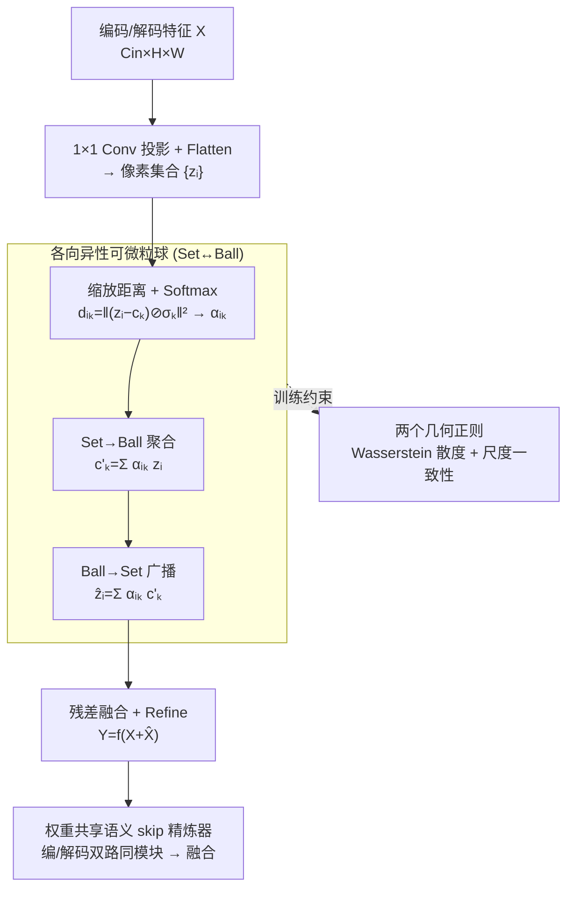

# AD-GBC: Anisotropic Granular-Ball Skip-Connection Refiner for UNet-Based Medical Image Segmentation

**会议**: CVPR 2026  
**论文**: [CVF OpenAccess](https://openaccess.thecvf.com/content/CVPR2026/html/Shen_AD-GBC_Anisotropic_Granular-Ball_Skip-Connection_Refiner_for_UNet-Based_Medical_Image_Segmentation_CVPR_2026_paper.html)  
**代码**: https://github.com/SiaShen-dot/AD-GBC （有）  
**领域**: 医学图像  
**关键词**: 医学图像分割、粒球计算、各向异性原型、可微聚类、UNet skip-connection

## 一句话总结
把 UNet 里"点原型 / 各向同性球"的语义锚点升级成**带各向异性向量尺度的可微粒球**，以「像素集合 ↔ 粒球」的双向聚合-广播机制充当 skip-connection 的语义精炼器，再加两个几何正则防止锚点塌缩，在四个医学分割基准上对 Rolling-UNet / U-KAN 两种骨干都带来稳定涨点（平均 IoU +1.3~1.7%）。

## 研究背景与动机

**领域现状**：UNet 凭借编码器-解码器加 skip-connection 早已是医学图像分割的事实标准。近年的改进集中在 skip 融合处——ProtoSeg、Slot Attention、Gaussian Attention 这类**原型/槽位精炼**方法，把"深层语义特征 + 浅层高分辨率特征"的拼接，重新解释为像素特征与一组可学习原型（slot）之间的交互，让原始特征被组织成更一致的语义模式，从而改善区域一致性和边界刻画。

**现有痛点**：这些方法虽然是强力的 skip 精炼器，却都把每个语义概念建模成特征空间里的**一个点**，且依赖**单向或迭代注意力**，对区域几何没有任何显式控制。作者用 Fig.1 指出三重失配：(1) **多模态分布**——同一个语义类（如"病灶"）往往不是单簇，而是由暗核、炎症边缘等多个视觉模式组成，点原型（尤其 K=M 时）根本建不出来；(2) **各向异性几何**——经典粒球计算（GBC）用 K≫M 个球解决了多模态，却假设每个模式是**各向同性**（一个标量半径=圆），而真实特征簇是"椭圆"；(3) **语义模糊 + 类别不平衡**——当各向同性球去拟合各向异性数据时陷入灾难性 trade-off：为覆盖长轴必须"撑大"，而稀疏病灶类被撑大的球会和周围稠密背景簇产生大面积**虚假重叠**，把边界处微妙的模糊性彻底建错。

**核心矛盾**：各向异性的真实数据 vs. 各向同性的模型几何，二者本质不匹配；同时经典 GBC 还有个致命工程问题——**非可微聚类 + 手工定义半径**，无法塞进端到端的梯度网络。

**本文目标**：(a) 让原型从"点"变成有界、可学习、能描述真实形状的区域；(b) 让这个区域表示完全可微、可端到端训练；(c) 防止可学习锚点退化塌缩。

**切入角度**：把原型从"点锚定"放宽为"软区域锚定"，每个概念由一个中心 $c_k$ 和一个**向量尺度** $\sigma_k\in\mathbb{R}^D$ 定义的超椭球来表示，并用可微的 Set→Ball→Set 路径让它和像素特征交互。

**核心 idea**：用"各向异性可微粒球"代替"点原型 / 各向同性球"，在 UNet 的 skip 通路上做几何感知的语义对齐与净化。

## 方法详解

### 整体框架
AD-GBC 的输入是 UNet 某条较深 skip 通路上的特征图 $X\in\mathbb{R}^{B\times C_{in}\times H\times W}$，输出是同尺寸但语义被"净化"过的 $Y$。它不是替换 bottleneck，而是作为 **Semantic Skip-Connection Refiner** 插在编码器和解码器的较深层级之间（如第 3 层）。整条流程是：把特征图投影展平成像素集合 → 用一组可学习粒球锚点对像素做"软隶属度"分配 → Set→Ball 聚合出区域级共识、Ball→Set 广播回每个像素 → 残差融合 + 轻量 Refine 出 $Y$；训练时两个几何正则约束锚点的分布和尺度。关键工程点是**权重共享**：同一个 AD-GBC 模块同时作用于编码器和解码器两条路径，强迫两侧特征在融合前被投影到**同一个语义流形**上，再做逐元素相加。

### 关键设计

**1. 各向异性可微粒球（AD-GBC 模块）：把点原型升级成可端到端学习的超椭球区域**

这是全文的核心，针对"点原型 / 各向同性球建不出真实特征簇形状"的痛点。每个粒球锚点由中心 $c_k\in\mathbb{R}^D$ 和**各向异性向量尺度** $\sigma_k\in\mathbb{R}^D$（经 Softplus 约束为正）共同定义——注意是逐维度的向量而非标量半径，于是锚点在特征空间里形成一个可学习的**超椭球**而非超球。像素 $z_i$ 对锚点的隶属度不基于普通相似度，而基于"缩放距离"——衡量像素离中心有多少个"半径"：

$$d_{i,k}=\left\|(\mathbf{z}_i-\mathbf{c}_k)\oslash\boldsymbol{\sigma}_k\right\|_2^2$$

其中 $\oslash$ 是逐元素除法。正是这个逐维度的 $\sigma_k$ 让长轴方向"更宽容、短轴方向更苛刻"，从几何上解决了各向同性球"撑大才能覆盖长轴、撑大又虚假重叠"的两难。距离经带温度 $\tau$ 的 Softmax 归一化得到模糊隶属权重：

$$\alpha_{i,k}=\frac{\exp(-d_{i,k}/\tau)}{\sum_{j=1}^{K}\exp(-d_{i,j}/\tau)}$$

随后是双向交互：**Set→Ball 聚合**把像素集合的信息汇成区域描述子 $c'_k=\sum_i \alpha_{i,k}\mathbf{z}_i$（每个粒球对应一个"共识"），这一步正是经典 GBC 缺失的、用区域级共识来去噪；**Ball→Set 广播**再用同一组权重把区域级语境送回每个像素 $\hat{\mathbf{z}}_i=\sum_k \alpha_{i,k}\mathbf{c}'_k$。展平回特征图 $\hat{X}$ 后走残差融合与轻量 Refine（3×3 Conv-BN-ReLU）：

$$\mathbf{Y}=f_{\text{refine}}(\mathbf{X}+\hat{\mathbf{X}})$$

残差既稳定训练又保住局部细节。一个值得注意的退化关系：当向量尺度 $\sigma_k$ 退化为标量、且去掉共识聚合步时，AD-GBC 就**退化成标准 Gaussian kernel 加权**——这说明它是 Gaussian Attention 的严格泛化，多出来的正是"各向异性 + 区域共识"两件事。整模块复杂度 $O(N\cdot(C_{in}D+KD+C_{in}^2))$ 随像素数 $N$ 线性，参数量与分辨率无关，因此高分辨率下也可扩展。

**2. 权重共享语义 skip-connection 精炼器：让编/解码特征在融合前对齐到同一语义流形**

标准 skip 把深层语义特征和浅层高分辨率特征做朴素拼接/相加，但深层特征虽语义强、却常夹带噪声和无关上下文，会污染解码端的高保真通路。作者的解法是**双路 + 共享权重**：编码器某层特征先过"Shared AD-GBC"被投影到 $K$ 个粒球上做净化；解码器对应层上采样特征**并行**地过**同一个**（权重完全相同的）AD-GBC 模块；两路净化后的特征再逐元素相加，作为下一解码块的 skip。共享权重的关键作用是**强迫两侧特征落到同一组学到的语义锚点上**，从而保证融合时的高度语义一致性——这比"各自精炼再融合"更能消除编/解码语义错位。这个设计也回答了"模块插在哪、怎么用"的问题：只放在较深、语义更强的 skip 层级。

**3. 两个几何正则：防止锚点塌缩、约束尺度自洽**

只用任务损失训练时，可学习的 $\{c_k\}$ 和 $\{\sigma_k\}$ 容易退化——中心塌缩到低维子空间、尺度估计不稳，作者用两个互补正则兜底。

*Wasserstein 散度损失 $\mathcal{L}_{\text{W-div}}$*：针对"语义塌缩"——多个中心挤进低维子空间会让 Broadcast 退化成平凡混合。一个常见启发式是惩罚两两余弦相似度的平方 $\mathcal{L}_{\text{cos-div}}$，但作者用 **Theorem 1** 证明它**测不出语义塌缩**：若归一化 Gram 矩阵 $G(\mathbf{C})$ 秩为 $r<K$，则存在低维嵌入 $\tilde{\mathbf{C}}\in\mathbb{R}^{K\times r}$ 使 $G(\tilde{\mathbf{C}})=G(\mathbf{C})$，从而余弦损失值完全相同——即它无法调控中心张成子空间的维数。于是改用受 Wasserstein 均匀性启发的损失，直接正则整个中心分布而非两两关系：

$$\mathcal{L}_{\text{W-div}}(\mathbf{C})=\underbrace{\|\hat{\mu}_C\|_2^2}_{\text{居中}}+\underbrace{\operatorname{tr}(\hat{\Sigma}_C)-\frac{2}{\sqrt{D}}\operatorname{tr}(\hat{\Sigma}_C^{1/2})}_{\text{谱均匀性}}$$

其中 $\hat{\mu}_C,\hat{\Sigma}_C$ 是中心集合的经验均值与协方差。它鼓励中心分布"高秩、铺得开"，从根上避免塌缩。

*尺度一致性损失 $\mathcal{L}_{\text{scale-con}}$*：各向异性尺度 $\sigma_k$ 在任务损失下监督信号很弱，易塌缩或几何不自洽。作者先按软隶属度算出"观测到的各向异性方差" $\mathbf{s}_k^2=\frac{\sum_i \alpha_{i,k}(\mathbf{z}_i-\mathbf{c}_k)^{\circ 2}}{\sum_i \alpha_{i,k}+\epsilon}$（逐维度，$(\cdot)^{\circ 2}$ 为逐元素平方），再让学到的 $\sigma_k^2$ 去逼近它：

$$\mathcal{L}_{\text{scale-con}}=\frac{1}{K}\sum_{k=1}^{K}\left\|\text{detach}(\mathbf{s}_k^2)-\boldsymbol{\sigma}_k^2\right\|_2^2$$

两个细节很关键：比较**方差**而非标准差，是为避开 $\sqrt{\cdot}$ 在方差趋零时梯度爆炸；对目标 $\mathbf{s}_k^2$ 加 `detach` 是为切断"$\sigma_k\to\alpha_{i,k}\to s_k^2$"的循环依赖，形成稳定的单向约束，把学到的尺度往观测尺度上拉。

### 损失函数 / 训练策略
端到端训练，复合目标为
$$\mathcal{L}_{\text{total}}=\mathcal{L}_{\text{task}}+\lambda\,\mathcal{L}_{\text{W-div}}+\beta\,\mathcal{L}_{\text{scale-con}}$$
$\mathcal{L}_{\text{task}}$ 取 BCE + Dice 组合；$\lambda\in\{0.01,0.1\}$、$\beta\in\{0.1,0.05\}$。粒球数 $K=32$，特征维 $D$ 与 $C_{in}$ 对齐（不额外投影）。Adam，主参数学习率 $1\times10^{-4}$、GBC 参数单独用 $1\times10^{-2}$，batch 8，固定 400 epoch 无 early stopping，按验证集最佳 IoU 选模型，单卡 A100。

## 实验关键数据

### 主实验
四个公开基准覆盖超声、组织病理、结肠镜、皮肤镜：BUSI（647 张乳腺超声）、GlaS（165 张组织病理）、CVC-ClinicDB（612 帧结肠镜）、ISIC17（2000 张皮肤镜）。指标用 Dice/F1、IoU 和边界敏感的 HD95，结果为 3 个随机种子平均。AD-GBC 作为即插即用模块分别接入 Rolling-UNet 和 U-KAN 两种骨干。

下表为各骨干接入 AD-GBC 后的逐数据集 IoU（节选，单位 %）：

| 骨干 + AD-GBC | BUSI IoU | GlaS IoU | CVC IoU | ISIC17 IoU |
|--------------|----------|----------|---------|------------|
| Rolling-UNet-M | 66.41 → 67.36 | 85.86 → 88.16 | 84.93 → 87.07 | 83.51 → 84.88 |
| Rolling-UNet-L | 67.85 → 69.30 | 87.99 → 89.37 | 85.77 → 87.45 | 84.10 → 84.95 |
| U-KAN | 65.76 → **69.86** | 87.65 → 88.64 | 84.94 → 85.03 | 84.52 → 84.59 |

最大单点提升是 U-KAN 在 BUSI 上 **+4.10% IoU**（65.76→69.86）。完整模型 Rolling-UNet-L + AD-GBC 在 GlaS / CVC / ISIC17 上取最优，U-KAN + AD-GBC 在 BUSI 上最优。

效率与四数据集平均性能（节选）：

| 方法 | Params(M)↓ | GFLOPs↓ | 平均 IoU↑ | ΔIoU |
|------|-----------|---------|-----------|------|
| Rolling-UNet-S | 1.78 | 16.82 | 79.11 | — |
| + AD-GBC | 1.82 | 19.91 | 80.49 | **+1.38** |
| Rolling-UNet-M | 7.10 | 66.25 | 80.18 | — |
| + AD-GBC | 7.25 | 77.27 | 81.87 | **+1.69** |
| Rolling-UNet-L | 28.32 | 262.96 | 81.43 | — |
| + AD-GBC | 28.92 | 304.32 | 82.77 | **+1.34** |
| U-KAN | 6.35 | 14.02 | 80.72 | — |
| + AD-GBC | 6.51 | 16.77 | 82.03 | **+1.31** |

涨点代价极小：仅 ≈2% 额外参数（≈0.15–0.6M）和 ≈15–20% 的 GFLOPs 增量，accuracy-to-cost 折中很划算。

### 消融实验
在 GlaS 上拆解三个核心组件（各向异性尺度 $\sigma_k$、$\mathcal{L}_{\text{W-div}}$、$\mathcal{L}_{\text{scale-con}}$）：

| 配置 | IoU↑ | F1↑ | HD95↓ | 说明 |
|------|------|-----|-------|------|
| Baseline (Rolling-UNet-L) | 87.99 | 93.47 | 0.65 | 无 GBC |
| + GBC（各向同性标量 σ） | 88.12 | 93.67 | 0.63 | 仅 +0.13%，边际 |
| + GBC（各向异性向量 σ） | 88.28 | 93.88 | 0.59 | 各向异性带来明显边界改善 |
| + $\mathcal{L}_{\text{W-div}}$ | 88.70 | 94.00 | 0.56 | 防中心塌缩 |
| + $\mathcal{L}_{\text{scale-con}}$ | 88.78 | 94.05 | 0.56 | 约束尺度自洽 |
| 两个正则全开（Full） | **89.63** | **94.51** | **0.51** | 协同效应 |

对 $K$、温度 $\tau$、稀疏性的敏感性（BUSI，IoU）：中等 $K=16/32$ 时 $\tau=1.0$ 最佳；$K=64$ 时更小的 $\tau=0.01$ 更好（锚点变密时低温能锐化分配）；稀疏化（限制到 top-k 锚点）在大 $K$ 下有益，如 $K=64$ 时 top-5 优于 top-10。综合 $K=32,\tau=1.0$ 是稳定配置（达 70.71 IoU）。

### 关键发现
- **各向异性是涨点主力，但需正则才稳**：各向同性 GBC 几乎无增益（+0.13%），换成各向异性向量尺度才把 HD95 从 0.63 降到 0.59；而 anisotropy 只有被两个正则"稳住"后才真正发力——两正则单独 88.70/88.78，合用直接跳到 89.63%，呈明显协同。
- **即插即用且通用**：对 S/M/L 三种规模的 Rolling-UNet 和结构迥异的 U-KAN 都稳定涨点，说明几何区域表示不绑定特定骨干。
- **可解释性**：Fig.6 显示不同锚点自发专精到不同语义区域（病灶核 vs. 健康皮肤、纹理/边界/背景抑制），印证 AD-GBC 把特征空间分解成了可解释的区域组件。

## 亮点与洞察
- **"点 → 各向同性球 → 各向异性球"的几何升级路线讲得很清晰**：用一张 motivation 图（Fig.1）就把"为什么圆不行、椭圆才行"说透——各向同性球为覆盖长轴必须撑大、撑大就和背景虚假重叠，这个 trade-off 是核心痛点，向量尺度从几何上一招解开。
- **Theorem 1 是点睛之笔**：用秩缺陷的反例证明"余弦多样性损失测不出语义塌缩"，从而 motivate 用 Wasserstein 谱均匀性正则整个分布而非两两关系——把"该用哪种多样性损失"这件常被拍脑袋的事做成了有理论依据的选择。
- **退化关系给出清晰定位**：σ 退化为标量 + 去掉共识 = 标准 Gaussian 加权，等于明说"我是 Gaussian Attention 的各向异性 + 区域共识泛化"，方法谱系一目了然。
- **可迁移 trick**：`detach(s_k²)` 切断循环依赖形成单向约束、比较方差而非标准差避免 √ 梯度爆炸——这两个稳定化细节对任何"让可学习参数逼近其自身诱导统计量"的自洽约束都适用。

## 局限与展望
- **仅验证 CNN 编解码骨干**：作者承认 AD-GBC 虽可微、原则上能塞进 TransUNet / Swin-UNet 等 Transformer 分割器，但尚未实验，留作未来工作。
- **数据集偏小、均为二类前景分割**：四个基准都是单目标病灶/腺体分割（BUSI 647 / GlaS 165 张），多类别、多器官的大规模场景下"多模态-各向异性"假设是否同样划算未知。
- **超参与温度敏感**：$\tau$ 和 $K$ 的最优值会随锚点密度变化（$K=64$ 要换低温 + 稀疏化），$\lambda,\beta$ 也给的是区间值，落到新数据集可能需要调参；且只在较深 skip 层级插入，"插哪层"本身是个未充分扫描的设计变量。
- **改进思路**：可探索让 $K$ 或层级自适应、把各向异性球扩展到带旋转的全协方差（当前 $\sigma_k$ 是轴对齐椭球，无法刻画斜向相关）。

## 相关工作与启发
- **vs Gaussian Attention**：它用协方差加权核建模锚点周围的空间影响，但仍是隐式、无界的核；AD-GBC 显式建模**有界各向异性区域**并做像素-区域的共识更新，且在退化情形可还原成 Gaussian 加权——是其严格泛化。
- **vs Slot Attention / ProtoSeg**：槽位/原型方法用点锚 + 隐式空间支撑、靠迭代单向注意力；AD-GBC 用"中心 + 显式区域 + 各向异性几何"，且是单步可微的 Set↔Ball 双向交互，对区域几何有显式控制。
- **vs 经典 GBC**：经典粒球计算用"中心 + 标量半径"做多粒度建模，但**非可微 + 手工半径 + 各向同性**，进不了端到端网络；AD-GBC 把它改造成可微、向量尺度、可端到端训练的深度模块。
- **启发**：当一个表示瓶颈被归因为"几何形状不匹配"时，与其堆注意力，不如直接给锚点更富表达的几何参数化（标量→向量→未来全协方差），并配上"防塌缩 + 自洽"的正则——这套"几何升级 + 理论驱动正则"的范式可迁移到聚类、检索、点云等任意基于原型的任务。

## 评分
- 新颖性: ⭐⭐⭐⭐ 把粒球计算做成各向异性、可微、可端到端的 skip 精炼器，几何动机清晰且 Theorem 1 有理论支撑，但单看是原型/GBC 思路的几何延伸。
- 实验充分度: ⭐⭐⭐⭐ 四基准 × 两骨干 × 三种子，消融把三组件逐一拆开且含 HD95，较扎实；但数据集偏小、未验证 Transformer 骨干、缺与最新 SOTA 精炼器的直接对比。
- 写作质量: ⭐⭐⭐⭐⭐ motivation 图、退化关系、定理与正则的因果链都讲得很顺，自洽且好读。
- 价值: ⭐⭐⭐⭐ 即插即用、参数/FLOPs 代价小、对多骨干稳定涨点，对医学分割实践友好。

<!-- RELATED:START -->

## 相关论文

- [\[CVPR 2026\] From Infusion to Assimilation Distillation for Medical Image Segmentation](from_infusion_to_assimilation_distillation_for_medical_image_segmentation.md)
- [\[CVPR 2026\] SegMoTE: Token-Level Mixture of Experts for Medical Image Segmentation](segmote_token-level_mixture_of_experts_for_medical_image_segmentation.md)
- [\[CVPR 2026\] PMRNet: Physics-informed Multi-scale Refinement Network for Medical Image Segmentation](pmrnet_physics-informed_multi-scale_refinement_network_for_medical_image_segment.md)
- [\[CVPR 2026\] GeoSemba: Reconstructing State Space Model for Cross Paradigm Representation in Medical Image Segmentation](geosemba_reconstructing_state_space_model_for_cross_paradigm_representation_in_m.md)
- [\[CVPR 2026\] SHAPE: Structure-aware Hierarchical Unsupervised Domain Adaptation with Plausibility Evaluation for Medical Image Segmentation](shape_structure-aware_hierarchical_unsupervised_domain_adaptation_with_plausibil.md)

<!-- RELATED:END -->
