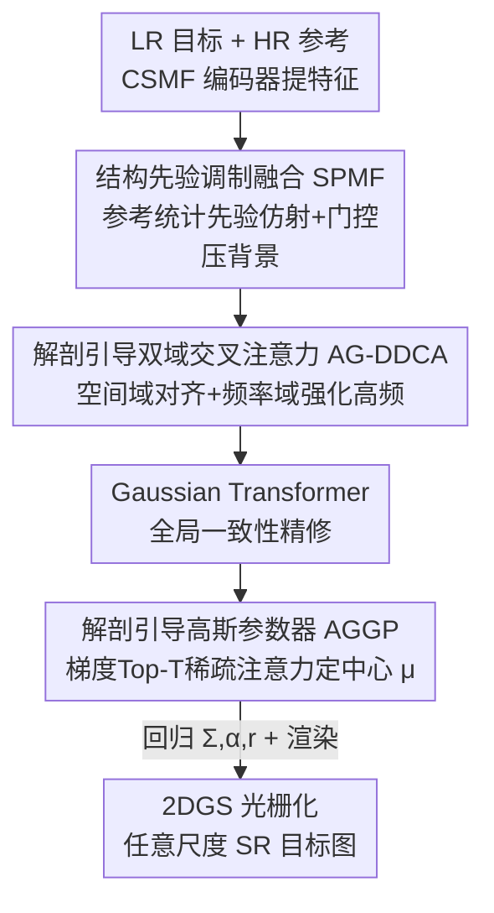

# Adaptive Anisotropic Gaussian Splatting for Multi-contrast MRI Arbitrary-Scale Super-Resolution with Anatomy Guidance

**会议**: CVPR 2026  
**论文**: [CVF Open Access](https://openaccess.thecvf.com/content/CVPR2026/html/Yan_Adaptive_Anisotropic_Gaussian_Splatting_for_Multi-contrast_MRI_Arbitrary-Scale_Super-Resolution_with_CVPR_2026_paper.html)  
**代码**: https://github.com/Qiuhai-CV/GaussM2ASR  
**领域**: 医学图像  
**关键词**: 多对比度MRI、任意尺度超分、2D高斯泼溅、谱偏差、解剖先验

## 一句话总结
GaussM2ASR 把多对比度 MRI 的任意尺度超分从"INR 直接回归像素强度"换成"学一组各向异性 2D 高斯核的参数"，用窄核拟合解剖边界的高频、宽核覆盖平滑低频区，再用三个解剖先验驱动的模块把高频信息和高分辨参考图的结构对齐，在 IXI/BraTS/fastMRI 上 PSNR/SSIM 全面超过现有 SOTA。

## 研究背景与动机

**领域现状**：临床上常用一张快速采集的高分辨率（HR）对比度（如 T1）作为参考，去给采集慢的低分辨率（LR）目标对比度（如 T2）做超分。为了适配临床里各种非整数缩放需求，主流做法是基于隐式神经表示（INR）——把图像建模成一个连续函数 $f:\mathbb{R}^2\to\mathbb{R}$，用 MLP 把坐标 $(x,y)$ 映射到像素强度，从而支持任意尺度重建（McASSR、Dual-ArbNet、DINet 等）。

**现有痛点**：INR 这类方法存在固有的**谱偏差（spectral bias）**——过参数化网络在梯度优化下会优先收敛到低频解空间，导致它能把平滑区域拟合得不错，但对组织边界这种"尖锐的高频跃变"无能为力，重建结果普遍过度平滑、解剖边界糊掉。更糟的是，INR 通常依赖对离散特征网格做插值，而插值本身相当于一个低通滤波器，会进一步衰减高频、加剧谱偏差。

**核心矛盾**：高频解剖细节恰恰是临床诊断最关心的（病灶边界、组织交界），但它正好落在 INR 最难学的频段。问题的根本在于**直接回归像素强度**这一建模范式天然偏好低频。

**切入角度**：作者从 3D 场景重建里 3DGS（3D Gaussian Splatting）相对 NeRF 的优势得到启发——3DGS 用一堆显式、可优化的高斯基函数表示场景，收敛更快、对细几何和高频细节保留更好。如果把这个范式搬到 2D 医学影像，让模型不再回归像素而是去学一组各向异性高斯核的参数，那么高频重建这个"难收敛的回归问题"就被转化成"在更平滑的参数空间上做优化"，而各向异性高斯核可以**动态调节方差**：窄核抓边界高频、宽核覆盖均匀低频。论文里 Fig.2(c) 的收敛对比显示，2DGS 在高频结构上的收敛速度和质量都明显优于 INR。

**核心 idea**：用"学各向异性 2D 高斯参数 + 解剖先验引导高斯中心"代替"INR 直接回归像素"，把多对比度 MRI 任意尺度超分里最难的高频解剖重建变成一个更可优化的问题。

## 方法详解

### 整体框架

GaussM2ASR 输入一张 LR 目标图 $I_{tar}\in\mathbb{R}^{h\times w\times 1}$ 和一张 HR 参考图 $I_{ref}\in\mathbb{R}^{H\times W\times 1}$，输出任意尺度的 HR 目标图。整条 pipeline 的核心思路是：**先把两张图编码成特征并注入解剖先验，再在空间+频率双域里强化高频和对齐结构，最后预测每个高斯核的参数（中心、协方差、不透明度、灰度），通过 2DGS 光栅化渲染出超分图。**

具体分四步走：(1) **CSMF 编码器**（Cross-Scale Multi-contrast Fusion）从目标图和参考图提多尺度深度特征；(2) **SPMF 模块**用参考图的统计解剖先验对目标特征做仿射调制 + 门控融合，压制背景干扰；(3) **AG-DDCA 模块**引入可学习高斯 prompt 和尺度嵌入，在空间域和频率域分别做交叉注意力，让 prompt 适配不同缩放因子并强化高频；中间还插一个 Gaussian Transformer 做全局一致性精修；(4) **AGGP 模块**用参考图的解剖梯度 + Top-T 稀疏注意力，把高斯中心吸附到解剖边界上，其余参数（$\Sigma,\alpha,r$）用轻量 MLP 头回归。

2DGS 的渲染本身遵循高斯泼溅的标准定义：每个高斯由均值 $\mu\in\mathbb{R}^2$ 和协方差 $\Sigma\in\mathbb{R}^{2\times2}$ 描述，

$$G(x)=\frac{1}{2\pi|\Sigma|^{1/2}}\exp\!\left(-\tfrac{1}{2}(x-\mu)^\top\Sigma^{-1}(x-\mu)\right),$$

各向异性通过两个标准差 $\sigma_x,\sigma_y$ 和相关系数 $\rho$ 参数化协方差（$\Sigma=\begin{bmatrix}\sigma_x^2&\rho\sigma_x\sigma_y\\\rho\sigma_x\sigma_y&\sigma_y^2\end{bmatrix}$）。光栅化时某像素强度是 $N$ 个重叠高斯的 alpha 混合：$f(x)=\sum_{i=1}^{N}\alpha_i r_i G_i(x)$，其中 $r_i$ 是灰度、$\alpha_i$ 是不透明度。

### 关键设计

**1. 各向异性 2D 高斯泼溅：把高频回归换成平滑参数优化**

针对的是 INR 谱偏差导致边界糊掉这个根本痛点。作者不再让网络直接输出每个坐标的像素强度，而是让它去学一组各向异性高斯核的参数 $(\mu,\Sigma,\alpha,r)$，再通过上面 $f(x)=\sum_i\alpha_i r_i G_i(x)$ 把图像渲染成"可调基函数的叠加"。关键在于协方差 $\Sigma$ 由 $\sigma_x,\sigma_y,\rho$ 参数化、可以各向异性地拉伸旋转：模型在解剖边界这种高频区自动学出**窄而尖**的高斯去贴合锐利跃变，在均匀组织这种低频区学出**宽而扁**的高斯去覆盖大片平滑区域。这样做有效的原因是——高频细节的拟合从"在低频偏好的网络里硬回归像素"被转化成"在一个更平滑的参数空间上优化高斯形状"，后者梯度优化友好得多，论文 Fig.2(c) 显示其高频分量的收敛速度与终值都显著优于 INR（DINet）。同时高斯密度按参考图分辨率分配（每个参考像素一个高斯），天然支持任意（含非整数）缩放因子。

**2. 结构先验调制融合 SPMF：用参考图统计先验压住背景、抬高解剖通道**

MR 图像有个特点——解剖结构集中在中间，四周是大片几乎无纹理的背景，而且不同对比度之间存在显著的统计分布偏移。直接把目标和参考特征融合会出两个问题：背景区域的无效激活干扰融合；跨对比度统计差异导致高频分量被错误加权。SPMF 分两步解决。先从参考特征的全局统计里算出逐通道的缩放和偏置 $(\gamma,\beta)=\Phi(\mathrm{GAP}(F_{ref}))$（$\Phi$ 是 $1\times1$ 卷积接 ReLU），对目标特征做仿射变换 $\hat F_{tar}=(1+\gamma)\odot F_{tar}+\beta$，从而**通道层面**放大那些编码高频结构的通道。再用一个逐像素门控做空间精修：$g=\mathrm{Sigmoid}(\Phi(\mathrm{Concat}[\hat F_{tar},F_{ref}]))$，融合为 $\tilde F_{tar}=g\odot\hat F_{tar}+(1-g)\odot F_{ref}$。门 $g$ 在边界/纹理这种结构显著区保留目标特征，在信息贫乏区交给参考特征，**空间层面**压制背景干扰。一通道一空间两个维度配合，正好对应 MR 图"背景大 + 跨对比度偏移"这两个具体麻烦。

**3. 解剖引导双域交叉注意力 AG-DDCA：在频率域补回空间域抓不到的高频**

只在空间域融合目标和参考特征，很难有效抓到对诊断至关重要的高频（组织边界、细微结构），结果还是过度平滑。AG-DDCA 引入一个可学习的高斯 prompt $P$，并通过尺度嵌入 $S$ 做尺度感知的交叉注意力，让 prompt 适配不同缩放因子；精修后的 prompt 作为 query $Q$，在两个域并行做交叉注意力：空间分支 $\mathrm{Att}_{spat}=\mathrm{Softmax}(QK_s^\top+B)V_s$ 从目标和参考特征里捞全局上下文；频率分支 $\mathrm{Att}_{freq}=\mathrm{Softmax}(QK_f^\top+B)V_f$ 直接在**傅里叶幅度谱**上操作、专门强化高频以增强边缘细节（$B$ 是相对位置偏置）。两域输出再用一个由高斯 prompt 条件化的动态门控自适应整合：$F=\epsilon_s\odot\mathrm{Att}_{spat}+\epsilon_f\odot\mathrm{Att}_{freq}$，其中权重 $\epsilon_s,\epsilon_f$ 是把 $P$ 过两层 MLP + Softmax 得到。把"高频提取"显式放到频率域去做，正好补上空间域注意力天然偏低频的短板，这也直接服务于设计 1 里"窄核要去贴高频"的需求。

**4. 解剖引导高斯参数器 AGGP：用解剖梯度把高斯中心钉到边界上**

连续高斯表示里，每个高斯的影响范围由它的中心 $\mu$ 决定。一旦中心和真实解剖结构（尤其是组织边界、细节）错位，模型只能被迫用更宽的高斯去补，结果又把边缘抹平、丢掉高频——和设计 1 想要的窄核背道而驰。AGGP 先用 Sobel 算子从参考图算梯度图 $G=\nabla I_{ref}$（高梯度=解剖边界），再把它和 Gaussian Transformer 出来的特征 $\tilde F$ 做一个 **Top-T 稀疏交叉注意力**：以 $Q=G$、$K,V$ 是 $\tilde F$ 的投影，算注意力分数 $W=\frac{QK^\top}{\tau}$，对每一行只保留 Top-T 个最大值构造二值 mask $M$（$M_{ij}=1$ 当 $j\in\mathrm{Top}_T(W_{i,:})$ 否则 0），输出 $\mathrm{Att}_{\text{top-}T}=\mathrm{Softmax}(M\odot W)V$。稀疏化的意义在于——压制均匀区域的响应、只保留和解剖边缘相关的通道，让中心预测聚焦在该聚焦的地方。最后用三层 MLP 从注意力特征预测一个**中心偏移** $\mu_o$，最终中心 $\mu=\mu_i+\mu_o$ 是在均匀初始化位置 $\mu_i$ 上加偏移得到——既保证全图均匀覆盖，又能向解剖显著区自适应偏移。直接预测绝对坐标（$\mu=\mu_o$）会把优化空间放得太大、中心难收敛，所以"均匀初始化 + 学偏移"这个细节很关键（消融里去掉 $\mu_i$ 会明显掉点）。

### 损失函数 / 训练策略

总损失为 $\mathcal{L}_{total}=\mathcal{L}_{spa}+\lambda_{freq}\mathcal{L}_{freq}+\lambda_{ref}\mathcal{L}_{ref}$，其中 $\lambda_{freq}=0.01$、$\lambda_{ref}=0.3$。空间损失 $\mathcal{L}_{spa}$ 是 GT 与 SR 目标图之间的 MAE，保证像素级保真；频率损失 $\mathcal{L}_{freq}$ 在傅里叶域最小化两者幅度谱的 MAE，专门保高频；参考损失 $\mathcal{L}_{ref}$ 约束参考特征嵌入重建出的图与输入 HR 参考一致，稳定跨对比度先验迁移。

训练采用**两阶段策略**：先用 HR 目标图预训练（让 AGGP 学出解剖感知的高斯初始化），再**冻结 AGGP**、用 LR 输入微调整个网络。单阶段直接在 LR 上训会明显掉点。优化器 Adam（$\beta_1{=}0.9,\beta_2{=}0.99$），初始学习率 $2\times10^{-4}$，500k 迭代，batch size 1，EMA 衰减 0.999；AGGP 用四个稀疏注意力分支、稀疏率 $\{1/2,2/3,3/4,4/5\}$。

## 实验关键数据

数据集：IXI（T1→T2，500/77）、BraTS（T1→T2，600/200）、fastMRI（FD→FSPD，500/53）。GT 为 $256\times256$，通过 k-space 裁剪在尺度 $S\in(1,4]$ 下采样得到 LR。评测含分布内尺度（1.5/2/3/4×）和分布外尺度（5/6×），指标 PSNR/SSIM。

### 主实验

下表节选 4×（分布内）和 6×（分布外）的对比，本文与第二名（多为 DINet）对照：

| 数据集 | 尺度 | 指标 | 本文 | 之前SOTA(DINet) | 提升 |
|--------|------|------|------|------|------|
| IXI | 4× | PSNR / SSIM | 32.03 / 0.9350 | 30.98 / 0.9084 | +1.05 / +0.027 |
| IXI | 6×(外) | PSNR / SSIM | 26.89 / 0.8295 | 26.58 / 0.8261 | +0.31 / +0.003 |
| BraTS | 4× | PSNR / SSIM | 34.65 / 0.9621 | 33.32 / 0.9543 | +1.33 / +0.008 |
| BraTS | 6×(外) | PSNR / SSIM | 29.85 / 0.9225 | 29.54 / 0.9143 | +0.31 / +0.008 |
| fastMRI | 4× | PSNR / SSIM | 30.53 / 0.7410 | 28.76 / 0.7164 | +1.77 / +0.025 |
| fastMRI | 6×(外) | PSNR / SSIM | 26.69 / 0.6728 | 25.93 / 0.6672 | +0.76 / +0.006 |

在 IXI 的极端低倍 1.5× 上，本文 PSNR 达 46.62（次优 DINet 42.81），优势尤为夸张。整体上 GaussM2ASR 在三个数据集、所有分布内与分布外尺度上都排第一，且 SSIM 领先尤其明显——印证了它在"忠实重建解剖结构、保高频"上的优势。

### 消融实验

消融在 IXI、4× 上做（论文以柱状图 Fig.7 报告 PSNR/SSIM，正文给出方向性结论；⚠️ 具体数值未在正文以表格列出，以下为定性结论）：

| 配置 | 关键指标 | 说明 |
|------|---------|------|
| Full model | 最优 PSNR/SSIM | 完整模型 |
| w/o SPMF | 明显下降 | 背景无效激活干扰特征融合，去掉后无法抑制背景 |
| w/o freq（AG-DDCA 只留空间分支）| PSNR、SSIM 双降 | 频率分支提供互补高频信息，缺它细节恢复变差 |
| w/o Top-T（AGGP）| 下降，边缘变糊 | 高斯中心无法被引导到解剖边界，锐度/连贯性下降 |
| w/o $\mu_i$（直接预测绝对坐标 $\mu=\mu_o$）| 收敛变差 | 优化空间过大，高斯中心难有效收敛 |
| 单阶段训练（不冻 AGGP 直接 LR 训）| 显著下降 | 缺少 HR 预训练初始化，拟合 MR 能力变弱 |

### 关键发现
- **频率域分支与 Top-T 稀疏注意力是高频保真的两大支柱**：前者在傅里叶幅度谱上补回空间注意力抓不到的高频，后者把高斯中心钉在解剖边界；两者都直接服务于"窄核贴边界"的核心目标。
- **"均匀初始化 + 学偏移"对高斯中心收敛至关重要**：直接回归绝对坐标会把优化空间放大到难以收敛，这是一个易被忽视但影响很大的实现细节。
- **两阶段训练（HR 预训练→冻 AGGP 微调 LR）显著优于单阶段**：基于高斯的表示更吃一个好的解剖感知初始化。
- 可视化（Fig.5）显示模型确实在高频区分配窄核、平滑区分配宽核，且高斯中心密集分布在解剖结构上、背景稀疏——和设计动机完全吻合。

## 亮点与洞察
- **范式迁移很干净**：把 3DGS 在 3D 重建里"显式基函数对抗谱偏差"的思路平移到 2D 医学超分，核心只有一句——别回归像素，去学高斯参数。这个 framing 让"难学的高频回归"变成"好优化的参数空间"，思路可复用到其他对高频敏感的低层视觉任务。
- **各向异性是关键而非普通高斯**：靠 $\sigma_x,\sigma_y,\rho$ 让核能拉伸旋转，才能用窄核贴合任意朝向的组织边界；如果只是各向同性高斯，边界拟合会大打折扣。
- **解剖梯度做注意力 query 的小技巧很巧**：用 Sobel 梯度图当 query、特征当 key/value 做 Top-T 稀疏注意力，等于用"哪里是边界"这个显式先验去筛选"中心该往哪偏"，可迁移到任何需要把表示集中到边缘/显著区的任务。
- 高斯密度跟参考图分辨率绑定，天然支持非整数任意尺度，省掉了 INR 那套逐像素 MLP 插值的开销。

## 局限与展望
- **强依赖配准**：训练和推理都要求目标图与参考图空间对齐，临床上患者运动会引入错位和运动伪影，因此多对比度配准成了必需的预处理步骤——一旦配准失败，解剖先验引导可能反而误导。
- **高斯数量固定**：高斯核数由参考图分辨率决定，对纹理简单的图像会造成冗余计算。作者展望用自适应高斯分配策略来提升效率。
- 自己补充：消融只在 IXI/4× 上以柱状图报告，缺逐数据集、跨尺度的细粒度消融数值；频率分支、Top-T 等模块各自的增益幅度难以从正文量化对比。此外没有报告推理速度/显存与 INR 基线的直接对比（仅称在补充材料），对"任意尺度 + 高斯渲染"的实际计算代价交代不足。

## 相关工作与启发
- **vs INR 类多对比度 SR（McASSR / Dual-ArbNet / DINet）**：它们用 MLP 把坐标回归到像素强度，受谱偏差所限边界过平滑；本文改成学高斯参数 + 解剖先验引导，把高频回归变成参数优化，边界更锐。代价是引入配准依赖和高斯数量固定的问题。
- **vs 自然图像 2DGS（GaussianSR / GSASR / GaussianImage）**：同样用 2D 高斯建模、缓解 INR 过平滑，但它们没有专门利用跨对比度参考图的解剖先验；本文的三个解剖驱动模块（SPMF/AG-DDCA/AGGP）正是为多对比度 MRI 场景定制，在质化对比中保留了更丰富的高频纹理。
- **vs 3DGS（Kerbl et al.）**：思想同源——显式可优化高斯对抗 NeRF/INR 的隐式低频偏好；本文是把它降维到 2D 医学影像并加入解剖先验引导，是一次有针对性的领域适配。

## 评分
- 新颖性: ⭐⭐⭐⭐ 把 2DGS 范式系统迁移到多对比度 MRI 任意尺度超分，并配套三个解剖先验模块，思路清晰且贴合场景
- 实验充分度: ⭐⭐⭐⭐ 三数据集、分布内外尺度全覆盖且全面 SOTA，但消融只给柱状图、缺速度/显存量化对比
- 写作质量: ⭐⭐⭐⭐ 动机（谱偏差→高斯）推导顺畅，模块职责分明；部分关键数值需查补充材料
- 价值: ⭐⭐⭐⭐ 对临床关心的解剖边界保真有实打实提升，且高斯建模思路对低层视觉任务有迁移价值

<!-- RELATED:START -->

## 相关论文

- [\[AAAI 2026\] PINGS-X: Physics-Informed Normalized Gaussian Splatting with Axes Alignment for Efficient Super-Resolution of 4D Flow MRI](../../AAAI2026/medical_imaging/pings-x_physics-informed_normalized_gaussian_splatting_with_axes_alignment_for_e.md)
- [\[AAAI 2026\] CD-DPE: Dual-Prompt Expert Network Based on Convolutional Dictionary Feature Decoupling for Multi-Contrast MRI Super-Resolution](../../AAAI2026/medical_imaging/cd-dpe_dual-prompt_expert_network_based_on_convolutional_dictionary_feature_deco.md)
- [\[CVPR 2026\] GaussianPile: A Unified Sparse Gaussian Splatting Framework for Slice-based Volumetric Reconstruction](gaussianpile_a_unified_sparse_gaussian_splatting_framework_for_slice-based_volum.md)
- [\[CVPR 2026\] MuViT: Multi-Resolution Vision Transformers for Learning Across Scales in Microscopy](muvit_multi-resolution_vision_transformers_for_learning_across_scales_in_microsc.md)
- [\[CVPR 2026\] Virtual Immunohistochemistry Staining with Dual-Aligned Multi-Task Feature Guidance](virtual_immunohistochemistry_staining_with_dual-aligned_multi-task_feature_guida.md)

<!-- RELATED:END -->
