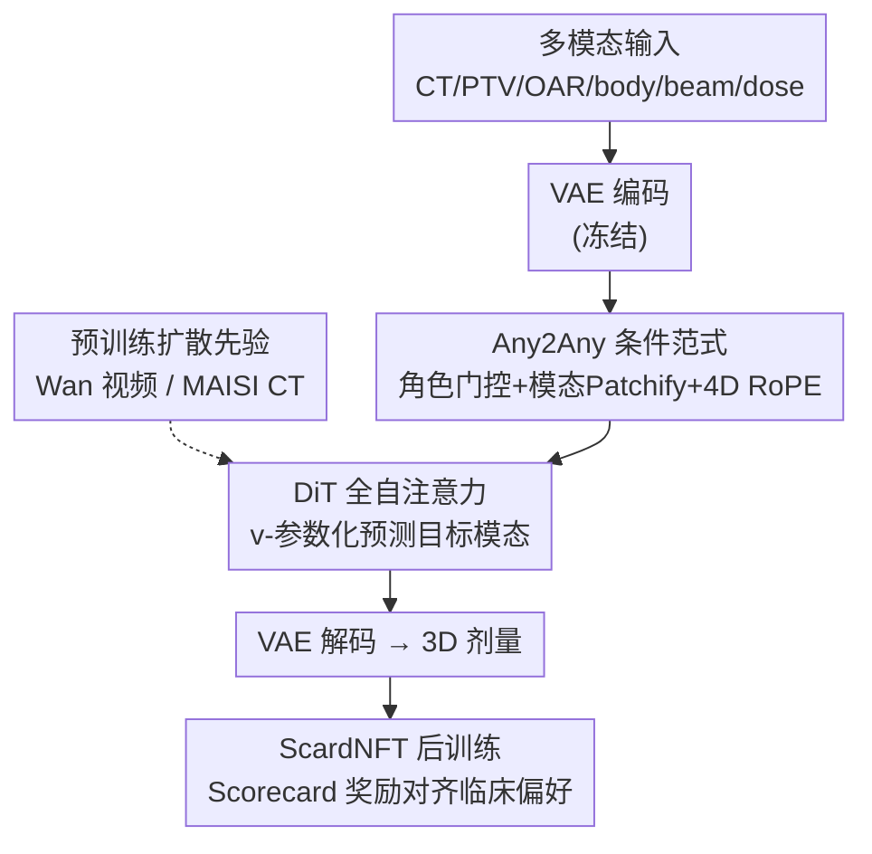

# Any2Any 3D Diffusion Models with Knowledge Transfer: A Radiotherapy Planning Study

**会议**: CVPR 2026  
**arXiv**: [2605.09622](https://arxiv.org/abs/2605.09622)  
**代码**: 无（论文未公开）  
**领域**: 医学图像 / 扩散模型  
**关键词**: 放疗剂量预测, 3D 扩散先验迁移, Any2Any 条件生成, 强化学习后训练, 临床 Scorecard

## 一句话总结
把在自然视频（Wan 2.1）或公开 CT（MAISI）上预训练好的 3D 扩散模型迁移到放疗剂量预测，用一套「Any2Any」模态条件范式让任意模态都能当生成目标，再用临床 Scorecard 设计的强化学习后训练对齐机构偏好，在 GDP-HMM 挑战赛上把体素级 MAE 从 2.07 降到 1.93、刷新 SOTA。

## 研究背景与动机
**领域现状**：放疗（RT）计划里的剂量预测（dose prediction, DP）是给定 CT、靶区（PTV）、危及器官（OAR）、射束几何等多模态输入，生成一份 3D 剂量分布。历史上这被当成体素级回归问题，用 U-Net 系（MedNeXt、nnUNet）最小化预测剂量与参考剂量之间的 MAE/MSE；近年也有人用 GAN、扩散模型提升画质。

**现有痛点**：① RT 数据稀缺，每个机构往往只有几百到几千例，从头训练的「定制模型」很难跨临床场景泛化；② 已有的扩散方案多是**逐切片 2D** 训练，切片之间空间一致性差；③ 几乎所有方法都只优化体素误差，**没有针对临床偏好做后训练**——而剂量计划的好坏（PTV 覆盖 vs OAR 保护的权衡）是写在各机构协议里的，体素 MAE 低不等于临床能接受。

**核心矛盾**：视觉领域的扩散大模型是在十亿级数据上训出来的，泛化极强；而 RT 这边数据极少、又要满足复杂的临床约束。如何把「海量通用先验」搬到「小样本、强约束」的放疗任务上，是两个绕不开的知识迁移问题。

**本文目标**：作者把它拆成两问——(Q1) 在**遥远源域**（自然视频/通用 CT）上训练的 **3D 扩散生成先验**，能不能帮到放疗剂量生成？(Q2) 能不能用**强化学习后训练**把扩散生成对齐到临床偏好？

**切入角度**：以往「自然图像迁医学」的工作（如 DINO 系）几乎都停在**特征提取骨干**上，而本文盯的是**生成**。同时注意到 RT 数据天然有 7 种模态 {CT, PTV, OAR, body, beam plate, angle plate, dose}，与其为每种输入组合定制模型，不如让任意模态都能互为条件/目标。

**核心 idea**：用「预训练 3D 扩散先验 + Any2Any 模态条件范式 + Scorecard 引导的 RL 后训练」三件套，把通用生成先验稳健迁移到放疗剂量预测——这就是 **DiffKT3D**。

## 方法详解

### 整体框架
DiffKT3D 是一个统一的 Any2Any 3D 扩散框架，整条管线是：多模态体数据先经**冻结的 VAE 编码器**压到共享隐空间；进入 DiT 前，由 **Any2Any 角色门控**随机把每个模态指派为「目标」或「条件」，并用模态专属 patchify 把隐网格切成 token、打上域嵌入（指明是哪种模态）与角色嵌入（区分目标/条件）、叠加 4D RoPE 位置编码；**单个 DiT 主干用全自注意力**同时处理「干净的条件 token」和「加噪的目标 token」，以 v-参数化预测目标模态的噪声；预测再经 VAE 解码器回到体素空间得到 3D 剂量。训练完成后，再用 **ScardNFT** 强化学习后训练把生成对齐到临床 Scorecard 偏好。整个设计的妙处在于：DiT 主干架构原封不动（直接复用 Wan 预训练权重），所有「模态差异」都交给 patch-embedding 和嵌入去处理。

### 关键设计

**1. 扩散先验跨域迁移：把视频/CT 大模型当放疗剂量生成的初始化**

痛点是 RT 数据太少、从头训的 3D 扩散又「数据饥渴」。作者直接拿在自然视频上预训练的 **Wan 2.1（1.3B 参数）+ VAE 2.1**，或在公开 CT 上预训练的 **MAISI**，只微调 DiT block 就用于剂量预测。尽管源域（自然视频）与目标域（放疗剂量）存在巨大鸿沟，迁移依然同时带来精度和效率的明显提升——消融里「从头训」MAE 2.58、加上预训练直接降到 2.07（Score 119.82→135.41）。更关键的发现是：**域间隙越小、迁移收益越大**（MAISI CT 先验比 Wan 视频先验更强），而且相比回归模型展现出显著更强的泛化与收敛速度。这把「自然图像迁医学」从特征提取骨干推进到了**生成先验**这一层。

**2. Any2Any 角色感知条件范式：任意模态互为条件/目标，且不引入 cross-attention**

RT 有 7 种模态，逐组合定制不现实。本文把剂量预测形式化为 Any2Any 条件生成：从模态集合 $\mathcal{M}=\{\texttt{ct},\texttt{ptv},\texttt{oar},\texttt{body},\texttt{beam},\texttt{angle},\texttt{dose}\}$ 里均匀采一个目标 $\tau$，其余可见模态构成条件集 $C$，目标在第 $t$ 步前向加噪为 $x_t^{(\tau)}=\alpha_t x_0^{(\tau)}+\sigma_t\varepsilon$（方差保持调度，$\alpha_t^2+\sigma_t^2=1$）。落到结构上有四个零成本的巧思：① **模态专属 Patchify**——共享 VAE 隐空间下，每个模态用一套轻量 3D 卷积 patch embed $\mathrm{PE}_m$ 投成 token，主干不变；② **角色嵌入**——单个二元嵌入 $e^{\text{role}}\in\{e^{\text{tar}},e^{\text{cond}}\}$ 标记每个 token 是「加噪目标」还是「干净条件」，并把条件码 $e_C$ 直接加到时间步嵌入 $\tilde{e}_t=e_t+e_C$，复用 Wan 的共享 AdaLayerNorm 注入，**不加任何 pooling 或 cross-attention**；③ **全自注意力**——目标与条件 token 拼在一起做标准 self-attention，让模型联合建模跨模态依赖；④ **4D RoPE**——在标准 3D 空间 RoPE 上加一条 slot 轴，通道维拆成 $d=d_S+d_H+d_W+d_D$，给每个模态分配独立的旋转相位（dose 记 $S{=}0$、各条件 $S{\geq}1$），空间相位跨 slot 共享，从而在不加参数的前提下显式区分「token 来自哪个模态」。这套设计的核心收益是：把「联合建模所有模态 + 用嵌入显式分离角色」做进同一次全注意力，消融显示去掉角色嵌入 MAE 2.01、用因果注意力替换全注意力 MAE 2.15，证明两者都不可或缺。

**3. ScardNFT：把临床 Scorecard 变成 RL 奖励做偏好对齐**

纯扩散训练只对齐历史计划的体素值，不显式优化「PTV 覆盖足够、OAR 受量够低」这类临床目标。ScardNFT 借鉴文生图对齐的 DiffusionNFT，把临床 Scorecard 改写成可微奖励。原始奖励对每个解剖结构 $s$ 取一种指标（DoseAtVolume / VolumeAtDose / MeanDose），经分段线性函数映射为结构得分再加权求和 $r^{\text{raw}}(y,C)=\sum_{s}w_s\,\mathrm{score}_s(\phi_s(y;C))$。为稳定学习与防止 reward hacking，对原始奖励做按例/按部位归一化，并加两个锚：硬约束的 hinge 惩罚（如最小 PTV D95、OAR 上限）和相对参考剂量的 MAE 锚（防止模型靠「整体压低剂量」骗分），再裁剪成伯努利式最优概率 $r\in[0,1]$。策略更新沿用 DiffusionNFT 的隐式双目标 $\tilde{v}_\theta^{+}=(1{-}\beta)v_{\text{old}}+\beta v_\theta$、$\tilde{v}_\theta^{-}=(1{+}\beta)v_{\text{old}}-\beta v_\theta$，对每个病例采 $K$ 个候选剂量，损失为 $\mathcal{L}_{\text{NFT}}=\mathbb{E}[r\|\tilde{v}_\theta^{+}-v\|_2^2+(1{-}r)\|\tilde{v}_\theta^{-}-v\|_2^2]$，把高奖励样本的似然抬高、低奖励的压低。它有效是因为：$\mathcal{L}_{\text{diff}}$ 守住对历史计划的体素保真，$\mathcal{L}_{\text{NFT}}$ 在相同条件 $C$ 下重塑扩散分数场、把概率质量挪向满足 Scorecard 的剂量分布——实验里 NFT 让临床 Score 从 136.22 升到 138.17，而 MAE 几乎不动（1.93→1.93），说明它改的是「偏好」而非「重建质量」

### 损失函数 / 训练策略
扩散目标采用 **v-参数化**而非预测噪声 $\varepsilon$：$v(x_0,\varepsilon,t)=\alpha_t\varepsilon-\sigma_t x_0$，扩散损失为 $\mathcal{L}_{\text{diff}}=\mathbb{E}_{t,\varepsilon,\tau,S}[\|v_\theta(x_t^{(\tau)},C,t)-v(x_0^{(\tau)},\varepsilon,t)\|_2^2]$。v-参数化在不同信噪比时刻提供更均衡的梯度，实验显示单步 x-pred 仅 MAE 2.45/Score 117.64，单步 v-pred 就到 2.12/133.59，迭代到 10 步进一步到 1.91/138.17。最终目标把体素保真与临床对齐合在一起：$\mathcal{L}(\theta)=\mathcal{L}_{\text{NFT}}(\theta)+\lambda\,\mathcal{L}_{\text{diff}}(\theta)$。训练分三阶段：(A) Any2Any 预训练（均匀采目标 + 课程式掩码逐步增加可见模态数）、(B) dose-only 微调、(C) ScardNFT 后训练。

## 实验关键数据

在 GDP-HMM 大挑战（头颈 HaN + 肺，官方训练 2,878 / 验证 356 / 测试 498 例）和 REQUITE 前列腺数据（训练 5,100 / 测试 256 例）上评测；MAE 在 body mask 内、5 Gy 阈值下计算（遵循挑战赛协议）。

### 主实验
GDP-HMM 测试集（节选 Table 1，MAE↓ / Score↑ / PSNR↑ / SSIM↑ / LPIPS↓）：

| 方法 | 类型 | MAE↓ | Score↑ | PSNR↑ | SSIM↑ | LPIPS↓ |
|------|------|------|--------|-------|-------|--------|
| Yasin（挑战赛 Top-1） | 回归 | 2.07 | 134.81 | 32.06 | 0.974 | 0.033 |
| rcgao（挑战赛） | 回归 | 2.08 | 133.62 | 31.77 | 0.972 | 0.048 |
| MAISI + Ours | 扩散 | 1.95 | 135.23 | 32.13 | 0.976 | 0.026 |
| Ours (Conditional 拼接) | 扩散 | 2.12 | 134.60 | 32.01 | 0.974 | 0.029 |
| Ours (Any2Any) | 扩散 | **1.93** | 135.36 | 32.60 | 0.978 | 0.023 |
| Ours (Any2Any+NFT) | 扩散 | **1.93** | **137.55** | **32.73** | **0.980** | **0.020** |

REQUITE 前列腺迁移（Table 3，均用 GDP-HMM 预训练再微调，†=best-of-$n$）：

| 方法 | MAE↓ | PSNR↑ | SSIM↑ | LPIPS↓ |
|------|------|-------|-------|--------|
| tyxiong123（挑战赛最好回归） | 1.37 | 34.74 | 0.957 | 0.023 |
| Ours (Any2Any) | 1.01 | 36.80 | 0.963 | 0.012 |
| Ours (Any2Any)† | **0.97** | **37.09** | **0.965** | **0.011** |

前列腺上 MAE 从最强回归基线的 1.37 直降到 0.97，且收敛所需 epoch 更少，体现了「头颈/肺先验快速迁移到新癌种」的实用价值。

### 消融实验
验证集组件消融（Table 4，MAE↓ / Score↑）：

| 配置 | MAE / Score | 说明 |
|------|-------------|------|
| From scratch | 2.58 / 119.82 | 不用任何预训练 |
| + Pretrain | 2.07 / 135.41 | 加 Wan 扩散先验，MAE 大降 0.51 |
| + Any2Any（完整） | 1.90 / 136.22 | 统一跨模态建模 |
| − Role Emb | 2.01 / 134.04 | 去角色嵌入，掉 0.11 |
| − Full Attention | 2.15 / 130.80 | 换因果注意力，掉最多（0.25） |
| − Patch Embed | 2.02 / 134.71 | 去模态专属 patchify |
| − 4D RoPE | 1.96 / 135.27 | 去 4D RoPE |
| Ours + ScardNFT | 1.91 / 138.17 | Score 最高、MAE 持平 |

预测类型/步数消融（Table 2）：单步 x-pred 2.45/117.64，单步 v-pred 2.12/133.59，v-pred 迭代 10 步 1.91/138.17。

### 关键发现
- **预训练贡献最大**：从头训 2.58 → 加先验 2.07，单这一步就降了 0.51 MAE，远超其余组件，印证「扩散生成先验可跨域迁移」这一核心论点。
- **全自注意力 > 因果注意力**：去掉全注意力 MAE 掉到 2.15、Score 掉到 130.80，是组件里掉点最猛的，说明跨模态依赖必须靠双向全局注意力建模。
- **NFT 只改偏好不改保真**：加 ScardNFT 后 Score 从 136.22 升到 138.17，MAE 几乎不变（1.90→1.91），验证 RL 后训练重塑的是临床偏好而非重建质量。
- **Any2Any 自带跨模态生成能力**：remaining-1 设定下（用其余模态预测某一模态，Table 5），生成 CT 的 FID 1.47、PTV mask Dice 72.13、Dose MAE 1.91，说明一套模型能在影像/分割/剂量多类输出间互相补全。

## 亮点与洞察
- **把「生成先验」从 2D 特征迁移推进到 3D 生成迁移**：以往迁移医学多停在 DINO 式特征骨干，本文证明公开的 3D 扩散主干（视频/CT）可直接当 RT 剂量建模的强初始化，省去从头训大模型——这是最具普适性的洞察，可迁移到任何小样本 3D 生成任务。
- **零成本多模态条件接口很巧**：用「模态专属 patch embed + 二元角色嵌入 + 加到时间步的 AdaLayerNorm 调制 + 4D RoPE slot 轴」就实现了任意模态互为条件，全程**不引入一个 cross-attention 模块**、不改主干，工程上极易复用 Wan 权重。
- **Scorecard→RL 奖励的范式可外推**：把临床指南里的 DVH 指标变成可微奖励 + hinge/MAE 双锚防 reward hacking，这套「把领域协议翻译成优化信号」的思路能推广到其它有标准化评估表的医学任务。
- **v-参数化在 3D 剂量网格上的稳定性收益**被实验量化（单步 x-pred 2.45 vs v-pred 2.12），是一个可直接照搬的训练 trick。

## 局限与展望
- **未开源**：论文未提供代码，复现 Any2Any 门控、4D RoPE 与 ScardNFT 细节有难度。
- **依赖大体素 3D 主干**：Wan 2.1 有 1.3B 参数，3D 全注意力推理成本高，论文也承认要靠 best-of-$n$ 采样换精度，临床实时性需进一步验证。
- **奖励设计依赖人工模板**：Scorecard 权重 $w_s$、PTV 阈值按处方比例缩放、归一化锚都需人工设定，不同机构协议差异大时迁移成本未充分讨论。
- **评测仍偏体素/画质指标**：虽引入临床 Score，但缺少剂量学医生盲评或下游计划优化的端到端临床验证，"临床可接受"更多是间接证据。
- **改进思路**：可探索更轻量的 3D 扩散主干（蒸馏/少步采样）、把 Scorecard 奖励学习成自适应权重、以及把 Any2Any 推广到含剂量-体积直方图约束的逆向计划闭环。

## 相关工作与启发
- **vs 挑战赛回归基线（MedNeXt / nnUNet，如 Yasin Top-1）**：它们用 L1/L2 在体素层面回归剂量，受限于「定制化、难泛化、无临床对齐」；本文用扩散生成 + 跨域先验 + RL 后训练，MAE 2.07→1.93、Score 134.81→137.55，且能跨癌种快速迁移。
- **vs 逐切片 2D 扩散剂量预测**：以往扩散方案多是 slice-wise，切片间空间一致性差；本文做**统一 3D 隐空间扩散**，从根上解决跨切片一致性，并强调高效 3D 扩散的必要性。
- **vs Any2Any 通用生成（Versatile Diffusion / UniDiffuser / CoDi / OmniGen）**：那些方法面向通用模态对生成、常用 cross-attention 融合条件；本文针对 RT 7 模态特性，用角色嵌入 + 全自注意力 + 4D RoPE 实现**无 cross-attention 的轻量条件**，更省参数、更易复用预训练权重。
- **vs DiffusionNFT / Diffusion-DPO / DDPO 等扩散 RL 对齐**：它们用 ImageReward、HPS、PickaPic 等通用偏好模型，缺乏临床可解释性；ScardNFT 把奖励直接锚在临床 Scorecard 与硬约束上，是首批把扩散 RL 后训练落到放疗剂量决策的工作之一。

## 评分
- 新颖性: ⭐⭐⭐⭐⭐ 首次把 3D 扩散生成先验迁移 + 无 cross-attention 的 Any2Any 条件 + Scorecard-RL 后训练三者整合进放疗剂量预测。
- 实验充分度: ⭐⭐⭐⭐ 两数据集 8000+ 计划、组件/预测类型/remaining-1 多维消融充分，但缺医生盲评与端到端临床验证。
- 写作质量: ⭐⭐⭐⭐ 三大贡献与两问知识迁移主线清晰，公式与表格自洽；少数模块细节压在补充材料。
- 价值: ⭐⭐⭐⭐⭐ 给小样本、强约束的放疗剂量预测提供了可泛化、能对齐临床偏好的统一框架，方法论对其它医学生成任务有明确外推价值。

<!-- RELATED:START -->

## 相关论文

- [\[CVPR 2026\] STEPH: Sparse Task Vector Mixup with Hypernetworks for Efficient Knowledge Transfer in WSI Prognosis](sparse_task_vector_mixup_wsi_prognosis.md)
- [\[NeurIPS 2025\] Demo: Generative AI helps Radiotherapy Planning with User Preference](../../NeurIPS2025/medical_imaging/demo_generative_ai_helps_radiotherapy_planning_with_user_preference.md)
- [\[CVPR 2026\] D2T2 - Multimodal Automated Planning for Brachytherapy](d2t2_-_multimodal_automated_planning_for_brachytherapy.md)
- [\[CVPR 2026\] Are General-Purpose Vision Models All We Need for 2D Medical Image Segmentation? A Cross-Dataset Empirical Study](are_general-purpose_vision_models_all_we_need_for_2d_medical_image_segmentation_.md)
- [\[CVPR 2026\] Masked-Diffusion Autoencoders for 3D Medical Vision Representation Learning](masked-diffusion_autoencoders_for_3d_medical_vision_representation_learning.md)

<!-- RELATED:END -->
