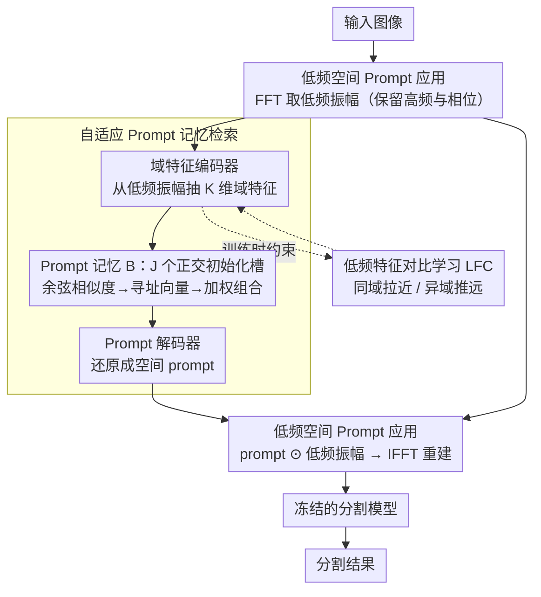

# From Adaptation to Generalization: Adaptive Visual Prompting for Medical Image Segmentation

**会议**: CVPR 2026  
**arXiv**: [2604.17455](https://arxiv.org/abs/2604.17455)  
**代码**: [https://github.com/cetinkayaevren/apex/](https://github.com/cetinkayaevren/apex/)  
**领域**: 医学图像  
**关键词**: 视觉提示, 域适应, 域泛化, 医学图像分割, 低频特征对比学习

## 一句话总结

提出 APEX（Adaptive Prompt EXtraction），通过从可学习 prompt 记忆中自适应检索输入特定的 visual prompt（而非为每个域固定一个 prompt），结合低频特征对比学习增强域间区分能力，显著提升医学图像分割在已见域和未见域上的泛化性能。

## 研究背景与动机

**领域现状**：Visual Prompting (VP) 作为域适应方法在医学图像分割中颇受关注。VP 方法在输入图像空间添加可学习参数，优化后可以将目标域数据映射到预训练模型可处理的空间，由于不修改原始模型参数，天然避免了灾难性遗忘。

**现有痛点**：当前 VP 方法（如 VPT、FVP、A2XP）为每个目标域优化单一 prompt 并统一应用于所有图像。这存在两个根本限制：(1) 忽略域内变异性——同一设备采集的不同图像在采集设置和病理特征上可能差异显著，单一 prompt 过于粗糙；(2) 忽略域间变异性——固定于某域优化的 prompt 难以适配来自不同设备或机构的数据，对未见域的泛化能力有限。

**核心矛盾**：表达力与泛化性的 trade-off——粗粒度的域级 prompt 表达力不足但易于优化，细粒度的输入级 prompt 表达力强但需要更精巧的检索机制。

**本文目标**：设计一种自适应 prompt 提取框架，能够根据每张输入图像的特征动态组合最合适的 prompt，同时保证对已见域和未见域的泛化性。

**切入角度**：医学图像的域偏移主要来源于全局外观变化（对比度、亮度、色调），这些变化编码在频率域的低频分量中。如果能从低频信息中提取域区分性特征，就能精确检索匹配的 prompt。

**核心 idea**：构建包含多样 prompt 向量的记忆库，用基于低频频谱的域特征编码器查询记忆库，通过加权组合得到输入特定的 prompt，同时用低频特征对比学习 (LFC) 增强域间区分性。

## 方法详解

### 整体框架

APEX 要解决的是「一张图配一张 prompt」的问题：传统视觉提示给每个域固定一张 prompt，APEX 则让每张输入图像都能拿到为它量身组合的 prompt。流程上，输入图像先经 FFT 提取低频振幅分量，这部分信号承载了对比度、亮度、色调这类全局外观信息，也正是医学图像域偏移的主要来源。低频振幅送进 APEX 模块，依次经过域特征编码器、prompt 记忆查询（寻址 + 加权组合）、prompt 解码器三步，得到一张空间 prompt；这张 prompt 以元素乘法叠回原始低频振幅，再经 IFFT 重建图像，喂给一个完全冻结的分割模型。训练时再挂一个低频特征对比学习（LFC）分支约束域特征编码器，让检索更准。整个训练里只有 APEX 自己的参数在更新，分割模型一个权重都不动——这也是它能即插即用、又不会引发灾难性遗忘的根本原因。

### 关键设计

**1. 自适应 Prompt 记忆检索：把「域级固定 prompt」换成「按图检索的 prompt」**

传统 VP 的痛点是一个域只优化一张 prompt，既盖不住同域内不同图像的差异，也迁不到训练时没见过的域。APEX 的做法是维护一个 prompt 记忆 $B \in \mathbb{R}^{J \times K}$，里面是 $J$ 个可学习的 prompt 向量，并做正交初始化让这些记忆槽彼此尽量不相关、各自承担不同的知识。对每张输入，域特征编码器 $E^D$ 先从低频振幅里抽出一个 $K$ 维域特征 $z_m^n$，再拿它和每个记忆槽 $b_j$ 算余弦相似度，归一化成寻址向量 $a_m^n$，最后按权重把记忆槽线性组合起来：

$$z_m^{\prime n} = \sum_j a_{m,j}^n \cdot b_j$$

组合出的特征经解码器 $D^P$ 还原成空间 prompt。这种「检索 + 加权组合」之所以比单张 prompt 强，是因为它在特征层面把已有知识自由拼装——哪怕某张未见域图像不完全匹配任何一个记忆槽，也能用几个槽的加权混合逼近它，产生超出任何单一存储 prompt 的适应能力。

**2. 低频特征对比学习（LFC）：让域特征编码器既能分得开域，又能聚得拢同域**

检索质量完全取决于 $z_m^n$ 这个域特征好不好——如果不同域的特征混在一起，寻址向量就会算错、检出错误的 prompt。LFC 专门来管这件事：在域特征上挂一个辅助投影头得到 $z_m^{n,aux}$，用对比损失 $\mathcal{L}_{LFC}$ 把同域样本拉近、异域样本推远，温度参数 $\tau$ 控制相似度的缩放尺度。聚拢同域是为了学到这个域的共享外观特性，推开异域是为了保住跨域的区分边界，两者一起做，域特征才能同时捕获域间差异和域内的精细变异。这个辅助投影头只在训练时用，推理时直接丢弃，不增加部署开销。

**3. 低频空间 Prompt 应用：只动外观、不碰解剖结构**

为什么 prompt 只乘在低频振幅上、而不直接作用于图像像素？因为医学图像的域偏移几乎都落在低频——对比度、亮度这些全局外观会变，而精细的解剖细节和空间布局编码在高频分量和相位里。如果在像素空间或全频段做 prompt，很容易把分割真正依赖的结构信息也一起改坏。APEX 把 prompt 限定为对低频振幅的元素乘法，高频和相位原样保留，于是既能有效抹平域间的外观差异，又不破坏下游分割所需的解剖结构。

### 损失函数 / 训练策略

总损失为分割损失与对比损失之和 $\mathcal{L}_{total} = \mathcal{L}_{Seg} + \mathcal{L}_{LFC}$，其中分割损失用 Dice + Cross-Entropy。记忆 $B$ 和域特征编码器都通过梯度反传更新，编码器同时受这两个损失约束——分割损失保证 prompt 真的有助于分割，对比损失保证域特征本身可分。

## 实验关键数据

### 主实验

| 任务 | Backbone | 域类型 | Source Only | VPAD(最强基线) | APEX |
|------|---------|--------|------------|--------------|------|
| 息肉分割 | UNet | 已见域 Avg | 81.43 | 82.39 | **83.75** |
| 息肉分割 | UNet | 未见域 Avg | 55.16 | 56.31 | **58.03** |
| 息肉分割 | PraNet | 已见域 Avg | 81.44 | 82.45 | **83.75** |
| OC/OD | UNet | 已见域 Avg | 85.08 | 85.88 | **88.43** |
| OC/OD | UNet | 未见域 Avg | 73.46 | 76.76 | **82.57** |

### 消融实验

| 配置 | Dice(已见) | Dice(未见) | 说明 |
|------|-----------|-----------|------|
| APEX (Full) | 最优 | 最优 | 完整方法 |
| w/o LFC | 下降 | 显著下降 | 域间区分性不足 |
| w/o Memory (单一 prompt) | 下降 | 显著下降 | 回退到传统 VP |
| 固定 prompt (非自适应) | 下降 | 下降 | 无法处理域内变异 |

### 关键发现

- 在未见域上的提升尤为显著，例如 OC/OD 任务的 RIM-ONE-r3 域上 UNet 提升 41.44% DICE
- LFC 对未见域泛化贡献最大——表明域特征的区分性是泛化的关键
- APEX 作为即插即用模块，在 5 种不同 backbone 上均一致提升，证明了方法的通用性
- 记忆槽数 J=150 在多数设置下表现最优

## 亮点与洞察

- 从"一域一 prompt"到"一图一 prompt"的范式升级思路清晰且有效。记忆+检索的机制让系统在有限的训练域上学到的 prompt 组件可以自由组合，从而泛化到未见域
- 在低频振幅空间做 prompt 是很有洞察力的设计——既利用了频域的物理可解释性（低频=全局外观=域偏移主因），又保护了分割任务最需要的高频结构信息
- 方法的即插即用特性使其在临床实际中非常实用，任何现有分割模型都可以搭配 APEX 提升跨域性能

## 局限与展望

- 需要多个域的数据来训练 APEX，在域数量很少时记忆多样性可能不足
- 低频 prompt 假设域偏移主要在低频，对于高频域偏移（如不同分辨率）可能效果有限
- 未验证在 3D 医学图像（CT/MRI 体数据）上的有效性
- 改进方向：引入在线 prompt 记忆更新机制以适应测试时遇到的新域

## 相关工作与启发

- **vs VPT/FVP/A2XP**: 传统 VP 方法使用固定域级 prompt，APEX 使用输入级自适应 prompt，在未见域上优势尤为明显
- **vs VPTTA**: 同样使用记忆结构但专门设计用于测试时适应，问题设置不同
- **vs 域适应微调**: 微调会修改模型参数导致灾难性遗忘，APEX 完全不动模型参数

## 评分

- 新颖性: ⭐⭐⭐⭐ 自适应 prompt 检索 + 低频对比学习的组合有创新性
- 实验充分度: ⭐⭐⭐⭐⭐ 两个任务、5 种 backbone、4 种对比方法、已见/未见域全覆盖
- 写作质量: ⭐⭐⭐⭐ 动机推导清晰，方法描述详细
- 价值: ⭐⭐⭐⭐⭐ 即插即用的域泛化方案对医学图像分割非常实用

<!-- RELATED:START -->

## 相关论文

- [\[CVPR 2026\] MedCLIPSeg: Probabilistic Vision-Language Adaptation for Data-Efficient and Generalizable Medical Image Segmentation](medclipseg_probabilistic_vision-language_adaptation_for_data-efficient_and_gener.md)
- [\[CVPR 2026\] BiCLIP: Bidirectional and Consistent Language-Image Processing for Robust Medical Image Segmentation](biclip_bidirectional_and_consistent_language-image_processing_for_robust_medical.md)
- [\[CVPR 2026\] Residual SODAP: Residual Self-Organizing Domain-Adaptive Prompting with Structural Knowledge Preservation for Continual Learning](residual_sodap_residual_self-organizing_domain-adaptive_prompting_with_structura.md)
- [\[CVPR 2026\] Decoupling Vision and Language: Codebook Anchored Visual Adaptation](decoupling_vision_and_language_codebook_anchored_visual_adaptation.md)
- [\[CVPR 2026\] Decoding Matters: Efficient Mamba-Based Decoder with Distribution-Aware Deep Supervision for Medical Image Segmentation](decoding_matters_efficient_mamba-based_decoder_with_distribution-aware_deep_supe.md)

<!-- RELATED:END -->
