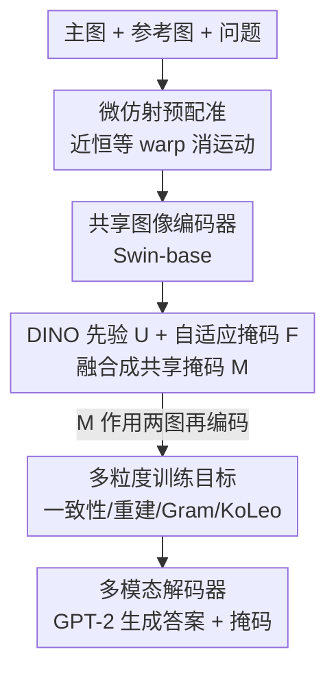

# Attention Consistent Longitudinal Medical Visual Question Answering Guided by Vision Foundation Models

**会议**: CVPR 2026  
**arXiv**: [2606.06534](https://arxiv.org/abs/2606.06534)  
**代码**: 无（论文未提供）  
**领域**: 医学图像 / 多模态VLM  
**关键词**: 纵向医学VQA, 共享显著性掩码, DINO先验, 仿射预配准, 自监督正则

## 一句话总结
针对胸片"前后两次随访对比"的差异型 VQA，本文提出"轻量仿射预配准 + DINO 先验与自适应掩码融合的共享显著性掩码 + 多粒度自/无监督辅助目标"的编码器-解码器框架，让模型在两个时间点看同一块解剖区域，在 Medical-Diff-VQA 上把 METEOR 从 0.389 拉到 0.700，并自带可解释的病灶掩码。

## 研究背景与动机
**领域现状**：医学 VQA 大多沿用自然图像 VQA 的范式，基于预训练视觉/多模态模型回答单张图像的临床问题。但放射科医生的真实工作流是"对比当前片子和既往片子"，判断病情进展、定位变化。纵向差异型 VQA（Diff-VQA）正是把这一工作流形式化：给一对同一病人不同时间点的胸片 + 一个聚焦"差异"的问题，答案的信号往往是**变化本身**而非绝对外观。

**现有痛点**：现有 Diff-VQA 方法（残差对齐 ReAl、区域检索 RegioMix、纵向预训练 PLURAL、差异嵌入 VED 等）有三个共同缺口——(1) 没有**显式约束两个时间点的注意力一致**，模型可能在主图看肺尖、在参考图看膈肌，差异比较就失真；(2) 几乎只做有监督微调，**没挖掘无监督目标**对表示的帮助；(3) 黑箱、缺可解释证据，临床不信任。

**核心矛盾**：差异型问题的答案只取决于一小块"变化的解剖支撑区域" $R$，但两次成像之间存在姿态/尺度的"无关运动"(nuisance motion)，以及背景噪声。要忠实回答差异，必须先让两图几何可比，再让模型在两图**盯住同一块对应区域**——而显著性以往只被当作事后解释，没被当成训练期的内在监督。

**本文目标**：把"显著性一致"做成训练信号，并同时引入无监督目标稳定表示；分解为：① 让两图几何可比；② 用同一张掩码约束两个时间点的注意力；③ 不引入额外标注。

**切入角度**：受自然图像 co-attention 启发——"模型说它关心什么，就应该决定它在两个时间点看哪里"。再借鉴 DINO/DINOv3 的自监督先验与几何正则（Gram anchoring、KoLeo），把视觉基础模型当作病灶候选的先验来源。

**核心 idea**：用一张在两次随访间共享的显著性掩码（DINO 先验 $U$ + 自适应掩码 $F$ 融合）作为训练监督，配合轻量预配准和一组自监督正则，把"在对应解剖上做纵向比较"变成模型的归纳偏置。

## 方法详解

### 整体框架
输入是主图 $I_{\text{main}}$ 与参考图 $I_{\text{ref}}$ 加一个差异型问题，输出是文本答案 + 一张可视化病灶掩码。流程是：先对主图做**近似恒等的仿射预配准**得到 $\widehat{I}_{\text{main}}$，消除姿态/尺度的无关运动；配准后两图过共享图像编码器，分别送入冻结的 DINO 分支（出先验掩码 $U$）和可训练自适应掩码头（出 $F$），按权重 $\lambda$ 融合成**共享掩码** $M$；$M$ 同时作用于两图、再编码，得到的双时间点特征与问题特征拼成多模态前缀，喂给 GPT-2 解码器生成答案。训练期叠加掩码一致性、掩码重建、Gram 纵向一致性、KoLeo 四组辅助损失。

### 关键设计

**1. 微仿射预配准：先消除无关运动，再谈差异**

差异型问题最怕"假差异"——两次拍片病人体位、设备缩放不同，直接逐像素对比会把这些无关运动也当成病情变化。本文用一个浅层 CNN 预测 2D 仿射参数 $\Theta=[A\;\mathbf{t}]\in\mathbb{R}^{2\times3}$，只对主图做可微 grid-sample 配准 $\mathbf{x}=A\mathbf{x}_{\text{tgt}}+\mathbf{t}$。关键是用一个**贴近恒等**的正则压住形变幅度，防止把真病灶也"对齐没了"：

$$\mathcal{L}_{\text{reg}}=w_{\text{sml}}\|\Theta-I\|_F^2+w_{\det}(\det(A)-1)^2+w_{\text{tran}}\|\mathbf{t}\|_2^2$$

其中 $w_{\text{sml}}=10^{-4},\,w_{\det}=10^{-5},\,w_{\text{tran}}=10^{-6}$，分别压住整体偏离恒等、面积缩放、平移。三项权重都极小，意味着只做"微调级"对齐——这正是它叫 *micro* registration 的原因：宁可欠配准，也不破坏真实解剖变化

**2. DINO 先验 + 自适应掩码的双路融合：无标注下既稳又自适应**

要约束注意力却没有像素级标注，单靠可训练掩码容易乱跑，单靠固定先验又不够任务自适应。本文走双路：冻结的 RAD-DINO 分支用 CLS-patch 余弦相似度给出两图注意力图，取并集得**先验** $U=\max(A_{\text{main}},A_{\text{ref}})$，把掩码锚定在"语义/解剖上说得通"的区域；另一路用 3 层 MLP 头 $g(\cdot)$ 从编码特征出每图 token 掩码 $m_{\text{main}},m_{\text{ref}}$，再用 1 层 CNN 门控头 $h(\cdot)$ 融合二者的并/交/差得到自适应 $F$。最终掩码是两者凸组合：

$$M=\lambda U+(1-\lambda)F,\quad \lambda\in[0,1]$$

$\lambda$ 用余弦曲线从初期 $1$ 退火到末期 $0.5$——训练早期完全信 DINO 先验保稳，后期逐渐放权给任务自适应掩码。融合后 $M$ **同时**乘到两图上再编码（$I'_{\text{main}}=M\odot\widehat{I}_{\text{main}}$、$I'_{\text{ref}}=M\odot I_{\text{ref}}$），由此天然保证两个时间点看同一块区域，这就是"注意力一致"的落地

**3. 多粒度自/无监督辅助目标：把显著性和表示几何同时管住**

光有掩码不够，还要让掩码语义可信、让两次随访的表示几何一致、让样本表示不塌缩。本文叠了四组辅助损失，各管一层：掩码一致性 $\mathcal{L}_{\text{mask\_main/ref}}=\frac1N\sum\|f_{\text{mask}}-M f\|_2^2$ 要求"掩码后的特征"约等于"原特征被 $M$ 门控"，把掩码通路绑到其门控对应物上；轻量头重建 $\mathcal{L}_{\text{pred}}=\frac1N\sum\|P(f_{\text{mask}})-f\|_2^2$ 用一个小 MLP 把掩码特征回归回掩码前，保证每次随访单独仍可诊断、约束掩码造成的信息损失；Gram 纵向一致性把主图、参考图的 patch-to-patch 关系拉近 $\mathcal{L}_{\text{gram}}=\|G(f_{\text{main}})-G(f_{\text{ref}})\|_F^2$（$G(X)=\frac1N\hat X\hat X^\top$ 为归一化 Gram），强制两图保持相似空间结构；KoLeo 弥散 $\mathcal{L}_{\text{KoLeo}}=-\frac1B\sum\log(\min_{j\neq i}\|\hat z_i-\hat z_j\|_2+\varepsilon)$ 惩罚 batch 内最近邻过近，防表示塌缩、提升开集鲁棒。这套"有监督语言建模 + 一堆无监督正则同时优化"正是作者主张的——把图像基础模型用于生物医学的范式

### 损失函数 / 训练策略
总损失把语言建模、配准与四类辅助求和：

$$\mathcal{L}_{\text{total}}=\mathcal{L}_{\text{lm}}+\mathcal{L}_{\text{reg}}+\alpha_{\text{mask}}(\mathcal{L}_{\text{mask\_main}}+\mathcal{L}_{\text{mask\_ref}})+\alpha_{\text{pred}}(\mathcal{L}_{\text{pred\_m}}+\mathcal{L}_{\text{pred\_r}})+\alpha_{\text{gram}}(\mathcal{L}_{\text{gram}}+\mathcal{L}_{\text{gram\_mask}})+\alpha_{\text{kl}}\mathcal{L}_{\text{KoLeo}}$$

其中 $\alpha_{\text{mask}}=\alpha_{\text{pred}}=\alpha_{\text{gram}}=0.1$，$\alpha_{\text{kl}}=0.001$。$\mathcal{L}_{\text{lm}}$ 为答案上的 teacher-forcing 交叉熵。**两阶段训练**：第一阶段冻结图像编码器训 4 epoch，让配准、掩码、解码各部件先学会各自分工、不破坏预训练语义；第二阶段解冻编码器再训 4 epoch 全量微调。图像编码器是 Swin-base（patch 4、window 12，ImageNet-21k 预训练后在 MIMIC-CXR + CheXpert 上分类微调），projector 含 1 线性层 + 8 头 transformer + 2 层 MLP 对齐到文本空间，文本编码器 6 层 12 头，解码器为 GPT-2 small，优化器 AdamW（lr $1.5\times10^{-4}$，weight decay 0.05）。论文另给了"掩码合理性"的理论分析：若 $M\equiv\mathbf{1}$ 即退化为无掩码基线，故掩码模型严格包含无掩码模型为特例；并论证理想掩码 $M^\star$ 是答案的充分统计量、对两图施同一 $M$ 等价于在掩码解剖坐标内保留差异 $\Delta I'=M\odot\Delta I$。

## 实验关键数据

数据集 Medical-Diff-VQA（源自 MIMIC-CXR，共 164,223 样本，train/val/test = 131,556/16,278/16,389），输入统一 resize 为三通道 $384\times384$。用 CIDEr 选最终模型。

### 主实验

| 方法 | BLEU-1 | METEOR | ROUGE-L | CIDEr |
|------|--------|--------|---------|-------|
| MCCFormers | 0.214 | 0.319 | 0.340 | 0 |
| IDCPCL | 0.614 | 0.303 | 0.582 | 0.703 |
| EKAID | 0.628 | 0.339 | 0.557 | 1.027 |
| RegioMix | 0.705 | 0.381 | 0.651 | 1.804 |
| PLURAL | 0.704 | 0.381 | 0.653 | 1.832 |
| VED | 0.716 | 0.389 | 0.670 | 2.119 |
| **Ours** | **0.747** | **0.700** | **0.703** | 2.011 |

本文在 BLEU-1（0.747 vs VED 0.716）、ROUGE-L（0.703 vs 0.670）上领先；最显著的是 METEOR 从此前最佳 0.389 跳到 **0.700**，说明在"语义匹配/临床关键信息"上拉开差距。唯一略逊的是 CIDEr 2.011，低于 VED 的 2.119，但仍大幅超过 RegioMix（1.804）、PLURAL（1.832）。

### 消融实验

| 配置 | BLEU-1 | BLEU-4 | METEOR | ROUGE-L | CIDEr | 说明 |
|------|--------|--------|--------|---------|-------|------|
| Ours（完整） | 0.747 | 0.425 | 0.700 | 0.703 | 2.011 | 全组件 |
| − 编码器前 4 epoch 冻结 | 0.711 | 0.388 | 0.689 | 0.682 | 1.714 | 去两阶段训练 |
| − DINO 启发的无监督目标 | 0.699 | 0.390 | 0.690 | 0.671 | （下降） | 去自监督正则 |
| − 显著性注意力掩码 | （明显下降） | — | — | — | — | 直接整图推理 |

### 关键发现
- **显著性掩码最关键**：去掉掩码、直接整图推理时性能"明显下降"，因为模型失去了对病灶/纵向变化区域的聚焦，且掩码一致性损失、掩码重建损失也随之无法引入。
- **两阶段训练贡献显著**：不做前期冻结，CIDEr 从 2.011 掉到 1.714（约 −0.30），说明先稳住视觉表示能给后续模块更有判别力的特征。
- **无监督目标确有增益**：去掉 DINO 启发的无监督正则，BLEU/METEOR/CIDEr 一致下降（CIDEr 由 2.011 降至更低），印证在标注有限的差异胸片场景，额外的无监督表示约束能强化图文对齐。
- 定性分析里掩码能在两图上同时框住关键区域，提供事后无关的内在可解释证据；但作者也观察到掩码下仍露出"墙外"非解剖兴趣点，模型可能借非解剖区域走捷径。

## 亮点与洞察
- **共享掩码 = 把"注意力一致"做成可微监督**：对两个时间点施加同一个 $M$，从结构上逼模型在对应解剖上做比较，而不是靠事后 Grad-CAM 解释，这一步把可解释性从"事后"前移到"训练期内在监督"，很巧。
- **DINO 先验 + 自适应掩码的退火融合**（$\lambda:1\to0.5$）兼顾稳定与任务自适应——早期信基础模型先验保不跑偏、后期放权给任务驱动，这种"先验→后验"退火思路可迁移到任何"无标注但想约束注意力"的任务。
- **把 DINOv3 的 Gram anchoring 改造成跨时间点一致性**：原本是 teacher-student 间的 Gram 约束，这里改成主图-参考图之间，复用得很聪明，是直接可借鉴的 trick。
- **"微配准"的克制**：用极小权重把仿射限制在近恒等，避免"对齐过度抹掉真病灶"，这种"宁欠勿过"的正则设计在医学配准里很有参考价值。

## 局限与展望
- **CIDEr 不及 VED**：在 TF-IDF 共识指标上仍落后 SOTA，作者自己也指出现有通用 VQA 指标不适配医学领域，呼吁设计加权关键医学术语的新指标——METEOR 的暴涨与 CIDEr 的小幅落后并存，需谨慎解读"全面领先"。⚠️ 不同指标侧重不同，单看 METEOR 跃升不宜外推为整体碾压。
- **捷径风险**：掩码下仍可见非解剖兴趣点，模型可能利用背景协变量走捷径，跨数据分布时鲁棒性存疑；作者建议未来用 DINOv3 进一步约束/重分配注意力。
- **仅验证胸片 + 仿射配准**：方法绑定 2D 胸片与近恒等仿射，对形变更大、3D/多模态（CT、MRI）场景能否成立未验证。
- **辅助损失多、权重需手调**：四组辅助 + 配准正则共 7~8 个权重项，$\alpha$ 取值靠经验设定，缺乏敏感性分析。

## 相关工作与启发
- **vs VED（差异嵌入）**：VED 给主/参考图各学一个 $d$ 维差异向量、加到所有视觉 token 上让解码区分两图；本文用共享显著性掩码从空间上约束"看哪里"。VED 在 CIDEr 上更高（2.119），本文在 METEOR/BLEU-1/ROUGE-L 上更优且自带可解释掩码。
- **vs ReAl（残差对齐）**：ReAl 在特征/像素空间做残差对齐显式高亮差异；本文先做几何预配准再用掩码聚焦，且额外引入自监督正则，差异信号来自"同区域比较"而非残差。
- **vs RegioMix（区域检索）**：RegioMix 靠检索问题相关区域再生成，依赖检索质量；本文的掩码由 DINO 先验 + 任务自适应端到端产生，无需检索库与额外标注。
- **vs 事后显著性（Grad-CAM 等）**：以往把显著性当事后解释、且在胸片病灶定位上精度/稳定性有限；本文把显著性当训练期内在监督，既提性能又提供可信证据。

## 评分
- 新颖性: ⭐⭐⭐⭐ 共享掩码做注意力一致监督 + 把 DINOv3 自监督正则迁到纵向 VQA，组合新颖但多为已有模块的巧妙拼装。
- 实验充分度: ⭐⭐⭐⭐ 大规模基准 + 6 个强基线 + 3 项消融，但缺超参敏感性与多数据集/多模态验证。
- 写作质量: ⭐⭐⭐⭐ 框架与公式清晰，含掩码合理性理论分析；术语略密集。
- 价值: ⭐⭐⭐⭐ 自带可解释病灶掩码、无需额外标注，对临床可信度有实际意义。

<!-- RELATED:START -->

## 相关论文

- [\[CVPR 2026\] Dual-Level Confidence based Implicit Self-Refinement for Medical Visual Question Answering](dual-level_confidence_based_implicit_self-refinement_for_medical_visual_question.md)
- [\[CVPR 2026\] MR-RAG: Multimodal Relevance-Aware Retrieval-Augmented Generation for Medical Visual Question Answering](mr-rag_multimodal_relevance-aware_retrieval-augmented_generation_for_medical_vis.md)
- [\[CVPR 2026\] Delving Aleatoric Uncertainty in Medical Image Segmentation via Vision Foundation Models](delving_aleatoric_uncertainty_in_medical_image_segmentation_via_vision_foundatio.md)
- [\[AAAI 2026\] Q-FSRU: Quantum-Augmented Frequency-Spectral Fusion for Medical Visual Question Answering](../../AAAI2026/medical_imaging/q-fsru_quantum-augmented_frequency-spectral_fusion_for_medical_visual_question_a.md)
- [\[CVPR 2026\] Forging a Dynamic Memory: Retrieval-Guided Continual Learning for Generalist Medical Foundation Models](forging_a_dynamic_memory_retrieval-guided_continual_learning_for_generalist_medi.md)

<!-- RELATED:END -->
