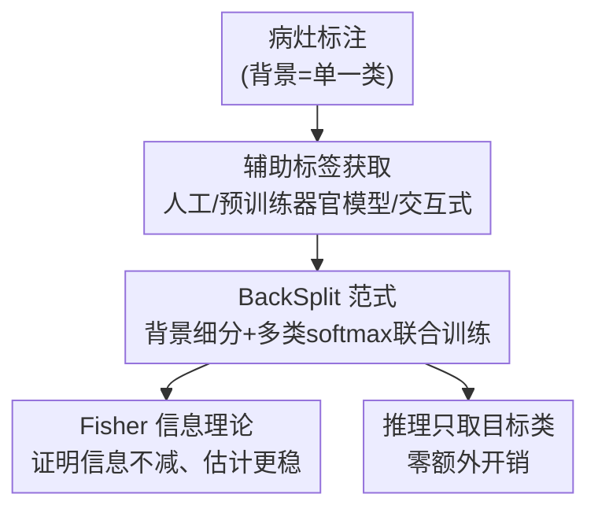

# BackSplit: The Importance of Sub-dividing the Background in Biomedical Lesion Segmentation

**会议**: CVPR 2026  
**arXiv**: [2511.19394](https://arxiv.org/abs/2511.19394)  
**代码**: 有（Project Page，论文未给出仓库链接）  
**领域**: 医学图像  
**关键词**: 病灶分割, 背景细分, Fisher 信息, 辅助监督, 标签粒度

## 一句话总结
论文提出 BackSplit：把病灶分割里被一锅端的「背景」拆成有语义的辅助器官/组织类、做多类 softmax 联合训练，用 Fisher 信息理论证明这比二分类训练保留更多信息、估计更稳，并在 5 个数据集上一致提升小病灶 Dice，且推理零额外开销。

## 研究背景与动机
**领域现状**：医学图像里的病灶分割（肿瘤、囊肿、结节）长期是难题。主流改进路线集中在三件事上——设计更好的网络架构、设计专门的损失函数（focal、Tversky 等）、做任务定制的数据增强，外加堆更多标注数据。这些都把注意力放在「模型怎么学」上。

**现有痛点**：病灶通常很小、空间上零散出现、在数据集分布里严重欠表达，导致模型频繁产生假阳性、预测不稳定，临床上难落地。而几乎所有这些方法都共享一个默认设定：把所有非病灶像素塌缩成单一的「背景」类。

**核心矛盾**：这个「背景」其实极度异质——它由各种组织、器官、解剖结构组成，但二分类训练把它们全压成一个标签，丢掉了病灶赖以判别的解剖上下文。换句话说，问题不只在模型一侧，还在**标签空间**一侧：粗化的背景标签本身就丢失了信息。

**本文目标**：在不改架构、不加推理成本的前提下，通过改造标签空间把丢失的上下文信息补回来；并从理论上说清「为什么细分背景一定有帮助」。

**切入角度**：作者借鉴「标签粗化（label coarsening）」的统计视角——把多类标签塌缩成二类，等价于在似然的曲率上做了一次投影，必然损失信息。既然现在有大量预训练分割模型可以**自动**推断器官掩码，那么细分背景在工程上也变得廉价可行。

**核心 idea**：用「多类背景监督」代替「单一背景」来训练病灶分割，把背景拆成语义辅助类、和病灶目标一起进 softmax 联合优化——这就是 BackSplit。

## 方法详解

### 整体框架
BackSplit 本质是一个**训练范式**而非新架构：输入还是原来的病灶标注，输出推理时还是只预测目标病灶；唯一的改动发生在训练标签上——把原本的「背景」一类，替换成若干语义辅助结构类（病灶周围的器官/组织），让网络在统一的 softmax 里同时学习目标类和这些辅助类。推理时辅助类不输出、不计开销，但它们在训练期注入的上下文知识已隐式留在权重里，使病灶边界更锐、假阳性更少。

整条管线有三步：① 拿到辅助标签（人工标注 / 用预训练器官分割模型自动推断 / 用交互式模型从少量点击生成的噪声标签）；② 把目标病灶类与辅助类拼成多类标签，做标准 softmax 联合训练；③ 推理只取目标类通道。理论侧则用 Fisher 信息证明这套范式相对二分类训练的统计优越性。

### 关键设计

**1. BackSplit 范式：把单一背景拆成语义辅助类做联合监督**

针对的痛点是二分类训练把背景一锅端、丢掉解剖上下文，导致小病灶假阳性多。BackSplit 的做法极简：不改网络、不加分支、不设额外的多任务损失，只在标签层面把背景分解成若干「支撑结构」类（如肾囊肿任务里加入 Kidney、Tumor 两类，胰腺肿瘤任务里加入 Pancreas），然后让目标病灶类和这些辅助类一起进同一个 softmax 做多类分割。为什么有效：当模型被要求区分「肾脏」和「肿瘤」而不只是「病灶 vs 非病灶」时，它必须学到病灶相对周围解剖的判别特征；这种上下文是在**标签空间**里习得的，因此天然架构无关、能直接套到任意 backbone 上。和那些靠额外网络分支或手工先验注入上下文的 context-aware 方法相比，BackSplit 几乎零工程成本，且推理阶段把辅助通道丢掉就行，不增加任何参数与算力

**2. Fisher 信息理论：证明标签粗化只会丢信息、细分必然更优**

这是论文区别于以往「经验上有效」工作的核心贡献——给出了**为什么**的严格解释。把目标类记作 $c$，二分类标签 $Z=\mathbb{1}\{Y=c\}$ 是对多类标签 $Y$ 的一次确定性粗化。论文先用 Lemma 1（Score Projection）证明粗化后的得分函数是完整得分在 $(Z,X)$ 上的条件期望（即 $L^2$ 最优投影），随后给出 Theorem 1 的信息分解：

$$\mathcal{I}_Y(\theta)=\mathcal{I}_Z(\theta)+\mathbb{E}_\theta\!\big[\operatorname{Var}(s_Y(\theta)\mid Z,X)\big]\succeq\mathcal{I}_Z(\theta)$$

即多类训练的期望 Fisher 信息总不小于二分类（在 Loewner 半正定序意义下），多出来的那项恰是「塌缩掉的类间梯度方差」。直觉上：当「器官 A」和「器官 B」即便都属于「非病灶」却产生不同的梯度方向时，二分类把它们平均掉，抹去了参数空间里的曲率方向、从而损失信息。论文还在 softmax 下给出闭式分解（Proposition 1），把信息缺口具体到 logit 几何里。配套的 Corollary 1（Delta 方法）把它推到预测层面——多类 MLE 的渐近协方差 $\mathcal{I}_Y^{-1}\preceq\mathcal{I}_Z^{-1}$，所以收敛更快、预测方差更小、估计更稳

**3. 廉价且抗噪的辅助标签来源：从人工到自动到交互式都成立**

第 1 点要成立，前提是拿得到辅助标签，但人工勾画器官每例要数小时、不现实。这一设计是把范式落地的关键：辅助标签可以来自三档越来越廉价的来源——(a) 数据集自带的人工器官标注（受控对比）；(b) 用在大规模数据（AbdomenAtlas1.0Mini）上预训练的器官分割模型、或 TotalSegmentator / VIBE-Segmentator 这类大模型**自动推断**；(c) 用交互式模型 nnInteractive 从每个结构 7/10 个随机正点击生成的**噪声**伪标签。关键发现是：哪怕辅助标签是自动生成甚至相当不准的，BackSplit 依旧带来一致增益。为什么有效：理论只要求「非目标类之间存在可区分的梯度结构」就能涨 Fisher 信息，并不要求辅助标签像素级完美——这解释了它对标签噪声的鲁棒性，也让它在没有器官标注的真实场景里可直接部署

### 损失函数 / 训练策略
没有自定义损失，就是标准多类 softmax 分割训练。三个 backbone（U-Net、nnU-Net 框架下的 ResEnc U-Net、SegResNet）全部沿用 nnU-Net 自动配置，并强制 baseline 与 BackSplit 用**完全相同**的架构与超参做公平对比；主结果均用 5 折交叉验证。

## 实验关键数据

### 主实验
在 5 个跨 CT / MRI / PET、覆盖腹部/胸部/全身的数据集上验证。下表为有 ground-truth 辅助标签的受控对比（U-Net 列，Dice↑ / HD-95↓ / NSD↑）：

| 数据集 (目标类) | 指标 | Baseline | +BackSplit |
|--------|------|------|----------|
| KiTS23 (Cyst) | Dice | 0.1787 | **0.4573** |
| KiTS23 (Cyst) | HD-95 | 428.41 | **267.27** |
| KiTS23 (Cyst) | NSD | 0.1695 | **0.6004** |
| PANTHER-MR (Tumor) | Dice | 0.4784 | **0.5251** |
| NSCLC-Radiomics (GTV) | Dice | 0.4969 | **0.5256** |

KiTS23 囊肿任务提升最猛——Dice 几乎 2.5 倍（0.18→0.46），NSD 从 0.17 飙到 0.60，正是因为囊肿小、上下文（肾脏、肿瘤）帮助最大。三个架构（U-Net / ResEncU-Net / SegResNet）上结论一致，参数量分文未增。

辅助标签改为**自动生成**（预训练器官模型）后仍稳定有效：

| 数据集 | 指标 | Baseline | +BackSplit |
|--------|------|------|----------|
| AutoPET (Tumor, CT+PET) | Dice | 0.3881 | **0.4435** |
| MSWAL (全病灶均值) | Dice | 0.2724 | **0.3190** |
| MSWAL (全病灶均值) | NSD | 0.5577 | **0.6218** |

### 消融实验
辅助标签来源的鲁棒性（KiTS23，U-Net，单折，Dice）：

| 配置 | KiTS Dice | 说明 |
|------|---------|------|
| Regular Training | 0.2033 | 二分类基线 |
| BackSplit (干净辅助标签) | **0.5297** | 完整范式 |
| BackSplit + nnInteractive 7 点击 | 0.4919 | 噪声交互式伪标签 |
| BackSplit + nnInteractive 10 点击 | 0.4921 | 噪声交互式伪标签 |

大模型推断标签的对比（AutoPET，单折，Dice）：Regular 0.3921 → BackSplit 0.4537 → +TotalSegmentator 0.4456 → +VIBE-Segmentator 0.4314——即便换不同自动分割器，全都高于二分类基线。

### 关键发现
- 增益最大的是**最小、上下文最关键**的病灶（KiTS 囊肿 Dice +0.28、NSD +0.43），印证「背景上下文对小病灶帮助最大」的核心假设。
- 辅助标签**噪声容忍度高**：nnInteractive 仅靠 7-10 个点击生成的粗糙伪标签，仍把 KiTS Dice 从 0.20 拉到 ~0.49，与理论「只要非目标类梯度有差异就涨信息」吻合。
- **微调也吃这套**：把已训好的二分类 U-Net 接上辅助结构继续 fine-tune，50 epoch 即见提升，250 epoch 时 Dice 近乎翻倍。
- 部分监督下有个有趣拐点：辅助标注比例很低时模型初期反而变差（目标与辅助结构混淆），随比例线性增加逐步恢复并超过基线。

## 亮点与洞察
- 把「改模型」的惯性思维换成「改标签」：同一份图像、同一个网络，只是不再把背景一锅端，就能白嫖一截性能且推理零开销——这是最让人「啊哈」的地方。
- 罕见地给一个简单经验技巧配了**严格理论**：Fisher 信息分解 + Delta 方法，把「细分背景有用」从玄学变成可证命题，Theorem 1 的「塌缩 = 抹掉类间梯度方差」直觉特别干净。
- 对标签噪声的鲁棒性是工程上的关键卖点：辅助标签可以由 TotalSegmentator 这类现成大模型一键生成，几乎消除了落地门槛。
- 思路可迁移：任何「目标类稀少 + 背景异质」的分割/检测任务（遥感小目标、工业缺陷）都可以照搬「细分背景为语义辅助类」的套路来注入上下文。

## 局限与展望
- 作者承认理论建立在**大样本**假设上：细标签粒度增大 Fisher 曲率，但在小数据场景可能放大采样噪声、招致过拟合——尽管在常见医学数据规模上没观测到。
- 没有回答「**哪些**辅助结构贡献最大」——目前是把目标周围器官都拉进来，缺少对辅助类选择的分析，可能存在冗余甚至干扰（部分监督实验里初期掉点已露苗头）。
- 多数主实验是单一 U-Net/单折（Tab. 3/4），跨架构 + 5 折只在干净标签场景做，自动/噪声标签下的统计稳健性证据相对单薄。
- 未来方向：用语言/代理表征（如文本提示「liver」「kidney」）替代显式分割来提供解剖上下文，省掉辅助掩码这一步。

## 相关工作与启发
- **vs 多头架构（multi-head）**：多头法在二分类框架里近似多类、每个头独立预测一个掩码，能用不完整标签训练，但忽略类间依赖、边界不一致；BackSplit 用统一 softmax 显式建模类间关系，边界更连贯。
- **vs context-aware / 辅助监督方法**（anatomy-prompted、多尺度、形状正则）：它们靠额外网络分支、显式多任务损失或手工先验注入上下文；BackSplit 只在标签空间做文章，架构无关、零额外结构成本，并首次给出理论解释「为什么」。
- **vs 标签粗化（label coarsening）研究**：以往工作多在经验上探讨粗/细标签的取舍、缺统计效率的理论；本文把标签粒度直接连到期望 Fisher 信息，证明细分背景能可证地提升估计稳定性与精度。

## 评分
- 新颖性: ⭐⭐⭐⭐⭐ 「改标签而非改模型」+ Fisher 信息证明，视角清新且有理论支撑
- 实验充分度: ⭐⭐⭐⭐ 5 数据集 3 架构 + 自动/交互式标签鲁棒性齐全，但跨架构 5 折仅限干净标签场景
- 写作质量: ⭐⭐⭐⭐⭐ 理论推导清晰、动机讲得透，图文配合好
- 价值: ⭐⭐⭐⭐⭐ 简单、即插即用、推理零开销，临床落地友好，可迁移性强

<!-- RELATED:START -->

## 相关论文

- [\[CVPR 2026\] Focus on Background: Exploring SAM's Potential in Few-shot Medical Image Segmentation with Background-centric Prompting](focus_on_background_exploring_sams_potential_in_few-shot_medical_image_segmentat.md)
- [\[CVPR 2026\] MambaLiteUNet: Cross-Gated Adaptive Feature Fusion for Robust Skin Lesion Segmentation](mambaliteunet_cross-gated_adaptive_feature_fusion_for_robust_skin_lesion_segment.md)
- [\[CVPR 2026\] Instruction-Guided Lesion Segmentation for Chest X-rays with Automatically Generated Large-Scale Dataset](instruction-guided_lesion_segmentation_for_chest_x-rays_with_automatically_gener.md)
- [\[CVPR 2026\] IBISAgent: Reinforcing Pixel-Level Visual Reasoning in MLLMs for Universal Biomedical Object Referring and Segmentation](ibisagent_reinforcing_pixel-level_visual_reasoning_in_mllms_for_universal_biomed.md)
- [\[CVPR 2026\] From Panel to Pixel: Zoom-In Vision-Language Pretraining from Biomedical Scientific Literature](from_panel_to_pixel_zoom-in_vision-language_pretraining_from_biomedical_scientif.md)

<!-- RELATED:END -->
